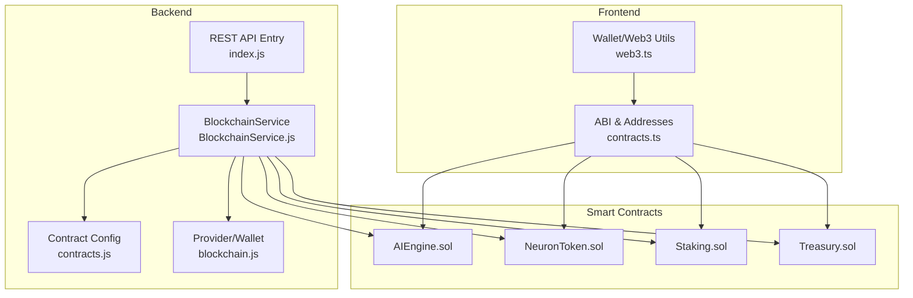
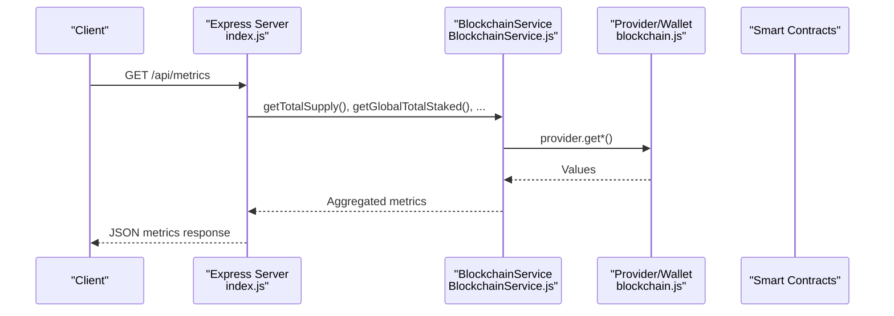
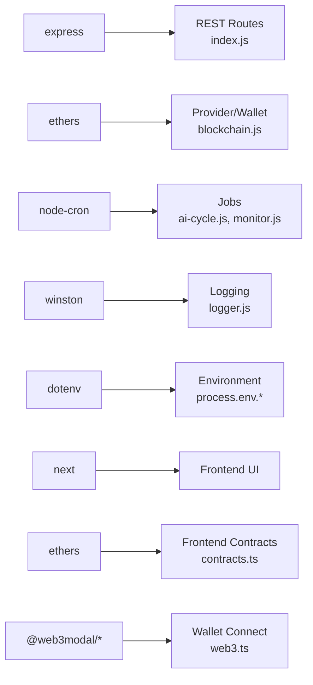
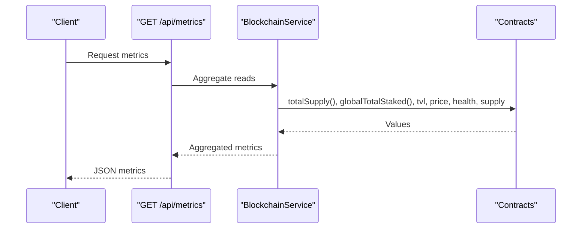
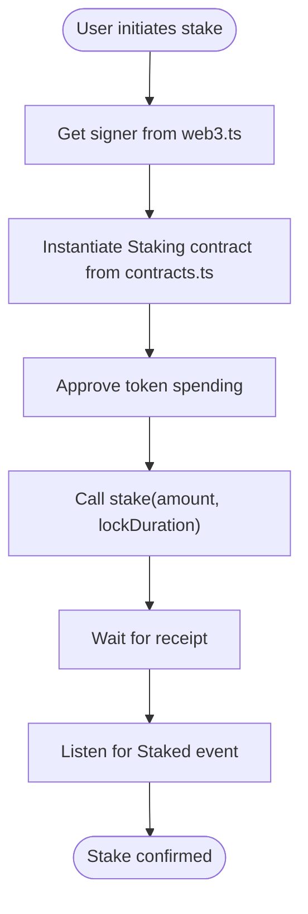

# API Reference

<cite>
**Referenced Files in This Document**
- [index.js](file://neurafinance/backend/src/index.js)
- [BlockchainService.js](file://neurafinance/backend/src/services/BlockchainService.js)
- [contracts.js](file://neurafinance/backend/src/config/contracts.js)
- [blockchain.js](file://neurafinance/backend/src/config/blockchain.js)
- [contracts.ts](file://neurafinance/frontend/src/utils/contracts.ts)
- [web3.ts](file://neurafinance/frontend/src/utils/web3.ts)
- [NeuronToken.json](file://neurafinance/artifacts/contracts/core/NeuronToken.sol/NeuronToken.json)
- [Staking.json](file://neurafinance/artifacts/contracts/core/Staking.sol/Staking.json)
- [AIEngine.json](file://neurafinance/artifacts/contracts/ai-engine/AIEngine.sol/AIEngine.json)
- [package.json](file://neurafinance/backend/package.json)
- [package.json](file://neurafinance/frontend/package.json)
- [ai-cycle.js](file://neurafinance/backend/src/jobs/ai-cycle.js)
- [monitor.js](file://neurafinance/backend/src/jobs/monitor.js)
- [alerts.js](file://neurafinance/backend/src/utils/alerts.js)
- [logger.js](file://neurafinance/backend/src/utils/logger.js)
</cite>

## Table of Contents
1. [Introduction](#introduction)
2. [Project Structure](#project-structure)
3. [Core Components](#core-components)
4. [Architecture Overview](#architecture-overview)
5. [Detailed Component Analysis](#detailed-component-analysis)
6. [Dependency Analysis](#dependency-analysis)
7. [Performance Considerations](#performance-considerations)
8. [Troubleshooting Guide](#troubleshooting-guide)
9. [Conclusion](#conclusion)
10. [Appendices](#appendices)

## Introduction
This document provides a comprehensive API reference for the NeuraFinance platform, covering both the backend REST API and the smart contract interfaces. It describes HTTP endpoints, request/response schemas, authentication, error handling, rate limiting considerations, and versioning. It also documents standardized ABI definitions, function signatures, and parameter specifications for core contracts, along with protocol-specific examples, security considerations, performance optimization tips, debugging approaches, and migration guidance.

## Project Structure
The NeuraFinance project consists of:
- A Node.js backend exposing REST endpoints and orchestrating blockchain interactions
- Smart contracts deployed on Polygon, with standardized ABIs
- A Next.js frontend integrating wallet connectivity and contract interactions



**Diagram sources**
- [index.js:1-177](file://neurafinance/backend/src/index.js#L1-L177)
- [BlockchainService.js:1-216](file://neurafinance/backend/src/services/BlockchainService.js#L1-L216)
- [contracts.js:1-146](file://neurafinance/backend/src/config/contracts.js#L1-L146)
- [blockchain.js:1-33](file://neurafinance/backend/src/config/blockchain.js#L1-L33)
- [contracts.ts:1-148](file://neurafinance/frontend/src/utils/contracts.ts#L1-L148)
- [web3.ts:1-118](file://neurafinance/frontend/src/utils/web3.ts#L1-L118)

**Section sources**
- [index.js:1-177](file://neurafinance/backend/src/index.js#L1-L177)
- [BlockchainService.js:1-216](file://neurafinance/backend/src/services/BlockchainService.js#L1-L216)
- [contracts.js:1-146](file://neurafinance/backend/src/config/contracts.js#L1-L146)
- [blockchain.js:1-33](file://neurafinance/backend/src/config/blockchain.js#L1-L33)
- [contracts.ts:1-148](file://neurafinance/frontend/src/utils/contracts.ts#L1-L148)
- [web3.ts:1-118](file://neurafinance/frontend/src/utils/web3.ts#L1-L118)

## Core Components
- REST API server built with Express.js
- BlockchainService abstraction layer for contract interactions
- Standardized ABIs and contract addresses for frontend integration
- Background jobs for AI cycles and monitoring

Key runtime dependencies:
- Backend: Express, Ethers.js, node-cron, winston, dotenv
- Frontend: Next.js, Ethers.js, @web3modal

**Section sources**
- [package.json:1-28](file://neurafinance/backend/package.json#L1-L28)
- [package.json:1-39](file://neurafinance/frontend/package.json#L1-L39)

## Architecture Overview
The backend exposes REST endpoints that query blockchain state via a provider/wallet abstraction. Responses are JSON-formatted and include timestamps. The frontend integrates wallet providers and interacts with contracts using standardized ABIs.



**Diagram sources**
- [index.js:43-75](file://neurafinance/backend/src/index.js#L43-L75)
- [BlockchainService.js:40-94](file://neurafinance/backend/src/services/BlockchainService.js#L40-L94)
- [blockchain.js:5-25](file://neurafinance/backend/src/config/blockchain.js#L5-L25)

## Detailed Component Analysis

### REST API Endpoints

#### GET /health
- Description: Returns system health and block number
- Authentication: None
- Response fields:
  - status: "healthy" or "unhealthy"
  - blockNumber: latest block number
  - healthScore: system health score
  - timestamp: ISO date-time
- Error responses:
  - 503 with error details when blockchain queries fail

Example response:
```json
{
  "status": "healthy",
  "blockNumber": "4206900",
  "healthScore": "87",
  "timestamp": "2024-01-01T00:00:00Z"
}
```

**Section sources**
- [index.js:22-41](file://neurafinance/backend/src/index.js#L22-L41)

#### GET /api/metrics
- Description: Returns system-wide metrics
- Authentication: None
- Response fields:
  - totalSupply, totalStaked, tvl, tokenPrice, healthScore, stablecoinSupply
  - timestamp: ISO date-time
- Error responses:
  - 500 with error message on failure

Example response:
```json
{
  "totalSupply": "1234567890000000000000000",
  "totalStaked": "987654321000000000000000",
  "tvl": "50000000000000000000000",
  "tokenPrice": "1200000000000000000",
  "healthScore": "87",
  "stablecoinSupply": "100000000000000000000000",
  "timestamp": "2024-01-01T00:00:00Z"
}
```

**Section sources**
- [index.js:43-75](file://neurafinance/backend/src/index.js#L43-L75)

#### GET /api/price
- Description: Returns current token price and stability
- Authentication: None
- Response fields:
  - price: current price scaled by 1e18
  - isStable: boolean indicating price stability
  - deviation: percentage deviation
  - timestamp: ISO date-time
- Error responses:
  - 500 with error message on failure

Example response:
```json
{
  "price": "1200000000000000000",
  "isStable": true,
  "deviation": "2.1",
  "timestamp": "2024-01-01T00:00:00Z"
}
```

**Section sources**
- [index.js:77-93](file://neurafinance/backend/src/index.js#L77-L93)

#### GET /api/treasury
- Description: Returns total value locked (TVL)
- Authentication: None
- Response fields:
  - tvl: TVL value scaled by 1e18
  - timestamp: ISO date-time
- Error responses:
  - 500 with error message on failure

Example response:
```json
{
  "tvl": "50000000000000000000000",
  "timestamp": "2024-01-01T00:00:00Z"
}
```

**Section sources**
- [index.js:95-108](file://neurafinance/backend/src/index.js#L95-L108)

#### GET /api/staking
- Description: Returns staking statistics
- Authentication: None
- Response fields:
  - totalStaked, totalSupply: values scaled by 1e18
  - stakingRatio: percentage (computed as totalStaked/totalSupply * 100)
  - timestamp: ISO date-time
- Error responses:
  - 500 with error message on failure

Example response:
```json
{
  "totalStaked": "987654321000000000000000",
  "totalSupply": "1234567890000000000000000",
  "stakingRatio": "80.00",
  "timestamp": "2024-01-01T00:00:00Z"
}
```

**Section sources**
- [index.js:110-131](file://neurafinance/backend/src/index.js#L110-L131)

#### POST /api/admin/ai-cycle *(Development Only)*
- Description: Manually triggers the AI cycle (admin endpoint)
- Authentication: Not implemented in code; intended for development
- Response fields:
  - success: boolean
  - message: status text
- Error responses:
  - 500 with error message on failure

Note: In production, add authentication middleware before enabling this endpoint.

**Section sources**
- [index.js:133-143](file://neurafinance/backend/src/index.js#L133-L143)

### Smart Contract Interfaces

#### AI Engine (AIEngine)
Core functions:
- getSystemHealth(): view → uint256
- getCurrentPrice(): view → uint256
- checkPriceStability(): view → (bool isStable, uint256 deviation)
- triggerSystemUpdate(): nonpayable → ()
- calculateEmission(uint256 totalSupply, uint256 stakedAmount): view → uint256
- validateMintRequest(uint256 amount): view → bool
- validateSupplyHealth(): view → bool
- getMaxMintable(): view → uint256
- setUpdateInterval(uint256 interval): nonpayable → ()
- setTargetSupplyRatio(uint256 ratio): nonpayable → ()
- requestMint(uint256 amount): nonpayable → ()
- requestBurn(uint256 amount): nonpayable → ()
- triggerBuyback(uint256 amount): nonpayable → ()
- triggerSellPressure(uint256 amount): nonpayable → ()
- collectFees(): nonpayable → ()
- reinvestToLiquidity(uint256 amount): nonpayable → ()
- distributeToTreasury(uint256 amount): nonpayable → ()
- adjustEmissionRate(): nonpayable → ()
- adjustRewardRates(): nonpayable → ()

Events:
- SystemUpdateTriggered(uint256 timestamp, uint256 healthScore)
- EmissionCalculated(uint256 amount, uint256 timestamp)
- BuybackTriggered(uint256 amount, uint256 price)
- FeesCollected(uint256 amount)
- SupplyValidated(bool healthy, uint256 ratio)
- ParametersAdjusted(uint256 emissionRate, uint256 rewardRate)

**Section sources**
- [AIEngine.json:1-667](file://neurafinance/artifacts/contracts/ai-engine/AIEngine.sol/AIEngine.json#L1-L667)

#### Neuron Token (NeuronToken)
Core functions:
- totalSupply(): view → uint256
- balanceOf(address account): view → uint256
- transfer(address recipient, uint256 amount): returns bool
- approve(address spender, uint256 amount): returns bool
- mint(address to, uint256 amount): nonpayable → ()
- burn(uint256 amount): nonpayable → ()
- setFeeRecipients(address treasury, address liquidity, address rewards): nonpayable → ()
- setFeePercentages(uint256 buyFee, uint256 sellFee): nonpayable → ()
- whitelistAddress(address account, bool isWhitelisted): nonpayable → ()
- isWhitelisted(address account): view → bool

Events:
- Transfer(address indexed from, address indexed to, uint256 value)
- Approval(address indexed owner, address indexed spender, uint256 value)
- Mint(address indexed to, uint256 amount)
- Burn(address indexed from, uint256 amount)

**Section sources**
- [NeuronToken.json:1-784](file://neurafinance/artifacts/contracts/core/NeuronToken.sol/NeuronToken.json#L1-L784)

#### Staking (Staking)
Core functions:
- stake(uint256 amount, uint256 lockDuration): nonpayable → ()
- unstake(uint256 stakeId): nonpayable → ()
- claimRewards(uint256 stakeId): nonpayable → ()
- compoundRewards(uint256 stakeId): nonpayable → ()
- getStakeInfo(address user, uint256 stakeId): view → tuple
- getTotalStaked(address user): view → uint256
- getPendingRewards(address user, uint256 stakeId): view → uint256
- globalTotalStaked(): view → uint256
- setRewardRates(uint256 flexibleRate, uint256[] bondRates): nonpayable → ()
- setRewardsPool(address rewardsPool): nonpayable → ()
- setReferralContract(address _referral): nonpayable → ()
- setPaused(bool _paused): nonpayable → ()

Events:
- Staked(address indexed user, uint256 indexed stakeId, uint256 amount, uint256 lockDuration)
- Unstaked(address indexed user, uint256 indexed stakeId, uint256 amount)
- RewardsClaimed(address indexed user, uint256 indexed stakeId, uint256 amount)
- RewardsCompounded(address indexed user, uint256 indexed stakeId, uint256 amount)

**Section sources**
- [Staking.json:1-796](file://neurafinance/artifacts/contracts/core/Staking.sol/Staking.json#L1-L796)

#### Treasury (Treasury)
Core functions:
- deposit(address token, uint256 amount): nonpayable → ()
- withdraw(address token, uint256 amount, address recipient): nonpayable → ()
- getBalance(address token): view → uint256
- getTotalValueLocked(): view → uint256
- getTokenPrice(): view → uint256
- executeBuyback(uint256 amount): nonpayable → ()
- addLiquidity(uint256 tokenAmount, uint256 stableAmount): nonpayable → ()
- authorizedCallers(address): view → bool
- authorizeCaller(address caller): nonpayable → ()
- revokeCaller(address caller): nonpayable → ()
- owner(): view → address
- acceptOwnership(): nonpayable → ()

Events:
- Deposit(address indexed token, uint256 amount, address indexed from)
- Withdrawal(address indexed token, uint256 amount, address indexed to)
- BuybackExecuted(uint256 amount, uint256 price)

**Section sources**
- [contracts.js:20-35](file://neurafinance/backend/src/config/contracts.js#L20-L35)

### Frontend Integration

#### ABI and Contract Addresses
- NEURON_TOKEN_ABI, STAKING_ABI, TREASURY_ABI, DAO_ABI, REFERRAL_ABI, AI_ENGINE_ABI
- CONTRACTS: NEURON_TOKEN, STAKING, TREASURY, LENDING, DAO, REFERRAL, AI_ENGINE

Usage pattern:
- Import ABI and addresses from frontend contracts utility
- Instantiate contracts using wallet/signer from web3 utility

**Section sources**
- [contracts.ts:1-148](file://neurafinance/frontend/src/utils/contracts.ts#L1-L148)

#### Web3 Utilities
- getProvider(), getSigner(), getContract()
- connectWallet(), getAccount(), switchNetwork()
- Network constants for Polygon/Mumbai

**Section sources**
- [web3.ts:1-118](file://neurafinance/frontend/src/utils/web3.ts#L1-L118)

## Dependency Analysis
Backend dependencies and their roles:
- express: HTTP server and routing
- ethers: Ethereum provider, wallet, and contract interaction
- node-cron: scheduling background jobs
- winston: structured logging
- dotenv: environment configuration

Frontend dependencies:
- next: React framework
- ethers: wallet and contract interactions
- @web3modal: wallet connection UI



**Diagram sources**
- [package.json:12-20](file://neurafinance/backend/package.json#L12-L20)
- [package.json:11-29](file://neurafinance/frontend/package.json#L11-L29)
- [index.js:6-11](file://neurafinance/backend/src/index.js#L6-L11)
- [blockchain.js:1-33](file://neurafinance/backend/src/config/blockchain.js#L1-L33)
- [ai-cycle.js:7-11](file://neurafinance/backend/src/jobs/ai-cycle.js#L7-L11)
- [monitor.js:6-10](file://neurafinance/backend/src/jobs/monitor.js#L6-L10)
- [logger.js:3-27](file://neurafinance/backend/src/utils/logger.js#L3-L27)
- [contracts.ts:67-75](file://neurafinance/frontend/src/utils/contracts.ts#L67-L75)
- [web3.ts:1-118](file://neurafinance/frontend/src/utils/web3.ts#L1-L118)

**Section sources**
- [package.json:1-28](file://neurafinance/backend/package.json#L1-L28)
- [package.json:1-39](file://neurafinance/frontend/package.json#L1-L39)
- [index.js:6-11](file://neurafinance/backend/src/index.js#L6-L11)
- [blockchain.js:1-33](file://neurafinance/backend/src/config/blockchain.js#L1-L33)
- [ai-cycle.js:7-11](file://neurafinance/backend/src/jobs/ai-cycle.js#L7-L11)
- [monitor.js:6-10](file://neurafinance/backend/src/jobs/monitor.js#L6-L10)
- [logger.js:3-27](file://neurafinance/backend/src/utils/logger.js#L3-L27)
- [contracts.ts:67-75](file://neurafinance/frontend/src/utils/contracts.ts#L67-L75)
- [web3.ts:1-118](file://neurafinance/frontend/src/utils/web3.ts#L1-L118)

## Performance Considerations
- Batch blockchain calls: The backend aggregates multiple reads using Promise.all to reduce latency.
- Caching: PriceService caches coin prices for short intervals to minimize external API calls.
- Background jobs: AI cycle and monitor jobs run on schedules to avoid blocking request handling.
- Gas optimization: Use estimateGas and fee data from provider to optimize transaction submission timing.

[No sources needed since this section provides general guidance]

## Troubleshooting Guide
Common issues and resolutions:
- Health endpoint returns unhealthy:
  - Verify RPC connectivity and wallet availability
  - Check logs for blockchain query errors
- Metrics endpoint fails:
  - Confirm contract addresses and ABIs are loaded
  - Inspect provider.getFeeData() and block number retrieval
- Price endpoint errors:
  - External price API unavailability falls back to simulated values
  - Check PRICE_API_URL environment variable
- Logging and alerts:
  - Review Winston log files and console output
  - Configure ALERT_WEBHOOK_URL for external notifications

Operational checks:
- Verify environment variables for RPC URL, private key, and contract addresses
- Ensure background jobs are scheduled and running
- Monitor job logs for AI cycle and monitor failures

**Section sources**
- [index.js:145-149](file://neurafinance/backend/src/index.js#L145-L149)
- [BlockchainService.js:201-213](file://neurafinance/backend/src/services/BlockchainService.js#L201-L213)
- [PriceService.js:1-77](file://neurafinance/backend/src/services/PriceService.js#L1-L77)
- [alerts.js:1-82](file://neurafinance/backend/src/utils/alerts.js#L1-L82)
- [logger.js:3-27](file://neurafinance/backend/src/utils/logger.js#L3-L27)
- [ai-cycle.js:148-160](file://neurafinance/backend/src/jobs/ai-cycle.js#L148-L160)
- [monitor.js:112-124](file://neurafinance/backend/src/jobs/monitor.js#L112-L124)

## Conclusion
This API reference consolidates the NeuraFinance REST endpoints and smart contract interfaces, providing schemas, examples, and operational guidance. Use the backend endpoints for system metrics and the frontend utilities for wallet and contract interactions. Follow the security and performance recommendations to maintain a robust integration.

[No sources needed since this section summarizes without analyzing specific files]

## Appendices

### Security Considerations
- Admin endpoints should enforce authentication before enabling in production
- Validate and sanitize all inputs; use BigNumber-safe arithmetic
- Restrict sensitive environment variables to backend only
- Monitor for unusual price deviations and system health thresholds

**Section sources**
- [index.js:133-143](file://neurafinance/backend/src/index.js#L133-L143)
- [alerts.js:44-78](file://neurafinance/backend/src/utils/alerts.js#L44-L78)

### Rate Limiting and Versioning
- No explicit rate limiting is implemented in the backend; consider adding middleware for production deployments
- API versioning is not present; future versions should include a version header or path segment

**Section sources**
- [index.js:145-149](file://neurafinance/backend/src/index.js#L145-L149)

### Migration and Backward Compatibility
- When updating smart contracts, maintain ABI compatibility or introduce new endpoints supporting both old and new ABIs
- Keep environment variables aligned with contract addresses; use frontend utilities to centralize address management
- Document breaking changes in release notes and provide deprecation timelines

**Section sources**
- [contracts.ts:67-75](file://neurafinance/frontend/src/utils/contracts.ts#L67-L75)
- [contracts.js:1-146](file://neurafinance/backend/src/config/contracts.js#L1-L146)

### Example Workflows

#### Retrieve System Metrics
- Endpoint: GET /api/metrics
- Typical response includes totalSupply, totalStaked, tvl, tokenPrice, healthScore, stablecoinSupply, timestamp



**Diagram sources**
- [index.js:43-75](file://neurafinance/backend/src/index.js#L43-L75)
- [BlockchainService.js:40-94](file://neurafinance/backend/src/services/BlockchainService.js#L40-L94)

#### Stake Tokens (Frontend)
- Use frontend contracts utility to instantiate Staking contract
- Call stake(amount, lockDuration) via signer
- Handle events and confirm transaction receipt



**Diagram sources**
- [contracts.ts:17-28](file://neurafinance/frontend/src/utils/contracts.ts#L17-L28)
- [web3.ts:15-25](file://neurafinance/frontend/src/utils/web3.ts#L15-L25)
- [Staking.json:662-666](file://neurafinance/artifacts/contracts/core/Staking.sol/Staking.json#L662-L666)