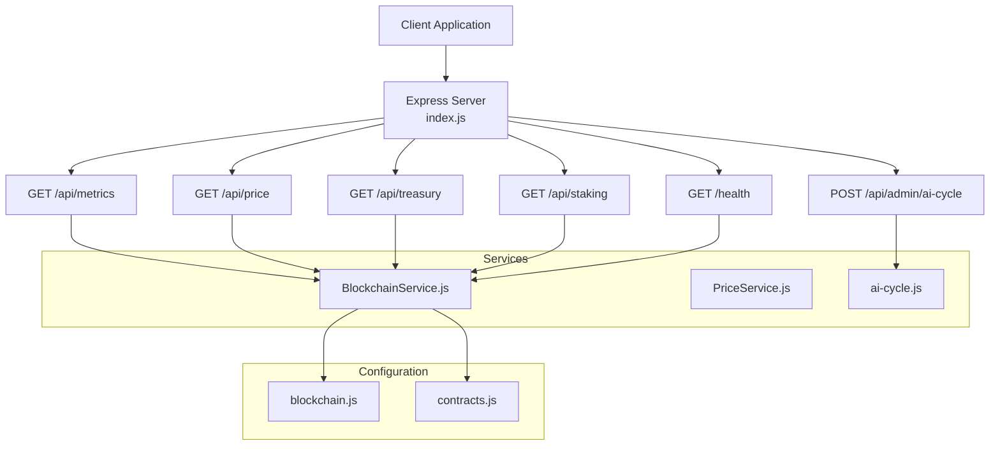
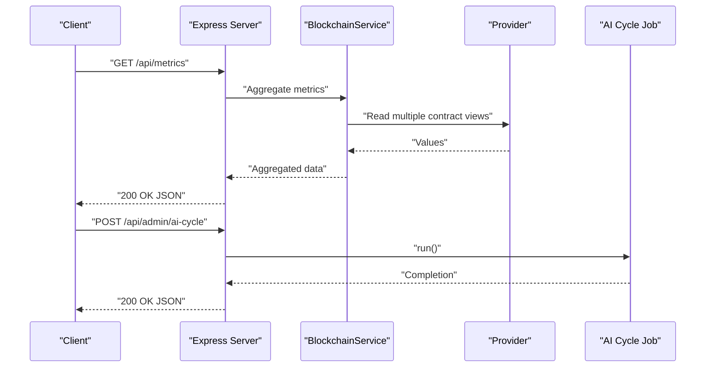
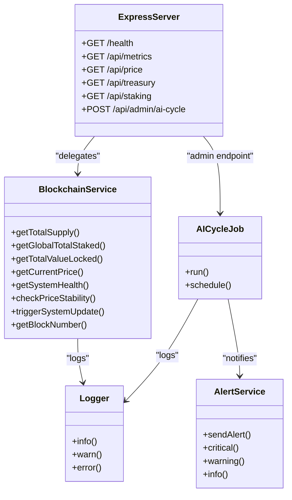
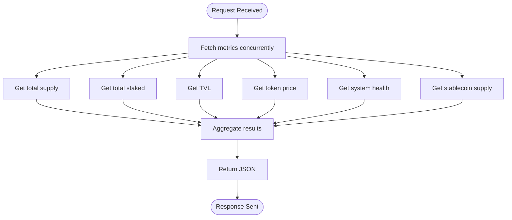
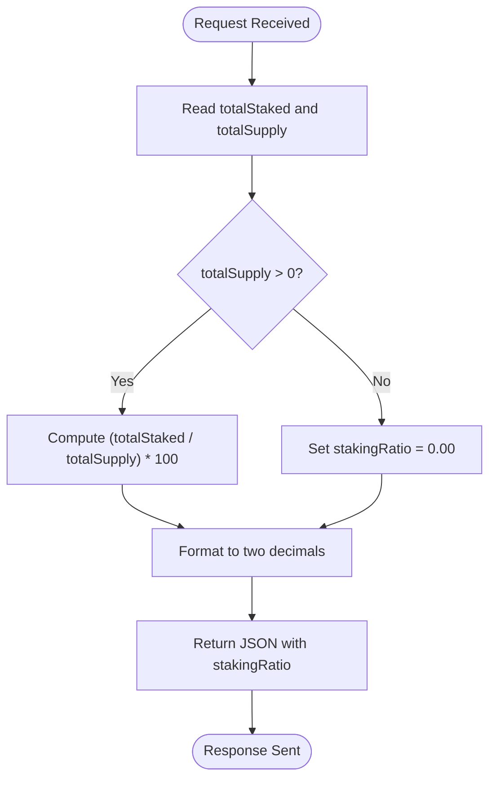
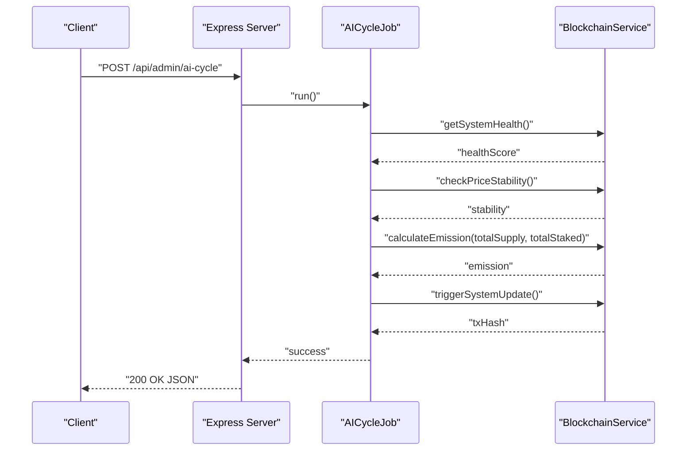
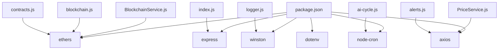

# Backend REST API

<cite>
**Referenced Files in This Document**
- [index.js](file://neurafinance/backend/src/index.js)
- [BlockchainService.js](file://neurafinance/backend/src/services/BlockchainService.js)
- [blockchain.js](file://neurafinance/backend/src/config/blockchain.js)
- [contracts.js](file://neurafinance/backend/src/config/contracts.js)
- [ai-cycle.js](file://neurafinance/backend/src/jobs/ai-cycle.js)
- [PriceService.js](file://neurafinance/backend/src/services/PriceService.js)
- [alerts.js](file://neurafinance/backend/src/utils/alerts.js)
- [logger.js](file://neurafinance/backend/src/utils/logger.js)
- [package.json](file://neurafinance/backend/package.json)
</cite>

## Table of Contents
1. [Introduction](#introduction)
2. [Project Structure](#project-structure)
3. [Core Components](#core-components)
4. [Architecture Overview](#architecture-overview)
5. [Detailed Component Analysis](#detailed-component-analysis)
6. [Dependency Analysis](#dependency-analysis)
7. [Performance Considerations](#performance-considerations)
8. [Troubleshooting Guide](#troubleshooting-guide)
9. [Conclusion](#conclusion)
10. [Appendices](#appendices)

## Introduction
This document provides comprehensive API documentation for the NeuraFinance backend REST API. It covers all HTTP endpoints, request/response schemas, error handling, and operational patterns. The backend exposes endpoints for system health monitoring, protocol metrics, token pricing and stability, treasury value tracking, staking statistics, and an administrative endpoint to manually trigger the AI cycle. It also outlines integration patterns, rate limiting considerations, and debugging approaches for clients.

## Project Structure
The backend is implemented as an Express.js server with modular services and jobs:
- HTTP endpoints are defined in the main server entry.
- Business logic is encapsulated in a Blockchain service that interacts with deployed smart contracts.
- Background jobs orchestrate periodic AI cycles and monitoring.
- Utilities provide logging, alerts, and price caching.

**Diagram sources**
- [index.js:18-143](file://neurafinance/backend/src/index.js#L18-L143)
- [BlockchainService.js:12-216](file://neurafinance/backend/src/services/BlockchainService.js#L12-L216)
- [blockchain.js:1-33](file://neurafinance/backend/src/config/blockchain.js#L1-L33)
- [contracts.js:1-146](file://neurafinance/backend/src/config/contracts.js#L1-L146)
- [ai-cycle.js:13-161](file://neurafinance/backend/src/jobs/ai-cycle.js#L13-L161)
- [PriceService.js:4-77](file://neurafinance/backend/src/services/PriceService.js#L4-L77)

**Section sources**
- [index.js:18-143](file://neurafinance/backend/src/index.js#L18-L143)
- [package.json:1-28](file://neurafinance/backend/package.json#L1-L28)

## Core Components
- Express server with CORS and JSON body parsing middleware.
- Blockchain service that wraps smart contract interactions via Ethers.js.
- AI cycle job orchestrating periodic system updates and health checks.
- Logging and alerting utilities for observability and notifications.
- Price service for external price fetching with caching.

Key runtime dependencies include Express, Ethers.js, Winston for logging, Axios for HTTP requests, node-cron for scheduling, and dotenv for environment configuration.

**Section sources**
- [index.js:6-21](file://neurafinance/backend/src/index.js#L6-L21)
- [blockchain.js:1-33](file://neurafinance/backend/src/config/blockchain.js#L1-L33)
- [contracts.js:1-146](file://neurafinance/backend/src/config/contracts.js#L1-L146)
- [logger.js:1-28](file://neurafinance/backend/src/utils/logger.js#L1-L28)
- [PriceService.js:1-77](file://neurafinance/backend/src/services/PriceService.js#L1-L77)
- [ai-cycle.js:13-161](file://neurafinance/backend/src/jobs/ai-cycle.js#L13-L161)
- [package.json:12-23](file://neurafinance/backend/package.json#L12-L23)

## Architecture Overview
The API routes delegate to the Blockchain service, which interacts with on-chain contracts. Some endpoints aggregate multiple reads concurrently. Administrative actions are handled by dedicated jobs. Alerts are sent to configured webhook/email endpoints.

**Diagram sources**
- [index.js:44-75](file://neurafinance/backend/src/index.js#L44-L75)
- [index.js:134-143](file://neurafinance/backend/src/index.js#L134-L143)
- [BlockchainService.js:68-75](file://neurafinance/backend/src/services/BlockchainService.js#L68-L75)
- [ai-cycle.js:19-85](file://neurafinance/backend/src/jobs/ai-cycle.js#L19-L85)

## Detailed Component Analysis

### Endpoint: GET /health
Purpose: Report system health and current blockchain block number.

- Method: GET
- Path: /health
- Authentication: None
- Rate limiting: Not implemented
- Request parameters: None
- Response fields:
  - status: String indicating health ("healthy", "unhealthy")
  - blockNumber: Integer representing latest block number
  - healthScore: Optional integer score returned by AI engine
  - timestamp: ISO datetime string
- Error responses:
  - 503 Service Unavailable with error details when health check fails

Example request:
curl https://your-host/health

Example response:
{
  "status": "healthy",
  "blockNumber": "1234567",
  "healthScore": "95",
  "timestamp": "2023-01-01T00:00:00Z"
}

Notes:
- Uses blockchain service to fetch block number and system health.
- On failure, returns 503 with error message.

**Section sources**
- [index.js:23-41](file://neurafinance/backend/src/index.js#L23-L41)
- [BlockchainService.js:106-113](file://neurafinance/backend/src/services/BlockchainService.js#L106-L113)
- [BlockchainService.js:202-204](file://neurafinance/backend/src/services/BlockchainService.js#L202-L204)

### Endpoint: GET /api/metrics
Purpose: Retrieve real-time protocol statistics.

- Method: GET
- Path: /api/metrics
- Authentication: None
- Rate limiting: Not implemented
- Request parameters: None
- Response fields:
  - totalSupply: String representation of total token supply
  - totalStaked: String representation of total staked tokens
  - tvl: String representation of total value locked
  - tokenPrice: String representation of current token price
  - healthScore: String representation of system health score
  - stablecoinSupply: String representation of stablecoin supply
  - timestamp: ISO datetime string
- Error responses:
  - 500 Internal Server Error with error message on failure

Concurrency:
- Metrics are fetched concurrently using Promise.all for performance.

Example request:
curl https://your-host/api/metrics

Example response:
{
  "totalSupply": "1000000000000000000000000",
  "totalStaked": "450000000000000000000000",
  "tvl": "50000000000000000000000",
  "tokenPrice": "1000000000000000000",
  "healthScore": "92",
  "stablecoinSupply": "200000000000000000000000",
  "timestamp": "2023-01-01T00:00:00Z"
}

**Section sources**
- [index.js:44-75](file://neurafinance/backend/src/index.js#L44-L75)
- [BlockchainService.js:40-47](file://neurafinance/backend/src/services/BlockchainService.js#L40-L47)
- [BlockchainService.js:87-94](file://neurafinance/backend/src/services/BlockchainService.js#L87-L94)
- [BlockchainService.js:68-75](file://neurafinance/backend/src/services/BlockchainService.js#L68-L75)
- [BlockchainService.js:124-131](file://neurafinance/backend/src/services/BlockchainService.js#L124-L131)
- [BlockchainService.js:106-113](file://neurafinance/backend/src/services/BlockchainService.js#L106-L113)
- [BlockchainService.js:183-190](file://neurafinance/backend/src/services/BlockchainService.js#L183-L190)

### Endpoint: GET /api/price
Purpose: Get token price and stability status.

- Method: GET
- Path: /api/price
- Authentication: None
- Rate limiting: Not implemented
- Request parameters: None
- Response fields:
  - price: String representation of current token price
  - isStable: Boolean indicating price stability
  - deviation: String representation of deviation percentage
  - timestamp: ISO datetime string
- Error responses:
  - 500 Internal Server Error with error message on failure

Example request:
curl https://your-host/api/price

Example response:
{
  "price": "1000000000000000000",
  "isStable": true,
  "deviation": "0.5",
  "timestamp": "2023-01-01T00:00:00Z"
}

**Section sources**
- [index.js:78-93](file://neurafinance/backend/src/index.js#L78-L93)
- [BlockchainService.js:124-131](file://neurafinance/backend/src/services/BlockchainService.js#L124-L131)
- [BlockchainService.js:115-122](file://neurafinance/backend/src/services/BlockchainService.js#L115-L122)

### Endpoint: GET /api/treasury
Purpose: Retrieve total value locked (TVL) in the treasury.

- Method: GET
- Path: /api/treasury
- Authentication: None
- Rate limiting: Not implemented
- Request parameters: None
- Response fields:
  - tvl: String representation of TVL
  - timestamp: ISO datetime string
- Error responses:
  - 500 Internal Server Error with error message on failure

Example request:
curl https://your-host/api/treasury

Example response:
{
  "tvl": "50000000000000000000000",
  "timestamp": "2023-01-01T00:00:00Z"
}

**Section sources**
- [index.js:96-108](file://neurafinance/backend/src/index.js#L96-L108)
- [BlockchainService.js:68-75](file://neurafinance/backend/src/services/BlockchainService.js#L68-L75)

### Endpoint: GET /api/staking
Purpose: Retrieve staking statistics and compute staking ratio.

- Method: GET
- Path: /api/staking
- Authentication: None
- Rate limiting: Not implemented
- Request parameters: None
- Response fields:
  - totalStaked: String representation of total staked tokens
  - totalSupply: String representation of total token supply
  - stakingRatio: Numeric percentage (two decimal places) computed as (totalStaked / totalSupply) * 100
  - timestamp: ISO datetime string
- Error responses:
  - 500 Internal Server Error with error message on failure

Behavior:
- If totalSupply is zero or falsy, stakingRatio defaults to 0.00.

Example request:
curl https://your-host/api/staking

Example response:
{
  "totalStaked": "450000000000000000000000",
  "totalSupply": "1000000000000000000000000",
  "stakingRatio": "45.00",
  "timestamp": "2023-01-01T00:00:00Z"
}

**Section sources**
- [index.js:111-131](file://neurafinance/backend/src/index.js#L111-L131)
- [BlockchainService.js:87-94](file://neurafinance/backend/src/services/BlockchainService.js#L87-L94)
- [BlockchainService.js:40-47](file://neurafinance/backend/src/services/BlockchainService.js#L40-L47)

### Endpoint: POST /api/admin/ai-cycle
Purpose: Manually trigger the AI cycle job for system updates.

- Method: POST
- Path: /api/admin/ai-cycle
- Authentication: None (not implemented)
- Rate limiting: Not implemented
- Request parameters: None
- Response fields:
  - success: Boolean indicating operation outcome
  - message: String describing result
- Error responses:
  - 500 Internal Server Error with error message on failure

Security note:
- The route currently lacks authentication. In production, add authentication middleware before exposing this endpoint.

Example request:
curl -X POST https://your-host/api/admin/ai-cycle

Example response:
{
  "success": true,
  "message": "AI cycle triggered"
}

**Section sources**
- [index.js:134-143](file://neurafinance/backend/src/index.js#L134-L143)
- [ai-cycle.js:19-85](file://neurafinance/backend/src/jobs/ai-cycle.js#L19-L85)

### Error Handling Patterns
- Route-level try/catch blocks return structured JSON errors with HTTP status codes.
- Global Express error handler logs and returns generic 500 responses.
- Service methods log failures and return null/default values to prevent cascading errors.

Common patterns:
- 500 Internal Server Error for unexpected failures.
- 503 Service Unavailable for health check failures.

**Section sources**
- [index.js:34-41](file://neurafinance/backend/src/index.js#L34-L41)
- [index.js:71-74](file://neurafinance/backend/src/index.js#L71-L74)
- [index.js:89-92](file://neurafinance/backend/src/index.js#L89-L92)
- [index.js:104-107](file://neurafinance/backend/src/index.js#L104-L107)
- [index.js:127-130](file://neurafinance/backend/src/index.js#L127-L130)
- [index.js:139-142](file://neurafinance/backend/src/index.js#L139-L142)
- [index.js:145-149](file://neurafinance/backend/src/index.js#L145-L149)

## Architecture Overview

**Diagram sources**
- [index.js:23-143](file://neurafinance/backend/src/index.js#L23-L143)
- [BlockchainService.js:12-216](file://neurafinance/backend/src/services/BlockchainService.js#L12-L216)
- [ai-cycle.js:13-161](file://neurafinance/backend/src/jobs/ai-cycle.js#L13-L161)
- [logger.js:1-28](file://neurafinance/backend/src/utils/logger.js#L1-L28)
- [alerts.js:4-82](file://neurafinance/backend/src/utils/alerts.js#L4-L82)

## Detailed Component Analysis

### GET /api/metrics Flow

**Diagram sources**
- [index.js:53-70](file://neurafinance/backend/src/index.js#L53-L70)
- [BlockchainService.js:40-47](file://neurafinance/backend/src/services/BlockchainService.js#L40-L47)
- [BlockchainService.js:87-94](file://neurafinance/backend/src/services/BlockchainService.js#L87-L94)
- [BlockchainService.js:68-75](file://neurafinance/backend/src/services/BlockchainService.js#L68-L75)
- [BlockchainService.js:124-131](file://neurafinance/backend/src/services/BlockchainService.js#L124-L131)
- [BlockchainService.js:106-113](file://neurafinance/backend/src/services/BlockchainService.js#L106-L113)
- [BlockchainService.js:183-190](file://neurafinance/backend/src/services/BlockchainService.js#L183-L190)

### GET /api/staking Calculation

**Diagram sources**
- [index.js:116-126](file://neurafinance/backend/src/index.js#L116-L126)
- [BlockchainService.js:87-94](file://neurafinance/backend/src/services/BlockchainService.js#L87-L94)
- [BlockchainService.js:40-47](file://neurafinance/backend/src/services/BlockchainService.js#L40-L47)

### POST /api/admin/ai-cycle Execution

**Diagram sources**
- [index.js:134-143](file://neurafinance/backend/src/index.js#L134-L143)
- [ai-cycle.js:19-85](file://neurafinance/backend/src/jobs/ai-cycle.js#L19-L85)
- [BlockchainService.js:106-113](file://neurafinance/backend/src/services/BlockchainService.js#L106-L113)
- [BlockchainService.js:115-122](file://neurafinance/backend/src/services/BlockchainService.js#L115-L122)
- [BlockchainService.js:145-152](file://neurafinance/backend/src/services/BlockchainService.js#L145-L152)
- [BlockchainService.js:133-143](file://neurafinance/backend/src/services/BlockchainService.js#L133-L143)

## Dependency Analysis
External dependencies and their roles:
- Express: HTTP server and routing
- Ethers.js: Provider and contract interaction
- Winston: Structured logging
- Axios: HTTP requests for price service and alerts
- node-cron: Scheduling background jobs
- dotenv: Environment variable loading

**Diagram sources**
- [package.json:12-23](file://neurafinance/backend/package.json#L12-L23)
- [index.js:6-21](file://neurafinance/backend/src/index.js#L6-L21)
- [BlockchainService.js:1-10](file://neurafinance/backend/src/services/BlockchainService.js#L1-L10)
- [PriceService.js:1-2](file://neurafinance/backend/src/services/PriceService.js#L1-L2)
- [ai-cycle.js:7-11](file://neurafinance/backend/src/jobs/ai-cycle.js#L7-L11)
- [logger.js:1-2](file://neurafinance/backend/src/utils/logger.js#L1-L2)
- [alerts.js:1-2](file://neurafinance/backend/src/utils/alerts.js#L1-L2)
- [blockchain.js:1-2](file://neurafinance/backend/src/config/blockchain.js#L1-L2)
- [contracts.js:1-1](file://neurafinance/backend/src/config/contracts.js#L1-L1)

**Section sources**
- [package.json:12-23](file://neurafinance/backend/package.json#L12-L23)

## Performance Considerations
- Concurrent reads: Metrics endpoint uses concurrent calls to reduce latency.
- Caching: Price service caches results for five minutes to minimize external API calls.
- Gas and provider: Provider fee data and block number queries are lightweight; avoid frequent polling from clients.
- Background jobs: AI cycle runs on a schedule; clients should poll endpoints rather than triggering admin actions frequently.

[No sources needed since this section provides general guidance]

## Troubleshooting Guide
Common issues and resolutions:
- 500 Internal Server Error: Indicates unhandled exceptions in routes or services. Check server logs for stack traces.
- 503 Service Unavailable (/health): Health check failed; verify blockchain connectivity and contract addresses.
- Empty or null values: Some endpoints return null for missing data; handle gracefully in clients.
- Admin endpoint failures: Ensure the job executes successfully; confirm scheduled runs and logs.

Operational tips:
- Enable appropriate log levels via environment variables.
- Monitor alert webhooks for critical events.
- Verify RPC URL and private key configuration.

**Section sources**
- [index.js:34-41](file://neurafinance/backend/src/index.js#L34-L41)
- [index.js:71-74](file://neurafinance/backend/src/index.js#L71-L74)
- [index.js:89-92](file://neurafinance/backend/src/index.js#L89-L92)
- [index.js:104-107](file://neurafinance/backend/src/index.js#L104-L107)
- [index.js:127-130](file://neurafinance/backend/src/index.js#L127-L130)
- [index.js:139-142](file://neurafinance/backend/src/index.js#L139-L142)
- [index.js:145-149](file://neurafinance/backend/src/index.js#L145-L149)
- [logger.js:18-25](file://neurafinance/backend/src/utils/logger.js#L18-L25)
- [alerts.js:20-27](file://neurafinance/backend/src/utils/alerts.js#L20-L27)

## Conclusion
The NeuraFinance backend provides a focused set of endpoints for monitoring and interacting with the DeFi protocol. Clients should implement retry logic, handle optional fields, and consider rate limiting. The admin endpoint requires authentication in production. Observability is supported through structured logs and optional alert webhooks.

[No sources needed since this section summarizes without analyzing specific files]

## Appendices

### Authentication Methods
- Current state: No authentication for public endpoints.
- Recommendation: Add JWT or API key middleware for sensitive endpoints (e.g., admin).

[No sources needed since this section provides general guidance]

### Rate Limiting Considerations
- Current state: No built-in rate limiting.
- Recommendation: Introduce per-IP limits (e.g., 60 requests/minute) for public endpoints; consider sliding windows.

[No sources needed since this section provides general guidance]

### Integration Patterns with Frontend Applications
- Polling intervals: Use 15–60 seconds for metrics and price endpoints depending on volatility.
- Caching: Cache responses locally with short TTLs to reduce load.
- Error boundaries: Display user-friendly messages while retrying failed requests.

[No sources needed since this section provides general guidance]

### Practical Examples of API Consumption
- Fetch metrics periodically and render charts.
- Display price and stability indicators with deviation thresholds.
- Show staking ratio to inform participation decisions.
- Trigger admin action only during maintenance windows after adding auth.

[No sources needed since this section provides general guidance]