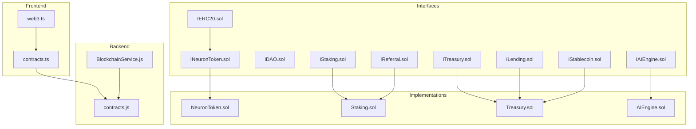
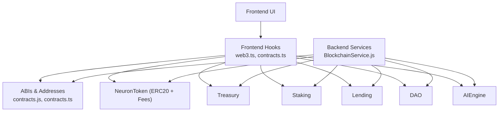
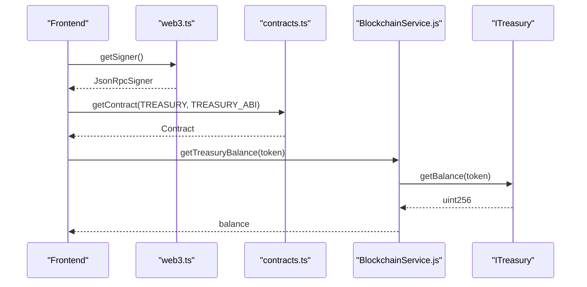
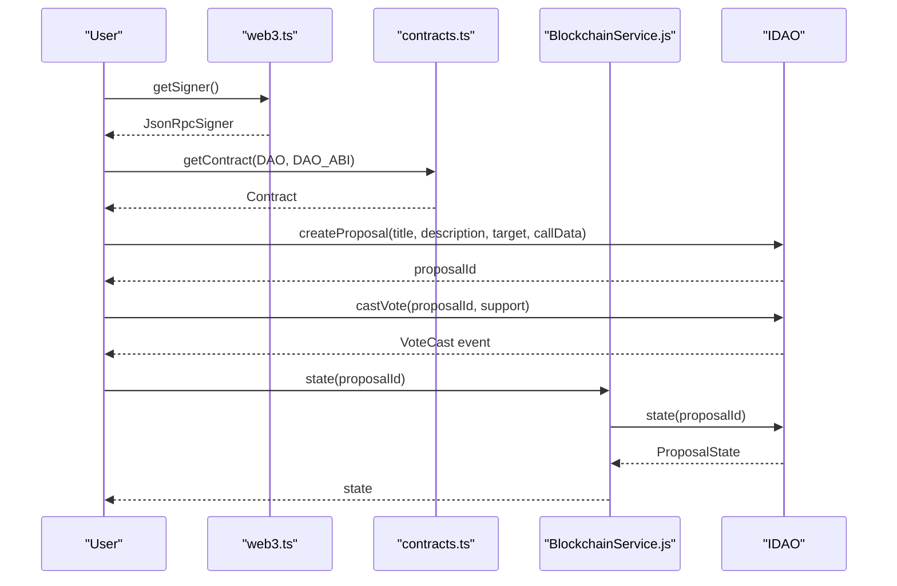
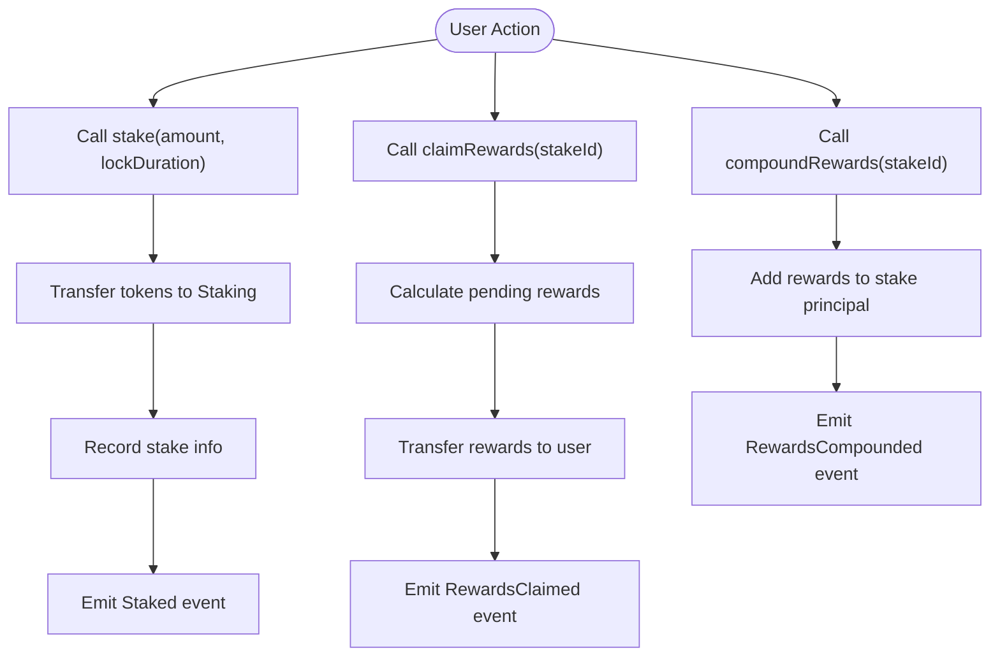
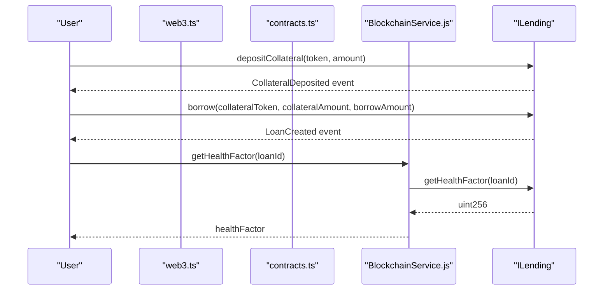
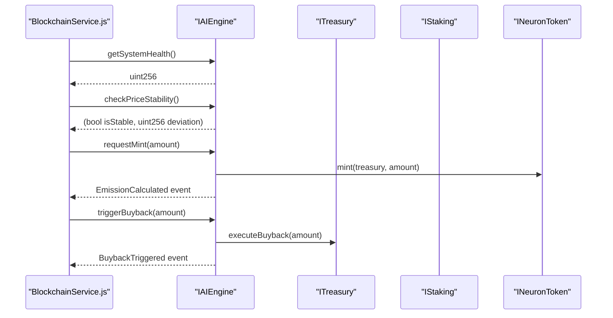
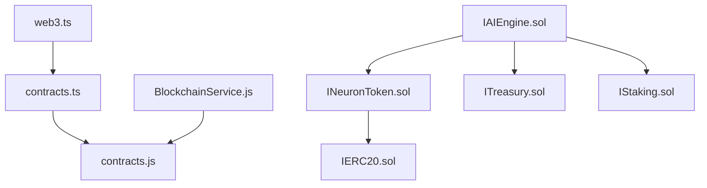

# Smart Contract Interfaces

<cite>
**Referenced Files in This Document**
- [IERC20.sol](file://neurafinance/contracts/interfaces/IERC20.sol)
- [ITreasury.sol](file://neurafinance/contracts/interfaces/ITreasury.sol)
- [IDAO.sol](file://neurafinance/contracts/interfaces/IDAO.sol)
- [IStaking.sol](file://neurafinance/contracts/interfaces/IStaking.sol)
- [ILending.sol](file://neurafinance/contracts/interfaces/ILending.sol)
- [IAIEngine.sol](file://neurafinance/contracts/interfaces/IAIEngine.sol)
- [INeuronToken.sol](file://neurafinance/contracts/interfaces/INeuronToken.sol)
- [IStablecoin.sol](file://neurafinance/contracts/interfaces/IStablecoin.sol)
- [IReferral.sol](file://neurafinance/contracts/interfaces/IReferral.sol)
- [contracts.ts](file://neurafinance/frontend/src/utils/contracts.ts)
- [web3.ts](file://neurafinance/frontend/src/utils/web3.ts)
- [BlockchainService.js](file://neurafinance/backend/src/services/BlockchainService.js)
- [contracts.js](file://neurafinance/backend/src/config/contracts.js)
- [NeuronToken.sol](file://neurafinance/contracts/core/NeuronToken.sol)
- [Staking.sol](file://neurafinance/contracts/core/Staking.sol)
- [Treasury.sol](file://neurafinance/contracts/core/Treasury.sol)
- [AIEngine.sol](file://neurafinance/contracts/ai-engine/AIEngine.sol)
</cite>

## Table of Contents
1. [Introduction](#introduction)
2. [Project Structure](#project-structure)
3. [Core Components](#core-components)
4. [Architecture Overview](#architecture-overview)
5. [Detailed Component Analysis](#detailed-component-analysis)
6. [Dependency Analysis](#dependency-analysis)
7. [Performance Considerations](#performance-considerations)
8. [Troubleshooting Guide](#troubleshooting-guide)
9. [Conclusion](#conclusion)
10. [Appendices](#appendices)

## Introduction
This document provides comprehensive smart contract interface documentation for the NeuraFinance DeFi ecosystem. It defines standardized Application Binary Interface (ABI) specifications for core contracts, including token interactions via IERC20, treasury operations via ITreasury, governance via IDAO, staking via IStaking, lending via ILending, and AI orchestration via IAIEngine. It also documents frontend integration patterns, error handling strategies, transaction simulation techniques, event listening, state queries, security considerations, access control patterns, and upgrade mechanisms.

## Project Structure
The NeuraFinance repository organizes interfaces under contracts/interfaces and implements core logic under contracts/core and contracts/ai-engine. Frontend utilities reside under frontend/src/utils, while backend services and ABIs live under neurafinance/backend.

**Diagram sources**
- [IERC20.sol:1-15](file://neurafinance/contracts/interfaces/IERC20.sol#L1-L15)
- [ITreasury.sol:1-17](file://neurafinance/contracts/interfaces/ITreasury.sol#L1-L17)
- [IDAO.sol:1-51](file://neurafinance/contracts/interfaces/IDAO.sol#L1-L51)
- [IStaking.sol:1-31](file://neurafinance/contracts/interfaces/IStaking.sol#L1-L31)
- [ILending.sol:1-40](file://neurafinance/contracts/interfaces/ILending.sol#L1-L40)
- [IAIEngine.sol:1-36](file://neurafinance/contracts/interfaces/IAIEngine.sol#L1-L36)
- [INeuronToken.sol:1-20](file://neurafinance/contracts/interfaces/INeuronToken.sol#L1-L20)
- [IStablecoin.sol:1-18](file://neurafinance/contracts/interfaces/IStablecoin.sol#L1-L18)
- [IReferral.sol:1-32](file://neurafinance/contracts/interfaces/IReferral.sol#L1-L32)
- [contracts.ts:1-148](file://neurafinance/frontend/src/utils/contracts.ts#L1-L148)
- [web3.ts:1-118](file://neurafinance/frontend/src/utils/web3.ts#L1-L118)
- [BlockchainService.js:1-216](file://neurafinance/backend/src/services/BlockchainService.js#L1-L216)
- [contracts.js:1-146](file://neurafinance/backend/src/config/contracts.js#L1-L146)
- [NeuronToken.sol:1-253](file://neurafinance/contracts/core/NeuronToken.sol#L1-L253)
- [Staking.sol:1-261](file://neurafinance/contracts/core/Staking.sol#L1-L261)
- [Treasury.sol:1-196](file://neurafinance/contracts/core/Treasury.sol#L1-L196)
- [AIEngine.sol:1-309](file://neurafinance/contracts/ai-engine/AIEngine.sol#L1-L309)

**Section sources**
- [contracts.ts:1-148](file://neurafinance/frontend/src/utils/contracts.ts#L1-L148)
- [web3.ts:1-118](file://neurafinance/frontend/src/utils/web3.ts#L1-L118)
- [BlockchainService.js:1-216](file://neurafinance/backend/src/services/BlockchainService.js#L1-L216)
- [contracts.js:1-146](file://neurafinance/backend/src/config/contracts.js#L1-L146)

## Core Components
This section defines standardized ABI definitions for each core interface, including function signatures, parameter specifications, return value types, and gas cost considerations.

- IERC20
  - Purpose: Standard token interface for transfers, approvals, and allowances.
  - Functions:
    - totalSupply() external view returns (uint256)
    - balanceOf(address account) external view returns (uint256)
    - transfer(address recipient, uint256 amount) external returns (bool)
    - allowance(address owner, address spender) external view returns (uint256)
    - approve(address spender, uint256 amount) external returns (bool)
    - transferFrom(address sender, address recipient, uint256 amount) external returns (bool)
  - Events:
    - Transfer(address indexed from, address indexed to, uint256 value)
    - Approval(address indexed owner, address indexed spender, uint256 value)
  - Gas considerations: Approve/transferFrom are O(1) reads/writes; transfer emits two balance updates and may emit approval events depending on allowance adjustments.

- ITreasury
  - Purpose: Treasury operations including deposits, withdrawals, buybacks, liquidity provisioning, and value queries.
  - Functions:
    - deposit(address token, uint256 amount) external
    - withdraw(address token, uint256 amount, address recipient) external
    - executeBuyback(uint256 amount) external
    - addLiquidity(uint256 tokenAmount, uint256 stableAmount) external
    - getBalance(address token) external view returns (uint256)
    - getTotalValueLocked() external view returns (uint256)
  - Events:
    - Deposit(address indexed token, uint256 amount, address indexed from)
    - Withdrawal(address indexed token, uint256 amount, address indexed to)
    - BuybackExecuted(uint256 amount, uint256 price)
    - LiquidityAdded(uint256 tokenAmount, uint256 stableAmount)
  - Gas considerations: Withdrawals and buybacks involve external token transfers and state updates; addLiquidity performs multiple balance checks and updates.

- IDAO
  - Purpose: Governance proposal lifecycle and voting.
  - Functions:
    - createProposal(string calldata title, string calldata description, address target, bytes calldata callData) external returns (uint256)
    - castVote(uint256 proposalId, bool support) external
    - executeProposal(uint256 proposalId) external
    - cancelProposal(uint256 proposalId) external
    - getVotingPower(address user) external view returns (uint256)
    - getProposal(uint256 proposalId) external view returns (ProposalView memory)
    - state(uint256 proposalId) external view returns (ProposalState)
  - Enums:
    - ProposalState { Pending, Active, Canceled, Defeated, Succeeded, Queued, Executed, Expired }
  - Events:
    - ProposalCreated(uint256 indexed id, address indexed proposer, string title, uint256 startTime, uint256 endTime)
    - VoteCast(address indexed voter, uint256 indexed proposalId, bool support, uint256 votes)
    - ProposalExecuted(uint256 indexed proposalId)
    - ProposalCanceled(uint256 indexed proposalId)
  - Gas considerations: Voting and proposal creation are O(1) per action; execution may vary based on target call complexity.

- IStaking
  - Purpose: Staking with flexible and bonded durations, reward calculation, claiming, and compounding.
  - Functions:
    - stake(uint256 amount, uint256 lockDuration) external
    - unstake(uint256 stakeId) external
    - claimRewards(uint256 stakeId) external
    - compoundRewards(uint256 stakeId) external
    - getStakeInfo(address user, uint256 stakeId) external view returns (StakeInfo memory)
    - getTotalStaked(address user) external view returns (uint256)
    - getPendingRewards(address user, uint256 stakeId) external view returns (uint256)
    - setRewardRates(uint256 flexibleRate, uint256[] calldata bondRates) external
    - globalTotalStaked() external view returns (uint256)
  - Events:
    - Staked(address indexed user, uint256 indexed stakeId, uint256 amount, uint256 lockDuration)
    - Unstaked(address indexed user, uint256 indexed stakeId, uint256 amount)
    - RewardsClaimed(address indexed user, uint256 indexed stakeId, uint256 amount)
    - RewardsCompounded(address indexed user, uint256 indexed stakeId, uint256 amount)
  - Gas considerations: Staking and unstaking trigger token transfers and state updates; claiming and compounding may mint/burn or transfer tokens.

- ILending
  - Purpose: Collateralized borrowing with loan management and health monitoring.
  - Functions:
    - depositCollateral(address token, uint256 amount) external
    - borrow(address collateralToken, uint256 collateralAmount, uint256 borrowAmount) external returns (uint256 loanId)
    - repay(uint256 loanId, uint256 amount) external
    - liquidate(uint256 loanId) external
    - getLoan(uint256 loanId) external view returns (Loan memory)
    - getCollateralValue(address user, address token) external view returns (uint256)
    - getMaxBorrowAmount(address token, uint256 collateralAmount) external view returns (uint256)
    - getHealthFactor(uint256 loanId) external view returns (uint256)
  - Events:
    - CollateralDeposited(address indexed user, address indexed token, uint256 amount)
    - LoanCreated(uint256 indexed loanId, address indexed borrower, uint256 collateralAmount, uint256 borrowedAmount)
    - LoanRepaid(uint256 indexed loanId, uint256 amount)
    - LoanLiquidated(uint256 indexed loanId, address indexed liquidator)
  - Gas considerations: Borrowing creates a loan and updates collateral; repayments and liquidations trigger multiple state changes.

- IAIEngine
  - Purpose: AI orchestration across modules (NEE, ALS, ARP, SIG, ALP).
  - Functions:
    - calculateEmission(uint256 totalSupply, uint256 stakedAmount) external view returns (uint256)
    - requestMint(uint256 amount) external
    - requestBurn(uint256 amount) external
    - checkPriceStability() external view returns (bool isStable, uint256 deviation)
    - triggerBuyback(uint256 amount) external
    - triggerSellPressure(uint256 amount) external
    - collectFees() external
    - reinvestToLiquidity(uint256 amount) external
    - distributeToTreasury(uint256 amount) external
    - validateMintRequest(uint256 amount) external view returns (bool)
    - validateSupplyHealth() external view returns (bool)
    - getMaxMintable() external view returns (uint256)
    - adjustEmissionRate() external
    - adjustRewardRates() external
    - getSystemHealth() external view returns (uint256)
  - Events:
    - EmissionCalculated(uint256 amount, uint256 timestamp)
    - BuybackTriggered(uint256 amount, uint256 price)
    - FeesCollected(uint256 amount)
    - SupplyValidated(bool healthy, uint256 ratio)
    - ParametersAdjusted(uint256 emissionRate, uint256 rewardRate)
  - Gas considerations: Mint/burn requests and treasury interactions are gas-intensive; stability checks are lightweight.

- INeuronToken (extends IERC20)
  - Additional functions:
    - mint(address to, uint256 amount) external
    - burn(uint256 amount) external
    - burnFrom(address account, uint256 amount) external
    - setFeeRecipients(address treasury, address liquidity, address rewards) external
    - setFeePercentages(uint256 buyFee, uint256 sellFee) external
    - setMaxTxAmount(uint256 maxTxAmount) external
    - whitelistAddress(address account, bool isWhitelisted) external
    - isWhitelisted(address account) external view returns (bool)
  - Events:
    - Mint(address indexed to, uint256 amount)
    - Burn(address indexed from, uint256 amount)
    - FeeDistributed(address indexed recipient, uint256 amount, string feeType)

- IStablecoin (extends IERC20)
  - Additional functions:
    - mint(address to, uint256 amount) external
    - burn(uint256 amount) external
    - burnFrom(address account, uint256 amount) external
    - setTreasury(address _treasury) external
    - setCollateralRatio(uint256 ratio) external
    - getCollateralRatio() external view returns (uint256)
  - Events:
    - Minted(address indexed to, uint256 amount, uint256 collateral)
    - Burned(address indexed from, uint256 amount)
    - CollateralRatioUpdated(uint256 newRatio)

- IReferral
  - Additional functions:
    - registerReferrer(address referrer) external
    - recordStake(address user, uint256 amount) external
    - processReferralRewards(address user, uint256 stakeAmount) external
    - getUserInfo(address user) external view returns (UserInfo memory)
    - getRankRequirements(uint256 rank) external view returns (RankInfo memory)
    - calculateRank(address user) external view returns (uint256)
  - Events:
    - ReferrerRegistered(address indexed user, address indexed referrer)
    - RankUpgraded(address indexed user, uint256 newRank)
    - ReferralRewardPaid(address indexed referrer, address indexed referee, uint256 amount)

**Section sources**
- [IERC20.sol:1-15](file://neurafinance/contracts/interfaces/IERC20.sol#L1-L15)
- [ITreasury.sol:1-17](file://neurafinance/contracts/interfaces/ITreasury.sol#L1-L17)
- [IDAO.sol:1-51](file://neurafinance/contracts/interfaces/IDAO.sol#L1-L51)
- [IStaking.sol:1-31](file://neurafinance/contracts/interfaces/IStaking.sol#L1-L31)
- [ILending.sol:1-40](file://neurafinance/contracts/interfaces/ILending.sol#L1-L40)
- [IAIEngine.sol:1-36](file://neurafinance/contracts/interfaces/IAIEngine.sol#L1-L36)
- [INeuronToken.sol:1-20](file://neurafinance/contracts/interfaces/INeuronToken.sol#L1-L20)
- [IStablecoin.sol:1-18](file://neurafinance/contracts/interfaces/IStablecoin.sol#L1-L18)
- [IReferral.sol:1-32](file://neurafinance/contracts/interfaces/IReferral.sol#L1-L32)

## Architecture Overview
The NeuraFinance ecosystem integrates token standards, treasury management, governance, staking, lending, and AI-driven orchestration. The frontend interacts with contracts via typed ABIs, while the backend encapsulates blockchain interactions and logging.

**Diagram sources**
- [web3.ts:1-118](file://neurafinance/frontend/src/utils/web3.ts#L1-L118)
- [contracts.ts:1-148](file://neurafinance/frontend/src/utils/contracts.ts#L1-L148)
- [BlockchainService.js:1-216](file://neurafinance/backend/src/services/BlockchainService.js#L1-L216)
- [contracts.js:1-146](file://neurafinance/backend/src/config/contracts.js#L1-L146)
- [NeuronToken.sol:1-253](file://neurafinance/contracts/core/NeuronToken.sol#L1-L253)
- [Treasury.sol:1-196](file://neurafinance/contracts/core/Treasury.sol#L1-L196)
- [Staking.sol:1-261](file://neurafinance/contracts/core/Staking.sol#L1-L261)
- [AIEngine.sol:1-309](file://neurafinance/contracts/ai-engine/AIEngine.sol#L1-L309)

## Detailed Component Analysis

### IERC20 Integration Patterns
- Frontend integration:
  - Use NEURON_TOKEN_ABI to interact with token functions and listen to Transfer/Approval events.
  - Example patterns:
    - Approve: call approve on NEURON_TOKEN_ABI with spender and amount; listen for Approval event.
    - Transfer: call transfer on NEURON_TOKEN_ABI with recipient and amount; listen for Transfer event.
- Backend integration:
  - BlockchainService.js uses NEURON_TOKEN_ABI to query totalSupply and balanceOf.

**Section sources**
- [contracts.ts:1-15](file://neurafinance/frontend/src/utils/contracts.ts#L1-L15)
- [BlockchainService.js:39-56](file://neurafinance/backend/src/services/BlockchainService.js#L39-L56)

### ITreasury Operations
- Frontend integration:
  - Use TREASURY_ABI to deposit, withdraw, and query balances and TVL.
  - Listen for Deposit, Withdrawal, BuybackExecuted, and LiquidityAdded events.
- Backend integration:
  - BlockchainService.js uses TREASURY_ABI to fetch getBalance and getTotalValueLocked.

**Diagram sources**
- [web3.ts:15-25](file://neurafinance/frontend/src/utils/web3.ts#L15-L25)
- [contracts.ts:30-35](file://neurafinance/frontend/src/utils/contracts.ts#L30-L35)
- [BlockchainService.js:58-75](file://neurafinance/backend/src/services/BlockchainService.js#L58-L75)
- [ITreasury.sol:1-17](file://neurafinance/contracts/interfaces/ITreasury.sol#L1-L17)

**Section sources**
- [contracts.ts:30-35](file://neurafinance/frontend/src/utils/contracts.ts#L30-L35)
- [BlockchainService.js:58-75](file://neurafinance/backend/src/services/BlockchainService.js#L58-L75)

### IDAO Governance Flow
- Frontend integration:
  - Use DAO_ABI to create proposals, vote, and query proposal states.
  - Listen for ProposalCreated, VoteCast, ProposalExecuted, and ProposalCanceled events.
- Backend integration:
  - BlockchainService.js uses DAO_ABI to fetch getVotingPower and getProposal.

**Diagram sources**
- [web3.ts:15-25](file://neurafinance/frontend/src/utils/web3.ts#L15-L25)
- [contracts.ts:45-52](file://neurafinance/frontend/src/utils/contracts.ts#L45-L52)
- [BlockchainService.js:1-216](file://neurafinance/backend/src/services/BlockchainService.js#L1-L216)
- [IDAO.sol:1-51](file://neurafinance/contracts/interfaces/IDAO.sol#L1-L51)

**Section sources**
- [contracts.ts:45-52](file://neurafinance/frontend/src/utils/contracts.ts#L45-L52)
- [BlockchainService.js:1-216](file://neurafinance/backend/src/services/BlockchainService.js#L1-L216)

### IStaking Reward Mechanics
- Frontend integration:
  - Use STAKING_ABI to stake, unstake, claim rewards, and compound rewards.
  - Listen for Staked, Unstaked, RewardsClaimed, RewardsCompounded events.
- Backend integration:
  - BlockchainService.js uses STAKING_ABI to query globalTotalStaked and user staked amounts.

**Diagram sources**
- [IStaking.sol:1-31](file://neurafinance/contracts/interfaces/IStaking.sol#L1-L31)
- [Staking.sol:61-155](file://neurafinance/contracts/core/Staking.sol#L61-L155)

**Section sources**
- [contracts.ts:17-28](file://neurafinance/frontend/src/utils/contracts.ts#L17-L28)
- [BlockchainService.js:86-103](file://neurafinance/backend/src/services/BlockchainService.js#L86-L103)

### ILending Risk Controls
- Frontend integration:
  - Use LENDING_ABI to deposit collateral, borrow, repay, and liquidate.
  - Listen for CollateralDeposited, LoanCreated, LoanRepaid, LoanLiquidated events.
- Backend integration:
  - BlockchainService.js uses LENDING_ABI to fetch getLoan and getHealthFactor.

**Diagram sources**
- [contracts.ts:37-43](file://neurafinance/frontend/src/utils/contracts.ts#L37-L43)
- [BlockchainService.js:154-171](file://neurafinance/backend/src/services/BlockchainService.js#L154-L171)
- [ILending.sol:1-40](file://neurafinance/contracts/interfaces/ILending.sol#L1-L40)

**Section sources**
- [contracts.ts:37-43](file://neurafinance/frontend/src/utils/contracts.ts#L37-L43)
- [BlockchainService.js:154-171](file://neurafinance/backend/src/services/BlockchainService.js#L154-L171)

### IAIEngine Orchestration
- Frontend integration:
  - Use AI_ENGINE_ABI to check system health and price stability.
  - Listen for EmissionCalculated, BuybackTriggered, FeesCollected, SupplyValidated, ParametersAdjusted events.
- Backend integration:
  - BlockchainService.js uses AI_ENGINE_ABI to fetch getSystemHealth and checkPriceStability.

**Diagram sources**
- [BlockchainService.js:105-143](file://neurafinance/backend/src/services/BlockchainService.js#L105-L143)
- [IAIEngine.sol:1-36](file://neurafinance/contracts/interfaces/IAIEngine.sol#L1-L36)
- [AIEngine.sol:88-125](file://neurafinance/contracts/ai-engine/AIEngine.sol#L88-L125)

**Section sources**
- [contracts.ts:60-64](file://neurafinance/frontend/src/utils/contracts.ts#L60-L64)
- [BlockchainService.js:105-143](file://neurafinance/backend/src/services/BlockchainService.js#L105-L143)

## Dependency Analysis
The frontend and backend depend on shared ABIs and contract addresses. The AIEngine orchestrates interactions among NeuronToken, Treasury, and Staking.

**Diagram sources**
- [contracts.ts:1-148](file://neurafinance/frontend/src/utils/contracts.ts#L1-L148)
- [web3.ts:1-118](file://neurafinance/frontend/src/utils/web3.ts#L1-L118)
- [contracts.js:1-146](file://neurafinance/backend/src/config/contracts.js#L1-L146)
- [BlockchainService.js:1-216](file://neurafinance/backend/src/services/BlockchainService.js#L1-L216)
- [INeuronToken.sol:1-20](file://neurafinance/contracts/interfaces/INeuronToken.sol#L1-L20)
- [IAIEngine.sol:1-36](file://neurafinance/contracts/interfaces/IAIEngine.sol#L1-L36)

**Section sources**
- [contracts.js:1-146](file://neurafinance/backend/src/config/contracts.js#L1-L146)
- [BlockchainService.js:1-216](file://neurafinance/backend/src/services/BlockchainService.js#L1-L216)

## Performance Considerations
- Gas optimization tips:
  - Batch operations where possible (e.g., multiple approvals in a single transaction).
  - Use estimateGas before sending transactions to avoid failures and wasted gas.
  - Monitor block gas limits and adjust transaction parameters accordingly.
- Frontend UX:
  - Use polling intervals judiciously; subscribe to events to reduce unnecessary RPC calls.
  - Cache frequently accessed state (e.g., balances, allowances) to minimize re-renders.
- Backend:
  - Cache responses and use rate limiting to prevent overload.
  - Log errors and retry transient failures gracefully.

## Troubleshooting Guide
- Error handling strategies:
  - Frontend:
    - Wrap contract calls in try/catch blocks; handle user rejection and network errors.
    - Use web3.ts listeners for account and chain changes to keep UI state consistent.
  - Backend:
    - BlockchainService.js wraps calls with try/catch and logs errors; returns null or defaults for safe consumption.
- Transaction simulation:
  - Use provider.call with overrides to simulate transactions without committing state.
  - Validate inputs (amounts, addresses, durations) before submission.
- Common issues:
  - Insufficient allowance: prompt user to approve tokens before transferFrom/mint/burnFrom.
  - Unauthorized access: verify ownership or authorized caller roles before executing privileged functions.
  - Invalid parameters: ensure lock durations and bond rates match supported values.

**Section sources**
- [web3.ts:27-52](file://neurafinance/frontend/src/utils/web3.ts#L27-L52)
- [BlockchainService.js:39-75](file://neurafinance/backend/src/services/BlockchainService.js#L39-L75)

## Conclusion
The NeuraFinance DeFi ecosystem provides standardized interfaces for token, treasury, governance, staking, lending, and AI orchestration. By adhering to the documented ABIs, implementing robust error handling, and leveraging frontend/backend integration patterns, developers can build secure and efficient DeFi applications on top of these contracts.

## Appendices

### Practical Examples Index
- Token interactions:
  - Approve and transfer: [IERC20.sol:7-10](file://neurafinance/contracts/interfaces/IERC20.sol#L7-L10)
  - Frontend usage: [contracts.ts:2-15](file://neurafinance/frontend/src/utils/contracts.ts#L2-L15)
- Treasury operations:
  - Deposit and withdraw: [ITreasury.sol:5-8](file://neurafinance/contracts/interfaces/ITreasury.sol#L5-L8)
  - Frontend usage: [contracts.ts:30-35](file://neurafinance/frontend/src/utils/contracts.ts#L30-L35)
- Governance:
  - Create proposal and vote: [IDAO.sol:36-38](file://neurafinance/contracts/interfaces/IDAO.sol#L36-L38)
  - Frontend usage: [contracts.ts:45-52](file://neurafinance/frontend/src/utils/contracts.ts#L45-L52)
- Staking:
  - Stake/unstake/claim/compound: [IStaking.sol:16-24](file://neurafinance/contracts/interfaces/IStaking.sol#L16-L24)
  - Frontend usage: [contracts.ts:17-28](file://neurafinance/frontend/src/utils/contracts.ts#L17-L28)
- Lending:
  - Borrow and repay: [ILending.sol:26-29](file://neurafinance/contracts/interfaces/ILending.sol#L26-L29)
  - Frontend usage: [contracts.ts:37-43](file://neurafinance/frontend/src/utils/contracts.ts#L37-L43)
- AI Engine:
  - System health and buyback: [IAIEngine.sol:6-13](file://neurafinance/contracts/interfaces/IAIEngine.sol#L6-L13)
  - Frontend usage: [contracts.ts:60-64](file://neurafinance/frontend/src/utils/contracts.ts#L60-L64)

### Security and Access Control
- Access control patterns:
  - Owner-only functions: use modifiers like onlyOwner in implementations.
  - Authorized callers: maintain authorizedCallers mappings for privileged operations.
  - Mint/burn restrictions: validate mint requests and supply health via AIEngine.
- Upgrade mechanisms:
  - Proxy patterns: use TransparentUpgradeableProxy or similar for upgradability.
  - Controlled upgrades: implement upgrade gates and timelocks for critical changes.
  - Backward compatibility: maintain ABI stability and versioned interfaces.

**Section sources**
- [NeuronToken.sol:47-55](file://neurafinance/contracts/core/NeuronToken.sol#L47-L55)
- [Treasury.sol:42-50](file://neurafinance/contracts/core/Treasury.sol#L42-L50)
- [AIEngine.sol:47-63](file://neurafinance/contracts/ai-engine/AIEngine.sol#L47-L63)