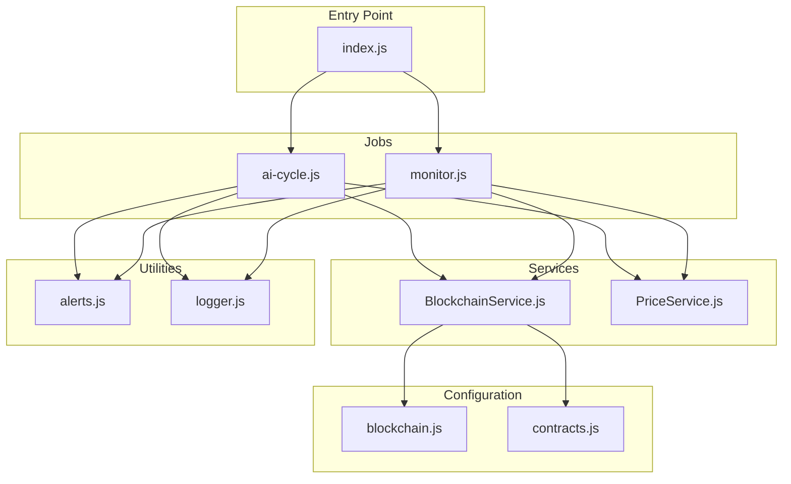
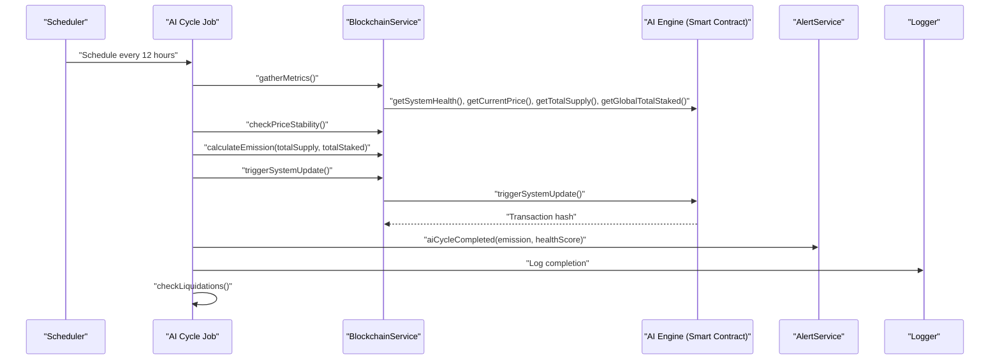
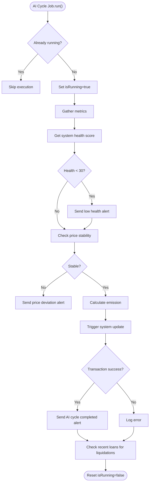
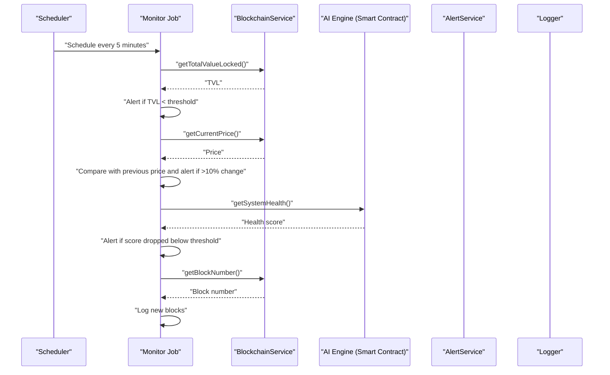
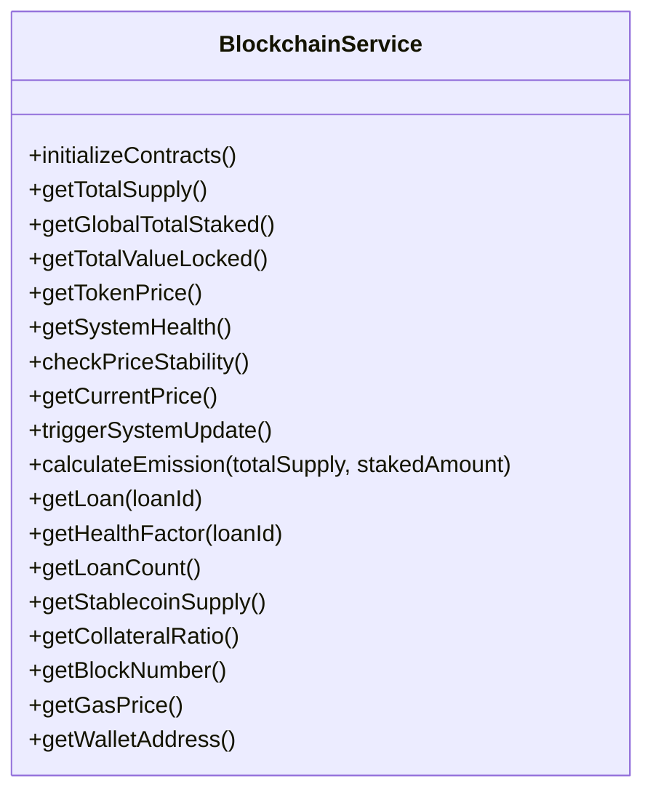
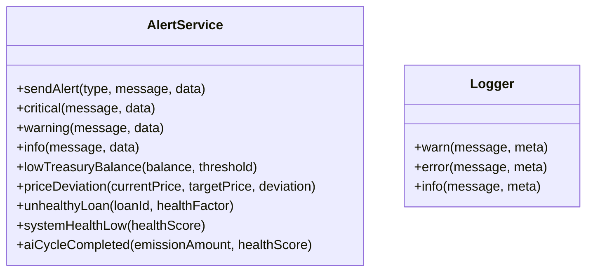
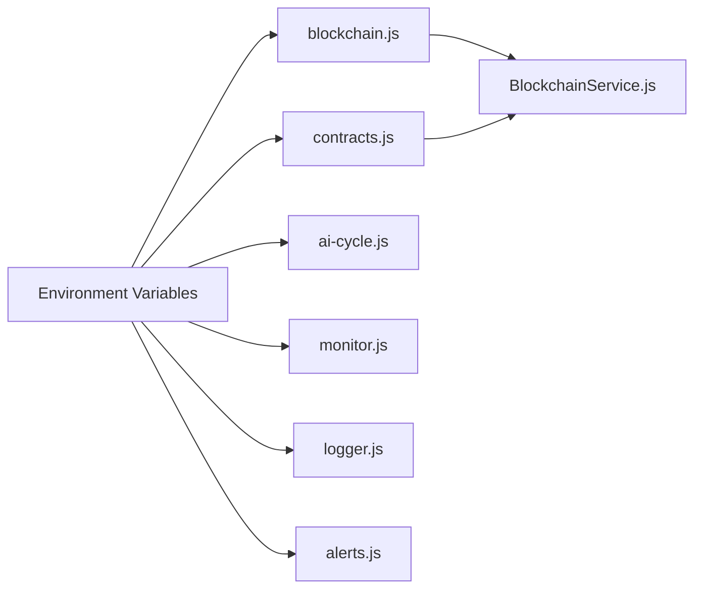
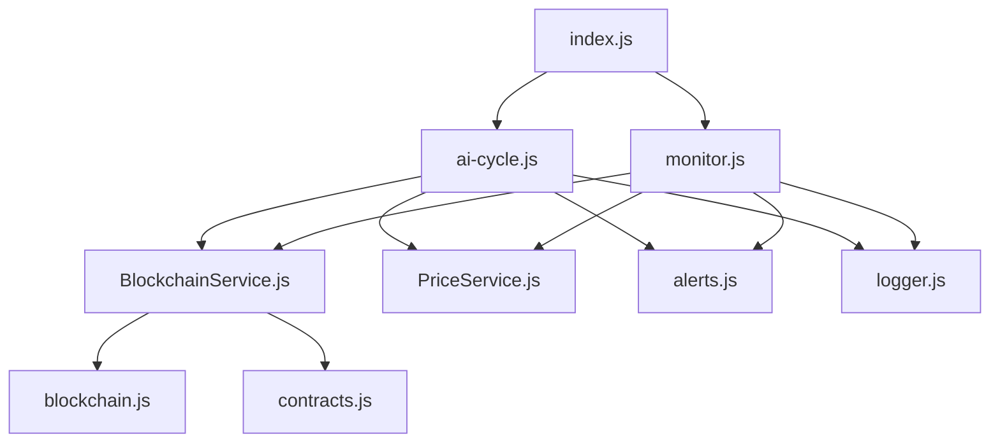

# AI Cycle Management

<cite>
**Referenced Files in This Document**
- [index.js](file://neurafinance/backend/src/index.js)
- [ai-cycle.js](file://neurafinance/backend/src/jobs/ai-cycle.js)
- [monitor.js](file://neurafinance/backend/src/jobs/monitor.js)
- [BlockchainService.js](file://neurafinance/backend/src/services/BlockchainService.js)
- [PriceService.js](file://neurafinance/backend/src/services/PriceService.js)
- [alerts.js](file://neurafinance/backend/src/utils/alerts.js)
- [logger.js](file://neurafinance/backend/src/utils/logger.js)
- [blockchain.js](file://neurafinance/backend/src/config/blockchain.js)
- [contracts.js](file://neurafinance/backend/src/config/contracts.js)
- [package.json](file://neurafinance/backend/package.json)
</cite>

## Table of Contents
1. [Introduction](#introduction)
2. [Project Structure](#project-structure)
3. [Core Components](#core-components)
4. [Architecture Overview](#architecture-overview)
5. [Detailed Component Analysis](#detailed-component-analysis)
6. [Dependency Analysis](#dependency-analysis)
7. [Performance Considerations](#performance-considerations)
8. [Troubleshooting Guide](#troubleshooting-guide)
9. [Conclusion](#conclusion)
10. [Appendices](#appendices)

## Introduction
This document explains the AI Cycle Management system responsible for scheduled maintenance operations in the AI-driven DeFi platform. It covers the 12-hour AI Cycle job scheduling, system health monitoring, parameter adjustment triggers, and automated decision-making processes. The system integrates blockchain interactions, metric collection, alerting, and logging to enable autonomous operation of the AI engine while providing visibility for operators and administrators.

## Project Structure
The AI Cycle Management spans several modules:
- Entry point initializes the Express server and schedules background jobs
- AI Cycle job orchestrates the 12-hour maintenance workflow
- Monitor job continuously evaluates system health and price stability
- Blockchain service abstracts smart contract interactions
- Utilities provide alerting and structured logging
- Configuration manages RPC connections and contract ABIs

**Diagram sources**
- [index.js:151-165](file://neurafinance/backend/src/index.js#L151-L165)
- [ai-cycle.js:13-161](file://neurafinance/backend/src/jobs/ai-cycle.js#L13-L161)
- [monitor.js:12-125](file://neurafinance/backend/src/jobs/monitor.js#L12-L125)
- [BlockchainService.js:12-37](file://neurafinance/backend/src/services/BlockchainService.js#L12-L37)
- [blockchain.js:10-25](file://neurafinance/backend/src/config/blockchain.js#L10-L25)
- [contracts.js:108-134](file://neurafinance/backend/src/config/contracts.js#L108-L134)

**Section sources**
- [index.js:151-165](file://neurafinance/backend/src/index.js#L151-L165)
- [package.json:6-10](file://neurafinance/backend/package.json#L6-L10)

## Core Components
- AI Cycle Job: Executes every 12 hours to evaluate system health, check price stability, calculate emissions, trigger system updates, and scan for liquidations. It uses environment-configurable cron intervals and prevents concurrent runs.
- Monitor Job: Runs every 5 minutes to track treasury balance, price movements, system health scores, and blockchain block progress. It emits alerts for significant deviations.
- Blockchain Service: Centralizes contract interactions for token supply, staking, treasury, lending, stablecoin, and AI engine functions.
- Alerts and Logger: Provide structured alerting via webhooks and console/file logging with configurable log levels.
- Configuration: Manages RPC provider, wallet, contract addresses, and ABIs.

**Section sources**
- [ai-cycle.js:13-161](file://neurafinance/backend/src/jobs/ai-cycle.js#L13-L161)
- [monitor.js:12-125](file://neurafinance/backend/src/jobs/monitor.js#L12-L125)
- [BlockchainService.js:12-213](file://neurafinance/backend/src/services/BlockchainService.js#L12-L213)
- [alerts.js:4-79](file://neurafinance/backend/src/utils/alerts.js#L4-L79)
- [logger.js:3-27](file://neurafinance/backend/src/utils/logger.js#L3-L27)
- [blockchain.js:10-25](file://neurafinance/backend/src/config/blockchain.js#L10-L25)
- [contracts.js:108-134](file://neurafinance/backend/src/config/contracts.js#L108-L134)

## Architecture Overview
The AI Cycle Management architecture combines scheduled jobs with continuous monitoring, blockchain integration, and alerting. The entry point starts both jobs and exposes REST endpoints for health checks and manual triggering.

**Diagram sources**
- [ai-cycle.js:19-85](file://neurafinance/backend/src/jobs/ai-cycle.js#L19-L85)
- [BlockchainService.js:106-143](file://neurafinance/backend/src/services/BlockchainService.js#L106-L143)
- [alerts.js:73-78](file://neurafinance/backend/src/utils/alerts.js#L73-L78)

## Detailed Component Analysis

### AI Cycle Job
The AI Cycle Job coordinates a 12-hour maintenance routine:
- Prevents concurrent execution and tracks last run time
- Gathers system metrics (block number, supply, staked amounts, TVL, price, stablecoin supply, collateral ratio)
- Evaluates system health and price stability thresholds
- Calculates emission based on supply and staked amounts
- Triggers the AI engine system update on-chain
- Scans recent loans for liquidation triggers and alerts

**Diagram sources**
- [ai-cycle.js:19-85](file://neurafinance/backend/src/jobs/ai-cycle.js#L19-L85)
- [ai-cycle.js:118-146](file://neurafinance/backend/src/jobs/ai-cycle.js#L118-L146)

**Section sources**
- [ai-cycle.js:13-161](file://neurafinance/backend/src/jobs/ai-cycle.js#L13-L161)
- [ai-cycle.js:148-160](file://neurafinance/backend/src/jobs/ai-cycle.js#L148-L160)

### Monitor Job
The Monitor Job performs continuous surveillance:
- Monitors treasury TVL and alerts on significant drops
- Tracks token price and detects large deviations
- Checks system health score and alerts on degradation
- Logs new blocks to detect chain stalls

**Diagram sources**
- [monitor.js:21-97](file://neurafinance/backend/src/jobs/monitor.js#L21-L97)
- [BlockchainService.js:68-131](file://neurafinance/backend/src/services/BlockchainService.js#L68-L131)

**Section sources**
- [monitor.js:12-125](file://neurafinance/backend/src/jobs/monitor.js#L12-L125)

### Blockchain Service
The Blockchain Service encapsulates contract interactions:
- Initializes contracts for Neuron Token, Treasury, Staking, Lending, Stablecoin, and AI Engine
- Provides functions to query system metrics, health, prices, and emission calculations
- Executes transactions for system updates and waits for confirmations
- Exposes utility functions for block number and gas price

**Diagram sources**
- [BlockchainService.js:12-213](file://neurafinance/backend/src/services/BlockchainService.js#L12-L213)

**Section sources**
- [BlockchainService.js:18-37](file://neurafinance/backend/src/services/BlockchainService.js#L18-L37)
- [BlockchainService.js:106-152](file://neurafinance/backend/src/services/BlockchainService.js#L106-L152)

### Alerts and Logging
Alerts are sent via webhook and logged with structured JSON. The logger supports file and console transports with configurable log levels. Alerts include critical, warning, and info categories for system health, price deviations, liquidations, and AI cycle completions.

**Diagram sources**
- [alerts.js:4-79](file://neurafinance/backend/src/utils/alerts.js#L4-L79)
- [logger.js:3-27](file://neurafinance/backend/src/utils/logger.js#L3-L27)

**Section sources**
- [alerts.js:10-30](file://neurafinance/backend/src/utils/alerts.js#L10-L30)
- [logger.js:3-27](file://neurafinance/backend/src/utils/logger.js#L3-L27)

### Configuration
Configuration manages RPC provider, wallet, contract addresses, and ABIs. Environment variables control scheduling intervals, logging levels, and alert destinations.

**Diagram sources**
- [blockchain.js:10-25](file://neurafinance/backend/src/config/blockchain.js#L10-L25)
- [contracts.js:108-134](file://neurafinance/backend/src/config/contracts.js#L108-L134)
- [ai-cycle.js:148-150](file://neurafinance/backend/src/jobs/ai-cycle.js#L148-L150)
- [monitor.js:112-114](file://neurafinance/backend/src/jobs/monitor.js#L112-L114)
- [logger.js:4](file://neurafinance/backend/src/utils/logger.js#L4)
- [alerts.js:6-8](file://neurafinance/backend/src/utils/alerts.js#L6-L8)

**Section sources**
- [blockchain.js:10-25](file://neurafinance/backend/src/config/blockchain.js#L10-L25)
- [contracts.js:108-134](file://neurafinance/backend/src/config/contracts.js#L108-L134)

## Dependency Analysis
The AI Cycle Management system exhibits clear separation of concerns:
- Jobs depend on Services for blockchain operations
- Services depend on Configuration for provider and contract setup
- Utilities provide cross-cutting concerns (logging, alerts)
- Entry point orchestrates scheduling and exposes APIs

**Diagram sources**
- [index.js:10-13](file://neurafinance/backend/src/index.js#L10-L13)
- [ai-cycle.js:7-11](file://neurafinance/backend/src/jobs/ai-cycle.js#L7-L11)
- [monitor.js:6-10](file://neurafinance/backend/src/jobs/monitor.js#L6-L10)
- [BlockchainService.js:1-9](file://neurafinance/backend/src/services/BlockchainService.js#L1-L9)

**Section sources**
- [index.js:10-13](file://neurafinance/backend/src/index.js#L10-L13)
- [ai-cycle.js:7-11](file://neurafinance/backend/src/jobs/ai-cycle.js#L7-L11)
- [monitor.js:6-10](file://neurafinance/backend/src/jobs/monitor.js#L6-L10)

## Performance Considerations
- Concurrent Execution Prevention: The AI Cycle Job uses a flag to prevent overlapping runs, avoiding resource contention during long-running operations.
- Parallel Metric Collection: Both jobs use Promise.all to minimize latency when fetching multiple metrics concurrently.
- Caching: PriceService caches token prices for short intervals to reduce external API calls.
- Transaction Confirmation: BlockchainService waits for transaction confirmations before proceeding, ensuring deterministic state transitions.

[No sources needed since this section provides general guidance]

## Troubleshooting Guide
Common operational issues and remedies:
- AI Cycle Job stuck: Check the running flag and last run timestamps; ensure the job completes before the next scheduled run.
- Missing or stale metrics: Verify blockchain connectivity and contract addresses; confirm that the RPC provider is reachable.
- Alert delivery failures: Confirm webhook URL and email configuration; review logs for transport errors.
- Price API unavailability: The system falls back to cached or simulated prices; monitor fallback warnings.
- Graceful shutdown: The server listens for SIGTERM/SIGINT signals and exits cleanly.

**Section sources**
- [ai-cycle.js:19-23](file://neurafinance/backend/src/jobs/ai-cycle.js#L19-L23)
- [PriceService.js:36-53](file://neurafinance/backend/src/services/PriceService.js#L36-L53)
- [alerts.js:20-27](file://neurafinance/backend/src/utils/alerts.js#L20-L27)
- [index.js:167-176](file://neurafinance/backend/src/index.js#L167-L176)

## Conclusion
The AI Cycle Management system automates critical maintenance tasks every 12 hours while maintaining continuous monitoring through a 5-minute loop. It integrates blockchain operations, health scoring, price stability checks, emission calculations, and automated parameter adjustments. Structured logging and alerting provide transparency for operators, while robust scheduling and error handling ensure reliable operation for administrators.

[No sources needed since this section summarizes without analyzing specific files]

## Appendices

### Cron Job Configuration
- AI Cycle Interval: Configured via environment variable with a default of every 12 hours.
- Monitor Interval: Configured via environment variable with a default of every 5 minutes.
- Immediate Startup: Both jobs execute immediately upon server start.

**Section sources**
- [ai-cycle.js:148-160](file://neurafinance/backend/src/jobs/ai-cycle.js#L148-L160)
- [monitor.js:112-124](file://neurafinance/backend/src/jobs/monitor.js#L112-L124)

### Execution Logs
- Logging Level: Controlled by environment variable; defaults to informational level.
- Log Destinations: File transports for combined and error logs; console transport in non-production environments.
- Log Format: JSON with timestamps and stack traces for errors.

**Section sources**
- [logger.js:3-27](file://neurafinance/backend/src/utils/logger.js#L3-L27)

### Failure Recovery Mechanisms
- Non-blocking Operations: Jobs catch and log errors without crashing the process.
- Graceful Shutdown: Server handles termination signals for clean exit.
- Retry Strategies: No automatic retry is implemented; administrators should monitor logs and re-run jobs if needed.

**Section sources**
- [ai-cycle.js:79-84](file://neurafinance/backend/src/jobs/ai-cycle.js#L79-L84)
- [monitor.js:99-110](file://neurafinance/backend/src/jobs/monitor.js#L99-L110)
- [index.js:167-176](file://neurafinance/backend/src/index.js#L167-L176)

### Practical Examples

#### Example: Manual AI Cycle Trigger
- Endpoint: POST /api/admin/ai-cycle
- Purpose: Allows administrators to initiate an AI Cycle immediately for testing or emergency scenarios.

**Section sources**
- [index.js:133-143](file://neurafinance/backend/src/index.js#L133-L143)

#### Example: Health Evaluation
- Health Score: Retrieved from the AI Engine contract and logged; alerts are triggered when the score drops below thresholds.
- Monitoring Job: Continuously compares current health scores and triggers alerts on degradation.

**Section sources**
- [ai-cycle.js:34-40](file://neurafinance/backend/src/jobs/ai-cycle.js#L34-L40)
- [monitor.js:67-84](file://neurafinance/backend/src/jobs/monitor.js#L67-L84)

#### Example: Automated Parameter Updates
- Emission Calculation: The AI Engine calculates emission based on total supply and staked amounts.
- System Update: The AI Engine executes parameter adjustments and emits events indicating successful updates.

**Section sources**
- [ai-cycle.js:54-61](file://neurafinance/backend/src/jobs/ai-cycle.js#L54-L61)
- [BlockchainService.js:145-152](file://neurafinance/backend/src/services/BlockchainService.js#L145-L152)
- [BlockchainService.js:133-143](file://neurafinance/backend/src/services/BlockchainService.js#L133-L143)