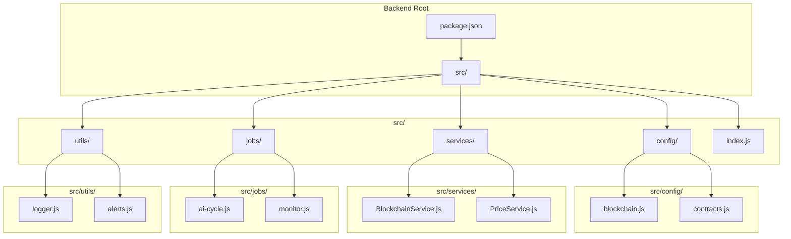
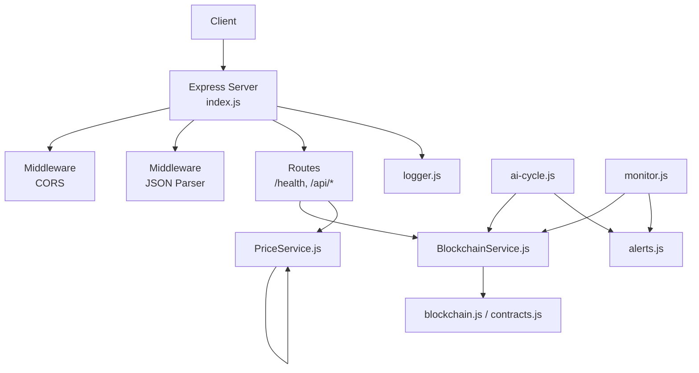
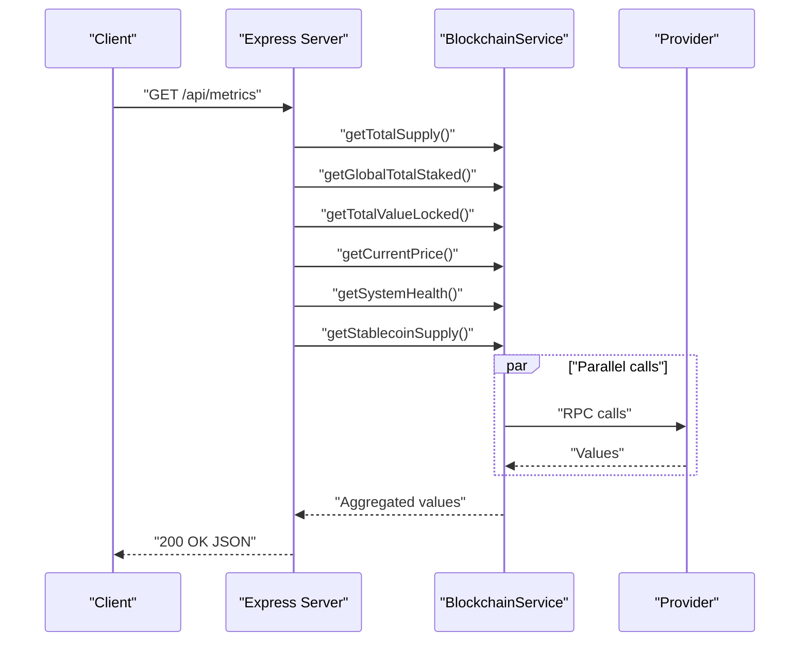
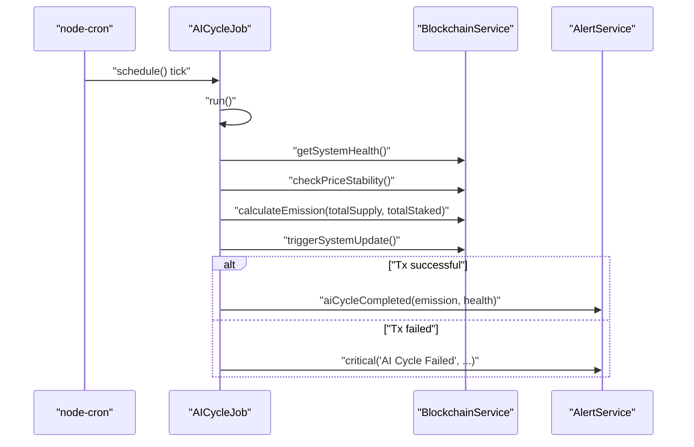
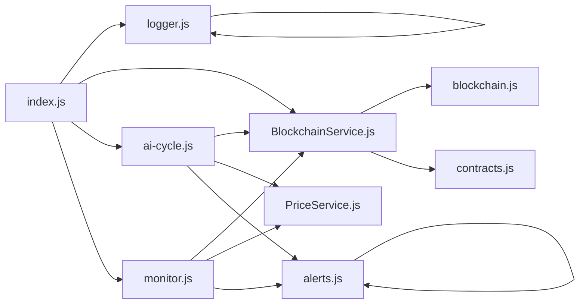

# Backend Overview

<cite>
**Referenced Files in This Document**
- [index.js](file://neurafinance/backend/src/index.js)
- [package.json](file://neurafinance/backend/package.json)
- [logger.js](file://neurafinance/backend/src/utils/logger.js)
- [BlockchainService.js](file://neurafinance/backend/src/services/BlockchainService.js)
- [blockchain.js](file://neurafinance/backend/src/config/blockchain.js)
- [contracts.js](file://neurafinance/backend/src/config/contracts.js)
- [ai-cycle.js](file://neurafinance/backend/src/jobs/ai-cycle.js)
- [monitor.js](file://neurafinance/backend/src/jobs/monitor.js)
- [alerts.js](file://neurafinance/backend/src/utils/alerts.js)
- [PriceService.js](file://neurafinance/backend/src/services/PriceService.js)
</cite>

## Table of Contents
1. [Introduction](#introduction)
2. [Project Structure](#project-structure)
3. [Core Components](#core-components)
4. [Architecture Overview](#architecture-overview)
5. [Detailed Component Analysis](#detailed-component-analysis)
6. [Dependency Analysis](#dependency-analysis)
7. [Performance Considerations](#performance-considerations)
8. [Troubleshooting Guide](#troubleshooting-guide)
9. [Conclusion](#conclusion)
10. [Appendices](#appendices)

## Introduction
This document provides a comprehensive overview of the Node.js backend for the NeuraFinance AI-driven DeFi platform. It explains the Express server setup, middleware configuration, routing structure, error handling, and logging mechanisms. It also documents the REST API endpoints (/health, /api/metrics, /api/price, /api/treasury, and /api/staking), along with practical examples for server startup, route handling, and error responses. The content is designed for both backend developers and system administrators, using terminology consistent with the codebase such as “Express server,” “API endpoints,” and “middleware.”

## Project Structure
The backend is organized around a modular Node.js application using Express. Key areas include:
- Entry point and server wiring
- Configuration for blockchain providers and contract ABIs
- Services for blockchain interactions and price fetching
- Background jobs for AI cycles and monitoring
- Utilities for logging and alerting
- Package configuration and scripts

**Diagram sources**
- [package.json:1-28](file://neurafinance/backend/package.json#L1-L28)
- [index.js:1-177](file://neurafinance/backend/src/index.js#L1-L177)
- [blockchain.js:1-33](file://neurafinance/backend/src/config/blockchain.js#L1-L33)
- [contracts.js:1-146](file://neurafinance/backend/src/config/contracts.js#L1-L146)
- [BlockchainService.js:1-216](file://neurafinance/backend/src/services/BlockchainService.js#L1-L216)
- [PriceService.js:1-77](file://neurafinance/backend/src/services/PriceService.js#L1-L77)
- [ai-cycle.js:1-177](file://neurafinance/backend/src/jobs/ai-cycle.js#L1-L177)
- [monitor.js:1-141](file://neurafinance/backend/src/jobs/monitor.js#L1-L141)
- [logger.js:1-28](file://neurafinance/backend/src/utils/logger.js#L1-L28)
- [alerts.js:1-82](file://neurafinance/backend/src/utils/alerts.js#L1-L82)

**Section sources**
- [package.json:1-28](file://neurafinance/backend/package.json#L1-L28)
- [index.js:1-177](file://neurafinance/backend/src/index.js#L1-L177)

## Core Components
- Express server: Initializes the Express application, sets middleware, defines routes, and starts the HTTP server with graceful shutdown handling.
- Middleware: Enables CORS and JSON parsing globally.
- Logging: Winston-based logger with file and console transports, configurable log level.
- Blockchain service: Centralized Ethereum provider and contract interaction layer.
- Jobs: Scheduled tasks for AI cycle and monitoring.
- Alerts: Webhook/email notifications for critical events.
- Price service: Optional external price API with caching.

**Section sources**
- [index.js:15-21](file://neurafinance/backend/src/index.js#L15-L21)
- [logger.js:1-28](file://neurafinance/backend/src/utils/logger.js#L1-L28)
- [BlockchainService.js:12-37](file://neurafinance/backend/src/services/BlockchainService.js#L12-L37)
- [ai-cycle.js:13-161](file://neurafinance/backend/src/jobs/ai-cycle.js#L13-L161)
- [monitor.js:12-125](file://neurafinance/backend/src/jobs/monitor.js#L12-L125)
- [alerts.js:4-82](file://neurafinance/backend/src/utils/alerts.js#L4-L82)
- [PriceService.js:4-77](file://neurafinance/backend/src/services/PriceService.js#L4-L77)

## Architecture Overview
The backend follows a layered architecture:
- Presentation layer: Express routes and middleware
- Application layer: Route handlers orchestrate service calls
- Domain services: BlockchainService and PriceService encapsulate domain logic
- Infrastructure: Configuration for RPC provider, contracts, and cron scheduling
- Observability: Logger and alerting utilities

**Diagram sources**
- [index.js:15-165](file://neurafinance/backend/src/index.js#L15-L165)
- [BlockchainService.js:1-216](file://neurafinance/backend/src/services/BlockchainService.js#L1-L216)
- [PriceService.js:1-77](file://neurafinance/backend/src/services/PriceService.js#L1-L77)
- [blockchain.js:1-33](file://neurafinance/backend/src/config/blockchain.js#L1-L33)
- [contracts.js:1-146](file://neurafinance/backend/src/config/contracts.js#L1-L146)
- [ai-cycle.js:1-177](file://neurafinance/backend/src/jobs/ai-cycle.js#L1-L177)
- [monitor.js:1-141](file://neurafinance/backend/src/jobs/monitor.js#L1-L141)
- [logger.js:1-28](file://neurafinance/backend/src/utils/logger.js#L1-L28)
- [alerts.js:1-82](file://neurafinance/backend/src/utils/alerts.js#L1-L82)

## Detailed Component Analysis

### Express Server Setup and Middleware
- Initialization: Creates an Express application and loads environment variables via dotenv.
- Middleware:
  - CORS enabled for cross-origin requests.
  - JSON body parsing for request payloads.
- Environment:
  - Port defaults to 3001 if not provided.
  - Node.js runtime requirement is >= 18.0.0.

Practical example references:
- Server initialization and port binding: [index.js:15-16](file://neurafinance/backend/src/index.js#L15-L16)
- Middleware setup: [index.js:18-21](file://neurafinance/backend/src/index.js#L18-L21)
- Environment configuration: [index.js](file://neurafinance/backend/src/index.js#L16), [package.json:24-26](file://neurafinance/backend/package.json#L24-L26)

**Section sources**
- [index.js:6-21](file://neurafinance/backend/src/index.js#L6-L21)
- [package.json:24-26](file://neurafinance/backend/package.json#L24-L26)

### Routing Structure and API Endpoints
The Express server exposes the following API endpoints:

- GET /health
  - Purpose: Health check integrating blockchain connectivity and system health.
  - Behavior: Queries block number and system health; responds with structured JSON or 503 on failure.
  - Example response shape: [index.js:22-41](file://neurafinance/backend/src/index.js#L22-L41)

- GET /api/metrics
  - Purpose: Aggregates system-wide metrics (supply, staked, TVL, price, health, stablecoin supply).
  - Behavior: Concurrently resolves multiple blockchain queries; logs errors and returns 500 on failure.
  - Example response shape: [index.js:43-75](file://neurafinance/backend/src/index.js#L43-L75)

- GET /api/price
  - Purpose: Returns current token price and stability status.
  - Behavior: Fetches price and checks stability; logs errors and returns 500 on failure.
  - Example response shape: [index.js:77-93](file://neurafinance/backend/src/index.js#L77-L93)

- GET /api/treasury
  - Purpose: Returns treasury total value locked (TVL).
  - Behavior: Retrieves TVL from treasury contract; logs errors and returns 500 on failure.
  - Example response shape: [index.js:95-108](file://neurafinance/backend/src/index.js#L95-L108)

- GET /api/staking
  - Purpose: Returns total staked, total supply, and derived staking ratio.
  - Behavior: Computes ratio safely; logs errors and returns 500 on failure.
  - Example response shape: [index.js:110-131](file://neurafinance/backend/src/index.js#L110-L131)

- POST /api/admin/ai-cycle *(admin route)*
  - Purpose: Manually triggers the AI cycle job.
  - Behavior: Executes the AI cycle workflow; logs failures and returns 500 on error.
  - Example response shape: [index.js:133-143](file://neurafinance/backend/src/index.js#L133-L143)

Sequence diagram for GET /api/metrics:

**Diagram sources**
- [index.js:43-75](file://neurafinance/backend/src/index.js#L43-L75)
- [BlockchainService.js:40-190](file://neurafinance/backend/src/services/BlockchainService.js#L40-L190)

**Section sources**
- [index.js:22-143](file://neurafinance/backend/src/index.js#L22-L143)

### Error Handling Patterns
- Route-level try/catch: Each endpoint wraps logic in try/catch to handle blockchain or service errors.
- Global error middleware: A final middleware catches unhandled errors and returns a generic 500 with JSON error payload.
- Logging: Errors are logged using Winston before responding.

Example references:
- Global error handler: [index.js:145-149](file://neurafinance/backend/src/index.js#L145-L149)
- Logger usage in routes: [index.js:72-73](file://neurafinance/backend/src/index.js#L72-L73), [index.js:90-91](file://neurafinance/backend/src/index.js#L90-L91), [index.js:104-106](file://neurafinance/backend/src/index.js#L104-L106), [index.js:127-129](file://neurafinance/backend/src/index.js#L127-L129), [index.js:139-142](file://neurafinance/backend/src/index.js#L139-L142)
- Logger configuration: [logger.js:1-28](file://neurafinance/backend/src/utils/logger.js#L1-L28)

**Section sources**
- [index.js:145-149](file://neurafinance/backend/src/index.js#L145-L149)
- [logger.js:1-28](file://neurafinance/backend/src/utils/logger.js#L1-L28)

### Logging Mechanisms
- Winston logger:
  - Levels: configurable via LOG_LEVEL environment variable.
  - Transports: file transports for combined and error logs; console transport in non-production environments.
  - Format: timestamped JSON with stack traces for errors.
- Usage:
  - Routes log errors during metric retrieval.
  - Jobs and services log operational events and warnings.
  - Admin endpoint logs manual AI cycle attempts.

Example references:
- Logger creation and transports: [logger.js:3-25](file://neurafinance/backend/src/utils/logger.js#L3-L25)
- Route logging: [index.js:72-73](file://neurafinance/backend/src/index.js#L72-L73), [index.js:90-91](file://neurafinance/backend/src/index.js#L90-L91), [index.js:104-106](file://neurafinance/backend/src/index.js#L104-L106), [index.js:127-129](file://neurafinance/backend/src/index.js#L127-L129), [index.js:139-142](file://neurafinance/backend/src/index.js#L139-L142)
- Job logging: [ai-cycle.js:26-84](file://neurafinance/backend/src/jobs/ai-cycle.js#L26-L84), [monitor.js:21-84](file://neurafinance/backend/src/jobs/monitor.js#L21-L84)

**Section sources**
- [logger.js:1-28](file://neurafinance/backend/src/utils/logger.js#L1-L28)
- [ai-cycle.js:19-84](file://neurafinance/backend/src/jobs/ai-cycle.js#L19-L84)
- [monitor.js:86-110](file://neurafinance/backend/src/jobs/monitor.js#L86-L110)

### Blockchain Integration and Configuration
- Provider and wallet:
  - JsonRpcProvider initialized with POLYGON_RPC_URL.
  - Wallet instantiated with PRIVATE_KEY and connected to the provider.
- Contracts:
  - Contract addresses loaded from environment variables.
  - getContract factory creates typed contract instances with the wallet signer.
- ABI definitions:
  - NEURON_TOKEN, TREASURY, STAKING, LENDING, STABLECOIN, AI_ENGINE ABIs defined for interaction.

Example references:
- Provider and wallet: [blockchain.js:4-8](file://neurafinance/backend/src/config/blockchain.js#L4-L8)
- Contract addresses and factory: [blockchain.js:10-25](file://neurafinance/backend/src/config/blockchain.js#L10-L25)
- ABI exports: [contracts.js:1-146](file://neurafinance/backend/src/config/contracts.js#L1-L146)
- Service usage of contracts: [BlockchainService.js:18-37](file://neurafinance/backend/src/services/BlockchainService.js#L18-L37)

**Section sources**
- [blockchain.js:1-33](file://neurafinance/backend/src/config/blockchain.js#L1-L33)
- [contracts.js:1-146](file://neurafinance/backend/src/config/contracts.js#L1-L146)
- [BlockchainService.js:12-37](file://neurafinance/backend/src/services/BlockchainService.js#L12-L37)

### Background Jobs: AI Cycle and Monitoring
- AI Cycle Job:
  - Runs on a configurable cron schedule (default every 12 hours) and also on startup.
  - Gathers metrics, checks system health and price stability, calculates emission, triggers system updates, and checks for liquidations.
  - Emits alerts for low health, price deviations, and completion.
- Monitor Job:
  - Runs periodically (default every 5 minutes) to monitor treasury balance, price movements, system health, and blockchain blocks.
  - Sends alerts for low treasury, significant price deviations, and health degradation.

Sequence diagram for AI Cycle Job:

**Diagram sources**
- [ai-cycle.js:148-161](file://neurafinance/backend/src/jobs/ai-cycle.js#L148-L161)
- [ai-cycle.js:19-84](file://neurafinance/backend/src/jobs/ai-cycle.js#L19-L84)
- [BlockchainService.js:106-143](file://neurafinance/backend/src/services/BlockchainService.js#L106-L143)
- [alerts.js:73-78](file://neurafinance/backend/src/utils/alerts.js#L73-L78)

**Section sources**
- [ai-cycle.js:13-161](file://neurafinance/backend/src/jobs/ai-cycle.js#L13-L161)
- [monitor.js:12-125](file://neurafinance/backend/src/jobs/monitor.js#L12-L125)
- [alerts.js:4-82](file://neurafinance/backend/src/utils/alerts.js#L4-L82)

### Price Service
- Purpose: Provides token price with caching and fallback logic.
- Behavior:
  - Caches price for 5 minutes.
  - Attempts to fetch from external API; falls back to default price if unavailable.
  - Logs errors and maintains resilience.

Example references:
- Cache and fallback: [PriceService.js:11-53](file://neurafinance/backend/src/services/PriceService.js#L11-L53)
- Market data aggregation: [PriceService.js:55-68](file://neurafinance/backend/src/services/PriceService.js#L55-L68)

**Section sources**
- [PriceService.js:1-77](file://neurafinance/backend/src/services/PriceService.js#L1-L77)

### Environment Configuration
Key environment variables:
- PORT: Server port (default 3001)
- NODE_ENV: Environment mode (affects console transport)
- LOG_LEVEL: Winston log level
- POLYGON_RPC_URL: JSON-RPC endpoint for Polygon
- PRIVATE_KEY: Wallet private key for signing transactions
- NEURON_TOKEN_ADDRESS, TREASURY_ADDRESS, STAKING_ADDRESS, LENDING_ADDRESS, STABLECOIN_ADDRESS, AI_ENGINE_ADDRESS: Contract addresses
- ALERT_WEBHOOK_URL: Optional webhook for alerts
- ALERT_EMAIL: Optional email for alerts
- AI_CYCLE_INTERVAL: Cron schedule for AI cycle
- PRICE_CHECK_INTERVAL: Cron schedule for monitor job
- PRICE_API_URL: External price API base URL
- LOG_LEVEL: Winston log level

Example references:
- Server port and env: [index.js](file://neurafinance/backend/src/index.js#L16)
- Logger level: [logger.js](file://neurafinance/backend/src/utils/logger.js#L4)
- Provider and wallet: [blockchain.js:4-8](file://neurafinance/backend/src/config/blockchain.js#L4-L8)
- Contract addresses: [blockchain.js:10-20](file://neurafinance/backend/src/config/blockchain.js#L10-L20)
- Alert destinations: [alerts.js:6-7](file://neurafinance/backend/src/utils/alerts.js#L6-L7)
- Cron intervals: [ai-cycle.js](file://neurafinance/backend/src/jobs/ai-cycle.js#L150), [monitor.js](file://neurafinance/backend/src/jobs/monitor.js#L114)

**Section sources**
- [index.js](file://neurafinance/backend/src/index.js#L16)
- [logger.js](file://neurafinance/backend/src/utils/logger.js#L4)
- [blockchain.js:4-20](file://neurafinance/backend/src/config/blockchain.js#L4-L20)
- [alerts.js:6-7](file://neurafinance/backend/src/utils/alerts.js#L6-L7)
- [ai-cycle.js](file://neurafinance/backend/src/jobs/ai-cycle.js#L150)
- [monitor.js](file://neurafinance/backend/src/jobs/monitor.js#L114)

### Dependency Management and Scripts
- Dependencies:
  - express, cors, dotenv, winston, node-cron, axios, ethers
- Dev dependencies:
  - nodemon for development
- Scripts:
  - start: runs the production server
  - dev: runs with hot reload using nodemon
  - monitor: runs the monitor job standalone
  - ai-cycle: runs the AI cycle job standalone
- Node.js engine requirement: >= 18.0.0

Example references:
- Dependencies and scripts: [package.json:12-23](file://neurafinance/backend/package.json#L12-L23)
- Engine requirement: [package.json:24-26](file://neurafinance/backend/package.json#L24-L26)

**Section sources**
- [package.json:1-28](file://neurafinance/backend/package.json#L1-L28)

### Deployment Considerations
- Runtime:
  - Ensure Node.js version meets the engine requirement.
- Environment:
  - Set all required environment variables for RPC, private key, contract addresses, and optional alert/webhook endpoints.
- Logging:
  - Verify log directory permissions for Winston file transports.
- Scheduling:
  - Confirm cron schedules align with operational needs.
- Security:
  - The admin endpoint lacks authentication; restrict access appropriately in production.
- Health monitoring:
  - Use the /health endpoint for readiness/liveness checks.

[No sources needed since this section provides general guidance]

## Dependency Analysis
The backend exhibits clear separation of concerns with explicit dependencies among modules.

**Diagram sources**
- [index.js:10-13](file://neurafinance/backend/src/index.js#L10-L13)
- [BlockchainService.js:1-10](file://neurafinance/backend/src/services/BlockchainService.js#L1-L10)
- [blockchain.js:1-9](file://neurafinance/backend/src/config/blockchain.js#L1-L9)
- [contracts.js:1-146](file://neurafinance/backend/src/config/contracts.js#L1-L146)
- [ai-cycle.js:7-11](file://neurafinance/backend/src/jobs/ai-cycle.js#L7-L11)
- [monitor.js:6-10](file://neurafinance/backend/src/jobs/monitor.js#L6-L10)
- [alerts.js:1-2](file://neurafinance/backend/src/utils/alerts.js#L1-L2)
- [PriceService.js:1-2](file://neurafinance/backend/src/services/PriceService.js#L1-L2)
- [logger.js](file://neurafinance/backend/src/utils/logger.js#L1)

**Section sources**
- [index.js:10-13](file://neurafinance/backend/src/index.js#L10-L13)
- [BlockchainService.js:1-10](file://neurafinance/backend/src/services/BlockchainService.js#L1-L10)
- [ai-cycle.js:7-11](file://neurafinance/backend/src/jobs/ai-cycle.js#L7-L11)
- [monitor.js:6-10](file://neurafinance/backend/src/jobs/monitor.js#L6-L10)
- [alerts.js:1-2](file://neurafinance/backend/src/utils/alerts.js#L1-L2)
- [PriceService.js:1-2](file://neurafinance/backend/src/services/PriceService.js#L1-L2)
- [logger.js](file://neurafinance/backend/src/utils/logger.js#L1)

## Performance Considerations
- Parallelism:
  - Metrics endpoint uses concurrent promises to minimize latency across multiple blockchain queries.
- Caching:
  - Price service caches results for 5 minutes to reduce external API load.
- Asynchronous processing:
  - Background jobs use cron scheduling to avoid blocking the main thread.
- Recommendations:
  - Add circuit breakers for external APIs.
  - Consider rate limiting for public endpoints.
  - Instrument key endpoints with metrics for latency and error rates.

[No sources needed since this section provides general guidance]

## Troubleshooting Guide
Common issues and resolutions:
- Server fails to start:
  - Verify PORT and NODE_ENV are set; confirm environment variables for RPC and private key are present.
  - Check Winston log directory permissions.
- Blockchain calls fail:
  - Ensure POLYGON_RPC_URL and PRIVATE_KEY are valid.
  - Confirm contract addresses are set for required modules.
- Missing or stale metrics:
  - Check cron schedules for AI cycle and monitor jobs.
  - Validate external price API availability or adjust PRICE_API_URL.
- Alerts not sent:
  - Verify ALERT_WEBHOOK_URL or ALERT_EMAIL environment variables.
  - Review webhook configuration and network connectivity.

**Section sources**
- [index.js](file://neurafinance/backend/src/index.js#L16)
- [blockchain.js:4-20](file://neurafinance/backend/src/config/blockchain.js#L4-L20)
- [ai-cycle.js](file://neurafinance/backend/src/jobs/ai-cycle.js#L150)
- [monitor.js](file://neurafinance/backend/src/jobs/monitor.js#L114)
- [alerts.js:6-7](file://neurafinance/backend/src/utils/alerts.js#L6-L7)
- [logger.js:12-16](file://neurafinance/backend/src/utils/logger.js#L12-L16)

## Conclusion
The NeuraFinance backend is a modular, event-driven Node.js application built on Express. It integrates blockchain interactions through a centralized service layer, provides essential DeFi metrics via REST endpoints, and automates system maintenance through scheduled jobs. Robust logging and alerting support operational visibility, while environment-driven configuration enables flexible deployments. For production, secure the admin endpoint, harden error handling, and instrument performance monitoring.

[No sources needed since this section summarizes without analyzing specific files]

## Appendices

### Practical Examples

- Server startup
  - Production: npm start
  - Development: npm run dev
  - References: [package.json:6-10](file://neurafinance/backend/package.json#L6-L10), [index.js:151-165](file://neurafinance/backend/src/index.js#L151-L165)

- Route handling
  - GET /health: [index.js:22-41](file://neurafinance/backend/src/index.js#L22-L41)
  - GET /api/metrics: [index.js:43-75](file://neurafinance/backend/src/index.js#L43-L75)
  - GET /api/price: [index.js:77-93](file://neurafinance/backend/src/index.js#L77-L93)
  - GET /api/treasury: [index.js:95-108](file://neurafinance/backend/src/index.js#L95-L108)
  - GET /api/staking: [index.js:110-131](file://neurafinance/backend/src/index.js#L110-L131)
  - POST /api/admin/ai-cycle: [index.js:133-143](file://neurafinance/backend/src/index.js#L133-L143)

- Error responses
  - Route-level error handling and logging: [index.js:72-73](file://neurafinance/backend/src/index.js#L72-L73), [index.js:90-91](file://neurafinance/backend/src/index.js#L90-L91), [index.js:104-106](file://neurafinance/backend/src/index.js#L104-L106), [index.js:127-129](file://neurafinance/backend/src/index.js#L127-L129), [index.js:139-142](file://neurafinance/backend/src/index.js#L139-L142)
  - Global error middleware: [index.js:145-149](file://neurafinance/backend/src/index.js#L145-L149)

- Background jobs
  - AI cycle scheduling and execution: [ai-cycle.js:148-161](file://neurafinance/backend/src/jobs/ai-cycle.js#L148-L161)
  - Monitor scheduling and execution: [monitor.js:112-125](file://neurafinance/backend/src/jobs/monitor.js#L112-L125)

- Logging
  - Logger configuration and transports: [logger.js:3-25](file://neurafinance/backend/src/utils/logger.js#L3-L25)

- Blockchain configuration
  - Provider and wallet setup: [blockchain.js:4-8](file://neurafinance/backend/src/config/blockchain.js#L4-L8)
  - Contract addresses and factory: [blockchain.js:10-25](file://neurafinance/backend/src/config/blockchain.js#L10-L25)

- Environment variables
  - Required and optional variables: [index.js](file://neurafinance/backend/src/index.js#L16), [logger.js](file://neurafinance/backend/src/utils/logger.js#L4), [blockchain.js:4-20](file://neurafinance/backend/src/config/blockchain.js#L4-L20), [alerts.js:6-7](file://neurafinance/backend/src/utils/alerts.js#L6-L7), [ai-cycle.js](file://neurafinance/backend/src/jobs/ai-cycle.js#L150), [monitor.js](file://neurafinance/backend/src/jobs/monitor.js#L114)