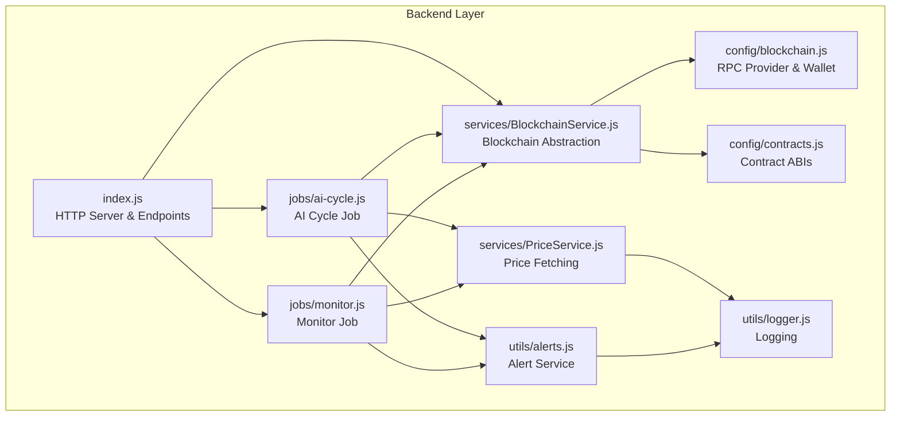
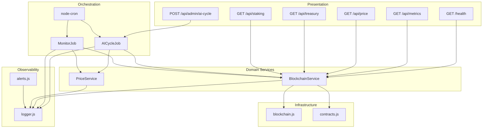
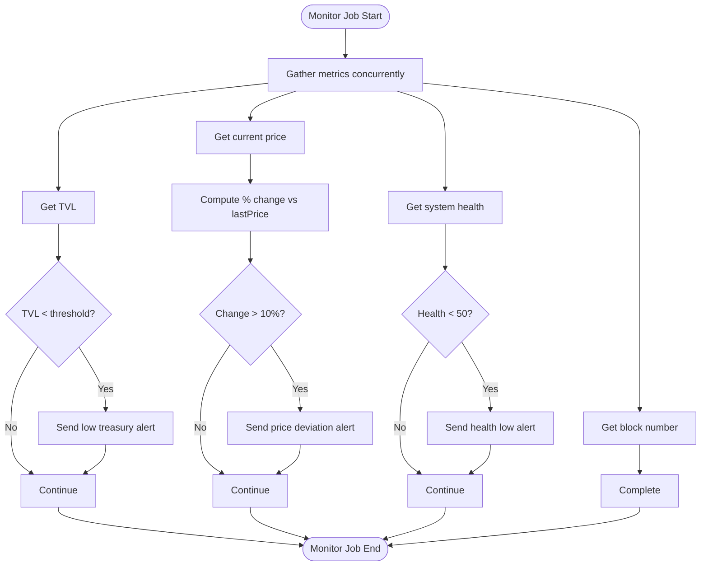
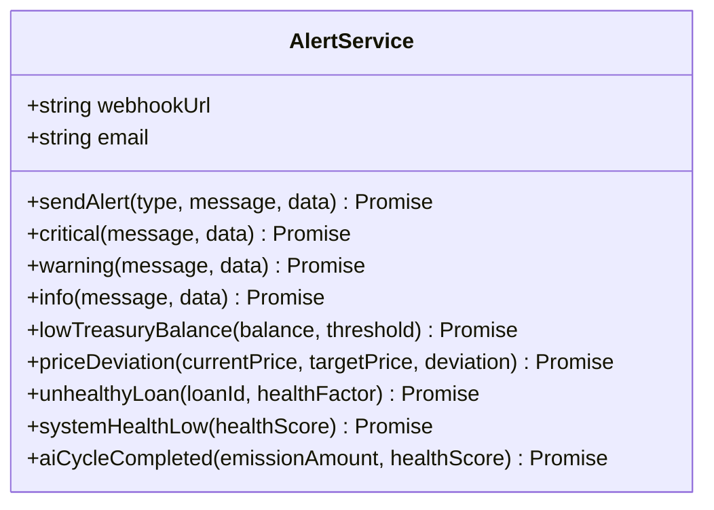
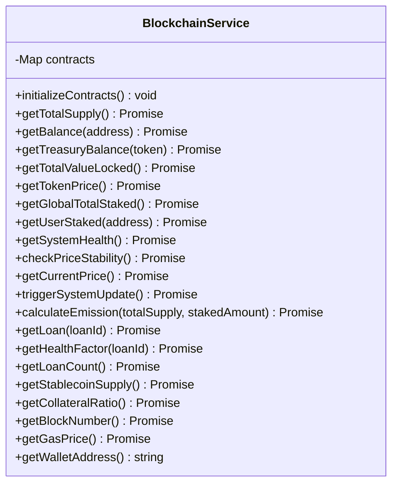
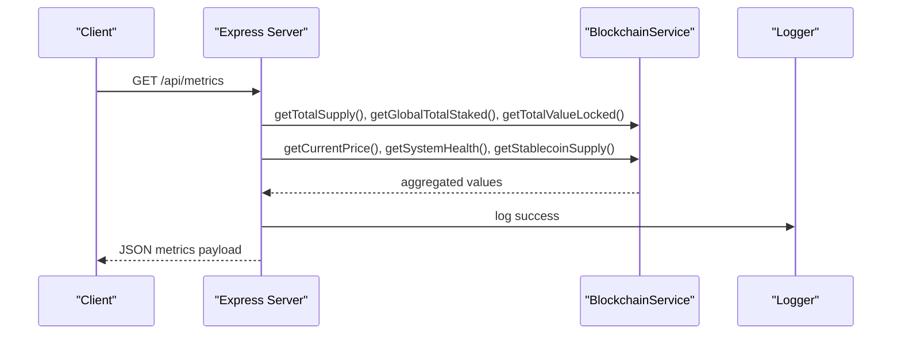
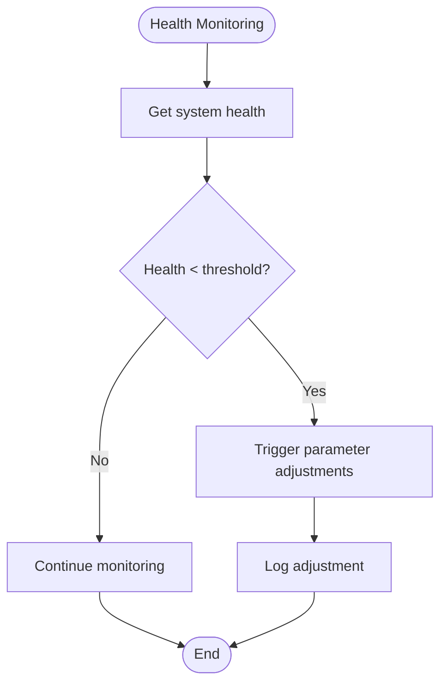
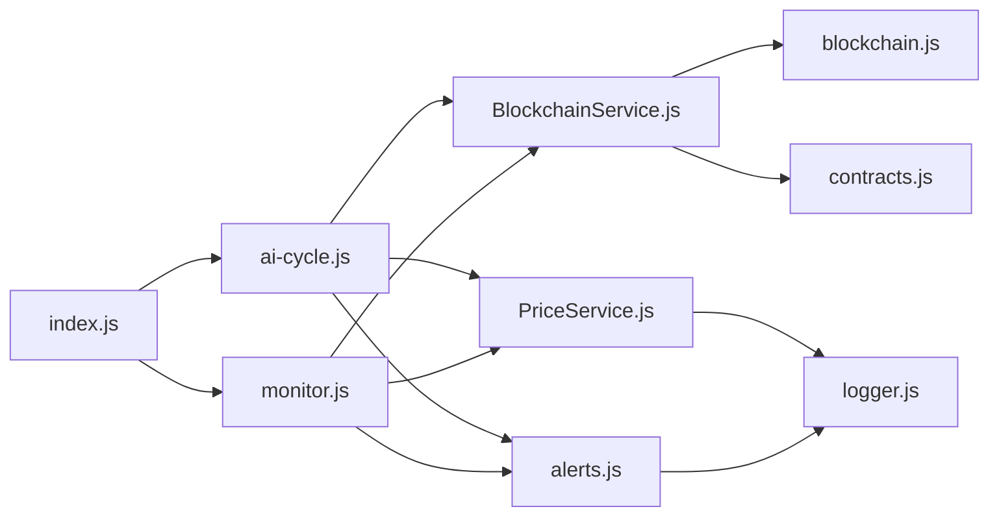

# Backend Services Architecture

<cite>
**Referenced Files in This Document**
- [index.js](file://neurafinance/backend/src/index.js)
- [BlockchainService.js](file://neurafinance/backend/src/services/BlockchainService.js)
- [ai-cycle.js](file://neurafinance/backend/src/jobs/ai-cycle.js)
- [monitor.js](file://neurafinance/backend/src/jobs/monitor.js)
- [alerts.js](file://neurafinance/backend/src/utils/alerts.js)
- [blockchain.js](file://neurafinance/backend/src/config/blockchain.js)
- [contracts.js](file://neurafinance/backend/src/config/contracts.js)
- [logger.js](file://neurafinance/backend/src/utils/logger.js)
- [PriceService.js](file://neurafinance/backend/src/services/PriceService.js)
- [ARCHITECTURE.md](file://neurafinance/ARCHITECTURE.md)
- [package.json](file://neurafinance/backend/package.json)
</cite>

## Table of Contents
1. [Introduction](#introduction)
2. [Project Structure](#project-structure)
3. [Core Components](#core-components)
4. [Architecture Overview](#architecture-overview)
5. [Detailed Component Analysis](#detailed-component-analysis)
6. [Dependency Analysis](#dependency-analysis)
7. [Performance Considerations](#performance-considerations)
8. [Troubleshooting Guide](#troubleshooting-guide)
9. [Conclusion](#conclusion)
10. [Appendices](#appendices)

## Introduction
This document describes the backend services architecture for the Node.js automation layer of the NeuraFinance AI-driven DeFi platform. It focuses on three primary backend components:
- AI Cycle Management: Automated orchestration that runs every 12 hours to evaluate system health, check price stability, calculate emissions, and trigger system updates on-chain.
- Monitoring Services: Continuous monitoring jobs that track treasury balances, token price movements, system health scores, and blockchain activity.
- Alerting Systems: Centralized alert service that emits structured notifications via webhooks and logs for critical and informational events.

The backend integrates with a blockchain service abstraction layer (BlockchainService) to interact with smart contracts deployed on Polygon. It exposes REST endpoints for health checks, metrics, and administrative controls, and schedules recurring tasks using cron-based job runners.

## Project Structure
The backend is organized into layered modules:
- Entry point and HTTP server: Express-based API with health and metrics endpoints.
- Jobs: Scheduled automation for AI cycles and continuous monitoring.
- Services: Business logic abstractions, including BlockchainService and PriceService.
- Utilities: Logging and alerting utilities.
- Configuration: Blockchain provider, wallet, and contract ABIs.



**Diagram sources**
- [index.js:15-165](file://neurafinance/backend/src/index.js#L15-L165)
- [blockchain.js:1-33](file://neurafinance/backend/src/config/blockchain.js#L1-L33)
- [contracts.js:1-146](file://neurafinance/backend/src/config/contracts.js#L1-L146)
- [BlockchainService.js:12-216](file://neurafinance/backend/src/services/BlockchainService.js#L12-L216)
- [PriceService.js:4-77](file://neurafinance/backend/src/services/PriceService.js#L4-L77)
- [ai-cycle.js:13-177](file://neurafinance/backend/src/jobs/ai-cycle.js#L13-L177)
- [monitor.js:12-141](file://neurafinance/backend/src/jobs/monitor.js#L12-L141)
- [alerts.js:4-82](file://neurafinance/backend/src/utils/alerts.js#L4-L82)
- [logger.js:1-28](file://neurafinance/backend/src/utils/logger.js#L1-L28)

**Section sources**
- [index.js:15-165](file://neurafinance/backend/src/index.js#L15-L165)
- [ARCHITECTURE.md:56-80](file://neurafinance/ARCHITECTURE.md#L56-L80)

## Core Components
- BlockchainService: Centralized abstraction over Ethereum provider and smart contracts. Provides methods to query token supplies, treasury TVL, staking totals, AI engine health, price stability, and to trigger system updates and emission calculations.
- AI Cycle Job: Orchestrates a 12-hour automated loop that gathers system metrics, evaluates health and price stability, calculates emissions, triggers on-chain system updates, and checks for potential liquidations.
- Monitor Job: Runs continuously (every 5 minutes) to monitor treasury balances, price volatility, system health trends, and blockchain block progression.
- Alert Service: Emits structured alerts to configured webhooks and logs, categorized by severity (INFO, WARNING, CRITICAL).
- HTTP API: Exposes endpoints for health checks, metrics, price, treasury, staking, and manual AI cycle triggering.

**Section sources**
- [BlockchainService.js:12-216](file://neurafinance/backend/src/services/BlockchainService.js#L12-L216)
- [ai-cycle.js:13-177](file://neurafinance/backend/src/jobs/ai-cycle.js#L13-L177)
- [monitor.js:12-141](file://neurafinance/backend/src/jobs/monitor.js#L12-L141)
- [alerts.js:4-82](file://neurafinance/backend/src/utils/alerts.js#L4-L82)
- [index.js:22-143](file://neurafinance/backend/src/index.js#L22-L143)

## Architecture Overview
The backend architecture follows a layered design:
- Presentation: Express HTTP server exposing REST endpoints.
- Orchestration: Cron-based jobs for AI Cycle and Monitor Jobs.
- Domain Services: BlockchainService and PriceService encapsulate external integrations.
- Infrastructure: Configuration for RPC provider, wallet, and contract ABIs.
- Observability: Logger and Alert Service for operational visibility.



**Diagram sources**
- [index.js:22-143](file://neurafinance/backend/src/index.js#L22-L143)
- [ai-cycle.js:148-161](file://neurafinance/backend/src/jobs/ai-cycle.js#L148-L161)
- [monitor.js:112-125](file://neurafinance/backend/src/jobs/monitor.js#L112-L125)
- [BlockchainService.js:12-37](file://neurafinance/backend/src/services/BlockchainService.js#L12-L37)
- [blockchain.js:1-33](file://neurafinance/backend/src/config/blockchain.js#L1-L33)
- [contracts.js:1-146](file://neurafinance/backend/src/config/contracts.js#L1-L146)
- [logger.js:1-28](file://neurafinance/backend/src/utils/logger.js#L1-L28)
- [alerts.js:4-82](file://neurafinance/backend/src/utils/alerts.js#L4-L82)

## Detailed Component Analysis

### AI Cycle Management
The AI Cycle orchestrates a 12-hour automated process that:
- Gathers system metrics (block number, token supply, staked amounts, TVL, price, stablecoin supply, collateral ratio).
- Checks system health and price stability thresholds.
- Calculates emission based on total supply and staked amounts.
- Triggers a system update on-chain and logs completion.
- Scans recent loans for potential liquidations and alerts on unhealthy ones.

```mermaid
sequenceDiagram
participant Cron as "node-cron"
participant AIC as "AICycleJob"
participant BCS as "BlockchainService"
participant PRS as "PriceService"
participant ALT as "AlertService"
participant Log as "Logger"
Cron->>AIC : schedule() fires every 12h
AIC->>Log : log start
AIC->>BCS : gatherMetrics()
AIC->>BCS : getSystemHealth()
alt health < threshold
AIC->>ALT : systemHealthLow(healthScore)
end
AIC->>BCS : checkPriceStability()
alt unstable
AIC->>ALT : priceDeviation(currentPrice, targetPrice, deviation)
end
AIC->>BCS : getTotalSupply(), getGlobalTotalStaked()
AIC->>BCS : calculateEmission(totalSupply, totalStaked)
AIC->>BCS : triggerSystemUpdate()
AIC->>ALT : aiCycleCompleted(emission, healthScore)
AIC->>BCS : getLoanCount(), getHealthFactor(i)
AIC->>ALT : unhealthyLoan(loanId, healthFactor)
AIC->>Log : log completion
```

**Diagram sources**
- [ai-cycle.js:19-85](file://neurafinance/backend/src/jobs/ai-cycle.js#L19-L85)
- [BlockchainService.js:106-143](file://neurafinance/backend/src/services/BlockchainService.js#L106-L143)
- [alerts.js:44-78](file://neurafinance/backend/src/utils/alerts.js#L44-L78)

**Section sources**
- [ai-cycle.js:13-177](file://neurafinance/backend/src/jobs/ai-cycle.js#L13-L177)
- [BlockchainService.js:106-143](file://neurafinance/backend/src/services/BlockchainService.js#L106-L143)
- [alerts.js:44-78](file://neurafinance/backend/src/utils/alerts.js#L44-L78)

### Monitoring Services
The Monitor Job runs every 5 minutes and performs:
- Treasury TVL monitoring with low-balance thresholds.
- Price deviation detection compared to previous readings.
- System health trend monitoring with degradation alerts.
- Blockchain block number tracking.



**Diagram sources**
- [monitor.js:99-110](file://neurafinance/backend/src/jobs/monitor.js#L99-L110)
- [monitor.js:21-84](file://neurafinance/backend/src/jobs/monitor.js#L21-L84)

**Section sources**
- [monitor.js:12-141](file://neurafinance/backend/src/jobs/monitor.js#L12-L141)

### Alerting Systems
The Alert Service centralizes notification delivery:
- Supports INFO, WARNING, and CRITICAL severity levels.
- Sends structured alerts to a configurable webhook URL.
- Logs alerts with timestamps and associated data.
- Provides convenience methods for specific alert types (low treasury, price deviation, unhealthy loan, system health low, AI cycle completed).



**Diagram sources**
- [alerts.js:4-82](file://neurafinance/backend/src/utils/alerts.js#L4-L82)

**Section sources**
- [alerts.js:4-82](file://neurafinance/backend/src/utils/alerts.js#L4-L82)

### Blockchain Service Abstraction Layer
BlockchainService initializes contract instances and exposes domain methods:
- Token operations: total supply, balance queries.
- Treasury operations: balances, TVL, token price.
- Staking operations: global and user stakes.
- AI Engine operations: system health, price stability, current price, emission calculation, system update triggers.
- Lending operations: loan details and health factors.
- Stablecoin operations: supply and collateral ratios.
- Utility functions: block number, gas price, wallet address.



**Diagram sources**
- [BlockchainService.js:12-216](file://neurafinance/backend/src/services/BlockchainService.js#L12-L216)
- [blockchain.js:18-37](file://neurafinance/backend/src/config/blockchain.js#L18-L37)
- [contracts.js:108-134](file://neurafinance/backend/src/config/contracts.js#L108-L134)

**Section sources**
- [BlockchainService.js:12-216](file://neurafinance/backend/src/services/BlockchainService.js#L12-L216)
- [blockchain.js:18-37](file://neurafinance/backend/src/config/blockchain.js#L18-L37)
- [contracts.js:108-134](file://neurafinance/backend/src/config/contracts.js#L108-L134)

### Real-time Metrics Gathering
The backend exposes a metrics endpoint that concurrently fetches:
- Total supply, total staked, TVL, token price, system health, and stablecoin supply.
- Uses Promise.all to minimize latency and improve throughput.



**Diagram sources**
- [index.js:44-75](file://neurafinance/backend/src/index.js#L44-L75)
- [BlockchainService.js:40-190](file://neurafinance/backend/src/services/BlockchainService.js#L40-L190)

**Section sources**
- [index.js:44-75](file://neurafinance/backend/src/index.js#L44-L75)
- [BlockchainService.js:40-190](file://neurafinance/backend/src/services/BlockchainService.js#L40-L190)

### Health Monitoring and Parameter Adjustment Triggers
- Health monitoring: The Monitor Job tracks system health trends and triggers critical alerts when degradation crosses thresholds.
- Parameter adjustment triggers: The AI Cycle reads system health and price stability to decide whether to trigger system updates and emission adjustments via the AI Engine smart contract.



**Diagram sources**
- [monitor.js:67-84](file://neurafinance/backend/src/jobs/monitor.js#L67-L84)
- [ai-cycle.js:33-41](file://neurafinance/backend/src/jobs/ai-cycle.js#L33-L41)
- [BlockchainService.js:106-122](file://neurafinance/backend/src/services/BlockchainService.js#L106-L122)

**Section sources**
- [monitor.js:67-84](file://neurafinance/backend/src/jobs/monitor.js#L67-L84)
- [ai-cycle.js:33-41](file://neurafinance/backend/src/jobs/ai-cycle.js#L33-L41)
- [BlockchainService.js:106-122](file://neurafinance/backend/src/services/BlockchainService.js#L106-L122)

### Emergency Alert Systems
Emergency alerts are emitted for:
- Low treasury balance.
- Significant price deviations (>10%).
- Unhealthy loans detected during AI Cycle scanning.
- System health below critical thresholds.
- AI Cycle failures.

Alerts are sent to configured webhook endpoints and logged with structured metadata for incident response.

**Section sources**
- [alerts.js:44-78](file://neurafinance/backend/src/utils/alerts.js#L44-L78)
- [monitor.js:30-33](file://neurafinance/backend/src/jobs/monitor.js#L30-L33)
- [monitor.js:48-58](file://neurafinance/backend/src/jobs/monitor.js#L48-L58)
- [ai-cycle.js:133-142](file://neurafinance/backend/src/jobs/ai-cycle.js#L133-L142)
- [ai-cycle.js:37-41](file://neurafinance/backend/src/jobs/ai-cycle.js#L37-L41)

## Dependency Analysis
The backend components exhibit clear separation of concerns with explicit dependencies:
- index.js depends on jobs and services for orchestration and HTTP endpoints.
- Jobs depend on BlockchainService, PriceService, and AlertService.
- BlockchainService depends on configuration for provider, wallet, and contract ABIs.
- AlertService depends on logging and external webhook endpoints.



**Diagram sources**
- [index.js:11-13](file://neurafinance/backend/src/index.js#L11-L13)
- [ai-cycle.js:7-11](file://neurafinance/backend/src/jobs/ai-cycle.js#L7-L11)
- [monitor.js:6-10](file://neurafinance/backend/src/jobs/monitor.js#L6-L10)
- [BlockchainService.js:1-10](file://neurafinance/backend/src/services/BlockchainService.js#L1-L10)
- [blockchain.js:1-9](file://neurafinance/backend/src/config/blockchain.js#L1-L9)
- [contracts.js:1-9](file://neurafinance/backend/src/config/contracts.js#L1-L9)
- [logger.js:1-10](file://neurafinance/backend/src/utils/logger.js#L1-L10)
- [alerts.js:1-3](file://neurafinance/backend/src/utils/alerts.js#L1-L3)

**Section sources**
- [index.js:11-13](file://neurafinance/backend/src/index.js#L11-L13)
- [ai-cycle.js:7-11](file://neurafinance/backend/src/jobs/ai-cycle.js#L7-L11)
- [monitor.js:6-10](file://neurafinance/backend/src/jobs/monitor.js#L6-L10)
- [BlockchainService.js:1-10](file://neurafinance/backend/src/services/BlockchainService.js#L1-L10)
- [blockchain.js:1-9](file://neurafinance/backend/src/config/blockchain.js#L1-L9)
- [contracts.js:1-9](file://neurafinance/backend/src/config/contracts.js#L1-L9)
- [logger.js:1-10](file://neurafinance/backend/src/utils/logger.js#L1-L10)
- [alerts.js:1-3](file://neurafinance/backend/src/utils/alerts.js#L1-L3)

## Performance Considerations
- Concurrency: Use Promise.all to fetch metrics and perform parallel operations in both AI Cycle and Monitor Jobs to reduce latency.
- Caching: PriceService caches token prices to minimize external API calls; tune cache timeout for optimal freshness vs. cost.
- Logging: Configure Winston transports and log levels to balance observability and disk usage.
- Cron intervals: Tune AI Cycle (every 12 hours) and Monitor (every 5 minutes) intervals to match system sensitivity and resource constraints.
- Error handling: Wrap critical operations with try/catch and emit structured alerts to prevent silent failures.

[No sources needed since this section provides general guidance]

## Troubleshooting Guide
Common issues and resolutions:
- RPC connectivity failures: Verify POLYGON_RPC_URL and private key configuration; ensure provider availability.
- Contract ABI mismatches: Confirm contract addresses and ABIs align with deployment.
- Alert webhook failures: Check ALERT_WEBHOOK_URL and network connectivity; review logs for errors.
- Price API unavailability: PriceService falls back to cached or default values; confirm cache configuration.
- Job concurrency: AICycleJob prevents overlapping runs; check isRunning flag and lastRun timestamps.

Operational endpoints:
- Health check: GET /health
- Metrics: GET /api/metrics
- Price: GET /api/price
- Treasury: GET /api/treasury
- Staking: GET /api/staking
- Manual AI cycle: POST /api/admin/ai-cycle

Error handling strategies:
- Centralized error logging with Winston.
- Graceful shutdown handlers for SIGTERM/SIGINT.
- Structured alerting for critical failures.

**Section sources**
- [index.js:22-143](file://neurafinance/backend/src/index.js#L22-L143)
- [logger.js:1-28](file://neurafinance/backend/src/utils/logger.js#L1-L28)
- [alerts.js:20-27](file://neurafinance/backend/src/utils/alerts.js#L20-L27)

## Conclusion
The backend services architecture provides a robust foundation for automating AI-driven DeFi operations on Polygon. The AI Cycle and Monitor Jobs, backed by a strong BlockchainService abstraction, enable reliable system monitoring, parameter adjustments, and timely alerting. The modular design facilitates maintenance, testing, and scaling while preserving clear separation between presentation, orchestration, domain services, infrastructure, and observability layers.

[No sources needed since this section summarizes without analyzing specific files]

## Appendices

### API Endpoints
- GET /health: Returns system health status, block number, and health score.
- GET /api/metrics: Returns aggregated system metrics (total supply, total staked, TVL, token price, health score, stablecoin supply).
- GET /api/price: Returns current token price and stability assessment.
- GET /api/treasury: Returns treasury TVL.
- GET /api/staking: Returns total staked, total supply, and staking ratio.
- POST /api/admin/ai-cycle: Manually triggers the AI Cycle (admin endpoint).

**Section sources**
- [index.js:22-143](file://neurafinance/backend/src/index.js#L22-L143)

### Environment Variables
- POLYGON_RPC_URL: RPC endpoint for Polygon provider.
- PRIVATE_KEY: Wallet private key for signing transactions.
- NEURON_TOKEN_ADDRESS, TREASURY_ADDRESS, STAKING_ADDRESS, LENDING_ADDRESS, STABLECOIN_ADDRESS, AI_ENGINE_ADDRESS: Contract addresses.
- ALERT_WEBHOOK_URL: Webhook URL for alert delivery.
- ALERT_EMAIL: Email destination for alerts.
- AI_CYCLE_INTERVAL: Cron schedule for AI Cycle (default every 12 hours).
- PRICE_CHECK_INTERVAL: Cron schedule for Monitor Job (default every 5 minutes).
- LOG_LEVEL: Logging verbosity level.

**Section sources**
- [blockchain.js:10-20](file://neurafinance/backend/src/config/blockchain.js#L10-L20)
- [alerts.js:6-7](file://neurafinance/backend/src/utils/alerts.js#L6-L7)
- [ai-cycle.js:149-150](file://neurafinance/backend/src/jobs/ai-cycle.js#L149-L150)
- [monitor.js:113-114](file://neurafinance/backend/src/jobs/monitor.js#L113-L114)
- [logger.js:4](file://neurafinance/backend/src/utils/logger.js#L4)

### Package Dependencies
- ethers: Ethereum provider and wallet integration.
- dotenv: Environment configuration loading.
- node-cron: Scheduling automation.
- winston: Structured logging.
- axios: HTTP client for price fetching and webhook alerts.
- express: HTTP server framework.
- cors: Cross-origin resource sharing.

**Section sources**
- [package.json:12-23](file://neurafinance/backend/package.json#L12-L23)