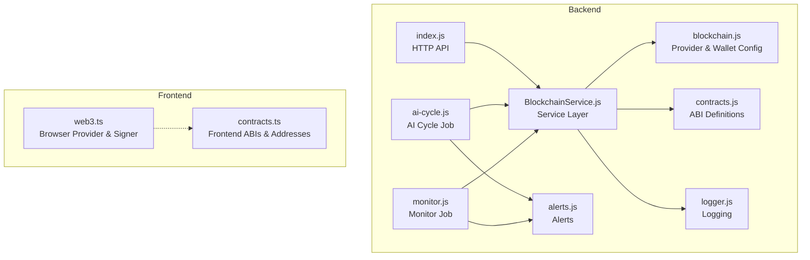
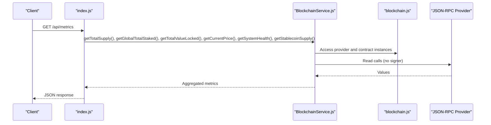
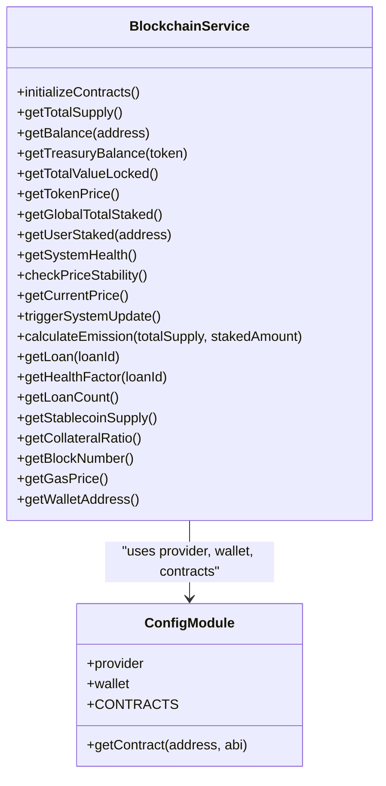
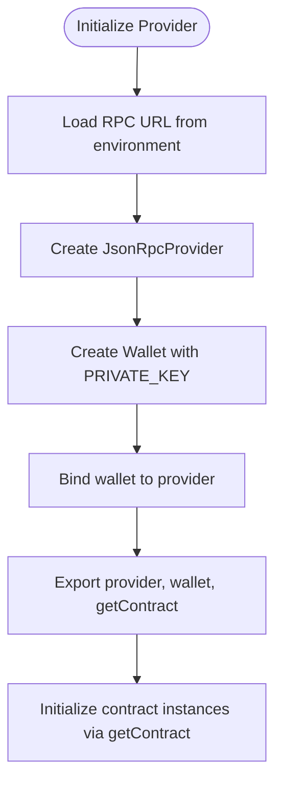
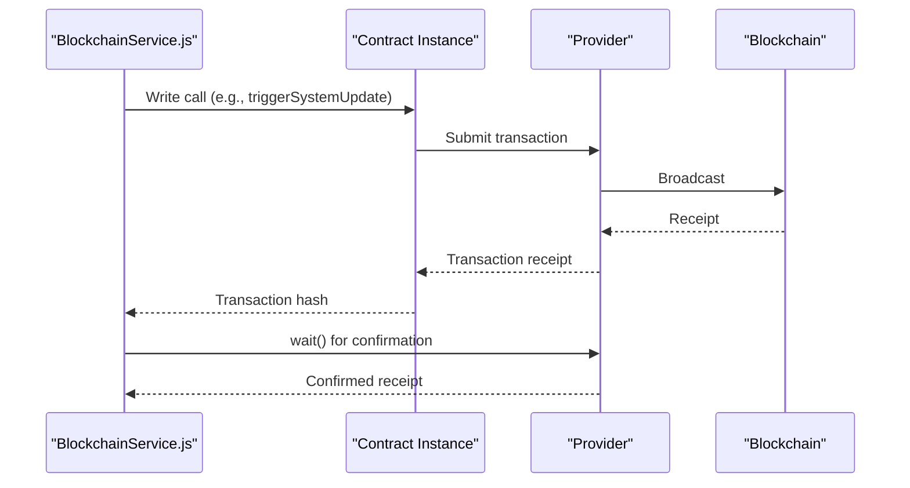
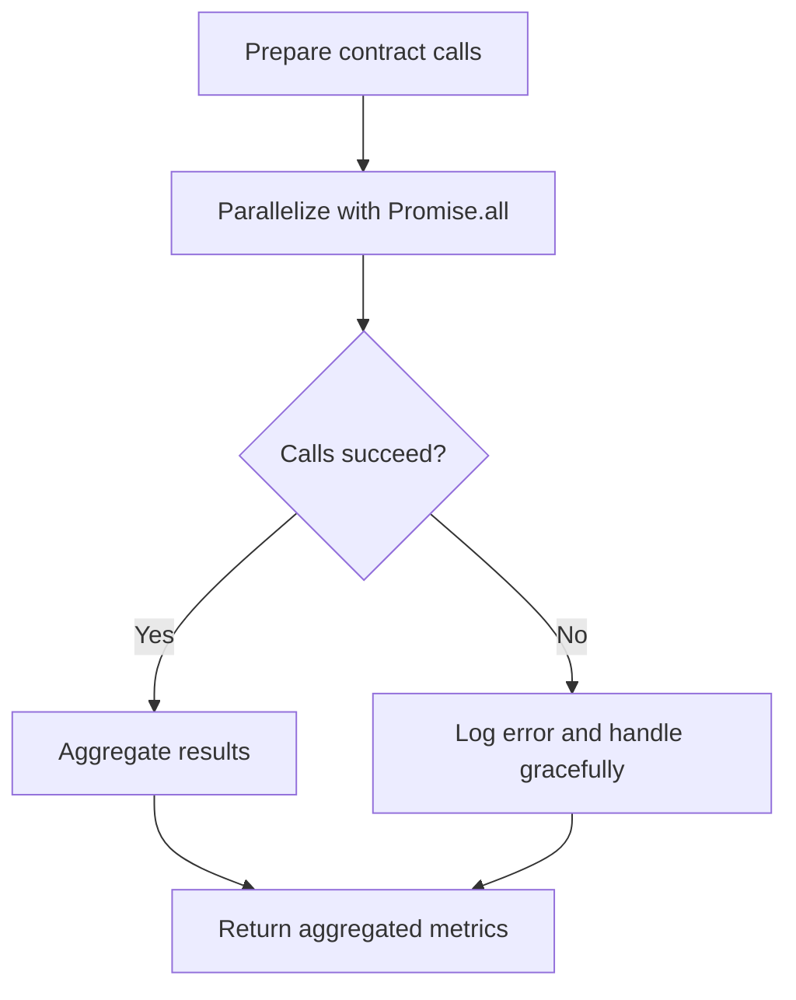
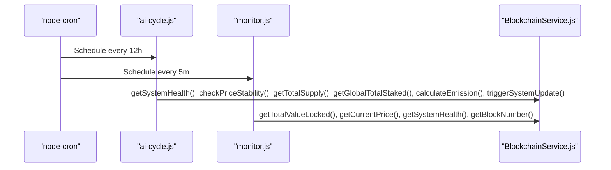
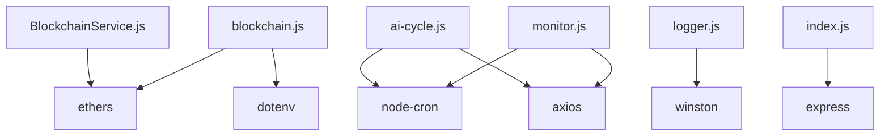

# Blockchain Service Layer

<cite>
**Referenced Files in This Document**
- [BlockchainService.js](file://neurafinance/backend/src/services/BlockchainService.js)
- [blockchain.js](file://neurafinance/backend/src/config/blockchain.js)
- [contracts.js](file://neurafinance/backend/src/config/contracts.js)
- [index.js](file://neurafinance/backend/src/index.js)
- [ai-cycle.js](file://neurafinance/backend/src/jobs/ai-cycle.js)
- [monitor.js](file://neurafinance/backend/src/jobs/monitor.js)
- [logger.js](file://neurafinance/backend/src/utils/logger.js)
- [alerts.js](file://neurafinance/backend/src/utils/alerts.js)
- [web3.ts](file://neurafinance/frontend/src/utils/web3.ts)
- [contracts.ts](file://neurafinance/frontend/src/utils/contracts.ts)
- [package.json](file://neurafinance/backend/package.json)
- [frontend package.json](file://neurafinance/frontend/package.json)
</cite>

## Table of Contents
1. [Introduction](#introduction)
2. [Project Structure](#project-structure)
3. [Core Components](#core-components)
4. [Architecture Overview](#architecture-overview)
5. [Detailed Component Analysis](#detailed-component-analysis)
6. [Dependency Analysis](#dependency-analysis)
7. [Performance Considerations](#performance-considerations)
8. [Troubleshooting Guide](#troubleshooting-guide)
9. [Conclusion](#conclusion)
10. [Appendices](#appendices)

## Introduction
This document explains the blockchain service layer responsible for contract interaction abstraction in the NeuraFinance backend. It covers the BlockchainService implementation, provider management, transaction processing workflows, RPC provider configuration, fallback mechanisms, error handling strategies, contract interaction patterns, event listening, and real-time data synchronization. The content is designed for both blockchain developers and system integrators, using terminology consistent with the codebase such as "provider", "contract instance", "transaction", and "event listener".

## Project Structure
The blockchain service layer is implemented in the backend service layer and integrates with configuration modules for RPC providers and contract ABIs. Background jobs orchestrate periodic operations that rely on the service layer. The frontend provides a separate Web3 utility for browser-based interactions.

**Diagram sources**
- [index.js:1-177](file://neurafinance/backend/src/index.js#L1-L177)
- [BlockchainService.js:1-216](file://neurafinance/backend/src/services/BlockchainService.js#L1-L216)
- [blockchain.js:1-33](file://neurafinance/backend/src/config/blockchain.js#L1-L33)
- [contracts.js:1-146](file://neurafinance/backend/src/config/contracts.js#L1-L146)
- [ai-cycle.js:1-177](file://neurafinance/backend/src/jobs/ai-cycle.js#L1-L177)
- [monitor.js:1-141](file://neurafinance/backend/src/jobs/monitor.js#L1-L141)
- [logger.js:1-28](file://neurafinance/backend/src/utils/logger.js#L1-L28)
- [alerts.js:1-82](file://neurafinance/backend/src/utils/alerts.js#L1-L82)
- [web3.ts:1-118](file://neurafinance/frontend/src/utils/web3.ts#L1-L118)
- [contracts.ts:1-148](file://neurafinance/frontend/src/utils/contracts.ts#L1-L148)

**Section sources**
- [index.js:1-177](file://neurafinance/backend/src/index.js#L1-L177)
- [BlockchainService.js:1-216](file://neurafinance/backend/src/services/BlockchainService.js#L1-L216)
- [blockchain.js:1-33](file://neurafinance/backend/src/config/blockchain.js#L1-L33)
- [contracts.js:1-146](file://neurafinance/backend/src/config/contracts.js#L1-L146)
- [ai-cycle.js:1-177](file://neurafinance/backend/src/jobs/ai-cycle.js#L1-L177)
- [monitor.js:1-141](file://neurafinance/backend/src/jobs/monitor.js#L1-L141)
- [logger.js:1-28](file://neurafinance/backend/src/utils/logger.js#L1-L28)
- [alerts.js:1-82](file://neurafinance/backend/src/utils/alerts.js#L1-L82)
- [web3.ts:1-118](file://neurafinance/frontend/src/utils/web3.ts#L1-L118)
- [contracts.ts:1-148](file://neurafinance/frontend/src/utils/contracts.ts#L1-L148)

## Core Components
- BlockchainService: Centralized abstraction over multiple contract instances, exposing read/write operations and utility functions. It initializes contract instances from environment-configured addresses and ABIs, and handles errors via logging.
- Provider and Wallet Configuration: Defines the JSON-RPC provider, wallet, and contract factory used to create contract instances with signing capabilities.
- ABI Definitions: Centralized ABIs for all contracts, enabling typed interactions and event parsing.
- Jobs: Orchestrate periodic operations (AI cycle and monitoring) that call into the service layer.
- Frontend Web3 Utilities: Provide browser-based provider/signer creation and contract instantiation for client-side interactions.

Key responsibilities:
- Provider management: Single provider instance configured via environment variable.
- Transaction processing: Wallet-backed contract instances enable write operations; transactions are submitted and confirmed via provider.
- Gas estimation and fee data: Fee data retrieval is exposed for gas-related decisions.
- Event listening: Contracts expose events; while the backend currently focuses on read operations and transaction submission, event listeners can be integrated at the provider level.

**Section sources**
- [BlockchainService.js:12-37](file://neurafinance/backend/src/services/BlockchainService.js#L12-L37)
- [blockchain.js:4-25](file://neurafinance/backend/src/config/blockchain.js#L4-L25)
- [contracts.js:1-146](file://neurafinance/backend/src/config/contracts.js#L1-L146)
- [ai-cycle.js:19-85](file://neurafinance/backend/src/jobs/ai-cycle.js#L19-L85)
- [monitor.js:99-110](file://neurafinance/backend/src/jobs/monitor.js#L99-L110)
- [web3.ts:1-118](file://neurafinance/frontend/src/utils/web3.ts#L1-L118)

## Architecture Overview
The service layer abstracts blockchain interactions behind a clean interface. HTTP endpoints delegate to the service layer, which interacts with the provider/wallet to read state, submit transactions, and retrieve metadata. Background jobs periodically call service methods to maintain system health and emit alerts.

**Diagram sources**
- [index.js:43-75](file://neurafinance/backend/src/index.js#L43-L75)
- [BlockchainService.js:40-208](file://neurafinance/backend/src/services/BlockchainService.js#L40-L208)
- [blockchain.js:4-25](file://neurafinance/backend/src/config/blockchain.js#L4-L25)

## Detailed Component Analysis

### BlockchainService Implementation
Responsibilities:
- Contract initialization: Builds contract instances keyed by domain feature (token, treasury, staking, lending, stablecoin, AI engine).
- Read operations: Exposes getters for balances, totals, prices, health metrics, and loan data.
- Write operations: Submits transactions (e.g., triggering system updates) and waits for confirmation.
- Utilities: Provides block number retrieval, fee data, and wallet address.

Error handling:
- Try/catch around contract calls; logs failures and returns null/default values to prevent cascading errors.

Transaction processing:
- Wallet-backed contract instances enable state-changing calls.
- Confirmation: wait() resolves when the transaction is mined.

**Diagram sources**
- [BlockchainService.js:12-213](file://neurafinance/backend/src/services/BlockchainService.js#L12-L213)
- [blockchain.js:23-32](file://neurafinance/backend/src/config/blockchain.js#L23-L32)

**Section sources**
- [BlockchainService.js:12-213](file://neurafinance/backend/src/services/BlockchainService.js#L12-L213)
- [blockchain.js:23-32](file://neurafinance/backend/src/config/blockchain.js#L23-L32)

### Provider Management and RPC Configuration
- Provider: Created as a JSON-RPC provider using the environment variable for the RPC endpoint.
- Wallet: Instantiated with a private key and attached to the provider for signing transactions.
- Contract instances: Factory function creates contract instances bound to the wallet for write operations.

Fallback mechanisms:
- No explicit fallback provider is configured in the current implementation. Consider adding secondary RPC endpoints and switching logic for resilience.

**Diagram sources**
- [blockchain.js:4-25](file://neurafinance/backend/src/config/blockchain.js#L4-L25)

**Section sources**
- [blockchain.js:4-25](file://neurafinance/backend/src/config/blockchain.js#L4-L25)

### Transaction Processing Workflows
- Submitting a transaction: Call a method on a contract instance created with the wallet; the call returns a transaction response.
- Confirmations: Wait for the transaction receipt via wait(); this ensures the transaction is included in a block.
- Gas estimation: Fee data is retrievable via provider fee data; integrate with transaction parameters for dynamic gas settings.

**Diagram sources**
- [BlockchainService.js:133-143](file://neurafinance/backend/src/services/BlockchainService.js#L133-L143)
- [blockchain.js:23-25](file://neurafinance/backend/src/config/blockchain.js#L23-L25)

**Section sources**
- [BlockchainService.js:133-143](file://neurafinance/backend/src/services/BlockchainService.js#L133-L143)
- [blockchain.js:23-25](file://neurafinance/backend/src/config/blockchain.js#L23-L25)

### Contract Interaction Patterns
- Read-only calls: Use provider-bound contract instances for view/pure functions.
- State-changing calls: Use wallet-bound contract instances; await confirmation.
- Batch reads: Use Promise.all to parallelize multiple reads for performance.

**Diagram sources**
- [index.js:53-60](file://neurafinance/backend/src/index.js#L53-L60)
- [ai-cycle.js:96-104](file://neurafinance/backend/src/jobs/ai-cycle.js#L96-L104)

**Section sources**
- [index.js:53-60](file://neurafinance/backend/src/index.js#L53-L60)
- [ai-cycle.js:96-104](file://neurafinance/backend/src/jobs/ai-cycle.js#L96-L104)

### Event Listening and Real-Time Data Synchronization
- Current implementation: The backend primarily performs read calls and submits transactions; event listeners are not integrated at the service layer.
- Recommended approach: Attach event filters to provider-level subscriptions or polling to capture contract events and synchronize state.

Note: The frontend utilities demonstrate event listener patterns for browser environments, which can inspire backend integration.

**Section sources**
- [web3.ts:70-91](file://neurafinance/frontend/src/utils/web3.ts#L70-L91)

### Background Jobs and Orchestration
- AI Cycle Job: Periodically gathers system metrics, checks health and price stability, calculates emission, triggers system updates, and monitors loans.
- Monitor Job: Periodically checks treasury TVL, price movements, system health, and block progress.

**Diagram sources**
- [ai-cycle.js:148-160](file://neurafinance/backend/src/jobs/ai-cycle.js#L148-L160)
- [monitor.js:112-124](file://neurafinance/backend/src/jobs/monitor.js#L112-L124)
- [BlockchainService.js:39-208](file://neurafinance/backend/src/services/BlockchainService.js#L39-L208)

**Section sources**
- [ai-cycle.js:19-85](file://neurafinance/backend/src/jobs/ai-cycle.js#L19-L85)
- [monitor.js:99-110](file://neurafinance/backend/src/jobs/monitor.js#L99-L110)

## Dependency Analysis
External dependencies and their roles:
- ethers: Ethereum SDK for provider, wallet, contract, and transaction management.
- dotenv: Loads environment variables for RPC URLs, private keys, and contract addresses.
- node-cron: Schedules background jobs.
- winston: Structured logging.
- axios: Outbound webhook alerts.
- express: HTTP API server.

**Diagram sources**
- [package.json:12-23](file://neurafinance/backend/package.json#L12-L23)
- [BlockchainService.js:1-10](file://neurafinance/backend/src/services/BlockchainService.js#L1-L10)
- [blockchain.js:1-2](file://neurafinance/backend/src/config/blockchain.js#L1-L2)
- [ai-cycle.js:7-11](file://neurafinance/backend/src/jobs/ai-cycle.js#L7-L11)
- [monitor.js:6-10](file://neurafinance/backend/src/jobs/monitor.js#L6-L10)
- [logger.js:1-2](file://neurafinance/backend/src/utils/logger.js#L1-L2)
- [index.js:6-10](file://neurafinance/backend/src/index.js#L6-L10)

**Section sources**
- [package.json:12-23](file://neurafinance/backend/package.json#L12-L23)
- [frontend package.json:11-29](file://neurafinance/frontend/package.json#L11-L29)

## Performance Considerations
- Parallelization: Use Promise.all for batch reads to minimize latency.
- Logging overhead: Ensure log levels are tuned for production to avoid I/O bottlenecks.
- Gas strategy: Retrieve fee data and configure gas parameters to reduce rejections and improve throughput.
- Rate limiting: Apply throttling for frequent polling to avoid RPC rate limits.

[No sources needed since this section provides general guidance]

## Troubleshooting Guide
Common issues and strategies:
- Provider connectivity: Verify RPC URL and network availability; consider adding retry/backoff logic.
- Private key and wallet: Ensure the private key is valid and has sufficient funds; check wallet address derivation.
- Contract addresses: Confirm environment variables for contract addresses are set and correct.
- Transaction failures: Inspect error messages from logs; validate gas price/limit and nonce handling.
- Alerts not sent: Check webhook URL and network connectivity for outbound requests.

Operational controls:
- Health endpoints: Use /health to validate provider connectivity and basic service readiness.
- Manual triggers: Use /api/admin/ai-cycle to initiate the AI cycle for testing.

**Section sources**
- [index.js:22-41](file://neurafinance/backend/src/index.js#L22-L41)
- [index.js:133-143](file://neurafinance/backend/src/index.js#L133-L143)
- [logger.js:1-28](file://neurafinance/backend/src/utils/logger.js#L1-L28)
- [alerts.js:10-30](file://neurafinance/backend/src/utils/alerts.js#L10-L30)

## Conclusion
The blockchain service layer provides a robust abstraction over multiple smart contracts, enabling clean read and write operations backed by a single provider and wallet. While the current implementation emphasizes read operations and transaction submission, integrating event listeners and provider failover would further enhance reliability and real-time responsiveness. The modular design supports easy extension for additional contracts and advanced features like dynamic gas estimation and multi-provider redundancy.

[No sources needed since this section summarizes without analyzing specific files]

## Appendices

### Practical Examples

- Contract call (read):
  - Path: [BlockchainService.js:40-56](file://neurafinance/backend/src/services/BlockchainService.js#L40-L56)
  - Example: Get token total supply via a view function.

- Transaction submission:
  - Path: [BlockchainService.js:133-143](file://neurafinance/backend/src/services/BlockchainService.js#L133-L143)
  - Example: Trigger a system update and await confirmation.

- Event monitoring (conceptual):
  - Path: [web3.ts:70-91](file://neurafinance/frontend/src/utils/web3.ts#L70-L91)
  - Concept: Listen for account and chain changes; apply similar patterns at provider level for contract events.

- Gas estimation and fee data:
  - Path: [BlockchainService.js:206-208](file://neurafinance/backend/src/services/BlockchainService.js#L206-L208)
  - Concept: Use fee data to inform gas price/limit for transactions.

- Provider failover (recommended enhancement):
  - Concept: Maintain a list of RPC endpoints; switch to a backup provider on timeout or error.

**Section sources**
- [BlockchainService.js:40-56](file://neurafinance/backend/src/services/BlockchainService.js#L40-L56)
- [BlockchainService.js:133-143](file://neurafinance/backend/src/services/BlockchainService.js#L133-L143)
- [web3.ts:70-91](file://neurafinance/frontend/src/utils/web3.ts#L70-L91)
- [BlockchainService.js:206-208](file://neurafinance/backend/src/services/BlockchainService.js#L206-L208)