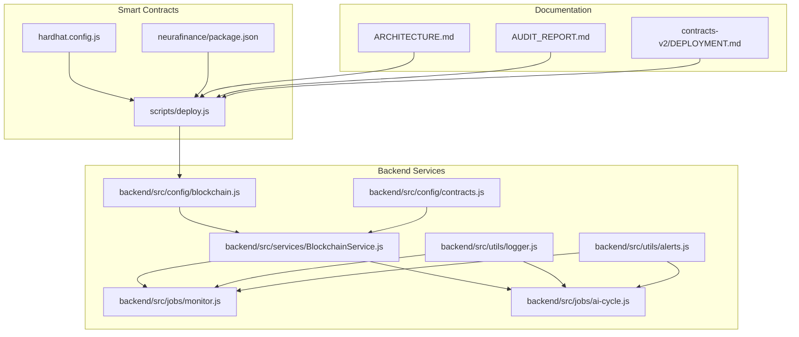
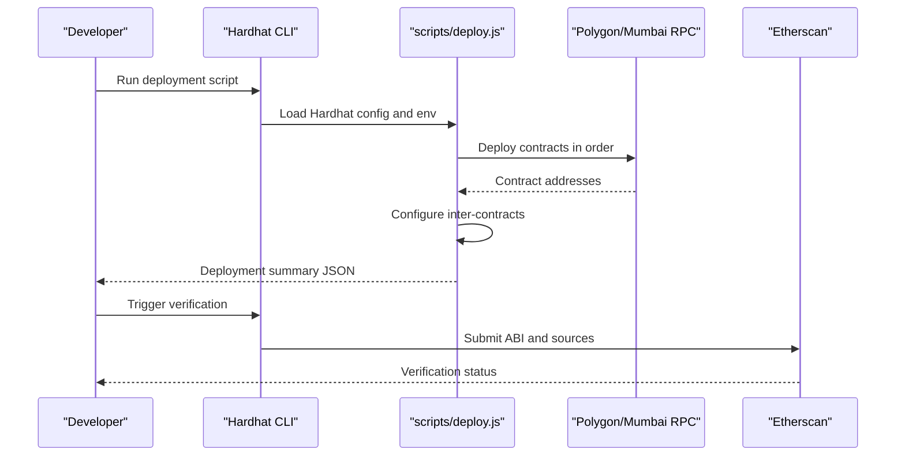
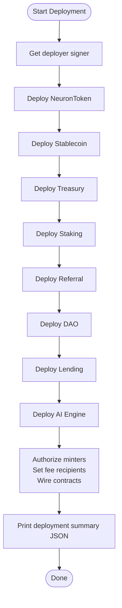
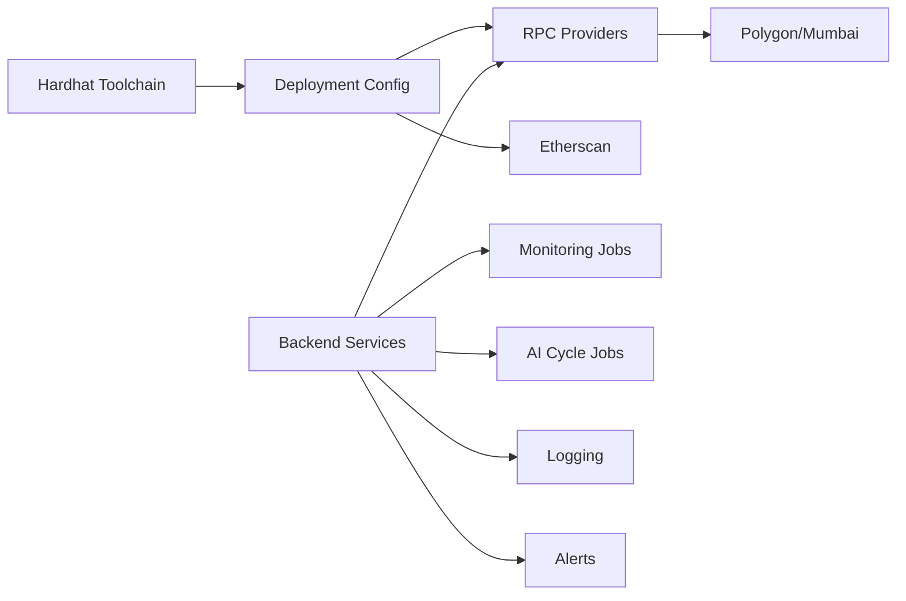

# Deployment and Configuration

<cite>
**Referenced Files in This Document**
- [hardhat.config.js](file://neurafinance/hardhat.config.js)
- [deploy.js](file://neurafinance/scripts/deploy.js)
- [package.json](file://neurafinance/package.json)
- [blockchain.js](file://neurafinance/backend/src/config/blockchain.js)
- [contracts.js](file://neurafinance/backend/src/config/contracts.js)
- [BlockchainService.js](file://neurafinance/backend/src/services/BlockchainService.js)
- [monitor.js](file://neurafinance/backend/src/jobs/monitor.js)
- [ai-cycle.js](file://neurafinance/backend/src/jobs/ai-cycle.js)
- [logger.js](file://neurafinance/backend/src/utils/logger.js)
- [alerts.js](file://neurafinance/backend/src/utils/alerts.js)
- [ARCHITECTURE.md](file://neurafinance/ARCHITECTURE.md)
- [AUDIT_REPORT.md](file://neurafinance/AUDIT_REPORT.md)
- [DEPLOYMENT.md](file://neurafinance/contracts-v2/DEPLOYMENT.md)
</cite>

## Table of Contents
1. [Introduction](#introduction)
2. [Project Structure](#project-structure)
3. [Core Components](#core-components)
4. [Architecture Overview](#architecture-overview)
5. [Detailed Component Analysis](#detailed-component-analysis)
6. [Dependency Analysis](#dependency-analysis)
7. [Performance Considerations](#performance-considerations)
8. [Troubleshooting Guide](#troubleshooting-guide)
9. [Conclusion](#conclusion)
10. [Appendices](#appendices)

## Introduction
This document provides production deployment and configuration guidance for the NeuraFinance ecosystem. It covers multi-network deployment across Polygon and Mumbai testnet, Hardhat-based deployment scripts, contract verification, environment configuration, infrastructure requirements, upgrade and migration procedures, backward compatibility, rollback strategies, monitoring, and operational maintenance. The content is tailored for DevOps engineers and system administrators, using terminology consistent with the codebase such as Hardhat, Polygon, Mumbai, and deployment scripts.

## Project Structure
The NeuraFinance project is organized into:
- Smart contracts and Hardhat configuration for compilation, testing, and deployment
- Backend automation services for monitoring, AI cycles, and alerting
- Frontend application assets and configuration
- Upgrade and migration documentation for V2 contracts

**Diagram sources**
- [hardhat.config.js:1-43](file://neurafinance/hardhat.config.js#L1-L43)
- [deploy.js:1-170](file://neurafinance/scripts/deploy.js#L1-L170)
- [package.json:1-22](file://neurafinance/package.json#L1-L22)
- [blockchain.js:1-33](file://neurafinance/backend/src/config/blockchain.js#L1-L33)
- [contracts.js:1-146](file://neurafinance/backend/src/config/contracts.js#L1-L146)
- [BlockchainService.js:1-216](file://neurafinance/backend/src/services/BlockchainService.js#L1-L216)
- [monitor.js:1-141](file://neurafinance/backend/src/jobs/monitor.js#L1-L141)
- [ai-cycle.js:1-177](file://neurafinance/backend/src/jobs/ai-cycle.js#L1-L177)
- [logger.js:1-28](file://neurafinance/backend/src/utils/logger.js#L1-L28)
- [alerts.js:1-82](file://neurafinance/backend/src/utils/alerts.js#L1-L82)
- [ARCHITECTURE.md:1-239](file://neurafinance/ARCHITECTURE.md#L1-L239)
- [AUDIT_REPORT.md:1-647](file://neurafinance/AUDIT_REPORT.md#L1-L647)
- [DEPLOYMENT.md:1-237](file://neurafinance/contracts-v2/DEPLOYMENT.md#L1-L237)

**Section sources**
- [hardhat.config.js:1-43](file://neurafinance/hardhat.config.js#L1-L43)
- [package.json:1-22](file://neurafinance/package.json#L1-L22)
- [ARCHITECTURE.md:1-239](file://neurafinance/ARCHITECTURE.md#L1-L239)

## Core Components
- Hardhat configuration defines Solidity compiler settings, networks (Polygon, Mumbai, Hardhat), Etherscan verification keys, and project paths.
- Deployment script orchestrates contract deployment in a strict order and sets up inter-contract relationships.
- Backend configuration loads environment variables for RPC endpoints, private keys, and contract addresses.
- Backend services expose typed ABIs and manage blockchain interactions, monitoring, and alerting.

Key responsibilities:
- Network configuration and verification: [hardhat.config.js:15-35](file://neurafinance/hardhat.config.js#L15-L35)
- Deployment orchestration: [deploy.js:3-162](file://neurafinance/scripts/deploy.js#L3-L162)
- Environment-driven backend connectivity: [blockchain.js:1-33](file://neurafinance/backend/src/config/blockchain.js#L1-L33)
- Typed contract interfaces: [contracts.js:1-146](file://neurafinance/backend/src/config/contracts.js#L1-L146)

**Section sources**
- [hardhat.config.js:15-35](file://neurafinance/hardhat.config.js#L15-L35)
- [deploy.js:3-162](file://neurafinance/scripts/deploy.js#L3-L162)
- [blockchain.js:1-33](file://neurafinance/backend/src/config/blockchain.js#L1-L33)
- [contracts.js:1-146](file://neurafinance/backend/src/config/contracts.js#L1-L146)

## Architecture Overview
The deployment pipeline integrates Hardhat, Polygon/Mumbai networks, and backend automation. Contracts are compiled and deployed via Hardhat scripts, verified on Etherscan, and consumed by backend services that monitor and operate the system.

**Diagram sources**
- [hardhat.config.js:1-43](file://neurafinance/hardhat.config.js#L1-L43)
- [deploy.js:3-162](file://neurafinance/scripts/deploy.js#L3-L162)
- [package.json:5-11](file://neurafinance/package.json#L5-L11)

## Detailed Component Analysis

### Hardhat Configuration and Networks
- Solidity compiler settings enable optimization with configurable runs.
- Networks define RPC URLs, private key usage, and chain IDs for local, Mumbai, and Polygon.
- Etherscan verification keys are configured per network.
- Paths specify locations for sources, tests, cache, and artifacts.

Operational implications:
- Use environment variables for RPC URLs and private keys.
- Ensure correct chain IDs and RPC endpoints for target networks.
- Verification requires API keys and matching compiler settings.

**Section sources**
- [hardhat.config.js:6-14](file://neurafinance/hardhat.config.js#L6-L14)
- [hardhat.config.js:15-29](file://neurafinance/hardhat.config.js#L15-L29)
- [hardhat.config.js:30-35](file://neurafinance/hardhat.config.js#L30-L35)
- [hardhat.config.js:36-41](file://neurafinance/hardhat.config.js#L36-L41)

### Deployment Scripts and Orchestration
- The deployment script deploys contracts in a strict order and waits for deployment receipts.
- After deployment, it authorizes minters, sets fee recipients, and wires inter-contract dependencies.
- It prints a structured deployment summary including network, chain ID, deployer, and contract addresses.

Production guidance:
- Always run compilation before deployment.
- Use separate private keys per environment.
- Store deployment summaries securely for future verification and audits.

**Diagram sources**
- [deploy.js:3-162](file://neurafinance/scripts/deploy.js#L3-L162)

**Section sources**
- [deploy.js:3-162](file://neurafinance/scripts/deploy.js#L3-L162)

### Backend Configuration and Contract Interfaces
- Backend loads RPC endpoint and private key from environment variables.
- Contract addresses are loaded from environment variables and mapped to ABIs.
- BlockchainService initializes contract instances and exposes typed operations.

Operational guidance:
- Set environment variables for RPC URLs and private keys.
- Maintain accurate contract addresses per network.
- Use dedicated wallets for backend operations.

**Section sources**
- [blockchain.js:1-33](file://neurafinance/backend/src/config/blockchain.js#L1-L33)
- [contracts.js:1-146](file://neurafinance/backend/src/config/contracts.js#L1-L146)
- [BlockchainService.js:12-37](file://neurafinance/backend/src/services/BlockchainService.js#L12-L37)

### Monitoring and Alerting Jobs
- Monitor job checks treasury TVL, token price, system health, and block number on a scheduled cadence.
- AI Cycle job executes every 12 hours, gathers metrics, validates health and price stability, calculates emission, triggers system updates, and checks for liquidations.
- AlertService posts to webhooks and logs warnings/info/critical events.
- Logger supports configurable log levels and file/console transports.

Operational guidance:
- Schedule jobs via cron expressions controlled by environment variables.
- Configure alert webhooks and email notifications.
- Ensure sufficient gas coverage for keeper wallets.

**Section sources**
- [monitor.js:99-124](file://neurafinance/backend/src/jobs/monitor.js#L99-L124)
- [ai-cycle.js:18-84](file://neurafinance/backend/src/jobs/ai-cycle.js#L18-L84)
- [alerts.js:10-30](file://neurafinance/backend/src/utils/alerts.js#L10-L30)
- [logger.js:1-28](file://neurafinance/backend/src/utils/logger.js#L1-L28)

### Upgrade and Migration Procedures (V2)
The V2 deployment guide outlines a multi-step upgrade path:
- Deploy libraries and core contracts in order, updating addresses as needed.
- Wire AI Engine, Staking, Referral, and Lending contracts with proper roles and permissions.
- Fund Treasury, approve spending, and configure parameters.
- Perform post-deployment verification and set up keepers.

Security and sustainability considerations:
- The audit report identifies critical vulnerabilities in the original design, including broken price oracles, unsustainable referral pyramids, and compounding accounting drift. These must be addressed before production deployment.

**Section sources**
- [DEPLOYMENT.md:1-237](file://neurafinance/contracts-v2/DEPLOYMENT.md#L1-L237)
- [AUDIT_REPORT.md:10-647](file://neurafinance/AUDIT_REPORT.md#L10-L647)

## Dependency Analysis
The deployment and runtime depend on:
- Hardhat toolchain for compilation and deployment
- Polygon/Mumbai RPC providers for transaction submission
- Etherscan for contract verification
- Backend services for monitoring and automated operations

**Diagram sources**
- [hardhat.config.js:1-43](file://neurafinance/hardhat.config.js#L1-L43)
- [package.json:5-11](file://neurafinance/package.json#L5-L11)
- [blockchain.js:1-33](file://neurafinance/backend/src/config/blockchain.js#L1-L33)
- [monitor.js:1-141](file://neurafinance/backend/src/jobs/monitor.js#L1-L141)
- [ai-cycle.js:1-177](file://neurafinance/backend/src/jobs/ai-cycle.js#L1-L177)
- [logger.js:1-28](file://neurafinance/backend/src/utils/logger.js#L1-L28)
- [alerts.js:1-82](file://neurafinance/backend/src/utils/alerts.js#L1-L82)

**Section sources**
- [hardhat.config.js:1-43](file://neurafinance/hardhat.config.js#L1-L43)
- [package.json:5-11](file://neurafinance/package.json#L5-L11)
- [blockchain.js:1-33](file://neurafinance/backend/src/config/blockchain.js#L1-L33)

## Performance Considerations
- Optimize Solidity compilation with appropriate runs to balance bytecode size and gas costs.
- Use dedicated keeper wallets with sufficient gas balances to avoid missed cycles.
- Schedule monitoring and AI cycle jobs to minimize concurrent load spikes.
- Centralize logging and alerting to reduce overhead and improve observability.

[No sources needed since this section provides general guidance]

## Troubleshooting Guide
Common deployment and runtime issues:
- Network configuration errors: Verify RPC URLs and chain IDs in Hardhat config.
- Private key or account balance issues: Ensure the deployer account has sufficient funds.
- Verification failures: Confirm Etherscan API keys and matching compiler settings.
- Backend connectivity: Check RPC endpoints and private key environment variables.
- Monitoring job failures: Review logs and alert webhooks configuration.
- AI cycle interruptions: Validate keeper wallet gas balances and cron schedules.

**Section sources**
- [hardhat.config.js:15-35](file://neurafinance/hardhat.config.js#L15-L35)
- [blockchain.js:1-33](file://neurafinance/backend/src/config/blockchain.js#L1-L33)
- [monitor.js:112-124](file://neurafinance/backend/src/jobs/monitor.js#L112-L124)
- [ai-cycle.js:148-160](file://neurafinance/backend/src/jobs/ai-cycle.js#L148-L160)
- [logger.js:1-28](file://neurafinance/backend/src/utils/logger.js#L1-L28)
- [alerts.js:1-82](file://neurafinance/backend/src/utils/alerts.js#L1-L82)

## Conclusion
For production readiness, align the deployment strategy with the V2 upgrade path, address critical security and sustainability concerns identified in the audit, and establish robust monitoring and alerting. Use environment-driven configuration, secure private key management, and multi-network verification to ensure reliability across Polygon and Mumbai.

[No sources needed since this section summarizes without analyzing specific files]

## Appendices

### Environment Variables Reference
- POLYGON_RPC_URL: Polygon RPC endpoint
- MUMBAI_RPC_URL: Mumbai RPC endpoint
- PRIVATE_KEY: Wallet private key for deployments and backend operations
- POLYGONSCAN_API_KEY: Etherscan API key for verification
- NEURON_TOKEN_ADDRESS, TREASURY_ADDRESS, STAKING_ADDRESS, REFERRAL_ADDRESS, DAO_ADDRESS, LENDING_ADDRESS, STABLECOIN_ADDRESS, AI_ENGINE_ADDRESS: Contract addresses per network
- ALERT_WEBHOOK_URL, ALERT_EMAIL: Alerting endpoints
- LOG_LEVEL: Logging verbosity
- PRICE_CHECK_INTERVAL, AI_CYCLE_INTERVAL: Cron scheduling overrides

**Section sources**
- [hardhat.config.js:20-27](file://neurafinance/hardhat.config.js#L20-L27)
- [hardhat.config.js:30-35](file://neurafinance/hardhat.config.js#L30-L35)
- [blockchain.js:5-8](file://neurafinance/backend/src/config/blockchain.js#L5-L8)
- [blockchain.js:11-20](file://neurafinance/backend/src/config/blockchain.js#L11-L20)
- [monitor.js:112-124](file://neurafinance/backend/src/jobs/monitor.js#L112-L124)
- [ai-cycle.js:148-160](file://neurafinance/backend/src/jobs/ai-cycle.js#L148-L160)
- [logger.js:4-4](file://neurafinance/backend/src/utils/logger.js#L4-L4)

### Production Deployment Workflow
- Prepare environment variables for target network.
- Compile contracts and run tests.
- Execute deployment script for desired network.
- Verify contracts on Etherscan.
- Configure backend services with contract addresses and start monitoring and AI cycle jobs.

**Section sources**
- [package.json:5-11](file://neurafinance/package.json#L5-L11)
- [deploy.js:3-162](file://neurafinance/scripts/deploy.js#L3-L162)
- [ARCHITECTURE.md:204-212](file://neurafinance/ARCHITECTURE.md#L204-L212)

### Security and Compliance Notes
- Address critical vulnerabilities before production deployment.
- Implement emergency pause and timelock mechanisms.
- Use multi-signature governance and secure key management.

**Section sources**
- [AUDIT_REPORT.md:10-21](file://neurafinance/AUDIT_REPORT.md#L10-L21)
- [DEPLOYMENT.md:200-221](file://neurafinance/contracts-v2/DEPLOYMENT.md#L200-L221)