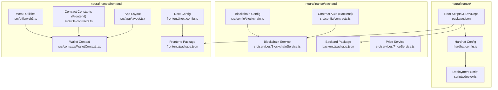
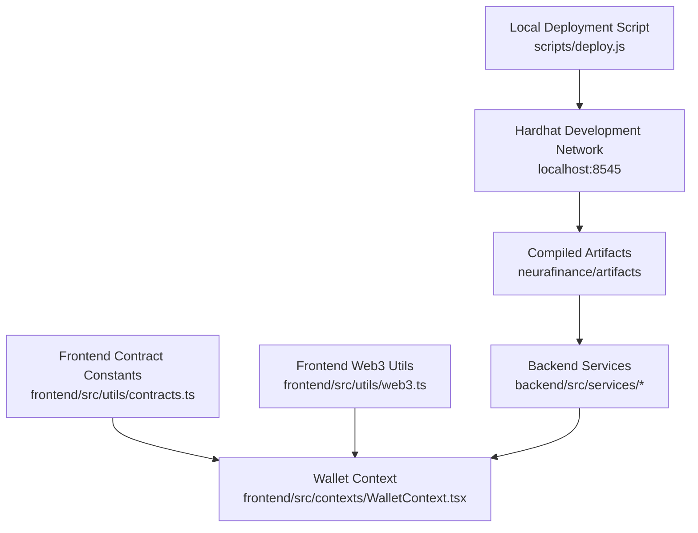
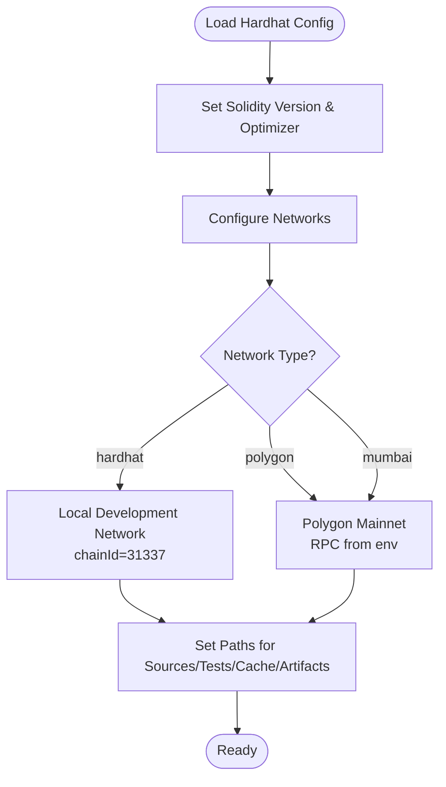
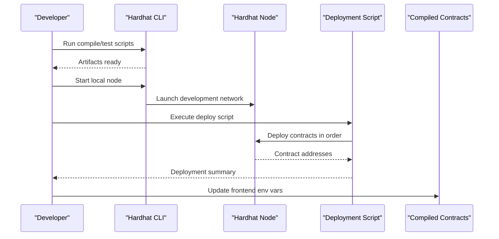
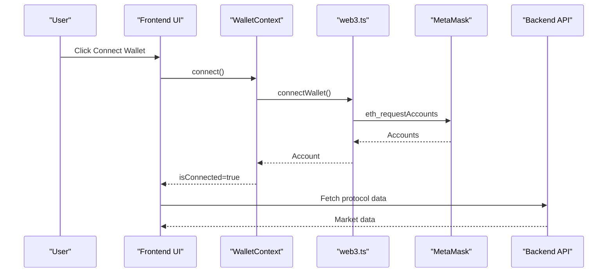
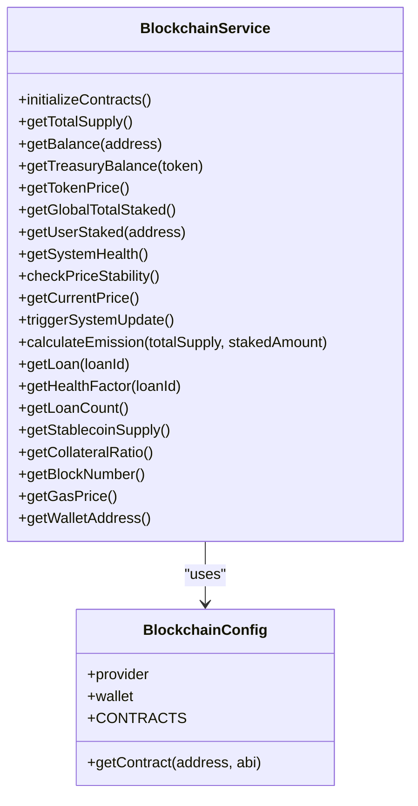
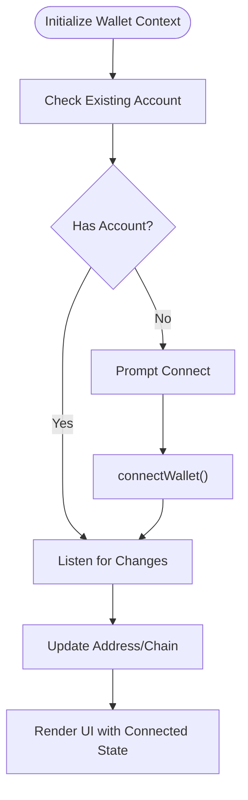
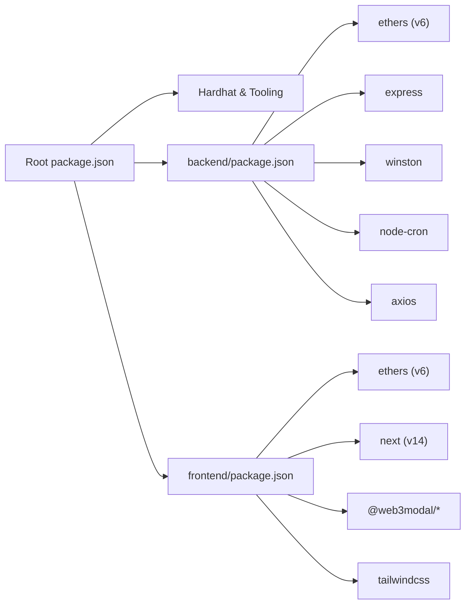
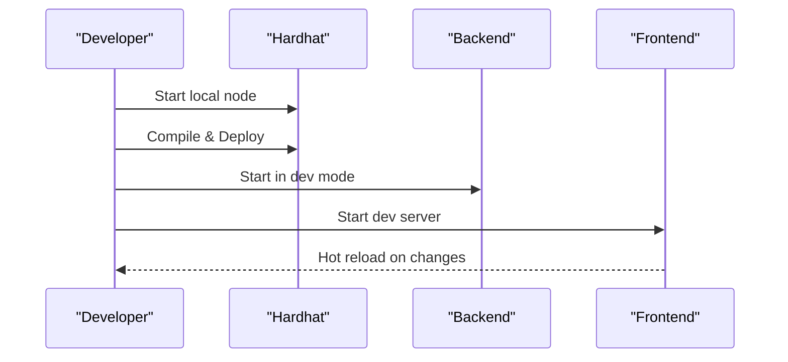

# Development Environment Setup

<cite>
**Referenced Files in This Document**
- [hardhat.config.js](file://neurafinance/hardhat.config.js)
- [package.json](file://neurafinance/package.json)
- [deploy.js](file://neurafinance/scripts/deploy.js)
- [blockchain.js](file://neurafinance/backend/src/config/blockchain.js)
- [contracts.js](file://neurafinance/backend/src/config/contracts.js)
- [BlockchainService.js](file://neurafinance/backend/src/services/BlockchainService.js)
- [PriceService.js](file://neurafinance/backend/src/services/PriceService.js)
- [web3.ts](file://neurafinance/frontend/src/utils/web3.ts)
- [contracts.ts](file://neurafinance/frontend/src/utils/contracts.ts)
- [WalletContext.tsx](file://neurafinance/frontend/src/contexts/WalletContext.tsx)
- [layout.tsx](file://neurafinance/frontend/src/app/layout.tsx)
- [next.config.js](file://neurafinance/frontend/next.config.js)
- [backend package.json](file://neurafinance/backend/package.json)
- [frontend package.json](file://neurafinance/frontend/package.json)
</cite>

## Table of Contents
1. [Introduction](#introduction)
2. [Project Structure](#project-structure)
3. [Core Components](#core-components)
4. [Architecture Overview](#architecture-overview)
5. [Detailed Component Analysis](#detailed-component-analysis)
6. [Dependency Analysis](#dependency-analysis)
7. [Performance Considerations](#performance-considerations)
8. [Troubleshooting Guide](#troubleshooting-guide)
9. [Conclusion](#conclusion)
10. [Appendices](#appendices)

## Introduction
This guide explains how to set up a complete local development environment for the NeuraFinance ecosystem. It covers Hardhat configuration for the development network, environment variables setup, dependency management across frontend, backend, and smart contracts, and practical workflows for installing prerequisites, starting development servers, hot reloading, and debugging. Both conceptual overviews for newcomers and technical details for experienced engineers are included.

## Project Structure
The NeuraFinance project is organized into three primary areas:
- Smart contracts and Hardhat tooling under neurafinance/
- Backend automation and services under neurafinance/backend/
- Frontend Next.js application under neurafinance/frontend/

Key configuration and scripts live at the root of neurafinance/, while frontend and backend each maintain their own package.json and runtime configuration.

**Diagram sources**
- [hardhat.config.js:1-43](file://neurafinance/hardhat.config.js#L1-L43)
- [package.json:1-22](file://neurafinance/package.json#L1-L22)
- [deploy.js:1-170](file://neurafinance/scripts/deploy.js#L1-L170)
- [blockchain.js:1-33](file://neurafinance/backend/src/config/blockchain.js#L1-L33)
- [contracts.js:1-146](file://neurafinance/backend/src/config/contracts.js#L1-L146)
- [BlockchainService.js:1-216](file://neurafinance/backend/src/services/BlockchainService.js#L1-L216)
- [PriceService.js:1-77](file://neurafinance/backend/src/services/PriceService.js#L1-L77)
- [web3.ts:1-118](file://neurafinance/frontend/src/utils/web3.ts#L1-L118)
- [contracts.ts:1-148](file://neurafinance/frontend/src/utils/contracts.ts#L1-L148)
- [WalletContext.tsx:1-102](file://neurafinance/frontend/src/contexts/WalletContext.tsx#L1-L102)
- [layout.tsx:1-36](file://neurafinance/frontend/src/app/layout.tsx#L1-L36)
- [next.config.js:1-25](file://neurafinance/frontend/next.config.js#L1-L25)

**Section sources**
- [hardhat.config.js:1-43](file://neurafinance/hardhat.config.js#L1-L43)
- [package.json:1-22](file://neurafinance/package.json#L1-L22)
- [backend package.json:1-28](file://neurafinance/backend/package.json#L1-L28)
- [frontend package.json:1-40](file://neurafinance/frontend/package.json#L1-L40)

## Core Components
- Hardhat development network configuration defines the Solidity compiler, optimizer settings, and local development network parameters. It also exposes Polygon and Mumbai testnet networks for remote deployments.
- Root scripts orchestrate contract compilation, testing, local deployment, and Hardhat node operation, plus convenience commands to start backend and frontend.
- Backend integrates with the blockchain via Ethers v6, loading RPC URLs and private keys from environment variables, and exposing contract ABIs and addresses.
- Frontend connects to MetaMask via Ethers v6, manages wallet state with a React context, and reads contract addresses from Next.js environment variables.

Practical outcomes:
- Local development network runs via Hardhat’s in-process node.
- Contracts compile and deploy deterministically using Hardhat’s development network.
- Frontend consumes contract addresses via environment variables and interacts with MetaMask.

**Section sources**
- [hardhat.config.js:1-43](file://neurafinance/hardhat.config.js#L1-L43)
- [package.json:5-14](file://neurafinance/package.json#L5-L14)
- [blockchain.js:1-33](file://neurafinance/backend/src/config/blockchain.js#L1-L33)
- [contracts.js:1-146](file://neurafinance/backend/src/config/contracts.js#L1-L146)
- [web3.ts:1-118](file://neurafinance/frontend/src/utils/web3.ts#L1-L118)
- [contracts.ts:66-75](file://neurafinance/frontend/src/utils/contracts.ts#L66-L75)

## Architecture Overview
The development environment spans three layers:
- Smart contracts layer: compiled and deployed using Hardhat on a local development network.
- Backend layer: listens to blockchain events and serves data to the frontend via HTTP APIs.
- Frontend layer: renders UI, connects wallets, and invokes smart contracts through MetaMask.

**Diagram sources**
- [hardhat.config.js:15-29](file://neurafinance/hardhat.config.js#L15-L29)
- [deploy.js:1-170](file://neurafinance/scripts/deploy.js#L1-L170)
- [BlockchainService.js:1-216](file://neurafinance/backend/src/services/BlockchainService.js#L1-L216)
- [web3.ts:1-118](file://neurafinance/frontend/src/utils/web3.ts#L1-L118)
- [contracts.ts:66-75](file://neurafinance/frontend/src/utils/contracts.ts#L66-L75)
- [WalletContext.tsx:1-102](file://neurafinance/frontend/src/contexts/WalletContext.tsx#L1-L102)

## Detailed Component Analysis

### Hardhat Development Network Configuration
- Solidity compiler version and optimizer settings are configured centrally.
- The development network uses a fixed chain ID suitable for local iteration.
- Remote networks (Polygon and Mumbai) are configured with optional environment variables for RPC URLs and private keys.
- Paths for sources, tests, cache, and artifacts are explicitly set.

**Diagram sources**
- [hardhat.config.js:5-42](file://neurafinance/hardhat.config.js#L5-L42)

**Section sources**
- [hardhat.config.js:5-42](file://neurafinance/hardhat.config.js#L5-L42)

### Environment Variables Setup
Environment variables are used across components:
- Hardhat and backend: PRIVATE_KEY, POLYGON_RPC_URL, POLYGONSCAN_API_KEY, MUMBAI_RPC_URL.
- Frontend: NEXT_PUBLIC_* variables for backend URL and contract addresses.
- Price service: PRICE_API_URL for external pricing data.

Recommended .env template locations:
- Root of neurafinance/: for Hardhat and backend scripts.
- frontend/: for Next.js runtime environment variables.
- backend/: for backend runtime environment variables.

Common variables and their roles:
- PRIVATE_KEY: Signer private key for deployments and transactions.
- POLYGON_RPC_URL / MUMBAI_RPC_URL: JSON-RPC endpoints for Polygon networks.
- POLYGONSCAN_API_KEY: Required for contract verification on explorers.
- NEXT_PUBLIC_BACKEND_URL: Backend API endpoint for frontend.
- NEXT_PUBLIC_* contract addresses: Frontend contract addresses loaded at build/runtime.
- PRICE_API_URL: External price feed endpoint.

**Section sources**
- [hardhat.config.js:20-35](file://neurafinance/hardhat.config.js#L20-L35)
- [blockchain.js:5-8](file://neurafinance/backend/src/config/blockchain.js#L5-L8)
- [contracts.ts:66-75](file://neurafinance/frontend/src/utils/contracts.ts#L66-L75)
- [PriceService.js](file://neurafinance/backend/src/services/PriceService.js#L8)

### Dependency Management
- Root package.json defines Hardhat, Hardhat Toolbox, dotenv, and convenience scripts for compiling, testing, deploying, and starting backend/frontend.
- Backend package.json depends on Ethers v6, Express, Winston, Axios, node-cron, and nodemon for development.
- Frontend package.json depends on Next.js 14, Ethers v6, Web3Modal, TailwindCSS, and related UI libraries.

Best practices:
- Keep Node.js aligned with backend engine requirements.
- Use separate .env files per layer (root, frontend, backend).
- Pin versions consistently across packages to avoid drift.

**Section sources**
- [package.json:15-21](file://neurafinance/package.json#L15-L21)
- [backend package.json:12-27](file://neurafinance/backend/package.json#L12-L27)
- [frontend package.json:11-39](file://neurafinance/frontend/package.json#L11-L39)

### Local Deployment and Contract Compilation
- Compile contracts using the root script.
- Start Hardhat’s local node to simulate a development network.
- Run the deployment script against the development network to deploy contracts deterministically.
- Capture deployment outputs and update frontend environment variables with deployed addresses.

**Diagram sources**
- [package.json:5-14](file://neurafinance/package.json#L5-L14)
- [deploy.js:1-170](file://neurafinance/scripts/deploy.js#L1-L170)
- [hardhat.config.js:15-18](file://neurafinance/hardhat.config.js#L15-L18)

**Section sources**
- [package.json:5-14](file://neurafinance/package.json#L5-L14)
- [deploy.js:1-170](file://neurafinance/scripts/deploy.js#L1-L170)

### Frontend Integration Testing
- Connect MetaMask via frontend web3 utilities.
- Load contract addresses from environment variables.
- Use React context to manage wallet state and chain changes.
- Invoke frontend contract functions and observe state updates.

**Diagram sources**
- [WalletContext.tsx:61-73](file://neurafinance/frontend/src/contexts/WalletContext.tsx#L61-L73)
- [web3.ts:27-40](file://neurafinance/frontend/src/utils/web3.ts#L27-L40)
- [contracts.ts:66-75](file://neurafinance/frontend/src/utils/contracts.ts#L66-L75)
- [layout.tsx:24-31](file://neurafinance/frontend/src/app/layout.tsx#L24-L31)

**Section sources**
- [web3.ts:1-118](file://neurafinance/frontend/src/utils/web3.ts#L1-L118)
- [contracts.ts:66-75](file://neurafinance/frontend/src/utils/contracts.ts#L66-L75)
- [WalletContext.tsx:1-102](file://neurafinance/frontend/src/contexts/WalletContext.tsx#L1-L102)
- [layout.tsx:1-36](file://neurafinance/frontend/src/app/layout.tsx#L1-L36)

### Backend Blockchain Integration
- Backend loads RPC URL and private key from environment variables.
- Initializes Ethers provider and wallet.
- Exposes contract ABIs and dynamically creates contract instances.
- BlockchainService encapsulates contract method calls and logging.

**Diagram sources**
- [blockchain.js:1-33](file://neurafinance/backend/src/config/blockchain.js#L1-L33)
- [BlockchainService.js:12-216](file://neurafinance/backend/src/services/BlockchainService.js#L12-L216)

**Section sources**
- [blockchain.js:1-33](file://neurafinance/backend/src/config/blockchain.js#L1-L33)
- [BlockchainService.js:1-216](file://neurafinance/backend/src/services/BlockchainService.js#L1-L216)

### Frontend Web3 and Wallet Context
- web3.ts provides provider, signer, contract creation, wallet connection, and network switching helpers.
- WalletContext.tsx manages connection state, account change listeners, and chain change listeners.
- contracts.ts centralizes ABI definitions and frontend contract addresses loaded from environment variables.

**Diagram sources**
- [WalletContext.tsx:23-59](file://neurafinance/frontend/src/contexts/WalletContext.tsx#L23-L59)
- [web3.ts:27-84](file://neurafinance/frontend/src/utils/web3.ts#L27-L84)
- [contracts.ts:66-75](file://neurafinance/frontend/src/utils/contracts.ts#L66-L75)

**Section sources**
- [web3.ts:1-118](file://neurafinance/frontend/src/utils/web3.ts#L1-L118)
- [WalletContext.tsx:1-102](file://neurafinance/frontend/src/contexts/WalletContext.tsx#L1-L102)
- [contracts.ts:1-148](file://neurafinance/frontend/src/utils/contracts.ts#L1-L148)

## Dependency Analysis
- Root package.json orchestrates Hardhat tooling and cross-layer scripts.
- Backend depends on Ethers v6 for blockchain interactions and Express for HTTP APIs.
- Frontend depends on Ethers v6 and Web3Modal for wallet connectivity and Next.js for rendering.

**Diagram sources**
- [package.json:15-21](file://neurafinance/package.json#L15-L21)
- [backend package.json:12-27](file://neurafinance/backend/package.json#L12-L27)
- [frontend package.json:11-39](file://neurafinance/frontend/package.json#L11-L39)

**Section sources**
- [package.json:15-21](file://neurafinance/package.json#L15-L21)
- [backend package.json:12-27](file://neurafinance/backend/package.json#L12-L27)
- [frontend package.json:11-39](file://neurafinance/frontend/package.json#L11-L39)

## Performance Considerations
- Enable Hardhat optimizer with reasonable runs to reduce bytecode size and gas costs during development.
- Use Next.js performance features: optimized imports, standalone output, and console removal in production builds.
- Minimize unnecessary re-renders in WalletContext by memoizing derived values.
- Cache price data in backend to avoid repeated external API calls.

[No sources needed since this section provides general guidance]

## Troubleshooting Guide
Common issues and resolutions:
- Missing environment variables:
  - Hardhat and backend require PRIVATE_KEY and RPC URLs. Ensure .env files are present and loaded.
  - Frontend requires NEXT_PUBLIC_* variables for backend URL and contract addresses.
- Hardhat node not starting:
  - Verify the development network configuration and port availability.
  - Confirm Solidity version compatibility and optimizer settings.
- Frontend wallet connection failures:
  - Ensure MetaMask is installed and unlocked.
  - Verify chainId and network configuration in web3 utilities match the development network.
- Backend contract calls failing:
  - Confirm contract addresses are set in environment variables.
  - Check that the backend provider URL matches the development network RPC.

**Section sources**
- [hardhat.config.js:15-29](file://neurafinance/hardhat.config.js#L15-L29)
- [blockchain.js:5-8](file://neurafinance/backend/src/config/blockchain.js#L5-L8)
- [web3.ts:54-68](file://neurafinance/frontend/src/utils/web3.ts#L54-L68)
- [contracts.ts:66-75](file://neurafinance/frontend/src/utils/contracts.ts#L66-L75)

## Conclusion
With the Hardhat development network, environment variables properly configured, and layered dependency management, you can iterate quickly on smart contracts, backend services, and frontend UI. Use the provided scripts to compile, deploy, and run the development stack, and refer to the troubleshooting section for common pitfalls.

[No sources needed since this section summarizes without analyzing specific files]

## Appendices

### Installation and Setup Checklist
- Install Node.js (>= 18 recommended by backend).
- Install project dependencies:
  - Root: install Hardhat, Hardhat Toolbox, and dotenv.
  - Backend: install Ethers v6, Express, Winston, Axios, node-cron, and nodemon.
  - Frontend: install Next.js 14, Ethers v6, Web3Modal, TailwindCSS, and related UI libraries.
- Create .env files:
  - Root: PRIVATE_KEY, POLYGON_RPC_URL, POLYGONSCAN_API_KEY, MUMBAI_RPC_URL.
  - frontend/: NEXT_PUBLIC_BACKEND_URL, NEXT_PUBLIC_* contract addresses.
  - backend/: PRIVATE_KEY, POLYGON_RPC_URL, PRICE_API_URL.

**Section sources**
- [backend package.json:24-26](file://neurafinance/backend/package.json#L24-L26)
- [package.json:16-20](file://neurafinance/package.json#L16-L20)
- [backend package.json:12-27](file://neurafinance/backend/package.json#L12-L27)
- [frontend package.json:11-39](file://neurafinance/frontend/package.json#L11-L39)

### Development Server Startup Procedures
- Start Hardhat node for the development network.
- Compile contracts and run the deployment script to deploy on the development network.
- Start backend services in development mode.
- Start frontend in development mode with hot reloading.

**Diagram sources**
- [package.json:12-14](file://neurafinance/package.json#L12-L14)
- [deploy.js:1-170](file://neurafinance/scripts/deploy.js#L1-L170)
- [backend package.json:7-10](file://neurafinance/backend/package.json#L7-L10)
- [frontend package.json:5-10](file://neurafinance/frontend/package.json#L5-L10)

**Section sources**
- [package.json:5-14](file://neurafinance/package.json#L5-L14)
- [backend package.json:7-10](file://neurafinance/backend/package.json#L7-L10)
- [frontend package.json:5-10](file://neurafinance/frontend/package.json#L5-L10)

### IDE Setup Recommendations
- Use TypeScript-aware editors with ESLint and Prettier integrations.
- Configure Next.js strict mode and SWC minification for faster builds.
- Enable hot reloading for frontend development.
- Use browser developer tools to inspect MetaMask interactions and network requests.

**Section sources**
- [frontend package.json:31-39](file://neurafinance/frontend/package.json#L31-L39)
- [next.config.js:8-17](file://neurafinance/frontend/next.config.js#L8-L17)

### Debugging Workflows
- Hardhat logs: review deployment logs and transaction confirmations.
- Backend logs: use Winston logger to trace contract interactions and errors.
- Frontend debugging: inspect wallet connection state, account changes, and chain switches.

**Section sources**
- [deploy.js:1-170](file://neurafinance/scripts/deploy.js#L1-L170)
- [BlockchainService.js:42-46](file://neurafinance/backend/src/services/BlockchainService.js#L42-L46)
- [web3.ts:70-84](file://neurafinance/frontend/src/utils/web3.ts#L70-L84)