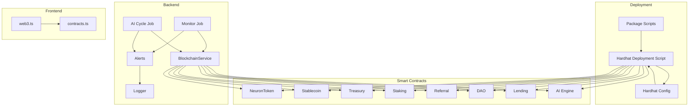
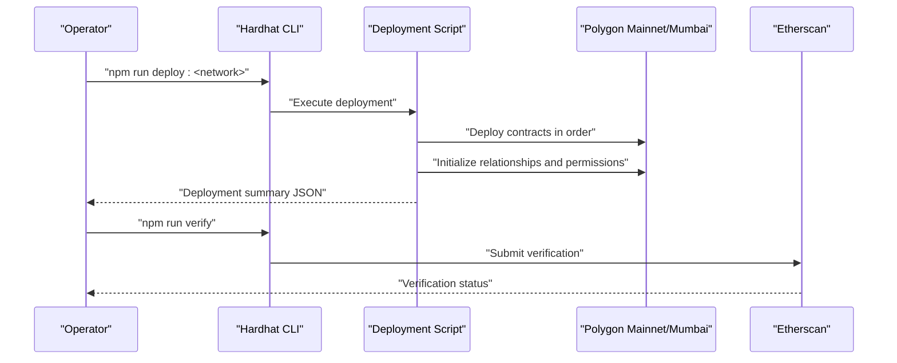
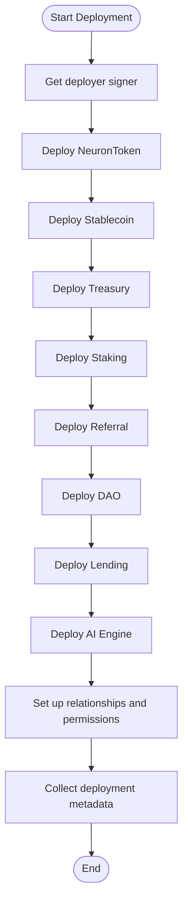
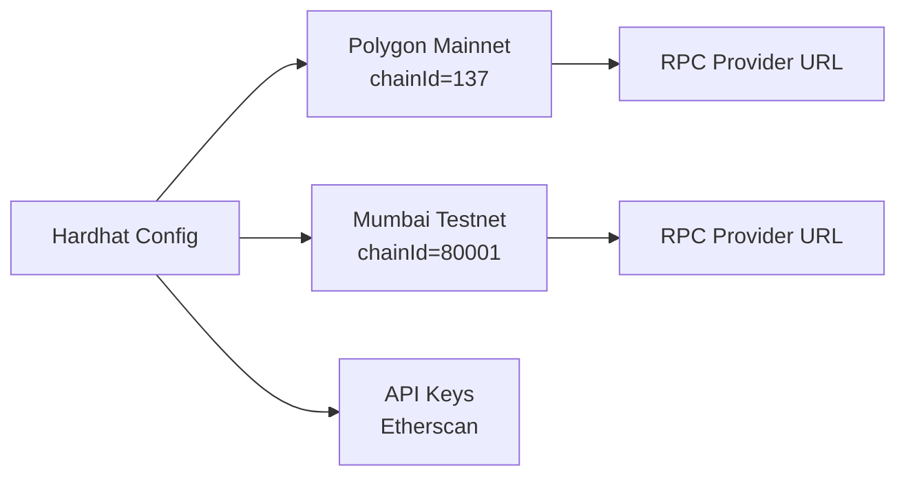
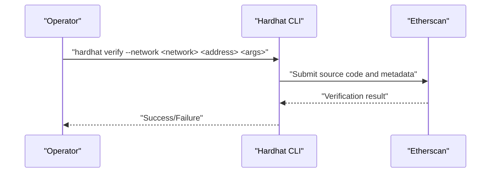
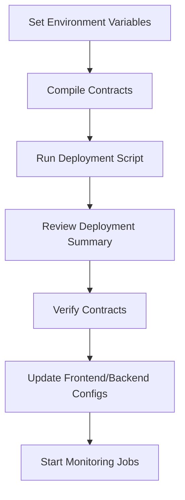
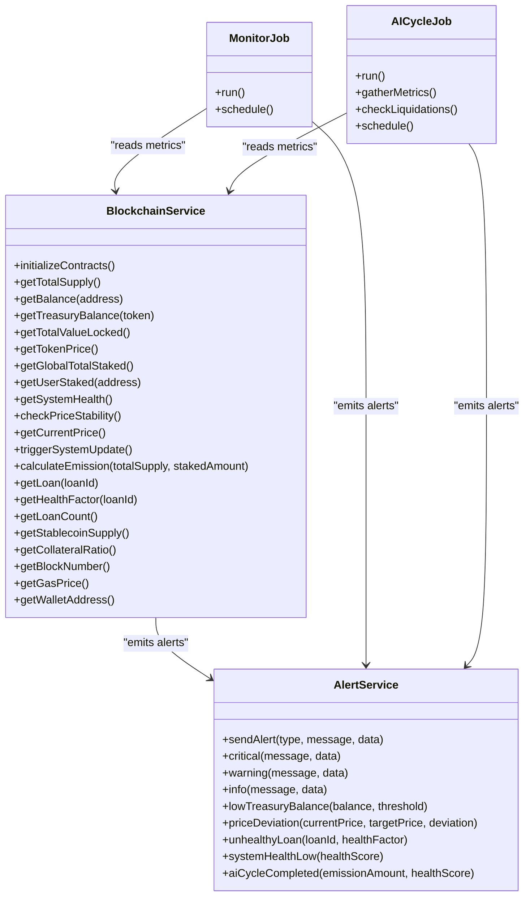
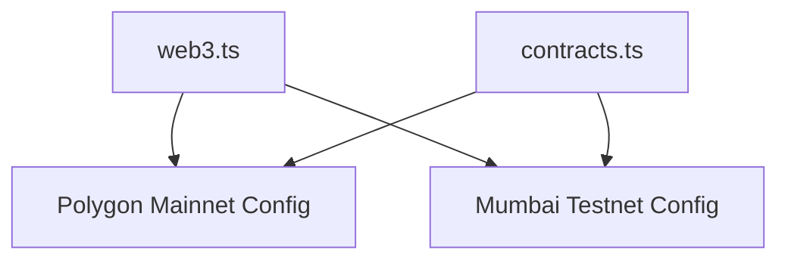
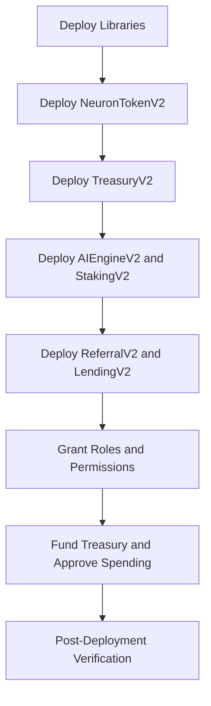
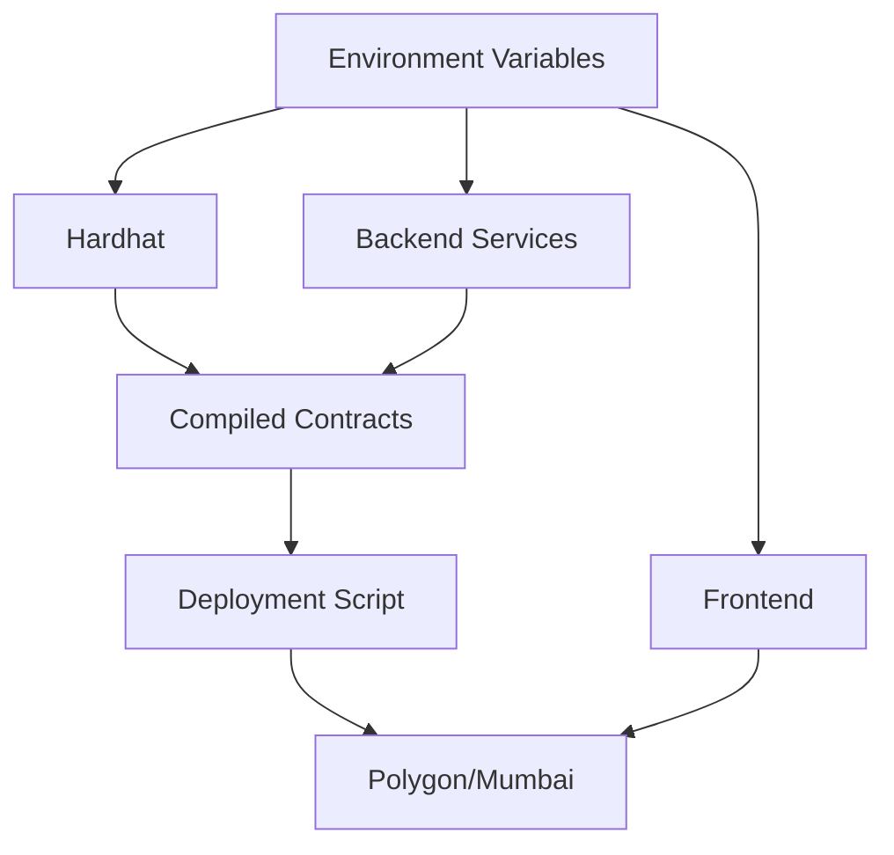

# Production Deployment

<cite>
**Referenced Files in This Document**
- [deploy.js](file://neurafinance/scripts/deploy.js)
- [hardhat.config.js](file://neurafinance/hardhat.config.js)
- [package.json](file://neurafinance/package.json)
- [blockchain.js](file://neurafinance/backend/src/config/blockchain.js)
- [contracts.js](file://neurafinance/backend/src/config/contracts.js)
- [BlockchainService.js](file://neurafinance/backend/src/services/BlockchainService.js)
- [logger.js](file://neurafinance/backend/src/utils/logger.js)
- [alerts.js](file://neurafinance/backend/src/utils/alerts.js)
- [monitor.js](file://neurafinance/backend/src/jobs/monitor.js)
- [ai-cycle.js](file://neurafinance/backend/src/jobs/ai-cycle.js)
- [web3.ts](file://neurafinance/frontend/src/utils/web3.ts)
- [contracts.ts](file://neurafinance/frontend/src/utils/contracts.ts)
- [DEPLOYMENT.md](file://neurafinance/contracts-v2/DEPLOYMENT.md)
</cite>

## Table of Contents
1. [Introduction](#introduction)
2. [Project Structure](#project-structure)
3. [Core Components](#core-components)
4. [Architecture Overview](#architecture-overview)
5. [Detailed Component Analysis](#detailed-component-analysis)
6. [Dependency Analysis](#dependency-analysis)
7. [Performance Considerations](#performance-considerations)
8. [Troubleshooting Guide](#troubleshooting-guide)
9. [Conclusion](#conclusion)
10. [Appendices](#appendices)

## Introduction
This document provides a production-focused guide for deploying the NeuraFinance ecosystem across Polygon mainnet and Mumbai testnet. It explains the deployment script functionality, network-specific configurations, and contract verification procedures. It also documents infrastructure requirements, RPC provider setup, security considerations, monitoring, maintenance, rollback strategies, and emergency procedures tailored for DevOps engineers and system administrators.

## Project Structure
The NeuraFinance ecosystem comprises:
- Smart contracts under the contracts directory and a V2 deployment guide
- A Hardhat-based deployment script orchestrating contract deployment and initialization
- Backend services for monitoring, alerting, and blockchain interactions
- Frontend utilities for connecting to Polygon mainnet and Mumbai testnet

**Diagram sources**
- [deploy.js:1-170](file://neurafinance/scripts/deploy.js#L1-L170)
- [hardhat.config.js:1-43](file://neurafinance/hardhat.config.js#L1-L43)
- [package.json:5-14](file://neurafinance/package.json#L5-L14)
- [BlockchainService.js:1-216](file://neurafinance/backend/src/services/BlockchainService.js#L1-L216)
- [monitor.js:1-141](file://neurafinance/backend/src/jobs/monitor.js#L1-L141)
- [ai-cycle.js:1-177](file://neurafinance/backend/src/jobs/ai-cycle.js#L1-L177)
- [alerts.js:1-82](file://neurafinance/backend/src/utils/alerts.js#L1-L82)
- [logger.js:1-28](file://neurafinance/backend/src/utils/logger.js#L1-L28)
- [web3.ts:1-118](file://neurafinance/frontend/src/utils/web3.ts#L1-L118)
- [contracts.ts:1-148](file://neurafinance/frontend/src/utils/contracts.ts#L1-L148)

**Section sources**
- [deploy.js:1-170](file://neurafinance/scripts/deploy.js#L1-L170)
- [hardhat.config.js:1-43](file://neurafinance/hardhat.config.js#L1-L43)
- [package.json:5-14](file://neurafinance/package.json#L5-L14)

## Core Components
- Deployment script: Orchestrates contract deployment and post-deployment setup, capturing deployment metadata and returning a structured summary for production use.
- Hardhat configuration: Defines Polygon mainnet and Mumbai testnet networks, RPC providers, private key usage, and Etherscan verification keys.
- Backend blockchain service: Provides typed contract wrappers and read/write operations to interact with deployed contracts.
- Monitoring and AI cycle jobs: Scheduled tasks that observe system health, price stability, and trigger periodic system updates.
- Frontend utilities: Provide network configuration and ABI definitions for Polygon mainnet and Mumbai testnet.

Key responsibilities:
- Compile Solidity contracts and deploy them via the deployment script
- Configure RPC providers and private keys for Polygon mainnet and Mumbai testnet
- Verify contracts on Etherscan after successful deployment
- Initialize cross-contract relationships and permissions
- Monitor system health and emit alerts for critical conditions

**Section sources**
- [deploy.js:1-170](file://neurafinance/scripts/deploy.js#L1-L170)
- [hardhat.config.js:15-35](file://neurafinance/hardhat.config.js#L15-L35)
- [BlockchainService.js:12-37](file://neurafinance/backend/src/services/BlockchainService.js#L12-L37)
- [monitor.js:99-124](file://neurafinance/backend/src/jobs/monitor.js#L99-L124)
- [ai-cycle.js:148-160](file://neurafinance/backend/src/jobs/ai-cycle.js#L148-L160)
- [web3.ts:93-117](file://neurafinance/frontend/src/utils/web3.ts#L93-L117)

## Architecture Overview
The production deployment pipeline integrates the deployment script with Hardhat, deploys contracts to Polygon mainnet or Mumbai testnet, initializes relationships, and verifies contracts on Etherscan. The backend services continuously monitor the system and trigger automated actions, while the frontend supports user interactions on Polygon networks.

**Diagram sources**
- [package.json:8-11](file://neurafinance/package.json#L8-L11)
- [deploy.js:3-162](file://neurafinance/scripts/deploy.js#L3-L162)
- [hardhat.config.js:30-35](file://neurafinance/hardhat.config.js#L30-L35)

## Detailed Component Analysis

### Deployment Script Functionality
The deployment script performs:
- Contract deployment in a strict order to satisfy dependencies
- Initialization of cross-contract relationships and permissions
- Capture of deployment metadata including network, chainId, deployer, and contract addresses
- Structured logging and return of deployment summary for audit and automation

**Diagram sources**
- [deploy.js:3-162](file://neurafinance/scripts/deploy.js#L3-L162)

**Section sources**
- [deploy.js:3-162](file://neurafinance/scripts/deploy.js#L3-L162)

### Polygon Mainnet and Mumbai Testnet Configurations
Hardhat configuration defines:
- Networks: polygon (chainId 137) and mumbai (chainId 80001)
- RPC provider URLs with environment variable overrides
- Private key usage for signing transactions
- Etherscan API keys for contract verification

Environment variables:
- POLYGON_RPC_URL and MUMBAI_RPC_URL for RPC provider endpoints
- PRIVATE_KEY for the deployer account
- POLYGONSCAN_API_KEY for Etherscan verification

**Diagram sources**
- [hardhat.config.js:15-35](file://neurafinance/hardhat.config.js#L15-L35)

**Section sources**
- [hardhat.config.js:15-35](file://neurafinance/hardhat.config.js#L15-L35)

### Contract Verification Procedures
Post-deployment verification:
- Use Hardhat’s verification command with appropriate network and API key
- Ensure all constructor arguments and compiler settings match the original deployment
- Confirm contract sources and ABIs are available for public viewing

**Diagram sources**
- [hardhat.config.js:30-35](file://neurafinance/hardhat.config.js#L30-L35)
- [package.json:11](file://neurafinance/package.json#L11)

**Section sources**
- [hardhat.config.js:30-35](file://neurafinance/hardhat.config.js#L30-L35)
- [package.json:11](file://neurafinance/package.json#L11)

### Step-by-Step Deployment Process
1. Prepare environment variables for RPC provider and private key
2. Compile contracts using Hardhat
3. Run the deployment script for the target network
4. Review the deployment summary JSON
5. Verify contracts on Etherscan using the verification command
6. Update frontend and backend environment variables with deployed addresses
7. Start monitoring and AI cycle jobs

**Diagram sources**
- [package.json:6-11](file://neurafinance/package.json#L6-L11)
- [deploy.js:140-161](file://neurafinance/scripts/deploy.js#L140-L161)
- [hardhat.config.js:30-35](file://neurafinance/hardhat.config.js#L30-L35)

**Section sources**
- [package.json:6-11](file://neurafinance/package.json#L6-L11)
- [deploy.js:140-161](file://neurafinance/scripts/deploy.js#L140-L161)

### Backend Integration and Monitoring
The backend integrates with deployed contracts via typed ABIs and a centralized service. Monitoring and AI cycle jobs run on schedules to maintain system health and trigger periodic updates.

**Diagram sources**
- [BlockchainService.js:12-213](file://neurafinance/backend/src/services/BlockchainService.js#L12-L213)
- [monitor.js:12-124](file://neurafinance/backend/src/jobs/monitor.js#L12-L124)
- [ai-cycle.js:13-160](file://neurafinance/backend/src/jobs/ai-cycle.js#L13-L160)
- [alerts.js:4-79](file://neurafinance/backend/src/utils/alerts.js#L4-L79)

**Section sources**
- [BlockchainService.js:12-213](file://neurafinance/backend/src/services/BlockchainService.js#L12-L213)
- [monitor.js:12-124](file://neurafinance/backend/src/jobs/monitor.js#L12-L124)
- [ai-cycle.js:13-160](file://neurafinance/backend/src/jobs/ai-cycle.js#L13-L160)
- [alerts.js:4-79](file://neurafinance/backend/src/utils/alerts.js#L4-L79)

### Frontend Network Support
The frontend provides built-in configuration for Polygon mainnet and Mumbai testnet, including RPC URLs and block explorer links, enabling seamless user onboarding and transaction signing.

**Diagram sources**
- [web3.ts:93-117](file://neurafinance/frontend/src/utils/web3.ts#L93-L117)
- [contracts.ts:67-75](file://neurafinance/frontend/src/utils/contracts.ts#L67-L75)

**Section sources**
- [web3.ts:93-117](file://neurafinance/frontend/src/utils/web3.ts#L93-L117)
- [contracts.ts:67-75](file://neurafinance/frontend/src/utils/contracts.ts#L67-L75)

### V2 Deployment Guidance
The V2 deployment guide outlines a precise deployment order, permission grants, and configuration parameters. It also provides a checklist for post-deployment verification and keeper setup.

**Diagram sources**
- [DEPLOYMENT.md:3-100](file://neurafinance/contracts-v2/DEPLOYMENT.md#L3-L100)

**Section sources**
- [DEPLOYMENT.md:1-237](file://neurafinance/contracts-v2/DEPLOYMENT.md#L1-L237)

## Dependency Analysis
The deployment pipeline and runtime services depend on:
- Hardhat for compilation and deployment orchestration
- Environment variables for RPC providers and private keys
- Etherscan API keys for verification
- Backend services for monitoring and automated actions
- Frontend utilities for network configuration

**Diagram sources**
- [hardhat.config.js:15-35](file://neurafinance/hardhat.config.js#L15-L35)
- [package.json:5-14](file://neurafinance/package.json#L5-L14)
- [blockchain.js:1-33](file://neurafinance/backend/src/config/blockchain.js#L1-L33)
- [web3.ts:93-117](file://neurafinance/frontend/src/utils/web3.ts#L93-L117)

**Section sources**
- [hardhat.config.js:15-35](file://neurafinance/hardhat.config.js#L15-L35)
- [package.json:5-14](file://neurafinance/package.json#L5-L14)
- [blockchain.js:1-33](file://neurafinance/backend/src/config/blockchain.js#L1-L33)
- [web3.ts:93-117](file://neurafinance/frontend/src/utils/web3.ts#L93-L117)

## Performance Considerations
- Gas optimization: Enable the Solidity optimizer with appropriate runs to reduce deployment and transaction costs.
- Batch operations: Combine related transactions where possible to minimize gas usage.
- Monitoring cadence: Tune cron intervals for monitoring and AI cycles to balance responsiveness and cost.
- Provider reliability: Use multiple RPC provider endpoints and fallback mechanisms to avoid downtime.

[No sources needed since this section provides general guidance]

## Troubleshooting Guide
Common issues and resolutions:
- RPC connectivity failures: Verify RPC provider URLs and network availability; ensure environment variables are set correctly.
- Private key or account balance issues: Confirm private key validity and sufficient MATIC balance for gas fees.
- Transaction failures during deployment: Check nonce, gas price, and contract initialization parameters.
- Monitoring job errors: Inspect logs and ensure backend services can reach the RPC provider and Etherscan.
- Alert delivery failures: Validate webhook URL and email configuration; confirm network connectivity.

Operational checks:
- Validate deployment summary JSON and compare with expected addresses.
- Confirm contract verification on Etherscan using the correct network and API key.
- Review backend logs for error messages and stack traces.

**Section sources**
- [logger.js:1-28](file://neurafinance/backend/src/utils/logger.js#L1-L28)
- [alerts.js:10-30](file://neurafinance/backend/src/utils/alerts.js#L10-L30)
- [blockchain.js:4-8](file://neurafinance/backend/src/config/blockchain.js#L4-L8)

## Conclusion
This guide outlines a robust, repeatable process for deploying the NeuraFinance ecosystem on Polygon mainnet and Mumbai testnet. By leveraging the deployment script, Hardhat configuration, backend monitoring, and frontend network utilities, operators can achieve reliable production deployments with strong verification and observability. Adhering to the step-by-step process, maintaining secure environment variables, and establishing monitoring and alerting ensures resilient operations.

[No sources needed since this section summarizes without analyzing specific files]

## Appendices

### A. Environment Variables Reference
- POLYGON_RPC_URL: RPC endpoint for Polygon mainnet
- MUMBAI_RPC_URL: RPC endpoint for Mumbai testnet
- PRIVATE_KEY: Private key for the deployer account
- POLYGONSCAN_API_KEY: Etherscan API key for verification
- NEURON_TOKEN_ADDRESS, TREASURY_ADDRESS, STAKING_ADDRESS, REFERRAL_ADDRESS, DAO_ADDRESS, LENDING_ADDRESS, STABLECOIN_ADDRESS, AI_ENGINE_ADDRESS: Deployed contract addresses for backend and frontend

**Section sources**
- [hardhat.config.js:20-27](file://neurafinance/hardhat.config.js#L20-L27)
- [blockchain.js:10-20](file://neurafinance/backend/src/config/blockchain.js#L10-L20)
- [contracts.ts:67-75](file://neurafinance/frontend/src/utils/contracts.ts#L67-L75)

### B. Monitoring and Maintenance Procedures
- Schedule monitoring and AI cycle jobs to run at desired intervals
- Configure alert webhooks and email notifications
- Regularly review logs and system health metrics
- Maintain backup of deployment metadata and verification artifacts

**Section sources**
- [monitor.js:112-124](file://neurafinance/backend/src/jobs/monitor.js#L112-L124)
- [ai-cycle.js:148-160](file://neurafinance/backend/src/jobs/ai-cycle.js#L148-L160)
- [alerts.js:4-79](file://neurafinance/backend/src/utils/alerts.js#L4-L79)
- [logger.js:12-25](file://neurafinance/backend/src/utils/logger.js#L12-L25)

### C. Rollback and Emergency Procedures
- Pause system components via admin functions if necessary
- Execute emergency withdrawals from treasury for critical situations
- Adjust parameters with timelocks in production environments
- Maintain keeper bots with sufficient gas funds to handle emergencies

**Section sources**
- [DEPLOYMENT.md:200-221](file://neurafinance/contracts-v2/DEPLOYMENT.md#L200-L221)