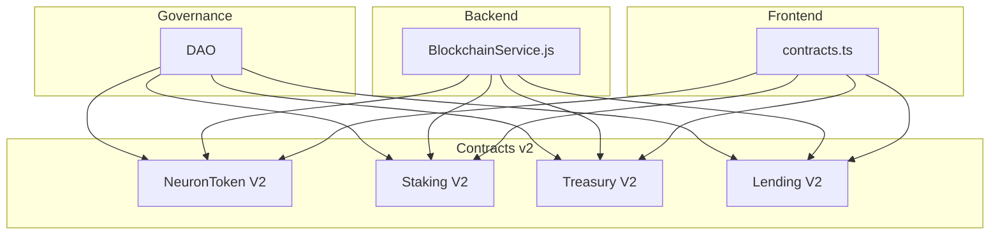
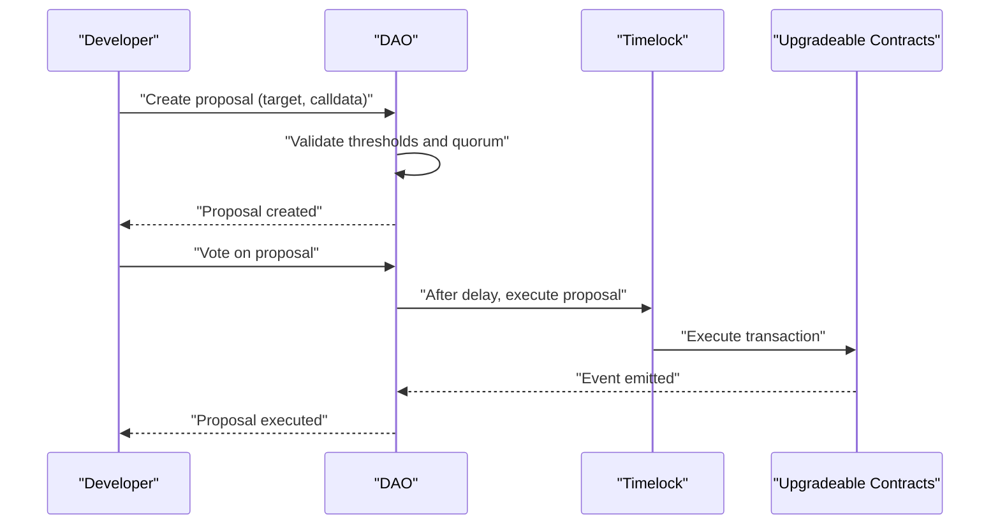
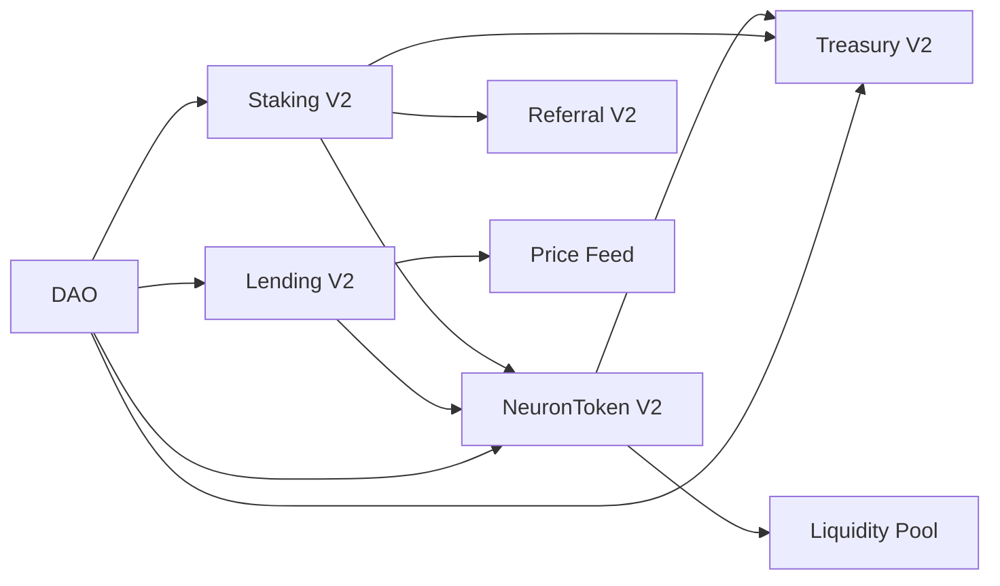

# Upgrade and Migration Procedures

<cite>
**Referenced Files in This Document**
- [DIFFERENCES.md](file://neurafinance/contracts-v2/DIFFERENCES.md)
- [DEPLOYMENT.md](file://neurafinance/contracts-v2/DEPLOYMENT.md)
- [MATHEMATICAL_MODEL.md](file://neurafinance/contracts-v2/MATHEMATICAL_MODEL.md)
- [SUSTAINABILITY_ANALYSIS.md](file://neurafinance/contracts-v2/SUSTAINABILITY_ANALYSIS.md)
- [ARCHITECTURE.md](file://neurafinance/ARCHITECTURE.md)
- [DAO.sol](file://neurafinance/contracts/core/DAO.sol)
- [NeuronToken.sol](file://neurafinance/contracts/core/NeuronToken.sol)
- [Staking.sol](file://neurafinance/contracts/core/Staking.sol)
- [Treasury.sol](file://neurafinance/contracts/core/Treasury.sol)
- [Lending.sol](file://neurafinance/contracts-v2/core/Lending.sol)
- [NeuronToken.sol](file://neurafinance/contracts-v2/core/NeuronToken.sol)
- [Staking.sol](file://neurafinance/contracts-v2/core/Staking.sol)
- [Treasury.sol](file://neurafinance/contracts-v2/core/Treasury.sol)
- [BlockchainService.js](file://neurafinance/backend/src/services/BlockchainService.js)
- [contracts.ts](file://neurafinance/frontend/src/utils/contracts.ts)
</cite>

## Table of Contents
1. [Introduction](#introduction)
2. [Project Structure](#project-structure)
3. [Core Components](#core-components)
4. [Architecture Overview](#architecture-overview)
5. [Detailed Component Analysis](#detailed-component-analysis)
6. [Dependency Analysis](#dependency-analysis)
7. [Performance Considerations](#performance-considerations)
8. [Troubleshooting Guide](#troubleshooting-guide)
9. [Conclusion](#conclusion)
10. [Appendices](#appendices)

## Introduction
This document defines upgrade and migration procedures for the NeuraFinance ecosystem with a focus on upgradeable contracts, DAO governance, timelock mechanisms, and emergency upgrade procedures. It explains differences between versions, breaking changes, migration timelines, and provides both conceptual guidance for protocol developers and technical steps for system administrators. Practical examples demonstrate upgrade workflows, data migration strategies, and user impact minimization techniques, along with rollback procedures, testing strategies, and communication protocols.

## Project Structure
The NeuraFinance ecosystem consists of:
- Core contracts (v1) and upgraded contracts (v2)
- DAO governance contracts
- Backend automation services
- Frontend integration utilities
- Mathematical and sustainability documentation

**Diagram sources**
- [DAO.sol:1-231](file://neurafinance/contracts/core/DAO.sol#L1-231)
- [NeuronToken.sol:1-231](file://neurafinance/contracts-v2/core/NeuronToken.sol#L1-231)
- [Staking.sol:1-349](file://neurafinance/contracts-v2/core/Staking.sol#L1-349)
- [Treasury.sol:1-298](file://neurafinance/contracts-v2/core/Treasury.sol#L1-298)
- [Lending.sol:1-414](file://neurafinance/contracts-v2/core/Lending.sol#L1-414)
- [BlockchainService.js:1-216](file://neurafinance/backend/src/services/BlockchainService.js#L1-216)
- [contracts.ts:1-148](file://neurafinance/frontend/src/utils/contracts.ts#L1-148)

**Section sources**
- [ARCHITECTURE.md:1-239](file://neurafinance/ARCHITECTURE.md#L1-L239)
- [DEPLOYMENT.md:1-237](file://neurafinance/contracts-v2/DEPLOYMENT.md#L1-L237)

## Core Components
Key components involved in upgrades and migrations:
- DAO governance controls proposal creation, voting, and execution with timelock enforcement
- Upgradeable contracts (v2) introduce role-based access control, reentrancy guards, and improved tokenomics
- Treasury manages rewards, buybacks, and backing ratios
- Staking and Lending contracts depend on token and treasury state
- Backend and frontend provide integration points for monitoring and user interaction

**Section sources**
- [DAO.sol:1-231](file://neurafinance/contracts/core/DAO.sol#L1-L231)
- [NeuronToken.sol:1-231](file://neurafinance/contracts-v2/core/NeuronToken.sol#L1-L231)
- [Staking.sol:1-349](file://neurafinance/contracts-v2/core/Staking.sol#L1-L349)
- [Treasury.sol:1-298](file://neurafinance/contracts-v2/core/Treasury.sol#L1-L298)
- [Lending.sol:1-414](file://neurafinance/contracts-v2/core/Lending.sol#L1-L414)

## Architecture Overview
The upgrade architecture centers on DAO governance and timelock mechanisms to safely change system parameters and contracts. The v2 contracts improve security, sustainability, and transparency compared to v1.

**Diagram sources**
- [DAO.sol:51-110](file://neurafinance/contracts/core/DAO.sol#L51-L110)
- [DEPLOYMENT.md:200-221](file://neurafinance/contracts-v2/DEPLOYMENT.md#L200-L221)

## Detailed Component Analysis

### Upgradeable Contracts and Version Differences
NeuraFinance v2 introduces significant improvements over v1:
- Correct compound interest calculations and sustainable emission schedules
- Max supply cap, health-adjusted emission, and treasury-backed rewards
- Real price oracles, functional liquidation, and reentrancy protection
- Role-based access control and timelock mechanisms

Breaking changes and migration highlights:
- Tokenomics: v1 had infinite supply and incorrect interest; v2 enforces caps and correct math
- Emission: v1 lacked health controls; v2 applies health multipliers and decreasing rates
- Referral system: v1 was Ponzi-like; v2 is treasury-funded with capped payouts
- Treasury: v1 had no backing; v2 mandates backing ratios and buybacks
- Access control: v1 single owner; v2 RBAC with timelock and emergency pause

Practical migration implications:
- Contracts must be redeployed in a defined order to wire dependencies
- Roles and permissions must be granted to new contracts
- Treasury must be funded and approvals set for reward distribution
- Keepers must be configured for cycle execution and auto-compounding

**Section sources**
- [DIFFERENCES.md:1-318](file://neurafinance/contracts-v2/DIFFERENCES.md#L1-L318)
- [MATHEMATICAL_MODEL.md:1-364](file://neurafinance/contracts-v2/MATHEMATICAL_MODEL.md#L1-L364)
- [SUSTAINABILITY_ANALYSIS.md:1-399](file://neurafinance/contracts-v2/SUSTAINABILITY_ANALYSIS.md#L1-L399)
- [DEPLOYMENT.md:1-237](file://neurafinance/contracts-v2/DEPLOYMENT.md#L1-L237)

### DAO Governance and Timelock Mechanisms
DAO governance enables decentralized decision-making:
- Proposal lifecycle: creation, voting delay, active period, quorum, and execution
- Timelock enforcement: parameter changes and critical actions require delayed execution
- Access control: only timelock can execute finalized proposals
- Voting power: derived from staked tokens plus token balance

Emergency upgrade procedures:
- Emergency pause for critical contracts
- Emergency withdrawal from treasury for exceptional circumstances
- Parameter adjustments subject to timelock

**Section sources**
- [DAO.sol:1-231](file://neurafinance/contracts/core/DAO.sol#L1-L231)
- [DEPLOYMENT.md:200-221](file://neurafinance/contracts-v2/DEPLOYMENT.md#L200-L221)

### Migration Procedures from v1 to v2
Recommended migration sequence:
1. Deploy libraries and core contracts in dependency order
2. Update token with treasury address and configure fee recipients
3. Deploy AI Engine and Staking, then wire interdependencies
4. Deploy Referral and connect to Staking
5. Deploy Lending and integrate price feeds
6. Grant roles and permissions across contracts
7. Fund Treasury and approve spending for reward distribution
8. Configure keepers and monitor system health

Data migration strategies:
- Staking: user stakes and rewards are stored per-user mappings; no central migration needed
- Treasury: asset balances and allocations remain intact after redeployment
- Lending: loan records and market state are contract-specific; redeploy with new contract addresses
- Token: supply and balances persist; ensure fee recipients and exemptions are reconfigured

User impact minimization:
- Communicate upgrade timeline and benefits
- Provide migration tools or UI updates to reflect new contract addresses
- Offer extended support windows for user questions
- Ensure frontend and backend point to new contract addresses

**Section sources**
- [DEPLOYMENT.md:3-101](file://neurafinance/contracts-v2/DEPLOYMENT.md#L3-L101)

### Upgrade Workflows and Rollback Procedures
Upgrade workflow:
- DAO creates proposal with target contract and calldata
- Community votes; proposal passes after quorum and majority
- Timelock executes proposal after delay
- Monitor events and system health post-upgrade

Rollback procedures:
- Emergency pause contracts to halt risky operations
- Emergency withdrawal from Treasury for immediate liquidity needs
- Revert parameter changes using timelock mechanism
- Restore previous contract state if reversible

Testing strategies:
- Unit tests for all contracts
- Integration tests across contract interactions
- Fuzzing for edge cases
- Gas optimization analysis
- Security audit recommendations

Communication protocols:
- Announce upgrade window and expected downtime
- Provide step-by-step instructions for users
- Offer support channels and FAQs
- Post-upgrade verification and health reporting

**Section sources**
- [DEPLOYMENT.md:145-237](file://neurafinance/contracts-v2/DEPLOYMENT.md#L145-L237)
- [DAO.sol:1-231](file://neurafinance/contracts/core/DAO.sol#L1-L231)

### Backward Compatibility Considerations
Backward compatibility considerations:
- v2 contracts introduce new roles and permissioning; legacy integrations must adapt
- Token fee structure and exemptions differ; ensure frontend/backend align
- Lending and Staking APIs remain consistent; verify ABI compatibility
- Treasury backing and reward funding are now explicit; adjust dependent logic

**Section sources**
- [NeuronToken.sol:1-231](file://neurafinance/contracts-v2/core/NeuronToken.sol#L1-L231)
- [Staking.sol:1-349](file://neurafinance/contracts-v2/core/Staking.sol#L1-L349)
- [Treasury.sol:1-298](file://neurafinance/contracts-v2/core/Treasury.sol#L1-L298)
- [Lending.sol:1-414](file://neurafinance/contracts-v2/core/Lending.sol#L1-L414)

## Dependency Analysis
Contract dependencies and upgrade implications:
- NeuronToken V2 depends on Treasury and Liquidity Pool addresses
- Staking V2 depends on NeuronToken, Treasury, and Referral contracts
- Treasury V2 funds Staking and Referral rewards
- Lending V2 integrates with NeuronToken and price feeds
- DAO governs upgrades and sets timelocks

**Diagram sources**
- [NeuronToken.sol:1-231](file://neurafinance/contracts-v2/core/NeuronToken.sol#L1-L231)
- [Staking.sol:1-349](file://neurafinance/contracts-v2/core/Staking.sol#L1-L349)
- [Treasury.sol:1-298](file://neurafinance/contracts-v2/core/Treasury.sol#L1-L298)
- [Lending.sol:1-414](file://neurafinance/contracts-v2/core/Lending.sol#L1-L414)
- [DAO.sol:1-231](file://neurafinance/contracts/core/DAO.sol#L1-L231)

**Section sources**
- [ARCHITECTURE.md:1-239](file://neurafinance/ARCHITECTURE.md#L1-L239)

## Performance Considerations
- Batch operations reduce gas costs and improve throughput
- Checkpoint pattern defers global updates to periodic keeper runs
- Reentrancy guards and access control minimize re-execution risks
- Monitoring and alerts help maintain system performance and stability

[No sources needed since this section provides general guidance]

## Troubleshooting Guide
Common upgrade and migration issues:
- Incorrect deployment order causing dependency failures
- Missing role grants leading to permission errors
- Timelock delays preventing immediate parameter changes
- Keeper misconfiguration causing missed cycles or liquidations

Resolution steps:
- Verify deployment sequence and dependencies
- Confirm role assignments and permissions
- Check timelock status and proposal state
- Validate keeper addresses and balances
- Review logs and events for error details

Monitoring and verification:
- Post-deployment checklist for token, staking, AI engine, treasury, referral, and lending
- Key metrics: backing ratio, health score, TVL, emission rate, liquidation events
- Alerts for critical thresholds and failed keeper executions

**Section sources**
- [DEPLOYMENT.md:145-237](file://neurafinance/contracts-v2/DEPLOYMENT.md#L145-L237)
- [BlockchainService.js:1-216](file://neurafinance/backend/src/services/BlockchainService.js#L1-L216)
- [contracts.ts:1-148](file://neurafinance/frontend/src/utils/contracts.ts#L1-L148)

## Conclusion
NeuraFinance v2 establishes a secure, sustainable, and upgradeable ecosystem through DAO governance, timelock mechanisms, and robust contract architecture. By following the documented upgrade and migration procedures—carefully sequencing deployments, configuring roles and permissions, funding Treasury, and setting up keepers—operators can minimize user impact and ensure smooth transitions. Comprehensive testing, monitoring, and communication further strengthen the upgrade process.

[No sources needed since this section summarizes without analyzing specific files]

## Appendices

### Appendix A: Upgrade Timeline and Milestones
- Pre-deployment: finalize DAO proposals, prepare timelock, and coordinate keepers
- Deployment window: execute contracts in dependency order and grant roles
- Post-deployment: verify system health, monitor metrics, and announce completion
- Ongoing: continuous monitoring, governance participation, and gradual parameter adjustments

**Section sources**
- [DEPLOYMENT.md:1-237](file://neurafinance/contracts-v2/DEPLOYMENT.md#L1-L237)

### Appendix B: Emergency Procedures Checklist
- Pause critical contracts immediately
- Execute emergency withdrawals from Treasury if necessary
- Revert parameter changes via timelock
- Notify stakeholders and provide status updates
- Document incident and remediation steps

**Section sources**
- [DEPLOYMENT.md:200-221](file://neurafinance/contracts-v2/DEPLOYMENT.md#L200-L221)