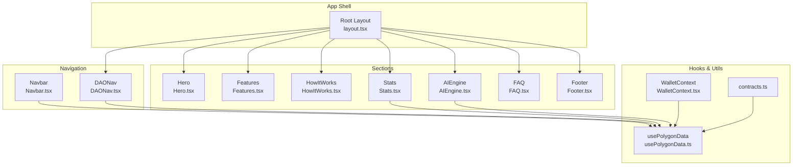
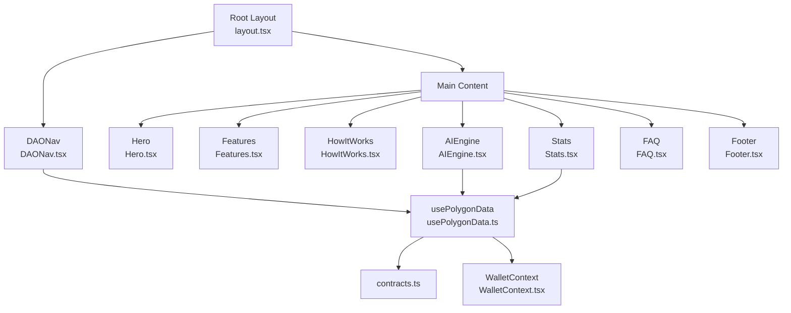
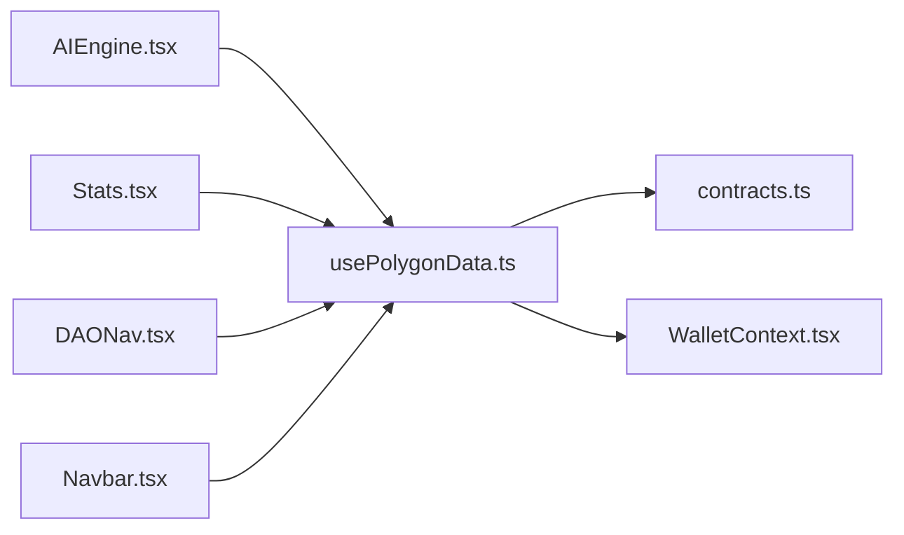

# Component Library

<cite>
**Referenced Files in This Document**
- [AIEngine.tsx](file://neurafinance/frontend/src/components/AIEngine.tsx)
- [DAONav.tsx](file://neurafinance/frontend/src/components/DAONav.tsx)
- [Navbar.tsx](file://neurafinance/frontend/src/components/Navbar.tsx)
- [Stats.tsx](file://neurafinance/frontend/src/components/Stats.tsx)
- [Footer.tsx](file://neurafinance/frontend/src/components/Footer.tsx)
- [FAQ.tsx](file://neurafinance/frontend/src/components/FAQ.tsx)
- [Hero.tsx](file://neurafinance/frontend/src/components/Hero.tsx)
- [Features.tsx](file://neurafinance/frontend/src/components/Features.tsx)
- [HowItWorks.tsx](file://neurafinance/frontend/src/components/HowItWorks.tsx)
- [usePolygonData.ts](file://neurafinance/frontend/src/hooks/usePolygonData.ts)
- [WalletContext.tsx](file://neurafinance/frontend/src/contexts/WalletContext.tsx)
- [contracts.ts](file://neurafinance/frontend/src/utils/contracts.ts)
- [layout.tsx](file://neurafinance/frontend/src/app/layout.tsx)
- [tailwind.config.js](file://neurafinance/frontend/tailwind.config.js)
</cite>

## Table of Contents
1. [Introduction](#introduction)
2. [Project Structure](#project-structure)
3. [Core Components](#core-components)
4. [Architecture Overview](#architecture-overview)
5. [Detailed Component Analysis](#detailed-component-analysis)
6. [Dependency Analysis](#dependency-analysis)
7. [Performance Considerations](#performance-considerations)
8. [Accessibility Compliance](#accessibility-compliance)
9. [Testing Strategies](#testing-strategies)
10. [Troubleshooting Guide](#troubleshooting-guide)
11. [Conclusion](#conclusion)
12. [Appendices](#appendices)

## Introduction
This document describes the component library for the NeuraFinance frontend, focusing on reusable UI components and design patterns. It explains the component hierarchy, prop interfaces, state management patterns, and styling approaches using Tailwind CSS. It also documents key components including AIEngine visualization, navigation bars, statistics displays, and footer elements, along with composition patterns, responsive design, accessibility, performance, and testing strategies.

## Project Structure
The frontend is built with Next.js and organized around a components-first approach. Global layout composes the navigation and page content, while individual components encapsulate UI and logic for specific sections such as hero, features, AI engine, stats, FAQ, and footer. Shared utilities and hooks centralize Web3 interactions and formatting.

**Diagram sources**
- [layout.tsx:16-35](file://neurafinance/frontend/src/app/layout.tsx#L16-L35)
- [Navbar.tsx:16-118](file://neurafinance/frontend/src/components/Navbar.tsx#L16-L118)
- [DAONav.tsx:33-138](file://neurafinance/frontend/src/components/DAONav.tsx#L33-L138)
- [Hero.tsx:6-126](file://neurafinance/frontend/src/components/Hero.tsx#L6-L126)
- [Features.tsx:38-88](file://neurafinance/frontend/src/components/Features.tsx#L38-L88)
- [HowItWorks.tsx:28-75](file://neurafinance/frontend/src/components/HowItWorks.tsx#L28-L75)
- [AIEngine.tsx:39-122](file://neurafinance/frontend/src/components/AIEngine.tsx#L39-L122)
- [Stats.tsx:15-93](file://neurafinance/frontend/src/components/Stats.tsx#L15-L93)
- [FAQ.tsx:33-81](file://neurafinance/frontend/src/components/FAQ.tsx#L33-L81)
- [Footer.tsx:21-106](file://neurafinance/frontend/src/components/Footer.tsx#L21-L106)
- [usePolygonData.ts:166-574](file://neurafinance/frontend/src/hooks/usePolygonData.ts#L166-L574)
- [WalletContext.tsx:17-101](file://neurafinance/frontend/src/contexts/WalletContext.tsx#L17-L101)
- [contracts.ts:113-147](file://neurafinance/frontend/src/utils/contracts.ts#L113-L147)

**Section sources**
- [layout.tsx:16-35](file://neurafinance/frontend/src/app/layout.tsx#L16-L35)
- [tailwind.config.js:1-123](file://neurafinance/frontend/tailwind.config.js#L1-L123)

## Core Components
This section introduces the primary UI components and their roles in the application.

- AIEngine: Interactive accordion showcasing five AI modules with health indicators and animated transitions.
- DAONav: Fixed header navigation for DAO pages with mobile menu, wallet connect, and route transitions.
- Navbar: Top navigation bar for landing/home pages with external links and wallet connect.
- Stats: Real-time protocol statistics grid fetched from the backend with periodic updates.
- Footer: Multi-column footer with CTA, links, and social media.

Key shared patterns:
- State management via React hooks and a dedicated Web3 hook for blockchain data.
- Responsive design using Tailwind’s breakpoints and utility classes.
- Consistent theming with custom color tokens and animations.

**Section sources**
- [AIEngine.tsx:39-122](file://neurafinance/frontend/src/components/AIEngine.tsx#L39-L122)
- [DAONav.tsx:33-138](file://neurafinance/frontend/src/components/DAONav.tsx#L33-L138)
- [Navbar.tsx:16-118](file://neurafinance/frontend/src/components/Navbar.tsx#L16-L118)
- [Stats.tsx:15-93](file://neurafinance/frontend/src/components/Stats.tsx#L15-L93)
- [Footer.tsx:21-106](file://neurafinance/frontend/src/components/Footer.tsx#L21-L106)

## Architecture Overview
The component architecture follows a layered pattern:
- App shell composes global navigation and page content.
- Feature components encapsulate UI and integrate with hooks for state/data.
- Hooks manage Web3 connections, contract interactions, and derived data.
- Utilities provide formatting helpers and ABI/address constants.

**Diagram sources**
- [layout.tsx:16-35](file://neurafinance/frontend/src/app/layout.tsx#L16-L35)
- [DAONav.tsx:33-138](file://neurafinance/frontend/src/components/DAONav.tsx#L33-L138)
- [Hero.tsx:6-126](file://neurafinance/frontend/src/components/Hero.tsx#L6-L126)
- [Features.tsx:38-88](file://neurafinance/frontend/src/components/Features.tsx#L38-L88)
- [HowItWorks.tsx:28-75](file://neurafinance/frontend/src/components/HowItWorks.tsx#L28-L75)
- [AIEngine.tsx:39-122](file://neurafinance/frontend/src/components/AIEngine.tsx#L39-L122)
- [Stats.tsx:15-93](file://neurafinance/frontend/src/components/Stats.tsx#L15-L93)
- [FAQ.tsx:33-81](file://neurafinance/frontend/src/components/FAQ.tsx#L33-L81)
- [Footer.tsx:21-106](file://neurafinance/frontend/src/components/Footer.tsx#L21-L106)
- [usePolygonData.ts:166-574](file://neurafinance/frontend/src/hooks/usePolygonData.ts#L166-L574)
- [WalletContext.tsx:17-101](file://neurafinance/frontend/src/contexts/WalletContext.tsx#L17-L101)
- [contracts.ts:66-75](file://neurafinance/frontend/src/utils/contracts.ts#L66-L75)

## Detailed Component Analysis

### AIEngine Component
Purpose:
- Visualize and explain the AI Engine modules with an interactive accordion and health indicator.

State and props:
- Internal state tracks the active module.
- Props: none (self-contained).

Behavior:
- Renders a grid with a module list and a detail panel.
- Uses icons and gradients for visual emphasis.
- Displays a health score with a progress bar.

Composition patterns:
- Uses Lucide icons mapped to modules.
- Leverages Tailwind utility classes for responsive layouts and animations.

Accessibility:
- Buttons are keyboard focusable; ensure ARIA attributes if extended.

Performance:
- Minimal re-renders due to local state; consider memoization for heavy content.

Customization:
- Extend the module list array to add or modify modules.
- Adjust color tokens and gradients for branding.

**Section sources**
- [AIEngine.tsx:39-122](file://neurafinance/frontend/src/components/AIEngine.tsx#L39-L122)

### DAONav Component
Purpose:
- Provide navigation for DAO-related pages with wallet connectivity and route transitions.

State and props:
- Internal state for mobile menu visibility and navigation pending state.
- Props: none.

Behavior:
- Desktop and mobile navigation variants.
- Uses Next.js routing with transition optimization.
- Displays connection status with a pulse indicator.

Integration:
- Consumes usePolygonData for wallet state and connect action.
- Integrates with Next.js navigation APIs.

Responsive design:
- Hides desktop nav on small screens; shows collapsible mobile menu.

**Section sources**
- [DAONav.tsx:33-138](file://neurafinance/frontend/src/components/DAONav.tsx#L33-L138)
- [usePolygonData.ts:166-574](file://neurafinance/frontend/src/hooks/usePolygonData.ts#L166-L574)

### Navbar Component
Purpose:
- Provide top navigation for the landing/home pages with quick links and wallet connect.

State and props:
- Internal state for mobile menu visibility.
- Props: none.

Behavior:
- Desktop and mobile navigation variants.
- Includes a Swap CTA and wallet connect button.

Integration:
- Consumes usePolygonData for wallet state and connect action.

**Section sources**
- [Navbar.tsx:16-118](file://neurafinance/frontend/src/components/Navbar.tsx#L16-L118)
- [usePolygonData.ts:166-574](file://neurafinance/frontend/src/hooks/usePolygonData.ts#L166-L574)

### Stats Component
Purpose:
- Display protocol statistics in a responsive grid with live updates.

State and props:
- Internal state holds formatted stats.
- Props: none.

Behavior:
- Fetches metrics from a backend endpoint on mount and periodically.
- Formats large numbers using a shared utility.

Integration:
- Uses formatNumber utility for consistent formatting.
- Expects a backend endpoint returning metrics.

**Section sources**
- [Stats.tsx:15-93](file://neurafinance/frontend/src/components/Stats.tsx#L15-L93)
- [contracts.ts:113-122](file://neurafinance/frontend/src/utils/contracts.ts#L113-L122)

### Footer Component
Purpose:
- Provide a branded footer with call-to-action, links, and social channels.

Structure:
- CTA section, three-column layout (brand, links, community), and bottom bar.

Styling:
- Uses Tailwind utilities for spacing, typography, and hover effects.

**Section sources**
- [Footer.tsx:21-106](file://neurafinance/frontend/src/components/Footer.tsx#L21-L106)

### Supporting Components
- Hero: Large hero section with animated backgrounds and preview stats.
- Features: Feature cards highlighting protocol capabilities.
- HowItWorks: Step-by-step process visualization.
- FAQ: Accordion-style questions and answers.

**Section sources**
- [Hero.tsx:6-126](file://neurafinance/frontend/src/components/Hero.tsx#L6-L126)
- [Features.tsx:38-88](file://neurafinance/frontend/src/components/Features.tsx#L38-L88)
- [HowItWorks.tsx:28-75](file://neurafinance/frontend/src/components/HowItWorks.tsx#L28-L75)
- [FAQ.tsx:33-81](file://neurafinance/frontend/src/components/FAQ.tsx#L33-L81)

## Dependency Analysis
The following diagram shows how components depend on hooks and utilities:

**Diagram sources**
- [AIEngine.tsx:39-122](file://neurafinance/frontend/src/components/AIEngine.tsx#L39-L122)
- [Stats.tsx:15-93](file://neurafinance/frontend/src/components/Stats.tsx#L15-L93)
- [DAONav.tsx:33-138](file://neurafinance/frontend/src/components/DAONav.tsx#L33-L138)
- [Navbar.tsx:16-118](file://neurafinance/frontend/src/components/Navbar.tsx#L16-L118)
- [usePolygonData.ts:166-574](file://neurafinance/frontend/src/hooks/usePolygonData.ts#L166-L574)
- [WalletContext.tsx:17-101](file://neurafinance/frontend/src/contexts/WalletContext.tsx#L17-L101)
- [contracts.ts:66-75](file://neurafinance/frontend/src/utils/contracts.ts#L66-L75)

**Section sources**
- [usePolygonData.ts:166-574](file://neurafinance/frontend/src/hooks/usePolygonData.ts#L166-L574)
- [WalletContext.tsx:17-101](file://neurafinance/frontend/src/contexts/WalletContext.tsx#L17-L101)
- [contracts.ts:66-75](file://neurafinance/frontend/src/utils/contracts.ts#L66-L75)

## Performance Considerations
- Prefer memoization for derived data in hooks to avoid unnecessary recalculations.
- Use Next.js dynamic imports for heavy components when appropriate.
- Optimize rendering by keeping component trees shallow and avoiding deep nesting.
- Minimize re-renders by isolating state to leaf components where possible.
- Use lazy loading for images and offscreen content.
- Keep Tailwind utilities scoped to reduce CSS bloat.

[No sources needed since this section provides general guidance]

## Accessibility Compliance
- Ensure all interactive elements are keyboard accessible.
- Provide meaningful alt text for icons and decorative images.
- Maintain sufficient color contrast for text and interactive elements.
- Use semantic HTML and ARIA attributes when extending components.
- Test with screen readers and keyboard-only navigation.

[No sources needed since this section provides general guidance]

## Testing Strategies
- Unit tests for hooks: mock providers and verify returned values and side effects.
- Component tests: render components in isolation, simulate user interactions, and assert DOM updates.
- Integration tests: test component interactions with hooks and backend endpoints.
- Visual regression tests: compare screenshots across devices and themes.
- End-to-end tests: automate user journeys (connect wallet, navigate, view stats).

[No sources needed since this section provides general guidance]

## Troubleshooting Guide
Common issues and resolutions:
- Wallet connection failures: verify network configuration and provider availability.
- Data fetch errors: check backend endpoint availability and CORS settings.
- Formatting inconsistencies: confirm number formatting utilities and decimal conversions.
- Styling regressions: validate Tailwind configuration and custom color tokens.

**Section sources**
- [usePolygonData.ts:386-404](file://neurafinance/frontend/src/hooks/usePolygonData.ts#L386-L404)
- [Stats.tsx:18-33](file://neurafinance/frontend/src/components/Stats.tsx#L18-L33)
- [contracts.ts:113-147](file://neurafinance/frontend/src/utils/contracts.ts#L113-L147)

## Conclusion
The component library emphasizes modularity, responsiveness, and strong integration with Web3 data through a dedicated hook. By following the documented patterns and leveraging Tailwind utilities, teams can build scalable UI extensions while maintaining consistency and performance.

[No sources needed since this section summarizes without analyzing specific files]

## Appendices

### Component Composition Patterns
- Container/Presentational separation: keep presentational components pure and stateless where possible.
- Composition via props and children: pass data and callbacks to enable reuse.
- Theme tokens: rely on Tailwind’s design tokens for consistent visuals.

**Section sources**
- [tailwind.config.js:18-118](file://neurafinance/frontend/tailwind.config.js#L18-L118)

### Styling Approach with Tailwind CSS
- Use design tokens for colors, typography, and spacing.
- Apply responsive utilities for mobile-first design.
- Utilize pseudo-elements and animations for visual enhancements.

**Section sources**
- [tailwind.config.js:18-118](file://neurafinance/frontend/tailwind.config.js#L18-L118)

### Practical Usage Examples
- AIEngine: Render the component in a marketing or protocol overview page to showcase AI modules.
- DAONav: Include in DAO routes to provide consistent navigation and wallet connectivity.
- Navbar: Place at the top of landing pages for easy access to key sections.
- Stats: Embed in dashboards or landing pages to display live metrics.
- Footer: Add to all pages for branding and navigation.

**Section sources**
- [AIEngine.tsx:39-122](file://neurafinance/frontend/src/components/AIEngine.tsx#L39-L122)
- [DAONav.tsx:33-138](file://neurafinance/frontend/src/components/DAONav.tsx#L33-L138)
- [Navbar.tsx:16-118](file://neurafinance/frontend/src/components/Navbar.tsx#L16-L118)
- [Stats.tsx:15-93](file://neurafinance/frontend/src/components/Stats.tsx#L15-L93)
- [Footer.tsx:21-106](file://neurafinance/frontend/src/components/Footer.tsx#L21-L106)

### State Management Patterns
- Local component state for UI toggles and selections.
- Hook-based state for blockchain data and derived values.
- Context for lightweight cross-component sharing (e.g., wallet state).

**Section sources**
- [usePolygonData.ts:166-574](file://neurafinance/frontend/src/hooks/usePolygonData.ts#L166-L574)
- [WalletContext.tsx:17-101](file://neurafinance/frontend/src/contexts/WalletContext.tsx#L17-L101)