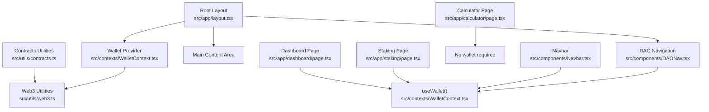
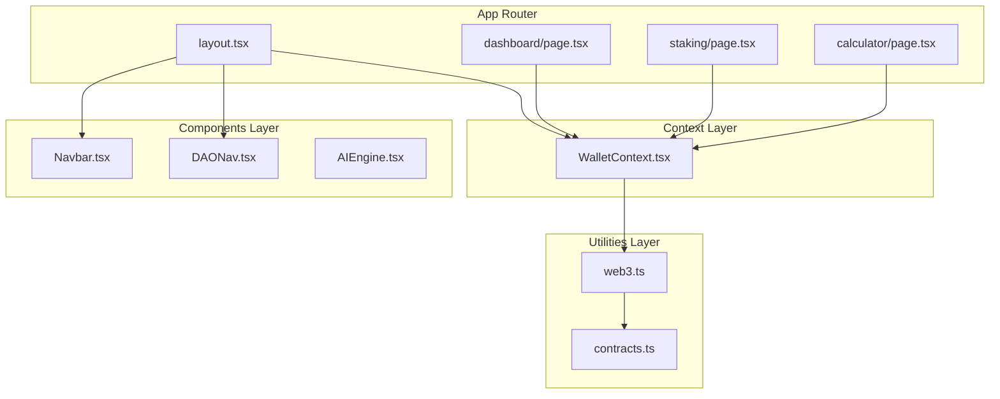
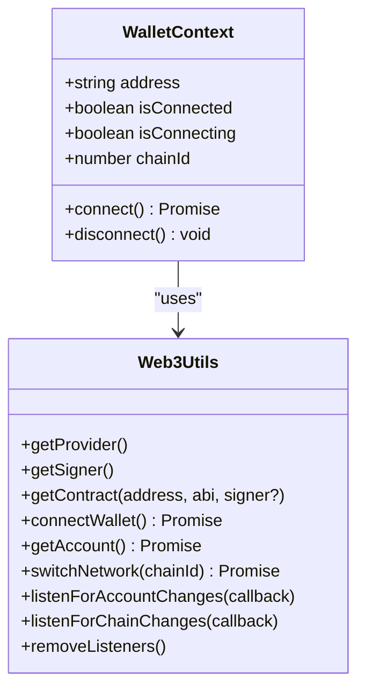
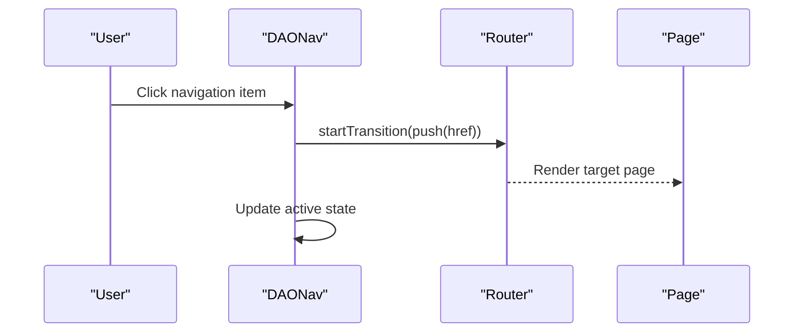
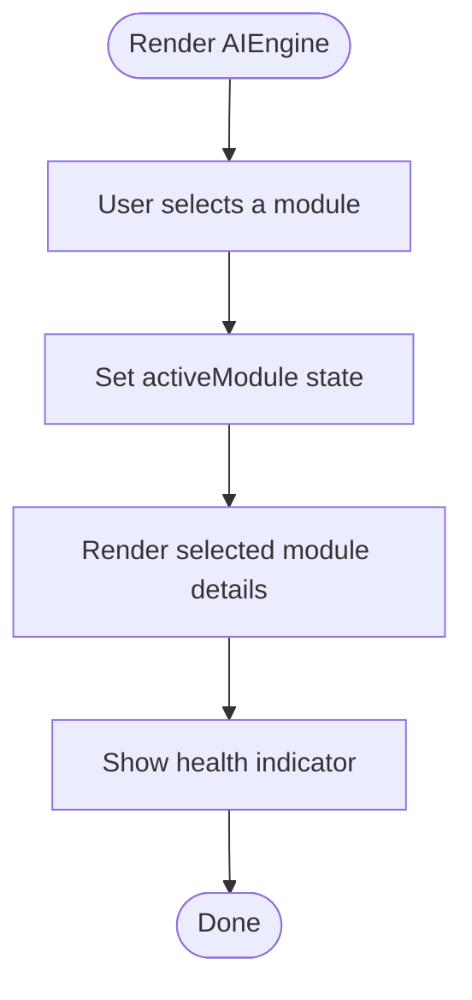
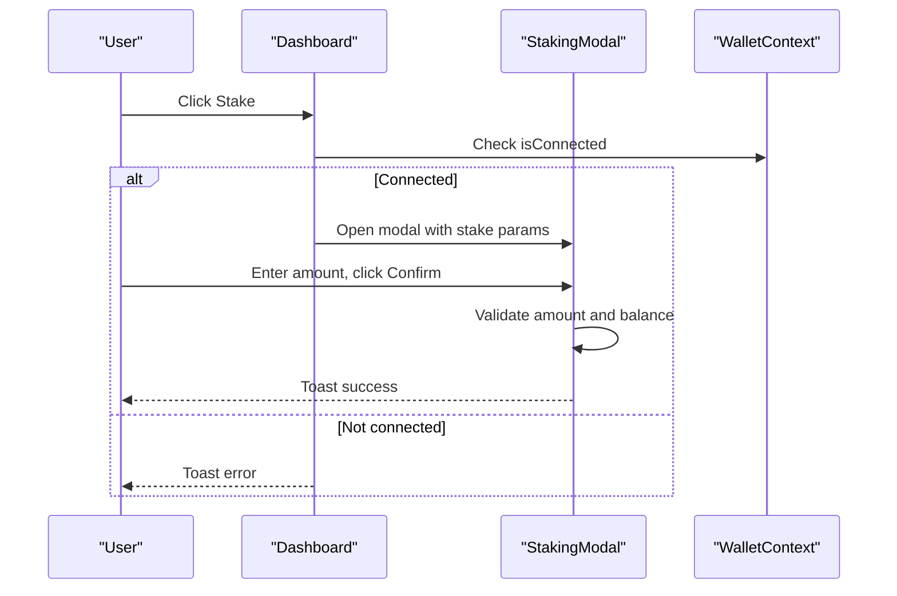
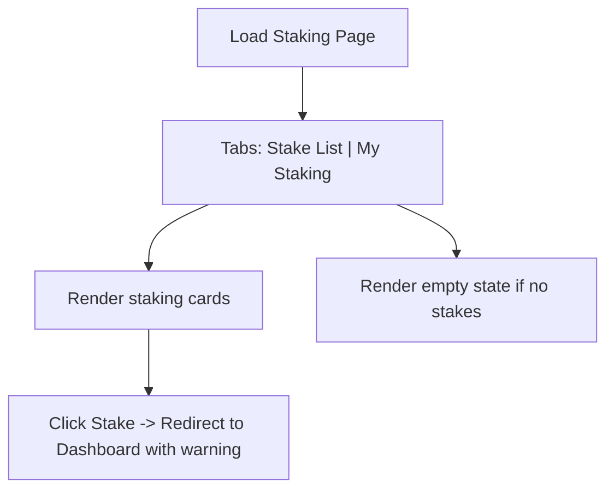
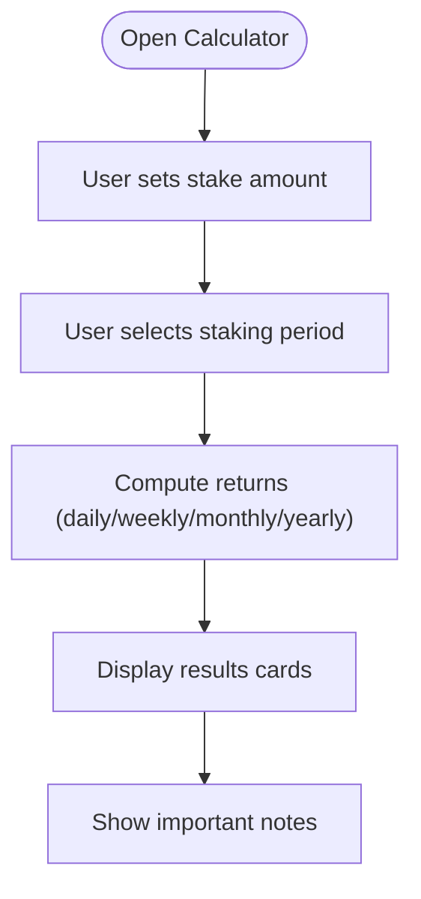
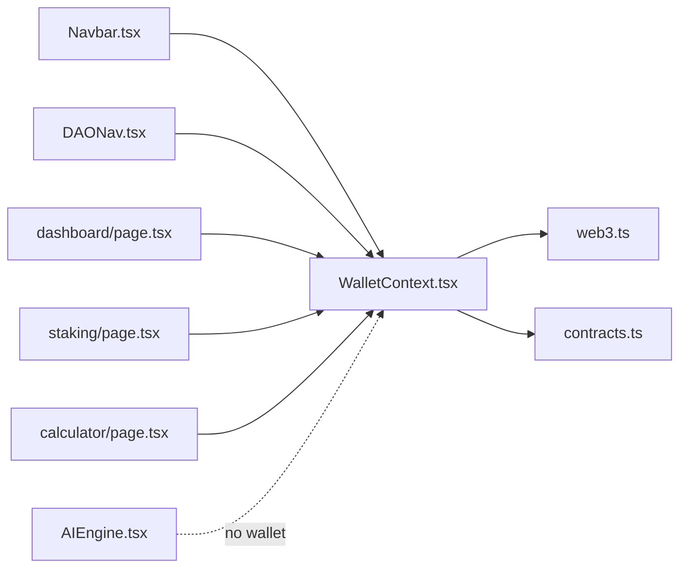

# Frontend Application Architecture

<cite>
**Referenced Files in This Document**
- [layout.tsx](file://neurafinance/frontend/src/app/layout.tsx)
- [WalletContext.tsx](file://neurafinance/frontend/src/contexts/WalletContext.tsx)
- [web3.ts](file://neurafinance/frontend/src/utils/web3.ts)
- [contracts.ts](file://neurafinance/frontend/src/utils/contracts.ts)
- [Navbar.tsx](file://neurafinance/frontend/src/components/Navbar.tsx)
- [DAONav.tsx](file://neurafinance/frontend/src/components/DAONav.tsx)
- [AIEngine.tsx](file://neurafinance/frontend/src/components/AIEngine.tsx)
- [page.tsx](file://neurafinance/frontend/src/app/dashboard/page.tsx)
- [page.tsx](file://neurafinance/frontend/src/app/staking/page.tsx)
- [page.tsx](file://neurafinance/frontend/src/app/calculator/page.tsx)
</cite>

## Table of Contents
1. [Introduction](#introduction)
2. [Project Structure](#project-structure)
3. [Core Components](#core-components)
4. [Architecture Overview](#architecture-overview)
5. [Detailed Component Analysis](#detailed-component-analysis)
6. [Dependency Analysis](#dependency-analysis)
7. [Performance Considerations](#performance-considerations)
8. [Troubleshooting Guide](#troubleshooting-guide)
9. [Conclusion](#conclusion)
10. [Appendices](#appendices)

## Introduction
This document describes the frontend application architecture for the Next.js React implementation of the NeuraFinance platform. It focuses on the app router structure, component hierarchy, state management patterns using React Context, wallet integration, real-time UI patterns, and user interface design. It also documents key pages including dashboard, staking, calculator, and navigation components such as Navbar and DAONav. The content is intended for both frontend developers and UI/UX specialists, using terminology consistent with the codebase such as WalletContext, AIEngine components, Navbar, and DAONav.

## Project Structure
The frontend is organized under the Next.js App Router convention, with pages located under src/app and shared components, contexts, and utilities under src/components, src/contexts, and src/utils respectively. The root layout composes providers and global navigation, while DAO-specific pages use a dedicated DAO layout that renders DAONav.

**Diagram sources**
- [layout.tsx:16-35](file://neurafinance/frontend/src/app/layout.tsx#L16-L35)
- [WalletContext.tsx:17-92](file://neurafinance/frontend/src/contexts/WalletContext.tsx#L17-L92)
- [web3.ts:1-118](file://neurafinance/frontend/src/utils/web3.ts#L1-L118)
- [contracts.ts:1-148](file://neurafinance/frontend/src/utils/contracts.ts#L1-L148)
- [Navbar.tsx:16-118](file://neurafinance/frontend/src/components/Navbar.tsx#L16-L118)
- [DAONav.tsx:33-138](file://neurafinance/frontend/src/components/DAONav.tsx#L33-L138)
- [page.tsx:267-555](file://neurafinance/frontend/src/app/dashboard/page.tsx#L267-L555)
- [page.tsx:18-107](file://neurafinance/frontend/src/app/staking/page.tsx#L18-L107)
- [page.tsx:14-154](file://neurafinance/frontend/src/app/calculator/page.tsx#L14-L154)

**Section sources**
- [layout.tsx:16-35](file://neurafinance/frontend/src/app/layout.tsx#L16-L35)
- [WalletContext.tsx:17-92](file://neurafinance/frontend/src/contexts/WalletContext.tsx#L17-L92)
- [web3.ts:1-118](file://neurafinance/frontend/src/utils/web3.ts#L1-L118)
- [contracts.ts:1-148](file://neurafinance/frontend/src/utils/contracts.ts#L1-L148)
- [Navbar.tsx:16-118](file://neurafinance/frontend/src/components/Navbar.tsx#L16-L118)
- [DAONav.tsx:33-138](file://neurafinance/frontend/src/components/DAONav.tsx#L33-L138)
- [page.tsx:267-555](file://neurafinance/frontend/src/app/dashboard/page.tsx#L267-L555)
- [page.tsx:18-107](file://neurafinance/frontend/src/app/staking/page.tsx#L18-L107)
- [page.tsx:14-154](file://neurafinance/frontend/src/app/calculator/page.tsx#L14-L154)

## Core Components
- WalletContext: Provides wallet state and connection lifecycle to the app via a React Context provider. It exposes address, connection status, chainId, connect/disconnect actions, and listens for MetaMask account and chain changes.
- Navbar: Displays global links and a connect button, showing formatted wallet address when connected.
- DAONav: Provides DAO-focused navigation with route transitions, highlighting the active route and connecting wallets when needed.
- AIEngine: A feature showcase component displaying AI modules with interactive selection and health indicators.
- Dashboard, Staking, Calculator: Page-level components implementing domain logic, local state, and UI composition.

Key patterns:
- Provider composition in the root layout wraps the app with WalletProvider and global navigation.
- useWallet hook is consumed across components to access wallet state and trigger connection.
- Utility modules encapsulate contract ABIs and web3 interactions for wallet and chain operations.

**Section sources**
- [WalletContext.tsx:6-101](file://neurafinance/frontend/src/contexts/WalletContext.tsx#L6-L101)
- [Navbar.tsx:16-118](file://neurafinance/frontend/src/components/Navbar.tsx#L16-L118)
- [DAONav.tsx:33-138](file://neurafinance/frontend/src/components/DAONav.tsx#L33-L138)
- [AIEngine.tsx:39-122](file://neurafinance/frontend/src/components/AIEngine.tsx#L39-L122)
- [page.tsx:267-555](file://neurafinance/frontend/src/app/dashboard/page.tsx#L267-L555)
- [page.tsx:18-107](file://neurafinance/frontend/src/app/staking/page.tsx#L18-L107)
- [page.tsx:14-154](file://neurafinance/frontend/src/app/calculator/page.tsx#L14-L154)

## Architecture Overview
The frontend follows a layered architecture:
- App Router: Pages under src/app define routes and layouts. The root layout composes providers and global navigation.
- Context Layer: WalletContext centralizes wallet state and lifecycle, enabling cross-component access.
- Components Layer: Shared UI components (Navbar, DAONav, AIEngine) and page components implement domain logic.
- Utilities Layer: web3.ts handles wallet/provider interactions; contracts.ts defines ABIs and constants.

**Diagram sources**
- [layout.tsx:16-35](file://neurafinance/frontend/src/app/layout.tsx#L16-L35)
- [WalletContext.tsx:17-92](file://neurafinance/frontend/src/contexts/WalletContext.tsx#L17-L92)
- [web3.ts:1-118](file://neurafinance/frontend/src/utils/web3.ts#L1-L118)
- [contracts.ts:1-148](file://neurafinance/frontend/src/utils/contracts.ts#L1-L148)
- [Navbar.tsx:16-118](file://neurafinance/frontend/src/components/Navbar.tsx#L16-L118)
- [DAONav.tsx:33-138](file://neurafinance/frontend/src/components/DAONav.tsx#L33-L138)
- [page.tsx:267-555](file://neurafinance/frontend/src/app/dashboard/page.tsx#L267-L555)
- [page.tsx:18-107](file://neurafinance/frontend/src/app/staking/page.tsx#L18-L107)
- [page.tsx:14-154](file://neurafinance/frontend/src/app/calculator/page.tsx#L14-L154)

## Detailed Component Analysis

### WalletContext and Wallet Integration
WalletContext manages wallet state and lifecycle:
- Initializes connection asynchronously to avoid blocking render.
- Subscribes to MetaMask events for account and chain changes.
- Exposes connect/disconnect actions and derived connection state.
- Provides chainId for network-aware UI.

**Diagram sources**
- [WalletContext.tsx:6-101](file://neurafinance/frontend/src/contexts/WalletContext.tsx#L6-L101)
- [web3.ts:1-118](file://neurafinance/frontend/src/utils/web3.ts#L1-L118)

**Section sources**
- [WalletContext.tsx:17-92](file://neurafinance/frontend/src/contexts/WalletContext.tsx#L17-L92)
- [web3.ts:27-91](file://neurafinance/frontend/src/utils/web3.ts#L27-L91)

### Navigation Components
- Navbar: Global navigation with desktop and mobile views, connect button, and address display.
- DAONav: DAO-focused navigation with route transitions, active highlighting, and connect button.

**Diagram sources**
- [DAONav.tsx:59-74](file://neurafinance/frontend/src/components/DAONav.tsx#L59-L74)
- [DAONav.tsx:114-121](file://neurafinance/frontend/src/components/DAONav.tsx#L114-L121)

**Section sources**
- [Navbar.tsx:16-118](file://neurafinance/frontend/src/components/Navbar.tsx#L16-L118)
- [DAONav.tsx:33-138](file://neurafinance/frontend/src/components/DAONav.tsx#L33-L138)

### AIEngine Feature Component
AIEngine presents five AI modules with an accordion-style selection and a health indicator. It demonstrates local state-driven UI composition and icon-based module rendering.

**Diagram sources**
- [AIEngine.tsx:63-118](file://neurafinance/frontend/src/components/AIEngine.tsx#L63-L118)

**Section sources**
- [AIEngine.tsx:39-122](file://neurafinance/frontend/src/components/AIEngine.tsx#L39-L122)

### Dashboard Page
The dashboard page composes multiple UI sections:
- Stats cards for market metrics and balances.
- Staking options with a modal for stake confirmation.
- Referral link generation and copy-to-clipboard.
- Progress bars for ranking metrics.
- Countdown timer integration.

**Diagram sources**
- [page.tsx:267-555](file://neurafinance/frontend/src/app/dashboard/page.tsx#L267-L555)

**Section sources**
- [page.tsx:267-555](file://neurafinance/frontend/src/app/dashboard/page.tsx#L267-L555)

### Staking Page
The staking page displays staking options with tabs for “Stake List” and “My Staking”. It integrates a countdown timer and uses the wallet context to gate actions.

**Diagram sources**
- [page.tsx:18-107](file://neurafinance/frontend/src/app/staking/page.tsx#L18-L107)

**Section sources**
- [page.tsx:18-107](file://neurafinance/frontend/src/app/staking/page.tsx#L18-L107)

### Calculator Page
The calculator page computes projected staking rewards based on user input and selected staking period. It demonstrates controlled form inputs and dynamic result rendering.

**Diagram sources**
- [page.tsx:14-154](file://neurafinance/frontend/src/app/calculator/page.tsx#L14-L154)

**Section sources**
- [page.tsx:14-154](file://neurafinance/frontend/src/app/calculator/page.tsx#L14-L154)

## Dependency Analysis
The following diagram shows how components depend on the context and utilities:

**Diagram sources**
- [WalletContext.tsx:17-92](file://neurafinance/frontend/src/contexts/WalletContext.tsx#L17-L92)
- [web3.ts:1-118](file://neurafinance/frontend/src/utils/web3.ts#L1-L118)
- [contracts.ts:1-148](file://neurafinance/frontend/src/utils/contracts.ts#L1-L148)
- [Navbar.tsx:16-118](file://neurafinance/frontend/src/components/Navbar.tsx#L16-L118)
- [DAONav.tsx:33-138](file://neurafinance/frontend/src/components/DAONav.tsx#L33-L138)
- [page.tsx:267-555](file://neurafinance/frontend/src/app/dashboard/page.tsx#L267-L555)
- [page.tsx:18-107](file://neurafinance/frontend/src/app/staking/page.tsx#L18-L107)
- [page.tsx:14-154](file://neurafinance/frontend/src/app/calculator/page.tsx#L14-L154)
- [AIEngine.tsx:39-122](file://neurafinance/frontend/src/components/AIEngine.tsx#L39-L122)

**Section sources**
- [WalletContext.tsx:17-92](file://neurafinance/frontend/src/contexts/WalletContext.tsx#L17-L92)
- [web3.ts:1-118](file://neurafinance/frontend/src/utils/web3.ts#L1-L118)
- [contracts.ts:1-148](file://neurafinance/frontend/src/utils/contracts.ts#L1-L148)
- [Navbar.tsx:16-118](file://neurafinance/frontend/src/components/Navbar.tsx#L16-L118)
- [DAONav.tsx:33-138](file://neurafinance/frontend/src/components/DAONav.tsx#L33-L138)
- [page.tsx:267-555](file://neurafinance/frontend/src/app/dashboard/page.tsx#L267-L555)
- [page.tsx:18-107](file://neurafinance/frontend/src/app/staking/page.tsx#L18-L107)
- [page.tsx:14-154](file://neurafinance/frontend/src/app/calculator/page.tsx#L14-L154)
- [AIEngine.tsx:39-122](file://neurafinance/frontend/src/components/AIEngine.tsx#L39-L122)

## Performance Considerations
- Provider initialization delay: WalletContext defers wallet checks slightly to avoid blocking initial render, improving perceived performance.
- Transition-based routing: DAONav uses Next.js transitions for smoother navigation between DAO pages.
- Local state composition: Pages manage UI state locally (e.g., modal visibility, tab selection) to minimize unnecessary re-renders.
- Memoization: WalletContext memoizes the context value to prevent re-renders when dependencies are unchanged.
- Utility separation: web3.ts isolates provider and signer creation to reduce coupling and enable easier testing.

[No sources needed since this section provides general guidance]

## Troubleshooting Guide
Common issues and remedies:
- Wallet not detected: Ensure MetaMask is installed and enabled. The app throws an error if the provider is unavailable during connection attempts.
- Account or chain change handling: WalletContext subscribes to MetaMask events; if changes are not reflected, verify listeners are attached and removed appropriately on unmount.
- Network switching: Use the provided network helpers to switch chains; handle errors when the chain is not added to MetaMask.
- Formatting utilities: Use formatAddress for short addresses and formatTokenAmount for token balances to avoid precision errors.

**Section sources**
- [web3.ts:27-91](file://neurafinance/frontend/src/utils/web3.ts#L27-L91)
- [WalletContext.tsx:32-59](file://neurafinance/frontend/src/contexts/WalletContext.tsx#L32-L59)
- [contracts.ts:144-147](file://neurafinance/frontend/src/utils/contracts.ts#L144-L147)

## Conclusion
The frontend architecture leverages Next.js App Router for structured pages, React Context for centralized wallet state, and modular components for navigation and feature showcases. The design emphasizes composability, responsiveness, and user-friendly interactions across DAO-focused pages. Integrations with web3 utilities and contract ABIs are cleanly abstracted, enabling maintainability and scalability.

[No sources needed since this section summarizes without analyzing specific files]

## Appendices

### UI Patterns and Accessibility
- Responsive design: Components adapt across breakpoints using Tailwind classes; mobile menus toggle visibility for smaller screens.
- Accessibility: Interactive elements use semantic HTML and proper focus states; icons are accompanied by descriptive labels where applicable.
- Visual feedback: Hover and active states are clearly indicated; loading and disabled states are handled for buttons and inputs.

[No sources needed since this section provides general guidance]