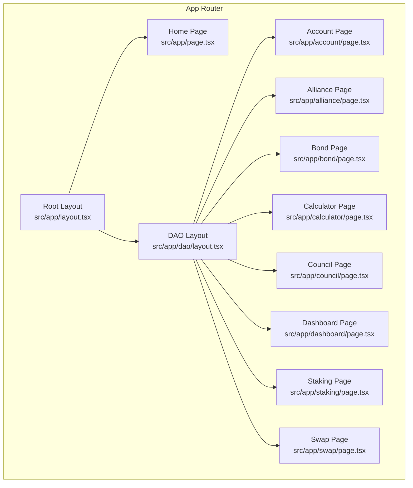
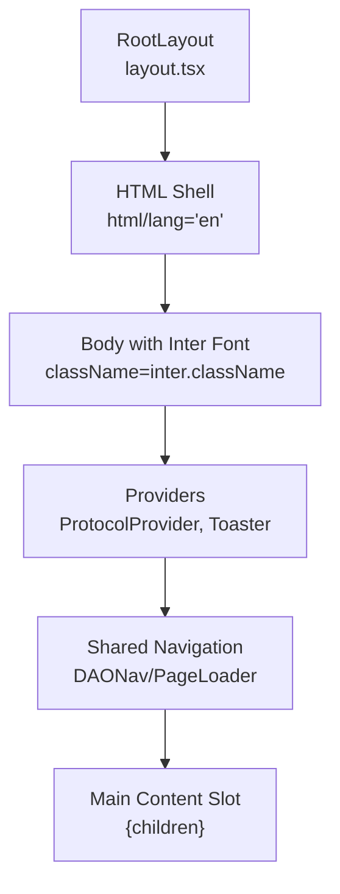
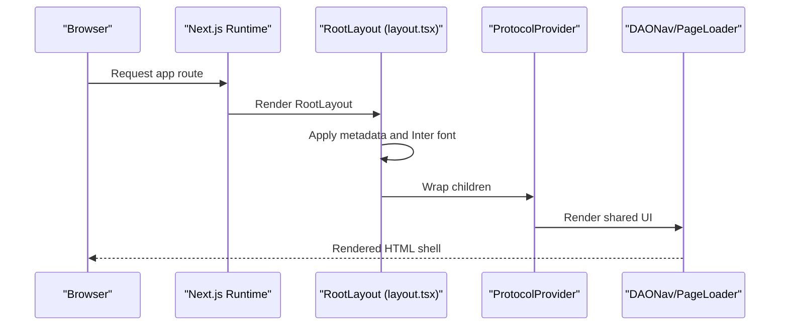
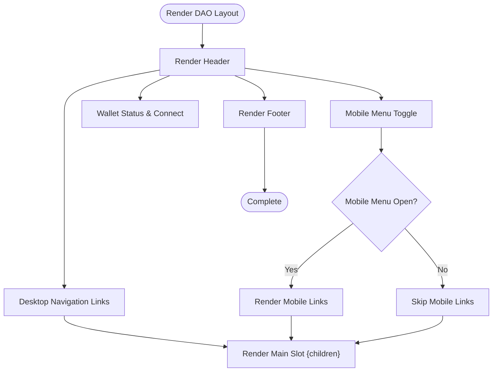
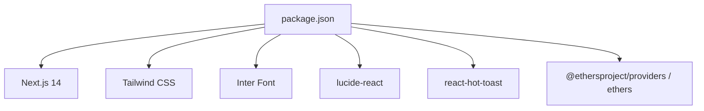

# Next.js Application Structure

<cite>
**Referenced Files in This Document**
- [layout.tsx](file://neurafinance/frontend/src/app/layout.tsx)
- [page.tsx](file://neurafinance/frontend/src/app/page.tsx)
- [globals.css](file://neurafinance/frontend/src/app/globals.css)
- [dao/layout.tsx](file://neurafinance/frontend/src/app/dao/layout.tsx)
- [account/page.tsx](file://neurafinance/frontend/src/app/account/page.tsx)
- [alliance/page.tsx](file://neurafinance/frontend/src/app/alliance/page.tsx)
- [bond/page.tsx](file://neurafinance/frontend/src/app/bond/page.tsx)
- [calculator/page.tsx](file://neurafinance/frontend/src/app/calculator/page.tsx)
- [council/page.tsx](file://neurafinance/frontend/src/app/council/page.tsx)
- [dashboard/page.tsx](file://neurafinance/frontend/src/app/dashboard/page.tsx)
- [staking/page.tsx](file://neurafinance/frontend/src/app/staking/page.tsx)
- [swap/page.tsx](file://neurafinance/frontend/src/app/swap/page.tsx)
- [next.config.js](file://neurafinance/frontend/next.config.js)
- [tailwind.config.js](file://neurafinance/frontend/tailwind.config.js)
- [package.json](file://neurafinance/frontend/package.json)
</cite>

## Table of Contents
1. [Introduction](#introduction)
2. [Project Structure](#project-structure)
3. [Core Components](#core-components)
4. [Architecture Overview](#architecture-overview)
5. [Detailed Component Analysis](#detailed-component-analysis)
6. [Dependency Analysis](#dependency-analysis)
7. [Performance Considerations](#performance-considerations)
8. [Troubleshooting Guide](#troubleshooting-guide)
9. [Conclusion](#conclusion)
10. [Appendices](#appendices)

## Introduction
This document explains the Next.js application structure using the app router and project organization. It focuses on file-based routing, layout hierarchy, metadata configuration, and the root layout setup including HTML structure, font loading via Inter, and global styling. It also covers the app directory pattern, page component organization, and practical examples for route configuration, layout composition, and performance optimization techniques. Build configuration, asset optimization, and deployment considerations are included for both SSR/SSG and production readiness.

## Project Structure
The frontend is organized under the Next.js app directory with a clear separation between shared layouts and page-level components. The root layout defines the global HTML shell, metadata, fonts, and global styles. Feature-specific pages reside under dedicated folders, and a DAO-focused nested layout composes navigation and shared UI for authenticated or DAO-related views.

**Diagram sources**
- [layout.tsx:16-35](file://neurafinance/frontend/src/app/layout.tsx#L16-L35)
- [page.tsx:12-25](file://neurafinance/frontend/src/app/page.tsx#L12-L25)
- [dao/layout.tsx:33-146](file://neurafinance/frontend/src/app/dao/layout.tsx#L33-L146)
- [account/page.tsx:8-151](file://neurafinance/frontend/src/app/account/page.tsx#L8-L151)
- [alliance/page.tsx:33-185](file://neurafinance/frontend/src/app/alliance/page.tsx#L33-L185)
- [bond/page.tsx:16-115](file://neurafinance/frontend/src/app/bond/page.tsx#L16-L115)
- [calculator/page.tsx:7-86](file://neurafinance/frontend/src/app/calculator/page.tsx#L7-L86)
- [council/page.tsx:40-151](file://neurafinance/frontend/src/app/council/page.tsx#L40-L151)
- [dashboard/page.tsx:267-555](file://neurafinance/frontend/src/app/dashboard/page.tsx#L267-L555)
- [staking/page.tsx:18-107](file://neurafinance/frontend/src/app/staking/page.tsx#L18-L107)
- [swap/page.tsx:10-157](file://neurafinance/frontend/src/app/swap/page.tsx#L10-L157)

**Section sources**
- [layout.tsx:1-36](file://neurafinance/frontend/src/app/layout.tsx#L1-L36)
- [page.tsx:1-26](file://neurafinance/frontend/src/app/page.tsx#L1-L26)
- [dao/layout.tsx:1-147](file://neurafinance/frontend/src/app/dao/layout.tsx#L1-L147)

## Core Components
- RootLayout: Defines the HTML structure, metadata, Inter font loading, global CSS, providers, and shared UI elements such as navigation and notifications.
- Global Styles: Tailwind-based design system with custom CSS layers and animations.
- DAO Layout: A feature-specific layout that wraps DAO-related pages with a persistent header, navigation, and footer.
- Page Components: Feature pages under the app directory, each exporting a default component that renders the page content.

Key implementation highlights:
- Root layout exports metadata and a RootLayout function receiving children.
- Inter font is configured via next/font/google and applied to the body element.
- Global CSS integrates Tailwind layers and custom utilities for theming and animations.
- DAO layout manages responsive navigation and wallet-aware UI.

**Section sources**
- [layout.tsx:11-35](file://neurafinance/frontend/src/app/layout.tsx#L11-L35)
- [globals.css:1-396](file://neurafinance/frontend/src/app/globals.css#L1-L396)
- [dao/layout.tsx:33-146](file://neurafinance/frontend/src/app/dao/layout.tsx#L33-L146)

## Architecture Overview
The app router organizes routes by filesystem. The root layout composes the global shell, while nested layouts (e.g., DAO layout) wrap feature pages. Pages render content and integrate UI components and context providers.

**Diagram sources**
- [layout.tsx:16-35](file://neurafinance/frontend/src/app/layout.tsx#L16-L35)

## Detailed Component Analysis

### Root Layout and Metadata
- Metadata: Title and description are defined at the root level.
- Inter Font: Loaded via next/font/google and applied to the body element.
- Providers: Protocol provider and toast notifications are initialized at the root.
- Shared UI: Page loader and navigation are rendered inside the root layout.

**Diagram sources**
- [layout.tsx:11-35](file://neurafinance/frontend/src/app/layout.tsx#L11-L35)

**Section sources**
- [layout.tsx:11-35](file://neurafinance/frontend/src/app/layout.tsx#L11-L35)

### DAO Layout Composition
- Navigation: Fixed header with desktop and mobile menus, highlighting the current route.
- Wallet Integration: Uses wallet context to show connection status and formatted address.
- Responsive Design: Mobile menu toggles and adaptive layouts.
- Footer: Persistent footer with social links.

**Diagram sources**
- [dao/layout.tsx:33-146](file://neurafinance/frontend/src/app/dao/layout.tsx#L33-L146)

**Section sources**
- [dao/layout.tsx:22-146](file://neurafinance/frontend/src/app/dao/layout.tsx#L22-L146)

### Page Component Organization
- Home Page: Renders hero, features, and other marketing sections.
- DAO Feature Pages: Account, Alliance, Bond, Calculator, Council, Dashboard, Staking, Swap.
- Each page is a client component and composes reusable UI components.

Examples of page-level organization:
- Home page component definition and rendering.
- DAO feature pages with consistent layout and wallet-aware actions.

**Section sources**
- [page.tsx:12-25](file://neurafinance/frontend/src/app/page.tsx#L12-L25)
- [account/page.tsx:8-151](file://neurafinance/frontend/src/app/account/page.tsx#L8-L151)
- [alliance/page.tsx:33-185](file://neurafinance/frontend/src/app/alliance/page.tsx#L33-L185)
- [bond/page.tsx:16-115](file://neurafinance/frontend/src/app/bond/page.tsx#L16-L115)
- [calculator/page.tsx:7-86](file://neurafinance/frontend/src/app/calculator/page.tsx#L7-L86)
- [council/page.tsx:40-151](file://neurafinance/frontend/src/app/council/page.tsx#L40-L151)
- [dashboard/page.tsx:267-555](file://neurafinance/frontend/src/app/dashboard/page.tsx#L267-L555)
- [staking/page.tsx:18-107](file://neurafinance/frontend/src/app/staking/page.tsx#L18-L107)
- [swap/page.tsx:10-157](file://neurafinance/frontend/src/app/swap/page.tsx#L10-L157)

### Global Styling and Theming
- Tailwind Base/Components/Utilities layers define the design system.
- CSS custom properties and Tailwind theme extend colors, typography, animations, and backgrounds aligned with the AIP.Finance brand.
- Utilities include glassmorphism effects, gradients, and interactive states.

**Section sources**
- [globals.css:1-396](file://neurafinance/frontend/src/app/globals.css#L1-L396)
- [tailwind.config.js:17-122](file://neurafinance/frontend/tailwind.config.js#L17-L122)

## Dependency Analysis
The project relies on Next.js 14, Tailwind CSS, Inter font, and UI libraries. The build configuration enables SWC minification, optimized imports, standalone output, and environment variables.

**Diagram sources**
- [package.json:11-29](file://neurafinance/frontend/package.json#L11-L29)

**Section sources**
- [package.json:1-40](file://neurafinance/frontend/package.json#L1-L40)

## Performance Considerations
- Build Optimizations: SWC minification, optimized package imports, and standalone output reduce bundle size and improve startup performance.
- Console Removal: Removes console statements in production builds.
- Image Domains: Configured for localhost image serving.
- Font Optimization: Inter font is self-hosted via next/font/google and applied at the root body level.
- Asset Optimization: Tailwind purges unused CSS; animations and utilities are scoped to components.

Practical tips:
- Keep client components minimal and lazy-load heavy features.
- Use static generation where possible and leverage incremental static regeneration for dynamic content.
- Monitor bundle size and split large client components.

**Section sources**
- [next.config.js:1-25](file://neurafinance/frontend/next.config.js#L1-L25)

## Troubleshooting Guide
Common areas to check:
- Metadata: Ensure metadata is exported correctly in the root layout.
- Fonts: Verify Inter font is loaded and applied to the body element.
- Global Styles: Confirm Tailwind layers and custom utilities are imported.
- Wallet Context: Validate wallet connection state and UI updates in DAO layout and pages.
- Environment Variables: Ensure NEXT_PUBLIC_* variables are present for runtime usage.

**Section sources**
- [layout.tsx:11-35](file://neurafinance/frontend/src/app/layout.tsx#L11-L35)
- [dao/layout.tsx:33-146](file://neurafinance/frontend/src/app/dao/layout.tsx#L33-L146)
- [next.config.js:18-21](file://neurafinance/frontend/next.config.js#L18-L21)

## Conclusion
The Next.js application follows a clean app router structure with a root layout defining metadata, fonts, and global styles, and a DAO layout composing feature pages with shared navigation and wallet-aware UI. The build configuration emphasizes performance and production readiness, while Tailwind and custom CSS provide a cohesive design system. Pages are organized by feature, enabling scalable development and maintainability.

## Appendices

### Route Configuration Examples
- Root route: Home page at the root of the app directory.
- Nested routes: Feature pages under dedicated folders (e.g., /dashboard, /staking, /swap).
- DAO routes: Pages under the DAO layout folder inherit the shared header and navigation.

**Section sources**
- [page.tsx:12-25](file://neurafinance/frontend/src/app/page.tsx#L12-L25)
- [dashboard/page.tsx:267-555](file://neurafinance/frontend/src/app/dashboard/page.tsx#L267-L555)
- [staking/page.tsx:18-107](file://neurafinance/frontend/src/app/staking/page.tsx#L18-L107)
- [swap/page.tsx:10-157](file://neurafinance/frontend/src/app/swap/page.tsx#L10-L157)

### Layout Composition Patterns
- Root layout: Provides HTML shell, metadata, Inter font, and global providers.
- DAO layout: Adds persistent header, navigation, and footer for DAO-related pages.
- Page components: Render feature-specific content and integrate UI components.

**Section sources**
- [layout.tsx:11-35](file://neurafinance/frontend/src/app/layout.tsx#L11-L35)
- [dao/layout.tsx:33-146](file://neurafinance/frontend/src/app/dao/layout.tsx#L33-L146)

### Performance Optimization Techniques
- Enable SWC minification and standalone output.
- Optimize imports for UI libraries and crypto/web3 packages.
- Remove console logs in production.
- Use Tailwind purging and scoped utilities.

**Section sources**
- [next.config.js:8-17](file://neurafinance/frontend/next.config.js#L8-L17)