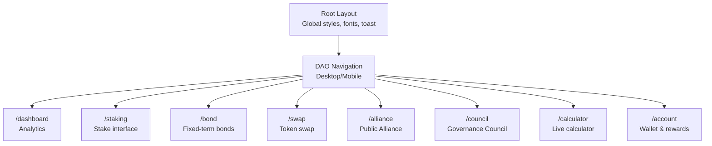
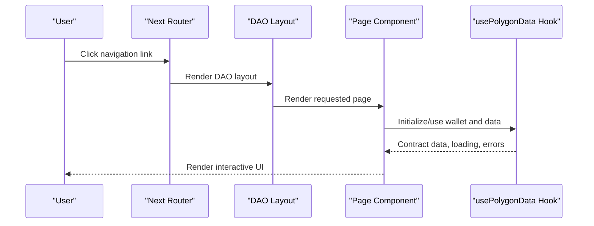
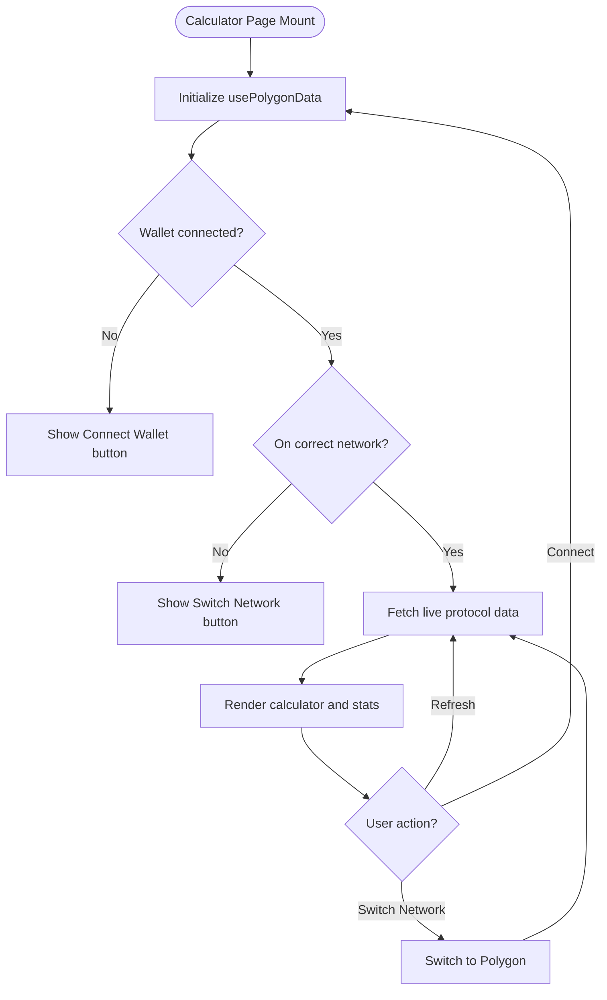
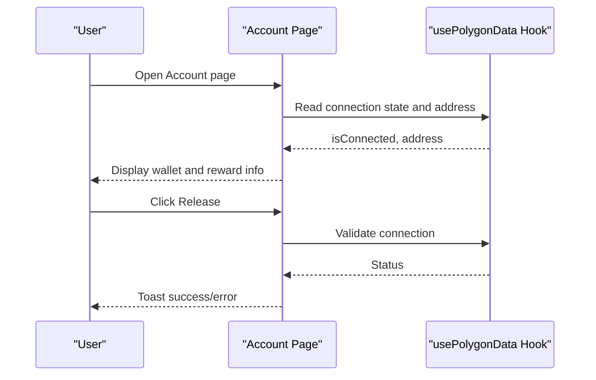
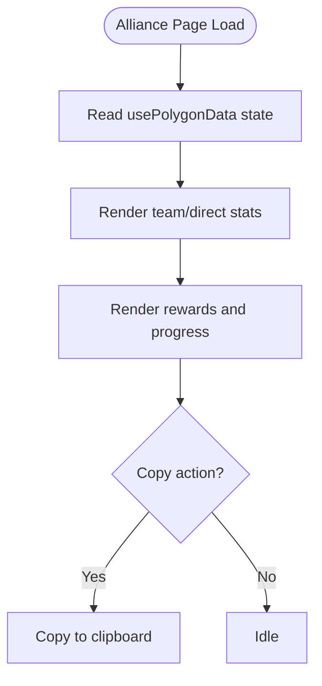
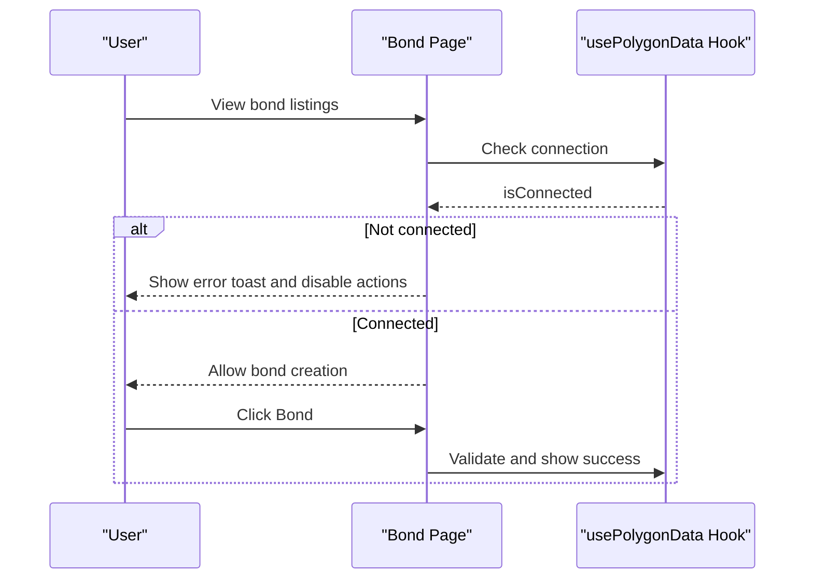
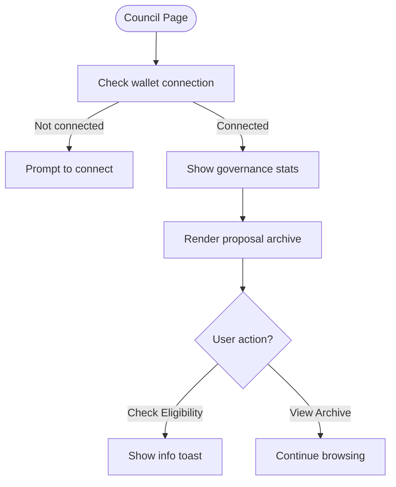
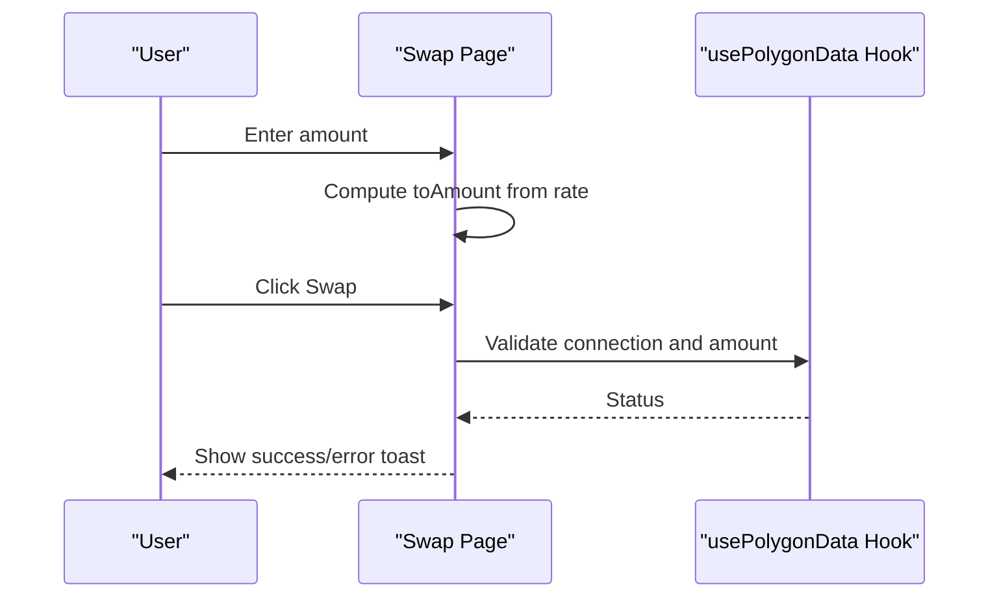
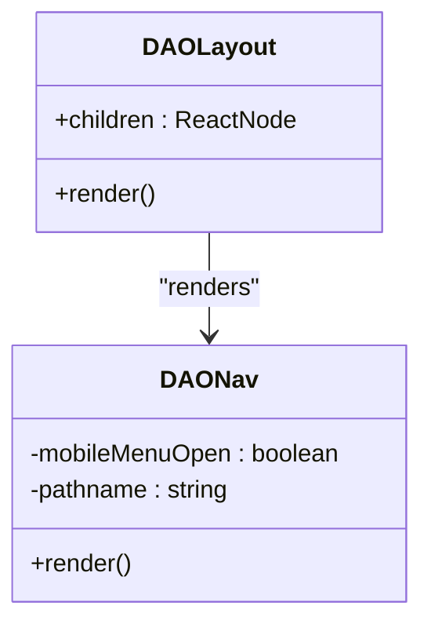
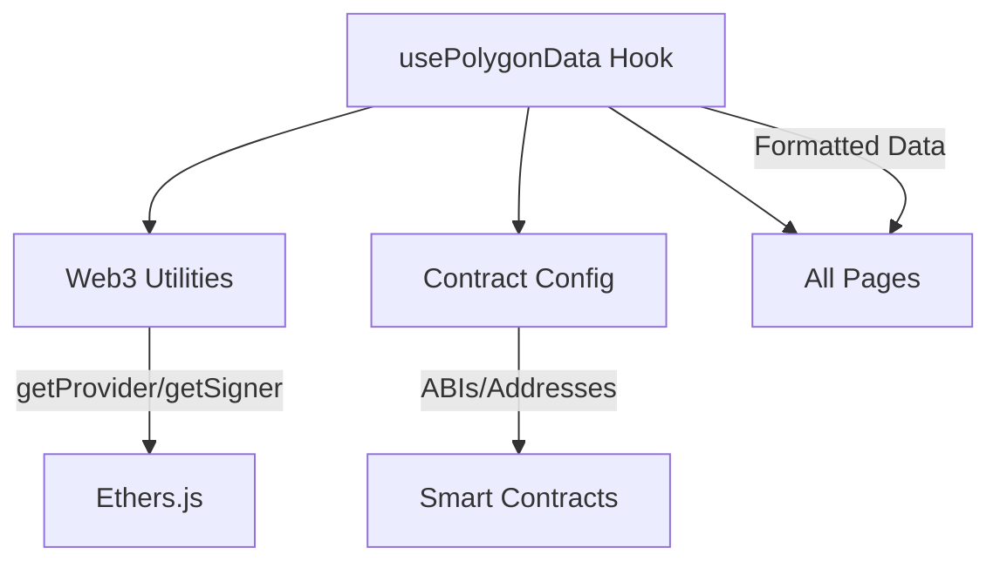

# Pages and Routing System

<cite>
**Referenced Files in This Document**
- [layout.tsx](file://neurafinance/frontend/src/app/layout.tsx)
- [dao/layout.tsx](file://neurafinance/frontend/src/app/dao/layout.tsx)
- [calculator/page.tsx](file://neurafinance/frontend/src/app/calculator/page.tsx)
- [account/page.tsx](file://neurafinance/frontend/src/app/account/page.tsx)
- [alliance/page.tsx](file://neurafinance/frontend/src/app/alliance/page.tsx)
- [bond/page.tsx](file://neurafinance/frontend/src/app/bond/page.tsx)
- [council/page.tsx](file://neurafinance/frontend/src/app/council/page.tsx)
- [swap/page.tsx](file://neurafinance/frontend/src/app/swap/page.tsx)
- [DAONav.tsx](file://neurafinance/frontend/src/components/DAONav.tsx)
- [usePolygonData.ts](file://neurafinance/frontend/src/hooks/usePolygonData.ts)
- [web3.ts](file://neurafinance/frontend/src/utils/web3.ts)
- [contracts.ts](file://neurafinance/frontend/src/utils/contracts.ts)
</cite>

## Table of Contents
1. [Introduction](#introduction)
2. [Project Structure](#project-structure)
3. [Core Components](#core-components)
4. [Architecture Overview](#architecture-overview)
5. [Detailed Component Analysis](#detailed-component-analysis)
6. [Dependency Analysis](#dependency-analysis)
7. [Performance Considerations](#performance-considerations)
8. [Troubleshooting Guide](#troubleshooting-guide)
9. [Conclusion](#conclusion)

## Introduction
This document explains the Next.js app router-based pages and routing system for the frontend. It focuses on the page-based routing structure, layout composition, navigation patterns, and user interaction flows across key pages: dashboard analytics, staking interface, lending system, DAO portal, and calculator functionality. It also documents the DAO layout structure, page-specific data fetching patterns, and practical examples for routing, data loading strategies, and user experience. Finally, it covers SEO optimization, performance monitoring, and error handling for page-level functionality.

## Project Structure
The frontend follows Next.js App Router conventions with a strict file-system-based routing model. Each route corresponds to a folder under the app directory, with a page.tsx file rendering the UI and optional layout.tsx files composing shared layouts.

Key routes and their responsibilities:
- Root layout: Provides global styles, fonts, and a top-level navigation bar.
- DAO layout: Provides a persistent header, navigation, and footer for DAO-related pages.
- Calculator page: Live financial calculator with lazy loading and real-time data.
- Account page: Wallet connection, balances, and reward actions.
- Alliance page: Team stats, referral metrics, and guild expansion rewards.
- Bond page: Fixed-term bond options with countdown timer and tabbed views.
- Council page: Governance stats, eligibility checks, and proposal archive.
- Swap page: Token exchange interface with live rate calculation.

**Diagram sources**
- [layout.tsx:1-40](file://neurafinance/frontend/src/app/layout.tsx#L1-L40)
- [dao/layout.tsx:33-146](file://neurafinance/frontend/src/app/dao/layout.tsx#L33-L146)

**Section sources**
- [layout.tsx:1-40](file://neurafinance/frontend/src/app/layout.tsx#L1-L40)
- [dao/layout.tsx:1-147](file://neurafinance/frontend/src/app/dao/layout.tsx#L1-L147)

## Core Components
- Root layout: Sets global metadata, font loading strategy, and top-level navigation. It also renders a global notification system and applies a consistent typography stack.
- DAO layout: Provides a fixed header with logo, desktop navigation, mobile menu, wallet connection status, and a persistent footer. It integrates with wallet hooks to reflect connection state and supports programmatic navigation via transitions.
- DAO navigation component: A reusable, memoized navigation bar that mirrors the DAO layout’s navigation items and handles client-side transitions with prefetching and loading states.

These components establish a consistent look-and-feel and navigation experience across DAO-focused pages while allowing each page to render its own content.

**Section sources**
- [layout.tsx:18-40](file://neurafinance/frontend/src/app/layout.tsx#L18-L40)
- [dao/layout.tsx:33-146](file://neurafinance/frontend/src/app/dao/layout.tsx#L33-L146)
- [DAONav.tsx:55-163](file://neurafinance/frontend/src/components/DAONav.tsx#L55-L163)

## Architecture Overview
The routing system leverages Next.js App Router with:
- File-system routing: Each page is a standalone module under app/.
- Shared layouts: DAO layout wraps DAO-centric pages; root layout wraps the entire app.
- Client-side navigation: Uses Next’s Link and navigation hooks for seamless transitions.
- Data fetching: Centralized hook orchestrates wallet connection, network switching, and blockchain data retrieval with caching and periodic refresh.

**Diagram sources**
- [dao/layout.tsx:33-146](file://neurafinance/frontend/src/app/dao/layout.tsx#L33-L146)
- [calculator/page.tsx:19-162](file://neurafinance/frontend/src/app/calculator/page.tsx#L19-L162)
- [usePolygonData.ts:166-579](file://neurafinance/frontend/src/hooks/usePolygonData.ts#L166-L579)

## Detailed Component Analysis

### Calculator Page
The calculator page implements a live financial projection tool with:
- Lazy loading of the calculator component to reduce initial bundle size.
- Real-time data fetching via the wallet hook, including network detection and refresh controls.
- Responsive layout with a main calculator panel and a sidebar for protocol stats and “How It Works” guidance.

**Diagram sources**
- [calculator/page.tsx:19-162](file://neurafinance/frontend/src/app/calculator/page.tsx#L19-L162)
- [usePolygonData.ts:166-579](file://neurafinance/frontend/src/hooks/usePolygonData.ts#L166-L579)

**Section sources**
- [calculator/page.tsx:19-162](file://neurafinance/frontend/src/app/calculator/page.tsx#L19-L162)
- [usePolygonData.ts:166-579](file://neurafinance/frontend/src/hooks/usePolygonData.ts#L166-L579)

### Account Page
The account page provides:
- Read-only wallet address display with copy-to-clipboard functionality.
- Reward information panels for static and dynamic balances.
- Action buttons for releasing rewards and navigating to swap.

**Diagram sources**
- [account/page.tsx:8-152](file://neurafinance/frontend/src/app/account/page.tsx#L8-L152)
- [usePolygonData.ts:166-579](file://neurafinance/frontend/src/hooks/usePolygonData.ts#L166-L579)

**Section sources**
- [account/page.tsx:8-152](file://neurafinance/frontend/src/app/account/page.tsx#L8-L152)
- [usePolygonData.ts:166-579](file://neurafinance/frontend/src/hooks/usePolygonData.ts#L166-L579)

### Alliance Page
The alliance page aggregates:
- Team and direct referral statistics.
- User info with copy-to-clipboard actions.
- Rewards and progress bars for ranks and targets.

**Diagram sources**
- [alliance/page.tsx:33-186](file://neurafinance/frontend/src/app/alliance/page.tsx#L33-L186)
- [usePolygonData.ts:166-579](file://neurafinance/frontend/src/hooks/usePolygonData.ts#L166-L579)

**Section sources**
- [alliance/page.tsx:33-186](file://neurafinance/frontend/src/app/alliance/page.tsx#L33-L186)
- [usePolygonData.ts:166-579](file://neurafinance/frontend/src/hooks/usePolygonData.ts#L166-L579)

### Bond Page
The bond page presents fixed-term bond options with:
- Tabbed view for bond listings and personal bonds.
- Countdown timer and interactive “Bond” actions gated by wallet connection.
- Visual indicators for lock periods and bonuses.

**Diagram sources**
- [bond/page.tsx:16-116](file://neurafinance/frontend/src/app/bond/page.tsx#L16-L116)
- [usePolygonData.ts:166-579](file://neurafinance/frontend/src/hooks/usePolygonData.ts#L166-L579)

**Section sources**
- [bond/page.tsx:16-116](file://neurafinance/frontend/src/app/bond/page.tsx#L16-L116)
- [usePolygonData.ts:166-579](file://neurafinance/frontend/src/hooks/usePolygonData.ts#L166-L579)

### Council Page
The council page displays governance information:
- Governance weight and consensus power.
- Proposal archive with vote distribution visuals.
- Eligibility checks and informational prompts.

**Diagram sources**
- [council/page.tsx:40-152](file://neurafinance/frontend/src/app/council/page.tsx#L40-L152)
- [usePolygonData.ts:166-579](file://neurafinance/frontend/src/hooks/usePolygonData.ts#L166-L579)

**Section sources**
- [council/page.tsx:40-152](file://neurafinance/frontend/src/app/council/page.tsx#L40-L152)
- [usePolygonData.ts:166-579](file://neurafinance/frontend/src/hooks/usePolygonData.ts#L166-L579)

### Swap Page
The swap page enables token exchange:
- Live rate calculation between USDT and NEURON.
- Token selection and amount conversion.
- Swap action gated by wallet connection and valid input.

**Diagram sources**
- [swap/page.tsx:10-158](file://neurafinance/frontend/src/app/swap/page.tsx#L10-L158)
- [usePolygonData.ts:166-579](file://neurafinance/frontend/src/hooks/usePolygonData.ts#L166-L579)

**Section sources**
- [swap/page.tsx:10-158](file://neurafinance/frontend/src/app/swap/page.tsx#L10-L158)
- [usePolygonData.ts:166-579](file://neurafinance/frontend/src/hooks/usePolygonData.ts#L166-L579)

### DAO Layout and Navigation
The DAO layout and navigation component provide:
- Persistent header with logo, navigation links, and wallet status.
- Mobile-responsive menu with animated icons.
- Client-side transitions with loading states and prefetching.

**Diagram sources**
- [dao/layout.tsx:33-146](file://neurafinance/frontend/src/app/dao/layout.tsx#L33-L146)
- [DAONav.tsx:55-163](file://neurafinance/frontend/src/components/DAONav.tsx#L55-L163)

**Section sources**
- [dao/layout.tsx:33-146](file://neurafinance/frontend/src/app/dao/layout.tsx#L33-L146)
- [DAONav.tsx:55-163](file://neurafinance/frontend/src/components/DAONav.tsx#L55-L163)

## Dependency Analysis
The pages depend on a centralized hook for blockchain data and wallet interactions. The hook encapsulates:
- Provider and signer initialization.
- Contract instantiation and batched reads.
- Formatted data and memoization for performance.
- Auto-refresh intervals and event listeners for wallet/network changes.

**Diagram sources**
- [usePolygonData.ts:166-579](file://neurafinance/frontend/src/hooks/usePolygonData.ts#L166-L579)
- [web3.ts:1-118](file://neurafinance/frontend/src/utils/web3.ts#L1-L118)
- [contracts.ts:1-148](file://neurafinance/frontend/src/utils/contracts.ts#L1-L148)

**Section sources**
- [usePolygonData.ts:166-579](file://neurafinance/frontend/src/hooks/usePolygonData.ts#L166-L579)
- [web3.ts:1-118](file://neurafinance/frontend/src/utils/web3.ts#L1-L118)
- [contracts.ts:1-148](file://neurafinance/frontend/src/utils/contracts.ts#L1-L148)

## Performance Considerations
- Lazy loading: The calculator page lazily loads its heavy component to defer computation until needed.
- Suspense boundaries: Used around heavy components to progressively enhance the user experience.
- Memoization: The navigation component uses memoization to avoid unnecessary re-renders.
- Client-side transitions: Prefetching and transitions improve perceived performance during navigation.
- Data refresh cadence: Periodic refreshes balance freshness with resource usage; consider throttling for low-activity pages.
- Font loading: Subsets and swap display optimize initial rendering.

[No sources needed since this section provides general guidance]

## Troubleshooting Guide
Common issues and remedies:
- Wallet connection failures: The hook surfaces connection errors and network switching failures; display user-friendly messages and retry mechanisms.
- Wrong network: Detect non-Polygon networks and prompt users to switch; provide a one-click switch action.
- Data fetch errors: Batched reads with fallbacks prevent single failures from blocking the UI; surface errors and allow manual refresh.
- Auto-refresh conflicts: On chain changes, the app reloads to reset providers; ensure users are aware of this behavior.

**Section sources**
- [usePolygonData.ts:387-433](file://neurafinance/frontend/src/hooks/usePolygonData.ts#L387-L433)
- [usePolygonData.ts:460-480](file://neurafinance/frontend/src/hooks/usePolygonData.ts#L460-L480)
- [calculator/page.tsx:82-87](file://neurafinance/frontend/src/app/calculator/page.tsx#L82-L87)

## Conclusion
The pages and routing system leverage Next.js App Router to deliver a cohesive, responsive, and performant user experience. Shared layouts unify navigation and branding, while individual pages focus on domain-specific interactions. The centralized data hook ensures consistent, efficient access to blockchain state, enabling real-time calculators, governance dashboards, and trading interfaces. By combining lazy loading, memoization, and robust error handling, the system scales to complex DeFi workflows while maintaining usability and performance.