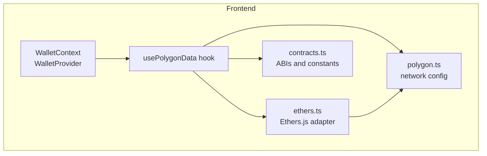
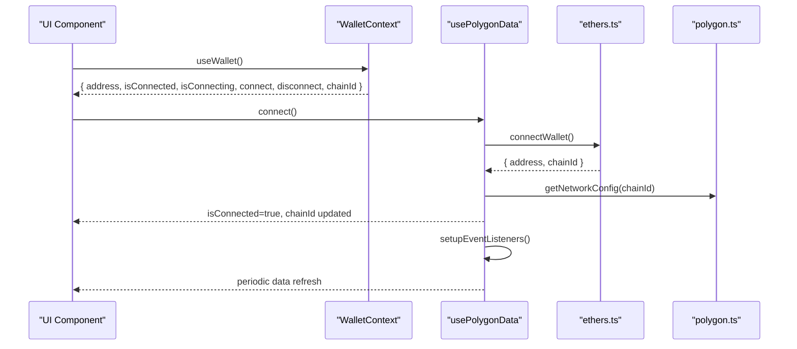
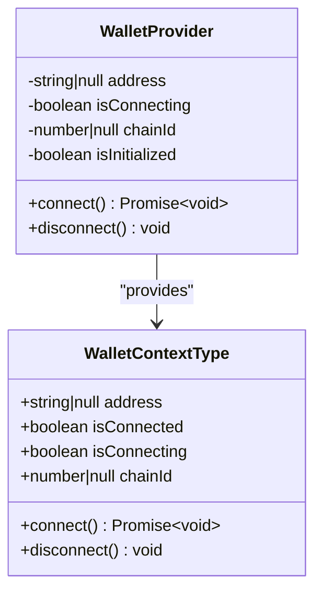
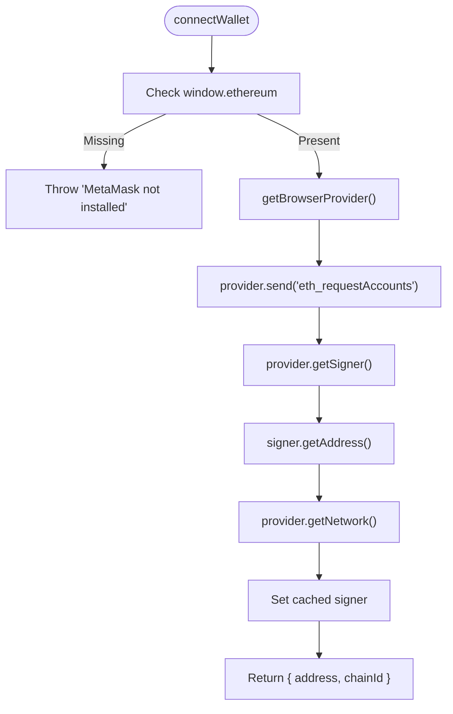
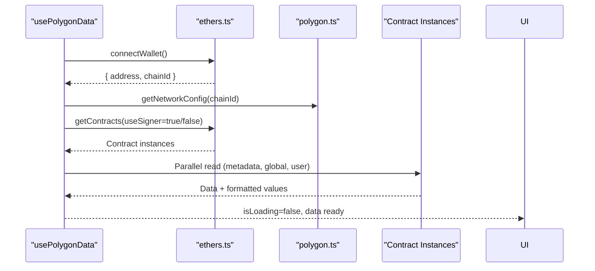
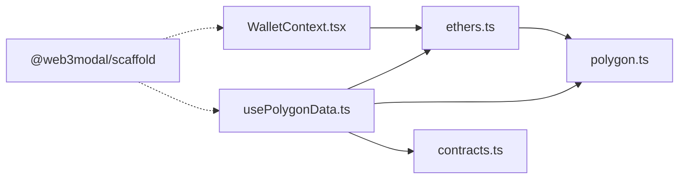

# Wallet Integration System

<cite>
**Referenced Files in This Document**
- [WalletContext.tsx](file://neurafinance/frontend/src/contexts/WalletContext.tsx)
- [ethers.ts](file://neurafinance/frontend/src/lib/ethers.ts)
- [polygon.ts](file://neurafinance/frontend/src/config/polygon.ts)
- [contracts.ts](file://neurafinance/frontend/src/utils/contracts.ts)
- [usePolygonData.ts](file://neurafinance/frontend/src/hooks/usePolygonData.ts)
- [layout.tsx](file://neurafinance/frontend/src/app/layout.tsx)
- [package-lock.json](file://neurafinance/frontend/package-lock.json)
</cite>

## Table of Contents
1. [Introduction](#introduction)
2. [Project Structure](#project-structure)
3. [Core Components](#core-components)
4. [Architecture Overview](#architecture-overview)
5. [Detailed Component Analysis](#detailed-component-analysis)
6. [Dependency Analysis](#dependency-analysis)
7. [Performance Considerations](#performance-considerations)
8. [Troubleshooting Guide](#troubleshooting-guide)
9. [Conclusion](#conclusion)
10. [Appendices](#appendices)

## Introduction
This document describes the wallet integration system for the NeuraFinance frontend, focusing on the WalletProvider context architecture, connection lifecycle, and chain switching. It explains how the system integrates with Ethers.js v6, manages connection state, and synchronizes real-time blockchain data. It also documents the contract interaction utilities, transaction signing workflows, and user experience patterns. The content is grounded in the repository’s codebase and uses terminology consistent with the codebase, including WalletContext, web3.ts, and contracts.ts.

## Project Structure
The wallet integration spans three primary areas:
- Context and provider: WalletContext orchestrates connection state and exposes connection controls to components.
- Ethers integration: A thin adapter around Ethers.js v6 handles provider initialization, signer acquisition, network switching, and formatting utilities.
- Hooks and configuration: usePolygonData aggregates contract data, manages polling, and coordinates with the context and configuration.

**Diagram sources**
- [WalletContext.tsx:17-93](file://neurafinance/frontend/src/contexts/WalletContext.tsx#L17-L93)
- [usePolygonData.ts:166-579](file://neurafinance/frontend/src/hooks/usePolygonData.ts#L166-L579)
- [polygon.ts:1-88](file://neurafinance/frontend/src/config/polygon.ts#L1-L88)
- [ethers.ts:1-251](file://neurafinance/frontend/src/lib/ethers.ts#L1-L251)
- [contracts.ts:1-148](file://neurafinance/frontend/src/utils/contracts.ts#L1-L148)

**Section sources**
- [WalletContext.tsx:1-102](file://neurafinance/frontend/src/contexts/WalletContext.tsx#L1-L102)
- [usePolygonData.ts:166-579](file://neurafinance/frontend/src/hooks/usePolygonData.ts#L166-L579)
- [polygon.ts:1-88](file://neurafinance/frontend/src/config/polygon.ts#L1-L88)
- [ethers.ts:1-251](file://neurafinance/frontend/src/lib/ethers.ts#L1-L251)
- [contracts.ts:1-148](file://neurafinance/frontend/src/utils/contracts.ts#L1-L148)

## Core Components
- WalletProvider and WalletContext: Provide connection state (address, chainId, connecting flag), connect/disconnect actions, and subscription to account and chain changes.
- Ethers adapter: Encapsulates provider/signer creation, network switching, formatting, and event listener setup.
- usePolygonData hook: Manages connection state, contract data fetching, polling, and error handling.
- Polygon configuration: Defines supported networks, RPC URLs, and contract addresses per chain.
- Contracts utilities: Expose ABIs and constants for interacting with deployed contracts.

Key responsibilities:
- WalletContext: Centralizes connection state and exposes a minimal API to consumers.
- Ethers adapter: Handles provider lifecycle, signer retrieval, and network operations.
- usePolygonData: Orchestrates data fetching, user-specific queries, and periodic refresh.
- polygon.ts: Supplies chain-specific configuration and helpers.
- contracts.ts: Supplies ABIs and constants for contract interactions.

**Section sources**
- [WalletContext.tsx:6-101](file://neurafinance/frontend/src/contexts/WalletContext.tsx#L6-L101)
- [ethers.ts:10-251](file://neurafinance/frontend/src/lib/ethers.ts#L10-L251)
- [usePolygonData.ts:166-579](file://neurafinance/frontend/src/hooks/usePolygonData.ts#L166-L579)
- [polygon.ts:1-88](file://neurafinance/frontend/src/config/polygon.ts#L1-L88)
- [contracts.ts:1-148](file://neurafinance/frontend/src/utils/contracts.ts#L1-L148)

## Architecture Overview
The wallet integration follows a layered pattern:
- UI layer uses WalletContext to render connection state and trigger connect/disconnect.
- Hook layer (usePolygonData) manages connection, data fetching, and polling.
- Adapter layer (ethers.ts) abstracts Ethers.js provider/signer and network operations.
- Configuration layer (polygon.ts) defines chain and contract metadata.
- Contracts layer (contracts.ts) provides ABIs and constants.

**Diagram sources**
- [WalletContext.tsx:17-101](file://neurafinance/frontend/src/contexts/WalletContext.tsx#L17-L101)
- [usePolygonData.ts:386-404](file://neurafinance/frontend/src/hooks/usePolygonData.ts#L386-L404)
- [ethers.ts:55-81](file://neurafinance/frontend/src/lib/ethers.ts#L55-L81)
- [polygon.ts:82-87](file://neurafinance/frontend/src/config/polygon.ts#L82-L87)

## Detailed Component Analysis

### WalletProvider and WalletContext
WalletProvider initializes connection state and subscribes to account and chain changes via event listeners. It exposes:
- address: connected account or null
- isConnected: derived from address
- isConnecting: indicates ongoing connection attempts
- connect/disconnect: actions to manage connection lifecycle
- chainId: current chain identifier

Implementation highlights:
- Deferred connection check to avoid blocking initial render.
- Subscribes to accountsChanged and chainChanged events.
- Provides a safe consumer hook useWallet with runtime validation.

**Diagram sources**
- [WalletContext.tsx:6-13](file://neurafinance/frontend/src/contexts/WalletContext.tsx#L6-L13)
- [WalletContext.tsx:17-93](file://neurafinance/frontend/src/contexts/WalletContext.tsx#L17-L93)

**Section sources**
- [WalletContext.tsx:17-93](file://neurafinance/frontend/src/contexts/WalletContext.tsx#L17-L93)

### Ethers Adapter (ethers.ts)
The adapter encapsulates Ethers.js v6 operations:
- Provider initialization: getJsonRpcProvider and getBrowserProvider
- Signer acquisition: getSigner
- Connection: connectWallet with account access request
- Account retrieval: getAccount
- Network operations: switchNetwork and addNetwork
- Utilities: formatting, validation, gas estimation helpers, multicall placeholder
- Event listeners: setupEventListeners

Key behaviors:
- Singleton-like provider instances cached until reset.
- Network switching returns false if chain is not added; throws for other errors.
- Gas price calculation includes a configurable buffer.

**Diagram sources**
- [ethers.ts:55-81](file://neurafinance/frontend/src/lib/ethers.ts#L55-L81)

**Section sources**
- [ethers.ts:10-251](file://neurafinance/frontend/src/lib/ethers.ts#L10-L251)

### usePolygonData Hook
The hook centralizes connection and data management:
- Connection: connect, disconnect, switchToNetwork, auto-connect on mount
- Data fetching: getContracts, parallel reads with fallbacks, user-specific queries
- Polling: interval-based refresh while connected and visible
- Formatting: memoized formatted values for UI rendering
- Events: listens to accountsChanged and chainChanged; reloads on chain change

**Diagram sources**
- [usePolygonData.ts:386-404](file://neurafinance/frontend/src/hooks/usePolygonData.ts#L386-L404)
- [usePolygonData.ts:205-229](file://neurafinance/frontend/src/hooks/usePolygonData.ts#L205-L229)
- [usePolygonData.ts:231-384](file://neurafinance/frontend/src/hooks/usePolygonData.ts#L231-L384)
- [polygon.ts:82-87](file://neurafinance/frontend/src/config/polygon.ts#L82-L87)

**Section sources**
- [usePolygonData.ts:166-579](file://neurafinance/frontend/src/hooks/usePolygonData.ts#L166-L579)

### Polygon Configuration (polygon.ts)
Defines:
- Network configs for Polygon Mainnet and Mumbai
- Contract addresses per chain
- Chainlink price feeds per chain
- Helper functions to resolve RPC URL and network config

Usage:
- Used by both the adapter and hook to select appropriate RPC and contract addresses.

**Section sources**
- [polygon.ts:1-88](file://neurafinance/frontend/src/config/polygon.ts#L1-L88)

### Contracts Utilities (contracts.ts)
Provides:
- ABIs for core contracts (token, staking, treasury, lending, DAO, referral, AI engine)
- Contract addresses via environment variables
- Formatting helpers for numbers and addresses
- Bond durations and ranks

Usage:
- Imported by the hook to instantiate contracts and by UI components for display and calculations.

**Section sources**
- [contracts.ts:1-148](file://neurafinance/frontend/src/utils/contracts.ts#L1-L148)

### Layout Integration
The root layout includes toast notifications and lazy-loads navigation components, ensuring wallet UX feedback and performance.

**Section sources**
- [layout.tsx:1-40](file://neurafinance/frontend/src/app/layout.tsx#L1-L40)

## Dependency Analysis
External dependencies relevant to wallet integration:
- @web3modal/scaffold: Indicates Web3Modal usage; note deprecation notice indicating migration to Reown AppKit.
- Ethers.js v6: Core dependency for provider and signer operations.

**Diagram sources**
- [WalletContext.tsx:1-5](file://neurafinance/frontend/src/contexts/WalletContext.tsx#L1-L5)
- [usePolygonData.ts:1-20](file://neurafinance/frontend/src/hooks/usePolygonData.ts#L1-L20)
- [ethers.ts:1-4](file://neurafinance/frontend/src/lib/ethers.ts#L1-L4)
- [polygon.ts:1-88](file://neurafinance/frontend/src/config/polygon.ts#L1-L88)
- [contracts.ts:1-148](file://neurafinance/frontend/src/utils/contracts.ts#L1-L148)
- [package-lock.json:2908-2948](file://neurafinance/frontend/package-lock.json#L2908-L2948)

**Section sources**
- [package-lock.json:2908-2948](file://neurafinance/frontend/package-lock.json#L2908-L2948)

## Performance Considerations
- Provider caching: Providers and signer are cached to avoid repeated initialization overhead.
- Deferred connection check: Prevents blocking initial render during wallet detection.
- Polling cadence: Data refresh runs every 30 seconds when connected, reducing RPC load.
- Parallel reads: Contract data is fetched concurrently with graceful fallbacks.
- Memoization: Formatted values and derived computations are memoized to minimize re-renders.
- Lazy loading: Heavy UI components are lazy-loaded to improve initial load performance.

[No sources needed since this section provides general guidance]

## Troubleshooting Guide
Common issues and resolutions:
- Connection failures: Verify MetaMask availability and user approval for account access. The adapter throws explicit errors for missing providers.
- Network mismatch: Use switchNetwork and addNetwork helpers; the hook attempts to add the chain if switching fails.
- Provider reset: Call resetProviders when switching chains to ensure fresh provider instances.
- Event listener cleanup: Ensure listeners are removed on unmount to prevent memory leaks.
- Toast notifications: Use toast messages for user feedback on connection and network errors.

**Section sources**
- [ethers.ts:55-81](file://neurafinance/frontend/src/lib/ethers.ts#L55-L81)
- [ethers.ts:99-146](file://neurafinance/frontend/src/lib/ethers.ts#L99-L146)
- [usePolygonData.ts:406-433](file://neurafinance/frontend/src/hooks/usePolygonData.ts#L406-L433)

## Conclusion
The wallet integration system combines a clean context/provider pattern with a robust Ethers.js adapter and a data-rich hook to deliver a responsive and reliable Web3 experience. It supports connection lifecycle management, chain switching, and real-time data updates while maintaining performance and user experience quality. The modular design enables straightforward extension to additional chains and contracts.

[No sources needed since this section summarizes without analyzing specific files]

## Appendices

### Practical Examples

- Wallet connection flow
  - UI triggers connect via WalletContext or usePolygonData.
  - The adapter requests account access and returns address and chainId.
  - The hook persists connection state and starts polling.

- Transaction processing
  - Obtain a signer via the adapter.
  - Instantiate contracts with the signer.
  - Submit transactions and handle receipts; update UI state accordingly.

- State synchronization
  - Subscribe to accountsChanged and chainChanged events.
  - On chain change, reload to reinitialize contracts with the new chain context.

[No sources needed since this section provides general guidance]

### Security Considerations
- Always validate addresses and amounts before sending transactions.
- Use gas price buffers to avoid underpriced transactions.
- Keep private keys and mnemonic phrases secure; rely on MetaMask for signing.
- Limit exposure of sensitive UI logic to authenticated users.

[No sources needed since this section provides general guidance]

### Fallback Mechanisms
- Fallback values for contract reads to keep UI responsive.
- Auto-retry on transient RPC failures.
- Graceful degradation when signer is unavailable.

[No sources needed since this section provides general guidance]

### User Experience Optimization
- Provide clear connection states and loading indicators.
- Offer concise error messages with actionable steps.
- Use toast notifications for immediate feedback.
- Lazy-load heavy components to reduce initial bundle size.

[No sources needed since this section provides general guidance]