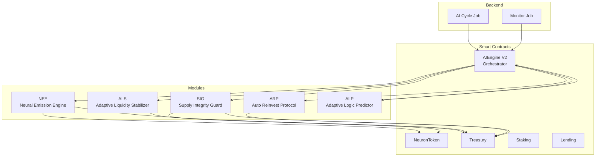
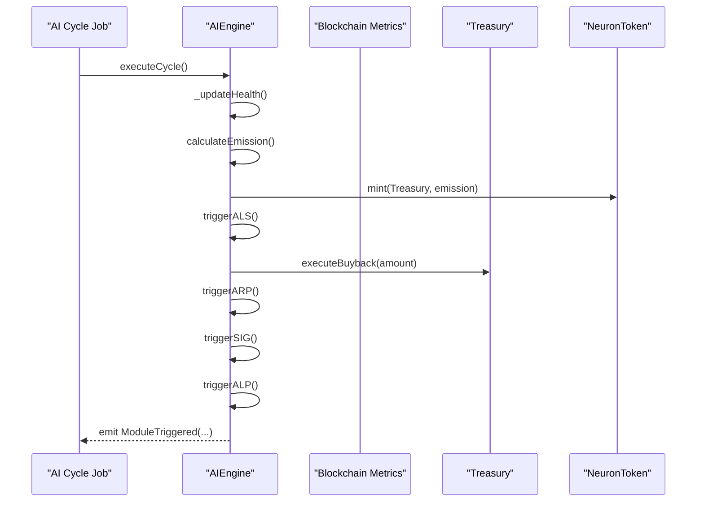
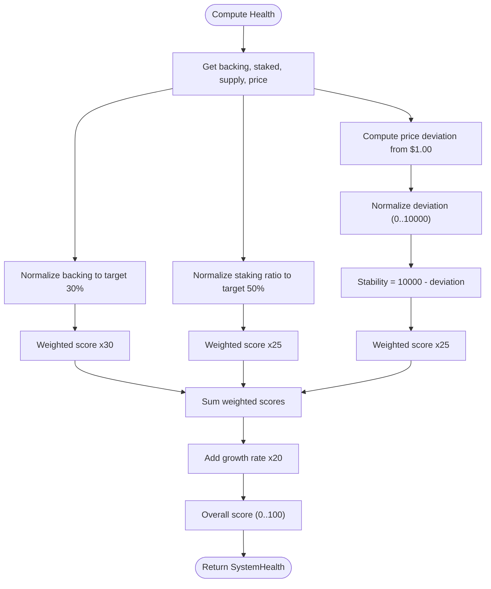
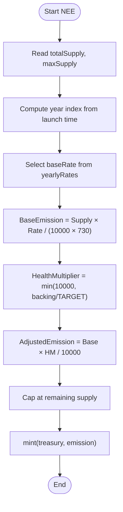
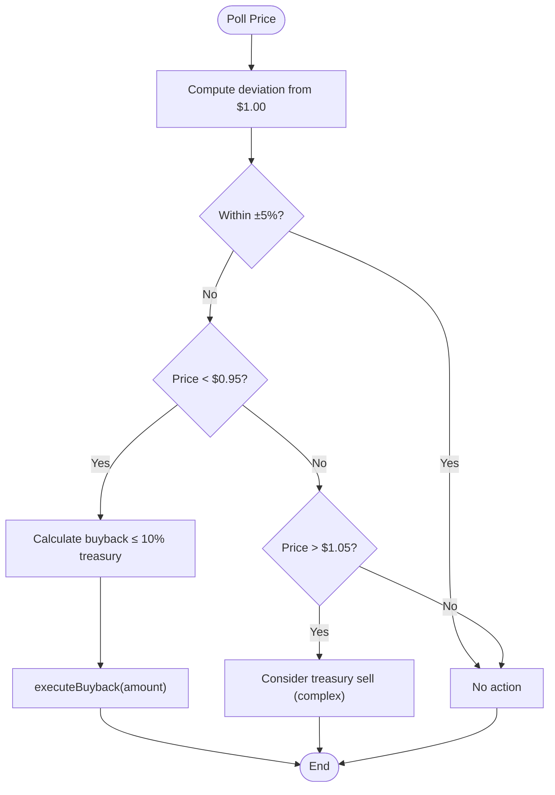
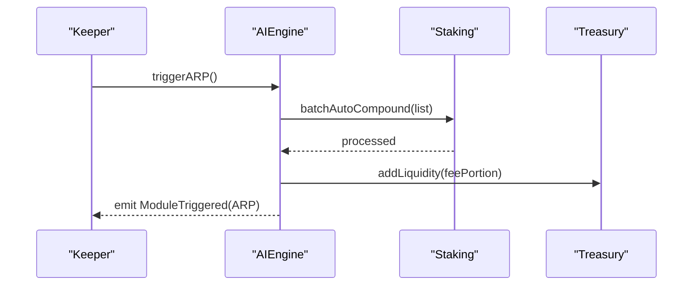
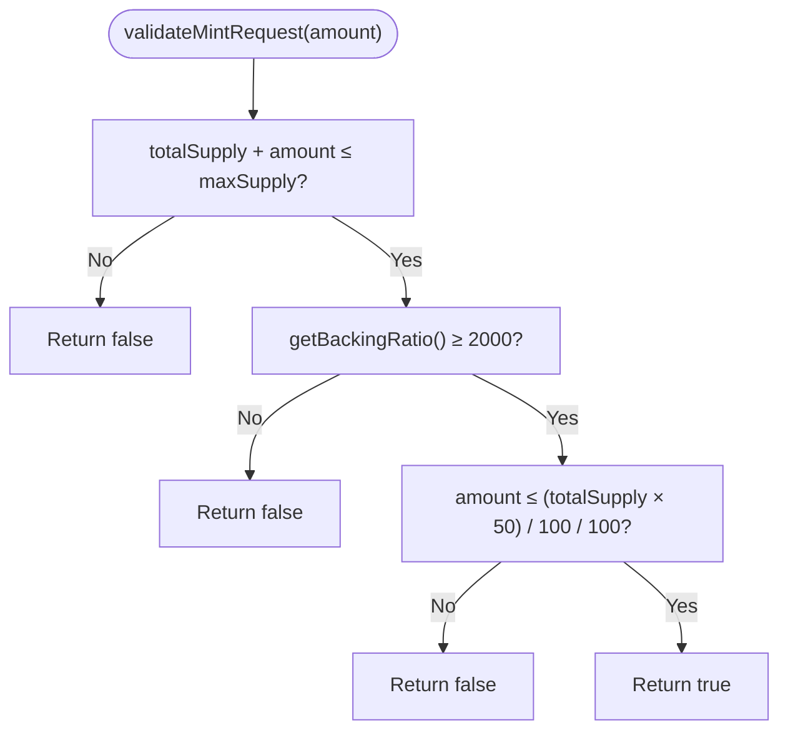
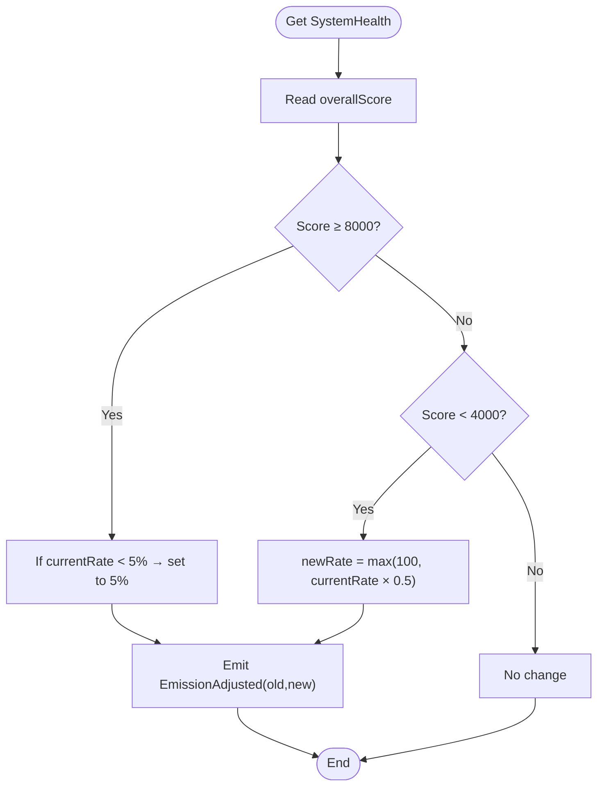
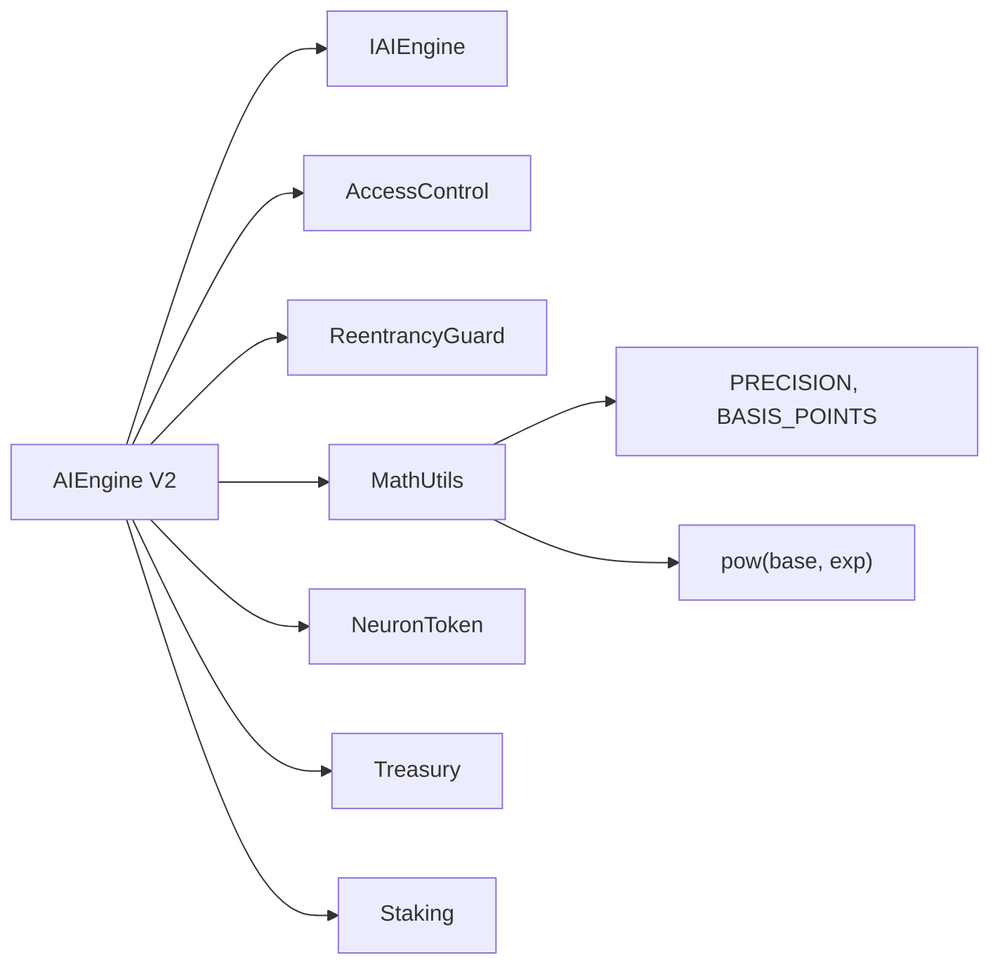

# AI Parameter Adjustment Models

<cite>
**Referenced Files in This Document**
- [AIEngine.sol](file://neurafinance/contracts/ai-engine/AIEngine.sol)
- [IAIEngine.sol](file://neurafinance/contracts/interfaces/IAIEngine.sol)
- [AIEngine.sol](file://neurafinance/contracts-v2/ai-engine/AIEngine.sol)
- [MathUtils.sol](file://neurafinance/contracts-v2/libraries/MathUtils.sol)
- [MATHEMATICAL_MODEL.md](file://neurafinance/contracts-v2/MATHEMATICAL_MODEL.md)
- [SUSTAINABILITY_ANALYSIS.md](file://neurafinance/contracts-v2/SUSTAINABILITY_ANALYSIS.md)
- [ARCHITECTURE.md](file://neurafinance/ARCHITECTURE.md)
- [ai-cycle.js](file://neurafinance/backend/src/jobs/ai-cycle.js)
- [monitor.js](file://neurafinance/backend/src/jobs/monitor.js)
</cite>

## Table of Contents
1. [Introduction](#introduction)
2. [Project Structure](#project-structure)
3. [Core Components](#core-components)
4. [Architecture Overview](#architecture-overview)
5. [Detailed Component Analysis](#detailed-component-analysis)
6. [Dependency Analysis](#dependency-analysis)
7. [Performance Considerations](#performance-considerations)
8. [Troubleshooting Guide](#troubleshooting-guide)
9. [Conclusion](#conclusion)
10. [Appendices](#appendices)

## Introduction
This document details the AI parameter adjustment models that govern the adaptive behavior of the AI engine. It explains the system health scoring mechanism (0–100 scale), including metric weightings, thresholds, and parameter adjustment triggers. It documents the mathematical formulations for the five AI modules: NEE neural emission control, ALS adaptive liquidity stabilization, ARP auto reinvest optimization, SIG supply integrity validation, and ALP adaptive logic prediction. It also covers feedback control loops, error correction algorithms, convergence criteria, machine learning and predictive modeling components, and stability/performance guarantees for AI-driven protocol management.

## Project Structure
The AI engine orchestrates five specialized modules that operate on a 12-hour cycle. The orchestration contract coordinates emissions, liquidity, fee reinvestment, supply integrity, and parameter adaptation. Backend automation jobs gather metrics, compute health, and trigger system updates.

**Diagram sources**
- [AIEngine.sol:17-111](file://neurafinance/contracts-v2/ai-engine/AIEngine.sol#L17-L111)
- [ARCHITECTURE.md:40-54](file://neurafinance/ARCHITECTURE.md#L40-L54)
- [ai-cycle.js:13-85](file://neurafinance/backend/src/jobs/ai-cycle.js#L13-L85)
- [monitor.js:12-110](file://neurafinance/backend/src/jobs/monitor.js#L12-L110)

**Section sources**
- [ARCHITECTURE.md:1-239](file://neurafinance/ARCHITECTURE.md#L1-L239)
- [AIEngine.sol:17-111](file://neurafinance/contracts-v2/ai-engine/AIEngine.sol#L17-L111)
- [ai-cycle.js:13-85](file://neurafinance/backend/src/jobs/ai-cycle.js#L13-L85)
- [monitor.js:12-110](file://neurafinance/backend/src/jobs/monitor.js#L12-L110)

## Core Components
- AIEngine orchestrator: Executes the 12-hour cycle, computes health, triggers modules, and manages roles and access control.
- NEE emission controller: Computes emission amounts based on supply, max supply, and health multiplier.
- ALS liquidity stabilizer: Monitors price deviation and triggers buybacks when price falls below a band.
- ARP auto reinvestor: Coordinates automatic compounding and fee reinvestment.
- SIG integrity guard: Validates mint requests and enforces supply/backing constraints.
- ALP adaptive predictor: Adjusts emission parameters based on health trends.

Key constants and roles:
- Basis points scaling, cycle duration, price bands, and target backing ratios.
- Roles: DEFAULT_ADMIN_ROLE, ADMIN_ROLE, KEEPER_ROLE.
- Backend jobs: AI cycle runs every 12 hours; monitor runs periodically.

**Section sources**
- [AIEngine.sol:24-82](file://neurafinance/contracts-v2/ai-engine/AIEngine.sol#L24-L82)
- [AIEngine.sol:87-111](file://neurafinance/contracts-v2/ai-engine/AIEngine.sol#L87-L111)
- [ai-cycle.js:148-160](file://neurafinance/backend/src/jobs/ai-cycle.js#L148-L160)
- [monitor.js:112-124](file://neurafinance/backend/src/jobs/monitor.js#L112-L124)

## Architecture Overview
The AI engine operates in a closed-loop system:
- Backend gathers metrics and triggers the 12-hour cycle.
- AIEngine computes health and applies module-specific logic.
- NEE emits tokens to the treasury; ALS stabilizes price via buybacks; ARP reinvests fees; SIG validates integrity; ALP adapts parameters.
- Monitoring tracks price, health, and treasury metrics for early warning.

**Diagram sources**
- [ai-cycle.js:19-85](file://neurafinance/backend/src/jobs/ai-cycle.js#L19-L85)
- [AIEngine.sol:87-111](file://neurafinance/contracts-v2/ai-engine/AIEngine.sol#L87-L111)
- [AIEngine.sol:117-128](file://neurafinance/contracts-v2/ai-engine/AIEngine.sol#L117-L128)
- [AIEngine.sol:161-180](file://neurafinance/contracts-v2/ai-engine/AIEngine.sol#L161-L180)
- [AIEngine.sol:196-204](file://neurafinance/contracts-v2/ai-engine/AIEngine.sol#L196-L204)
- [AIEngine.sol:210-229](file://neurafinance/contracts-v2/ai-engine/AIEngine.sol#L210-L229)

## Detailed Component Analysis

### System Health Scoring (0–100 Scale)
The health score is a weighted combination of four normalized components:
- Treasury backing ratio (weight 30)
- Staking ratio (weight 25)
- Price stability (weight 25)
- Growth rate (weight 20)

Formulas and thresholds:
- Normalized components are capped at 10000 basis points for internal computation.
- Weighted average yields a 0–100 score.
- Price stability computed as 10000 minus normalized deviation from $1.00, capped at 10000.
- Backing ratio normalized to target 30%; below 20% triggers critical checks.

**Diagram sources**
- [AIEngine.sol:234-268](file://neurafinance/contracts-v2/ai-engine/AIEngine.sol#L234-L268)
- [AIEngine.sol:273-283](file://neurafinance/contracts-v2/ai-engine/AIEngine.sol#L273-L283)

Practical example:
- Backing ratio 30% → score 30; Staking ratio 50% → score 25; Price deviation 3% → stability 97; Growth 10% → score 20. Total: 65/100.

Health-based actions (example tiers):
- Excellent (90–100): Full feature set
- Healthy (75–89): Normal operations
- Caution (60–74): Reduced emission
- Warning (40–59): Essential features only
- Critical (20–39): Emergency pause
- Emergency (0–19): Full pause

**Section sources**
- [AIEngine.sol:234-268](file://neurafinance/contracts-v2/ai-engine/AIEngine.sol#L234-L268)
- [AIEngine.sol:273-283](file://neurafinance/contracts-v2/ai-engine/AIEngine.sol#L273-L283)
- [MATHEMATICAL_MODEL.md:230-256](file://neurafinance/contracts-v2/MATHEMATICAL_MODEL.md#L230-L256)

### NEE Neural Emission Control
Purpose: Dynamically compute token emission based on supply dynamics and system health.

Mathematical model:
- Base emission per 12-hour cycle: (Supply × AnnualRate) / (BASIS_POINTS × 730)
- Health multiplier: min(10000, CurrentBackingRatio / TargetBackingRatio)
- Adjusted emission: BaseEmission × HealthMultiplier / 10000
- Cap at remaining supply (maxSupply − totalSupply)

Implementation highlights:
- Yearly emission rates decrease over time (5%, 4%, 3%, 2.5%, 2%).
- Emission minted to treasury, not directly to users.
- Daily emission cap enforced via validateMintRequest.

**Diagram sources**
- [AIEngine.sol:133-155](file://neurafinance/contracts-v2/ai-engine/AIEngine.sol#L133-L155)
- [AIEngine.sol:305-323](file://neurafinance/contracts-v2/ai-engine/AIEngine.sol#L305-L323)

Practical example:
- Supply 10M, Rate 5% (500), BaseEmission = 10000000 × 500 / 7300000 ≈ 684.93
- Backing 30% → HM = 10000 → AdjustedEmission ≈ 684.93
- Remaining supply 90M → Emission = 684.93

**Section sources**
- [AIEngine.sol:133-155](file://neurafinance/contracts-v2/ai-engine/AIEngine.sol#L133-L155)
- [AIEngine.sol:305-323](file://neurafinance/contracts-v2/ai-engine/AIEngine.sol#L305-L323)
- [MATHEMATICAL_MODEL.md:53-109](file://neurafinance/contracts-v2/MATHEMATICAL_MODEL.md#L53-L109)

### ALS Adaptive Liquidity Stabilizer
Purpose: Maintain price within ±5% of $1.00 using treasury buybacks.

Decision logic:
- If price < $0.95, trigger buyback.
- If price > $1.05, consider selling (rare and complex).
- Cooldown prevents frequent actions.

Mathematical model:
- Price deviation band: ±500 basis points around 10000.
- Buyback amount ≤ 10% of treasury value.
- Cooldown enforced between actions.

**Diagram sources**
- [AIEngine.sol:288-300](file://neurafinance/contracts-v2/ai-engine/AIEngine.sol#L288-L300)
- [AIEngine.sol:348-352](file://neurafinance/contracts-v2/ai-engine/AIEngine.sol#L348-L352)
- [AIEngine.sol:161-180](file://neurafinance/contracts-v2/ai-engine/AIEngine.sol#L161-L180)

Practical example:
- Price $0.94, deviation = 6%. Trigger buyback up to 10% of treasury value.

**Section sources**
- [AIEngine.sol:288-300](file://neurafinance/contracts-v2/ai-engine/AIEngine.sol#L288-L300)
- [AIEngine.sol:348-352](file://neurafinance/contracts-v2/ai-engine/AIEngine.sol#L348-L352)
- [AIEngine.sol:161-180](file://neurafinance/contracts-v2/ai-engine/AIEngine.sol#L161-L180)

### ARP Auto Reinvest Protocol
Purpose: Automate compounding and fee reinvestment to sustain rewards and liquidity.

Mechanics:
- Placeholder in AIEngine; actual batch compounding delegated to Staking contract.
- Fees collected and reinvested into liquidity and treasury according to fee distribution.

**Diagram sources**
- [AIEngine.sol:186-190](file://neurafinance/contracts-v2/ai-engine/AIEngine.sol#L186-L190)
- [AIEngine.sol:135-138](file://neurafinance/contracts-v2/ai-engine/AIEngine.sol#L135-L138)

**Section sources**
- [AIEngine.sol:186-190](file://neurafinance/contracts-v2/ai-engine/AIEngine.sol#L186-L190)

### SIG Supply Integrity Guard
Purpose: Validate mint requests and ensure supply/backing health.

Checks:
- Max supply cap enforcement.
- Backing ratio threshold (minimum 20%).
- Daily emission cap (0.05% of supply).

**Diagram sources**
- [AIEngine.sol:305-323](file://neurafinance/contracts-v2/ai-engine/AIEngine.sol#L305-L323)

**Section sources**
- [AIEngine.sol:305-323](file://neurafinance/contracts-v2/ai-engine/AIEngine.sol#L305-L323)

### ALP Adaptive Logic Predictor
Purpose: Adjust system parameters based on health trends.

Rules:
- If overall score ≥ 8000: maintain or slightly increase emission.
- If overall score < 4000: reduce emission by 50% (min 1%).
- Emits parameter change events.

**Diagram sources**
- [AIEngine.sol:210-229](file://neurafinance/contracts-v2/ai-engine/AIEngine.sol#L210-L229)

**Section sources**
- [AIEngine.sol:210-229](file://neurafinance/contracts-v2/ai-engine/AIEngine.sol#L210-L229)

### Feedback Control Loops and Convergence
Feedback loops:
- Health score drives ALP parameter adjustments.
- NEE emission feeds treasury value, affecting backing ratio and future emissions.
- ALS buybacks influence price, impacting health stability.

Error correction:
- SIG validates mint requests to prevent overshooting supply/backing.
- Price band triggers ALS actions to reduce deviations.
- Cooldown prevents oscillation in ALS.

Convergence criteria:
- Health score remains within target bands (backing ≥ 30%, price within ±5%).
- Emission rate converges toward sustainable levels based on backing ratio.

Stability analysis:
- Backing ratio floor at 20% prevents collapse.
- Decreasing emission schedules reduce inflationary pressure over time.
- Compound interest model ensures accurate reward accrual.

**Section sources**
- [AIEngine.sol:210-229](file://neurafinance/contracts-v2/ai-engine/AIEngine.sol#L210-L229)
- [AIEngine.sol:305-323](file://neurafinance/contracts-v2/ai-engine/AIEngine.sol#L305-L323)
- [AIEngine.sol:288-300](file://neurafinance/contracts-v2/ai-engine/AIEngine.sol#L288-L300)
- [SUSTAINABILITY_ANALYSIS.md:1-399](file://neurafinance/contracts-v2/SUSTAINABILITY_ANALYSIS.md#L1-L399)

### Machine Learning and Predictive Modeling
- Real-time adaptation: ALP uses historical health scores to infer trends and adjust emission rates.
- Predictive signals: Backend jobs track price, health, and treasury metrics to anticipate stress.
- Automated triggers: When health drops below thresholds, backend jobs alert and AI engine responds.

Note: The current implementation relies on explicit thresholds and weighted scoring rather than neural networks. Predictive modeling is operational through historical health tracking and automated alerts.

**Section sources**
- [AIEngine.sol:50-51](file://neurafinance/contracts-v2/ai-engine/AIEngine.sol#L50-L51)
- [ai-cycle.js:33-51](file://neurafinance/backend/src/jobs/ai-cycle.js#L33-L51)
- [monitor.js:67-84](file://neurafinance/backend/src/jobs/monitor.js#L67-L84)

### Performance Metrics and Monitoring
- Cycle cadence: 12-hour intervals for deterministic parameter updates.
- Backend monitoring: Periodic checks for price, health, and treasury balances.
- Alerts: Webhook/email notifications for critical deviations.

**Section sources**
- [ai-cycle.js:148-160](file://neurafinance/backend/src/jobs/ai-cycle.js#L148-L160)
- [monitor.js:112-124](file://neurafinance/backend/src/jobs/monitor.js#L112-L124)

## Dependency Analysis
The AI engine orchestrator depends on core contracts and libraries for precise computations and secure operations.

**Diagram sources**
- [AIEngine.sol:4-10](file://neurafinance/contracts-v2/ai-engine/AIEngine.sol#L4-L10)
- [MathUtils.sol:4-111](file://neurafinance/contracts-v2/libraries/MathUtils.sol#L4-L111)

**Section sources**
- [AIEngine.sol:4-10](file://neurafinance/contracts-v2/ai-engine/AIEngine.sol#L4-L10)
- [MathUtils.sol:4-111](file://neurafinance/contracts-v2/libraries/MathUtils.sol#L4-L111)

## Performance Considerations
- Gas optimization: Batch operations and checkpoint patterns reduce on-chain costs.
- Precision: Basis points and fixed-point arithmetic ensure numerical stability.
- Access control: Roles minimize misuse and reduce reentrancy risks.
- Oracles: Chainlink integration planned for robust price discovery.

[No sources needed since this section provides general guidance]

## Troubleshooting Guide
Common issues and resolutions:
- Emission not adjusting: Verify health score and backing ratio; ensure ALP thresholds are met.
- Price instability: Confirm ALS cooldown and buyback eligibility; check treasury capacity.
- Mint request rejected: Validate supply cap, backing ratio, and daily emission limits.
- Backend failures: Review cron scheduling and alert logs for errors.

**Section sources**
- [AIEngine.sol:305-323](file://neurafinance/contracts-v2/ai-engine/AIEngine.sol#L305-L323)
- [ai-cycle.js:79-84](file://neurafinance/backend/src/jobs/ai-cycle.js#L79-L84)
- [monitor.js:34-36](file://neurafinance/backend/src/jobs/monitor.js#L34-L36)

## Conclusion
The AI parameter adjustment models establish a robust, mathematically grounded framework for autonomous protocol management. The health score provides a unified signal for adaptive behavior across modules, while explicit thresholds and weighted scoring ensure predictable, stable responses. Backend automation complements on-chain logic to deliver real-time monitoring and intervention. Together, these components support long-term sustainability and resilience.

[No sources needed since this section summarizes without analyzing specific files]

## Appendices

### Practical Examples Index
- Health score calculation: [AIEngine.sol:234-268](file://neurafinance/contracts-v2/ai-engine/AIEngine.sol#L234-L268)
- Emission calculation: [AIEngine.sol:133-155](file://neurafinance/contracts-v2/ai-engine/AIEngine.sol#L133-L155)
- ALS buyback trigger: [AIEngine.sol:288-300](file://neurafinance/contracts-v2/ai-engine/AIEngine.sol#L288-L300)
- SIG mint validation: [AIEngine.sol:305-323](file://neurafinance/contracts-v2/ai-engine/AIEngine.sol#L305-L323)
- ALP parameter adjustment: [AIEngine.sol:210-229](file://neurafinance/contracts-v2/ai-engine/AIEngine.sol#L210-L229)

### Backend Jobs Reference
- AI cycle scheduling and execution: [ai-cycle.js:148-160](file://neurafinance/backend/src/jobs/ai-cycle.js#L148-L160)
- Monitoring intervals and alerts: [monitor.js:112-124](file://neurafinance/backend/src/jobs/monitor.js#L112-L124)