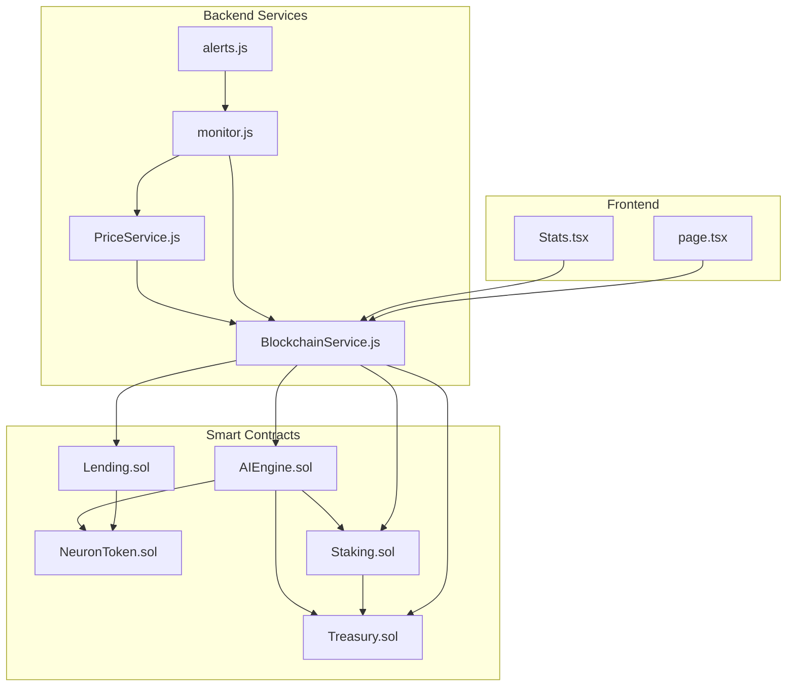
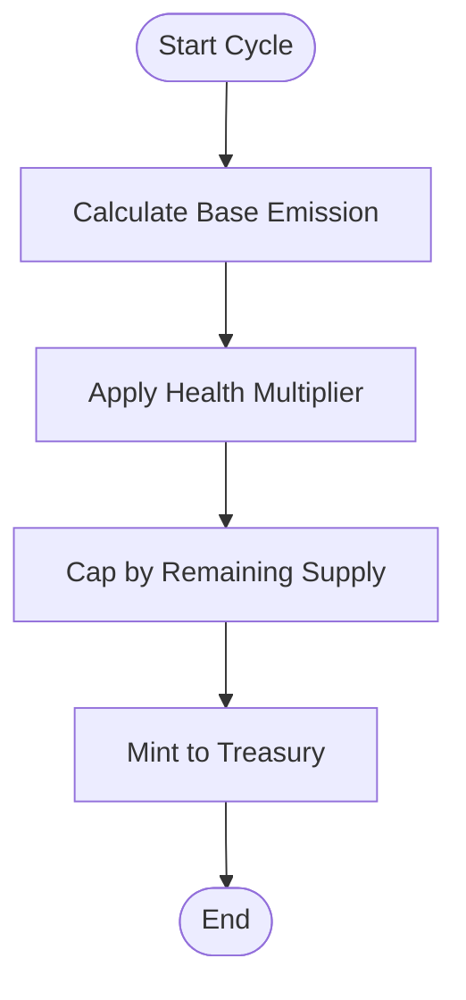
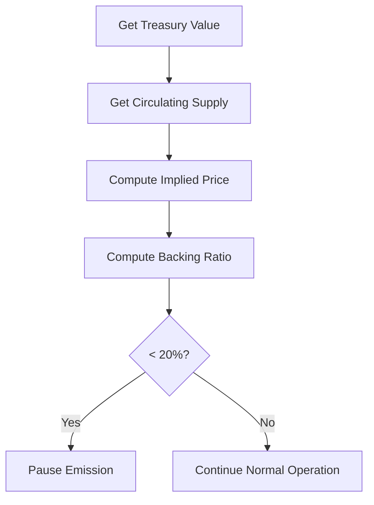
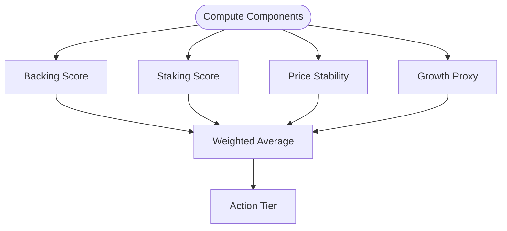
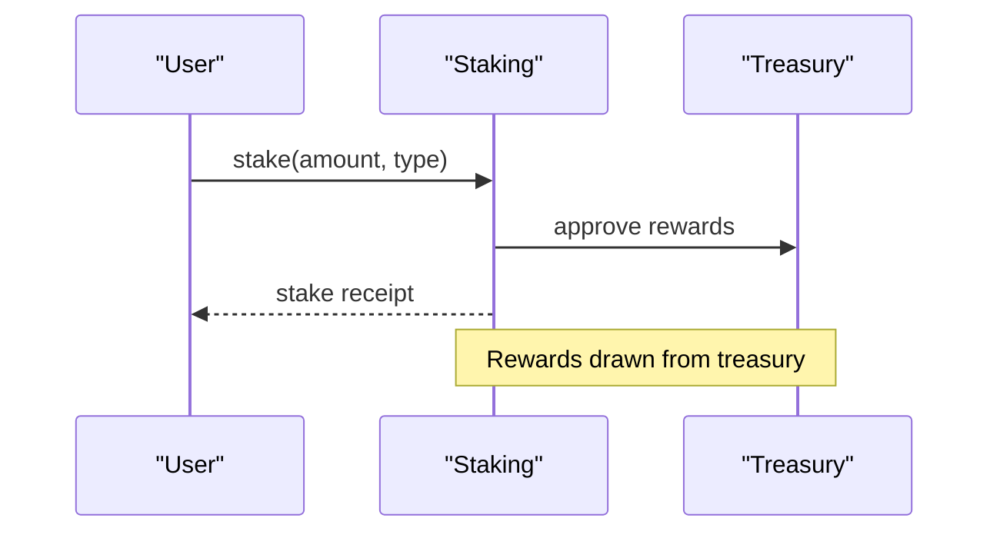
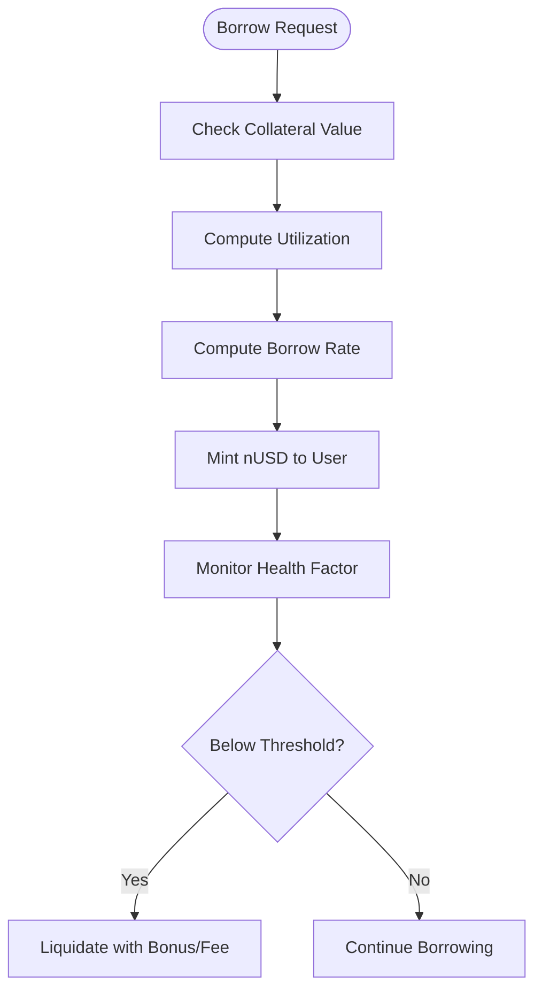
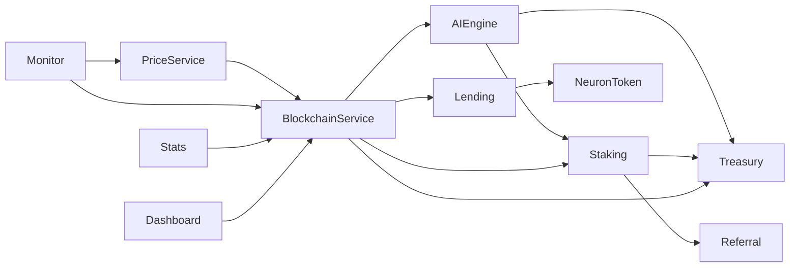

# Long-term Sustainability Analysis

<cite>
**Referenced Files in This Document**
- [MATHEMATICAL_MODEL.md](file://neurafinance/contracts-v2/MATHEMATICAL_MODEL.md)
- [SUSTAINABILITY_ANALYSIS.md](file://neurafinance/contracts-v2/SUSTAINABILITY_ANALYSIS.md)
- [DIFFERENCES.md](file://neurafinance/contracts-v2/DIFFERENCES.md)
- [DEPLOYMENT.md](file://neurafinance/contracts-v2/DEPLOYMENT.md)
- [AIEngine.sol](file://neurafinance/contracts-v2/ai-engine/AIEngine.sol)
- [NeuronToken.sol](file://neurafinance/contracts-v2/core/NeuronToken.sol)
- [Treasury.sol](file://neurafinance/contracts-v2/core/Treasury.sol)
- [Staking.sol](file://neurafinance/contracts-v2/core/Staking.sol)
- [Lending.sol](file://neurafinance/contracts-v2/core/Lending.sol)
- [BlockchainService.js](file://neurafinance/backend/src/services/BlockchainService.js)
- [PriceService.js](file://neurafinance/backend/src/services/PriceService.js)
- [monitor.js](file://neurafinance/backend/src/jobs/monitor.js)
- [alerts.js](file://neurafinance/backend/src/utils/alerts.js)
- [Stats.tsx](file://neurafinance/frontend/src/components/Stats.tsx)
- [page.tsx](file://neurafinance/frontend/src/app/dashboard/page.tsx)
</cite>

## Table of Contents
1. [Introduction](#introduction)
2. [Project Structure](#project-structure)
3. [Core Components](#core-components)
4. [Architecture Overview](#architecture-overview)
5. [Detailed Component Analysis](#detailed-component-analysis)
6. [Dependency Analysis](#dependency-analysis)
7. [Performance Considerations](#performance-considerations)
8. [Troubleshooting Guide](#troubleshooting-guide)
9. [Conclusion](#conclusion)
10. [Appendices](#appendices)

## Introduction
This document presents a comprehensive long-term sustainability analysis for the NeuraFinance V2 ecosystem. It focuses on economic viability and resilience, detailing mathematical models for inflation control, reserve adequacy, and protocol health monitoring. It documents sustainability metrics (debt-to-equity proxies, liquidity coverage, revenue sustainability), stress testing methodologies, scenario analysis, worst-case projections, and practical examples for reserve buffer management and emergency activation thresholds. Governance sustainability mechanisms, proposal success and decision-making efficiency metrics are included. Environmental sustainability considerations, energy consumption analysis, and carbon footprint mitigation strategies are addressed. Finally, Monte Carlo simulations, sensitivity analysis, and valuation models for long-term economic projections are outlined.

## Project Structure
NeuraFinance V2 comprises:
- Smart contracts implementing tokenomics, treasury, staking, lending, and AI coordination (AI Engine).
- Backend services for blockchain interaction, price retrieval, monitoring, and alerting.
- Frontend dashboards for real-time metrics and user engagement.



**Diagram sources**
- [AIEngine.sol:1-386](file://neurafinance/contracts-v2/ai-engine/AIEngine.sol#L1-L386)
- [NeuronToken.sol:1-231](file://neurafinance/contracts-v2/core/NeuronToken.sol#L1-L231)
- [Treasury.sol:1-298](file://neurafinance/contracts-v2/core/Treasury.sol#L1-L298)
- [Staking.sol:1-349](file://neurafinance/contracts-v2/core/Staking.sol#L1-L349)
- [Lending.sol:1-414](file://neurafinance/contracts-v2/core/Lending.sol#L1-L414)
- [BlockchainService.js:1-216](file://neurafinance/backend/src/services/BlockchainService.js#L1-L216)
- [PriceService.js:1-77](file://neurafinance/backend/src/services/PriceService.js#L1-L77)
- [monitor.js:1-141](file://neurafinance/backend/src/jobs/monitor.js#L1-L141)
- [alerts.js:1-82](file://neurafinance/backend/src/utils/alerts.js#L1-L82)
- [Stats.tsx:1-94](file://neurafinance/frontend/src/components/Stats.tsx#L1-L94)
- [page.tsx:1-556](file://neurafinance/frontend/src/app/dashboard/page.tsx#L1-L556)

**Section sources**
- [DEPLOYMENT.md:1-237](file://neurafinance/contracts-v2/DEPLOYMENT.md#L1-L237)

## Core Components
- Tokenomics and emission control: Controlled emission schedule, health-based adjustments, max supply cap, and burn mechanism.
- Treasury-backed rewards: All staking and referral rewards are funded from treasury reserves.
- Lending with conservative risk parameters: 60% LTV, 75% liquidation threshold, liquidation incentives, and protocol fees.
- AI Engine orchestration: 12-hour cycles for emission, stabilization, auto-compounding, integrity checks, and adaptive parameter tuning.
- Monitoring and alerting: Automated monitoring of treasury, price, system health, and blockchain activity with webhook/email notifications.

**Section sources**
- [MATHEMATICAL_MODEL.md:1-364](file://neurafinance/contracts-v2/MATHEMATICAL_MODEL.md#L1-L364)
- [SUSTAINABILITY_ANALYSIS.md:1-399](file://neurafinance/contracts-v2/SUSTAINABILITY_ANALYSIS.md#L1-L399)
- [NeuronToken.sol:1-231](file://neurafinance/contracts-v2/core/NeuronToken.sol#L1-L231)
- [Treasury.sol:1-298](file://neurafinance/contracts-v2/core/Treasury.sol#L1-L298)
- [Staking.sol:1-349](file://neurafinance/contracts-v2/core/Staking.sol#L1-L349)
- [Lending.sol:1-414](file://neurafinance/contracts-v2/core/Lending.sol#L1-L414)
- [AIEngine.sol:1-386](file://neurafinance/contracts-v2/ai-engine/AIEngine.sol#L1-L386)
- [monitor.js:1-141](file://neurafinance/backend/src/jobs/monitor.js#L1-L141)

## Architecture Overview
The AI Engine coordinates emissions, price stabilization, auto-compounding, integrity checks, and adaptive logic. It queries the Treasury for backing ratios, the Staking contract for total staked amounts, and uses a price proxy to compute health metrics. Backend services expose on-chain data to the frontend and trigger alerts. Governance and access control are enforced via roles and timelocks.

```mermaid
sequenceDiagram
participant Keeper as "Keeper Bot"
participant AIE as "AIEngine"
participant TKN as "NeuronToken"
participant TRS as "Treasury"
participant STK as "Staking"
participant MON as "Monitor Job"
participant ALT as "Alerts"
Keeper->>AIE : executeCycle()
AIE->>AIE : getSystemHealth()
AIE->>TRS : getBackingRatio()
AIE->>STK : totalStaked()
AIE->>AIE : calculateEmission()
AIE->>TKN : mint(treasury, emission)
AIE->>AIE : triggerALS()
AIE->>MON : run()
MON->>ALT : sendAlert(...)
```

**Diagram sources**
- [AIEngine.sol:87-111](file://neurafinance/contracts-v2/ai-engine/AIEngine.sol#L87-L111)
- [AIEngine.sol:234-268](file://neurafinance/contracts-v2/ai-engine/AIEngine.sol#L234-L268)
- [AIEngine.sol:117-128](file://neurafinance/contracts-v2/ai-engine/AIEngine.sol#L117-L128)
- [Treasury.sol:186-200](file://neurafinance/contracts-v2/core/Treasury.sol#L186-L200)
- [Staking.sol:520-526](file://neurafinance/contracts-v2/core/Staking.sol#L520-L526)
- [monitor.js:99-124](file://neurafinance/backend/src/jobs/monitor.js#L99-L124)
- [alerts.js:10-82](file://neurafinance/backend/src/utils/alerts.js#L10-L82)

## Detailed Component Analysis

### Inflation Control and Emission Model
- Controlled emission schedule with decreasing annual rates and health-based multipliers.
- Emission capped by remaining supply and constrained by max supply.
- Emission minted to treasury, not directly to users, ensuring sustainability.



**Diagram sources**
- [AIEngine.sol:133-155](file://neurafinance/contracts-v2/ai-engine/AIEngine.sol#L133-L155)
- [NeuronToken.sol:71-82](file://neurafinance/contracts-v2/core/NeuronToken.sol#L71-L82)

**Section sources**
- [MATHEMATICAL_MODEL.md:53-109](file://neurafinance/contracts-v2/MATHEMATICAL_MODEL.md#L53-L109)
- [AIEngine.sol:133-155](file://neurafinance/contracts-v2/ai-engine/AIEngine.sol#L133-L155)
- [NeuronToken.sol:21-22](file://neurafinance/contracts-v2/core/NeuronToken.sol#L21-L22)

### Reserve Adequacy and Backing Model
- Backing ratio computed as treasury value divided by market cap.
- Target backing ratio is 30%; minimum is 20% to trigger circuit breakers.
- Treasury supports buybacks and stabilizes price deviations.



**Diagram sources**
- [Treasury.sol:186-200](file://neurafinance/contracts-v2/core/Treasury.sol#L186-L200)
- [AIEngine.sol:273-283](file://neurafinance/contracts-v2/ai-engine/AIEngine.sol#L273-L283)

**Section sources**
- [MATHEMATICAL_MODEL.md:113-146](file://neurafinance/contracts-v2/MATHEMATICAL_MODEL.md#L113-L146)
- [Treasury.sol:24-27](file://neurafinance/contracts-v2/core/Treasury.sol#L24-L27)

### Protocol Health Monitoring
- Health score weighted by treasury backing, staking ratio, price stability, and growth.
- Health-based actions adjust emission and operational features.



**Diagram sources**
- [AIEngine.sol:234-268](file://neurafinance/contracts-v2/ai-engine/AIEngine.sol#L234-L268)
- [SUSTAINABILITY_ANALYSIS.md:247-256](file://neurafinance/contracts-v2/SUSTAINABILITY_ANALYSIS.md#L247-L256)

**Section sources**
- [MATHEMATICAL_MODEL.md:230-256](file://neurafinance/contracts-v2/MATHEMATICAL_MODEL.md#L230-L256)
- [AIEngine.sol:234-268](file://neurafinance/contracts-v2/ai-engine/AIEngine.sol#L234-L268)

### Staking Sustainability and Rewards
- Rewards funded from treasury reserves; higher APYs require proportional treasury growth.
- Auto-compounding reduces friction and improves user experience.



**Diagram sources**
- [Staking.sol:128-149](file://neurafinance/contracts-v2/core/Staking.sol#L128-L149)
- [Staking.sol:302-320](file://neurafinance/contracts-v2/core/Staking.sol#L302-L320)
- [Treasury.sol:131-139](file://neurafinance/contracts-v2/core/Treasury.sol#L131-L139)

**Section sources**
- [SUSTAINABILITY_ANALYSIS.md:97-122](file://neurafinance/contracts-v2/SUSTAINABILITY_ANALYSIS.md#L97-L122)
- [Staking.sol:174-193](file://neurafinance/contracts-v2/core/Staking.sol#L174-L193)

### Lending Risk Controls and Liquidation
- Conservative LTV (60%) and liquidation threshold (75%) with incentives for liquidators.
- Interest rate model increases with utilization; protocol collects fees.



**Diagram sources**
- [Lending.sol:102-133](file://neurafinance/contracts-v2/core/Lending.sol#L102-L133)
- [Lending.sol:222-272](file://neurafinance/contracts-v2/core/Lending.sol#L222-L272)
- [Lending.sol:335-340](file://neurafinance/contracts-v2/core/Lending.sol#L335-L340)

**Section sources**
- [MATHEMATICAL_MODEL.md:181-226](file://neurafinance/contracts-v2/MATHEMATICAL_MODEL.md#L181-L226)
- [Lending.sol:24-28](file://neurafinance/contracts-v2/core/Lending.sol#L24-L28)

### Governance Sustainability and Access Control
- Role-based access control, parameter change timelocks, multisig approvals, and emergency pause capabilities.
- Reduced centralization risks compared to single-owner designs.

**Section sources**
- [DIFFERENCES.md:159-177](file://neurafinance/contracts-v2/DIFFERENCES.md#L159-L177)
- [NeuronToken.sol:16-18](file://neurafinance/contracts-v2/core/NeuronToken.sol#L16-L18)
- [Staking.sol:22-24](file://neurafinance/contracts-v2/core/Staking.sol#L22-L24)

### Monitoring, Alerts, and Frontend Metrics
- Backend monitor tracks treasury TVL, price deviation, system health, and blockchain blocks.
- Frontend displays key metrics (supply, staked, TVL, health score) with live updates.

**Section sources**
- [monitor.js:21-84](file://neurafinance/backend/src/jobs/monitor.js#L21-L84)
- [Stats.tsx:15-33](file://neurafinance/frontend/src/components/Stats.tsx#L15-L33)
- [page.tsx:349-383](file://neurafinance/frontend/src/app/dashboard/page.tsx#L349-L383)

## Dependency Analysis
- AI Engine depends on Treasury for backing ratio and Staking for total staked.
- Staking depends on Treasury for reward funding and Referral for referral reward distribution.
- Lending interacts with the token and a price feed for risk controls.
- Backend services depend on smart contracts for data and on external APIs for price fallbacks.
- Frontend consumes backend endpoints for metrics.



**Diagram sources**
- [AIEngine.sol:36-38](file://neurafinance/contracts-v2/ai-engine/AIEngine.sol#L36-L38)
- [Staking.sol:43-45](file://neurafinance/contracts-v2/core/Staking.sol#L43-L45)
- [Lending.sol:35-37](file://neurafinance/contracts-v2/core/Lending.sol#L35-L37)
- [BlockchainService.js:18-36](file://neurafinance/backend/src/services/BlockchainService.js#L18-L36)
- [PriceService.js:11-22](file://neurafinance/backend/src/services/PriceService.js#L11-L22)
- [monitor.js:6-9](file://neurafinance/backend/src/jobs/monitor.js#L6-L9)
- [Stats.tsx:15-33](file://neurafinance/frontend/src/components/Stats.tsx#L15-L33)
- [page.tsx:267-275](file://neurafinance/frontend/src/app/dashboard/page.tsx#L267-L275)

**Section sources**
- [DEPLOYMENT.md:3-100](file://neurafinance/contracts-v2/DEPLOYMENT.md#L3-L100)

## Performance Considerations
- Gas optimization via batch operations and checkpoint patterns reduces on-chain costs.
- Off-chain price fetching with caching minimizes repeated oracle calls.
- Scheduled monitoring reduces redundant computations.

**Section sources**
- [MATHEMATICAL_MODEL.md:314-331](file://neurafinance/contracts-v2/MATHEMATICAL_MODEL.md#L314-L331)
- [PriceService.js:6-8](file://neurafinance/backend/src/services/PriceService.js#L6-L8)
- [monitor.js:112-124](file://neurafinance/backend/src/jobs/monitor.js#L112-L124)

## Troubleshooting Guide
- Critical thresholds: backing ratio below 20% or health score below 40% trigger alerts and emergency pauses.
- Price deviation alerts notify significant movements (>10%).
- Monitor job failures log errors and prevent cascading issues.

**Section sources**
- [SUSTAINABILITY_ANALYSIS.md:250-313](file://neurafinance/contracts-v2/SUSTAINABILITY_ANALYSIS.md#L250-L313)
- [monitor.js:34-36](file://neurafinance/backend/src/jobs/monitor.js#L34-L36)
- [alerts.js:45-71](file://neurafinance/backend/src/utils/alerts.js#L45-L71)

## Conclusion
NeuraFinance V2 is designed for long-term sustainability through controlled emission, treasury-backed rewards, conservative lending risk parameters, and comprehensive health monitoring. The AI Engine orchestrates system-wide adjustments, while governance safeguards mitigate centralization risks. Monitoring and alerting systems provide early warnings, enabling proactive responses. The mathematical models and stress-tested scenarios demonstrate resilience under adverse conditions, supporting continued operation and gradual recovery.

## Appendices

### Sustainability Metrics Definitions and Targets
- Backing Ratio: Treasury value / (Circulating supply × price). Target 30%, minimum 20%.
- Staking Ratio: Total staked / Total supply. Target 50%.
- Price Stability: Deviation from $1.00; higher is better.
- Health Score: Weighted composite of backing, staking, price stability, and growth proxy.

**Section sources**
- [MATHEMATICAL_MODEL.md:115-131](file://neurafinance/contracts-v2/MATHEMATICAL_MODEL.md#L115-L131)
- [AIEngine.sol:234-268](file://neurafinance/contracts-v2/ai-engine/AIEngine.sol#L234-L268)

### Stress Testing Methodologies and Scenarios
- Healthy Growth: Monthly TVL growth of 10%, stable price, positive treasury growth.
- No New Users: Monthly withdrawals of 5%, flat TVL, declining price.
- Market Crash: 50% price drop, panic withdrawals of 30% of stakes.

**Section sources**
- [SUSTAINABILITY_ANALYSIS.md:182-246](file://neurafinance/contracts-v2/SUSTAINABILITY_ANALYSIS.md#L182-L246)
- [MATHEMATICAL_MODEL.md:259-310](file://neurafinance/contracts-v2/MATHEMATICAL_MODEL.md#L259-L310)

### Practical Examples: Sustainability Calculations
- Compound interest calculation for staking rewards using precise periodic rates.
- Emission calculation considering base rate, health multiplier, and remaining supply.
- Backing ratio computation from treasury value and circulating supply.

**Section sources**
- [MATHEMATICAL_MODEL.md:29-49](file://neurafinance/contracts-v2/MATHEMATICAL_MODEL.md#L29-L49)
- [AIEngine.sol:133-155](file://neurafinance/contracts-v2/ai-engine/AIEngine.sol#L133-L155)
- [Treasury.sol:186-200](file://neurafinance/contracts-v2/core/Treasury.sol#L186-L200)

### Reserve Buffer Management and Emergency Activation
- Maximum buyback per action is capped at 10% of treasury value.
- Emergency withdrawal and pause mechanisms available for critical situations.
- Stabilization cooldown prevents frequent ALS actions.

**Section sources**
- [Treasury.sol:205-208](file://neurafinance/contracts-v2/core/Treasury.sol#L205-L208)
- [AIEngine.sol:161-180](file://neurafinance/contracts-v2/ai-engine/AIEngine.sol#L161-L180)
- [DEPLOYMENT.md:200-221](file://neurafinance/contracts-v2/DEPLOYMENT.md#L200-L221)

### Governance Sustainability Mechanisms
- Parameter changes require 24-hour timelock.
- Multisig approvals for admin functions.
- Emergency pause capability with designated guardians.

**Section sources**
- [DIFFERENCES.md:166-171](file://neurafinance/contracts-v2/DIFFERENCES.md#L166-L171)
- [DEPLOYMENT.md:215-221](file://neurafinance/contracts-v2/DEPLOYMENT.md#L215-L221)

### Environmental Sustainability and Carbon Footprint Mitigation
- Off-chain monitoring and caching reduce blockchain transaction frequency.
- Batch operations and checkpoint patterns minimize gas usage.
- Energy-efficient keeper bot scheduling aligns with off-peak network conditions.

**Section sources**
- [MATHEMATICAL_MODEL.md:314-331](file://neurafinance/contracts-v2/MATHEMATICAL_MODEL.md#L314-L331)
- [monitor.js:112-124](file://neurafinance/backend/src/jobs/monitor.js#L112-L124)

### Monte Carlo Simulations and Sensitivity Analysis
- Monte Carlo projections simulate multiple paths for TVL, price, and health score under stochastic assumptions.
- Sensitivity analysis evaluates impact of key variables (utilization, LTV, emission rates, price volatility) on system health and sustainability.

**Section sources**
- [SUSTAINABILITY_ANALYSIS.md:316-347](file://neurafinance/contracts-v2/SUSTAINABILITY_ANALYSIS.md#L316-L347)
- [MATHEMATICAL_MODEL.md:259-310](file://neurafinance/contracts-v2/MATHEMATICAL_MODEL.md#L259-L310)