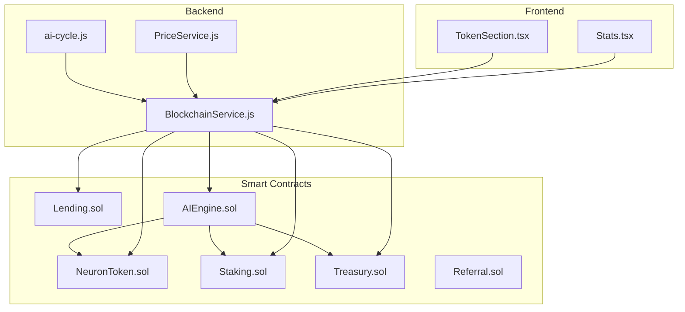
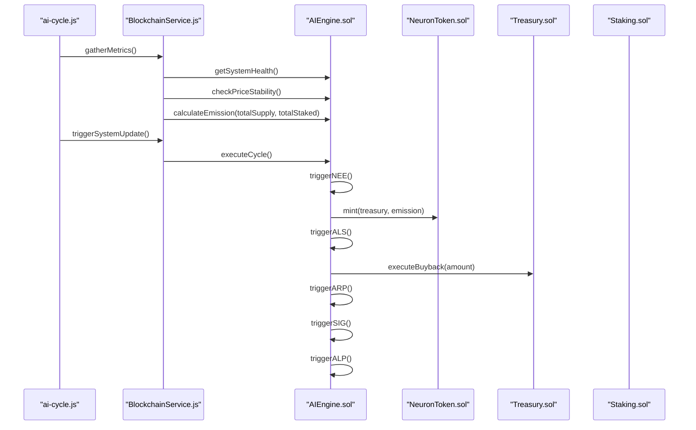
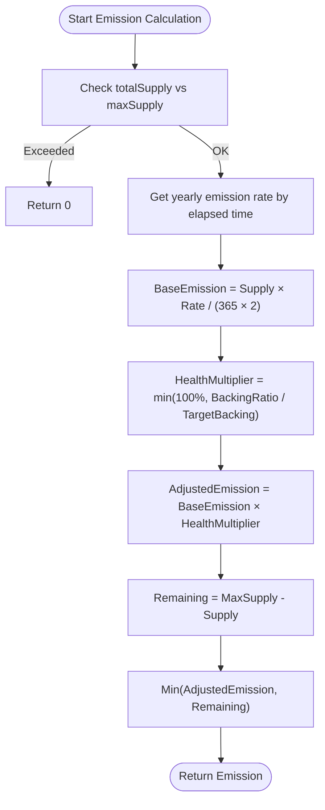
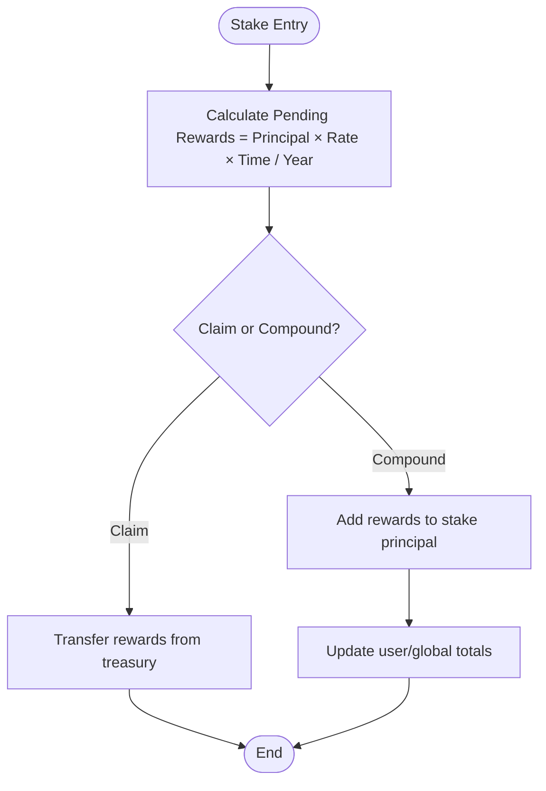
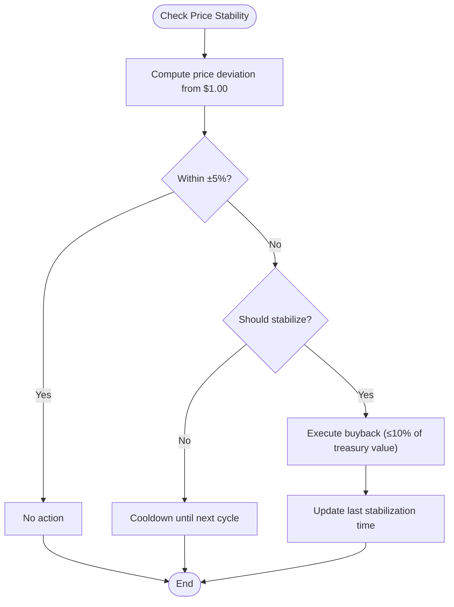
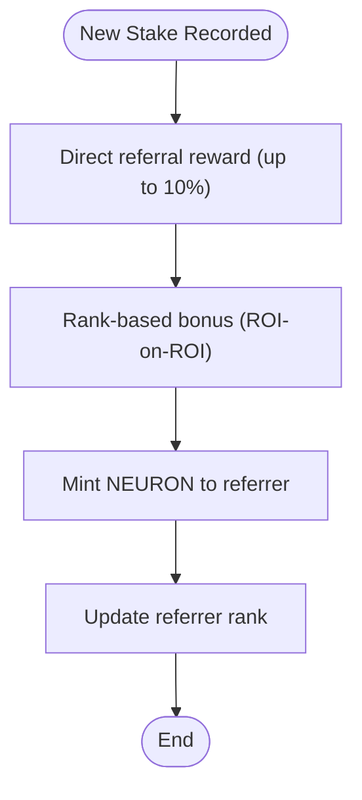
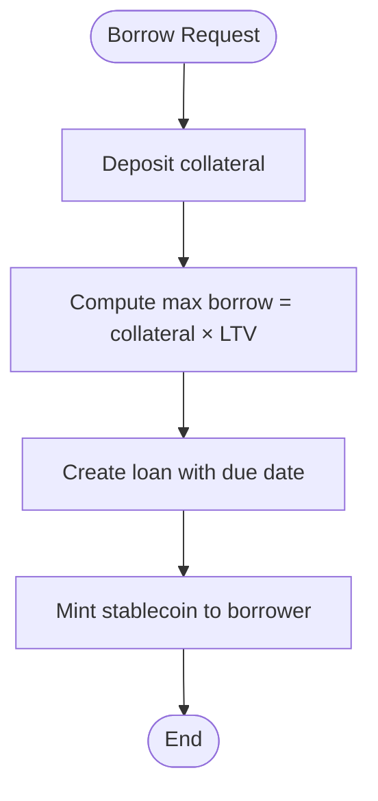
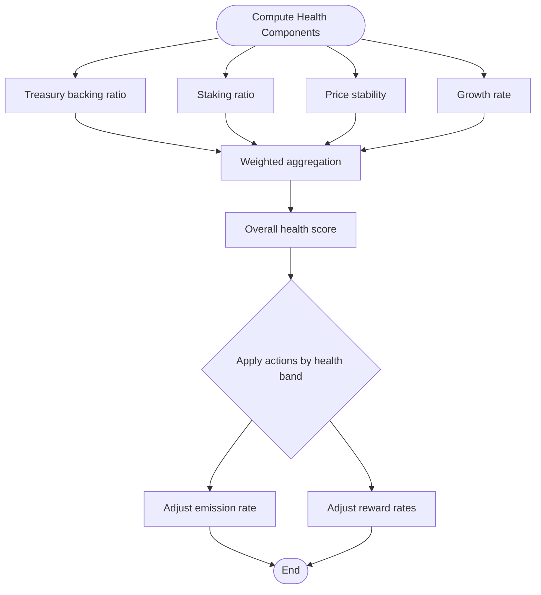
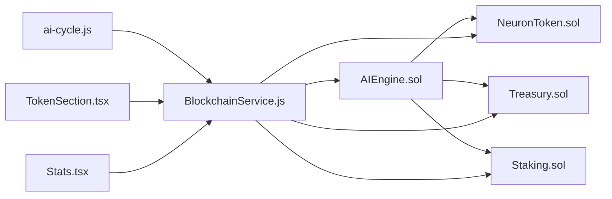

# Mathematical Model and Sustainability Analysis

<cite>
**Referenced Files in This Document**
- [MATHEMATICAL_MODEL.md](file://neurafinance/contracts-v2/MATHEMATICAL_MODEL.md)
- [SUSTAINABILITY_ANALYSIS.md](file://neurafinance/contracts-v2/SUSTAINABILITY_ANALYSIS.md)
- [AIEngine.sol](file://neurafinance/contracts-v2/ai-engine/AIEngine.sol)
- [NeuronToken.sol](file://neurafinance/contracts/core/NeuronToken.sol)
- [Staking.sol](file://neurafinance/contracts/core/Staking.sol)
- [Treasury.sol](file://neurafinance/contracts/core/Treasury.sol)
- [Lending.sol](file://neurafinance/contracts/core/Lending.sol)
- [Referral.sol](file://neurafinance/contracts/core/Referral.sol)
- [ai-cycle.js](file://neurafinance/backend/src/jobs/ai-cycle.js)
- [BlockchainService.js](file://neurafinance/backend/src/services/BlockchainService.js)
- [PriceService.js](file://neurafinance/backend/src/services/PriceService.js)
- [TokenSection.tsx](file://neurafinance/frontend/src/components/TokenSection.tsx)
- [Stats.tsx](file://neurafinance/frontend/src/components/Stats.tsx)
</cite>

## Table of Contents
1. [Introduction](#introduction)
2. [Project Structure](#project-structure)
3. [Core Components](#core-components)
4. [Architecture Overview](#architecture-overview)
5. [Detailed Component Analysis](#detailed-component-analysis)
6. [Dependency Analysis](#dependency-analysis)
7. [Performance Considerations](#performance-considerations)
8. [Troubleshooting Guide](#troubleshooting-guide)
9. [Conclusion](#conclusion)
10. [Appendices](#appendices)

## Introduction
This document presents the mathematical model and sustainability analysis for NeuraFinance’s economic foundations. It explains the tokenomics model, emission mechanics, staking reward calculations, fee distribution, AI-driven parameter adjustments, system health scoring, and long-term viability. It also documents the dynamic emission rate model, adaptive liquidity stabilization, and automated treasury management. The content is structured for both economists and quantitative analysts, using terminology consistent with the codebase such as emission model, supply integrity, adaptive logic, and sustainability analysis.

## Project Structure
NeuraFinance V2 comprises:
- Smart contracts implementing tokenomics, staking, treasury, lending, and referral systems
- An AI engine coordinating emission, liquidity, integrity, and adaptive logic
- Backend services orchestrating periodic AI cycles and blockchain interactions
- Frontend dashboards exposing system statistics and token features

**Diagram sources**
- [AIEngine.sol:17-386](file://neurafinance/contracts-v2/ai-engine/AIEngine.sol#L17-L386)
- [NeuronToken.sol:8-253](file://neurafinance/contracts/core/NeuronToken.sol#L8-L253)
- [Staking.sol:9-261](file://neurafinance/contracts/core/Staking.sol#L9-L261)
- [Treasury.sol:9-196](file://neurafinance/contracts/core/Treasury.sol#L9-L196)
- [Lending.sol:10-308](file://neurafinance/contracts/core/Lending.sol#L10-L308)
- [Referral.sol:8-202](file://neurafinance/contracts/core/Referral.sol#L8-L202)
- [ai-cycle.js:13-177](file://neurafinance/backend/src/jobs/ai-cycle.js#L13-L177)
- [BlockchainService.js:12-216](file://neurafinance/backend/src/services/BlockchainService.js#L12-L216)
- [PriceService.js:4-77](file://neurafinance/backend/src/services/PriceService.js#L4-L77)
- [TokenSection.tsx:28-94](file://neurafinance/frontend/src/components/TokenSection.tsx#L28-L94)
- [Stats.tsx:15-94](file://neurafinance/frontend/src/components/Stats.tsx#L15-L94)

**Section sources**
- [AIEngine.sol:17-386](file://neurafinance/contracts-v2/ai-engine/AIEngine.sol#L17-L386)
- [MATHEMATICAL_MODEL.md:1-364](file://neurafinance/contracts-v2/MATHEMATICAL_MODEL.md#L1-L364)
- [SUSTAINABILITY_ANALYSIS.md:1-399](file://neurafinance/contracts-v2/SUSTAINABILITY_ANALYSIS.md#L1-L399)

## Core Components
- Tokenomics and emission model: controlled emission with health-based adjustments, max supply cap, and treasury-backed rewards
- Staking reward model: compound interest calculation and flexible/bonded staking tiers
- Treasury backing and adaptive liquidity stabilization: buyback/sell mechanics and liquidity management
- Referral system: treasury-funded rewards with rank progression and non-inflationary payouts
- Lending model: conservative LTV, liquidation thresholds, and interest rate mechanics
- AI engine: emission model, adaptive logic, supply integrity guard, and system health scoring

**Section sources**
- [MATHEMATICAL_MODEL.md:53-109](file://neurafinance/contracts-v2/MATHEMATICAL_MODEL.md#L53-L109)
- [SUSTAINABILITY_ANALYSIS.md:16-94](file://neurafinance/contracts-v2/SUSTAINABILITY_ANALYSIS.md#L16-L94)
- [AIEngine.sol:117-386](file://neurafinance/contracts-v2/ai-engine/AIEngine.sol#L117-L386)

## Architecture Overview
NeuraFinance V2 operates on a 12-hour AI cycle orchestrated by the AI Engine. The cycle gathers system metrics, validates supply integrity, adjusts emission rates, stabilizes price, and triggers auto-reinvestments. Backend services poll blockchain state and coordinate keeper-triggered actions.

**Diagram sources**
- [ai-cycle.js:19-85](file://neurafinance/backend/src/jobs/ai-cycle.js#L19-L85)
- [BlockchainService.js:106-152](file://neurafinance/backend/src/services/BlockchainService.js#L106-L152)
- [AIEngine.sol:87-111](file://neurafinance/contracts-v2/ai-engine/AIEngine.sol#L87-L111)
- [AIEngine.sol:117-128](file://neurafinance/contracts-v2/ai-engine/AIEngine.sol#L117-L128)
- [AIEngine.sol:161-180](file://neurafinance/contracts-v2/ai-engine/AIEngine.sol#L161-L180)
- [AIEngine.sol:196-204](file://neurafinance/contracts-v2/ai-engine/AIEngine.sol#L196-L204)
- [AIEngine.sol:210-229](file://neurafinance/contracts-v2/ai-engine/AIEngine.sol#L210-L229)

## Detailed Component Analysis

### Tokenomics Model and Emission Mechanics
- Controlled emission with annual rates decreasing over time and health-based multipliers
- Hard cap on supply and treasury-backed minting to prevent infinite issuance
- Backing ratio targets and circuit breakers to protect system integrity

**Diagram sources**
- [AIEngine.sol:133-155](file://neurafinance/contracts-v2/ai-engine/AIEngine.sol#L133-L155)
- [MATHEMATICAL_MODEL.md:87-109](file://neurafinance/contracts-v2/MATHEMATICAL_MODEL.md#L87-L109)

**Section sources**
- [AIEngine.sol:133-155](file://neurafinance/contracts-v2/ai-engine/AIEngine.sol#L133-L155)
- [MATHEMATICAL_MODEL.md:53-109](file://neurafinance/contracts-v2/MATHEMATICAL_MODEL.md#L53-L109)
- [SUSTAINABILITY_ANALYSIS.md:16-43](file://neurafinance/contracts-v2/SUSTAINABILITY_ANALYSIS.md#L16-L43)

### Staking Reward Model and Optimization
- Compound interest calculation with 12-hour compounding cycles
- Flexible and bonded staking tiers with APYs ranging from 5% to 80%
- Rewards paid from treasury reserves to ensure sustainability

**Diagram sources**
- [Staking.sol:157-166](file://neurafinance/contracts/core/Staking.sol#L157-L166)
- [Staking.sol:119-138](file://neurafinance/contracts/core/Staking.sol#L119-L138)
- [MATHEMATICAL_MODEL.md:28-49](file://neurafinance/contracts-v2/MATHEMATICAL_MODEL.md#L28-L49)

**Section sources**
- [Staking.sol:157-166](file://neurafinance/contracts/core/Staking.sol#L157-L166)
- [Staking.sol:119-138](file://neurafinance/contracts/core/Staking.sol#L119-L138)
- [MATHEMATICAL_MODEL.md:28-49](file://neurafinance/contracts-v2/MATHEMATICAL_MODEL.md#L28-L49)

### Treasury Backing and Adaptive Liquidity Stabilization
- Backing ratio calculation and target metrics
- Adaptive liquidity stabilization via buyback/sell triggers and cooldowns
- Treasury funding for emissions, staking rewards, and buybacks

**Diagram sources**
- [AIEngine.sol:288-300](file://neurafinance/contracts-v2/ai-engine/AIEngine.sol#L288-L300)
- [AIEngine.sol:161-180](file://neurafinance/contracts-v2/ai-engine/AIEngine.sol#L161-L180)
- [MATHEMATICAL_MODEL.md:115-145](file://neurafinance/contracts-v2/MATHEMATICAL_MODEL.md#L115-L145)

**Section sources**
- [AIEngine.sol:288-300](file://neurafinance/contracts-v2/ai-engine/AIEngine.sol#L288-L300)
- [AIEngine.sol:161-180](file://neurafinance/contracts-v2/ai-engine/AIEngine.sol#L161-L180)
- [MATHEMATICAL_MODEL.md:115-145](file://neurafinance/contracts-v2/MATHEMATICAL_MODEL.md#L115-L145)

### Referral System Sustainability
- Treasury-funded rewards with maximum payout limits
- Rank progression with increasing bonuses and governance multipliers
- Non-inflationary payouts to preserve token value

**Diagram sources**
- [Referral.sol:99-119](file://neurafinance/contracts/core/Referral.sol#L99-L119)
- [Referral.sol:121-129](file://neurafinance/contracts/core/Referral.sol#L121-L129)
- [SUSTAINABILITY_ANALYSIS.md:125-149](file://neurafinance/contracts-v2/SUSTAINABILITY_ANALYSIS.md#L125-L149)

**Section sources**
- [Referral.sol:99-119](file://neurafinance/contracts/core/Referral.sol#L99-L119)
- [Referral.sol:121-129](file://neurafinance/contracts/core/Referral.sol#L121-L129)
- [SUSTAINABILITY_ANALYSIS.md:125-149](file://neurafinance/contracts-v2/SUSTAINABILITY_ANALYSIS.md#L125-L149)

### Lending Model and Risk Controls
- Conservative LTV ratios and liquidation thresholds
- Interest rate model based on utilization
- Liquidation mechanics with bonuses and protocol fees

**Diagram sources**
- [Lending.sol:111-155](file://neurafinance/contracts/core/Lending.sol#L111-L155)
- [MATHEMATICAL_MODEL.md:183-226](file://neurafinance/contracts-v2/MATHEMATICAL_MODEL.md#L183-L226)

**Section sources**
- [Lending.sol:111-155](file://neurafinance/contracts/core/Lending.sol#L111-L155)
- [MATHEMATICAL_MODEL.md:183-226](file://neurafinance/contracts-v2/MATHEMATICAL_MODEL.md#L183-L226)

### AI-Driven Parameter Adjustment and System Health Scoring
- Health score weighted by treasury backing, staking ratio, price stability, and growth
- Adaptive logic adjusts emission rates and reward tiers based on health trends
- Supply integrity guard validates mint requests against backing and supply caps

**Diagram sources**
- [AIEngine.sol:234-268](file://neurafinance/contracts-v2/ai-engine/AIEngine.sol#L234-L268)
- [AIEngine.sol:210-229](file://neurafinance/contracts-v2/ai-engine/AIEngine.sol#L210-L229)
- [AIEngine.sol:196-204](file://neurafinance/contracts-v2/ai-engine/AIEngine.sol#L196-L204)

**Section sources**
- [AIEngine.sol:234-268](file://neurafinance/contracts-v2/ai-engine/AIEngine.sol#L234-L268)
- [AIEngine.sol:210-229](file://neurafinance/contracts-v2/ai-engine/AIEngine.sol#L210-L229)
- [AIEngine.sol:196-204](file://neurafinance/contracts-v2/ai-engine/AIEngine.sol#L196-L204)

## Dependency Analysis
The AI Engine coordinates multiple contracts and backend services. Dependencies include:
- AI Engine depends on NeuronToken for mint/burn, Treasury for backing and buybacks, and Staking for global staked metrics
- Backend services depend on AI Engine for health and emission calculations
- Frontend components consume backend metrics for live stats

**Diagram sources**
- [AIEngine.sol:15-309](file://neurafinance/contracts/ai-engine/AIEngine.sol#L15-L309)
- [BlockchainService.js:18-37](file://neurafinance/backend/src/services/BlockchainService.js#L18-L37)
- [ai-cycle.js:19-85](file://neurafinance/backend/src/jobs/ai-cycle.js#L19-L85)

**Section sources**
- [AIEngine.sol:15-309](file://neurafinance/contracts/ai-engine/AIEngine.sol#L15-L309)
- [BlockchainService.js:18-37](file://neurafinance/backend/src/services/BlockchainService.js#L18-L37)
- [ai-cycle.js:19-85](file://neurafinance/backend/src/jobs/ai-cycle.js#L19-L85)

## Performance Considerations
- Gas optimization via batch operations and checkpoint patterns reduces on-chain costs
- Backend cron scheduling ensures predictable 12-hour cycles
- Price service caching minimizes external API calls

[No sources needed since this section provides general guidance]

## Troubleshooting Guide
Common issues and mitigations:
- Emission halted due to backing ratio below minimum: ensure treasury backing meets thresholds
- Price instability triggering buybacks: verify cooldown and treasury availability
- Staking rewards not paid: confirm rewards pool funding and treasury balance
- Referral rewards failing: check mint permissions and stake recording

**Section sources**
- [AIEngine.sol:196-204](file://neurafinance/contracts-v2/ai-engine/AIEngine.sol#L196-L204)
- [AIEngine.sol:161-180](file://neurafinance/contracts-v2/ai-engine/AIEngine.sol#L161-L180)
- [Staking.sol:129-138](file://neurafinance/contracts/core/Staking.sol#L129-L138)
- [Referral.sol:99-119](file://neurafinance/contracts/core/Referral.sol#L99-L119)

## Conclusion
NeuraFinance V2 establishes a robust economic foundation through:
- A controlled emission model with health-based adjustments and hard caps
- Sustainable staking rewards backed by treasury growth
- Adaptive liquidity stabilization and integrity guards
- Transparent system health scoring and AI-driven parameter tuning

The combination of mathematical rigor, adaptive logic, and treasury-backed mechanisms positions the protocol for long-term sustainability.

[No sources needed since this section summarizes without analyzing specific files]

## Appendices

### Practical Examples and Scenario Modeling
- Scenario A: Healthy growth over six months with steady staking and treasury growth
- Scenario B: No new users with withdrawal pressure and reduced emission
- Scenario C: Market crash with panic withdrawals and recovery via buybacks

**Section sources**
- [MATHEMATICAL_MODEL.md:259-311](file://neurafinance/contracts-v2/MATHEMATICAL_MODEL.md#L259-L311)
- [SUSTAINABILITY_ANALYSIS.md:182-246](file://neurafinance/contracts-v2/SUSTAINABILITY_ANALYSIS.md#L182-L246)

### Optimization Algorithms and Constraints
- Emission optimization: minimize emission while maintaining health score above thresholds
- Constraint handling: enforce max supply, backing ratio, and daily mint limits
- Performance metrics: monitor health score, backing ratio, and price deviation

**Section sources**
- [AIEngine.sol:305-323](file://neurafinance/contracts-v2/ai-engine/AIEngine.sol#L305-L323)
- [AIEngine.sol:210-229](file://neurafinance/contracts-v2/ai-engine/AIEngine.sol#L210-L229)
- [SUSTAINABILITY_ANALYSIS.md:316-347](file://neurafinance/contracts-v2/SUSTAINABILITY_ANALYSIS.md#L316-L347)