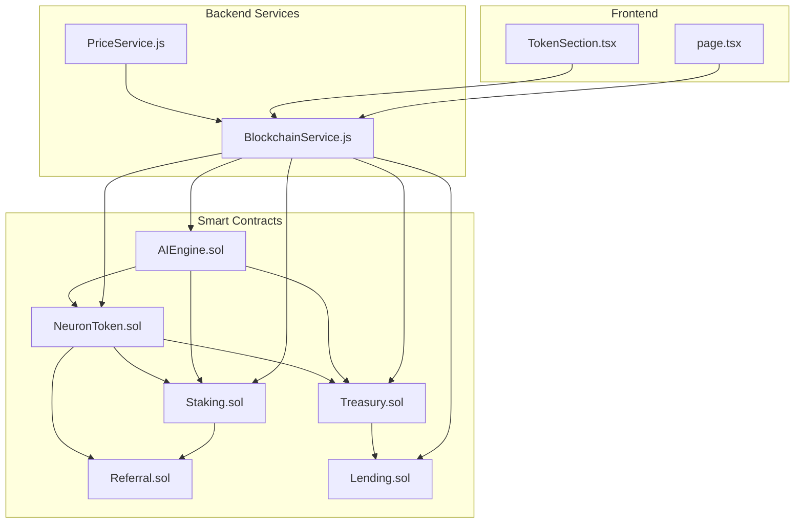
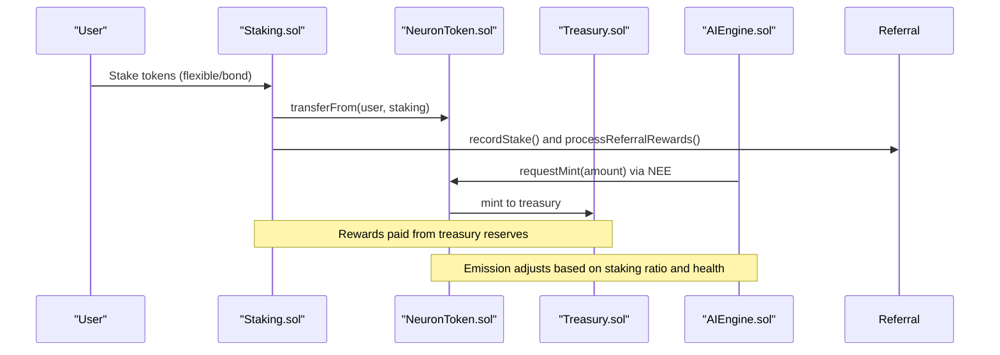
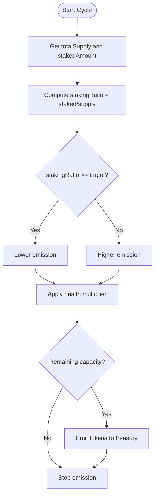
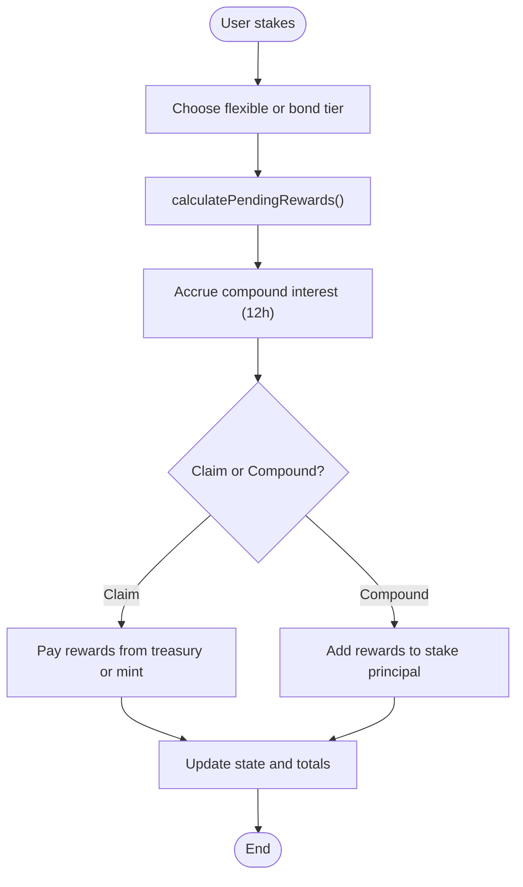
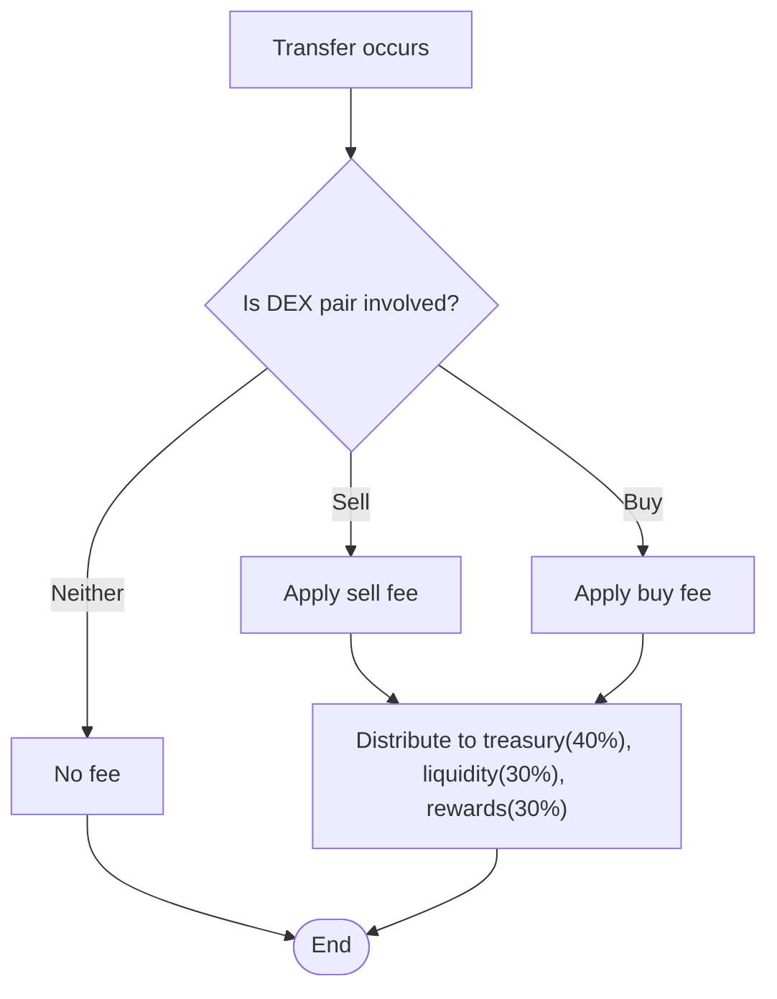
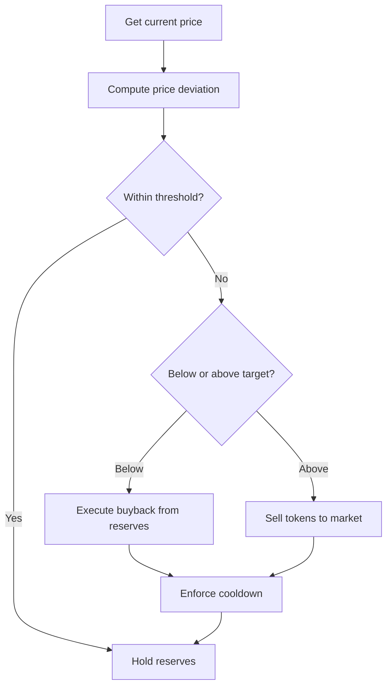
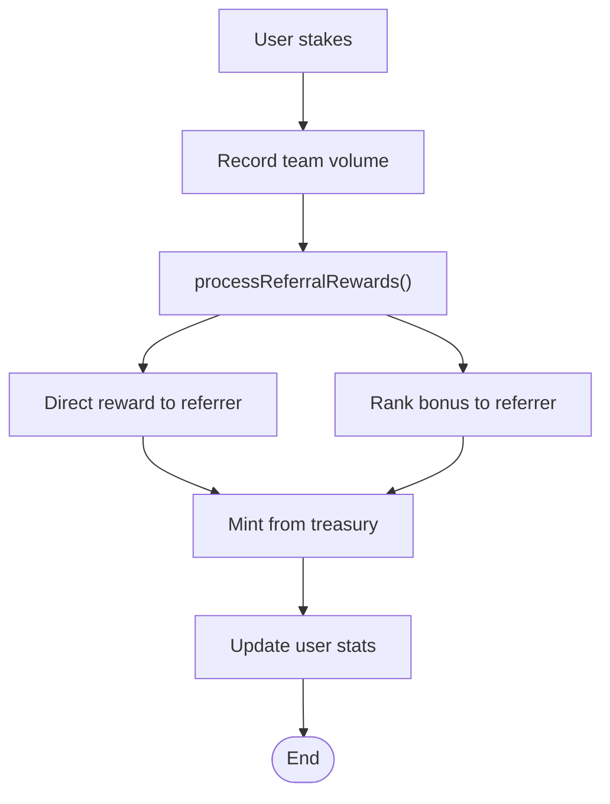
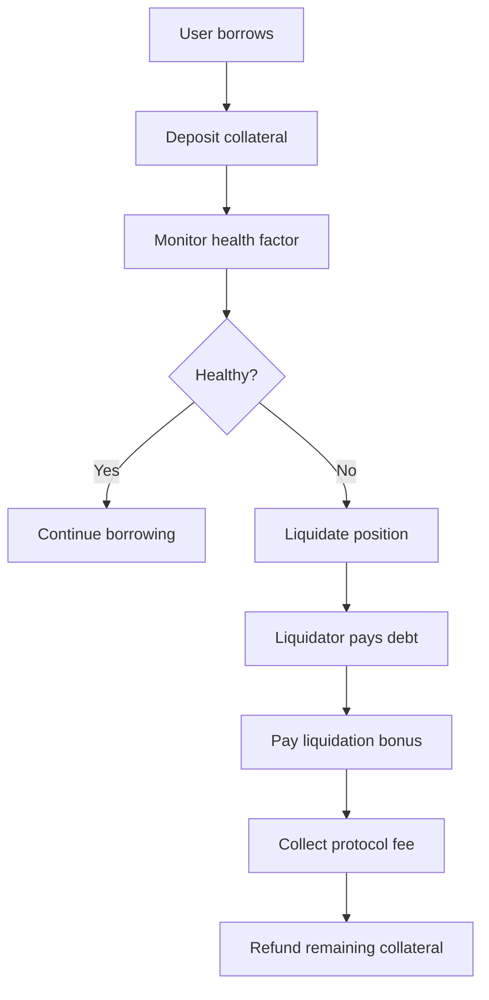
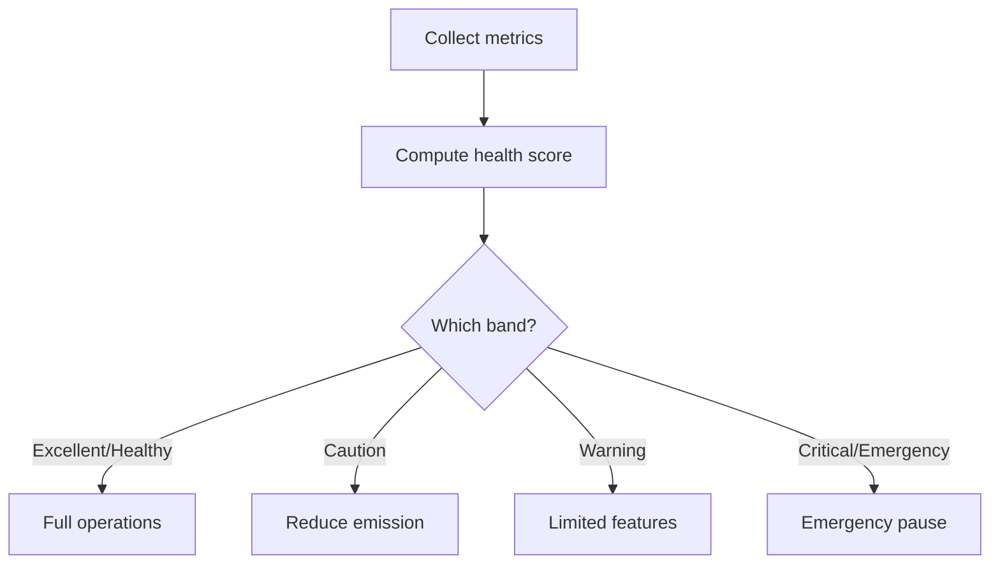
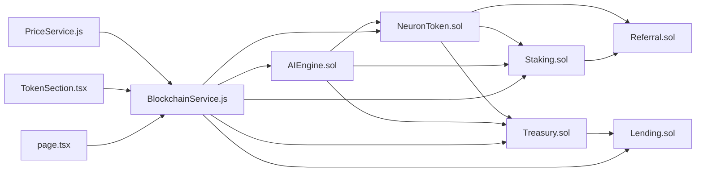

# Tokenomics Model

<cite>
**Referenced Files in This Document**
- [NeuronToken.sol](file://neurafinance/contracts/core/NeuronToken.sol)
- [Staking.sol](file://neurafinance/contracts/core/Staking.sol)
- [Treasury.sol](file://neurafinance/contracts/core/Treasury.sol)
- [Referral.sol](file://neurafinance/contracts/core/Referral.sol)
- [Lending.sol](file://neurafinance/contracts/core/Lending.sol)
- [AIEngine.sol](file://neurafinance/contracts/ai-engine/AIEngine.sol)
- [MATHEMATICAL_MODEL.md](file://neurafinance/contracts-v2/MATHEMATICAL_MODEL.md)
- [SUSTAINABILITY_ANALYSIS.md](file://neurafinance/contracts-v2/SUSTAINABILITY_ANALYSIS.md)
- [Simulation.t.sol](file://neurafinance/contracts-v2/test/Simulation.t.sol)
- [BlockchainService.js](file://neurafinance/backend/src/services/BlockchainService.js)
- [PriceService.js](file://neurafinance/backend/src/services/PriceService.js)
- [TokenSection.tsx](file://neurafinance/frontend/src/components/TokenSection.tsx)
- [page.tsx](file://neurafinance/frontend/src/app/calculator/page.tsx)
</cite>

## Table of Contents
1. [Introduction](#introduction)
2. [Project Structure](#project-structure)
3. [Core Components](#core-components)
4. [Architecture Overview](#architecture-overview)
5. [Detailed Component Analysis](#detailed-component-analysis)
6. [Dependency Analysis](#dependency-analysis)
7. [Performance Considerations](#performance-considerations)
8. [Troubleshooting Guide](#troubleshooting-guide)
9. [Conclusion](#conclusion)
10. [Appendices](#appendices)

## Introduction
This document presents the tokenomics model of NeuraFinance’s economic system. It explains the token supply and emission mechanics, inflation controls, supply cap management, staking reward algorithms, fee distribution across treasury, staking rewards, and referral systems, and the interplay among staking duration, APY tiers, and emission reductions. It also covers token burn and buyback mechanisms, reserve management, economic equilibrium points, deflationary pressures, and market stability indicators. Practical examples illustrate emission curve calculations, stake duration impacts, and supply elasticity under varying market conditions.

## Project Structure
NeuraFinance’s tokenomics spans smart contracts, AI orchestration, backend services, and frontend presentation:
- Core contracts define token mechanics, staking, treasury, lending, and referrals.
- AI Engine coordinates emission, liquidity stabilization, and adaptive logic.
- Backend services query on-chain state and expose tokenomics data to the UI.
- Frontend surfaces token stats, calculators, and educational content.

**Diagram sources**
- [NeuronToken.sol](file://neurafinance/contracts/core/NeuronToken.sol)
- [Staking.sol](file://neurafinance/contracts/core/Staking.sol)
- [Treasury.sol](file://neurafinance/contracts/core/Treasury.sol)
- [Referral.sol](file://neurafinance/contracts/core/Referral.sol)
- [Lending.sol](file://neurafinance/contracts/core/Lending.sol)
- [AIEngine.sol](file://neurafinance/contracts/ai-engine/AIEngine.sol)
- [BlockchainService.js](file://neurafinance/backend/src/services/BlockchainService.js)
- [PriceService.js](file://neurafinance/backend/src/services/PriceService.js)
- [TokenSection.tsx](file://neurafinance/frontend/src/components/TokenSection.tsx)
- [page.tsx](file://neurafinance/frontend/src/app/calculator/page.tsx)

**Section sources**
- [NeuronToken.sol](file://neurafinance/contracts/core/NeuronToken.sol)
- [Staking.sol](file://neurafinance/contracts/core/Staking.sol)
- [Treasury.sol](file://neurafinance/contracts/core/Treasury.sol)
- [Referral.sol](file://neurafinance/contracts/core/Referral.sol)
- [Lending.sol](file://neurafinance/contracts/core/Lending.sol)
- [AIEngine.sol](file://neurafinance/contracts/ai-engine/AIEngine.sol)
- [BlockchainService.js](file://neurafinance/backend/src/services/BlockchainService.js)
- [PriceService.js](file://neurafinance/backend/src/services/PriceService.js)
- [TokenSection.tsx](file://neurafinance/frontend/src/components/TokenSection.tsx)
- [page.tsx](file://neurafinance/frontend/src/app/calculator/page.tsx)

## Core Components
- NeuronToken: Implements token transfers, mint/burn, fee collection, and fee distribution to treasury, liquidity, and rewards recipients.
- Staking: Manages staking positions, calculates pending rewards with compound interest, and handles flexible and locked bonds with tiered APYs.
- Treasury: Holds reserves, executes buybacks, manages liquidity, and enforces thresholds for price stability and reserve allocation.
- Referral: Distributes referral rewards from treasury funds with rank-based bonuses and capped depth.
- Lending: Enables collateralized borrowing with conservative LTV and liquidation mechanics.
- AIEngine: Orchestrates emission, liquidity stabilization, and adaptive logic using system health metrics.

**Section sources**
- [NeuronToken.sol](file://neurafinance/contracts/core/NeuronToken.sol)
- [Staking.sol](file://neurafinance/contracts/core/Staking.sol)
- [Treasury.sol](file://neurafinance/contracts/core/Treasury.sol)
- [Referral.sol](file://neurafinance/contracts/core/Referral.sol)
- [Lending.sol](file://neurafinance/contracts/core/Lending.sol)
- [AIEngine.sol](file://neurafinance/contracts/ai-engine/AIEngine.sol)

## Architecture Overview
The tokenomics architecture integrates on-chain state with AI-driven controls:
- Emission is computed by AIEngine based on staking participation and system health.
- Staking rewards are funded from treasury reserves; emissions mint new tokens to treasury.
- Fees from transfers and liquidity are distributed to treasury, liquidity, and rewards.
- Treasury executes buybacks and liquidity provisioning to stabilize price and backing.
- Referral rewards are minted from treasury, not from newly emitted tokens.

**Diagram sources**
- [Staking.sol](file://neurafinance/contracts/core/Staking.sol)
- [NeuronToken.sol](file://neurafinance/contracts/core/NeuronToken.sol)
- [Treasury.sol](file://neurafinance/contracts/core/Treasury.sol)
- [AIEngine.sol](file://neurafinance/contracts/ai-engine/AIEngine.sol)

## Detailed Component Analysis

### Token Supply and Emission Mechanics
- Supply cap: The token contract defines a maximum supply and enforces minting via an AI Engine validator.
- Emission engine: AIEngine dynamically computes emission based on staking participation and system health, with a target staking ratio and adjustable emission rate.
- Health multiplier: Emission is further scaled by a health multiplier tied to treasury backing ratio.
- Supply elasticity: Emission schedules decrease over time, aligning with sustainability targets.

**Diagram sources**
- [AIEngine.sol](file://neurafinance/contracts/ai-engine/AIEngine.sol)
- [MATHEMATICAL_MODEL.md](file://neurafinance/contracts-v2/MATHEMATICAL_MODEL.md)

**Section sources**
- [NeuronToken.sol](file://neurafinance/contracts/core/NeuronToken.sol)
- [AIEngine.sol](file://neurafinance/contracts/ai-engine/AIEngine.sol)
- [MATHEMATICAL_MODEL.md](file://neurafinance/contracts-v2/MATHEMATICAL_MODEL.md)
- [SUSTAINABILITY_ANALYSIS.md](file://neurafinance/contracts-v2/SUSTAINABILITY_ANALYSIS.md)

### Staking Rewards and APY Tiers
- Reward calculation: Compound interest applied every 12 hours using precise periodic compounding.
- APY tiers: Flexible and four bond durations yield increasing APYs (e.g., 5% to 80%).
- Staking ratio optimization: Emission reduces when staking ratio exceeds target, incentivizing participation; conversely, emission increases when participation is low.

**Diagram sources**
- [Staking.sol](file://neurafinance/contracts/core/Staking.sol)
- [MATHEMATICAL_MODEL.md](file://neurafinance/contracts-v2/MATHEMATICAL_MODEL.md)

**Section sources**
- [Staking.sol](file://neurafinance/contracts/core/Staking.sol)
- [MATHEMATICAL_MODEL.md](file://neurafinance/contracts-v2/MATHEMATICAL_MODEL.md)

### Fee Distribution Mechanics
- Transfer fees: Applied on non-whitelisted transfers; split among treasury, liquidity, and rewards recipients.
- Fee recipients: Treasury, liquidity, and rewards addresses configured centrally.
- Limits and whitelisting: Transaction limits and whitelisted addresses exempt from fees.

**Diagram sources**
- [NeuronToken.sol](file://neurafinance/contracts/core/NeuronToken.sol)

**Section sources**
- [NeuronToken.sol](file://neurafinance/contracts/core/NeuronToken.sol)

### Treasury Backing, Buybacks, and Reserve Management
- Backing ratio: Treasury value divided by (circulating supply × price) drives emission and stability actions.
- Buyback triggers: When price deviates below threshold, treasury executes buybacks subject to cooldown.
- Liquidity provision: Treasury allocates reserves to DEX liquidity pools to support price stability.
- Reserve allocation: Liquidity reserve ratio governs portion reserved for liquidity.

**Diagram sources**
- [Treasury.sol](file://neurafinance/contracts/core/Treasury.sol)
- [MATHEMATICAL_MODEL.md](file://neurafinance/contracts-v2/MATHEMATICAL_MODEL.md)

**Section sources**
- [Treasury.sol](file://neurafinance/contracts/core/Treasury.sol)
- [MATHEMATICAL_MODEL.md](file://neurafinance/contracts-v2/MATHEMATICAL_MODEL.md)

### Referral Rewards and Sustainability
- Reward structure: Direct and rank-based bonuses sourced from treasury, not minted.
- Rank progression: Up to 15 ranks with increasing thresholds and bonus percentages.
- Sustainability: Max payout capped per referral chain; depth limited to reduce systemic risk.

**Diagram sources**
- [Referral.sol](file://neurafinance/contracts/core/Referral.sol)

**Section sources**
- [Referral.sol](file://neurafinance/contracts/core/Referral.sol)
- [SUSTAINABILITY_ANALYSIS.md](file://neurafinance/contracts-v2/SUSTAINABILITY_ANALYSIS.md)

### Lending Risk Controls and Liquidation
- Collateralization: Conservative LTV and liquidation thresholds protect against bad debt.
- Liquidation mechanics: Liquidators receive bonuses; protocol collects fees; borrowers receive remaining collateral.
- Interest model: Utilization-based APR supports sustainable borrowing costs.

**Diagram sources**
- [Lending.sol](file://neurafinance/contracts/core/Lending.sol)

**Section sources**
- [Lending.sol](file://neurafinance/contracts/core/Lending.sol)
- [SUSTAINABILITY_ANALYSIS.md](file://neurafinance/contracts-v2/SUSTAINABILITY_ANALYSIS.md)

### Economic Equilibrium and Stability Indicators
- System health score: Aggregates treasury backing, staking ratio, price stability, and growth rate.
- Health-based actions: Emission scaling, feature availability, and emergency pauses based on health bands.
- Deflationary pressures: Buybacks, burns, and reduced emission when backing falls below thresholds.

**Diagram sources**
- [AIEngine.sol](file://neurafinance/contracts/ai-engine/AIEngine.sol)
- [MATHEMATICAL_MODEL.md](file://neurafinance/contracts-v2/MATHEMATICAL_MODEL.md)

**Section sources**
- [AIEngine.sol](file://neurafinance/contracts/ai-engine/AIEngine.sol)
- [MATHEMATICAL_MODEL.md](file://neurafinance/contracts-v2/MATHEMATICAL_MODEL.md)

## Dependency Analysis
- Staking depends on NeuronToken for transfers and mint/burn; integrates with Referral for reward recording.
- AIEngine orchestrates emission and stability actions across NeuronToken, Treasury, and Staking.
- Backend services depend on contract ABIs to query on-chain tokenomics data.
- Frontend consumes backend APIs to render token stats and calculators.

**Diagram sources**
- [NeuronToken.sol](file://neurafinance/contracts/core/NeuronToken.sol)
- [Staking.sol](file://neurafinance/contracts/core/Staking.sol)
- [Treasury.sol](file://neurafinance/contracts/core/Treasury.sol)
- [Referral.sol](file://neurafinance/contracts/core/Referral.sol)
- [Lending.sol](file://neurafinance/contracts/core/Lending.sol)
- [AIEngine.sol](file://neurafinance/contracts/ai-engine/AIEngine.sol)
- [BlockchainService.js](file://neurafinance/backend/src/services/BlockchainService.js)
- [PriceService.js](file://neurafinance/backend/src/services/PriceService.js)
- [TokenSection.tsx](file://neurafinance/frontend/src/components/TokenSection.tsx)
- [page.tsx](file://neurafinance/frontend/src/app/calculator/page.tsx)

**Section sources**
- [BlockchainService.js](file://neurafinance/backend/src/services/BlockchainService.js)
- [TokenSection.tsx](file://neurafinance/frontend/src/components/TokenSection.tsx)
- [page.tsx](file://neurafinance/frontend/src/app/calculator/page.tsx)

## Performance Considerations
- Gas optimization: Batch operations and checkpoint patterns reduce per-block updates.
- Off-chain caching: PriceService caches results to minimize repeated API calls.
- On-chain efficiency: Precise reward calculations and minimal state writes improve throughput.

[No sources needed since this section provides general guidance]

## Troubleshooting Guide
- Emission not occurring: Verify AIEngine health score and backing ratio; ensure mint requests pass validation.
- Staking rewards not paid: Confirm rewards pool funding and treasury balance; check stake status and claim eligibility.
- Fee distribution anomalies: Validate fee recipients and whitelist status; confirm fee percentages and limits.
- Buyback failures: Check cooldown timers, price thresholds, and treasury reserve availability.

**Section sources**
- [AIEngine.sol](file://neurafinance/contracts/ai-engine/AIEngine.sol)
- [Staking.sol](file://neurafinance/contracts/core/Staking.sol)
- [Treasury.sol](file://neurafinance/contracts/core/Treasury.sol)
- [NeuronToken.sol](file://neurafinance/contracts/core/NeuronToken.sol)

## Conclusion
NeuraFinance’s tokenomics model combines precise emission mathematics, health-based controls, and sustainable fee-driven revenue to maintain long-term viability. The system incentivizes participation through tiered staking APYs, funds rewards from treasury reserves, and stabilizes price through adaptive liquidity mechanisms. With supply caps, deflationary buybacks, and robust risk controls, the model aims for economic equilibrium under normal and stressed market conditions.

[No sources needed since this section summarizes without analyzing specific files]

## Appendices

### Practical Examples

- Emission Curve Calculation
  - Inputs: totalSupply, stakedAmount, targetSupplyRatio, maxEmissionRate, updateInterval.
  - Steps: compute stakingRatio; compare to target; compute base emission per cycle; apply health multiplier; cap at remaining supply.
  - Outcome: emission allocated to treasury to fund rewards and buybacks.

- Stake Duration Impact on Rewards
  - Flexible stake: lower APY; compounded every 12 hours.
  - Bond stakes: 45–360 days with increasing APY tiers; longer locks yield higher effective returns.

- Supply Elasticity Under Market Conditions
  - Rising backing: emission remains at target; system health improves.
  - Declining backing: emission scaled down; potential buybacks activate to restore peg.

**Section sources**
- [AIEngine.sol](file://neurafinance/contracts/ai-engine/AIEngine.sol)
- [Staking.sol](file://neurafinance/contracts/core/Staking.sol)
- [MATHEMATICAL_MODEL.md](file://neurafinance/contracts-v2/MATHEMATICAL_MODEL.md)
- [SUSTAINABILITY_ANALYSIS.md](file://neurafinance/contracts-v2/SUSTAINABILITY_ANALYSIS.md)

### Backend and Frontend Integration
- Backend queries on-chain tokenomics data (supply, staking totals, health metrics) and exposes them to the UI.
- Frontend displays token stats, live calculator insights, and protocol status indicators derived from backend services.

**Section sources**
- [BlockchainService.js](file://neurafinance/backend/src/services/BlockchainService.js)
- [PriceService.js](file://neurafinance/backend/src/services/PriceService.js)
- [TokenSection.tsx](file://neurafinance/frontend/src/components/TokenSection.tsx)
- [page.tsx](file://neurafinance/frontend/src/app/calculator/page.tsx)