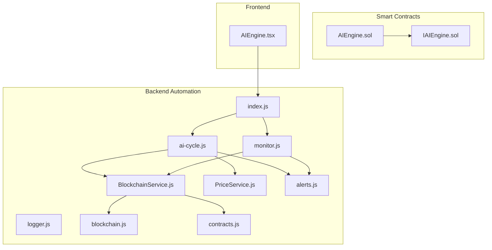
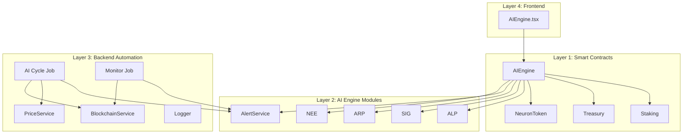
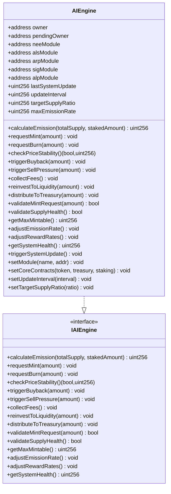
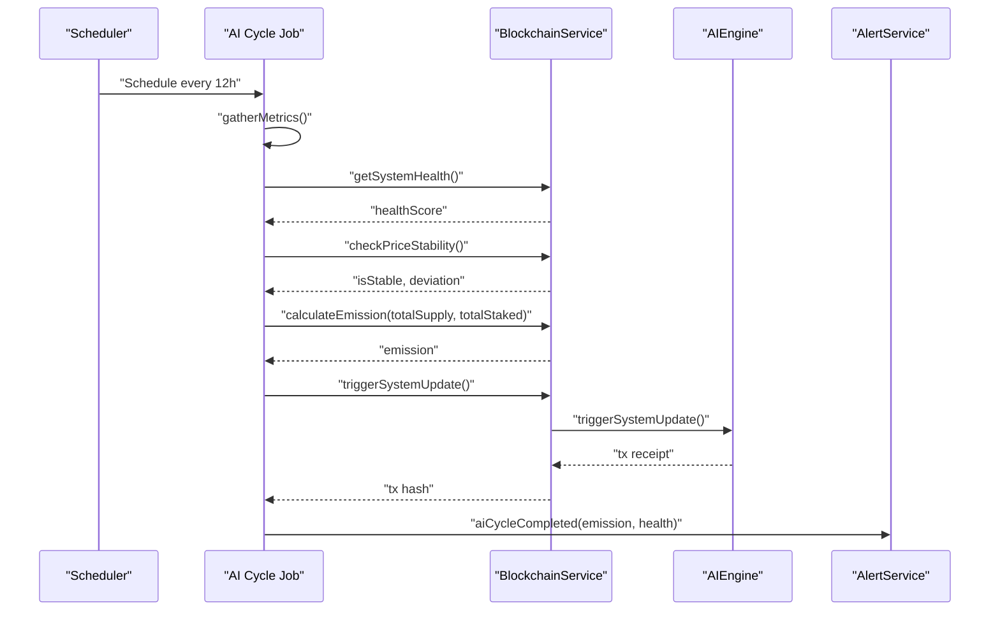
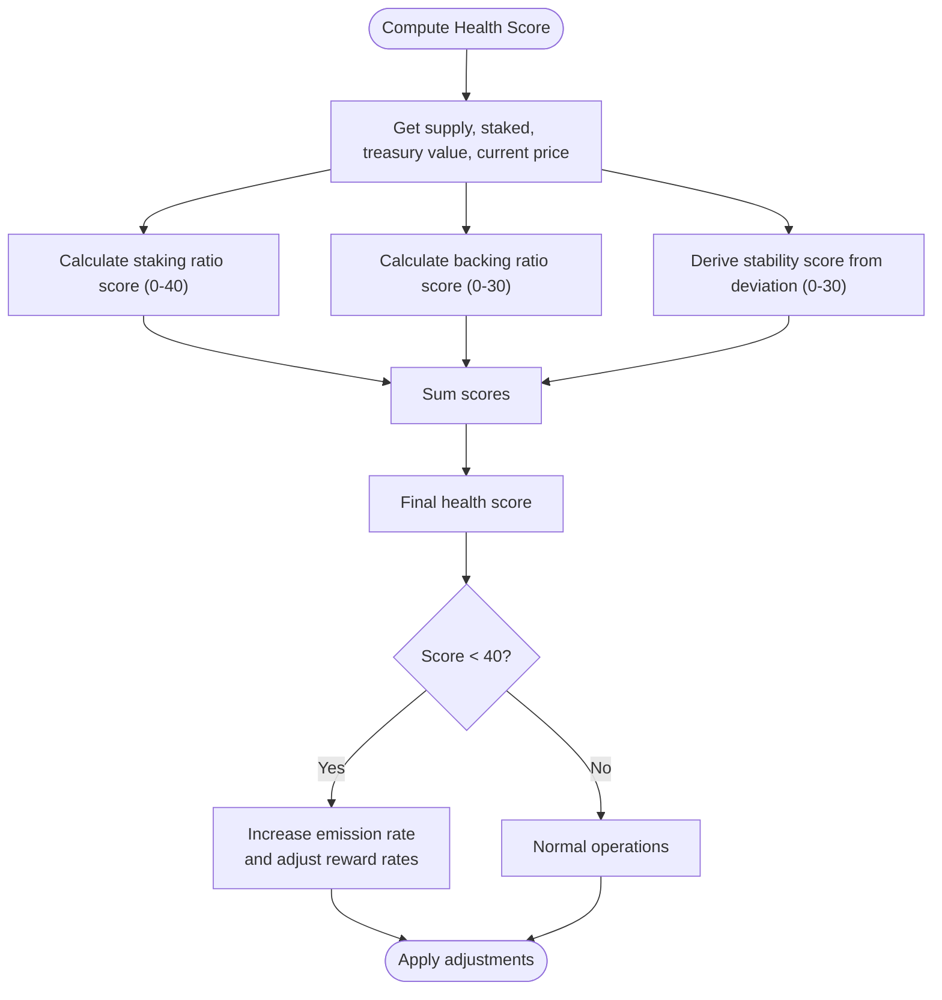
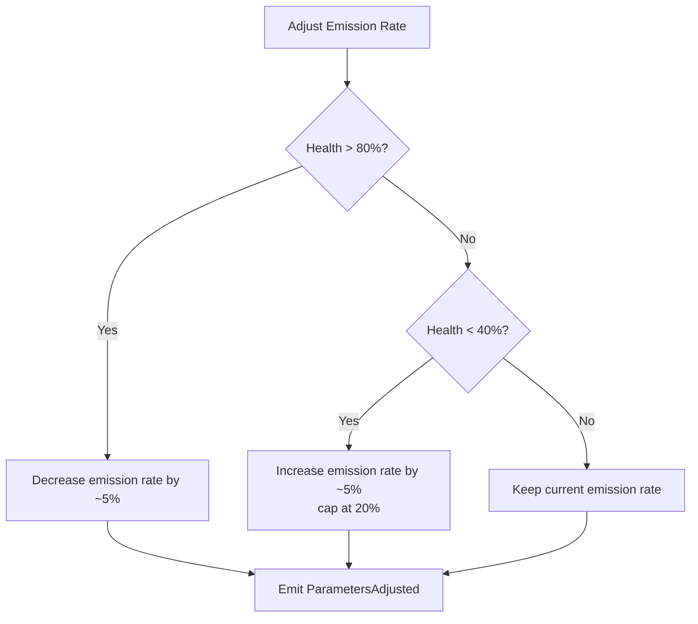
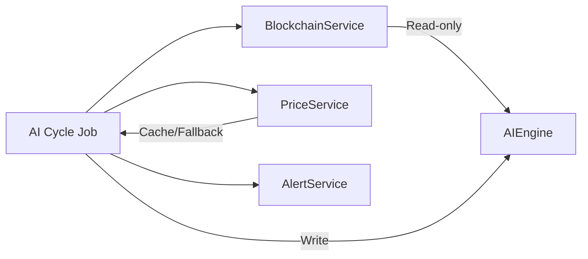
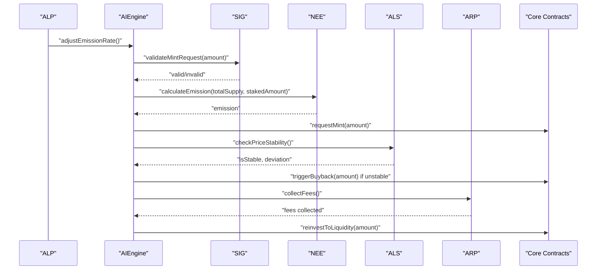
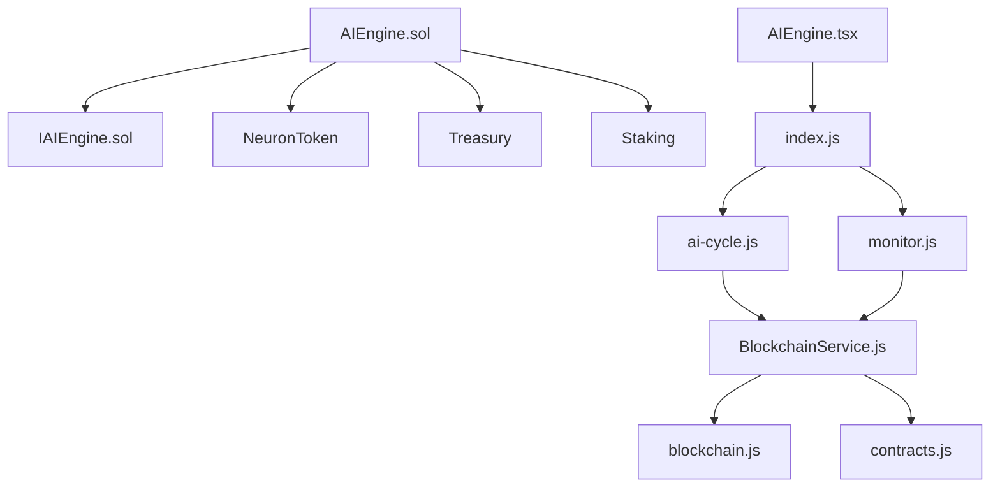

# AI Engine Modules

<cite>
**Referenced Files in This Document**
- [AIEngine.sol](file://neurafinance/contracts/ai-engine/AIEngine.sol)
- [IAIEngine.sol](file://neurafinance/contracts/interfaces/IAIEngine.sol)
- [ARCHITECTURE.md](file://neurafinance/ARCHITECTURE.md)
- [ai-cycle.js](file://neurafinance/backend/src/jobs/ai-cycle.js)
- [monitor.js](file://neurafinance/backend/src/jobs/monitor.js)
- [BlockchainService.js](file://neurafinance/backend/src/services/BlockchainService.js)
- [PriceService.js](file://neurafinance/backend/src/services/PriceService.js)
- [alerts.js](file://neurafinance/backend/src/utils/alerts.js)
- [logger.js](file://neurafinance/backend/src/utils/logger.js)
- [blockchain.js](file://neurafinance/backend/src/config/blockchain.js)
- [contracts.js](file://neurafinance/backend/src/config/contracts.js)
- [index.js](file://neurafinance/backend/src/index.js)
- [AIEngine.tsx](file://neurafinance/frontend/src/components/AIEngine.tsx)
</cite>

## Table of Contents
1. [Introduction](#introduction)
2. [Project Structure](#project-structure)
3. [Core Components](#core-components)
4. [Architecture Overview](#architecture-overview)
5. [Detailed Component Analysis](#detailed-component-analysis)
6. [Dependency Analysis](#dependency-analysis)
7. [Performance Considerations](#performance-considerations)
8. [Troubleshooting Guide](#troubleshooting-guide)
9. [Conclusion](#conclusion)

## Introduction
This document explains the AI Engine modules that orchestrate the DeFi ecosystem. The AI Engine serves as the central coordinator for five specialized AI systems:
- NEE (Neural Emission Engine): Dynamic emission control based on staking participation
- ALS (Adaptive Liquidity Stabilizer): Price stability mechanisms via buybacks and sell pressure
- ARP (Auto Reinvest Protocol): Strategic fee reinvestment into liquidity and treasury
- SIG (Supply Integrity Guard): Security validation for mint requests and supply health
- ALP (Adaptive Logic Predictor): Predictive parameter adjustment based on system health

The system follows a modular architecture enabling independent updates and replacements, with robust monitoring, alerting, and emergency response capabilities. It integrates machine learning insights with real-time decision-making and executes actions through smart contracts.

## Project Structure
The AI Engine spans smart contracts, backend automation, and frontend presentation:

**Diagram sources**
- [AIEngine.sol:15-309](file://neurafinance/contracts/ai-engine/AIEngine.sol#L15-L309)
- [IAIEngine.sol:4-36](file://neurafinance/contracts/interfaces/IAIEngine.sol#L4-L36)
- [index.js:15-165](file://neurafinance/backend/src/index.js#L15-L165)
- [ai-cycle.js:13-161](file://neurafinance/backend/src/jobs/ai-cycle.js#L13-L161)
- [monitor.js:12-125](file://neurafinance/backend/src/jobs/monitor.js#L12-L125)
- [BlockchainService.js:12-216](file://neurafinance/backend/src/services/BlockchainService.js#L12-L216)
- [PriceService.js:4-77](file://neurafinance/backend/src/services/PriceService.js#L4-L77)
- [alerts.js:4-82](file://neurafinance/backend/src/utils/alerts.js#L4-L82)
- [logger.js:1-28](file://neurafinance/backend/src/utils/logger.js#L1-L28)
- [blockchain.js:1-33](file://neurafinance/backend/src/config/blockchain.js#L1-L33)
- [contracts.js:136-145](file://neurafinance/backend/src/config/contracts.js#L136-L145)
- [AIEngine.tsx:39-123](file://neurafinance/frontend/src/components/AIEngine.tsx#L39-L123)

**Section sources**
- [ARCHITECTURE.md:8-130](file://neurafinance/ARCHITECTURE.md#L8-L130)
- [ARCHITECTURE.md:178-194](file://neurafinance/ARCHITECTURE.md#L178-L194)

## Core Components
- AIEngine (smart contract): Orchestrator coordinating all AI modules, exposing module interfaces, and executing actions on core contracts (NeuronToken, Treasury, Staking).
- AI Engine Interfaces: Defines module APIs for NEE, ALS, ARP, SIG, and ALP.
- Backend Jobs: AI Cycle Job runs scheduled system updates; Monitor Job continuously tracks treasury, price, health, and blockchain metrics.
- Services: BlockchainService wraps contract interactions; PriceService provides market data with caching.
- Utilities: AlertService and Logger handle notifications and logging.
- Frontend: AIEngine.tsx presents module descriptions and health indicators.

Key responsibilities:
- Modular orchestration with access control and module address management
- Real-time system health scoring and parameter adjustments
- Automated emission calculations, buybacks, and liquidity reinvestment
- Supply validation and security checks
- Machine learning-informed decisions integrated with smart contract operations

**Section sources**
- [AIEngine.sol:15-309](file://neurafinance/contracts/ai-engine/AIEngine.sol#L15-L309)
- [IAIEngine.sol:4-36](file://neurafinance/contracts/interfaces/IAIEngine.sol#L4-L36)
- [ai-cycle.js:13-161](file://neurafinance/backend/src/jobs/ai-cycle.js#L13-L161)
- [monitor.js:12-125](file://neurafinance/backend/src/jobs/monitor.js#L12-L125)
- [BlockchainService.js:12-216](file://neurafinance/backend/src/services/BlockchainService.js#L12-L216)
- [PriceService.js:4-77](file://neurafinance/backend/src/services/PriceService.js#L4-L77)
- [alerts.js:4-82](file://neurafinance/backend/src/utils/alerts.js#L4-L82)
- [logger.js:1-28](file://neurafinance/backend/src/utils/logger.js#L1-L28)
- [AIEngine.tsx:39-123](file://neurafinance/frontend/src/components/AIEngine.tsx#L39-L123)

## Architecture Overview
The AI Engine operates as a central coordinator with a layered architecture:

**Diagram sources**
- [ARCHITECTURE.md:8-130](file://neurafinance/ARCHITECTURE.md#L8-L130)
- [AIEngine.sol:15-309](file://neurafinance/contracts/ai-engine/AIEngine.sol#L15-L309)
- [ai-cycle.js:13-161](file://neurafinance/backend/src/jobs/ai-cycle.js#L13-L161)
- [monitor.js:12-125](file://neurafinance/backend/src/jobs/monitor.js#L12-L125)
- [BlockchainService.js:12-216](file://neurafinance/backend/src/services/BlockchainService.js#L12-L216)
- [PriceService.js:4-77](file://neurafinance/backend/src/services/PriceService.js#L4-L77)
- [alerts.js:4-82](file://neurafinance/backend/src/utils/alerts.js#L4-L82)
- [AIEngine.tsx:39-123](file://neurafinance/frontend/src/components/AIEngine.tsx#L39-L123)

## Detailed Component Analysis

### AIEngine Orchestration and Module Interfaces
AIEngine implements the IAIEngine interface and coordinates all five modules. It maintains module addresses, enforces access control, and exposes functions for emission calculation, price stability checks, fee collection and reinvestment, supply validation, and system health scoring.

**Diagram sources**
- [AIEngine.sol:15-309](file://neurafinance/contracts/ai-engine/AIEngine.sol#L15-L309)
- [IAIEngine.sol:4-36](file://neurafinance/contracts/interfaces/IAIEngine.sol#L4-L36)

**Section sources**
- [AIEngine.sol:15-309](file://neurafinance/contracts/ai-engine/AIEngine.sol#L15-L309)
- [IAIEngine.sol:4-36](file://neurafinance/contracts/interfaces/IAIEngine.sol#L4-L36)

### AI Cycle Management and Monitoring
The AI Cycle Job runs every 12 hours to gather system metrics, compute health scores, check price stability, calculate emission, trigger system updates, and check for liquidations. The Monitor Job runs every 5 minutes to track treasury TVL, price movements, system health trends, and blockchain block progress.

**Diagram sources**
- [ai-cycle.js:13-85](file://neurafinance/backend/src/jobs/ai-cycle.js#L13-L85)
- [BlockchainService.js:106-143](file://neurafinance/backend/src/services/BlockchainService.js#L106-L143)
- [AIEngine.sol:240-261](file://neurafinance/contracts/ai-engine/AIEngine.sol#L240-L261)

**Section sources**
- [ai-cycle.js:13-161](file://neurafinance/backend/src/jobs/ai-cycle.js#L13-L161)
- [monitor.js:12-125](file://neurafinance/backend/src/jobs/monitor.js#L12-L125)
- [BlockchainService.js:106-143](file://neurafinance/backend/src/services/BlockchainService.js#L106-L143)

### System Health Scoring Methodology
AIEngine computes a composite health score from three dimensions:
- Staking ratio: proportion of supply staked (up to 40 points)
- Treasury backing: treasury value versus supply (up to 30 points)
- Price stability: deviation from target ($1.00) (up to 30 points)

The final score determines parameter adjustments and intervention triggers.

**Diagram sources**
- [AIEngine.sol:202-225](file://neurafinance/contracts/ai-engine/AIEngine.sol#L202-L225)
- [AIEngine.sol:180-200](file://neurafinance/contracts/ai-engine/AIEngine.sol#L180-L200)

**Section sources**
- [AIEngine.sol:202-225](file://neurafinance/contracts/ai-engine/AIEngine.sol#L202-L225)

### Parameter Adjustment Triggers
- Emission rate increases when health falls below 40% and caps at 20%
- Emission rate decreases when health exceeds 80%
- Reward rates adjust based on participation (module-specific logic)
- Price stability triggers buybacks when deviation exceeds thresholds

**Diagram sources**
- [AIEngine.sol:180-194](file://neurafinance/contracts/ai-engine/AIEngine.sol#L180-L194)

**Section sources**
- [AIEngine.sol:180-194](file://neurafinance/contracts/ai-engine/AIEngine.sol#L180-L194)

### Machine Learning Integration and Real-Time Decision Making
- The backend periodically queries system metrics and health from smart contracts.
- PriceService caches market data and falls back to contract-derived prices when APIs fail.
- Alerts are sent via webhook/email for critical events (low health, price deviations, liquidation warnings).
- The AI Cycle simulates ML-driven decisions by invoking AIEngine functions and observing contract reactions.

**Diagram sources**
- [ai-cycle.js:13-85](file://neurafinance/backend/src/jobs/ai-cycle.js#L13-L85)
- [PriceService.js:4-77](file://neurafinance/backend/src/services/PriceService.js#L4-L77)
- [BlockchainService.js:106-143](file://neurafinance/backend/src/services/BlockchainService.js#L106-L143)
- [alerts.js:4-82](file://neurafinance/backend/src/utils/alerts.js#L4-L82)

**Section sources**
- [ai-cycle.js:13-85](file://neurafinance/backend/src/jobs/ai-cycle.js#L13-L85)
- [PriceService.js:4-77](file://neurafinance/backend/src/services/PriceService.js#L4-L77)
- [BlockchainService.js:106-143](file://neurafinance/backend/src/services/BlockchainService.js#L106-L143)
- [alerts.js:4-82](file://neurafinance/backend/src/utils/alerts.js#L4-L82)

### Relationship Between AI Signals and Smart Contract Operations
- AI signals originate from health computations and price stability checks.
- AIEngine validates mint requests (SIG), calculates emissions (NEE), stabilizes price (ALS), and reinvests fees (ARP).
- Operations are executed through core contracts: mint/burn on NeuronToken, buybacks/addLiquidity on Treasury, and staking reward adjustments via Staking.

**Diagram sources**
- [AIEngine.sol:75-97](file://neurafinance/contracts/ai-engine/AIEngine.sol#L75-L97)
- [AIEngine.sol:101-125](file://neurafinance/contracts/ai-engine/AIEngine.sol#L101-L125)
- [AIEngine.sol:129-143](file://neurafinance/contracts/ai-engine/AIEngine.sol#L129-L143)
- [AIEngine.sol:147-176](file://neurafinance/contracts/ai-engine/AIEngine.sol#L147-L176)
- [AIEngine.sol:180-200](file://neurafinance/contracts/ai-engine/AIEngine.sol#L180-L200)

**Section sources**
- [AIEngine.sol:75-97](file://neurafinance/contracts/ai-engine/AIEngine.sol#L75-L97)
- [AIEngine.sol:101-125](file://neurafinance/contracts/ai-engine/AIEngine.sol#L101-L125)
- [AIEngine.sol:129-143](file://neurafinance/contracts/ai-engine/AIEngine.sol#L129-L143)
- [AIEngine.sol:147-176](file://neurafinance/contracts/ai-engine/AIEngine.sol#L147-L176)
- [AIEngine.sol:180-200](file://neurafinance/contracts/ai-engine/AIEngine.sol#L180-L200)

### Emergency Response Protocols
- Low system health (<30): critical alert and potential parameter tightening/incentives
- Price deviation (>5%): automatic buyback via Treasury if stability is compromised
- Liquidation monitoring: backend scans recent loans for health factor breaches and logs warnings
- Treasury thresholds: alerts when TVL drops below configured levels

**Section sources**
- [ai-cycle.js:37-51](file://neurafinance/backend/src/jobs/ai-cycle.js#L37-L51)
- [ai-cycle.js:118-146](file://neurafinance/backend/src/jobs/ai-cycle.js#L118-L146)
- [monitor.js:31-33](file://neurafinance/backend/src/jobs/monitor.js#L31-L33)
- [alerts.js:67-78](file://neurafinance/backend/src/utils/alerts.js#L67-L78)

## Dependency Analysis
The AI Engine relies on well-defined interfaces and services:

**Diagram sources**
- [AIEngine.sol:15-309](file://neurafinance/contracts/ai-engine/AIEngine.sol#L15-L309)
- [IAIEngine.sol:4-36](file://neurafinance/contracts/interfaces/IAIEngine.sol#L4-L36)
- [ai-cycle.js:13-161](file://neurafinance/backend/src/jobs/ai-cycle.js#L13-L161)
- [monitor.js:12-125](file://neurafinance/backend/src/jobs/monitor.js#L12-L125)
- [BlockchainService.js:12-216](file://neurafinance/backend/src/services/BlockchainService.js#L12-L216)
- [blockchain.js:1-33](file://neurafinance/backend/src/config/blockchain.js#L1-L33)
- [contracts.js:136-145](file://neurafinance/backend/src/config/contracts.js#L136-L145)
- [index.js:15-165](file://neurafinance/backend/src/index.js#L15-L165)
- [AIEngine.tsx:39-123](file://neurafinance/frontend/src/components/AIEngine.tsx#L39-L123)

**Section sources**
- [ARCHITECTURE.md:8-130](file://neurafinance/ARCHITECTURE.md#L8-L130)
- [BlockchainService.js:18-37](file://neurafinance/backend/src/services/BlockchainService.js#L18-L37)
- [contracts.js:136-145](file://neurafinance/backend/src/config/contracts.js#L136-L145)

## Performance Considerations
- Batched reads: Metrics gathering uses concurrent promises to minimize latency.
- Caching: PriceService caches results to reduce API calls and fallback overhead.
- Interval tuning: AI cycles run every 12 hours; monitoring runs every 5 minutes to balance responsiveness and cost.
- Gas optimization: Smart contract functions avoid unnecessary state writes; only validated operations are executed.

[No sources needed since this section provides general guidance]

## Troubleshooting Guide
Common issues and resolutions:
- AI Cycle failures: Check backend logs for errors during contract interactions or API unavailability; verify RPC connectivity and private key configuration.
- Health score anomalies: Confirm contract addresses and ABI correctness; ensure module addresses are properly set.
- Price deviation alerts: Validate oracle integration and fallback logic; review price service configuration.
- Treasury TVL alerts: Investigate reserve composition and liquidity provision; confirm Treasury contract permissions.

Operational checks:
- Health endpoint: Use `/health` to verify blockchain connectivity and system health retrieval.
- Metrics endpoint: Use `/api/metrics` to inspect total supply, staked amounts, TVL, price, and health score.
- Manual trigger: Use `/api/admin/ai-cycle` to force-run the AI cycle for diagnostics.

**Section sources**
- [index.js:22-143](file://neurafinance/backend/src/index.js#L22-L143)
- [logger.js:1-28](file://neurafinance/backend/src/utils/logger.js#L1-L28)
- [blockchain.js:1-33](file://neurafinance/backend/src/config/blockchain.js#L1-L33)
- [BlockchainService.js:106-143](file://neurafinance/backend/src/services/BlockchainService.js#L106-L143)

## Conclusion
The AI Engine modules form a cohesive, modular system that balances decentralized control with intelligent automation. Through structured orchestration, health-based parameter adjustments, and real-time monitoring, the system sustains tokenomics, price stability, and protocol security. The frontend provides transparency, while the backend ensures reliability and observability. This architecture supports independent evolution of modules and resilient operation under varying market conditions.