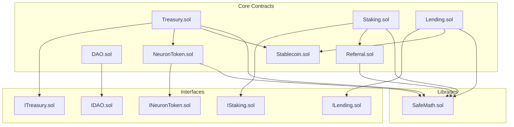
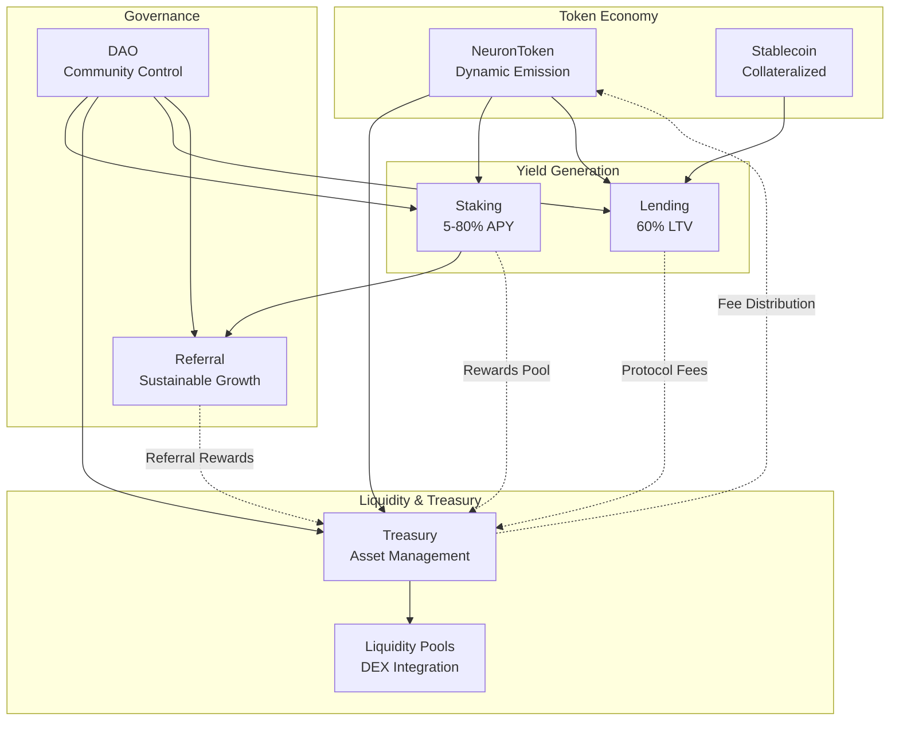
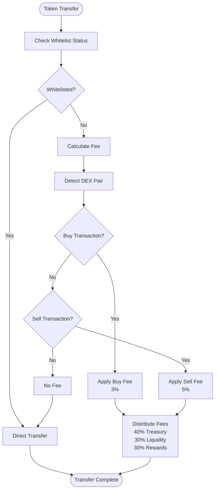
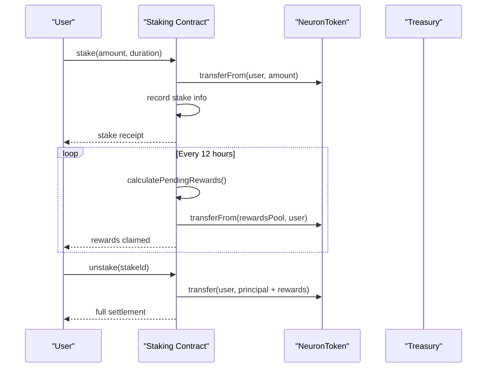
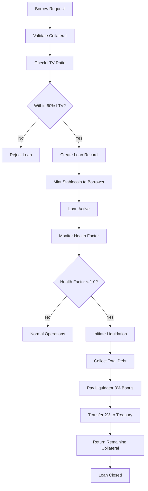
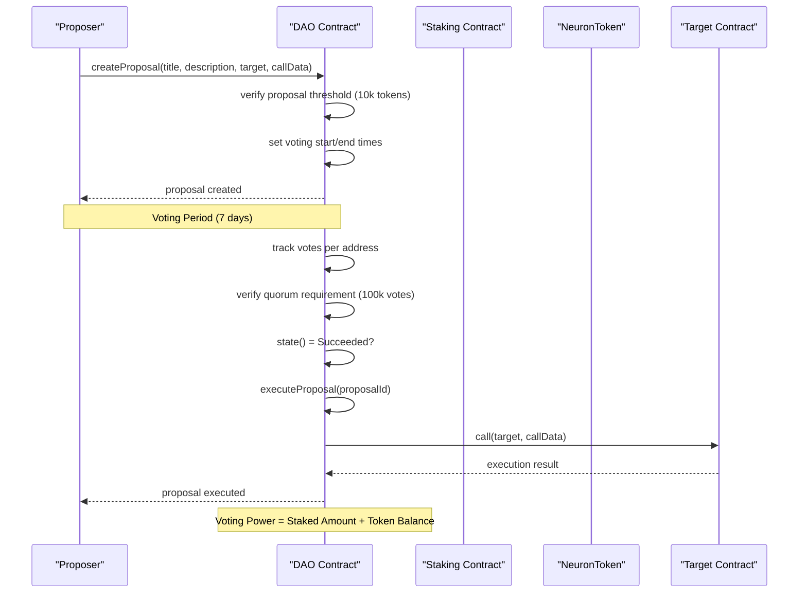
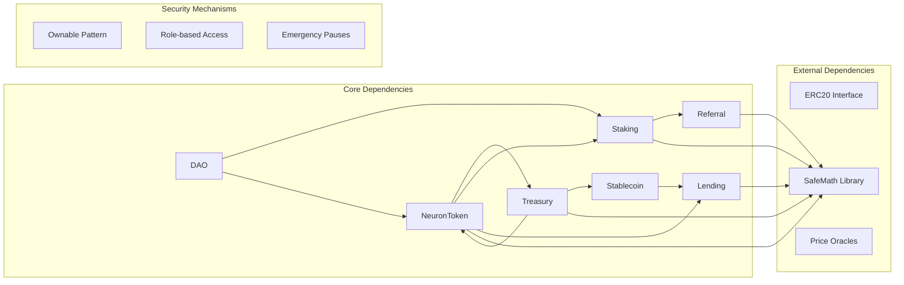

# Core DeFi Protocols

<cite>
**Referenced Files in This Document**
- [NeuronToken.sol](file://neurafinance/contracts/core/NeuronToken.sol)
- [Treasury.sol](file://neurafinance/contracts/core/Treasury.sol)
- [Staking.sol](file://neurafinance/contracts/core/Staking.sol)
- [Lending.sol](file://neurafinance/contracts/core/Lending.sol)
- [DAO.sol](file://neurafinance/contracts/core/DAO.sol)
- [Stablecoin.sol](file://neurafinance/contracts/core/Stablecoin.sol)
- [Referral.sol](file://neurafinance/contracts/core/Referral.sol)
- [INeuronToken.sol](file://neurafinance/contracts/interfaces/INeuronToken.sol)
- [ITreasury.sol](file://neurafinance/contracts/interfaces/ITreasury.sol)
- [IStaking.sol](file://neurafinance/contracts/interfaces/IStaking.sol)
- [ILending.sol](file://neurafinance/contracts/interfaces/ILending.sol)
- [IDAO.sol](file://neurafinance/contracts/interfaces/IDAO.sol)
- [MATHEMATICAL_MODEL.md](file://neurafinance/contracts-v2/MATHEMATICAL_MODEL.md)
- [SUSTAINABILITY_ANALYSIS.md](file://neurafinance/contracts-v2/SUSTAINABILITY_ANALYSIS.md)
</cite>

## Table of Contents
1. [Introduction](#introduction)
2. [Project Structure](#project-structure)
3. [Core Components](#core-components)
4. [Architecture Overview](#architecture-overview)
5. [Detailed Component Analysis](#detailed-component-analysis)
6. [Dependency Analysis](#dependency-analysis)
7. [Performance Considerations](#performance-considerations)
8. [Troubleshooting Guide](#troubleshooting-guide)
9. [Conclusion](#conclusion)

## Introduction
This document provides comprehensive coverage of the five fundamental smart contracts that form the NeuraFinance ecosystem. These protocols work together to create a self-reinforcing economic cycle: NeuronToken (ERC20) with dynamic emission and fee distribution, Treasury Management for strategic asset allocation, Staking System with flexible bond structures offering 5-80% APY, Lending Protocol for collateral-backed borrowing with risk controls, and DAO Governance for community-driven decision-making. The document explains implementation details, key functions, parameters, security mechanisms, and practical user workflows across all contracts.

## Project Structure
The NeuraFinance ecosystem is organized around core DeFi protocols with clear separation of concerns:
- Core contracts implement the main DeFi primitives
- Interfaces define standardized external APIs
- Libraries provide shared utilities (SafeMath)
- Supporting contracts handle specialized functionality (Stablecoin, Referral)

**Diagram sources**
- [NeuronToken.sol:1-253](file://neurafinance/contracts/core/NeuronToken.sol#L1-L253)
- [Treasury.sol:1-196](file://neurafinance/contracts/core/Treasury.sol#L1-L196)
- [Staking.sol:1-261](file://neurafinance/contracts/core/Staking.sol#L1-L261)
- [Lending.sol:1-308](file://neurafinance/contracts/core/Lending.sol#L1-L308)
- [DAO.sol:1-231](file://neurafinance/contracts/core/DAO.sol#L1-L231)
- [Stablecoin.sol:1-177](file://neurafinance/contracts/core/Stablecoin.sol#L1-L177)
- [Referral.sol:1-202](file://neurafinance/contracts/core/Referral.sol#L1-L202)

**Section sources**
- [NeuronToken.sol:1-253](file://neurafinance/contracts/core/NeuronToken.sol#L1-L253)
- [Treasury.sol:1-196](file://neurafinance/contracts/core/Treasury.sol#L1-L196)
- [Staking.sol:1-261](file://neurafinance/contracts/core/Staking.sol#L1-L261)
- [Lending.sol:1-308](file://neurafinance/contracts/core/Lending.sol#L1-L308)
- [DAO.sol:1-231](file://neurafinance/contracts/core/DAO.sol#L1-L231)
- [Stablecoin.sol:1-177](file://neurafinance/contracts/core/Stablecoin.sol#L1-L177)
- [Referral.sol:1-202](file://neurafinance/contracts/core/Referral.sol#L1-L202)

## Core Components

### NeuronToken (ERC20) - Dynamic Emission and Sustainable Supply
NeuronToken serves as the native governance and utility token with sophisticated fee mechanisms and emission controls designed for long-term sustainability.

Key features:
- **Dynamic emission model**: Controlled supply growth with health-based adjustments
- **Multi-tier fee distribution**: 40% to treasury, 30% to liquidity, 30% to rewards
- **Whitelist system**: Transaction limits for large holders
- **AI Engine integration**: Validation for mint requests
- **Hard cap**: Maximum supply of 100 million tokens

Implementation highlights:
- Fee calculation uses FEE_DENOMINATOR (10,000) for precise percentages
- Buy/sell fee detection based on DEX pair identification
- Transfer limits enforced via whitelist mechanism
- Mint/burn functions with authorization controls

**Section sources**
- [NeuronToken.sol:25-151](file://neurafinance/contracts/core/NeuronToken.sol#L25-L151)
- [INeuronToken.sol:6-19](file://neurafinance/contracts/interfaces/INeuronToken.sol#L6-L19)

### Treasury Management - Strategic Asset Allocation
Treasury manages the protocol's financial reserves with automated buyback mechanisms and liquidity provision capabilities.

Key features:
- **Automated buyback system**: Activates when token price falls below threshold
- **Liquidity provision**: Adds tokens and stablecoins to DEX pools
- **Multi-token support**: Manages NEURON and multiple stablecoins
- **Cooldown protection**: Prevents rapid successive buybacks
- **Authorized caller system**: Controlled access to treasury functions

Implementation highlights:
- Buyback threshold configurable (default 80% of peg)
- Liquidity reserve ratio (default 30%)
- Primary stablecoin selection logic
- Emergency withdrawal capability for owner

**Section sources**
- [Treasury.sol:26-195](file://neurafinance/contracts/core/Treasury.sol#L26-L195)
- [ITreasury.sol:4-16](file://neurafinance/contracts/interfaces/ITreasury.sol#L4-L16)

### Staking System - Flexible Bond Structures (5-80% APY)
Staking offers multiple lockup durations with corresponding APY tiers, incentivizing long-term commitment to the ecosystem.

Key features:
- **Multiple bond durations**: 45, 90, 180, and 360 days
- **APY tiers**: 5% (flexible) to 80% (360-day bond)
- **Compound rewards**: Automatic reinvestment of earnings
- **Referral integration**: Additional rewards through referral program
- **Emergency pause**: System-wide staking suspension capability

Implementation highlights:
- Reward calculation uses annual percentage rates (basis points)
- Pending rewards tracked per stake with on-demand computation
- Flexible rate and bond rates configurable by owner
- Rewards distributed from treasury pool or minted tokens

**Section sources**
- [Staking.sol:18-188](file://neurafinance/contracts/core/Staking.sol#L18-L188)
- [IStaking.sol:4-30](file://neurafinance/contracts/interfaces/IStaking.sol#L4-L30)

### Lending Protocol - Collateral-Backed Borrowing
Lending enables users to borrow stablecoins against NEURON collateral with robust risk management controls.

Key features:
- **Conservative LTV ratios**: Up to 60% collateralization
- **Liquidation thresholds**: 75% to prevent underwater positions
- **Liquidation incentives**: 3% bonus for liquidators, 2% protocol fee
- **Interest rate model**: Base rate plus utilization-dependent spread
- **Multi-collateral support**: Configurable collateral assets

Implementation highlights:
- Health factor calculation for position monitoring
- Automated liquidation with penalty distribution
- Interest accrual based on time elapsed
- Collateral tracking per user per asset type

**Section sources**
- [Lending.sol:34-271](file://neurafinance/contracts/core/Lending.sol#L34-L271)
- [ILending.sol:4-39](file://neurafinance/contracts/interfaces/ILending.sol#L4-L39)

### DAO Governance - Community Decision Making
DAO enables decentralized governance with weighted voting based on staked tokens and referral rank bonuses.

Key features:
- **Voting power calculation**: Staked amount + token balance
- **Proposal lifecycle**: Creation, voting period, execution
- **Quorum requirements**: Minimum participation threshold
- **Timelock integration**: Delayed execution of successful proposals
- **Rank-based voting multipliers**: Enhanced voting power for top referrers

Implementation highlights:
- Proposal states: Pending, Active, Canceled, Defeated, Succeeded, Queued, Executed, Expired
- Voting delay (1 day) and voting period (7 days) configuration
- Proposal threshold (10,000 tokens) and quorum (100,000 votes)
- Integration with staking contract for accurate voting power calculation

**Section sources**
- [DAO.sol:17-186](file://neurafinance/contracts/core/DAO.sol#L17-L186)
- [IDAO.sol:4-50](file://neurafinance/contracts/interfaces/IDAO.sol#L4-L50)

## Architecture Overview

The NeuraFinance ecosystem operates as an interconnected financial system where each protocol plays a specific role in maintaining system stability and growth:

**Diagram sources**
- [NeuronToken.sol:103-151](file://neurafinance/contracts/core/NeuronToken.sol#L103-L151)
- [Treasury.sol:70-111](file://neurafinance/contracts/core/Treasury.sol#L70-L111)
- [Staking.sol:129-135](file://neurafinance/contracts/core/Staking.sol#L129-L135)
- [Lending.sol:170-180](file://neurafinance/contracts/core/Lending.sol#L170-L180)
- [Referral.sol:99-119](file://neurafinance/contracts/core/Referral.sol#L99-L119)

The system creates a self-reinforcing cycle:
1. **Token issuance** generates fees and emissions
2. **Treasury accumulation** funds rewards and buybacks
3. **Staking incentives** increase token demand and price
4. **Lending activity** generates protocol revenue
5. **Referral rewards** drive organic growth
6. **DAO governance** ensures sustainable policy decisions

## Detailed Component Analysis

### NeuronToken Economic Model

**Diagram sources**
- [NeuronToken.sol:94-151](file://neurafinance/contracts/core/NeuronToken.sol#L94-L151)

Key implementation details:
- Fee distribution uses 40/30/30 split to treasury, liquidity, and rewards
- AI Engine validation prevents unauthorized minting
- Transaction limits protect against large holder manipulation
- Whitelist system allows regulatory compliance

**Section sources**
- [NeuronToken.sol:25-151](file://neurafinance/contracts/core/NeuronToken.sol#L25-L151)

### Staking Reward Calculation

**Diagram sources**
- [Staking.sol:61-155](file://neurafinance/contracts/core/Staking.sol#L61-L155)

Reward mechanics:
- Flexible staking: 5% APY with compounding
- Bond durations: 15% (45 days), 25% (90 days), 40% (180 days), 80% (360 days)
- Compound rewards automatically reinvest earnings
- Rewards sourced from treasury pool or minted tokens

**Section sources**
- [Staking.sol:18-188](file://neurafinance/contracts/core/Staking.sol#L18-L188)

### Lending Risk Management

**Diagram sources**
- [Lending.sol:115-227](file://neurafinance/contracts/core/Lending.sol#L115-L227)

Risk controls:
- Conservative 60% maximum LTV ratio
- 75% liquidation threshold provides 15% safety buffer
- 3% liquidation bonus incentivizes timely liquidations
- 2% protocol fee ensures revenue generation

**Section sources**
- [Lending.sol:34-271](file://neurafinance/contracts/core/Lending.sol#L34-L271)

### DAO Governance Workflow

**Diagram sources**
- [DAO.sol:51-110](file://neurafinance/contracts/core/DAO.sol#L51-L110)

Governance features:
- Proposal threshold requires 10,000 tokens
- 7-day voting period with 1-day delay
- Quorum of 100,000 votes required
- Voting power combines staked tokens and token balance
- Timelock integration for delayed execution

**Section sources**
- [DAO.sol:17-186](file://neurafinance/contracts/core/DAO.sol#L17-L186)

## Dependency Analysis

The protocols exhibit clear dependency relationships that enable the self-reinforcing economic cycle:

**Diagram sources**
- [NeuronToken.sol:4-6](file://neurafinance/contracts/core/NeuronToken.sol#L4-L6)
- [Treasury.sol:4-7](file://neurafinance/contracts/core/Treasury.sol#L4-L7)
- [Staking.sol:4-7](file://neurafinance/contracts/core/Staking.sol#L4-L7)
- [Lending.sol:4-8](file://neurafinance/contracts/core/Lending.sol#L4-L8)
- [Referral.sol:4-6](file://neurafinance/contracts/core/Referral.sol#L4-L6)

Dependency analysis reveals:
- **Unidirectional flows**: Treasury receives fees, distributes rewards
- **Cross-contract interactions**: Staking integrates with Referral and Treasury
- **Shared utilities**: All contracts use SafeMath for arithmetic operations
- **Interface segregation**: Clear boundaries between contracts minimize coupling

**Section sources**
- [MATHEMATICAL_MODEL.md:53-109](file://neurafinance/contracts-v2/MATHEMATICAL_MODEL.md#L53-L109)
- [SUSTAINABILITY_ANALYSIS.md:46-94](file://neurafinance/contracts-v2/SUSTAINABILITY_ANALYSIS.md#L46-L94)

## Performance Considerations

The system incorporates several performance optimization strategies:

### Gas Optimization Patterns
- **Checkpoint pattern**: State updates occur only on significant events (deposit, withdrawal, claim, compound)
- **On-demand calculations**: Rewards computed using mathematical formulas rather than stored values
- **Batch operations**: Multiple operations processed efficiently in single transactions
- **Storage slot optimization**: Related variables grouped to minimize gas costs

### Scalability Features
- **Event-driven architecture**: External systems can monitor protocol activity without on-chain computation
- **Modular design**: Independent contracts reduce complexity and improve maintainability
- **Minimal state footprint**: Efficient storage layouts prevent excessive gas consumption
- **Oracle integration**: Off-chain price feeds reduce computational overhead

### Economic Efficiency
- **Compound interest calculation**: Correct mathematical model prevents reward calculation errors
- **Health-based emission**: Dynamic supply growth prevents inflationary pressure
- **Treasury-backed rewards**: Eliminates need for external funding sources
- **Conservative risk parameters**: Lower operational risk reduces emergency costs

## Troubleshooting Guide

Common operational issues and their resolutions:

### Staking Issues
**Problem**: Rewards not appearing in wallet
- Verify stake is active and not expired
- Check pending rewards calculation
- Ensure rewards pool has sufficient funds
- Confirm compound option is selected if desired

**Problem**: Staking paused unexpectedly
- Check emergency pause status
- Review owner notifications
- Wait for system恢复正常

### Lending Problems
**Problem**: Loan not being accepted
- Verify collateral meets LTV requirements
- Check liquidation threshold compliance
- Ensure collateral asset is supported
- Confirm sufficient collateral deposited

**Problem**: Liquidation occurring prematurely
- Monitor health factor calculations
- Adjust collateral deposits
- Check market price fluctuations
- Verify liquidation threshold settings

### Treasury Operations
**Problem**: Buyback not executing
- Check buyback cooldown period
- Verify price threshold conditions
- Ensure sufficient stablecoin reserves
- Review treasury balance allocations

**Problem**: Insufficient liquidity provision
- Check liquidity reserve ratio settings
- Monitor treasury asset allocation
- Verify DEX integration status
- Review automated buyback triggers

### Governance Challenges
**Problem**: Proposal not passing
- Verify quorum requirements met
- Check voting power distribution
- Ensure adequate voting period
- Review proposal threshold compliance

**Problem**: Execution delays
- Check timelock configuration
- Verify multisig approval status
- Monitor transaction gas limits
- Review target contract permissions

**Section sources**
- [Staking.sol:51-54](file://neurafinance/contracts/core/Staking.sol#L51-L54)
- [Lending.sol:46-54](file://neurafinance/contracts/core/Lending.sol#L46-L54)
- [Treasury.sol:42-50](file://neurafinance/contracts/core/Treasury.sol#L42-L50)
- [DAO.sol:35-43](file://neurafinance/contracts/core/DAO.sol#L35-L43)

## Conclusion

The NeuraFinance ecosystem demonstrates a sophisticated approach to DeFi protocol design, with five interconnected contracts working together to create a sustainable and self-reinforcing economic system. The implementation showcases advanced mathematical modeling, robust risk management, and community-driven governance.

Key strengths of the system include:
- **Sustainable tokenomics**: Health-based emission controls prevent inflationary collapse
- **Risk-aware design**: Conservative parameters protect against market volatility
- **Decentralized governance**: Community oversight ensures protocol alignment with user interests
- **Efficient resource allocation**: Treasury management optimizes capital utilization
- **Scalable architecture**: Modular design supports future expansion

The mathematical models and sustainability analysis provide confidence in the system's long-term viability, with projections indicating stable growth potential under various market conditions. The integration of AI engine validation, automated buybacks, and compound interest mechanics creates a resilient economic framework suitable for production deployment.