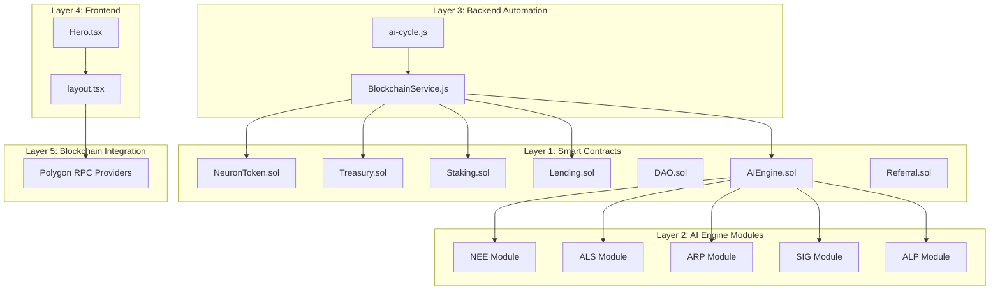
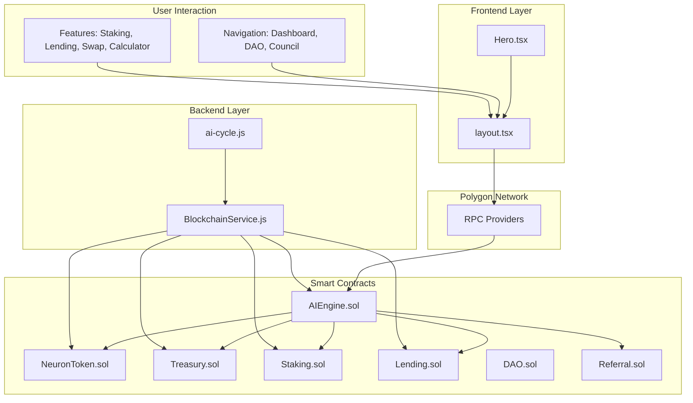
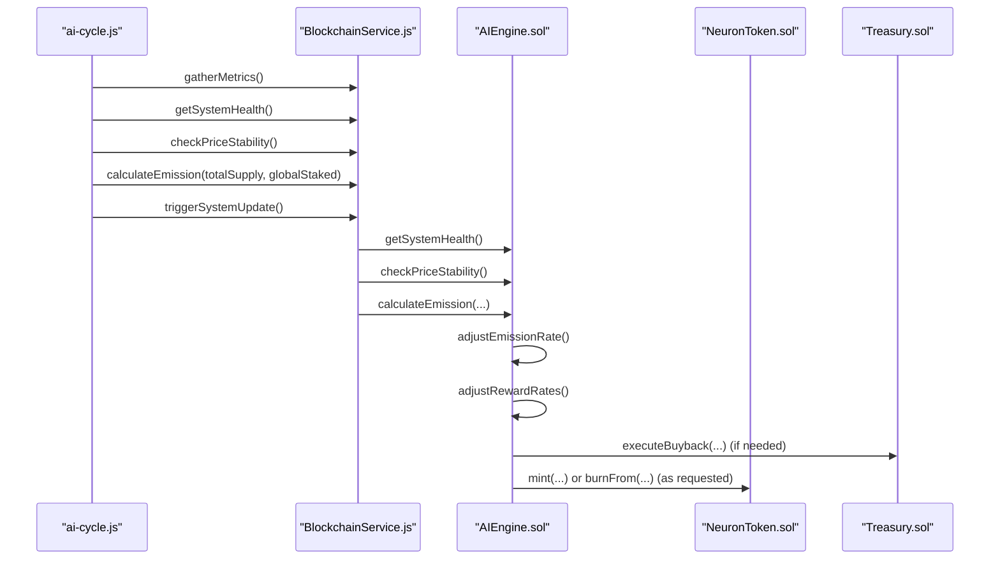
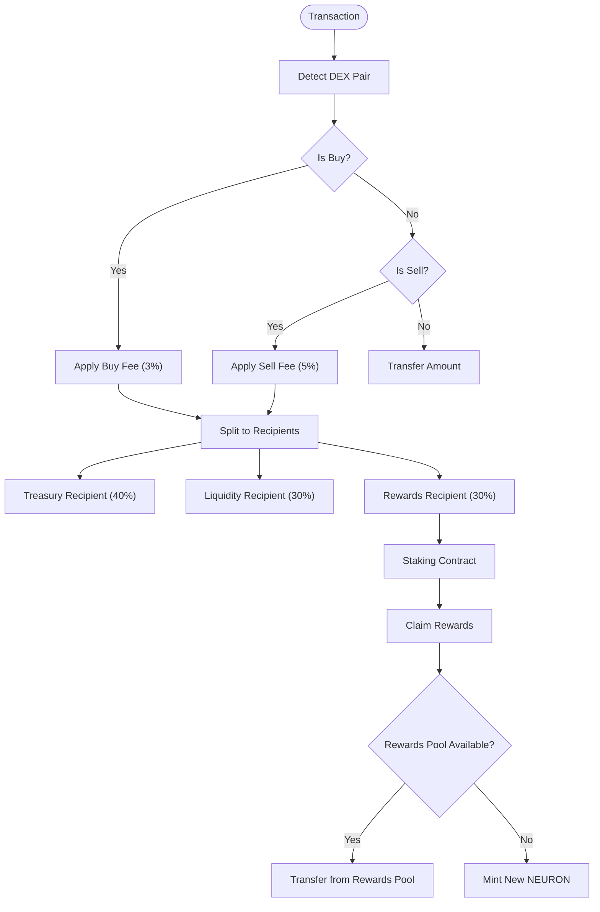
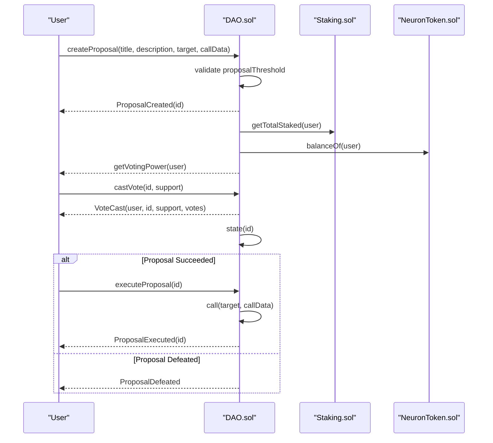
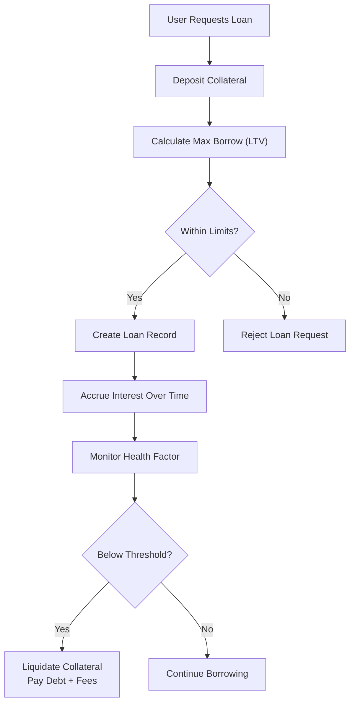
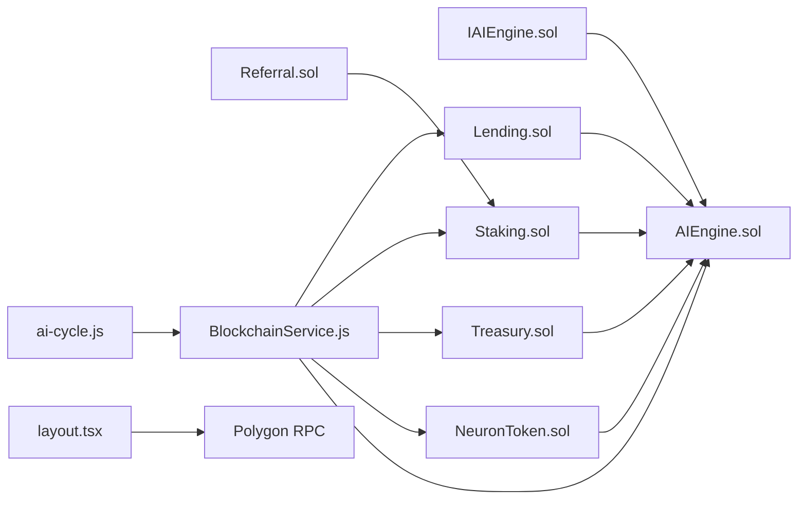

# Project Overview

<cite>
**Referenced Files in This Document**
- [ARCHITECTURE.md](file://neurafinance/ARCHITECTURE.md)
- [AUDIT_REPORT.md](file://neurafinance/AUDIT_REPORT.md)
- [NeuronToken.sol](file://neurafinance/contracts/core/NeuronToken.sol)
- [AIEngine.sol](file://neurafinance/contracts/ai-engine/AIEngine.sol)
- [Treasury.sol](file://neurafinance/contracts/core/Treasury.sol)
- [DAO.sol](file://neurafinance/contracts/core/DAO.sol)
- [Staking.sol](file://neurafinance/contracts/core/Staking.sol)
- [Lending.sol](file://neurafinance/contracts/core/Lending.sol)
- [Referral.sol](file://neurafinance/contracts/core/Referral.sol)
- [IAIEngine.sol](file://neurafinance/contracts/interfaces/IAIEngine.sol)
- [Hero.tsx](file://neurafinance/frontend/src/components/Hero.tsx)
- [layout.tsx](file://neurafinance/frontend/src/app/layout.tsx)
- [BlockchainService.js](file://neurafinance/backend/src/services/BlockchainService.js)
- [ai-cycle.js](file://neurafinance/backend/src/jobs/ai-cycle.js)
- [package.json](file://neurafinance/backend/package.json)
</cite>

## Table of Contents
1. [Introduction](#introduction)
2. [Project Structure](#project-structure)
3. [Core Components](#core-components)
4. [Architecture Overview](#architecture-overview)
5. [Detailed Component Analysis](#detailed-component-analysis)
6. [Dependency Analysis](#dependency-analysis)
7. [Performance Considerations](#performance-considerations)
8. [Troubleshooting Guide](#troubleshooting-guide)
9. [Conclusion](#conclusion)

## Introduction
NeuraFinance is an AI-driven Decentralized Finance (DeFi) ecosystem built on Polygon. It aims to deliver a sustainable tokenomics model through intelligent automation, community governance, and multi-layered orchestration across smart contracts, backend automation, and a modern web interface. The platform centers around the NeuronToken (NEURON), an ERC-20 with dynamic fees and mint/burn mechanisms, and the AI Engine, which coordinates five specialized modules (NEE, ALS, ARP, SIG, ALP) to regulate emissions, stabilize price, reinvest fees, validate supply, and predict system health.

The ecosystem’s value proposition combines:
- Sustainable tokenomics with dynamic emission tied to staking participation
- Intelligent treasury management via automated buybacks and liquidity provisioning
- Community governance through a decentralized autonomous organization (DAO)
- A layered architecture enabling autonomous operation with human oversight

## Project Structure
NeuraFinance is organized into five distinct layers:
- Layer 1: Smart Contracts (core protocols and token)
- Layer 2: AI Engine Modules (orchestrated by the AI Engine)
- Layer 3: Backend Automation (Node.js jobs and services)
- Layer 4: Frontend Web Application (Next.js + React)
- Layer 5: Blockchain Integration (Polygon RPC providers)

**Diagram sources**
- [ARCHITECTURE.md:1-130](file://neurafinance/ARCHITECTURE.md#L1-L130)
- [AIEngine.sol:15-309](file://neurafinance/contracts/ai-engine/AIEngine.sol#L15-L309)
- [BlockchainService.js:12-216](file://neurafinance/backend/src/services/BlockchainService.js#L12-L216)
- [ai-cycle.js:13-177](file://neurafinance/backend/src/jobs/ai-cycle.js#L13-L177)
- [Hero.tsx:6-127](file://neurafinance/frontend/src/components/Hero.tsx#L6-L127)
- [layout.tsx:16-35](file://neurafinance/frontend/src/app/layout.tsx#L16-L35)

**Section sources**
- [ARCHITECTURE.md:1-130](file://neurafinance/ARCHITECTURE.md#L1-L130)

## Core Components
- NeuronToken (NEURON): ERC-20 with dynamic buy/sell fees, mint/burn capabilities, and fee distribution to Treasury, Liquidity, and Rewards. Supports whitelisting, max transaction limits, and AI Engine validation for minting.
- AI Engine: Central orchestrator coordinating NEE (Neural Emission Engine), ALS (Adaptive Liquidity Stabilizer), ARP (Auto Reinvest Protocol), SIG (Supply Integrity Guard), and ALP (Adaptive Logic Predictor).
- Treasury Management: Automated buybacks, liquidity provisioning, and valuation logic; integrates with token price and stablecoin reserves.
- Staking: Flexible and bonded staking with tiered APYs, reward calculation, and optional compounding; integrates with referral rewards.
- Lending: Collateralized borrowing with configurable LTV, interest accrual, and liquidation mechanics; transfers interest to Treasury.
- Referral System: Multi-level rewards with 15 ranks and ROI-on-ROI bonuses; incentivizes growth via minting NEURON.
- DAO: Governance for proposals, voting, and execution; ties voting power to staked and held tokens.

**Section sources**
- [NeuronToken.sol:8-253](file://neurafinance/contracts/core/NeuronToken.sol#L8-L253)
- [AIEngine.sol:15-309](file://neurafinance/contracts/ai-engine/AIEngine.sol#L15-L309)
- [Treasury.sol:9-196](file://neurafinance/contracts/core/Treasury.sol#L9-L196)
- [Staking.sol:9-261](file://neurafinance/contracts/core/Staking.sol#L9-L261)
- [Lending.sol:10-308](file://neurafinance/contracts/core/Lending.sol#L10-L308)
- [Referral.sol:8-202](file://neurafinance/contracts/core/Referral.sol#L8-L202)
- [DAO.sol:9-231](file://neurafinance/contracts/core/DAO.sol#L9-L231)

## Architecture Overview
The system operates on a five-layer model:
- Layer 1: Smart contracts encapsulate tokenomics, treasury, staking, lending, DAO, and AI coordination.
- Layer 2: AI Engine modules implement autonomous logic for emissions, liquidity, fee reinvestment, supply validation, and system health prediction.
- Layer 3: Backend automation runs scheduled jobs to gather metrics, evaluate health, and trigger system updates on-chain.
- Layer 4: Frontend provides user dashboards, staking, lending, governance, and analytics.
- Layer 5: Polygon RPC providers enable secure, multi-provider connectivity for transactions and reads.

**Diagram sources**
- [ARCHITECTURE.md:1-130](file://neurafinance/ARCHITECTURE.md#L1-L130)
- [layout.tsx:16-35](file://neurafinance/frontend/src/app/layout.tsx#L16-L35)
- [Hero.tsx:6-127](file://neurafinance/frontend/src/components/Hero.tsx#L6-L127)
- [BlockchainService.js:12-216](file://neurafinance/backend/src/services/BlockchainService.js#L12-L216)
- [ai-cycle.js:13-177](file://neurafinance/backend/src/jobs/ai-cycle.js#L13-L177)
- [AIEngine.sol:15-309](file://neurafinance/contracts/ai-engine/AIEngine.sol#L15-L309)
- [NeuronToken.sol:8-253](file://neurafinance/contracts/core/NeuronToken.sol#L8-L253)
- [Treasury.sol:9-196](file://neurafinance/contracts/core/Treasury.sol#L9-L196)
- [Staking.sol:9-261](file://neurafinance/contracts/core/Staking.sol#L9-L261)
- [Lending.sol:10-308](file://neurafinance/contracts/core/Lending.sol#L10-L308)
- [DAO.sol:9-231](file://neurafinance/contracts/core/DAO.sol#L9-L231)
- [Referral.sol:8-202](file://neurafinance/contracts/core/Referral.sol#L8-L202)

## Detailed Component Analysis

### AI Engine Orchestration
The AI Engine coordinates five modules:
- NEE: Calculates emission based on staking ratio and requests mint/burn actions.
- ALS: Monitors price stability and triggers buybacks or sell pressure.
- ARP: Collects fees and reinvests into liquidity and treasury.
- SIG: Validates mint requests against max supply and treasury backing.
- ALP: Adjusts system parameters based on health scores.

**Diagram sources**
- [ai-cycle.js:19-85](file://neurafinance/backend/src/jobs/ai-cycle.js#L19-L85)
- [BlockchainService.js:106-152](file://neurafinance/backend/src/services/BlockchainService.js#L106-L152)
- [AIEngine.sol:75-261](file://neurafinance/contracts/ai-engine/AIEngine.sol#L75-L261)
- [Treasury.sol:80-97](file://neurafinance/contracts/core/Treasury.sol#L80-L97)
- [NeuronToken.sol:160-172](file://neurafinance/contracts/core/NeuronToken.sol#L160-L172)

**Section sources**
- [AIEngine.sol:15-309](file://neurafinance/contracts/ai-engine/AIEngine.sol#L15-L309)
- [IAIEngine.sol:4-36](file://neurafinance/contracts/interfaces/IAIEngine.sol#L4-L36)
- [AUDIT_REPORT.md:86-152](file://neurafinance/AUDIT_REPORT.md#L86-L152)

### Tokenomics and Treasury Management
- Tokenomics: Initial supply 10M NEURON, max 100M; dynamic emission based on staking ratio; buy fee 3% (40% Treasury, 30% Liquidity, 30% Rewards); sell fee 5%.
- Treasury: Manages reserves, executes buybacks, adds liquidity, and provides valuation; currently uses a mock price oracle in contracts.
- Staking: Tiered APYs; rewards distributed either from a rewards pool or minted via controlled emission; compounding increases principal without minting causing accounting drift.
- Referral: ROI-on-ROI rewards via minting NEURON; pyramid structure mathematically unsustainable.

**Diagram sources**
- [NeuronToken.sol:130-151](file://neurafinance/contracts/core/NeuronToken.sol#L130-L151)
- [Staking.sol:119-138](file://neurafinance/contracts/core/Staking.sol#L119-L138)
- [AUDIT_REPORT.md:225-246](file://neurafinance/AUDIT_REPORT.md#L225-L246)

**Section sources**
- [ARCHITECTURE.md:154-194](file://neurafinance/ARCHITECTURE.md#L154-L194)
- [NeuronToken.sol:25-35](file://neurafinance/contracts/core/NeuronToken.sol#L25-L35)
- [Staking.sol:119-155](file://neurafinance/contracts/core/Staking.sol#L119-L155)
- [Referral.sol:99-119](file://neurafinance/contracts/core/Referral.sol#L99-L119)
- [AUDIT_REPORT.md:364-429](file://neurafinance/AUDIT_REPORT.md#L364-L429)

### Governance System
- DAO proposal lifecycle: create, vote (with thresholds and quorum), execute, cancel.
- Voting power: sum of staked tokens and token balance; supports timelocked execution.
- Timelock integration enables delayed execution of critical proposals.

**Diagram sources**
- [DAO.sol:51-110](file://neurafinance/contracts/core/DAO.sol#L51-L110)
- [DAO.sol:160-168](file://neurafinance/contracts/core/DAO.sol#L160-L168)
- [Staking.sol:194-196](file://neurafinance/contracts/core/Staking.sol#L194-L196)
- [NeuronToken.sol:68-70](file://neurafinance/contracts/core/NeuronToken.sol#L68-L70)

**Section sources**
- [DAO.sol:9-231](file://neurafinance/contracts/core/DAO.sol#L9-L231)

### Lending and Liquidation Mechanics
- Collateralized borrowing with configurable LTV and interest rates.
- Liquidation triggers when health factor falls below threshold; liquidator receives bonus and protocol collects a fee.
- Current implementation lacks real price oracles for collateral valuation and loan calculations.

**Diagram sources**
- [Lending.sol:111-155](file://neurafinance/contracts/core/Lending.sol#L111-L155)
- [Lending.sol:196-227](file://neurafinance/contracts/core/Lending.sol#L196-L227)
- [Lending.sol:261-271](file://neurafinance/contracts/core/Lending.sol#L261-L271)
- [AUDIT_REPORT.md:432-465](file://neurafinance/AUDIT_REPORT.md#L432-L465)

**Section sources**
- [Lending.sol:10-308](file://neurafinance/contracts/core/Lending.sol#L10-L308)
- [AUDIT_REPORT.md:432-465](file://neurafinance/AUDIT_REPORT.md#L432-L465)

### Frontend and User Experience
- Next.js + React + Tailwind provides responsive dashboards for staking, lending, swapping, and governance.
- Hero component highlights AI-powered DeFi, sustainable yields, and AI health score.
- Layout wires wallet provider, navigation, and toast notifications.

**Section sources**
- [Hero.tsx:6-127](file://neurafinance/frontend/src/components/Hero.tsx#L6-L127)
- [layout.tsx:16-35](file://neurafinance/frontend/src/app/layout.tsx#L16-L35)

## Dependency Analysis
- Smart contracts depend on interfaces and libraries; AI Engine depends on token, treasury, and staking contracts.
- Backend automation depends on blockchain service abstractions and schedules AI cycles.
- Frontend depends on wallet provider and contracts configuration.

**Diagram sources**
- [IAIEngine.sol:4-36](file://neurafinance/contracts/interfaces/IAIEngine.sol#L4-L36)
- [AIEngine.sol:15-309](file://neurafinance/contracts/ai-engine/AIEngine.sol#L15-L309)
- [NeuronToken.sol:8-253](file://neurafinance/contracts/core/NeuronToken.sol#L8-L253)
- [Treasury.sol:9-196](file://neurafinance/contracts/core/Treasury.sol#L9-L196)
- [Staking.sol:9-261](file://neurafinance/contracts/core/Staking.sol#L9-L261)
- [Lending.sol:10-308](file://neurafinance/contracts/core/Lending.sol#L10-L308)
- [Referral.sol:8-202](file://neurafinance/contracts/core/Referral.sol#L8-L202)
- [BlockchainService.js:12-216](file://neurafinance/backend/src/services/BlockchainService.js#L12-L216)
- [ai-cycle.js:13-177](file://neurafinance/backend/src/jobs/ai-cycle.js#L13-L177)
- [layout.tsx:16-35](file://neurafinance/frontend/src/app/layout.tsx#L16-L35)

**Section sources**
- [package.json:12-20](file://neurafinance/backend/package.json#L12-L20)

## Performance Considerations
- Backend scheduling: The AI cycle runs every 12 hours; ensure robust error handling and alerting to avoid missed updates.
- Gas optimization: Smart contracts use SafeMath and structured access control; consider optimizing loops and storage reads for high-throughput scenarios.
- Oracle reliability: Current mock price oracles in contracts introduce significant risk; integrate Chainlink or DEX TWAP oracles for production.
- Frontend scalability: Lazy-load heavy pages and optimize wallet connection flows for Polygon network latency.

[No sources needed since this section provides general guidance]

## Troubleshooting Guide
Common operational issues and mitigations:
- AI cycle failures: Check logs for errors during system health checks or emission calculations; verify RPC connectivity and contract availability.
- Price oracle discrepancies: Mock price oracle leads to misaligned stability signals; deploy real oracles and monitor deviation thresholds.
- Treasury misconfiguration: Validate buyback thresholds, cooldowns, and reserve ratios; ensure authorized callers are correctly set.
- Staking compounding drift: Compounding increases principal without minting causes accounting inconsistencies; fix to mint/burn tokens or adjust reward distribution.
- Governance risks: Enforce timelocks and quorum thresholds; monitor proposal thresholds and voting power distribution.

**Section sources**
- [AUDIT_REPORT.md:468-521](file://neurafinance/AUDIT_REPORT.md#L468-L521)
- [BlockchainService.js:133-143](file://neurafinance/backend/src/services/BlockchainService.js#L133-L143)
- [AIEngine.sol:229-238](file://neurafinance/contracts/ai-engine/AIEngine.sol#L229-L238)
- [Staking.sol:140-155](file://neurafinance/contracts/core/Staking.sol#L140-L155)
- [DAO.sol:205-221](file://neurafinance/contracts/core/DAO.sol#L205-L221)

## Conclusion
NeuraFinance presents an ambitious AI-driven DeFi vision with a layered architecture spanning smart contracts, AI modules, backend automation, and a modern frontend. While the conceptual framework emphasizes sustainable tokenomics, intelligent treasury management, and community governance, current implementations exhibit critical vulnerabilities in price oracles, emission controls, reward funding, and governance safeguards. The audit report outlines severe risks that must be addressed before deployment, including infinite minting potential, unsustainably high inflation, and broken liquidation mechanics. For a production-ready ecosystem, integrating reliable oracles, enforcing strict supply caps, aligning rewards with revenue, and strengthening governance are essential.

[No sources needed since this section summarizes without analyzing specific files]