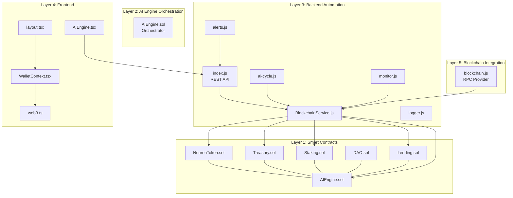
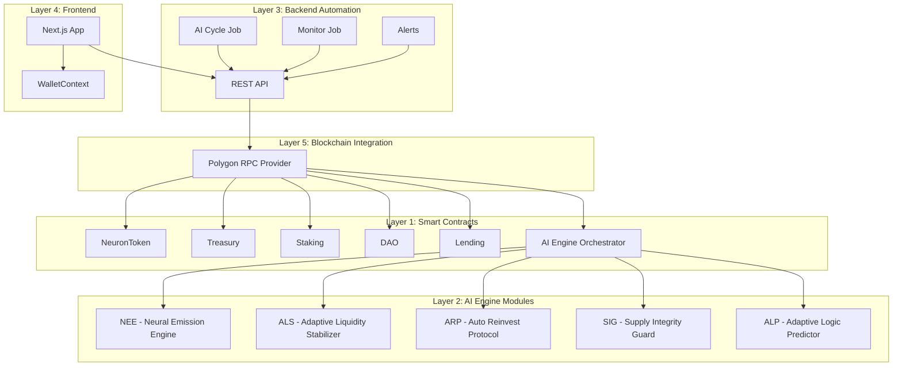
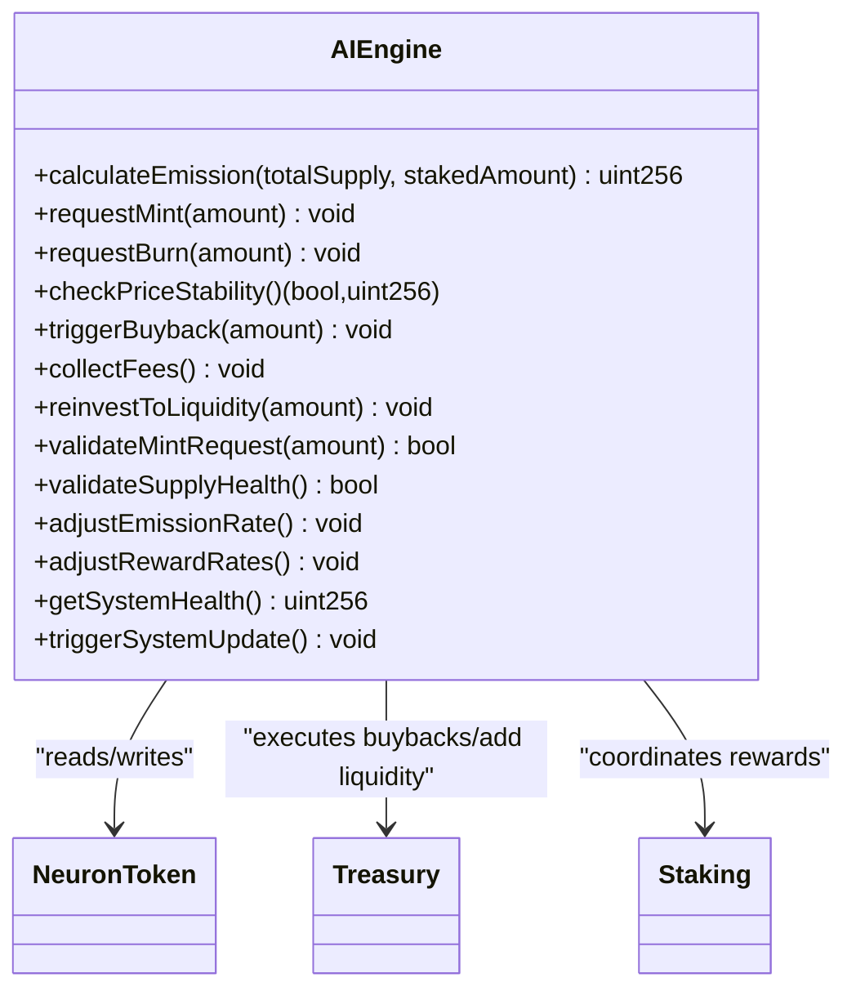
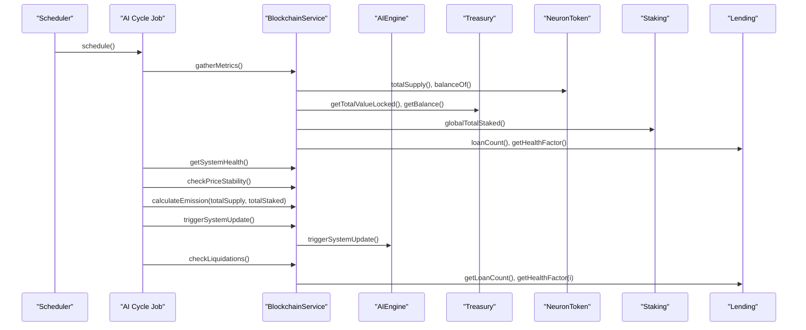
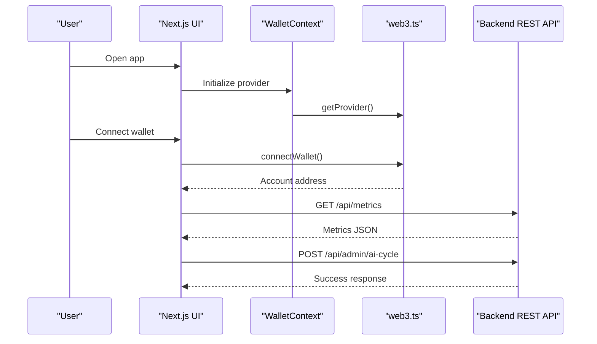
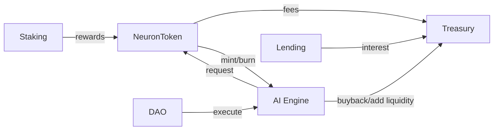
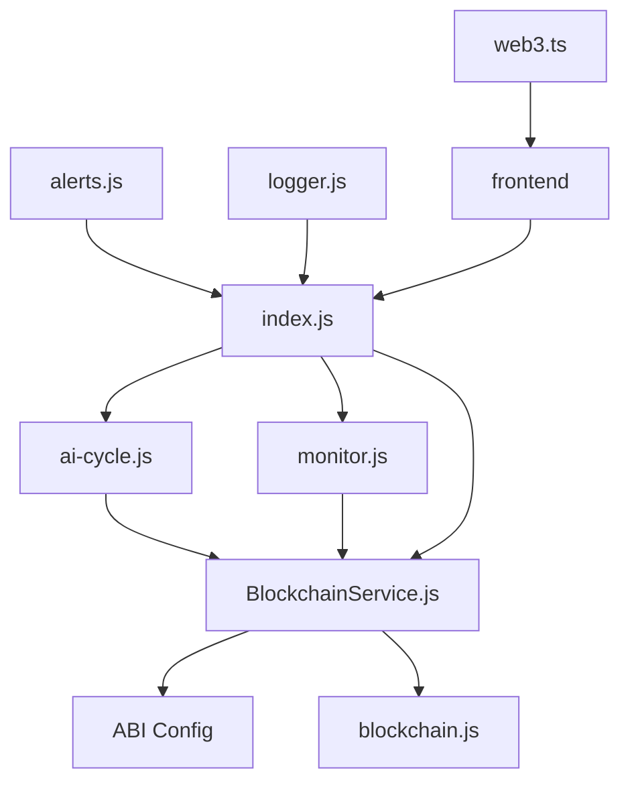

# System Architecture

<cite>
**Referenced Files in This Document**
- [ARCHITECTURE.md](file://neurafinance/ARCHITECTURE.md)
- [index.js](file://neurafinance/backend/src/index.js)
- [blockchain.js](file://neurafinance/backend/src/config/blockchain.js)
- [BlockchainService.js](file://neurafinance/backend/src/services/BlockchainService.js)
- [ai-cycle.js](file://neurafinance/backend/src/jobs/ai-cycle.js)
- [monitor.js](file://neurafinance/backend/src/jobs/monitor.js)
- [alerts.js](file://neurafinance/backend/src/utils/alerts.js)
- [logger.js](file://neurafinance/backend/src/utils/logger.js)
- [web3.ts](file://neurafinance/frontend/src/utils/web3.ts)
- [layout.tsx](file://neurafinance/frontend/src/app/layout.tsx)
- [WalletContext.tsx](file://neurafinance/frontend/src/contexts/WalletContext.tsx)
- [AIEngine.tsx](file://neurafinance/frontend/src/components/AIEngine.tsx)
- [AIEngine.sol](file://neurafinance/contracts/ai-engine/AIEngine.sol)
- [DAO.sol](file://neurafinance/contracts/core/DAO.sol)
- [Staking.sol](file://neurafinance/contracts/core/Staking.sol)
- [Lending.sol](file://neurafinance/contracts/core/Lending.sol)
- [NeuronToken.sol](file://neurafinance/contracts/core/NeuronToken.sol)
- [Treasury.sol](file://neurafinance/contracts/core/Treasury.sol)
</cite>

## Table of Contents
1. [Introduction](#introduction)
2. [Project Structure](#project-structure)
3. [Core Components](#core-components)
4. [Architecture Overview](#architecture-overview)
5. [Detailed Component Analysis](#detailed-component-analysis)
6. [Dependency Analysis](#dependency-analysis)
7. [Performance Considerations](#performance-considerations)
8. [Troubleshooting Guide](#troubleshooting-guide)
9. [Conclusion](#conclusion)

## Introduction
This document presents the five-layer architecture of NeuraFinance, an AI-driven DeFi ecosystem built on Polygon. The architecture separates concerns across:
- Layer 1: Smart Contracts (NeuronToken, Treasury, Staking, DAO, Lending, AI Engine)
- Layer 2: AI Engine Orchestration (orchestrator pattern)
- Layer 3: Backend Automation (Node.js services, scheduled jobs)
- Layer 4: Frontend Applications (Next.js + React)
- Layer 5: Blockchain Integration (Polygon RPC providers)

It explains component interactions, data flows, integration patterns, and technical decisions such as Polygon selection, real-time monitoring, and security controls. It also documents scalability, multi-provider support, and deployment topology.

## Project Structure
The system is organized into modular layers with clear boundaries:
- Smart contracts define on-chain logic and state
- Backend services expose REST APIs and coordinate off-chain orchestration
- AI engine orchestrates modules and triggers system updates
- Frontend provides user experiences and wallet connectivity
- Blockchain integration abstracts RPC providers and network configuration

**Diagram sources**
- [index.js:15-165](file://neurafinance/backend/src/index.js#L15-L165)
- [BlockchainService.js:12-37](file://neurafinance/backend/src/services/BlockchainService.js#L12-L37)
- [ai-cycle.js:13-85](file://neurafinance/backend/src/jobs/ai-cycle.js#L13-L85)
- [monitor.js:12-125](file://neurafinance/backend/src/jobs/monitor.js#L12-L125)
- [alerts.js:4-82](file://neurafinance/backend/src/utils/alerts.js#L4-L82)
- [logger.js:1-28](file://neurafinance/backend/src/utils/logger.js#L1-L28)
- [web3.ts:1-118](file://neurafinance/frontend/src/utils/web3.ts#L1-L118)
- [layout.tsx:16-35](file://neurafinance/frontend/src/app/layout.tsx#L16-L35)
- [WalletContext.tsx:17-93](file://neurafinance/frontend/src/contexts/WalletContext.tsx#L17-L93)
- [AIEngine.tsx:39-122](file://neurafinance/frontend/src/components/AIEngine.tsx#L39-L122)
- [blockchain.js:1-33](file://neurafinance/backend/src/config/blockchain.js#L1-L33)
- [AIEngine.sol:15-71](file://neurafinance/contracts/ai-engine/AIEngine.sol#L15-L71)

**Section sources**
- [ARCHITECTURE.md:6-130](file://neurafinance/ARCHITECTURE.md#L6-L130)
- [index.js:15-165](file://neurafinance/backend/src/index.js#L15-L165)
- [blockchain.js:1-33](file://neurafinance/backend/src/config/blockchain.js#L1-L33)

## Core Components
- Smart Contracts: Core token, treasury, staking, lending, DAO, and AI Engine define on-chain state and logic.
- AI Engine Orchestrator: Central contract coordinates NEE, ALS, ARP, SIG, ALP modules and triggers system updates.
- Backend Services: REST endpoints expose metrics and trigger admin actions; scheduled jobs gather metrics, monitor health, and trigger AI cycles.
- Frontend: Next.js app with wallet integration, navigation, and AI engine presentation.
- Blockchain Integration: RPC provider abstraction and network configuration for Polygon.

Key interactions:
- Backend queries smart contracts via a typed service and exposes metrics to the frontend.
- AI orchestrator coordinates modules and can request mint/burn, buybacks, and parameter adjustments.
- Frontend connects wallets, displays metrics, and triggers admin actions through backend.

**Section sources**
- [BlockchainService.js:12-216](file://neurafinance/backend/src/services/BlockchainService.js#L12-L216)
- [AIEngine.sol:15-309](file://neurafinance/contracts/ai-engine/AIEngine.sol#L15-L309)
- [index.js:22-143](file://neurafinance/backend/src/index.js#L22-L143)
- [web3.ts:1-118](file://neurafinance/frontend/src/utils/web3.ts#L1-L118)

## Architecture Overview
The system follows a five-layer design with explicit separation of concerns and observable integration points.

**Diagram sources**
- [ARCHITECTURE.md:8-130](file://neurafinance/ARCHITECTURE.md#L8-L130)
- [AIEngine.sol:73-309](file://neurafinance/contracts/ai-engine/AIEngine.sol#L73-L309)
- [index.js:15-165](file://neurafinance/backend/src/index.js#L15-L165)
- [ai-cycle.js:13-161](file://neurafinance/backend/src/jobs/ai-cycle.js#L13-L161)
- [monitor.js:12-125](file://neurafinance/backend/src/jobs/monitor.js#L12-L125)
- [alerts.js:4-82](file://neurafinance/backend/src/utils/alerts.js#L4-L82)
- [web3.ts:1-118](file://neurafinance/frontend/src/utils/web3.ts#L1-L118)
- [blockchain.js:1-33](file://neurafinance/backend/src/config/blockchain.js#L1-L33)

## Detailed Component Analysis

### AI Engine Orchestration (Orchestrator Pattern)
The AI Engine contract acts as the central coordinator for five specialized modules:
- NEE: Calculates emissions based on staking participation
- ALS: Monitors price stability and triggers buybacks/sell pressure
- ARP: Collects fees and reinvests into liquidity and treasury
- SIG: Validates mint requests and checks supply health
- ALP: Adjusts parameters to improve system health

**Diagram sources**
- [AIEngine.sol:15-309](file://neurafinance/contracts/ai-engine/AIEngine.sol#L15-L309)
- [NeuronToken.sol:8-253](file://neurafinance/contracts/core/NeuronToken.sol#L8-L253)
- [Treasury.sol:9-196](file://neurafinance/contracts/core/Treasury.sol#L9-L196)
- [Staking.sol:9-261](file://neurafinance/contracts/core/Staking.sol#L9-L261)

**Section sources**
- [AIEngine.sol:73-309](file://neurafinance/contracts/ai-engine/AIEngine.sol#L73-L309)
- [ARCHITECTURE.md:178-194](file://neurafinance/ARCHITECTURE.md#L178-L194)

### Backend Automation and Monitoring (Observer Pattern)
The backend runs two primary jobs:
- AI Cycle Job: Gathers metrics, checks health and price stability, calculates emission, triggers system update, and monitors loans
- Monitor Job: Continuously monitors treasury TVL, price movements, system health, and blockchain blocks

**Diagram sources**
- [ai-cycle.js:19-146](file://neurafinance/backend/src/jobs/ai-cycle.js#L19-L146)
- [BlockchainService.js:40-200](file://neurafinance/backend/src/services/BlockchainService.js#L40-L200)
- [AIEngine.sol:240-261](file://neurafinance/contracts/ai-engine/AIEngine.sol#L240-L261)
- [Lending.sol:157-227](file://neurafinance/contracts/core/Lending.sol#L157-L227)

**Section sources**
- [ai-cycle.js:13-161](file://neurafinance/backend/src/jobs/ai-cycle.js#L13-L161)
- [monitor.js:12-125](file://neurafinance/backend/src/jobs/monitor.js#L12-L125)
- [BlockchainService.js:12-216](file://neurafinance/backend/src/services/BlockchainService.js#L12-L216)

### Frontend Application and Wallet Integration
The frontend integrates wallet connectivity, navigation, and AI engine presentation:
- WalletContext manages connection state and network changes
- web3 utilities provide provider, signer, and network switching
- Layout composes global UI elements and toast notifications
- AIEngine component renders module details and health indicators

**Diagram sources**
- [WalletContext.tsx:17-93](file://neurafinance/frontend/src/contexts/WalletContext.tsx#L17-L93)
- [web3.ts:27-68](file://neurafinance/frontend/src/utils/web3.ts#L27-L68)
- [layout.tsx:16-35](file://neurafinance/frontend/src/app/layout.tsx#L16-L35)
- [index.js:22-143](file://neurafinance/backend/src/index.js#L22-L143)
- [AIEngine.tsx:39-122](file://neurafinance/frontend/src/components/AIEngine.tsx#L39-L122)

**Section sources**
- [web3.ts:1-118](file://neurafinance/frontend/src/utils/web3.ts#L1-L118)
- [WalletContext.tsx:17-102](file://neurafinance/frontend/src/contexts/WalletContext.tsx#L17-L102)
- [layout.tsx:16-35](file://neurafinance/frontend/src/app/layout.tsx#L16-L35)
- [AIEngine.tsx:39-122](file://neurafinance/frontend/src/components/AIEngine.tsx#L39-L122)

### Smart Contracts: Tokenomics, Treasury, Staking, DAO, Lending
- NeuronToken: Implements dynamic fees, mint/burn with AI validation, and fee distribution
- Treasury: Manages reserves, executes buybacks, adds liquidity, and reports TVL
- Staking: Supports flexible and bonded staking with tiered APYs and reward compounding
- DAO: Governance for proposals, voting, and timelocked execution
- Lending: Collateralized borrowing with health factors and liquidation mechanics
- AI Engine: Orchestrates modules and triggers system updates

**Diagram sources**
- [NeuronToken.sol:103-151](file://neurafinance/contracts/core/NeuronToken.sol#L103-L151)
- [Treasury.sol:80-111](file://neurafinance/contracts/core/Treasury.sol#L80-L111)
- [Staking.sol:119-155](file://neurafinance/contracts/core/Staking.sol#L119-L155)
- [Lending.sol:157-227](file://neurafinance/contracts/core/Lending.sol#L157-L227)
- [DAO.sol:99-110](file://neurafinance/contracts/core/DAO.sol#L99-L110)
- [AIEngine.sol:88-143](file://neurafinance/contracts/ai-engine/AIEngine.sol#L88-L143)

**Section sources**
- [NeuronToken.sol:8-253](file://neurafinance/contracts/core/NeuronToken.sol#L8-L253)
- [Treasury.sol:9-196](file://neurafinance/contracts/core/Treasury.sol#L9-L196)
- [Staking.sol:9-261](file://neurafinance/contracts/core/Staking.sol#L9-L261)
- [DAO.sol:9-231](file://neurafinance/contracts/core/DAO.sol#L9-L231)
- [Lending.sol:10-308](file://neurafinance/contracts/core/Lending.sol#L10-L308)
- [AIEngine.sol:15-309](file://neurafinance/contracts/ai-engine/AIEngine.sol#L15-L309)

## Dependency Analysis
The system exhibits layered dependencies:
- Backend depends on smart contracts via a typed service and RPC provider
- AI Engine orchestrates contracts and enforces access control
- Frontend depends on backend REST endpoints and wallet utilities
- Monitoring and alerts decouple operational concerns from core logic

**Diagram sources**
- [BlockchainService.js:12-37](file://neurafinance/backend/src/services/BlockchainService.js#L12-L37)
- [blockchain.js:23-32](file://neurafinance/backend/src/config/blockchain.js#L23-L32)
- [ai-cycle.js:7-11](file://neurafinance/backend/src/jobs/ai-cycle.js#L7-L11)
- [monitor.js:6-10](file://neurafinance/backend/src/jobs/monitor.js#L6-L10)
- [index.js:10-14](file://neurafinance/backend/src/index.js#L10-L14)
- [alerts.js:1-8](file://neurafinance/backend/src/utils/alerts.js#L1-L8)
- [logger.js:1-28](file://neurafinance/backend/src/utils/logger.js#L1-L28)
- [web3.ts:1-25](file://neurafinance/frontend/src/utils/web3.ts#L1-L25)

**Section sources**
- [BlockchainService.js:12-216](file://neurafinance/backend/src/services/BlockchainService.js#L12-L216)
- [blockchain.js:1-33](file://neurafinance/backend/src/config/blockchain.js#L1-L33)
- [index.js:15-165](file://neurafinance/backend/src/index.js#L15-L165)

## Performance Considerations
- Batched reads: Metrics gathering uses concurrent calls to minimize latency
- Scheduled cadence: AI cycle runs every 12 hours; monitoring runs every 5 minutes to balance responsiveness and cost
- Gas optimization: Solidity contracts use safe math and access control to prevent reverts and reduce gas waste
- Caching: Backend logs and alerts provide observability; consider adding lightweight caching for frequently accessed metrics
- Scalability: Polygon L2 reduces transaction costs and improves throughput; multi-provider support can be introduced later for redundancy

[No sources needed since this section provides general guidance]

## Troubleshooting Guide
Common issues and diagnostics:
- Health endpoint failures: Verify RPC connectivity and contract addresses
- Metrics timeouts: Check concurrent calls and provider rate limits
- Alert delivery: Confirm webhook/email configuration and retry policies
- Wallet connection errors: Validate MetaMask availability and network configuration

Operational utilities:
- Logging: Winston-based structured logging with file transports
- Alerts: Webhook and email notifications for critical events
- Health checks: REST endpoint exposing block number and system health

**Section sources**
- [index.js:22-41](file://neurafinance/backend/src/index.js#L22-L41)
- [logger.js:1-28](file://neurafinance/backend/src/utils/logger.js#L1-L28)
- [alerts.js:10-30](file://neurafinance/backend/src/utils/alerts.js#L10-L30)
- [web3.ts:27-68](file://neurafinance/frontend/src/utils/web3.ts#L27-L68)

## Conclusion
NeuraFinance’s five-layer architecture cleanly separates on-chain logic, AI orchestration, backend automation, frontend UX, and blockchain integration. The AI Engine orchestrator coordinates modules to maintain system health, while backend jobs and monitoring ensure continuous operation. Polygon provides a scalable L2 foundation, and the design supports future enhancements such as multi-provider RPC and advanced oracle integrations.