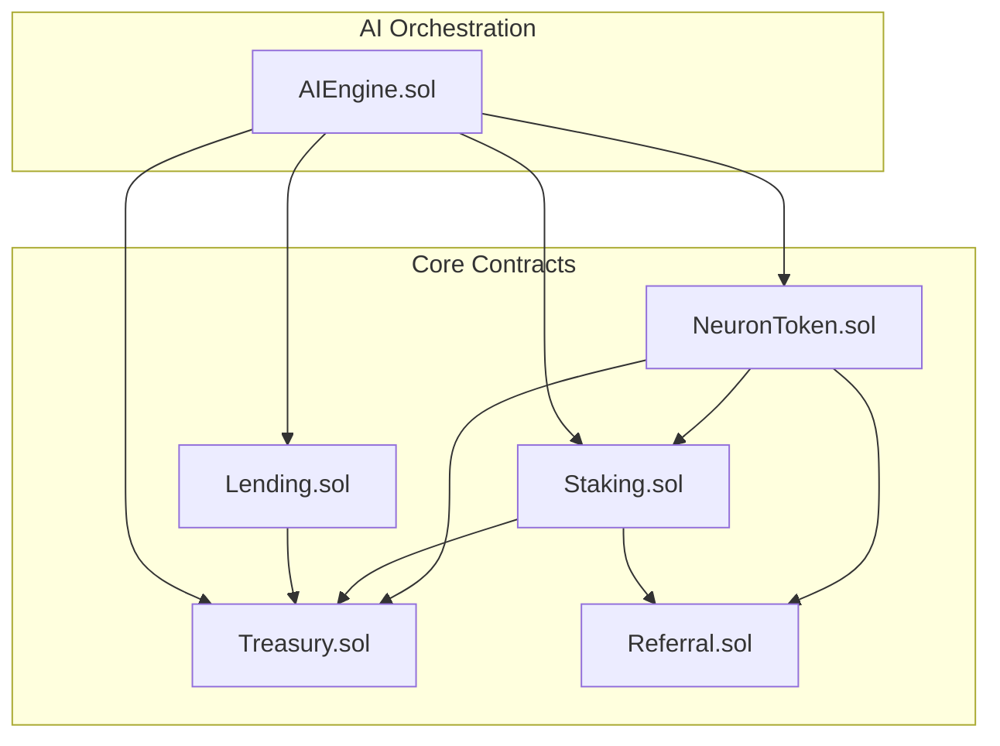
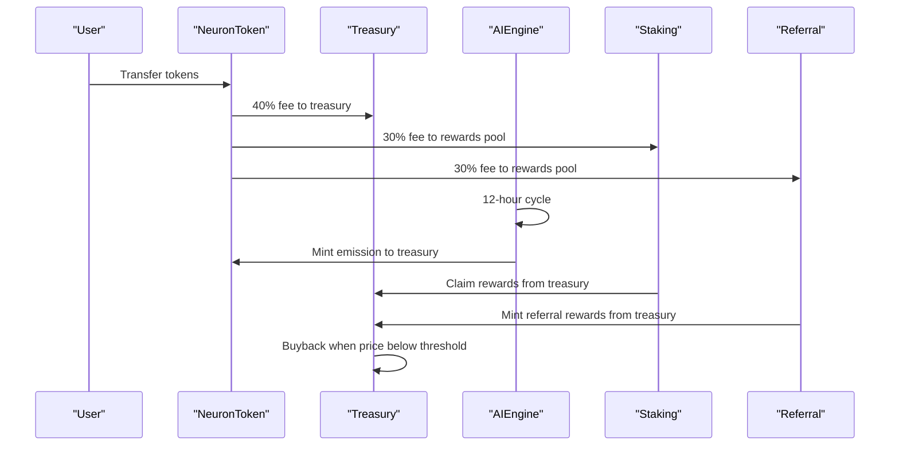
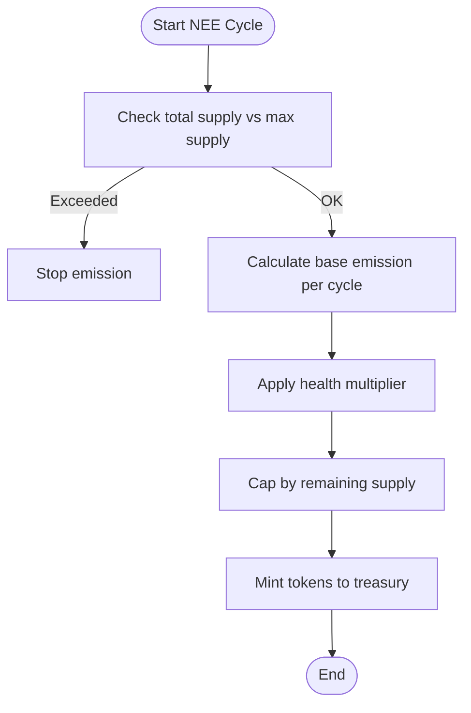
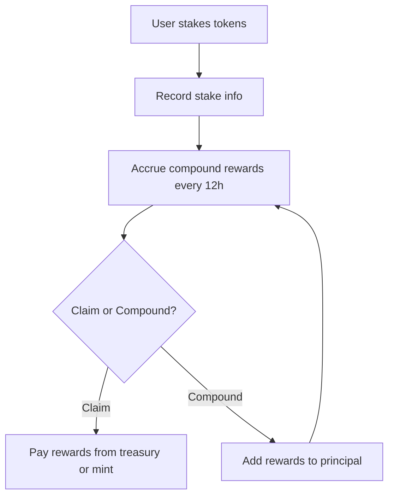
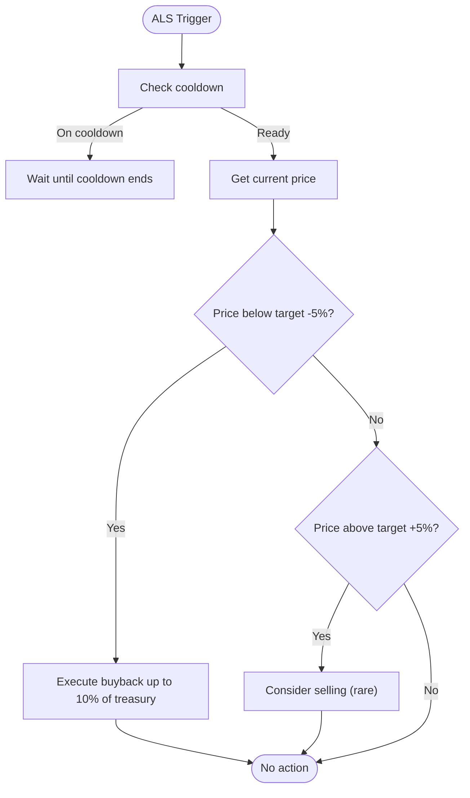
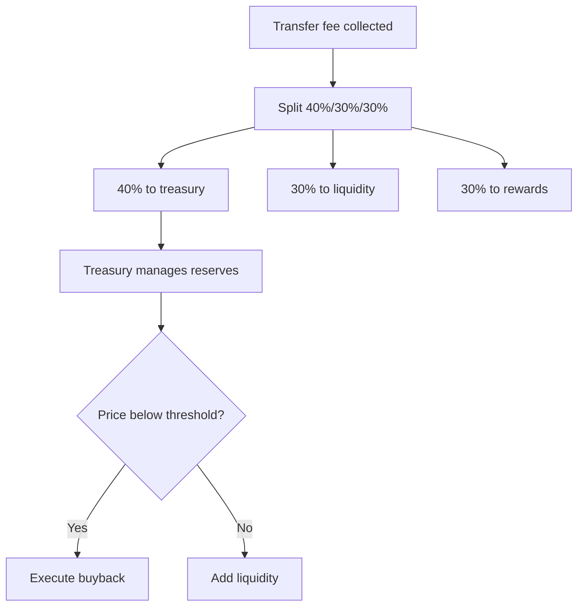
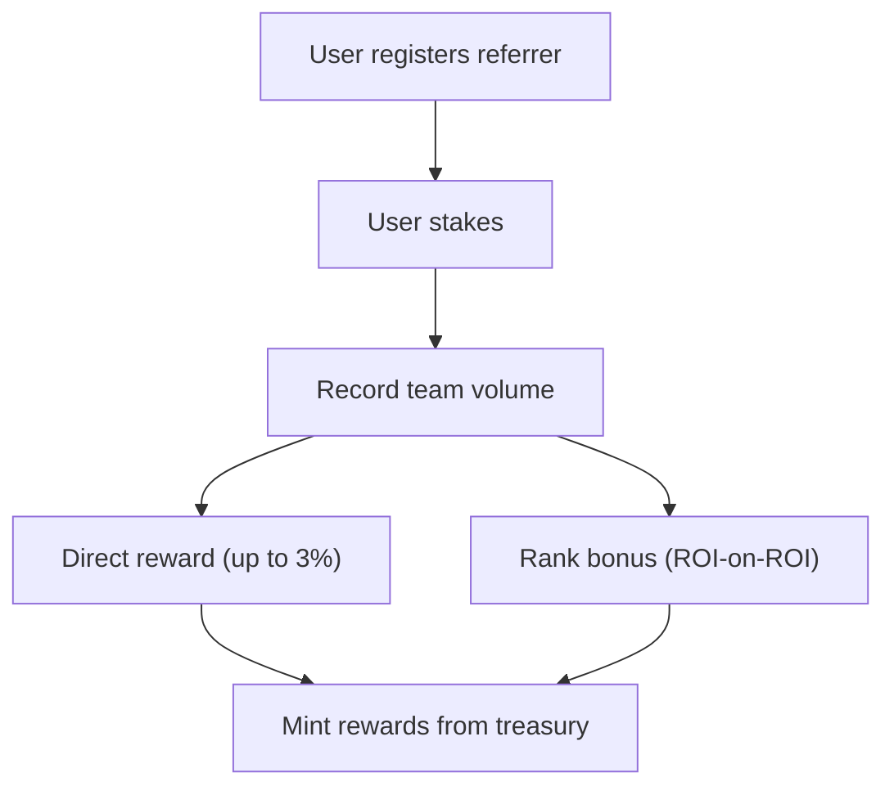
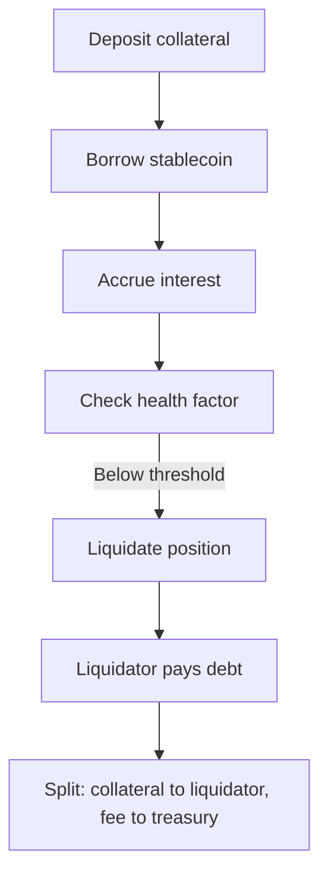
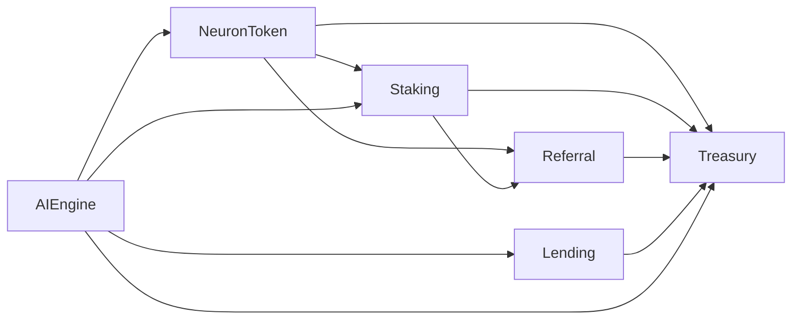

# Tokenomics and Economic Model

<cite>
**Referenced Files in This Document**
- [NeuronToken.sol](file://neurafinance/contracts/core/NeuronToken.sol)
- [Staking.sol](file://neurafinance/contracts/core/Staking.sol)
- [Treasury.sol](file://neurafinance/contracts/core/Treasury.sol)
- [Referral.sol](file://neurafinance/contracts/core/Referral.sol)
- [Lending.sol](file://neurafinance/contracts/core/Lending.sol)
- [AIEngine.sol](file://neurafinance/contracts-v2/ai-engine/AIEngine.sol)
- [MATHEMATICAL_MODEL.md](file://neurafinance/contracts-v2/MATHEMATICAL_MODEL.md)
- [SUSTAINABILITY_ANALYSIS.md](file://neurafinance/contracts-v2/SUSTAINABILITY_ANALYSIS.md)
- [DEPLOYMENT.md](file://neurafinance/contracts-v2/DEPLOYMENT.md)
- [DIFFERENCES.md](file://neurafinance/contracts-v2/DIFFERENCES.md)
</cite>

## Table of Contents
1. [Introduction](#introduction)
2. [Project Structure](#project-structure)
3. [Core Components](#core-components)
4. [Architecture Overview](#architecture-overview)
5. [Detailed Component Analysis](#detailed-component-analysis)
6. [Dependency Analysis](#dependency-analysis)
7. [Performance Considerations](#performance-considerations)
8. [Troubleshooting Guide](#troubleshooting-guide)
9. [Conclusion](#conclusion)
10. [Appendices](#appendices)

## Introduction
This document explains the tokenomics and economic model of NeuraFinance V2, focusing on sustainable DeFi mechanics that drive long-term viability. It covers dynamic emission controlled by system health, adaptive liquidity management, automated treasury operations, and a multi-tier referral system. It also documents the mathematical models behind emission rates, staking reward calculations, fee distribution, and sustainability analysis including inflation control, reserve management, and market stability.

## Project Structure
NeuraFinance V2 organizes tokenomics across four core smart contracts plus an AI engine orchestrator:
- NeuronToken: fee-collecting token with treasury/liquidity/rewards distribution
- Staking: auto-compounding staking with tiered APYs and referral integration
- Treasury: centralized reserve with buyback/sell pressure controls
- Referral: multi-tier referral rewards funded by treasury
- Lending: risk-controlled borrowing/lending with liquidation incentives
- AIEngine: 12-hour cycle orchestrating emission, stabilization, and adaptive logic

**Diagram sources**
- [NeuronToken.sol:1-253](file://neurafinance/contracts/core/NeuronToken.sol#L1-L253)
- [Staking.sol:1-261](file://neurafinance/contracts/core/Staking.sol#L1-L261)
- [Treasury.sol:1-196](file://neurafinance/contracts/core/Treasury.sol#L1-L196)
- [Referral.sol:1-202](file://neurafinance/contracts/core/Referral.sol#L1-L202)
- [Lending.sol:1-308](file://neurafinance/contracts/core/Lending.sol#L1-L308)
- [AIEngine.sol:1-386](file://neurafinance/contracts-v2/ai-engine/AIEngine.sol#L1-L386)

**Section sources**
- [DEPLOYMENT.md:1-237](file://neurafinance/contracts-v2/DEPLOYMENT.md#L1-L237)

## Core Components
- NeuronToken: Implements transfer fees and distributes 40% to treasury, 30% to liquidity, 30% to rewards. Supports mint/burn and whitelisting.
- Staking: Offers flexible and bonded staking with auto-compounding. Rewards come from treasury or minting when no rewards pool exists.
- Treasury: Manages reserves, executes buybacks, adds liquidity, and enforces backing targets and cooldowns.
- Referral: Multi-tier referral rewards (levels 1–3) funded by treasury, with rank progression and bonus percentages.
- Lending: Collateralized lending with conservative LTV, liquidation thresholds, and interest accrual.
- AIEngine: 12-hour cycle that calculates emission, stabilizes price, triggers auto-compounding, validates integrity, and adapts parameters.

**Section sources**
- [NeuronToken.sol:25-151](file://neurafinance/contracts/core/NeuronToken.sol#L25-L151)
- [Staking.sol:18-188](file://neurafinance/contracts/core/Staking.sol#L18-L188)
- [Treasury.sol:26-189](file://neurafinance/contracts/core/Treasury.sol#L26-L189)
- [Referral.sol:11-143](file://neurafinance/contracts/core/Referral.sol#L11-L143)
- [Lending.sol:33-271](file://neurafinance/contracts/core/Lending.sol#L33-L271)
- [AIEngine.sol:24-155](file://neurafinance/contracts-v2/ai-engine/AIEngine.sol#L24-L155)

## Architecture Overview
NeuraFinance V2’s tokenomics architecture centers on a closed-loop economy:
- Fees from transfers and staking/borrowing flow into the treasury
- AIEngine periodically mints new tokens into the treasury based on health-adjusted emission
- Staking rewards are paid from treasury reserves; if insufficient, minting occurs under strict caps
- Referral rewards are minted from treasury reserves (not infinite minting)
- Treasury stabilizes price via buybacks when below target and manages liquidity

**Diagram sources**
- [NeuronToken.sol:130-151](file://neurafinance/contracts/core/NeuronToken.sol#L130-L151)
- [AIEngine.sol:117-128](file://neurafinance/contracts-v2/ai-engine/AIEngine.sol#L117-L128)
- [Staking.sol:119-138](file://neurafinance/contracts/core/Staking.sol#L119-L138)
- [Referral.sol:99-119](file://neurafinance/contracts/core/Referral.sol#L99-L119)
- [Treasury.sol:80-97](file://neurafinance/contracts/core/Treasury.sol#L80-L97)

## Detailed Component Analysis

### Dynamic Emission Mechanics (NEE)
Neural Emission Engine (NEE) mints new tokens into the treasury at a rate that decreases over time and is adjusted by system health:
- Base emission: proportional to current supply and annual rate
- Health multiplier: min(1.0, current backing ratio / target backing ratio)
- Annual rates: 5% (Year 1), 4% (Year 2), 3% (Year 3), 2.5% (Year 4), 2% (Year 5+)
- Emission capped by remaining supply to prevent overshoot

**Diagram sources**
- [AIEngine.sol:133-155](file://neurafinance/contracts-v2/ai-engine/AIEngine.sol#L133-L155)
- [MATHEMATICAL_MODEL.md:53-112](file://neurafinance/contracts-v2/MATHEMATICAL_MODEL.md#L53-L112)

**Section sources**
- [AIEngine.sol:117-128](file://neurafinance/contracts-v2/ai-engine/AIEngine.sol#L117-L128)
- [AIEngine.sol:133-155](file://neurafinance/contracts-v2/ai-engine/AIEngine.sol#L133-L155)
- [MATHEMATICAL_MODEL.md:53-112](file://neurafinance/contracts-v2/MATHEMATICAL_MODEL.md#L53-L112)

### Staking and Auto-Compounding (ARP)
Staking offers flexible and bonded options with auto-compounding:
- Flexible APY: 40%
- Bond APYs: 60% (30 days), 80% (90 days), 120% (180 days)
- Rewards calculated using correct compound interest over 12-hour cycles
- Auto-compounding increases principal automatically; rewards are paid from treasury or minted if no rewards pool

**Diagram sources**
- [Staking.sol:61-155](file://neurafinance/contracts/core/Staking.sol#L61-L155)
- [MATHEMATICAL_MODEL.md:28-49](file://neurafinance/contracts-v2/MATHEMATICAL_MODEL.md#L28-L49)

**Section sources**
- [Staking.sol:157-181](file://neurafinance/contracts/core/Staking.sol#L157-L181)
- [Staking.sol:119-155](file://neurafinance/contracts/core/Staking.sol#L119-L155)
- [MATHEMATICAL_MODEL.md:28-49](file://neurafinance/contracts-v2/MATHEMATICAL_MODEL.md#L28-L49)

### Adaptive Liquidity Management (ALS)
Treasury stabilizes price via buybacks when price deviates below a band:
- Price band: ±5% around $1.00 target
- Buyback cooldown: 12 hours
- Buyback amount: up to 10% of treasury value per action
- ALS triggered by AIEngine when price falls below threshold

**Diagram sources**
- [AIEngine.sol:161-180](file://neurafinance/contracts-v2/ai-engine/AIEngine.sol#L161-L180)
- [Treasury.sol:80-97](file://neurafinance/contracts/core/Treasury.sol#L80-L97)

**Section sources**
- [AIEngine.sol:288-300](file://neurafinance/contracts-v2/ai-engine/AIEngine.sol#L288-L300)
- [Treasury.sol:27-29](file://neurafinance/contracts/core/Treasury.sol#L27-L29)
- [Treasury.sol:80-97](file://neurafinance/contracts/core/Treasury.sol#L80-L97)

### Automated Treasury Operations
Treasury collects fees and manages reserves:
- Fee distribution: 40% to treasury, 30% to liquidity, 30% to rewards
- Buyback threshold: 80% of peg ($0.80)
- Liquidity reserve ratio: 30%
- Authorized callers manage withdrawals and approvals

**Diagram sources**
- [NeuronToken.sol:130-151](file://neurafinance/contracts/core/NeuronToken.sol#L130-L151)
- [Treasury.sol:26-33](file://neurafinance/contracts/core/Treasury.sol#L26-L33)
- [Treasury.sol:80-111](file://neurafinance/contracts/core/Treasury.sol#L80-L111)

**Section sources**
- [NeuronToken.sol:25-28](file://neurafinance/contracts/core/NeuronToken.sol#L25-L28)
- [NeuronToken.sol:130-151](file://neurafinance/contracts/core/NeuronToken.sol#L130-L151)
- [Treasury.sol:26-33](file://neurafinance/contracts/core/Treasury.sol#L26-L33)
- [Treasury.sol:80-111](file://neurafinance/contracts/core/Treasury.sol#L80-L111)

### Multi-Tier Referral System
Referral rewards are sustainable and treasury-funded:
- Levels: 1 (direct), 2, 3 (limited depth)
- Max total: 4.5% per referral chain
- Rank progression increases fee share and governance benefits
- Rewards minted from treasury, not infinite minting

**Diagram sources**
- [Referral.sol:70-119](file://neurafinance/contracts/core/Referral.sol#L70-L119)
- [Referral.sol:131-143](file://neurafinance/contracts/core/Referral.sol#L131-L143)

**Section sources**
- [Referral.sol:11-22](file://neurafinance/contracts/core/Referral.sol#L11-L22)
- [Referral.sol:99-119](file://neurafinance/contracts/core/Referral.sol#L99-L119)
- [Referral.sol:131-143](file://neurafinance/contracts/core/Referral.sol#L131-L143)

### Lending and Liquidation
Lending is risk-managed with conservative parameters:
- LTV: 60%
- Liquidation threshold: 75%
- Liquidation bonus: 3% to liquidators
- Protocol fee: 2% to treasury
- Interest accrual based on annual rate and time elapsed

**Diagram sources**
- [Lending.sol:111-227](file://neurafinance/contracts/core/Lending.sol#L111-L227)

**Section sources**
- [Lending.sol:33-36](file://neurafinance/contracts/core/Lending.sol#L33-L36)
- [Lending.sol:111-227](file://neurafinance/contracts/core/Lending.sol#L111-L227)

## Dependency Analysis
Key dependencies and interactions:
- NeuronToken feeds fees to Treasury and Rewards recipients
- AIEngine orchestrates emission, stabilization, and adaptive logic
- Staking depends on Treasury for reward funding and Referral for team volume tracking
- Referral depends on Staking for stake records and Treasury for reward minting
- Lending integrates with Treasury for liquidation fee collection

**Diagram sources**
- [NeuronToken.sol:1-253](file://neurafinance/contracts/core/NeuronToken.sol#L1-L253)
- [Staking.sol:1-261](file://neurafinance/contracts/core/Staking.sol#L1-L261)
- [Treasury.sol:1-196](file://neurafinance/contracts/core/Treasury.sol#L1-L196)
- [Referral.sol:1-202](file://neurafinance/contracts/core/Referral.sol#L1-L202)
- [Lending.sol:1-308](file://neurafinance/contracts/core/Lending.sol#L1-L308)
- [AIEngine.sol:1-386](file://neurafinance/contracts-v2/ai-engine/AIEngine.sol#L1-L386)

**Section sources**
- [AIEngine.sol:35-46](file://neurafinance/contracts-v2/ai-engine/AIEngine.sol#L35-L46)

## Performance Considerations
- Gas optimization via batch operations and checkpoint pattern reduces on-chain costs
- 12-hour cycle minimizes frequent state updates while maintaining responsiveness
- Health-based emission prevents excessive minting during stress events

[No sources needed since this section provides general guidance]

## Troubleshooting Guide
Common issues and mitigations:
- Emission not triggering: verify AIEngine cycle timing and health multiplier
- Staking rewards not paid: check rewards pool balance or minting fallback
- Referral rewards not minted: confirm treasury balance and referral depth limits
- Treasury buyback blocked: ensure cooldown elapsed and price below threshold
- Lending liquidations failing: verify health factor and collateral value

**Section sources**
- [AIEngine.sol:87-111](file://neurafinance/contracts-v2/ai-engine/AIEngine.sol#L87-L111)
- [Staking.sol:119-138](file://neurafinance/contracts/core/Staking.sol#L119-L138)
- [Referral.sol:99-119](file://neurafinance/contracts/core/Referral.sol#L99-L119)
- [Treasury.sol:80-97](file://neurafinance/contracts/core/Treasury.sol#L80-L97)
- [Lending.sol:196-227](file://neurafinance/contracts/core/Lending.sol#L196-L227)

## Conclusion
NeuraFinance V2 establishes a sustainable DeFi tokenomics model through:
- Health-adjusted emission with decreasing annual rates and hard caps
- Treasury-backed rewards and buybacks to stabilize price and demand
- Correct compound interest calculations and conservative APYs aligned to reserve growth
- Multi-tier referral system funded by treasury to avoid infinite minting
- Risk controls in lending and robust governance via AIEngine orchestration

[No sources needed since this section summarizes without analyzing specific files]

## Appendices

### Mathematical Model Highlights
- Compound interest over 12-hour cycles for accurate staking rewards
- Health-adjusted emission scaling with backing ratio
- Backing ratio target of 30% with circuit breakers at 20%
- Yield curve analysis and system health scoring

**Section sources**
- [MATHEMATICAL_MODEL.md:3-112](file://neurafinance/contracts-v2/MATHEMATICAL_MODEL.md#L3-L112)
- [MATHEMATICAL_MODEL.md:230-256](file://neurafinance/contracts-v2/MATHEMATICAL_MODEL.md#L230-L256)

### Sustainability Analysis Highlights
- Controlled inflation with hard cap and decreasing emission
- Treasury-backed rewards and buybacks ensure sustainability
- Stress-tested scenarios show resilience with reduced emission during downturns
- Recommendations for long-term projections and risk management

**Section sources**
- [SUSTAINABILITY_ANALYSIS.md:16-94](file://neurafinance/contracts-v2/SUSTAINABILITY_ANALYSIS.md#L16-L94)
- [SUSTAINABILITY_ANALYSIS.md:182-246](file://neurafinance/contracts-v2/SUSTAINABILITY_ANALYSIS.md#L182-L246)
- [SUSTAINABILITY_ANALYSIS.md:316-347](file://neurafinance/contracts-v2/SUSTAINABILITY_ANALYSIS.md#L316-L347)

### Deployment and Configuration
- Recommended deployment order and role assignments
- Parameter configurations for token, staking, emission, treasury, referral, and lending
- Post-deployment verification checklist and keeper setup

**Section sources**
- [DEPLOYMENT.md:3-101](file://neurafinance/contracts-v2/DEPLOYMENT.md#L3-L101)
- [DEPLOYMENT.md:102-144](file://neurafinance/contracts-v2/DEPLOYMENT.md#L102-L144)
- [DEPLOYMENT.md:185-237](file://neurafinance/contracts-v2/DEPLOYMENT.md#L185-L237)

### Differences from V1
- Compound interest vs simple interest
- Health-adjusted emission vs unlimited minting
- Real price oracle vs mock price
- Sustainable referral system vs infinite minting
- Functional liquidation vs broken liquidation
- Hard cap supply vs infinite supply

**Section sources**
- [DIFFERENCES.md:9-51](file://neurafinance/contracts-v2/DIFFERENCES.md#L9-L51)
- [DIFFERENCES.md:71-91](file://neurafinance/contracts-v2/DIFFERENCES.md#L71-L91)
- [DIFFERENCES.md:116-134](file://neurafinance/contracts-v2/DIFFERENCES.md#L116-L134)
- [DIFFERENCES.md:136-156](file://neurafinance/contracts-v2/DIFFERENCES.md#L136-L156)