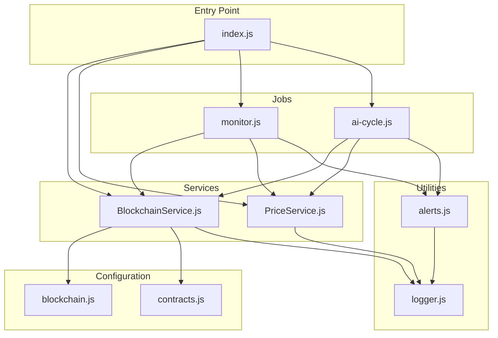
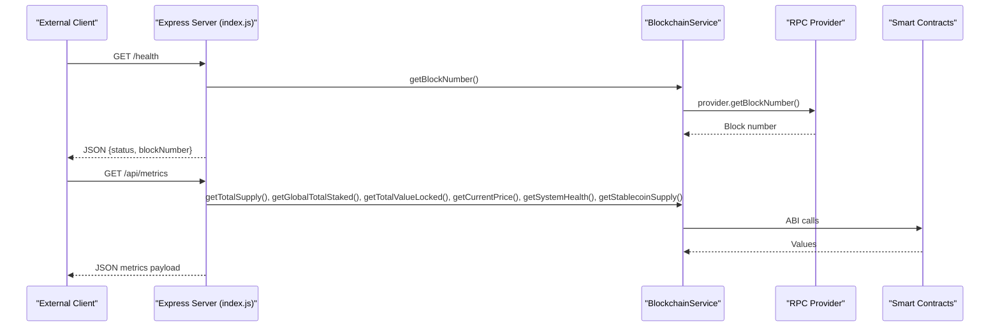
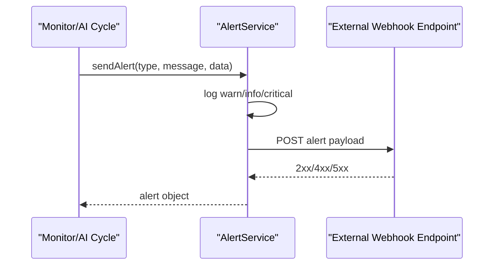
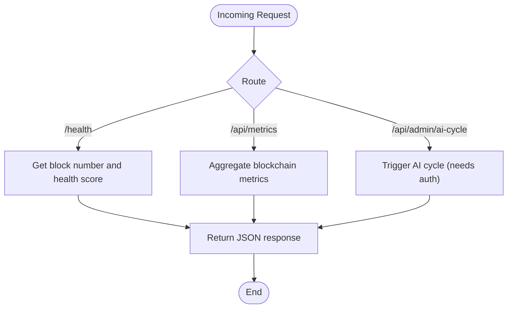
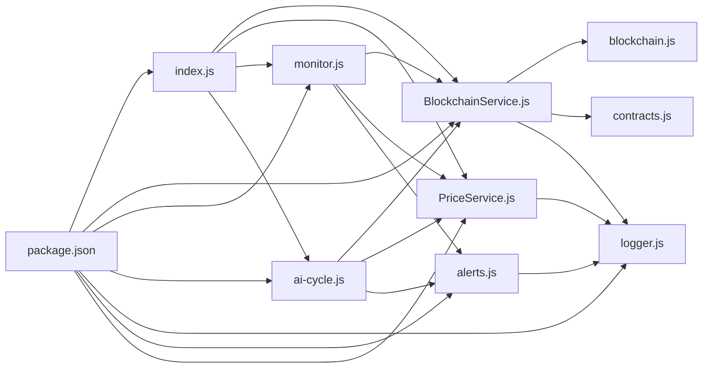

# Backend Services Security

<cite>
**Referenced Files in This Document**
- [index.js](file://neurafinance/backend/src/index.js)
- [blockchain.js](file://neurafinance/backend/src/config/blockchain.js)
- [BlockchainService.js](file://neurafinance/backend/src/services/BlockchainService.js)
- [alerts.js](file://neurafinance/backend/src/utils/alerts.js)
- [logger.js](file://neurafinance/backend/src/utils/logger.js)
- [monitor.js](file://neurafinance/backend/src/jobs/monitor.js)
- [ai-cycle.js](file://neurafinance/backend/src/jobs/ai-cycle.js)
- [PriceService.js](file://neurafinance/backend/src/services/PriceService.js)
- [contracts.js](file://neurafinance/backend/src/config/contracts.js)
- [package.json](file://neurafinance/backend/package.json)
</cite>

## Table of Contents
1. [Introduction](#introduction)
2. [Project Structure](#project-structure)
3. [Core Components](#core-components)
4. [Architecture Overview](#architecture-overview)
5. [Detailed Component Analysis](#detailed-component-analysis)
6. [Dependency Analysis](#dependency-analysis)
7. [Performance Considerations](#performance-considerations)
8. [Troubleshooting Guide](#troubleshooting-guide)
9. [Conclusion](#conclusion)
10. [Appendices](#appendices)

## Introduction
This document provides a comprehensive security assessment and guidance for NeuraFinance’s Node.js backend infrastructure. It focuses on the blockchain service layer security (RPC provider authentication, multi-provider fallback mechanisms, and transaction signing security), alerting and notification system security (webhook authentication, email service security, and critical alert escalation), logging security practices (sensitive data filtering, log rotation policies, and audit trail maintenance), environment variable and API key management, database connectivity security, backend monitoring security (health checks, rate limiting, and DDoS protection), and practical secure implementation patterns for DeFi backend services.

## Project Structure
The backend is organized into modular components:
- Configuration: blockchain provider and contract ABIs
- Services: blockchain interaction and price fetching
- Jobs: scheduled monitoring and AI cycle automation
- Utilities: logging and alerting
- Entry point: Express server exposing health and metrics endpoints

**Diagram sources**
- [index.js:1-177](file://neurafinance/backend/src/index.js#L1-L177)
- [blockchain.js:1-33](file://neurafinance/backend/src/config/blockchain.js#L1-L33)
- [contracts.js:1-146](file://neurafinance/backend/src/config/contracts.js#L1-L146)
- [BlockchainService.js:1-216](file://neurafinance/backend/src/services/BlockchainService.js#L1-L216)
- [PriceService.js:1-77](file://neurafinance/backend/src/services/PriceService.js#L1-L77)
- [monitor.js:1-141](file://neurafinance/backend/src/jobs/monitor.js#L1-L141)
- [ai-cycle.js:1-177](file://neurafinance/backend/src/jobs/ai-cycle.js#L1-L177)
- [alerts.js:1-82](file://neurafinance/backend/src/utils/alerts.js#L1-L82)
- [logger.js:1-28](file://neurafinance/backend/src/utils/logger.js#L1-L28)

**Section sources**
- [index.js:1-177](file://neurafinance/backend/src/index.js#L1-L177)
- [blockchain.js:1-33](file://neurafinance/backend/src/config/blockchain.js#L1-L33)
- [contracts.js:1-146](file://neurafinance/backend/src/config/contracts.js#L1-L146)
- [BlockchainService.js:1-216](file://neurafinance/backend/src/services/BlockchainService.js#L1-L216)
- [PriceService.js:1-77](file://neurafinance/backend/src/services/PriceService.js#L1-L77)
- [monitor.js:1-141](file://neurafinance/backend/src/jobs/monitor.js#L1-L141)
- [ai-cycle.js:1-177](file://neurafinance/backend/src/jobs/ai-cycle.js#L1-L177)
- [alerts.js:1-82](file://neurafinance/backend/src/utils/alerts.js#L1-L82)
- [logger.js:1-28](file://neurafinance/backend/src/utils/logger.js#L1-L28)

## Core Components
- Express server with health and metrics endpoints
- Blockchain service layer for interacting with smart contracts
- Scheduled monitoring and AI cycle jobs
- Alerting and logging utilities
- Environment-driven configuration for RPC, keys, and thresholds

Security-relevant highlights:
- RPC provider initialization from environment variables
- Private key usage for transaction signing
- Webhook-based alert delivery
- Winston-based structured logging with file transports
- Cron-based scheduling for periodic tasks

**Section sources**
- [index.js:18-41](file://neurafinance/backend/src/index.js#L18-L41)
- [blockchain.js:4-8](file://neurafinance/backend/src/config/blockchain.js#L4-L8)
- [alerts.js:4-30](file://neurafinance/backend/src/utils/alerts.js#L4-L30)
- [logger.js:3-16](file://neurafinance/backend/src/utils/logger.js#L3-L16)
- [monitor.js:112-124](file://neurafinance/backend/src/jobs/monitor.js#L112-L124)
- [ai-cycle.js:148-160](file://neurafinance/backend/src/jobs/ai-cycle.js#L148-L160)

## Architecture Overview
The backend exposes REST endpoints for health and metrics, runs scheduled jobs to monitor system health and prices, and triggers AI-driven updates on-chain. Security posture depends on environment configuration, transport security, and defensive coding practices.

**Diagram sources**
- [index.js:22-75](file://neurafinance/backend/src/index.js#L22-L75)
- [BlockchainService.js:202-212](file://neurafinance/backend/src/services/BlockchainService.js#L202-L212)

**Section sources**
- [index.js:22-75](file://neurafinance/backend/src/index.js#L22-L75)
- [BlockchainService.js:18-37](file://neurafinance/backend/src/services/BlockchainService.js#L18-L37)

## Detailed Component Analysis

### Blockchain Service Layer Security
- RPC provider initialization uses environment variables for the RPC URL.
- Wallet initialization uses a private key for signing transactions.
- Contract instances are created with the wallet, enabling write operations.

Security considerations:
- RPC provider authentication: The current implementation does not configure authentication headers or tokens for the RPC provider. This is a critical gap for production environments.
- Multi-provider fallback: No fallback providers are configured; a single point of failure exists.
- Transaction signing security: Private key exposure occurs at runtime; ensure secure storage and rotation practices.

Recommended mitigations:
- Configure RPC authentication (headers or tokens) via environment variables.
- Implement multiple RPC endpoints and failover logic.
- Store private keys securely (e.g., HSM, vault, or encrypted environment variables) and rotate regularly.
- Enforce gas limit and slippage controls for transactions.

**Section sources**
- [blockchain.js:4-8](file://neurafinance/backend/src/config/blockchain.js#L4-L8)
- [BlockchainService.js:18-37](file://neurafinance/backend/src/services/BlockchainService.js#L18-L37)

### Alerting and Notification System Security
- AlertService supports webhook delivery and logs alerts with structured metadata.
- Email integration is declared but not implemented in the current code.
- Critical alerts escalate via dedicated methods.

Security considerations:
- Webhook authentication: No authentication mechanism is implemented for incoming webhook requests.
- Email service security: Not present in the current code; if added, ensure TLS and credential management.
- Critical alert escalation: Methods exist for critical and warning alerts; ensure webhook endpoints are trusted and validated.

Recommended mitigations:
- Add HMAC-based webhook authentication for incoming alerts.
- Implement signed webhook delivery or shared secret verification.
- For email, use TLS, OAuth, and least-privilege credentials.
- Log alert metadata securely and avoid sensitive data leakage.

**Diagram sources**
- [alerts.js:10-30](file://neurafinance/backend/src/utils/alerts.js#L10-L30)
- [monitor.js:21-37](file://neurafinance/backend/src/jobs/monitor.js#L21-L37)
- [ai-cycle.js:37-81](file://neurafinance/backend/src/jobs/ai-cycle.js#L37-L81)

**Section sources**
- [alerts.js:4-42](file://neurafinance/backend/src/utils/alerts.js#L4-L42)
- [monitor.js:21-37](file://neurafinance/backend/src/jobs/monitor.js#L21-L37)
- [ai-cycle.js:37-81](file://neurafinance/backend/src/jobs/ai-cycle.js#L37-L81)

### Logging Security Practices
- Winston-based structured logging with file transports for error and combined logs.
- Console transport enabled outside production.
- Logs include timestamps and JSON formatting.

Security considerations:
- Sensitive data filtering: No explicit filtering of sensitive fields in logs.
- Log rotation policies: Not configured; logs can grow indefinitely.
- Audit trail maintenance: No retention or archival policies.

Recommended mitigations:
- Filter sensitive fields (private keys, secrets, tokens) from logs.
- Implement log rotation and retention policies.
- Ship logs to centralized systems with access controls and encryption at rest.
- Add structured redaction and mask sensitive values.

**Section sources**
- [logger.js:3-25](file://neurafinance/backend/src/utils/logger.js#L3-L25)

### Environment Variables, API Keys, and Database Connectivity
- Environment variables are loaded via dotenv.
- RPC URL and private key are used for blockchain operations.
- Alert webhook URL and email are configured for notifications.
- No database connectivity is present in the backend code.

Security considerations:
- API key management: Private keys and RPC URLs are stored in environment variables.
- Database connectivity: No database configuration is present; ensure any future database connections use encrypted connections and least-privilege credentials.

Recommended mitigations:
- Use encrypted environment variables or a secrets manager.
- Restrict environment variable access to minimal required processes.
- Validate and sanitize environment variables at startup.
- For databases, enforce TLS, connection pooling limits, and audit access.

**Section sources**
- [index.js:8](file://neurafinance/backend/src/index.js#L8)
- [blockchain.js:4-8](file://neurafinance/backend/src/config/blockchain.js#L4-L8)
- [alerts.js:5-8](file://neurafinance/backend/src/utils/alerts.js#L5-L8)

### Backend Monitoring Security
- Health check endpoint returns blockchain and system health metrics.
- Metrics endpoint aggregates blockchain data.
- Admin endpoint to trigger AI cycle is exposed without authentication.

Security considerations:
- Rate limiting: Not implemented; endpoints are vulnerable to abuse.
- DDoS protection: No mitigation measures are present.
- Authentication: Admin endpoint lacks authentication.

Recommended mitigations:
- Implement rate limiting per IP and per route.
- Add DDoS protection via reverse proxy or cloud WAF.
- Secure admin endpoints with authentication and authorization.
- Add circuit breakers and timeouts for external calls.

**Diagram sources**
- [index.js:22-143](file://neurafinance/backend/src/index.js#L22-L143)

**Section sources**
- [index.js:22-143](file://neurafinance/backend/src/index.js#L22-L143)

### Practical Secure Implementation Patterns for DeFi Backend Services
- Use environment variables for secrets and configuration.
- Implement robust error handling and logging with redaction.
- Add authentication and authorization for administrative endpoints.
- Employ rate limiting and DDoS protection.
- Secure RPC provider access and implement multi-provider fallback.
- Store private keys securely and rotate regularly.
- Validate and sanitize all inputs and environment variables.
- Use HTTPS/TLS for all network communications.
- Implement circuit breakers and timeouts for external dependencies.

[No sources needed since this section provides general guidance]

## Dependency Analysis
The backend depends on:
- Ethers for blockchain interactions
- Winston for logging
- Axios for HTTP requests
- Node-cron for scheduling
- Dotenv for environment loading
- Express for HTTP server

**Diagram sources**
- [package.json:12-20](file://neurafinance/backend/package.json#L12-L20)
- [index.js:1-177](file://neurafinance/backend/src/index.js#L1-L177)
- [BlockchainService.js:1-11](file://neurafinance/backend/src/services/BlockchainService.js#L1-L11)
- [blockchain.js:1-33](file://neurafinance/backend/src/config/blockchain.js#L1-L33)
- [contracts.js:1-146](file://neurafinance/backend/src/config/contracts.js#L1-L146)
- [monitor.js:1-11](file://neurafinance/backend/src/jobs/monitor.js#L1-L11)
- [ai-cycle.js:1-12](file://neurafinance/backend/src/jobs/ai-cycle.js#L1-L12)
- [alerts.js:1-3](file://neurafinance/backend/src/utils/alerts.js#L1-L3)
- [logger.js:1-3](file://neurafinance/backend/src/utils/logger.js#L1-L3)
- [PriceService.js:1-3](file://neurafinance/backend/src/services/PriceService.js#L1-L3)

**Section sources**
- [package.json:12-20](file://neurafinance/backend/package.json#L12-L20)

## Performance Considerations
- Use Promise.all for concurrent blockchain reads to reduce latency.
- Implement caching for price data to minimize external API calls.
- Apply exponential backoff for RPC retries.
- Monitor and throttle external API calls to prevent rate limits.

[No sources needed since this section provides general guidance]

## Troubleshooting Guide
- Health endpoint failures indicate RPC connectivity or provider errors.
- Metrics endpoint failures often stem from contract read errors or provider timeouts.
- Alert delivery failures should be retried with backoff and logged.
- Logging errors help diagnose misconfigurations and runtime exceptions.

**Section sources**
- [index.js:22-41](file://neurafinance/backend/src/index.js#L22-L41)
- [BlockchainService.js:40-47](file://neurafinance/backend/src/services/BlockchainService.js#L40-L47)
- [alerts.js:20-27](file://neurafinance/backend/src/utils/alerts.js#L20-L27)

## Conclusion
NeuraFinance’s backend demonstrates a solid foundation with modular components for blockchain interaction, monitoring, and alerting. However, critical security gaps remain in RPC provider authentication, multi-provider fallback, webhook authentication, and logging hygiene. Addressing these gaps through environment-driven security, robust authentication, secure key management, and comprehensive logging practices will significantly strengthen the backend’s resilience and compliance posture for DeFi operations.

## Appendices
- Environment variables used:
  - POLYGON_RPC_URL: RPC endpoint for Polygon
  - PRIVATE_KEY: Private key for transaction signing
  - ALERT_WEBHOOK_URL: Webhook endpoint for alerts
  - ALERT_EMAIL: Email destination for alerts
  - LOG_LEVEL: Logging verbosity
  - PORT: Server port
  - NODE_ENV: Environment mode
  - PRICE_CHECK_INTERVAL: Monitoring interval
  - AI_CYCLE_INTERVAL: AI cycle interval

[No sources needed since this section lists environment variables without analyzing specific files]