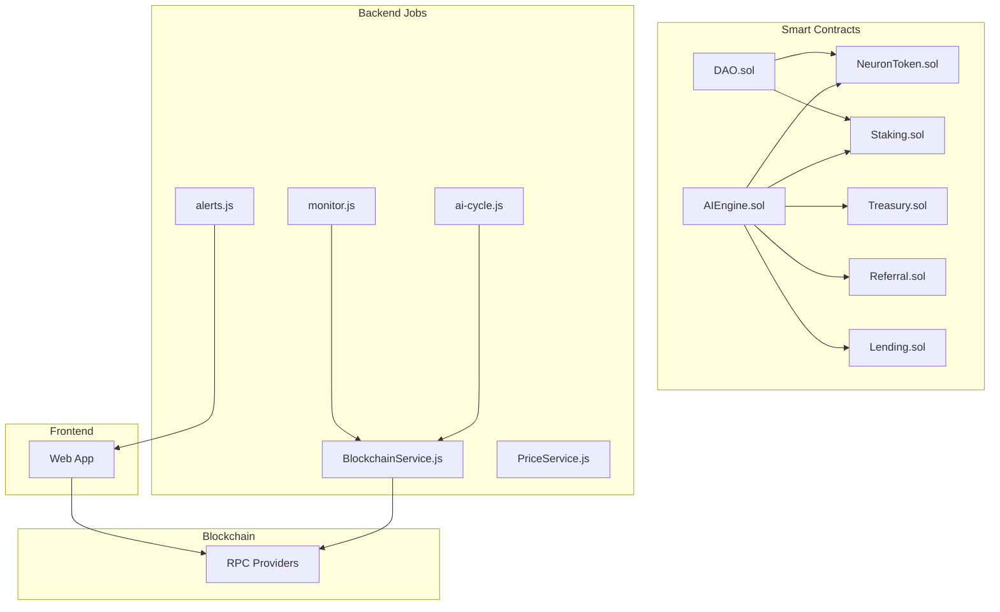
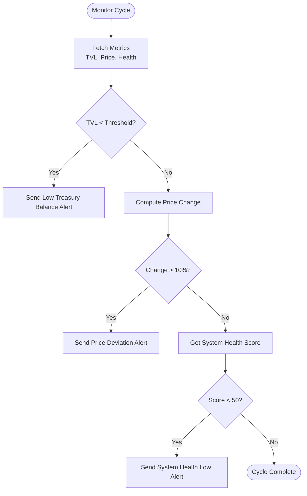
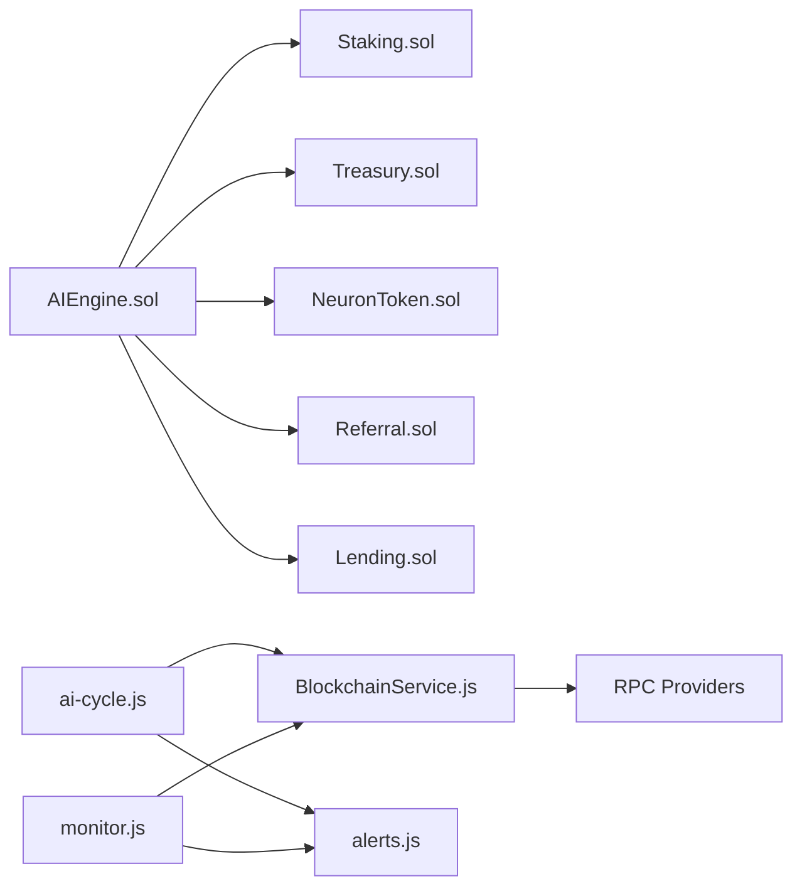

# Risk Assessment and Mitigation

<cite>
**Referenced Files in This Document**
- [AUDIT_REPORT.md](file://neurafinance/AUDIT_REPORT.md)
- [ARCHITECTURE.md](file://neurafinance/ARCHITECTURE.md)
- [AIEngine.sol](file://neurafinance/contracts/ai-engine/AIEngine.sol)
- [Staking.sol](file://neurafinance/contracts/core/Staking.sol)
- [Lending.sol](file://neurafinance/contracts/core/Lending.sol)
- [Referral.sol](file://neurafinance/contracts/core/Referral.sol)
- [DAO.sol](file://neurafinance/contracts/core/DAO.sol)
- [Treasury.sol](file://neurafinance/contracts/core/Treasury.sol)
- [NeuronToken.sol](file://neurafinance/contracts/core/NeuronToken.sol)
- [BlockchainService.js](file://neurafinance/backend/src/services/BlockchainService.js)
- [alerts.js](file://neurafinance/backend/src/utils/alerts.js)
- [monitor.js](file://neurafinance/backend/src/jobs/monitor.js)
- [ai-cycle.js](file://neurafinance/backend/src/jobs/ai-cycle.js)
- [PriceService.js](file://neurafinance/backend/src/services/PriceService.js)
</cite>

## Table of Contents
1. [Introduction](#introduction)
2. [Project Structure](#project-structure)
3. [Core Components](#core-components)
4. [Architecture Overview](#architecture-overview)
5. [Detailed Component Analysis](#detailed-component-analysis)
6. [Dependency Analysis](#dependency-analysis)
7. [Performance Considerations](#performance-considerations)
8. [Troubleshooting Guide](#troubleshooting-guide)
9. [Conclusion](#conclusion)
10. [Appendices](#appendices)

## Introduction
This document presents a comprehensive risk assessment and mitigation framework for the NeuraFinance ecosystem. It documents the systematic methodology for threat modeling, vulnerability identification, and impact analysis, followed by targeted mitigation strategies for smart contract bugs, price manipulation, liquidity crunches, governance attacks, and oracle failures. It also details risk monitoring and detection mechanisms, including system health scoring, anomaly detection, and automated alerting. A risk matrix outlines severity ratings and corresponding mitigation measures, and the document concludes with continuous risk assessment processes, regular security audits, incident response procedures, practical risk scenario examples, and regulatory compliance considerations.

## Project Structure
NeuraFinance is organized into four primary layers:
- Layer 1: Smart contracts implementing tokenomics, treasury, staking, lending, governance, and AI orchestration.
- Layer 2: AI Engine modules coordinating emission control, liquidity stabilization, auto reinvestment, supply integrity, and adaptive logic prediction.
- Layer 3: Backend automation jobs that periodically gather metrics, monitor system health, trigger AI updates, and send alerts.
- Layer 4: Frontend web application for user interaction.
- Layer 5: Blockchain integration with RPC providers and contract interactions.



**Diagram sources**
- [ARCHITECTURE.md:1-239](file://neurafinance/ARCHITECTURE.md#L1-L239)
- [BlockchainService.js:1-216](file://neurafinance/backend/src/services/BlockchainService.js#L1-L216)
- [monitor.js:1-141](file://neurafinance/backend/src/jobs/monitor.js#L1-L141)
- [ai-cycle.js:1-177](file://neurafinance/backend/src/jobs/ai-cycle.js#L1-L177)
- [alerts.js:1-82](file://neurafinance/backend/src/utils/alerts.js#L1-L82)
- [AIEngine.sol:1-309](file://neurafinance/contracts/ai-engine/AIEngine.sol#L1-L309)
- [Staking.sol:1-261](file://neurafinance/contracts/core/Staking.sol#L1-L261)
- [Treasury.sol:1-196](file://neurafinance/contracts/core/Treasury.sol#L1-L196)
- [Lending.sol:1-308](file://neurafinance/contracts/core/Lending.sol#L1-L308)
- [Referral.sol:1-202](file://neurafinance/contracts/core/Referral.sol#L1-L202)
- [DAO.sol:1-231](file://neurafinance/contracts/core/DAO.sol#L1-L231)
- [NeuronToken.sol:1-253](file://neurafinance/contracts/core/NeuronToken.sol#L1-L253)

**Section sources**
- [ARCHITECTURE.md:1-239](file://neurafinance/ARCHITECTURE.md#L1-L239)

## Core Components
This section identifies the core components and their roles in risk exposure and mitigation:
- AI Engine orchestrates system-wide adjustments and health checks.
- Staking manages reward distribution and introduces compounding risks.
- Lending governs borrowing/liquidation mechanics and exposes oracle-dependent risks.
- Referral system drives hyperinflationary dynamics through minting rewards.
- Treasury controls reserves, buybacks, and liquidity provisioning.
- DAO governs governance thresholds and execution pathways.
- Token contract enforces mint/burn and fee distribution with mint validation gating.

These components collectively define the attack surface and resilience levers across smart contract bugs, price manipulation, liquidity crunches, governance attacks, and oracle failures.

**Section sources**
- [AIEngine.sol:1-309](file://neurafinance/contracts/ai-engine/AIEngine.sol#L1-L309)
- [Staking.sol:1-261](file://neurafinance/contracts/core/Staking.sol#L1-L261)
- [Lending.sol:1-308](file://neurafinance/contracts/core/Lending.sol#L1-L308)
- [Referral.sol:1-202](file://neurafinance/contracts/core/Referral.sol#L1-L202)
- [Treasury.sol:1-196](file://neurafinance/contracts/core/Treasury.sol#L1-L196)
- [DAO.sol:1-231](file://neurafinance/contracts/core/DAO.sol#L1-L231)
- [NeuronToken.sol:1-253](file://neurafinance/contracts/core/NeuronToken.sol#L1-L253)

## Architecture Overview
The risk assessment architecture integrates on-chain and off-chain mechanisms:
- On-chain: AI Engine computes system health, triggers emission/liquidity actions, and validates supply integrity.
- Off-chain: Backend jobs monitor treasury, price, and system health, and trigger AI cycles and alerts.
- Governance: DAO proposals and execution are gated by thresholds and timelocks.
- Oracles: Current implementation uses mock price feeds; future integration requires robust oracles.

```mermaid
sequenceDiagram
participant Cron as "Scheduler"
participant AIC as "AI Cycle Job"
participant BCS as "BlockchainService"
participant AI as "AIEngine"
participant STK as "Staking"
participant TRE as "Treasury"
participant MON as "Monitor Job"
participant ALT as "Alerts"
Cron->>AIC : Schedule every 12h
AIC->>BCS : getSystemHealth()
BCS->>AI : getSystemHealth()
AI-->>BCS : healthScore
AIC->>BCS : checkPriceStability()
BCS->>AI : checkPriceStability()
AI-->>BCS : {isStable, deviation}
AIC->>BCS : calculateEmission(totalSupply, globalStaked)
BCS->>AI : calculateEmission(...)
AI-->>BCS : emission
AIC->>BCS : triggerSystemUpdate()
BCS->>AI : triggerSystemUpdate()
AI-->>BCS : tx hash
AIC->>ALT : aiCycleCompleted(emission, healthScore)
Cron->>MON : Schedule every N minutes
MON->>BCS : getTotalValueLocked(), getCurrentPrice(), getSystemHealth()
BCS->>AI : getTotalValueLocked()/getCurrentPrice()/getSystemHealth()
AI-->>BCS : values
MON->>ALT : lowTreasuryBalance/priceDeviation/systemHealthLow
```

**Diagram sources**
- [ai-cycle.js:1-177](file://neurafinance/backend/src/jobs/ai-cycle.js#L1-L177)
- [monitor.js:1-141](file://neurafinance/backend/src/jobs/monitor.js#L1-L141)
- [BlockchainService.js:1-216](file://neurafinance/backend/src/services/BlockchainService.js#L1-L216)
- [AIEngine.sol:202-261](file://neurafinance/contracts/ai-engine/AIEngine.sol#L202-L261)
- [alerts.js:1-82](file://neurafinance/backend/src/utils/alerts.js#L1-L82)

## Detailed Component Analysis

### Threat Modeling and Vulnerability Identification
- Smart Contract Bugs
  - Compounding accounting drift in Staking: adding rewards to principal without minting/burning causes discrepancies.
  - Mint validation bypass in NeuronToken: validation only applies if AI Engine is set; otherwise any authorized minter can mint unlimited tokens.
  - Liquidation logic bypass in Lending: collateral value computed without price oracle leads to delayed liquidation signals.
  - Mock price oracle in Treasury and AI Engine: calculated price disconnected from market reality.
- Price Manipulation
  - Mock price feeds in AI Engine and Treasury enable manipulation of perceived stability.
  - Absence of TWAP oracles and circuit breakers.
- Liquidity Crunches
  - Treasury relies on mock price feeds; buybacks may be mispriced or timed incorrectly.
  - No dynamic liquidity provision or DEX integration in current contracts.
- Governance Attacks
  - DAO lacks minimum token holding for proposals and timelock; simple majority can pass malicious proposals.
- Oracle Failures
  - No Chainlink or DEX oracle integration; system health and price stability rely on mock values.

**Section sources**
- [AUDIT_REPORT.md:57-83](file://neurafinance/AUDIT_REPORT.md#L57-L83)
- [AUDIT_REPORT.md:272-304](file://neurafinance/AUDIT_REPORT.md#L272-L304)
- [AUDIT_REPORT.md:445-465](file://neurafinance/AUDIT_REPORT.md#L445-L465)
- [AUDIT_REPORT.md:176-205](file://neurafinance/AUDIT_REPORT.md#L176-L205)
- [Staking.sol:140-155](file://neurafinance/contracts/core/Staking.sol#L140-L155)
- [NeuronToken.sol:160-172](file://neurafinance/contracts/core/NeuronToken.sol#L160-L172)
- [Lending.sol:255-259](file://neurafinance/contracts/core/Lending.sol#L255-L259)
- [AIEngine.sol:229-238](file://neurafinance/contracts/ai-engine/AIEngine.sol#L229-L238)
- [Treasury.sol:131-135](file://neurafinance/contracts/core/Treasury.sol#L131-L135)
- [DAO.sol:16-21](file://neurafinance/contracts/core/DAO.sol#L16-L21)

### Impact Analysis
- High inflation risk due to emission mechanics and referral rewards minting without revenue backing.
- Unsustainable pyramid structure in Referral leading to exponential minting pressure.
- Treasury disconnect: growing reserves while token loses value.
- System health scoring based on mock prices fails to reflect real market conditions.
- Governance can be hijacked if thresholds are low and timelock is absent.

**Section sources**
- [AUDIT_REPORT.md:142-151](file://neurafinance/AUDIT_REPORT.md#L142-L151)
- [AUDIT_REPORT.md:398-429](file://neurafinance/AUDIT_REPORT.md#L398-L429)
- [AUDIT_REPORT.md:247-259](file://neurafinance/AUDIT_REPORT.md#L247-259)
- [AUDIT_REPORT.md:309-361](file://neurafinance/AUDIT_REPORT.md#L309-L361)

### Risk Mitigation Strategies
- Smart Contract Bugs
  - Fix Staking compounding to mint/burn tokens consistently with principal changes.
  - Enforce mandatory AI Engine validation for all mint requests; remove bypass path.
  - Implement proper liquidation logic using price oracles in Lending.
- Price Manipulation
  - Integrate Chainlink TWAP oracles for price feeds; add circuit breakers and volatility thresholds.
  - Replace mock price calculations with verified external oracles.
- Liquidity Crunches
  - Add DEX integration for buybacks and liquidity provisioning; implement dynamic reserve ratios.
  - Use real-time price feeds to trigger buybacks and sell pressure.
- Governance Attacks
  - Increase proposal threshold and quorum; introduce timelock for sensitive operations.
  - Add delegated voting and weighted participation to prevent centralization.
- Oracle Failures
  - Multi-oracle aggregation; fallback mechanisms; emergency pause functionality.

**Section sources**
- [AUDIT_REPORT.md:601-622](file://neurafinance/AUDIT_REPORT.md#L601-L622)
- [ARCHITECTURE.md:221-239](file://neurafinance/ARCHITECTURE.md#L221-L239)

### Risk Monitoring and Detection Mechanisms
- System Health Scoring
  - AI Engine’s getSystemHealth aggregates staking ratio, treasury backing, and price stability.
- Anomaly Detection
  - Monitor job tracks treasury TVL, price deviations, and health score degradation.
  - AI cycle job gathers metrics and triggers system updates; detects unhealthy loans.
- Automated Alerting
  - Alert service sends webhook/email notifications for critical/warning/info events.
  - Price deviation, low treasury balance, unhealthy loan, and low system health alerts are supported.



**Diagram sources**
- [monitor.js:21-84](file://neurafinance/backend/src/jobs/monitor.js#L21-L84)
- [alerts.js:45-71](file://neurafinance/backend/src/utils/alerts.js#L45-L71)

**Section sources**
- [BlockchainService.js:68-131](file://neurafinance/backend/src/services/BlockchainService.js#L68-L131)
- [monitor.js:1-141](file://neurafinance/backend/src/jobs/monitor.js#L1-L141)
- [ai-cycle.js:118-146](file://neurafinance/backend/src/jobs/ai-cycle.js#L118-L146)
- [alerts.js:1-82](file://neurafinance/backend/src/utils/alerts.js#L1-L82)

### Risk Matrix: Severity Ratings and Mitigation Measures
- Smart Contract Bugs: High severity; mitigate by fixing compounding, enforcing mint validation, and liquidation logic.
- Price Manipulation: Medium severity; mitigate by integrating oracles and adding circuit breakers.
- Liquidity Crunches: Medium severity; mitigate by enabling DEX buybacks and dynamic liquidity.
- Governance Attacks: Medium severity; mitigate by increasing thresholds and adding timelock.
- Oracle Failures: Medium severity; mitigate by multi-oracle setup and fallbacks.

**Section sources**
- [ARCHITECTURE.md:221-230](file://neurafinance/ARCHITECTURE.md#L221-L230)

### Continuous Risk Assessment Processes
- Regular Security Audits
  - Conduct periodic third-party audits aligned with findings in the comprehensive audit report.
- Incident Response Procedures
  - Define escalation paths, emergency pause activation, and communication protocols for critical events.
- Regulatory Compliance Considerations
  - Implement KYC/AML checks, disclosure obligations, and governance transparency aligned with applicable jurisdictions.
- Security Monitoring Approaches
  - Combine on-chain monitoring (system health, treasury, price) with off-chain alerting and manual triage.

**Section sources**
- [AUDIT_REPORT.md:623-647](file://neurafinance/AUDIT_REPORT.md#L623-L647)
- [ARCHITECTURE.md:221-239](file://neurafinance/ARCHITECTURE.md#L221-L239)

### Practical Risk Scenarios and Countermeasures
- Scenario: Infinite mint via referral rewards
  - Risk: Malicious actors exploit referral minting to inflate supply.
  - Countermeasure: Remove referral minting; fund rewards from treasury; enforce mint validation.
- Scenario: Flash loan price manipulation
  - Risk: Pump/crash price to exploit liquidations.
  - Countermeasure: Integrate Chainlink oracles; add circuit breakers; implement emergency pause.
- Scenario: Compounding accounting drift
  - Risk: Discrepancy between staked tokens and supply.
  - Countermeasure: Mint/burn tokens when compounding; reconcile global totals.
- Scenario: Governance takeover
  - Risk: Low thresholds allow malicious proposals.
  - Countermeasure: Increase thresholds/quorum; add timelock; delegate voting.

**Section sources**
- [AUDIT_REPORT.md:470-520](file://neurafinance/AUDIT_REPORT.md#L470-L520)
- [Staking.sol:140-155](file://neurafinance/contracts/core/Staking.sol#L140-L155)
- [Referral.sol:99-119](file://neurafinance/contracts/core/Referral.sol#L99-L119)
- [DAO.sol:16-21](file://neurafinance/contracts/core/DAO.sol#L16-L21)

## Dependency Analysis
The AI Engine orchestrates multiple contracts and backend services. Dependencies include:
- AI Engine depends on Staking, Treasury, and Token contracts for health metrics and operations.
- Backend jobs depend on BlockchainService to query on-chain data and trigger transactions.
- Alerts depend on environment-configured webhook/email endpoints.



**Diagram sources**
- [AIEngine.sol:18-309](file://neurafinance/contracts/ai-engine/AIEngine.sol#L18-L309)
- [BlockchainService.js:18-37](file://neurafinance/backend/src/services/BlockchainService.js#L18-L37)
- [ai-cycle.js:1-177](file://neurafinance/backend/src/jobs/ai-cycle.js#L1-L177)
- [monitor.js:1-141](file://neurafinance/backend/src/jobs/monitor.js#L1-L141)
- [alerts.js:1-82](file://neurafinance/backend/src/utils/alerts.js#L1-L82)

**Section sources**
- [AIEngine.sol:18-309](file://neurafinance/contracts/ai-engine/AIEngine.sol#L18-L309)
- [BlockchainService.js:18-37](file://neurafinance/backend/src/services/BlockchainService.js#L18-L37)

## Performance Considerations
- Gas optimization for frequent monitoring and AI cycles.
- Caching price feeds to reduce RPC calls.
- Batched queries to minimize blockchain read overhead.
- Asynchronous alert delivery to avoid blocking critical paths.

[No sources needed since this section provides general guidance]

## Troubleshooting Guide
- Monitoring Failures
  - Verify cron intervals and environment variables for monitoring and AI cycle schedules.
  - Check RPC provider availability and fallback configurations.
- Alert Delivery Issues
  - Confirm webhook URL and email configuration; inspect logs for errors.
- Contract Interaction Errors
  - Validate contract addresses and ABI configurations; ensure sufficient gas and allowances.

**Section sources**
- [monitor.js:112-125](file://neurafinance/backend/src/jobs/monitor.js#L112-L125)
- [ai-cycle.js:148-160](file://neurafinance/backend/src/jobs/ai-cycle.js#L148-L160)
- [alerts.js:20-30](file://neurafinance/backend/src/utils/alerts.js#L20-L30)
- [BlockchainService.js:18-37](file://neurafinance/backend/src/services/BlockchainService.js#L18-L37)

## Conclusion
NeuraFinance’s current architecture exhibits critical vulnerabilities in oracle integrity, emission mechanics, and governance thresholds, as evidenced by the comprehensive audit. Immediate remediation is required to integrate robust oracles, enforce mint validation, fix compounding accounting, and strengthen governance. The monitoring and alerting infrastructure provides a strong foundation for continuous risk oversight, but must be coupled with on-chain fixes to achieve a sustainable and secure ecosystem.

[No sources needed since this section summarizes without analyzing specific files]

## Appendices

### Appendix A: Risk Matrix Details
- Smart Contract Bugs: High; Mitigation includes mint/burn reconciliation, mandatory validation, and liquidation logic fixes.
- Price Manipulation: Medium; Mitigation includes oracles, circuit breakers, and volatility thresholds.
- Liquidity Crunches: Medium; Mitigation includes DEX buybacks and dynamic liquidity.
- Governance Attacks: Medium; Mitigation includes increased thresholds, timelock, and delegated voting.
- Oracle Failures: Medium; Mitigation includes multi-oracle aggregation and fallbacks.

**Section sources**
- [ARCHITECTURE.md:221-230](file://neurafinance/ARCHITECTURE.md#L221-L230)

### Appendix B: Audit Recommendations Mapping
- Critical fixes: Integrate Chainlink oracles, remove referral minting, fix compounding, add supply caps, implement real liquidation.
- High priority: Reduce emission rates, cap referral rewards, add governance timelock, emergency pause, multi-sig.
- Medium priority: Add vesting, buybacks from fees, collateral diversification, insurance fund.

**Section sources**
- [AUDIT_REPORT.md:601-622](file://neurafinance/AUDIT_REPORT.md#L601-L622)