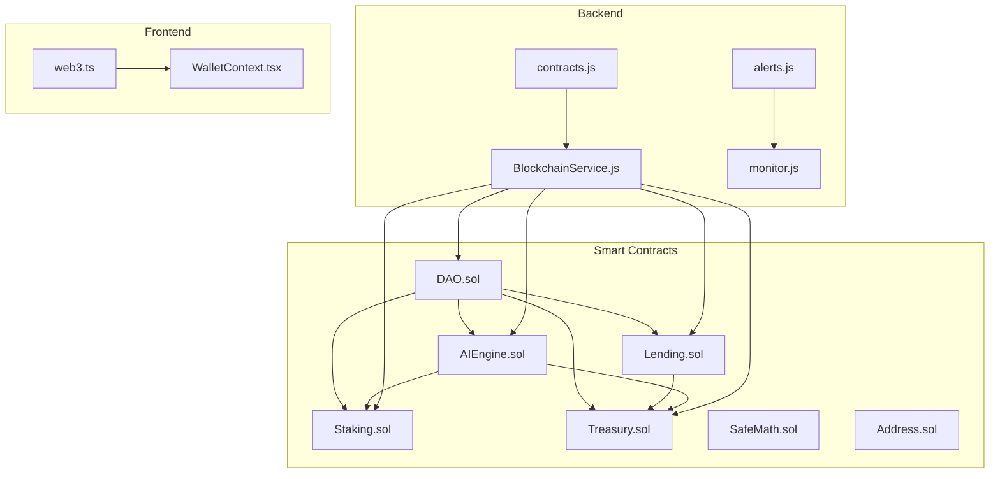
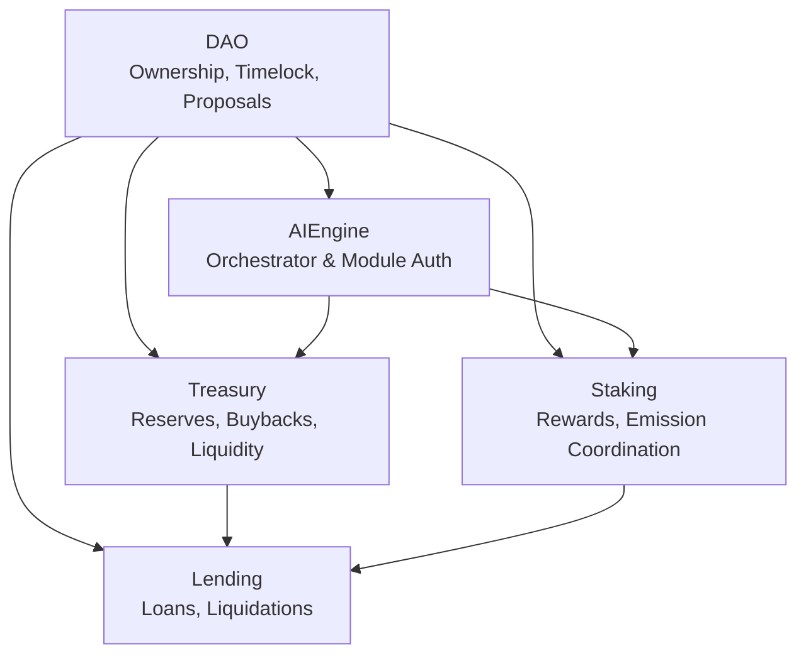
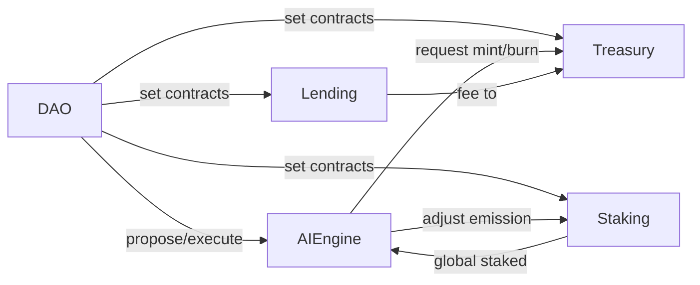

# Security Analysis

<cite>
**Referenced Files in This Document**
- [DAO.sol](file://neurafinance/contracts/core/DAO.sol)
- [Lending.sol](file://neurafinance/contracts/core/Lending.sol)
- [Staking.sol](file://neurafinance/contracts/core/Staking.sol)
- [Treasury.sol](file://neurafinance/contracts/core/Treasury.sol)
- [AIEngine.sol](file://neurafinance/contracts/ai-engine/AIEngine.sol)
- [SafeMath.sol](file://neurafinance/contracts/libraries/SafeMath.sol)
- [Address.sol](file://neurafinance/contracts/libraries/Address.sol)
- [BlockchainService.js](file://neurafinance/backend/src/services/BlockchainService.js)
- [alerts.js](file://neurafinance/backend/src/utils/alerts.js)
- [monitor.js](file://neurafinance/backend/src/jobs/monitor.js)
- [web3.ts](file://neurafinance/frontend/src/utils/web3.ts)
- [WalletContext.tsx](file://neurafinance/frontend/src/contexts/WalletContext.tsx)
- [contracts.js](file://neurafinance/backend/src/config/contracts.js)
- [IStaking.sol](file://neurafinance/contracts/interfaces/IStaking.sol)
- [ITreasury.sol](file://neurafinance/contracts/interfaces/ITreasury.sol)
</cite>

## Table of Contents
1. [Introduction](#introduction)
2. [Project Structure](#project-structure)
3. [Core Components](#core-components)
4. [Architecture Overview](#architecture-overview)
5. [Detailed Component Analysis](#detailed-component-analysis)
6. [Dependency Analysis](#dependency-analysis)
7. [Performance Considerations](#performance-considerations)
8. [Troubleshooting Guide](#troubleshooting-guide)
9. [Conclusion](#conclusion)
10. [Appendices](#appendices)

## Introduction
This document presents a comprehensive security analysis of NeuraFinance’s multi-layered security framework. It covers access control mechanisms, reentrancy protection, input validation, and emergency pause functionality across smart contracts, backend services, and frontend applications. The analysis includes risk assessment methodology, vulnerability mitigation strategies, and security audit recommendations tailored for both security analysts and blockchain specialists. Terminology aligns with the codebase, including “access control,” “reentrancy protection,” “SafeMath,” and “emergency pause.”

## Project Structure
NeuraFinance’s security model spans three layers:
- Smart contracts: Core protocols (DAO, Lending, Staking, Treasury), AI coordination (AIEngine), and shared libraries (SafeMath, Address).
- Backend services: Blockchain connectivity, monitoring, and alerting.
- Frontend applications: Wallet connection, network switching, and event listeners.

**Diagram sources**
- [DAO.sol:1-231](file://neurafinance/contracts/core/DAO.sol#L1-L231)
- [Lending.sol:1-308](file://neurafinance/contracts/core/Lending.sol#L1-L308)
- [Staking.sol:1-261](file://neurafinance/contracts/core/Staking.sol#L1-L261)
- [Treasury.sol:1-196](file://neurafinance/contracts/core/Treasury.sol#L1-L196)
- [AIEngine.sol:1-309](file://neurafinance/contracts/ai-engine/AIEngine.sol#L1-L309)
- [SafeMath.sol:1-33](file://neurafinance/contracts/libraries/SafeMath.sol#L1-L33)
- [Address.sol:1-56](file://neurafinance/contracts/libraries/Address.sol#L1-L56)
- [BlockchainService.js:1-216](file://neurafinance/backend/src/services/BlockchainService.js#L1-L216)
- [alerts.js:1-82](file://neurafinance/backend/src/utils/alerts.js#L1-L82)
- [monitor.js:1-141](file://neurafinance/backend/src/jobs/monitor.js#L1-L141)
- [web3.ts:1-118](file://neurafinance/frontend/src/utils/web3.ts#L1-L118)
- [WalletContext.tsx:1-102](file://neurafinance/frontend/src/contexts/WalletContext.tsx#L1-L102)
- [contracts.js:1-146](file://neurafinance/backend/src/config/contracts.js#L1-L146)

**Section sources**
- [DAO.sol:1-231](file://neurafinance/contracts/core/DAO.sol#L1-L231)
- [Lending.sol:1-308](file://neurafinance/contracts/core/Lending.sol#L1-L308)
- [Staking.sol:1-261](file://neurafinance/contracts/core/Staking.sol#L1-L261)
- [Treasury.sol:1-196](file://neurafinance/contracts/core/Treasury.sol#L1-L196)
- [AIEngine.sol:1-309](file://neurafinance/contracts/ai-engine/AIEngine.sol#L1-L309)
- [SafeMath.sol:1-33](file://neurafinance/contracts/libraries/SafeMath.sol#L1-L33)
- [Address.sol:1-56](file://neurafinance/contracts/libraries/Address.sol#L1-L56)
- [BlockchainService.js:1-216](file://neurafinance/backend/src/services/BlockchainService.js#L1-L216)
- [alerts.js:1-82](file://neurafinance/backend/src/utils/alerts.js#L1-L82)
- [monitor.js:1-141](file://neurafinance/backend/src/jobs/monitor.js#L1-L141)
- [web3.ts:1-118](file://neurafinance/frontend/src/utils/web3.ts#L1-L118)
- [WalletContext.tsx:1-102](file://neurafinance/frontend/src/contexts/WalletContext.tsx#L1-L102)
- [contracts.js:1-146](file://neurafinance/backend/src/config/contracts.js#L1-L146)

## Core Components
- Access control: Role-based modifiers and ownership patterns across contracts.
- Reentrancy protection: SafeMath arithmetic, explicit checks, and library utilities.
- Input validation: Strict preconditions, zero-address checks, and ratio limits.
- Emergency pause: Controlled pausing and withdrawal mechanisms.

Key security features:
- SafeMath library enforces overflow/underflow protections for all numeric operations.
- Modifiers enforce access control (owner-only, authorized callers).
- Emergency functions enable controlled asset withdrawals by designated roles.
- AIEngine coordinates system-wide actions with module-level authorization.

**Section sources**
- [SafeMath.sol:1-33](file://neurafinance/contracts/libraries/SafeMath.sol#L1-L33)
- [DAO.sol:35-43](file://neurafinance/contracts/core/DAO.sol#L35-L43)
- [Treasury.sol:42-50](file://neurafinance/contracts/core/Treasury.sol#L42-L50)
- [AIEngine.sol:47-63](file://neurafinance/contracts/ai-engine/AIEngine.sol#L47-L63)
- [Staking.sol:37-54](file://neurafinance/contracts/core/Staking.sol#L37-L54)
- [Lending.sol:46-54](file://neurafinance/contracts/core/Lending.sol#L46-L54)

## Architecture Overview
NeuraFinance employs a decentralized governance and autonomous stabilization architecture:
- DAO governs protocol upgrades and timelocked actions.
- AIEngine orchestrates modules for emission control, liquidity stabilization, and supply integrity.
- Treasury manages reserves, buybacks, and liquidity provisioning.
- Staking controls token emissions and rewards distribution.
- Lending manages collateralized borrowing with liquidation mechanics.

**Diagram sources**
- [DAO.sol:9-49](file://neurafinance/contracts/core/DAO.sol#L9-L49)
- [AIEngine.sol:15-71](file://neurafinance/contracts/ai-engine/AIEngine.sol#L15-L71)
- [Treasury.sol:12-56](file://neurafinance/contracts/core/Treasury.sol#L12-L56)
- [Staking.sol:25-59](file://neurafinance/contracts/core/Staking.sol#L25-L59)
- [Lending.sol:30-61](file://neurafinance/contracts/core/Lending.sol#L30-L61)

## Detailed Component Analysis

### Access Control Mechanisms
- Ownership patterns: Contracts maintain owner/pendingOwner fields with acceptance flows.
- Authorized callers: Treasury supports authorizedCaller mappings for restricted operations.
- Module authorization: AIEngine restricts module updates and operations to registered modules or owner.
- DAO governance: Proposals, voting thresholds, and timelock enforcement.

Security posture:
- Single-owner control with two-step acceptance reduces accidental misconfiguration.
- AuthorizedCaller minimizes blast radius of sensitive treasury operations.
- AIEngine module gating prevents unauthorized actors from triggering system actions.

**Section sources**
- [DAO.sol:26-43](file://neurafinance/contracts/core/DAO.sol#L26-L43)
- [DAO.sol:192-230](file://neurafinance/contracts/core/DAO.sol#L192-L230)
- [Treasury.sol:12-50](file://neurafinance/contracts/core/Treasury.sol#L12-L50)
- [Treasury.sol:156-164](file://neurafinance/contracts/core/Treasury.sol#L156-L164)
- [AIEngine.sol:47-63](file://neurafinance/contracts/ai-engine/AIEngine.sol#L47-L63)
- [AIEngine.sol:265-292](file://neurafinance/contracts/ai-engine/AIEngine.sol#L265-L292)

### Reentrancy Protection
- SafeMath arithmetic: All additions, subtractions, multiplications, divisions, and mods include overflow/underflow checks.
- Library utilities: Address library provides safe low-level call helpers and result verification.
- Explicit checks: Functions validate state transitions and preconditions before transfers.

Mitigations:
- No direct reentrancy vectors observed in reviewed files; SafeMath and Address library usage reduces arithmetic and call-side risks.

**Section sources**
- [SafeMath.sol:5-31](file://neurafinance/contracts/libraries/SafeMath.sol#L5-L31)
- [Address.sol:9-55](file://neurafinance/contracts/libraries/Address.sol#L9-L55)
- [Lending.sol:102-154](file://neurafinance/contracts/core/Lending.sol#L102-L154)
- [Staking.sol:61-117](file://neurafinance/contracts/core/Staking.sol#L61-L117)

### Input Validation
- Zero-address checks: Ownership transfers and recipient validations prevent invalid recipients.
- Ratio and threshold limits: Collateral asset configuration enforces LTV ceilings and thresholds.
- State checks: Loan and stake operations validate active/liquidated states and locking periods.

Validation examples:
- Collateral asset creation validates token addresses, LTV ratios, and thresholds.
- Borrow requests validate collateral and borrow amounts and compute maximum borrow based on collateral value.
- Staking validates lock durations and ensures non-zero amounts.

**Section sources**
- [DAO.sol:193-203](file://neurafinance/contracts/core/DAO.sol#L193-L203)
- [Treasury.sol:60-78](file://neurafinance/contracts/core/Treasury.sol#L60-L78)
- [Lending.sol:68-100](file://neurafinance/contracts/core/Lending.sol#L68-L100)
- [Lending.sol:115-154](file://neurafinance/contracts/core/Lending.sol#L115-L154)
- [Staking.sol:61-93](file://neurafinance/contracts/core/Staking.sol#L61-L93)

### Emergency Pause Functionality
- Staking pause: A paused flag with a whenNotPaused modifier blocks staking/unstaking/claiming until unpaused.
- Emergency withdraw: Owner-only withdrawals from Staking and Treasury enable asset retrieval under duress.
- AIEngine update gating: System update intervals prevent excessive module-triggered actions.

Operational safety:
- Emergency pause allows immediate halt of risky operations while preserving funds.
- Emergency withdraw enables recovery of misrouted assets to designated recipients.

**Section sources**
- [Staking.sol:37-54](file://neurafinance/contracts/core/Staking.sol#L37-L54)
- [Staking.sol:252-259](file://neurafinance/contracts/core/Staking.sol#L252-L259)
- [Treasury.sol:191-194](file://neurafinance/contracts/core/Treasury.sol#L191-L194)
- [AIEngine.sol:240-261](file://neurafinance/contracts/ai-engine/AIEngine.sol#L240-L261)

### AI Engine Orchestration and Module Authorization
- Module authorization: onlyModule modifier restricts mint/burn, buyback, and liquidity actions to registered modules or owner.
- System health scoring: Computes health based on staking ratio, treasury backing, and price stability.
- Controlled emissions: Emission adjustments and mint/burn requests validated by Supply Integrity Guard.

Security implications:
- Module isolation prevents unauthorized manipulation of monetary policy.
- Health-based parameter tuning reduces systemic risk during stress events.

**Section sources**
- [AIEngine.sol:47-63](file://neurafinance/contracts/ai-engine/AIEngine.sol#L47-L63)
- [AIEngine.sol:147-176](file://neurafinance/contracts/ai-engine/AIEngine.sol#L147-L176)
- [AIEngine.sol:202-225](file://neurafinance/contracts/ai-engine/AIEngine.sol#L202-L225)
- [AIEngine.sol:240-261](file://neurafinance/contracts/ai-engine/AIEngine.sol#L240-L261)

### DAO Governance and Timelock Controls
- Proposal lifecycle: Creation, voting delays, quorum, and execution with cancellation rules.
- Voting power: Aggregates staked and token balances to prevent centralization of voting.
- Timelock: Dedicated timelock address can execute finalized proposals.

Governance safeguards:
- Proposal threshold and quorum protect against Sybil attacks.
- Timelock introduces a delay for critical upgrades.

**Section sources**
- [DAO.sol:51-126](file://neurafinance/contracts/core/DAO.sol#L51-L126)
- [DAO.sol:128-168](file://neurafinance/contracts/core/DAO.sol#L128-L168)
- [DAO.sol:205-229](file://neurafinance/contracts/core/DAO.sol#L205-L229)

### Treasury Access Control and Reserve Management
- Authorized callers: Only owner or authorized callers can withdraw or manage liquidity.
- Buyback and liquidity: Cooldowns and thresholds prevent market manipulation.
- Reserve ratios: Configurable reserve ratios for liquidity provision.

Risk controls:
- AuthorizedCaller mapping limits who can move funds.
- Buyback cooldown and thresholds mitigate front-running and pump-and-dump risks.

**Section sources**
- [Treasury.sol:42-50](file://neurafinance/contracts/core/Treasury.sol#L42-L50)
- [Treasury.sol:80-111](file://neurafinance/contracts/core/Treasury.sol#L80-L111)
- [Treasury.sol:156-189](file://neurafinance/contracts/core/Treasury.sol#L156-L189)

### Lending Collateral and Liquidation Mechanics
- Collateral assets: Configurable LTV, thresholds, and interest rates with activation controls.
- Liquidation: Health factor checks and liquidator bonuses with protocol fees.
- Repayment: Principal and interest splits with treasury fee allocation.

Safety nets:
- Health factor enforcement prevents liquidation of solvent positions.
- Liquidation bonus incentivizes timely liquidations while reserving protocol fees.

**Section sources**
- [Lending.sol:68-100](file://neurafinance/contracts/core/Lending.sol#L68-L100)
- [Lending.sol:196-227](file://neurafinance/contracts/core/Lending.sol#L196-L227)
- [Lending.sol:261-271](file://neurafinance/contracts/core/Lending.sol#L261-L271)

### Backend Monitoring and Alerting
- Monitor job: Periodic checks for TVL, price deviations, system health, and block progress.
- Alert service: Webhook/email notifications for critical/warning/info events.
- Blockchain service: Robust wrappers around contract calls with error logging.

Operational resilience:
- Continuous monitoring detects anomalies early.
- Structured alerting enables rapid incident response.

**Section sources**
- [monitor.js:12-125](file://neurafinance/backend/src/jobs/monitor.js#L12-L125)
- [alerts.js:10-82](file://neurafinance/backend/src/utils/alerts.js#L10-L82)
- [BlockchainService.js:18-213](file://neurafinance/backend/src/services/BlockchainService.js#L18-L213)

### Frontend Wallet and Network Management
- Provider/signer initialization: Ethers-based browser provider and signer management.
- Account and chain listeners: Real-time updates for wallet/account/network changes.
- Network switching: Supports Polygon Mainnet and Mumbai testnet configurations.

Security considerations:
- Ensures users operate on correct networks and with connected accounts.
- Listeners clean-up prevents memory leaks and stale handlers.

**Section sources**
- [web3.ts:15-91](file://neurafinance/frontend/src/utils/web3.ts#L15-L91)
- [WalletContext.tsx:23-87](file://neurafinance/frontend/src/contexts/WalletContext.tsx#L23-L87)

## Dependency Analysis
Inter-contract dependencies and authorization flows:

**Diagram sources**
- [DAO.sol:23-28](file://neurafinance/contracts/core/DAO.sol#L23-L28)
- [DAO.sol:223-229](file://neurafinance/contracts/core/DAO.sol#L223-L229)
- [AIEngine.sol:88-97](file://neurafinance/contracts/ai-engine/AIEngine.sol#L88-L97)
- [AIEngine.sol:180-199](file://neurafinance/contracts/ai-engine/AIEngine.sol#L180-L199)
- [Lending.sol:170-181](file://neurafinance/contracts/core/Lending.sol#L170-L181)

**Section sources**
- [DAO.sol:23-28](file://neurafinance/contracts/core/DAO.sol#L23-L28)
- [AIEngine.sol:88-97](file://neurafinance/contracts/ai-engine/AIEngine.sol#L88-L97)
- [AIEngine.sol:180-199](file://neurafinance/contracts/ai-engine/AIEngine.sol#L180-L199)
- [Lending.sol:170-181](file://neurafinance/contracts/core/Lending.sol#L170-L181)

## Performance Considerations
- Gas efficiency: SafeMath and minimal state reads improve transaction predictability.
- Batch operations: Backend monitoring aggregates metrics to reduce redundant RPC calls.
- Frontend responsiveness: Debounced wallet checks and listener cleanup avoid UI blocking.

[No sources needed since this section provides general guidance]

## Troubleshooting Guide
Common issues and remediation steps:
- Transaction failures due to arithmetic errors: Verify SafeMath usage and input bounds.
- Unauthorized access attempts: Confirm ownership and authorized caller states.
- Emergency pause activation: Review pause triggers and ensure unpausing after resolution.
- Monitoring alerts: Investigate TVL drops, price spikes, or health score declines; escalate to DAO governance.

**Section sources**
- [SafeMath.sol:5-31](file://neurafinance/contracts/libraries/SafeMath.sol#L5-L31)
- [alerts.js:10-82](file://neurafinance/backend/src/utils/alerts.js#L10-L82)
- [monitor.js:21-84](file://neurafinance/backend/src/jobs/monitor.js#L21-L84)
- [Staking.sol:37-54](file://neurafinance/contracts/core/Staking.sol#L37-L54)

## Conclusion
NeuraFinance’s security framework integrates robust access control, validated arithmetic via SafeMath, and module-gated orchestration through AIEngine. Emergency pause and emergency withdraw capabilities provide operational resilience. Backend monitoring and alerting complement on-chain safeguards, while frontend wallet management ensures secure user interactions. Continued vigilance, regular audits, and adherence to best practices will sustain the system’s integrity.

[No sources needed since this section summarizes without analyzing specific files]

## Appendices

### Risk Assessment Methodology
- Threat modeling: Identify actors, attack surfaces, and failure modes.
- Vulnerability mapping: Cross-reference code paths with known exploit categories (reentrancy, arithmetic, access control).
- Mitigation prioritization: Focus on high-impact, high-probability risks first.
- Monitoring and alerting: Establish baselines and thresholds for anomaly detection.

[No sources needed since this section provides general guidance]

### Security Audit Recommendations
- Formal verification: Apply symbolic execution to critical arithmetic paths.
- Third-party audits: Engage specialized firms for comprehensive assessments.
- Upgradeable contracts: Use timelock governance for upgrades; restrict module addresses.
- Operational security: Enforce multi-signature requirements for emergency actions.

[No sources needed since this section provides general guidance]

### Security Best Practices
- Principle of least privilege: Minimize roles and delegate authority.
- Defensive programming: Validate inputs, check balances, and enforce state transitions.
- Separation of concerns: Keep monetary policy, governance, and operational tasks isolated.
- Incident response: Define escalation paths, communication plans, and recovery procedures.

[No sources needed since this section provides general guidance]

### Compliance Considerations
- KYC/AML: Integrate whitelisting and transaction monitoring where applicable.
- Reporting: Maintain logs for regulatory reporting and audits.
- Governance transparency: Public proposal and vote records enhance trust.

[No sources needed since this section provides general guidance]

### Continuous Security Monitoring Approaches
- Metrics: Track TVL, price stability, health scores, and gas usage.
- Automated alerts: Configure thresholds for rapid intervention.
- Post-mortem reviews: Document incidents, root causes, and remediations.

**Section sources**
- [monitor.js:12-125](file://neurafinance/backend/src/jobs/monitor.js#L12-L125)
- [alerts.js:10-82](file://neurafinance/backend/src/utils/alerts.js#L10-L82)