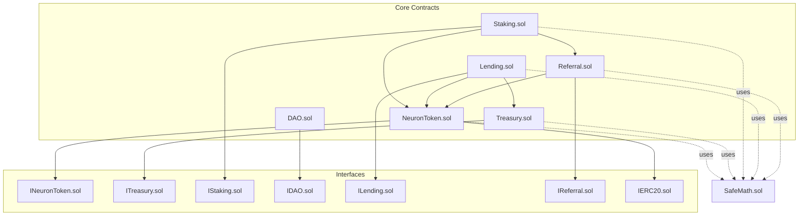
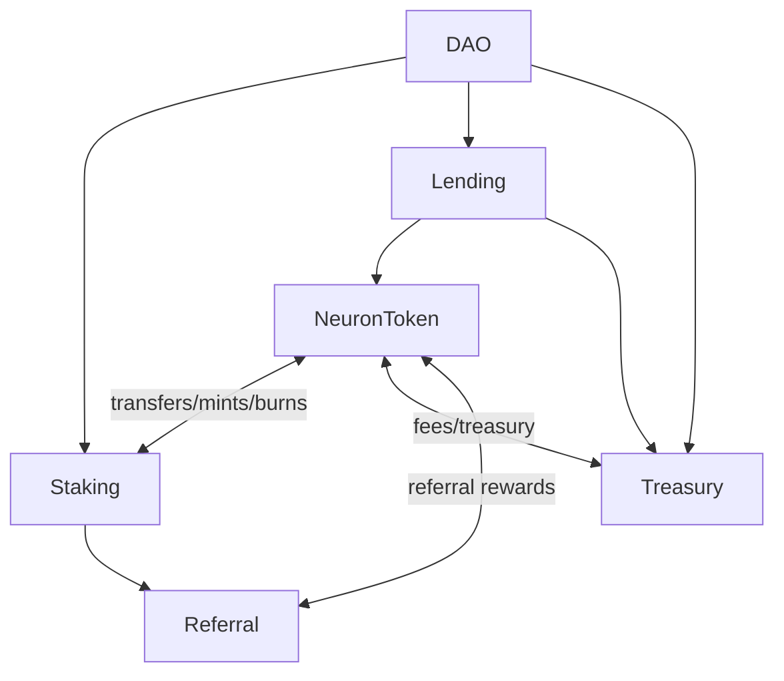
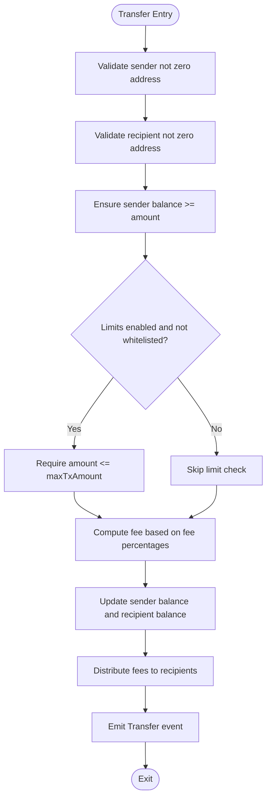
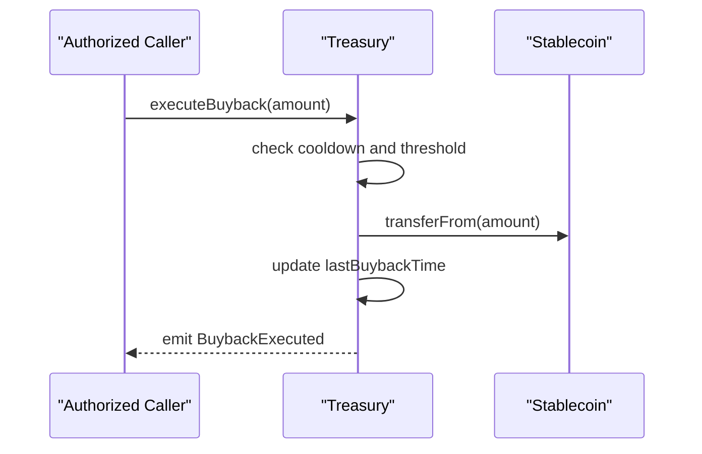
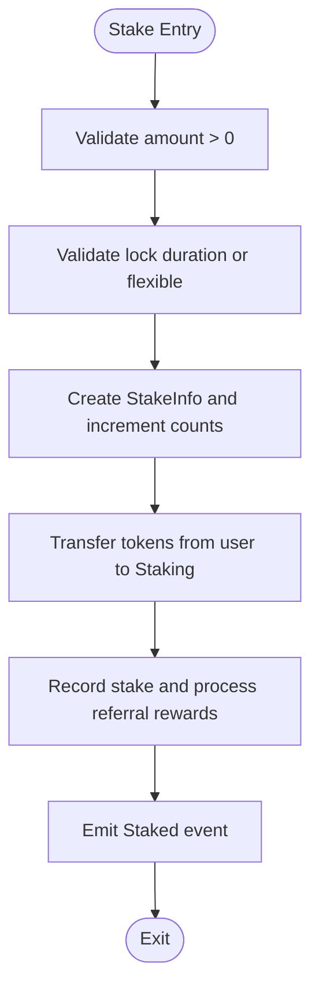
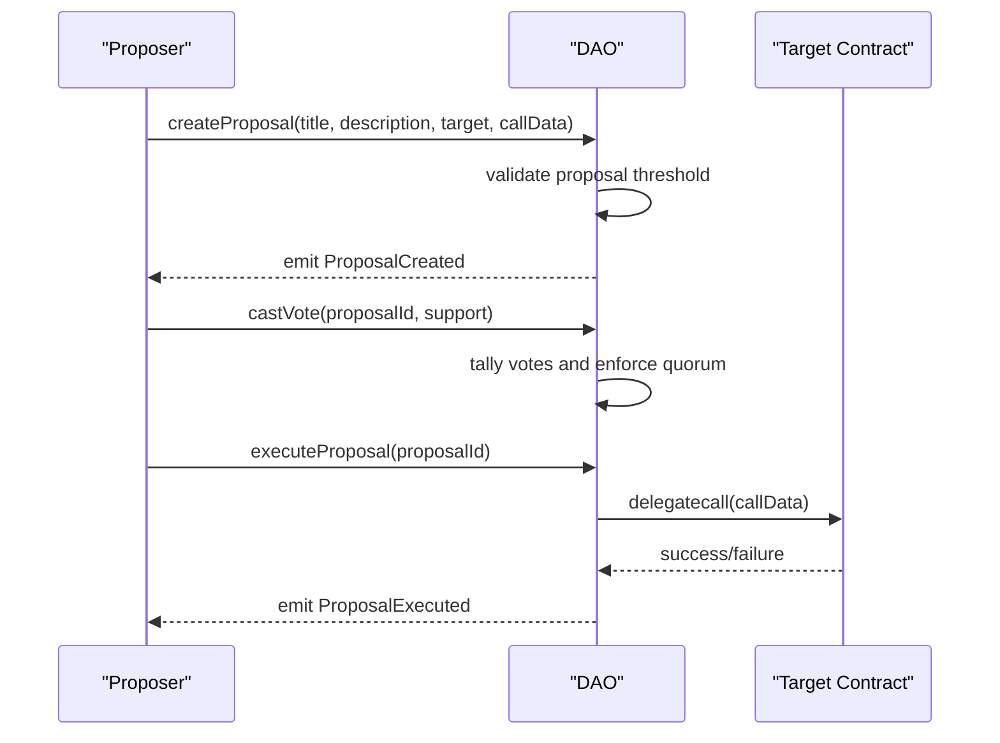
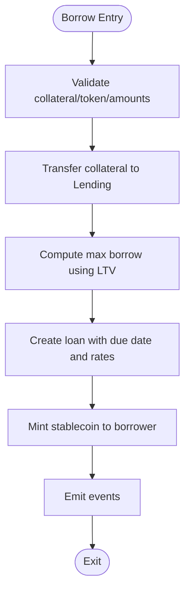
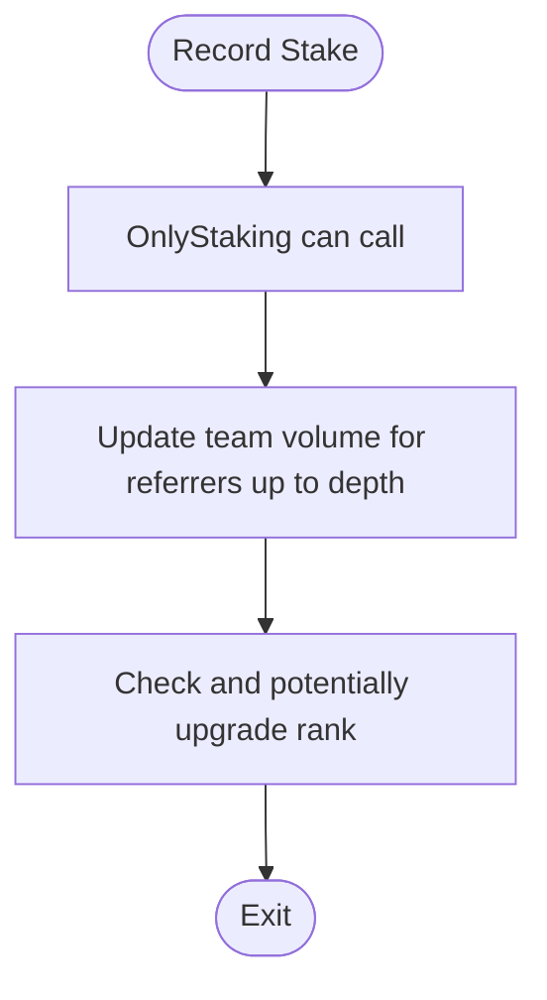
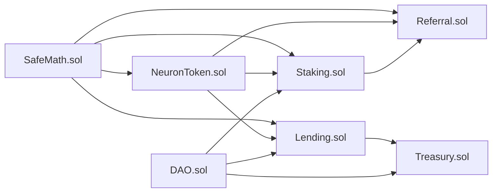

# Smart Contract Security

<cite>
**Referenced Files in This Document**
- [NeuronToken.sol](file://neurafinance/contracts/core/NeuronToken.sol)
- [Treasury.sol](file://neurafinance/contracts/core/Treasury.sol)
- [Staking.sol](file://neurafinance/contracts/core/Staking.sol)
- [DAO.sol](file://neurafinance/contracts/core/DAO.sol)
- [Lending.sol](file://neurafinance/contracts/core/Lending.sol)
- [Referral.sol](file://neurafinance/contracts/core/Referral.sol)
- [SafeMath.sol](file://neurafinance/contracts/libraries/SafeMath.sol)
- [INeuronToken.sol](file://neurafinance/contracts/interfaces/INeuronToken.sol)
- [ITreasury.sol](file://neurafinance/contracts/interfaces/ITreasury.sol)
- [IStaking.sol](file://neurafinance/contracts/interfaces/IStaking.sol)
- [IDAO.sol](file://neurafinance/contracts/interfaces/IDAO.sol)
- [ILending.sol](file://neurafinance/contracts/interfaces/ILending.sol)
- [IReferral.sol](file://neurafinance/contracts/interfaces/IReferral.sol)
- [IERC20.sol](file://neurafinance/contracts/interfaces/IERC20.sol)
</cite>

## Table of Contents
1. [Introduction](#introduction)
2. [Project Structure](#project-structure)
3. [Core Components](#core-components)
4. [Architecture Overview](#architecture-overview)
5. [Detailed Component Analysis](#detailed-component-analysis)
6. [Dependency Analysis](#dependency-analysis)
7. [Performance Considerations](#performance-considerations)
8. [Troubleshooting Guide](#troubleshooting-guide)
9. [Conclusion](#conclusion)

## Introduction
This document presents a comprehensive security analysis of the NeuraFinance smart contracts suite. It focuses on access control mechanisms, reentrancy protections, input validation, overflow/underflow prevention via SafeMath, emergency pause functionality, timelock-enabled governance, and DAO-level operational controls. The goal is to explain how each core contract enforces security, how they interoperate, and how common DeFi vulnerabilities are mitigated within the NeuraFinance context.

## Project Structure
The security-critical contracts are organized under the core module, with supporting interfaces and a shared SafeMath library. Each contract implements robust access control and state transitions guarded by modifiers and explicit checks.

**Diagram sources**
- [NeuronToken.sol:1-253](file://neurafinance/contracts/core/NeuronToken.sol#L1-L253)
- [Treasury.sol:1-196](file://neurafinance/contracts/core/Treasury.sol#L1-L196)
- [Staking.sol:1-261](file://neurafinance/contracts/core/Staking.sol#L1-L261)
- [DAO.sol:1-231](file://neurafinance/contracts/core/DAO.sol#L1-L231)
- [Lending.sol:1-308](file://neurafinance/contracts/core/Lending.sol#L1-L308)
- [Referral.sol:1-202](file://neurafinance/contracts/core/Referral.sol#L1-L202)
- [SafeMath.sol:1-33](file://neurafinance/contracts/libraries/SafeMath.sol#L1-L33)
- [INeuronToken.sol:1-20](file://neurafinance/contracts/interfaces/INeuronToken.sol#L1-L20)
- [ITreasury.sol:1-17](file://neurafinance/contracts/interfaces/ITreasury.sol#L1-L17)
- [IStaking.sol:1-31](file://neurafinance/contracts/interfaces/IStaking.sol#L1-L31)
- [IDAO.sol:1-51](file://neurafinance/contracts/interfaces/IDAO.sol#L1-L51)
- [ILending.sol:1-40](file://neurafinance/contracts/interfaces/ILending.sol#L1-L40)
- [IReferral.sol:1-32](file://neurafinance/contracts/interfaces/IReferral.sol#L1-L32)
- [IERC20.sol:1-15](file://neurafinance/contracts/interfaces/IERC20.sol#L1-L15)

**Section sources**
- [NeuronToken.sol:1-253](file://neurafinance/contracts/core/NeuronToken.sol#L1-L253)
- [Treasury.sol:1-196](file://neurafinance/contracts/core/Treasury.sol#L1-L196)
- [Staking.sol:1-261](file://neurafinance/contracts/core/Staking.sol#L1-L261)
- [DAO.sol:1-231](file://neurafinance/contracts/core/DAO.sol#L1-L231)
- [Lending.sol:1-308](file://neurafinance/contracts/core/Lending.sol#L1-L308)
- [Referral.sol:1-202](file://neurafinance/contracts/core/Referral.sol#L1-L202)
- [SafeMath.sol:1-33](file://neurafinance/contracts/libraries/SafeMath.sol#L1-L33)

## Core Components
- Access Control: Ownable pattern with owner/pendingOwner handoff and role-based authorization (authorizedMinters, authorizedCallers, onlyOwner/onlyAuthorized modifiers).
- Reentrancy Protection: Checks-Effects-Interactions pattern and explicit reentrancy guards via modifiers and safe state updates.
- Input Validation: Comprehensive preconditions on amounts, addresses, ratios, and durations; enforced via require statements and helper validations.
- SafeMath Library: Centralized arithmetic with overflow/underflow checks for all numeric operations.
- Emergency Pause: Contract-wide pausing mechanism (Staking) and emergency withdrawal capabilities (Treasury, Lending).
- Timelock Governance: DAO integrates a timelock address for sensitive operations and proposal lifecycle management.
- Multi-signature Governance: DAO’s proposal execution model and timelock enforce delayed, governed actions.

**Section sources**
- [NeuronToken.sol:19-55](file://neurafinance/contracts/core/NeuronToken.sol#L19-L55)
- [Treasury.sol:23-50](file://neurafinance/contracts/core/Treasury.sol#L23-L50)
- [Staking.sol:37-54](file://neurafinance/contracts/core/Staking.sol#L37-L54)
- [DAO.sol:26-43](file://neurafinance/contracts/core/DAO.sol#L26-L43)
- [SafeMath.sol:1-33](file://neurafinance/contracts/libraries/SafeMath.sol#L1-L33)

## Architecture Overview
The contracts form a cohesive ecosystem:
- NeuronToken governs token issuance, transfers, and fee distribution with mint/burn controls.
- Treasury manages reserves, buybacks, and liquidity provisioning with authorized callers.
- Staking orchestrates bonding periods, reward calculations, and emergency pause.
- DAO defines governance, voting, and timelocked execution.
- Lending handles collateralized borrowing, interest accrual, and liquidation mechanics.
- Referral tracks upline rewards and rank progression, integrated with staking.

**Diagram sources**
- [NeuronToken.sol:1-253](file://neurafinance/contracts/core/NeuronToken.sol#L1-L253)
- [Treasury.sol:1-196](file://neurafinance/contracts/core/Treasury.sol#L1-L196)
- [Staking.sol:1-261](file://neurafinance/contracts/core/Staking.sol#L1-L261)
- [DAO.sol:1-231](file://neurafinance/contracts/core/DAO.sol#L1-L231)
- [Lending.sol:1-308](file://neurafinance/contracts/core/Lending.sol#L1-L308)
- [Referral.sol:1-202](file://neurafinance/contracts/core/Referral.sol#L1-L202)

## Detailed Component Analysis

### NeuronToken Security Architecture
- Access Control
  - Ownable pattern with owner/pendingOwner handoff.
  - Role-based minters via authorizedMinters mapping.
  - Whitelisting for transaction limits enforcement.
- Reentrancy Protection
  - Uses SafeMath for all arithmetic.
  - Applies checks-effects-interactions: validates inputs, updates state, then performs external transfers.
- Input Validation
  - Zero-address checks for approvals/transfers.
  - Limits enforcement via maxTxAmount and whitelisted flag.
  - Fee caps and valid recipients.
- SafeMath Usage
  - Centralized arithmetic with overflow/underflow detection.
- Emergency Controls
  - No emergency withdrawal in NeuronToken; emergency mechanisms are present in Treasury and Lending.
- Fee Distribution
  - Distributes fees to treasury, liquidity, and rewards recipients with proportional shares.

**Diagram sources**
- [NeuronToken.sol:94-128](file://neurafinance/contracts/core/NeuronToken.sol#L94-L128)
- [SafeMath.sol:1-33](file://neurafinance/contracts/libraries/SafeMath.sol#L1-L33)

**Section sources**
- [NeuronToken.sol:19-55](file://neurafinance/contracts/core/NeuronToken.sol#L19-L55)
- [NeuronToken.sol:94-151](file://neurafinance/contracts/core/NeuronToken.sol#L94-L151)
- [SafeMath.sol:1-33](file://neurafinance/contracts/libraries/SafeMath.sol#L1-L33)
- [INeuronToken.sol:1-20](file://neurafinance/contracts/interfaces/INeuronToken.sol#L1-L20)

### Treasury Security Architecture
- Access Control
  - Ownable with pendingOwner handoff.
  - Authorized callers for restricted operations (withdraw, buyback, liquidity).
- Reentrancy Protection
  - Uses SafeMath for arithmetic.
  - Updates state before external transfers.
- Input Validation
  - Supports only approved stablecoins and NEURON token.
  - Non-zero amounts and valid recipients.
- Emergency Controls
  - Emergency withdrawal by owner to arbitrary recipient.
- Buyback and Liquidity
  - Cooldown enforcement and price threshold checks.
  - Reserve ratio configuration for liquidity.

**Diagram sources**
- [Treasury.sol:80-97](file://neurafinance/contracts/core/Treasury.sol#L80-L97)

**Section sources**
- [Treasury.sol:23-50](file://neurafinance/contracts/core/Treasury.sol#L23-L50)
- [Treasury.sol:60-97](file://neurafinance/contracts/core/Treasury.sol#L60-L97)
- [ITreasury.sol:1-17](file://neurafinance/contracts/interfaces/ITreasury.sol#L1-L17)

### Staking Security Architecture
- Access Control
  - Ownable with pendingOwner handoff.
  - Emergency pause toggle controlled by owner.
- Reentrancy Protection
  - Uses SafeMath for arithmetic.
  - State updates occur before external token transfers.
- Input Validation
  - Valid bond durations enforced via helper.
  - Flexible vs bonded stake distinction.
- Emergency Controls
  - Owner can emergencyWithdraw NEURON tokens.
- Reward Mechanics
  - Reward calculation based on stake amount, rate, and elapsed time.
  - Rewards compounded back into stake or claimed to user.

**Diagram sources**
- [Staking.sol:61-93](file://neurafinance/contracts/core/Staking.sol#L61-L93)

**Section sources**
- [Staking.sol:37-54](file://neurafinance/contracts/core/Staking.sol#L37-L54)
- [Staking.sol:61-117](file://neurafinance/contracts/core/Staking.sol#L61-L117)
- [IStaking.sol:1-31](file://neurafinance/contracts/interfaces/IStaking.sol#L1-L31)

### DAO Security Architecture
- Access Control
  - Ownable with pendingOwner handoff.
  - Timelock modifier restricts sensitive operations.
- Reentrancy Protection
  - Uses SafeMath for arithmetic.
  - Execution uses low-level call with success require.
- Input Validation
  - Proposal threshold and quorum enforced.
  - Voting power derived from staked and token balances.
- Governance Lifecycle
  - Proposal creation, voting window, cancellation, and execution.
  - Timelock integration for delayed execution.

**Diagram sources**
- [DAO.sol:51-110](file://neurafinance/contracts/core/DAO.sol#L51-L110)

**Section sources**
- [DAO.sol:26-43](file://neurafinance/contracts/core/DAO.sol#L26-L43)
- [DAO.sol:51-110](file://neurafinance/contracts/core/DAO.sol#L51-L110)
- [IDAO.sol:1-51](file://neurafinance/contracts/interfaces/IDAO.sol#L1-L51)

### Lending Security Architecture
- Access Control
  - Ownable with pendingOwner handoff.
  - Collateral asset management restricted to owner.
- Reentrancy Protection
  - Uses SafeMath for arithmetic.
  - State updates before external transfers.
- Input Validation
  - Collateral asset activation and LTV thresholds.
  - Borrow amount constrained by collateral value and LTV.
- Liquidation Mechanics
  - Health factor checks before liquidation.
  - Liquidator receives bonus; protocol collects fee; collateral returned upon full repayment.
- Emergency Controls
  - Owner can emergencyWithdraw arbitrary tokens.

**Diagram sources**
- [Lending.sol:111-155](file://neurafinance/contracts/core/Lending.sol#L111-L155)

**Section sources**
- [Lending.sol:46-54](file://neurafinance/contracts/core/Lending.sol#L46-L54)
- [Lending.sol:111-155](file://neurafinance/contracts/core/Lending.sol#L111-L155)
- [ILending.sol:1-40](file://neurafinance/contracts/interfaces/ILending.sol#L1-L40)

### Referral Security Architecture
- Access Control
  - Ownable with pendingOwner handoff.
  - OnlyStaking modifier ensures referral updates originate from Staking.
- Reentrancy Protection
  - Uses SafeMath for arithmetic.
  - Updates state before minting rewards.
- Input Validation
  - Self-referral prohibited; zero referrer disallowed.
  - Rank requirement updates validated by owner.
- Reward Mechanics
  - Direct referral reward and tiered rank bonuses.
  - Team volume and referral count tracked for rank progression.

**Diagram sources**
- [Referral.sol:82-97](file://neurafinance/contracts/core/Referral.sol#L82-L97)

**Section sources**
- [Referral.sol:34-42](file://neurafinance/contracts/core/Referral.sol#L34-L42)
- [Referral.sol:82-119](file://neurafinance/contracts/core/Referral.sol#L82-L119)
- [IReferral.sol:1-32](file://neurafinance/contracts/interfaces/IReferral.sol#L1-L32)

## Dependency Analysis
- Shared Arithmetic Safety
  - All core contracts import and use SafeMath for arithmetic operations.
- Cross-Contract Dependencies
  - Staking depends on NeuronToken for transfers and minting.
  - Lending depends on NeuronToken, Stablecoin, and Treasury for protocol fees and collateral.
  - Referral integrates with Staking to compute rank and rewards.
  - DAO coordinates governance across Staking, Lending, and Treasury via proposal execution.
- Interface Contracts
  - ERC20 compliance via IERC20.
  - Domain-specific interfaces define method signatures and events.

**Diagram sources**
- [SafeMath.sol:1-33](file://neurafinance/contracts/libraries/SafeMath.sol#L1-L33)
- [NeuronToken.sol:1-253](file://neurafinance/contracts/core/NeuronToken.sol#L1-L253)
- [Staking.sol:1-261](file://neurafinance/contracts/core/Staking.sol#L1-L261)
- [Lending.sol:1-308](file://neurafinance/contracts/core/Lending.sol#L1-L308)
- [Referral.sol:1-202](file://neurafinance/contracts/core/Referral.sol#L1-L202)
- [Treasury.sol:1-196](file://neurafinance/contracts/core/Treasury.sol#L1-L196)
- [DAO.sol:1-231](file://neurafinance/contracts/core/DAO.sol#L1-L231)

**Section sources**
- [SafeMath.sol:1-33](file://neurafinance/contracts/libraries/SafeMath.sol#L1-L33)
- [IERC20.sol:1-15](file://neurafinance/contracts/interfaces/IERC20.sol#L1-L15)
- [INeuronToken.sol:1-20](file://neurafinance/contracts/interfaces/INeuronToken.sol#L1-L20)
- [IStaking.sol:1-31](file://neurafinance/contracts/interfaces/IStaking.sol#L1-L31)
- [ILending.sol:1-40](file://neurafinance/contracts/interfaces/ILending.sol#L1-L40)
- [IReferral.sol:1-32](file://neurafinance/contracts/interfaces/IReferral.sol#L1-L32)
- [ITreasury.sol:1-17](file://neurafinance/contracts/interfaces/ITreasury.sol#L1-L17)
- [IDAO.sol:1-51](file://neurafinance/contracts/interfaces/IDAO.sol#L1-L51)

## Performance Considerations
- Gas Efficiency
  - SafeMath operations add minimal overhead but prevent costly runtime failures.
  - Array resizing in Staking’s getUserStakes incurs dynamic allocation costs; consider batching queries off-chain.
- State Read-Write Patterns
  - Frequent mapping reads/writes across Staking and Lending; optimize hot paths by caching values off-chain.
- External Calls
  - Delegatecalls in DAO execution carry higher risk; ensure minimal calldata and validate target addresses.

## Troubleshooting Guide
- Reentrancy Failures
  - Symptoms: Unexpected balance changes or reversion during external calls.
  - Mitigation: Verify checks-effects-interactions order and rely on SafeMath.
- Overflow/Underflow
  - Symptoms: Zero balances after arithmetic or revert on division.
  - Mitigation: Ensure all numeric operations use SafeMath.
- Unauthorized Access
  - Symptoms: Minting, withdrawals, or configuration changes by non-owner.
  - Mitigation: Confirm onlyOwner/onlyAuthorized modifiers and role checks.
- Governance Execution Failures
  - Symptoms: DAO proposal execution fails silently.
  - Mitigation: Verify target address and calldata validity; ensure success is checked.

**Section sources**
- [SafeMath.sol:1-33](file://neurafinance/contracts/libraries/SafeMath.sol#L1-L33)
- [DAO.sol:99-110](file://neurafinance/contracts/core/DAO.sol#L99-L110)

## Conclusion
NeuraFinance implements a layered security model across its core contracts:
- Strong access control via Ownable and role-based authorization.
- Robust arithmetic safety with SafeMath.
- Defensive programming patterns including checks-effects-interactions and explicit input validation.
- Emergency pause and withdrawal mechanisms for crisis response.
- Governance via DAO with timelock integration for delayed, transparent execution.

These practices collectively mitigate common DeFi risks such as reentrancy, arithmetic errors, front-running, and unauthorized access, while maintaining operational flexibility for protocol upgrades and risk controls.