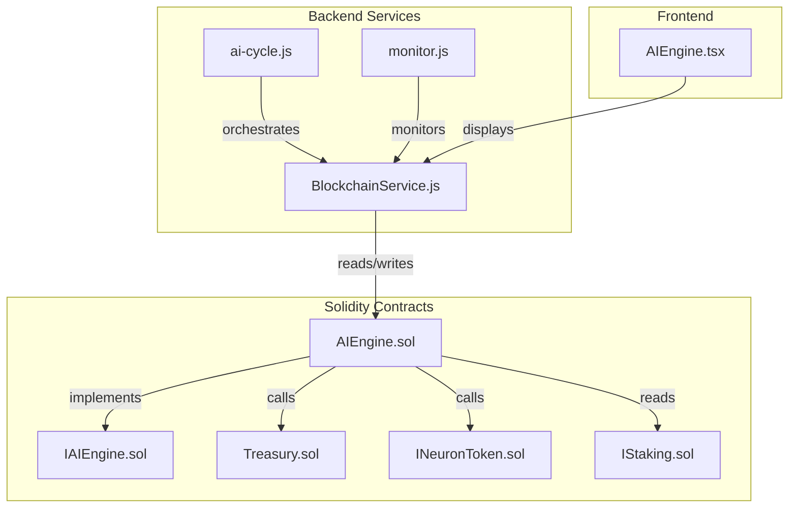
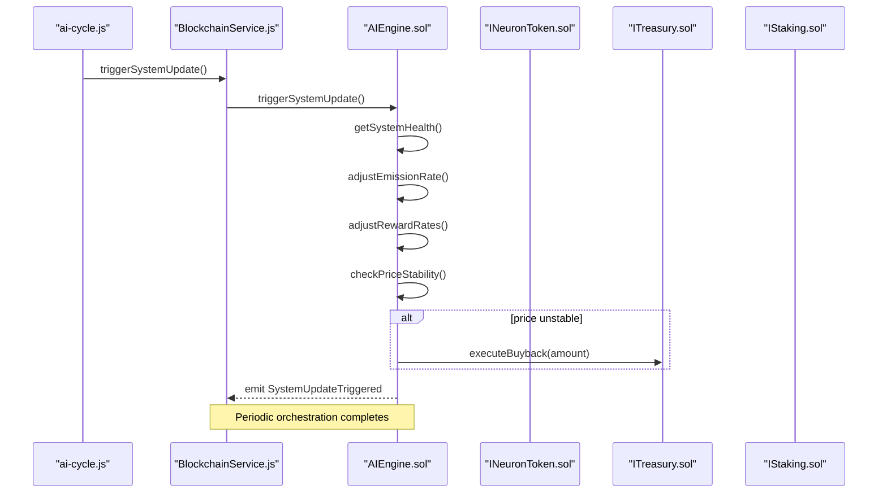
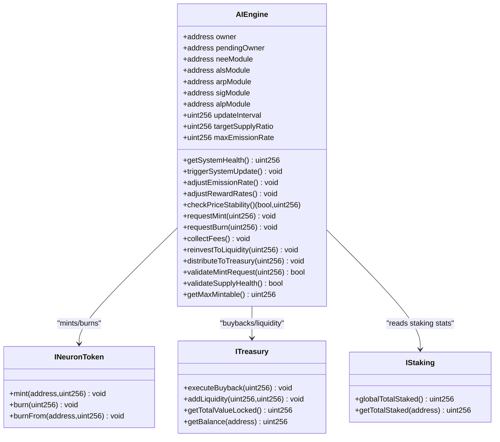
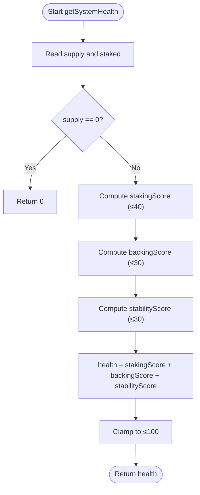
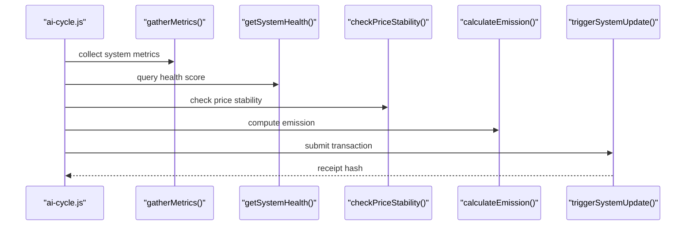
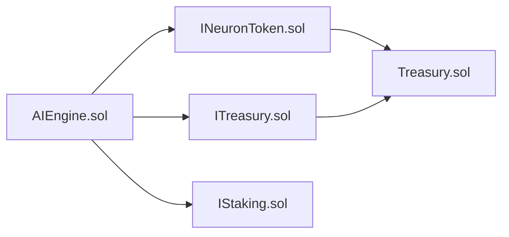

# AI Engine Orchestration

<cite>
**Referenced Files in This Document**
- [AIEngine.sol](file://neurafinance/contracts/ai-engine/AIEngine.sol)
- [IAIEngine.sol](file://neurafinance/contracts/interfaces/IAIEngine.sol)
- [INeuronToken.sol](file://neurafinance/contracts/interfaces/INeuronToken.sol)
- [ITreasury.sol](file://neurafinance/contracts/interfaces/ITreasury.sol)
- [IStaking.sol](file://neurafinance/contracts/interfaces/IStaking.sol)
- [Treasury.sol](file://neurafinance/contracts/core/Treasury.sol)
- [BlockchainService.js](file://neurafinance/backend/src/services/BlockchainService.js)
- [ai-cycle.js](file://neurafinance/backend/src/jobs/ai-cycle.js)
- [monitor.js](file://neurafinance/backend/src/jobs/monitor.js)
- [AIEngine.tsx](file://neurafinance/frontend/src/components/AIEngine.tsx)
</cite>

## Table of Contents
1. [Introduction](#introduction)
2. [Project Structure](#project-structure)
3. [Core Components](#core-components)
4. [Architecture Overview](#architecture-overview)
5. [Detailed Component Analysis](#detailed-component-analysis)
6. [Dependency Analysis](#dependency-analysis)
7. [Performance Considerations](#performance-considerations)
8. [Troubleshooting Guide](#troubleshooting-guide)
9. [Conclusion](#conclusion)
10. [Appendices](#appendices)

## Introduction
This document explains the AI Engine orchestration system that coordinates all AI modules within the NeuraFinance ecosystem. The AIEngine contract acts as the central coordinator for five specialized modules:
- NEE (Neural Emission Engine): Dynamically calculates token emissions based on staking participation and market conditions.
- ALS (Adaptive Liquidity Stabilizer): Monitors price stability and triggers buybacks or liquidity actions.
- ARP (Auto Reinvest Protocol): Collects fees and reinvests them to boost yield compounding.
- SIG (Supply Integrity Guard): Validates mint requests and ensures supply health and treasury backing.
- ALP (Adaptive Logic Predictor): Predicts system health and adjusts protocol parameters adaptively.

The AIEngine also implements a system health scoring mechanism on a 0–100 scale, parameter adjustment algorithms, and inter-module communication patterns. It integrates with core contracts (NeuronToken, Treasury, Staking) and exposes a standardized interface for module interactions.

## Project Structure
The AI Engine orchestration spans Solidity contracts, JavaScript backend services, and React frontend components:
- Solidity contracts define the AIEngine and its interfaces, plus core contracts (Treasury, Staking, NeuronToken).
- Backend services wrap contract interactions and expose them to the frontend.
- Frontend components visualize module capabilities and health indicators.

**Diagram sources**
- [AIEngine.sol:15-309](file://neurafinance/contracts/ai-engine/AIEngine.sol#L15-L309)
- [IAIEngine.sol:4-36](file://neurafinance/contracts/interfaces/IAIEngine.sol#L4-L36)
- [Treasury.sol:9-196](file://neurafinance/contracts/core/Treasury.sol#L9-L196)
- [INeuronToken.sol:6-20](file://neurafinance/contracts/interfaces/INeuronToken.sol#L6-L20)
- [IStaking.sol:4-31](file://neurafinance/contracts/interfaces/IStaking.sol#L4-L31)
- [BlockchainService.js:12-216](file://neurafinance/backend/src/services/BlockchainService.js#L12-L216)
- [ai-cycle.js:13-177](file://neurafinance/backend/src/jobs/ai-cycle.js#L13-L177)
- [monitor.js:12-141](file://neurafinance/backend/src/jobs/monitor.js#L12-L141)
- [AIEngine.tsx:39-123](file://neurafinance/frontend/src/components/AIEngine.tsx#L39-L123)

**Section sources**
- [AIEngine.sol:15-309](file://neurafinance/contracts/ai-engine/AIEngine.sol#L15-L309)
- [IAIEngine.sol:4-36](file://neurafinance/contracts/interfaces/IAIEngine.sol#L4-L36)
- [BlockchainService.js:12-216](file://neurafinance/backend/src/services/BlockchainService.js#L12-L216)
- [ai-cycle.js:13-177](file://neurafinance/backend/src/jobs/ai-cycle.js#L13-L177)
- [monitor.js:12-141](file://neurafinance/backend/src/jobs/monitor.js#L12-L141)
- [AIEngine.tsx:39-123](file://neurafinance/frontend/src/components/AIEngine.tsx#L39-L123)

## Core Components
- AIEngine contract: Central orchestrator implementing NEE, ALS, ARP, SIG, and ALP logic, plus system health scoring and parameter adjustments.
- Interfaces: IAIEngine defines the module-facing API; INeuronToken, ITreasury, and IStaking define integrations with core contracts.
- Backend services: BlockchainService wraps contract calls; ai-cycle.js and monitor.js automate orchestration and monitoring.
- Frontend: AIEngine.tsx presents module descriptions and a health indicator.

Key responsibilities:
- NEE: emission calculation and mint/burn requests.
- ALS: price stability checks and buyback/liquidity triggers.
- ARP: fee collection and reinvestment actions.
- SIG: mint request validation, supply health checks, and max mint capacity.
- ALP: system health scoring and parameter adjustment triggers.
- Cross-cutting: access control, ownership transfer, module registration, and periodic system updates.

**Section sources**
- [AIEngine.sol:15-309](file://neurafinance/contracts/ai-engine/AIEngine.sol#L15-L309)
- [IAIEngine.sol:4-36](file://neurafinance/contracts/interfaces/IAIEngine.sol#L4-L36)
- [INeuronToken.sol:6-20](file://neurafinance/contracts/interfaces/INeuronToken.sol#L6-L20)
- [ITreasury.sol:4-17](file://neurafinance/contracts/interfaces/ITreasury.sol#L4-L17)
- [IStaking.sol:4-31](file://neurafinance/contracts/interfaces/IStaking.sol#L4-L31)
- [BlockchainService.js:12-216](file://neurafinance/backend/src/services/BlockchainService.js#L12-L216)
- [ai-cycle.js:13-177](file://neurafinance/backend/src/jobs/ai-cycle.js#L13-L177)
- [monitor.js:12-141](file://neurafinance/backend/src/jobs/monitor.js#L12-L141)
- [AIEngine.tsx:39-123](file://neurafinance/frontend/src/components/AIEngine.tsx#L39-L123)

## Architecture Overview
The AI Engine orchestrates module interactions through a deterministic cycle:
- Every update interval, the AIEngine recalculates system health and triggers parameter adjustments.
- If price instability is detected, it initiates buybacks or liquidity actions via the Treasury.
- NEE validates mint requests and performs mint/burn operations.
- SIG ensures mint requests remain within supply caps and treasury backing thresholds.
- ALP predicts future needs and adjusts emission/reward rates accordingly.

**Diagram sources**
- [ai-cycle.js:13-85](file://neurafinance/backend/src/jobs/ai-cycle.js#L13-L85)
- [BlockchainService.js:133-143](file://neurafinance/backend/src/services/BlockchainService.js#L133-L143)
- [AIEngine.sol:240-261](file://neurafinance/contracts/ai-engine/AIEngine.sol#L240-L261)
- [ITreasury.sol:7-11](file://neurafinance/contracts/interfaces/ITreasury.sol#L7-L11)

**Section sources**
- [AIEngine.sol:240-261](file://neurafinance/contracts/ai-engine/AIEngine.sol#L240-L261)
- [ai-cycle.js:13-85](file://neurafinance/backend/src/jobs/ai-cycle.js#L13-L85)
- [BlockchainService.js:133-143](file://neurafinance/backend/src/services/BlockchainService.js#L133-L143)

## Detailed Component Analysis

### AIEngine Contract
The AIEngine contract is the central coordinator with:
- Core contract references: NeuronToken, Treasury, Staking.
- Module addresses: NEE, ALS, ARP, SIG, ALP.
- Access control: owner/pendingOwner with transfer/accept ownership.
- System parameters: updateInterval, targetSupplyRatio, maxEmissionRate.
- Events: OwnershipTransferred, ModuleUpdated, SystemUpdateTriggered, and module-specific events.

Key module APIs exposed via IAIEngine:
- NEE: calculateEmission, requestMint, requestBurn.
- ALS: checkPriceStability, triggerBuyback, triggerSellPressure.
- ARP: collectFees, reinvestToLiquidity, distributeToTreasury.
- SIG: validateMintRequest, validateSupplyHealth, getMaxMintable.
- ALP: adjustEmissionRate, adjustRewardRates, getSystemHealth.

Access control:
- onlyOwner modifier restricts admin functions.
- onlyModule modifier allows NEE, ALS, ARP, SIG, ALP, or owner to call sensitive functions.

Health scoring (0–100):
- Staking ratio contributes up to 40 points.
- Treasury backing contributes up to 30 points.
- Price stability contributes up to 30 points.
- Final score is the sum capped at 100.

Parameter adjustment:
- ALP increases/decreases maxEmissionRate based on health score.
- Reward rate adjustments are stubbed for future integration.

Emergency and stabilization:
- If price deviates beyond thresholds, AIEngine triggers buybacks using Treasury resources.

**Section sources**
- [AIEngine.sol:15-309](file://neurafinance/contracts/ai-engine/AIEngine.sol#L15-L309)
- [IAIEngine.sol:4-36](file://neurafinance/contracts/interfaces/IAIEngine.sol#L4-L36)

#### Class Diagram: AIEngine and Core Integrations

**Diagram sources**
- [AIEngine.sol:15-309](file://neurafinance/contracts/ai-engine/AIEngine.sol#L15-L309)
- [INeuronToken.sol:6-20](file://neurafinance/contracts/interfaces/INeuronToken.sol#L6-L20)
- [ITreasury.sol:4-17](file://neurafinance/contracts/interfaces/ITreasury.sol#L4-L17)
- [IStaking.sol:4-31](file://neurafinance/contracts/interfaces/IStaking.sol#L4-L31)

### System Health Scoring Mechanism
The getSystemHealth method computes a 0–100 score from three factors:
- Staking ratio: healthy if ≥30% staked; scaled contribution up to 40 points.
- Treasury backing: 50% backing yields full 30 points; scaled contribution.
- Price stability: full 30 points if within 5%; partial scores for deviations between 5% and 20%.

Practical example:
- Supply = 100M, Staked = 35M → stakingScore = floor(35) = 35.
- Treasury value = 45M against supply = 100M → backingScore = floor(45*100/50) = 90 → cap 30.
- Price deviation = 3% → stabilityScore = 30.
- Health = 35 + 30 + 30 = 95.

**Diagram sources**
- [AIEngine.sol:202-225](file://neurafinance/contracts/ai-engine/AIEngine.sol#L202-L225)

**Section sources**
- [AIEngine.sol:202-225](file://neurafinance/contracts/ai-engine/AIEngine.sol#L202-L225)

### Parameter Adjustment Algorithms
- Emission rate adjustment:
  - If health > 80: reduce maxEmissionRate by ~5%.
  - If health < 40: increase maxEmissionRate by ~5%, capped at 20%.
- Reward rate adjustment:
  - Stubbed to emit ParametersAdjusted; future integration would call Staking.

Triggering:
- Called during triggerSystemUpdate after computing health.
- Ensures emission aligns with system health and participation.

**Section sources**
- [AIEngine.sol:180-200](file://neurafinance/contracts/ai-engine/AIEngine.sol#L180-L200)
- [AIEngine.sol:240-261](file://neurafinance/contracts/ai-engine/AIEngine.sol#L240-L261)

### Inter-Module Communication Patterns
- Module invocation pattern:
  - Modules call AIEngine via IAIEngine functions (e.g., requestMint, triggerBuyback).
  - AIEngine enforces onlyModule access control to permit NEE, ALS, ARP, SIG, ALP, or owner.
- Cross-contract coordination:
  - AIEngine calls Treasury for buybacks and liquidity.
  - AIEngine calls NeuronToken for mint/burn operations.
  - AIEngine reads Staking for global and user staked amounts.

**Section sources**
- [AIEngine.sol:47-63](file://neurafinance/contracts/ai-engine/AIEngine.sol#L47-L63)
- [IAIEngine.sol:4-36](file://neurafinance/contracts/interfaces/IAIEngine.sol#L4-L36)

### Backend Orchestration and Monitoring
- ai-cycle.js:
  - Gathers metrics, checks health and price stability, calculates emission, and triggers AIEngine.update.
  - Schedules runs every 12 hours by default.
- monitor.js:
  - Continuously monitors TVL, price, system health, and blockchain blocks.
  - Emits alerts on significant changes or thresholds.
- BlockchainService.js:
  - Initializes contract wrappers and exposes typed calls to AIEngine and core contracts.

**Diagram sources**
- [ai-cycle.js:19-85](file://neurafinance/backend/src/jobs/ai-cycle.js#L19-L85)
- [BlockchainService.js:106-152](file://neurafinance/backend/src/services/BlockchainService.js#L106-L152)

**Section sources**
- [ai-cycle.js:13-177](file://neurafinance/backend/src/jobs/ai-cycle.js#L13-L177)
- [monitor.js:12-141](file://neurafinance/backend/src/jobs/monitor.js#L12-L141)
- [BlockchainService.js:12-216](file://neurafinance/backend/src/services/BlockchainService.js#L12-L216)

### Frontend Integration
- AIEngine.tsx displays module cards with icons and descriptions.
- Health indicator shows module health percentage for quick assessment.

**Section sources**
- [AIEngine.tsx:39-123](file://neurafinance/frontend/src/components/AIEngine.tsx#L39-L123)

## Dependency Analysis
The AIEngine depends on core contracts and interfaces:
- INeuronToken for mint/burn operations.
- ITreasury for buybacks and liquidity actions.
- IStaking for staking statistics and participation insights.

**Diagram sources**
- [AIEngine.sol:15-309](file://neurafinance/contracts/ai-engine/AIEngine.sol#L15-L309)
- [INeuronToken.sol:6-20](file://neurafinance/contracts/interfaces/INeuronToken.sol#L6-L20)
- [ITreasury.sol:4-17](file://neurafinance/contracts/interfaces/ITreasury.sol#L4-L17)
- [IStaking.sol:4-31](file://neurafinance/contracts/interfaces/IStaking.sol#L4-L31)
- [Treasury.sol:9-196](file://neurafinance/contracts/core/Treasury.sol#L9-L196)

**Section sources**
- [AIEngine.sol:15-309](file://neurafinance/contracts/ai-engine/AIEngine.sol#L15-L309)
- [INeuronToken.sol:6-20](file://neurafinance/contracts/interfaces/INeuronToken.sol#L6-L20)
- [ITreasury.sol:4-17](file://neurafinance/contracts/interfaces/ITreasury.sol#L4-L17)
- [IStaking.sol:4-31](file://neurafinance/contracts/interfaces/IStaking.sol#L4-L31)
- [Treasury.sol:9-196](file://neurafinance/contracts/core/Treasury.sol#L9-L196)

## Performance Considerations
- Gas efficiency: Batch module calls within triggerSystemUpdate to minimize repeated reads.
- Read caching: Cache supply/staking/treasury values per cycle to avoid redundant RPC calls.
- Off-chain scheduling: Use cron-based jobs to throttle frequent updates and reduce network congestion.
- Oracle integration: Replace mock price calculations with Chainlink or DEX oracles for accurate stability checks.

## Troubleshooting Guide
Common issues and resolutions:
- Update too soon: triggerSystemUpdate reverts if called before updateInterval elapses. Wait for the next window.
- Invalid module name: setModule rejects unknown module identifiers. Use exact names: "NEE", "ALS", "ARP", "SIG", "ALP".
- Unauthorized module: onlyModule modifier prevents non-registered modules from invoking privileged functions.
- Mint request invalid: validateMintRequest fails if max supply exceeded or treasury backing insufficient.
- Price stability thresholds: If deviation exceeds configured limits, buybacks are throttled by cooldown and threshold checks.

Operational checks:
- Verify module addresses are set correctly via setModule.
- Confirm Treasury is authorized to execute buybacks and liquidity actions.
- Ensure Staking global totals are accurate for health computations.

**Section sources**
- [AIEngine.sol:240-261](file://neurafinance/contracts/ai-engine/AIEngine.sol#L240-L261)
- [AIEngine.sol:277-292](file://neurafinance/contracts/ai-engine/AIEngine.sol#L277-L292)
- [AIEngine.sol:94-97](file://neurafinance/contracts/ai-engine/AIEngine.sol#L94-L97)
- [AIEngine.sol:147-160](file://neurafinance/contracts/ai-engine/AIEngine.sol#L147-L160)
- [AIEngine.sol:101-113](file://neurafinance/contracts/ai-engine/AIEngine.sol#L101-L113)

## Conclusion
The AI Engine orchestrates a cohesive, adaptive system that continuously monitors and adjusts protocol parameters to maintain health and performance. Its modular design, standardized interfaces, and robust access controls enable secure and efficient coordination among NEE, ALS, ARP, SIG, and ALP. The backend jobs and frontend components provide operational visibility and automation, ensuring the ecosystem remains resilient under varying market conditions.

## Appendices

### AIEngine Interface Reference
- NEE functions: calculateEmission, requestMint, requestBurn.
- ALS functions: checkPriceStability, triggerBuyback, triggerSellPressure.
- ARP functions: collectFees, reinvestToLiquidity, distributeToTreasury.
- SIG functions: validateMintRequest, validateSupplyHealth, getMaxMintable.
- ALP functions: adjustEmissionRate, adjustRewardRates, getSystemHealth.

Events:
- EmissionCalculated, BuybackTriggered, FeesCollected, SupplyValidated, ParametersAdjusted.

**Section sources**
- [IAIEngine.sol:4-36](file://neurafinance/contracts/interfaces/IAIEngine.sol#L4-L36)

### Practical Examples

- Health score calculation:
  - Inputs: supply, staked, treasury value, current price vs target.
  - Computation: stakingScore (≤40), backingScore (≤30), stabilityScore (≤30).
  - Output: health ∈ [0,100].

- Parameter adjustment triggers:
  - If health > 80: reduce emission rate slightly.
  - If health < 40: increase emission rate with cap.

- Module coordination:
  - ALS detects instability → AIEngine triggers buyback via Treasury.
  - SIG validates mint request → AIEngine proceeds with mint or denies.

**Section sources**
- [AIEngine.sol:202-225](file://neurafinance/contracts/ai-engine/AIEngine.sol#L202-L225)
- [AIEngine.sol:180-200](file://neurafinance/contracts/ai-engine/AIEngine.sol#L180-L200)
- [AIEngine.sol:101-113](file://neurafinance/contracts/ai-engine/AIEngine.sol#L101-L113)
- [AIEngine.sol:115-125](file://neurafinance/contracts/ai-engine/AIEngine.sol#L115-L125)
- [AIEngine.sol:147-160](file://neurafinance/contracts/ai-engine/AIEngine.sol#L147-L160)
- [AIEngine.sol:88-92](file://neurafinance/contracts/ai-engine/AIEngine.sol#L88-L92)