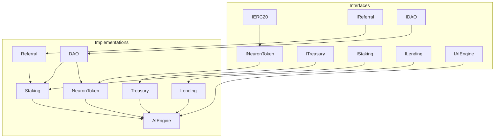
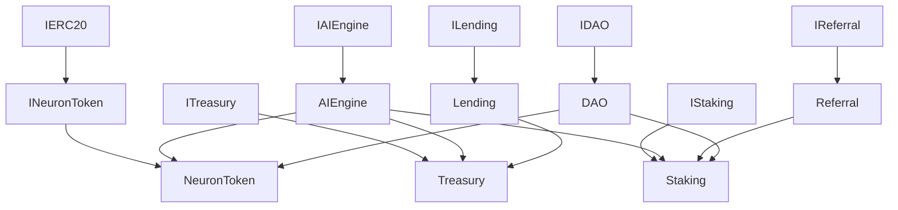
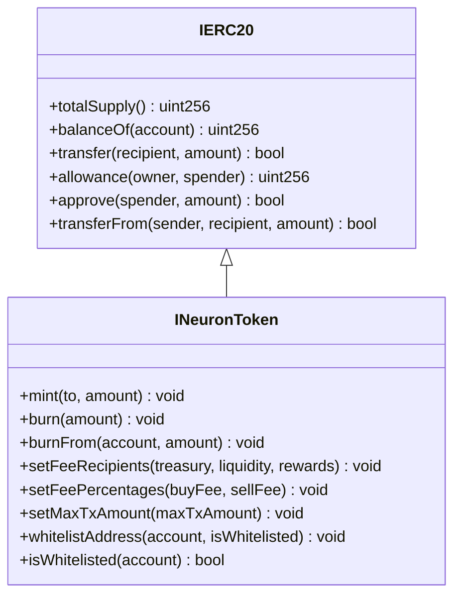
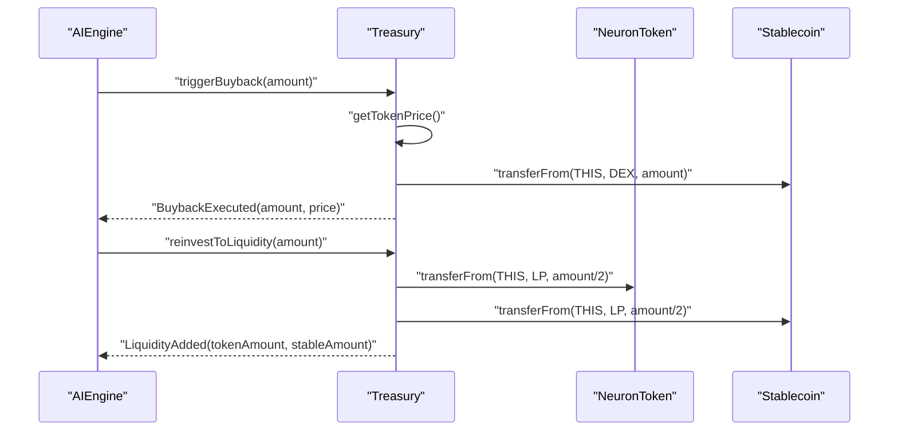
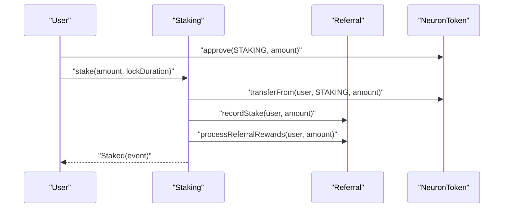
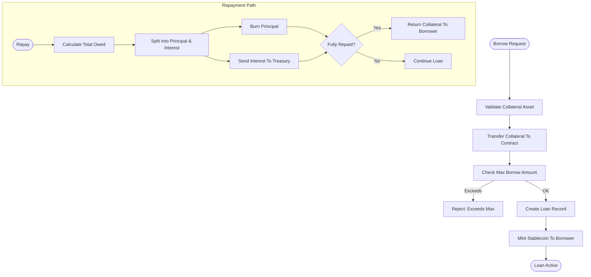
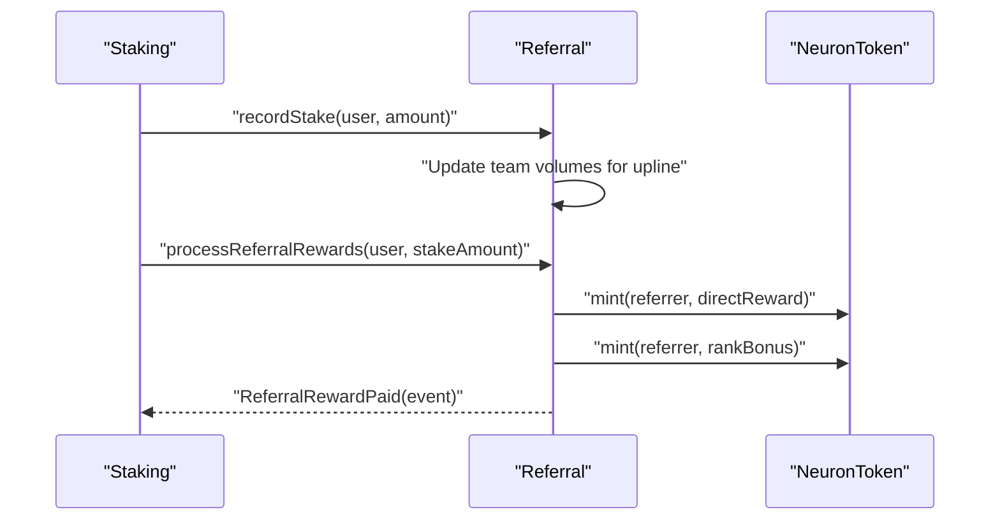
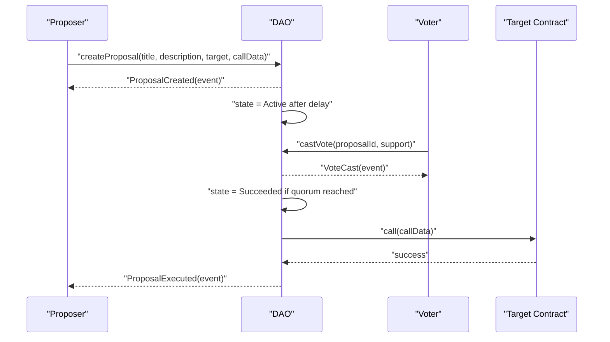
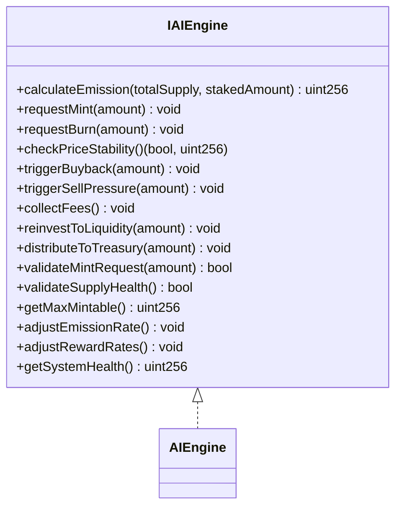
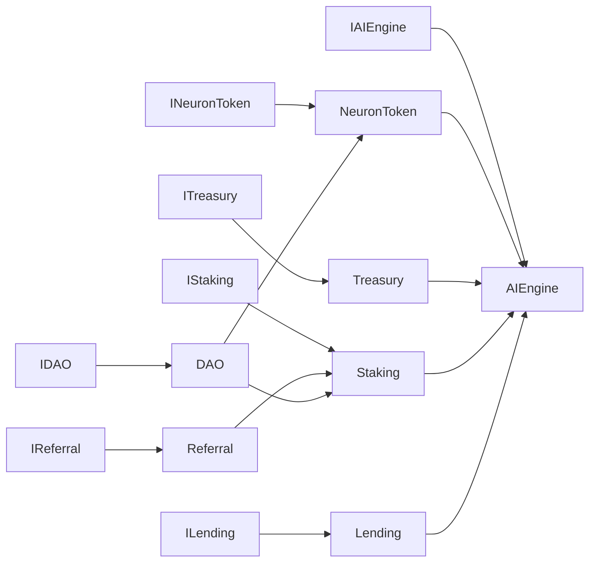

# Contract Interfaces

<cite>
**Referenced Files in This Document**
- [IERC20.sol](file://neurafinance/contracts/interfaces/IERC20.sol)
- [INeuronToken.sol](file://neurafinance/contracts/interfaces/INeuronToken.sol)
- [ITreasury.sol](file://neurafinance/contracts/interfaces/ITreasury.sol)
- [IStaking.sol](file://neurafinance/contracts/interfaces/IStaking.sol)
- [ILending.sol](file://neurafinance/contracts/interfaces/ILending.sol)
- [IReferral.sol](file://neurafinance/contracts/interfaces/IReferral.sol)
- [IDAO.sol](file://neurafinance/contracts/interfaces/IDAO.sol)
- [IAIEngine.sol](file://neurafinance/contracts/interfaces/IAIEngine.sol)
- [NeuronToken.sol](file://neurafinance/contracts/core/NeuronToken.sol)
- [Treasury.sol](file://neurafinance/contracts/core/Treasury.sol)
- [Staking.sol](file://neurafinance/contracts/core/Staking.sol)
- [Lending.sol](file://neurafinance/contracts/core/Lending.sol)
- [DAO.sol](file://neurafinance/contracts/core/DAO.sol)
- [AIEngine.sol](file://neurafinance/contracts/ai-engine/AIEngine.sol)
- [Referral.sol](file://neurafinance/contracts/core/Referral.sol)
</cite>

## Table of Contents
1. [Introduction](#introduction)
2. [Project Structure](#project-structure)
3. [Core Components](#core-components)
4. [Architecture Overview](#architecture-overview)
5. [Detailed Component Analysis](#detailed-component-analysis)
6. [Dependency Analysis](#dependency-analysis)
7. [Performance Considerations](#performance-considerations)
8. [Troubleshooting Guide](#troubleshooting-guide)
9. [Conclusion](#conclusion)

## Introduction
This document describes the standardized contract interfaces that define interoperability and integration points across the NeuraFinance ecosystem. These interfaces enable external contracts to interact with core protocols in a predictable way, facilitate upgrades via proxy-compatible patterns, and provide consistent function signatures and event emissions. Covered interfaces include IERC20, INeuronToken, ITreasury, IStaking, ILending, IReferral, IDAO, and IAIEngine. Each interface is paired with its canonical implementation to demonstrate design patterns, parameter semantics, return value structures, and integration flows.

## Project Structure
Interfaces are defined under contracts/interfaces and implemented by contracts under contracts/core and contracts/ai-engine. External integrators interact with these interfaces to compose applications that span tokenomics, staking, lending, treasury operations, governance, and AI-driven coordination.

**Diagram sources**
- [IERC20.sol:4-14](file://neurafinance/contracts/interfaces/IERC20.sol#L4-L14)
- [INeuronToken.sol:6-19](file://neurafinance/contracts/interfaces/INeuronToken.sol#L6-L19)
- [ITreasury.sol:4-16](file://neurafinance/contracts/interfaces/ITreasury.sol#L4-L16)
- [IStaking.sol:4-30](file://neurafinance/contracts/interfaces/IStaking.sol#L4-L30)
- [ILending.sol:4-39](file://neurafinance/contracts/interfaces/ILending.sol#L4-L39)
- [IReferral.sol:4-31](file://neurafinance/contracts/interfaces/IReferral.sol#L4-L31)
- [IDAO.sol:4-50](file://neurafinance/contracts/interfaces/IDAO.sol#L4-L50)
- [IAIEngine.sol:4-35](file://neurafinance/contracts/interfaces/IAIEngine.sol#L4-L35)
- [NeuronToken.sol:8-252](file://neurafinance/contracts/core/NeuronToken.sol#L8-L252)
- [Treasury.sol:9-195](file://neurafinance/contracts/core/Treasury.sol#L9-L195)
- [Staking.sol:9-260](file://neurafinance/contracts/core/Staking.sol#L9-L260)
- [Lending.sol:10-307](file://neurafinance/contracts/core/Lending.sol#L10-L307)
- [Referral.sol:8-201](file://neurafinance/contracts/core/Referral.sol#L8-L201)
- [DAO.sol:9-230](file://neurafinance/contracts/core/DAO.sol#L9-L230)
- [AIEngine.sol:15-308](file://neurafinance/contracts/ai-engine/AIEngine.sol#L15-L308)

**Section sources**
- [IERC20.sol:4-14](file://neurafinance/contracts/interfaces/IERC20.sol#L4-L14)
- [INeuronToken.sol:6-19](file://neurafinance/contracts/interfaces/INeuronToken.sol#L6-L19)
- [ITreasury.sol:4-16](file://neurafinance/contracts/interfaces/ITreasury.sol#L4-L16)
- [IStaking.sol:4-30](file://neurafinance/contracts/interfaces/IStaking.sol#L4-L30)
- [ILending.sol:4-39](file://neurafinance/contracts/interfaces/ILending.sol#L4-L39)
- [IReferral.sol:4-31](file://neurafinance/contracts/interfaces/IReferral.sol#L4-L31)
- [IDAO.sol:4-50](file://neurafinance/contracts/interfaces/IDAO.sol#L4-L50)
- [IAIEngine.sol:4-35](file://neurafinance/contracts/interfaces/IAIEngine.sol#L4-L35)

## Core Components
This section documents each interface contract, its design patterns, function signatures, parameters, return values, and events. It also explains how implementations enforce access control, interact with other contracts, and expose standardized integration points.

- IERC20
  - Purpose: Standard fungible token interface for NEURON and other ERC-20 tokens.
  - Key functions: totalSupply, balanceOf, transfer, allowance, approve, transferFrom.
  - Events: Transfer, Approval.
  - Design pattern: Minimal, widely recognized ABI for interoperability.

- INeuronToken
  - Purpose: Extends IERC20 with token-specific mint/burn and fee management.
  - Key functions: mint, burn, burnFrom, setFeeRecipients, setFeePercentages, setMaxTxAmount, whitelistAddress, isWhitelisted.
  - Events: Mint, Burn, FeeDistributed.
  - Design pattern: Access-controlled mint/burn with dynamic fee distribution to treasury, liquidity, and rewards recipients.

- ITreasury
  - Purpose: Central vault for token and stablecoin holdings, buybacks, and liquidity provisioning.
  - Key functions: deposit, withdraw, executeBuyback, addLiquidity, getBalance, getTotalValueLocked.
  - Events: Deposit, Withdrawal, BuybackExecuted, LiquidityAdded.
  - Design pattern: Authorized caller controls disbursements; integrates with token and stablecoin interfaces.

- IStaking
  - Purpose: Staking and rewards with flexible and bonded lock periods.
  - Key structs: StakeInfo (amount, start/end times, reward rate, lastClaimTime, pendingRewards, flexible flag, active).
  - Key functions: stake, unstake, claimRewards, compoundRewards, getStakeInfo, getTotalStaked, getPendingRewards, setRewardRates, globalTotalStaked.
  - Events: Staked, Unstaked, RewardsClaimed, RewardsCompounded.
  - Design pattern: Time-based reward accrual; optional referral integration.

- ILending
  - Purpose: Decentralized peer-to-peer lending with collateralization and liquidation.
  - Key structs: Loan, CollateralAsset.
  - Key functions: depositCollateral, borrow, repay, liquidate, getLoan, getCollateralValue, getMaxBorrowAmount, getHealthFactor.
  - Events: CollateralDeposited, LoanCreated, LoanRepaid, LoanLiquidated.
  - Design pattern: Collateral-backed borrowing with configurable LTV thresholds and interest accrual.

- IReferral
  - Purpose: Referral program with tiered ranks and ROI-on-ROI bonuses.
  - Key structs: RankInfo, UserInfo.
  - Key functions: registerReferrer, recordStake, processReferralRewards, getUserInfo, getRankRequirements, calculateRank.
  - Events: ReferrerRegistered, RankUpgraded, ReferralRewardPaid.
  - Design pattern: Multi-level upline tracking and automated minting of rewards.

- IDAO
  - Purpose: On-chain governance with proposal lifecycle and execution.
  - Key structs: Proposal, ProposalView.
  - Key functions: createProposal, castVote, executeProposal, cancelProposal, getVotingPower, getProposal, state.
  - Enum: ProposalState (Pending, Active, Canceled, Defeated, Succeeded, Queued, Executed, Expired).
  - Events: ProposalCreated, VoteCast, ProposalExecuted, ProposalCanceled.
  - Design pattern: Voting power derived from staked tokens plus balance; time-gated proposal lifecycle.

- IAIEngine
  - Purpose: Central AI coordinator orchestrating NEE, ALS, ARP, SIG, ALP modules.
  - Key functions: calculateEmission, requestMint, requestBurn; checkPriceStability, triggerBuyback, triggerSellPressure; collectFees, reinvestToLiquidity, distributeToTreasury; validateMintRequest, validateSupplyHealth, getMaxMintable; adjustEmissionRate, adjustRewardRates, getSystemHealth.
  - Events: EmissionCalculated, BuybackTriggered, FeesCollected, SupplyValidated, ParametersAdjusted.
  - Design pattern: Module gating via onlyModule modifier; cross-contract coordination for emission, liquidity, and health adjustments.

**Section sources**
- [IERC20.sol:4-14](file://neurafinance/contracts/interfaces/IERC20.sol#L4-L14)
- [INeuronToken.sol:6-19](file://neurafinance/contracts/interfaces/INeuronToken.sol#L6-L19)
- [ITreasury.sol:4-16](file://neurafinance/contracts/interfaces/ITreasury.sol#L4-L16)
- [IStaking.sol:4-30](file://neurafinance/contracts/interfaces/IStaking.sol#L4-L30)
- [ILending.sol:4-39](file://neurafinance/contracts/interfaces/ILending.sol#L4-L39)
- [IReferral.sol:4-31](file://neurafinance/contracts/interfaces/IReferral.sol#L4-L31)
- [IDAO.sol:4-50](file://neurafinance/contracts/interfaces/IDAO.sol#L4-L50)
- [IAIEngine.sol:4-35](file://neurafinance/contracts/interfaces/IAIEngine.sol#L4-L35)

## Architecture Overview
The interfaces form a layered architecture enabling external contracts to integrate without hardcoding implementation details. Implementations enforce access control and delegate to other contracts where needed. AIEngine centralizes system-wide decisions and coordinates module actions.

**Diagram sources**
- [NeuronToken.sol:8-252](file://neurafinance/contracts/core/NeuronToken.sol#L8-L252)
- [Treasury.sol:9-195](file://neurafinance/contracts/core/Treasury.sol#L9-L195)
- [Staking.sol:9-260](file://neurafinance/contracts/core/Staking.sol#L9-L260)
- [Lending.sol:10-307](file://neurafinance/contracts/core/Lending.sol#L10-L307)
- [Referral.sol:8-201](file://neurafinance/contracts/core/Referral.sol#L8-L201)
- [DAO.sol:9-230](file://neurafinance/contracts/core/DAO.sol#L9-L230)
- [AIEngine.sol:15-308](file://neurafinance/contracts/ai-engine/AIEngine.sol#L15-L308)

## Detailed Component Analysis

### IERC20 and INeuronToken
- Design pattern: INeuronToken extends IERC20 to add token-specific operations while preserving standard ABI compatibility.
- Functionality highlights:
  - Mint/burn controlled by authorized minters; mint validated via IAIEngine when configured.
  - Dynamic fee distribution to treasury, liquidity, and rewards recipients.
  - Whitelisting mechanism to exempt transfers from max transaction limits and fees.
- Integration points:
  - External contracts call approve/transferFrom to move NEURON tokens.
  - AIEngine validates mint requests and can request mint/burn operations.

**Diagram sources**
- [IERC20.sol:4-14](file://neurafinance/contracts/interfaces/IERC20.sol#L4-L14)
- [INeuronToken.sol:6-19](file://neurafinance/contracts/interfaces/INeuronToken.sol#L6-L19)

**Section sources**
- [INeuronToken.sol:6-19](file://neurafinance/contracts/interfaces/INeuronToken.sol#L6-L19)
- [NeuronToken.sol:160-172](file://neurafinance/contracts/core/NeuronToken.sol#L160-L172)
- [NeuronToken.sol:174-193](file://neurafinance/contracts/core/NeuronToken.sol#L174-L193)
- [NeuronToken.sol:218-231](file://neurafinance/contracts/core/NeuronToken.sol#L218-L231)
- [NeuronToken.sol:241-247](file://neurafinance/contracts/core/NeuronToken.sol#L241-L247)

### ITreasury
- Design pattern: Authorized caller pattern restricts withdrawals; supports multiple stablecoins and NEURON deposits.
- Functionality highlights:
  - Execute buybacks when price deviates below threshold.
  - Add liquidity using token and stablecoin reserves.
  - Compute total value locked using token price and balances.
- Integration points:
  - Interacts with IERC20-compatible tokens and stablecoins.
  - Called by AIEngine for buybacks and liquidity provisioning.

**Diagram sources**
- [AIEngine.sol:115-138](file://neurafinance/contracts/ai-engine/AIEngine.sol#L115-L138)
- [Treasury.sol:80-111](file://neurafinance/contracts/core/Treasury.sol#L80-L111)

**Section sources**
- [ITreasury.sol:4-16](file://neurafinance/contracts/interfaces/ITreasury.sol#L4-L16)
- [Treasury.sol:60-97](file://neurafinance/contracts/core/Treasury.sol#L60-L97)
- [Treasury.sol:99-111](file://neurafinance/contracts/core/Treasury.sol#L99-L111)
- [Treasury.sol:117-129](file://neurafinance/contracts/core/Treasury.sol#L117-L129)

### IStaking
- Design pattern: Structured stake records with time-based reward calculation; flexible vs bonded lock periods.
- Functionality highlights:
  - Stake tokens for flexible or fixed durations; accrue rewards until claim or compounding.
  - Integrates with IReferral to record stakes and process referral rewards upon staking.
  - Admin-controlled reward rates and pausing mechanism.
- Integration points:
  - Transfers NEURON tokens via INeuronToken.
  - Claims from rewards pool or mints new tokens depending on configuration.

**Diagram sources**
- [IStaking.sol:16-24](file://neurafinance/contracts/interfaces/IStaking.sol#L16-L24)
- [Staking.sol:61-93](file://neurafinance/contracts/core/Staking.sol#L61-L93)
- [Referral.sol:82-97](file://neurafinance/contracts/core/Referral.sol#L82-L97)

**Section sources**
- [IStaking.sol:4-30](file://neurafinance/contracts/interfaces/IStaking.sol#L4-L30)
- [Staking.sol:61-93](file://neurafinance/contracts/core/Staking.sol#L61-L93)
- [Staking.sol:119-138](file://neurafinance/contracts/core/Staking.sol#L119-L138)
- [Staking.sol:140-155](file://neurafinance/contracts/core/Staking.sol#L140-L155)

### ILending
- Design pattern: Collateralized borrowing with configurable LTV ratios, interest accrual, and liquidation mechanics.
- Functionality highlights:
  - Deposit collateral, create loans, repay principal and interest, or liquidate undercollateralized positions.
  - Interest split between principal burn and treasury allocation.
- Integration points:
  - Uses IStablecoin for minting/burning of borrowed funds.
  - Interacts with ITreasury for liquidation proceeds.

**Diagram sources**
- [ILending.sol:26-33](file://neurafinance/contracts/interfaces/ILending.sol#L26-L33)
- [Lending.sol:111-155](file://neurafinance/contracts/core/Lending.sol#L111-L155)
- [Lending.sol:157-194](file://neurafinance/contracts/core/Lending.sol#L157-L194)

**Section sources**
- [ILending.sol:4-39](file://neurafinance/contracts/interfaces/ILending.sol#L4-L39)
- [Lending.sol:102-155](file://neurafinance/contracts/core/Lending.sol#L102-L155)
- [Lending.sol:157-194](file://neurafinance/contracts/core/Lending.sol#L157-L194)
- [Lending.sol:196-227](file://neurafinance/contracts/core/Lending.sol#L196-L227)

### IReferral
- Design pattern: Hierarchical referral tracking with tiered rank requirements and ROI-on-ROI bonuses.
- Functionality highlights:
  - Register referrers, record stakes across upline tiers, and mint rewards to referrers.
  - Automatic rank calculation and upgrades based on team volume and referral counts.
- Integration points:
  - Called by Staking contract during stake creation and reward processing.

**Diagram sources**
- [IReferral.sol:21-26](file://neurafinance/contracts/interfaces/IReferral.sol#L21-L26)
- [Referral.sol:82-119](file://neurafinance/contracts/core/Referral.sol#L82-L119)

**Section sources**
- [IReferral.sol:4-31](file://neurafinance/contracts/interfaces/IReferral.sol#L4-L31)
- [Referral.sol:70-119](file://neurafinance/contracts/core/Referral.sol#L70-L119)

### IDAO
- Design pattern: Proposal lifecycle governed by time delays, quorum, and voting power derived from staked tokens and balances.
- Functionality highlights:
  - Create proposals with target and calldata; vote with delegated power; execute if successful.
  - Cancel proposals under specific conditions.
- Integration points:
  - Reads staking totals and token balances to compute voting power.
  - Executes arbitrary calls to target contracts.

**Diagram sources**
- [IDAO.sol:36-44](file://neurafinance/contracts/interfaces/IDAO.sol#L36-L44)
- [DAO.sol:51-77](file://neurafinance/contracts/core/DAO.sol#L51-L77)
- [DAO.sol:79-97](file://neurafinance/contracts/core/DAO.sol#L79-L97)
- [DAO.sol:99-110](file://neurafinance/contracts/core/DAO.sol#L99-L110)

**Section sources**
- [IDAO.sol:4-50](file://neurafinance/contracts/interfaces/IDAO.sol#L4-L50)
- [DAO.sol:51-77](file://neurafinance/contracts/core/DAO.sol#L51-L77)
- [DAO.sol:79-97](file://neurafinance/contracts/core/DAO.sol#L79-L97)
- [DAO.sol:99-110](file://neurafinance/contracts/core/DAO.sol#L99-L110)

### IAIEngine
- Design pattern: Centralized orchestration coordinating emission, liquidity, fee reinvestment, supply integrity, and predictive adjustments.
- Functionality highlights:
  - Calculate emission based on staking ratio; request mint/burn; validate mint requests and supply health.
  - Monitor price stability and trigger buybacks/sell pressure; collect and reinvest fees; adjust emission/reward rates; compute system health score.
- Integration points:
  - Calls NeuronToken, Treasury, Staking; invoked by modules via onlyModule modifier.

**Diagram sources**
- [IAIEngine.sol:4-35](file://neurafinance/contracts/interfaces/IAIEngine.sol#L4-L35)
- [AIEngine.sol:15-308](file://neurafinance/contracts/ai-engine/AIEngine.sol#L15-L308)

**Section sources**
- [IAIEngine.sol:4-35](file://neurafinance/contracts/interfaces/IAIEngine.sol#L4-L35)
- [AIEngine.sol:75-97](file://neurafinance/contracts/ai-engine/AIEngine.sol#L75-L97)
- [AIEngine.sol:101-126](file://neurafinance/contracts/ai-engine/AIEngine.sol#L101-L126)
- [AIEngine.sol:129-143](file://neurafinance/contracts/ai-engine/AIEngine.sol#L129-L143)
- [AIEngine.sol:147-176](file://neurafinance/contracts/ai-engine/AIEngine.sol#L147-L176)
- [AIEngine.sol:180-200](file://neurafinance/contracts/ai-engine/AIEngine.sol#L180-L200)
- [AIEngine.sol:202-225](file://neurafinance/contracts/ai-engine/AIEngine.sol#L202-L225)

## Dependency Analysis
Interfaces define explicit contracts-to-contracts dependencies. Implementations rely on these interfaces to remain upgrade-compatible and interoperable.

**Diagram sources**
- [INeuronToken.sol:6-19](file://neurafinance/contracts/interfaces/INeuronToken.sol#L6-L19)
- [ITreasury.sol:4-16](file://neurafinance/contracts/interfaces/ITreasury.sol#L4-L16)
- [IStaking.sol:4-30](file://neurafinance/contracts/interfaces/IStaking.sol#L4-L30)
- [ILending.sol:4-39](file://neurafinance/contracts/interfaces/ILending.sol#L4-L39)
- [IReferral.sol:4-31](file://neurafinance/contracts/interfaces/IReferral.sol#L4-L31)
- [IDAO.sol:4-50](file://neurafinance/contracts/interfaces/IDAO.sol#L4-L50)
- [IAIEngine.sol:4-35](file://neurafinance/contracts/interfaces/IAIEngine.sol#L4-L35)
- [NeuronToken.sol:8-252](file://neurafinance/contracts/core/NeuronToken.sol#L8-L252)
- [Treasury.sol:9-195](file://neurafinance/contracts/core/Treasury.sol#L9-L195)
- [Staking.sol:9-260](file://neurafinance/contracts/core/Staking.sol#L9-L260)
- [Lending.sol:10-307](file://neurafinance/contracts/core/Lending.sol#L10-L307)
- [Referral.sol:8-201](file://neurafinance/contracts/core/Referral.sol#L8-L201)
- [DAO.sol:9-230](file://neurafinance/contracts/core/DAO.sol#L9-L230)
- [AIEngine.sol:15-308](file://neurafinance/contracts/ai-engine/AIEngine.sol#L15-L308)

**Section sources**
- [NeuronToken.sol:38-38](file://neurafinance/contracts/core/NeuronToken.sol#L38-L38)
- [Treasury.sol:16-17](file://neurafinance/contracts/core/Treasury.sol#L16-L17)
- [Staking.sol:22-23](file://neurafinance/contracts/core/Staking.sol#L22-L23)
- [Lending.sol:26-28](file://neurafinance/contracts/core/Lending.sol#L26-L28)
- [Referral.sol:27-27](file://neurafinance/contracts/core/Referral.sol#L27-L27)
- [DAO.sol:23-24](file://neurafinance/contracts/core/DAO.sol#L23-L24)
- [AIEngine.sol:19-21](file://neurafinance/contracts/ai-engine/AIEngine.sol#L19-L21)

## Performance Considerations
- Gas efficiency: Prefer batch operations where feasible; minimize repeated reads of balances and allowances.
- Event emission: Events are emitted per operation; avoid excessive logging in tight loops.
- Access control: Use modifiers to gate sensitive functions and reduce reentrancy risks.
- Upgrade compatibility: Implementations adhere to interface signatures to support proxy-based upgrades without changing external integration points.

## Troubleshooting Guide
Common issues and resolutions:
- Staking errors:
  - Attempting to unstake before lock expiration or when stake is inactive leads to reverts. Ensure lockDuration aligns with desired bond terms and that stakes remain active.
  - Pending rewards must be claimed or compounded before unstaking to avoid unexpected balances.
- Lending errors:
  - Borrow amount exceeding max borrow triggers reverts; ensure collateral amount and configured LTV are respected.
  - Liquidation requires health factor below threshold; verify collateral value and outstanding debt calculations.
- Treasury errors:
  - Withdrawals require authorized caller; ensure caller permissions are set.
  - Buyback cooldown prevents frequent operations; wait for cooldown to elapse.
- DAO errors:
  - Proposals require sufficient voting power to create; ensure staked and token balances meet thresholds.
  - Execution fails if target call reverts; validate calldata and target contract state.
- AIEngine errors:
  - Mint requests validated against max supply and treasury backing; ensure system health metrics permit minting.
  - Module-only calls require proper module registration; confirm AIEngine module addresses are set.

**Section sources**
- [Staking.sol:95-117](file://neurafinance/contracts/core/Staking.sol#L95-L117)
- [Lending.sol:111-155](file://neurafinance/contracts/core/Lending.sol#L111-L155)
- [Lending.sol:196-227](file://neurafinance/contracts/core/Lending.sol#L196-L227)
- [Treasury.sol:70-78](file://neurafinance/contracts/core/Treasury.sol#L70-L78)
- [Treasury.sol:80-97](file://neurafinance/contracts/core/Treasury.sol#L80-L97)
- [DAO.sol:51-77](file://neurafinance/contracts/core/DAO.sol#L51-L77)
- [DAO.sol:99-110](file://neurafinance/contracts/core/DAO.sol#L99-L110)
- [AIEngine.sol:147-160](file://neurafinance/contracts/ai-engine/AIEngine.sol#L147-L160)

## Conclusion
The NeuraFinance interface suite establishes a robust, standardized foundation for interoperability across tokenomics, staking, lending, treasury operations, governance, and AI coordination. By adhering to these interfaces, external contracts gain consistent integration points, while implementations preserve upgrade flexibility and system integrity through well-defined access control, cross-contract delegation, and event-driven observability.