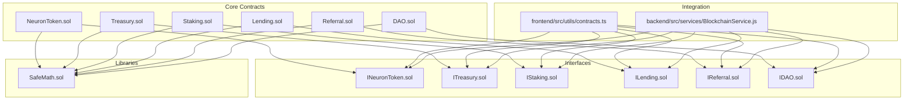
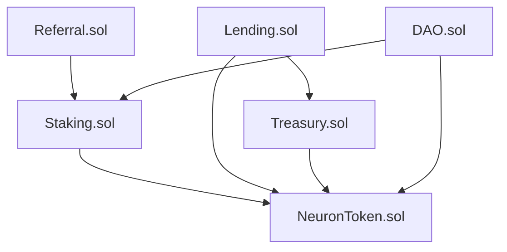
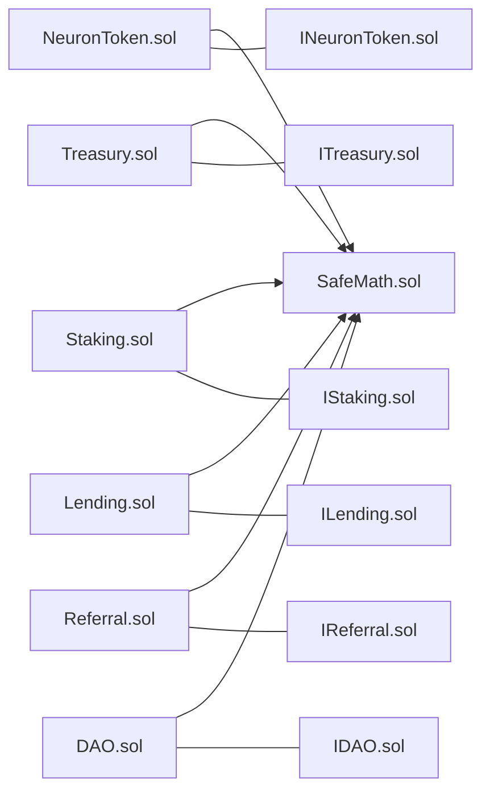

# Core DeFi Protocols

<cite>
**Referenced Files in This Document**
- [NeuronToken.sol](file://neurafinance/contracts/core/NeuronToken.sol)
- [Treasury.sol](file://neurafinance/contracts/core/Treasury.sol)
- [Staking.sol](file://neurafinance/contracts/core/Staking.sol)
- [Lending.sol](file://neurafinance/contracts/core/Lending.sol)
- [Referral.sol](file://neurafinance/contracts/core/Referral.sol)
- [DAO.sol](file://neurafinance/contracts/core/DAO.sol)
- [INeuronToken.sol](file://neurafinance/contracts/interfaces/INeuronToken.sol)
- [ITreasury.sol](file://neurafinance/contracts/interfaces/ITreasury.sol)
- [IStaking.sol](file://neurafinance/contracts/interfaces/IStaking.sol)
- [ILending.sol](file://neurafinance/contracts/interfaces/ILending.sol)
- [IReferral.sol](file://neurafinance/contracts/interfaces/IReferral.sol)
- [IDAO.sol](file://neurafinance/contracts/interfaces/IDAO.sol)
- [SafeMath.sol](file://neurafinance/contracts/libraries/SafeMath.sol)
- [contracts.ts](file://neurafinance/frontend/src/utils/contracts.ts)
- [BlockchainService.js](file://neurafinance/backend/src/services/BlockchainService.js)
</cite>

## Table of Contents
1. [Introduction](#introduction)
2. [Project Structure](#project-structure)
3. [Core Components](#core-components)
4. [Architecture Overview](#architecture-overview)
5. [Detailed Component Analysis](#detailed-component-analysis)
6. [Dependency Analysis](#dependency-analysis)
7. [Performance Considerations](#performance-considerations)
8. [Troubleshooting Guide](#troubleshooting-guide)
9. [Conclusion](#conclusion)
10. [Appendices](#appendices)

## Introduction
This document explains the core DeFi protocols that form the foundation of the NeuraFinance ecosystem. It covers tokenomics via NeuronToken, asset management and fee distribution via Treasury, yield generation and reward calculation via Staking, collateral-backed borrowing via Lending, multi-tier affiliate rewards via Referral, and governance and proposal execution via DAO. The content is designed for both DeFi newcomers and Solidity developers, using consistent terminology such as NeuronToken, Treasury, Staking, Lending, Referral, and DAO. Practical examples illustrate token transfers, stake creation, loan origination, proposal voting, and fee distribution, along with public interfaces, access controls, and gas optimization strategies.

## Project Structure
The core protocols are implemented as Solidity contracts under contracts/core, with corresponding interfaces under contracts/interfaces. Supporting libraries (SafeMath) and integration utilities (frontend contracts.ts and backend BlockchainService.js) demonstrate how the frontend and backend interact with the contracts.

**Diagram sources**
- [NeuronToken.sol:1-253](file://neurafinance/contracts/core/NeuronToken.sol#L1-L253)
- [Treasury.sol:1-196](file://neurafinance/contracts/core/Treasury.sol#L1-L196)
- [Staking.sol:1-261](file://neurafinance/contracts/core/Staking.sol#L1-L261)
- [Lending.sol:1-308](file://neurafinance/contracts/core/Lending.sol#L1-L308)
- [Referral.sol:1-202](file://neurafinance/contracts/core/Referral.sol#L1-L202)
- [DAO.sol:1-231](file://neurafinance/contracts/core/DAO.sol#L1-L231)
- [INeuronToken.sol:1-20](file://neurafinance/contracts/interfaces/INeuronToken.sol#L1-L20)
- [ITreasury.sol:1-17](file://neurafinance/contracts/interfaces/ITreasury.sol#L1-L17)
- [IStaking.sol:1-31](file://neurafinance/contracts/interfaces/IStaking.sol#L1-L31)
- [ILending.sol:1-40](file://neurafinance/contracts/interfaces/ILending.sol#L1-L40)
- [IReferral.sol:1-32](file://neurafinance/contracts/interfaces/IReferral.sol#L1-L32)
- [IDAO.sol:1-51](file://neurafinance/contracts/interfaces/IDAO.sol#L1-L51)
- [SafeMath.sol:1-33](file://neurafinance/contracts/libraries/SafeMath.sol#L1-L33)
- [contracts.ts:1-148](file://neurafinance/frontend/src/utils/contracts.ts#L1-L148)
- [BlockchainService.js:1-216](file://neurafinance/backend/src/services/BlockchainService.js#L1-L216)

**Section sources**
- [NeuronToken.sol:1-253](file://neurafinance/contracts/core/NeuronToken.sol#L1-L253)
- [Treasury.sol:1-196](file://neurafinance/contracts/core/Treasury.sol#L1-L196)
- [Staking.sol:1-261](file://neurafinance/contracts/core/Staking.sol#L1-L261)
- [Lending.sol:1-308](file://neurafinance/contracts/core/Lending.sol#L1-L308)
- [Referral.sol:1-202](file://neurafinance/contracts/core/Referral.sol#L1-L202)
- [DAO.sol:1-231](file://neurafinance/contracts/core/DAO.sol#L1-L231)
- [INeuronToken.sol:1-20](file://neurafinance/contracts/interfaces/INeuronToken.sol#L1-L20)
- [ITreasury.sol:1-17](file://neurafinance/contracts/interfaces/ITreasury.sol#L1-L17)
- [IStaking.sol:1-31](file://neurafinance/contracts/interfaces/IStaking.sol#L1-L31)
- [ILending.sol:1-40](file://neurafinance/contracts/interfaces/ILending.sol#L1-L40)
- [IReferral.sol:1-32](file://neurafinance/contracts/interfaces/IReferral.sol#L1-L32)
- [IDAO.sol:1-51](file://neurafinance/contracts/interfaces/IDAO.sol#L1-L51)
- [SafeMath.sol:1-33](file://neurafinance/contracts/libraries/SafeMath.sol#L1-L33)
- [contracts.ts:1-148](file://neurafinance/frontend/src/utils/contracts.ts#L1-L148)
- [BlockchainService.js:1-216](file://neurafinance/backend/src/services/BlockchainService.js#L1-L216)

## Core Components
This section introduces each protocol’s purpose, key capabilities, and high-level mechanics.

- NeuronToken (ERC20 tokenomics)
  - Purpose: Native utility token with dynamic fee distribution and mint/burn mechanisms.
  - Key features: Buy/sell fees, fee recipients, whitelist-based transaction limits, minting with AI validation, and burn functions.
  - Public interfaces: totalSupply, balanceOf, transfer, approve, transferFrom, mint, burn, burnFrom, setFeeRecipients, setFeePercentages, setMaxTxAmount, whitelistAddress, isWhitelisted.

- Treasury (asset management and fee distribution)
  - Purpose: Hold and manage protocol reserves, execute buybacks, and manage liquidity.
  - Key features: Deposit/withdraw, buyback thresholds/cooldowns, liquidity reserve ratio, and authorized caller controls.
  - Public interfaces: deposit, withdraw, executeBuyback, addLiquidity, getBalance, getTotalValueLocked.

- Staking (yield generation and reward calculation)
  - Purpose: Enable users to stake NEURON for yield with flexible and fixed-term bonds.
  - Key features: Reward rates per tier, pending reward calculations, rewards claiming and compounding, referral integration, and emergency pause.
  - Public interfaces: stake, unstake, claimRewards, compoundRewards, getStakeInfo, getTotalStaked, getPendingRewards, setRewardRates.

- Lending (collateral-backed borrowing)
  - Purpose: Allow users to borrow stablecoins against collateralized assets with configurable LTV and liquidation incentives.
  - Key features: Collateral assets registry, interest accrual, health factor monitoring, liquidation mechanics, and treasury fee collection.
  - Public interfaces: depositCollateral, borrow, repay, liquidate, getLoan, getCollateralValue, getMaxBorrowAmount, getHealthFactor.

- Referral (multi-tier affiliate rewards)
  - Purpose: Incentivize growth through a multi-level referral system with rank-based bonuses.
  - Key features: Up to five levels of upline tracking, direct and rank bonuses, automatic rank upgrades, and minting of rewards.
  - Public interfaces: registerReferrer, recordStake, processReferralRewards, getUserInfo, getRankRequirements, calculateRank.

- DAO (governance and proposal system)
  - Purpose: Decentralized governance for protocol upgrades and parameter changes.
  - Key features: Proposal lifecycle, voting power derived from staked and held tokens, quorum and timing controls, and timelocked execution.
  - Public interfaces: createProposal, castVote, executeProposal, cancelProposal, getVotingPower, getProposal, state.

**Section sources**
- [NeuronToken.sol:1-253](file://neurafinance/contracts/core/NeuronToken.sol#L1-L253)
- [Treasury.sol:1-196](file://neurafinance/contracts/core/Treasury.sol#L1-L196)
- [Staking.sol:1-261](file://neurafinance/contracts/core/Staking.sol#L1-L261)
- [Lending.sol:1-308](file://neurafinance/contracts/core/Lending.sol#L1-L308)
- [Referral.sol:1-202](file://neurafinance/contracts/core/Referral.sol#L1-L202)
- [DAO.sol:1-231](file://neurafinance/contracts/core/DAO.sol#L1-L231)
- [INeuronToken.sol:1-20](file://neurafinance/contracts/interfaces/INeuronToken.sol#L1-L20)
- [ITreasury.sol:1-17](file://neurafinance/contracts/interfaces/ITreasury.sol#L1-L17)
- [IStaking.sol:1-31](file://neurafinance/contracts/interfaces/IStaking.sol#L1-L31)
- [ILending.sol:1-40](file://neurafinance/contracts/interfaces/ILending.sol#L1-L40)
- [IReferral.sol:1-32](file://neurafinance/contracts/interfaces/IReferral.sol#L1-L32)
- [IDAO.sol:1-51](file://neurafinance/contracts/interfaces/IDAO.sol#L1-L51)

## Architecture Overview
The protocols are loosely coupled and communicate primarily through shared token interfaces and cross-contract calls. NeuronToken acts as the central utility token, while Treasury holds reserves and executes buybacks. Staking distributes yield and integrates with Referral for affiliate rewards. Lending manages risk and collateral, returning funds to Treasury upon liquidation. DAO governs protocol parameters and upgrades.

**Diagram sources**
- [NeuronToken.sol:1-253](file://neurafinance/contracts/core/NeuronToken.sol#L1-L253)
- [Treasury.sol:1-196](file://neurafinance/contracts/core/Treasury.sol#L1-L196)
- [Staking.sol:1-261](file://neurafinance/contracts/core/Staking.sol#L1-L261)
- [Lending.sol:1-308](file://neurafinance/contracts/core/Lending.sol#L1-L308)
- [Referral.sol:1-202](file://neurafinance/contracts/core/Referral.sol#L1-L202)
- [DAO.sol:1-231](file://neurafinance/contracts/core/DAO.sol#L1-L231)

## Detailed Component Analysis

### NeuronToken (ERC20 tokenomics)
NeuronToken implements a standard ERC20 with additional protocol-specific features:
- Token model: Initial supply assigned to owner; balances tracked per address; allowances tracked per owner/spender pair.
- Fees: Dynamic buy/sell fees applied on transfers between non-whitelisted parties; fee distribution to treasury, liquidity, and rewards recipients.
- Mint/Burn: Controlled minting by authorized minters; optional AI Engine validation; burn and burnFrom for token destruction.
- Governance: Owner-only controls for mint authorization, fee configuration, whitelist, and AI Engine linkage.

Key implementation patterns:
- Safe arithmetic via SafeMath for all numeric operations.
- Whitelisting to exempt large transfers from fees.
- Fee distribution with configurable shares and recipient addresses.

Public interfaces and events:
- Functions: totalSupply, balanceOf, transfer, approve, transferFrom, mint, burn, burnFrom, setFeeRecipients, setFeePercentages, setMaxTxAmount, whitelistAddress, isWhitelisted.
- Events: Mint, Burn, FeeDistributed.

Practical example (paths):
- Transfer with fee: [NeuronToken.sol:72-92](file://neurafinance/contracts/core/NeuronToken.sol#L72-L92)
- Mint with AI validation: [NeuronToken.sol:160-172](file://neurafinance/contracts/core/NeuronToken.sol#L160-L172)
- Fee distribution: [NeuronToken.sol:130-151](file://neurafinance/contracts/core/NeuronToken.sol#L130-L151)

Access control and gas optimization:
- Modifiers restrict sensitive functions to owner or authorized minters.
- Gas-efficient storage of balances and allowances; minimal event emissions.

**Section sources**
- [NeuronToken.sol:1-253](file://neurafinance/contracts/core/NeuronToken.sol#L1-L253)
- [INeuronToken.sol:1-20](file://neurafinance/contracts/interfaces/INeuronToken.sol#L1-L20)
- [SafeMath.sol:1-33](file://neurafinance/contracts/libraries/SafeMath.sol#L1-L33)

### Treasury (asset management and fee distribution)
Treasury manages protocol reserves and liquidity:
- Reserves: Supports NEURON and stablecoins; maintains balances per token.
- Buybacks: Threshold-based buybacks with cooldown; uses primary stablecoin for purchases.
- Liquidity: Adds liquidity to DEX pools; enforces reserve ratio.
- Controls: Owner-only management of authorized callers, supported stables, and thresholds.

Public interfaces and events:
- Functions: deposit, withdraw, executeBuyback, addLiquidity, getBalance, getTotalValueLocked.
- Events: Deposit, Withdrawal, BuybackExecuted, LiquidityAdded.

Practical example (paths):
- Deposit stablecoins: [Treasury.sol:60-68](file://neurafinance/contracts/core/Treasury.sol#L60-L68)
- Execute buyback: [Treasury.sol:80-97](file://neurafinance/contracts/core/Treasury.sol#L80-L97)
- Add liquidity: [Treasury.sol:99-111](file://neurafinance/contracts/core/Treasury.sol#L99-L111)

Access control and gas optimization:
- Only authorized callers can withdraw or execute buybacks.
- Minimal storage footprint; efficient balance updates.

**Section sources**
- [Treasury.sol:1-196](file://neurafinance/contracts/core/Treasury.sol#L1-L196)
- [ITreasury.sol:1-17](file://neurafinance/contracts/interfaces/ITreasury.sol#L1-L17)

### Staking (yield generation and reward calculation)
Staking enables users to earn yield with flexible and fixed-term bonds:
- Tiers: Flexible rate and four bond durations with increasing APYs.
- Rewards: Pending rewards computed by annual rate × time elapsed; rewards can be claimed or compounded.
- Integration: Notifies Referral on stake creation and processes referral rewards.
- Controls: Owner-only reward rate configuration, pause mechanism, and rewards pool management.

Public interfaces and events:
- Functions: stake, unstake, claimRewards, compoundRewards, getStakeInfo, getTotalStaked, getPendingRewards, setRewardRates.
- Events: Staked, Unstaked, RewardsClaimed, RewardsCompounded.

Practical example (paths):
- Create stake: [Staking.sol:61-93](file://neurafinance/contracts/core/Staking.sol#L61-L93)
- Claim rewards: [Staking.sol:119-138](file://neurafinance/contracts/core/Staking.sol#L119-L138)
- Compound rewards: [Staking.sol:140-155](file://neurafinance/contracts/core/Staking.sol#L140-L155)

Access control and gas optimization:
- Pause guard prevents operations during emergencies.
- Efficient stake indexing and per-user counters reduce iteration costs.

**Section sources**
- [Staking.sol:1-261](file://neurafinance/contracts/core/Staking.sol#L1-L261)
- [IStaking.sol:1-31](file://neurafinance/contracts/interfaces/IStaking.sol#L1-L31)

### Lending (collateral-backed borrowing)
Lending facilitates collateralized borrowing:
- Collateral assets: Registry with LTV ratio, liquidation threshold, and interest rate; supports multiple collateral tokens.
- Borrowing: Validates collateral amount against max borrow; mints stablecoins to borrower; tracks loan lifecycle.
- Repayment: Splits repayment into principal and interest; burns principal; sends interest to Treasury.
- Liquidation: Enforces health factor checks; rewards liquidators with bonus and collects protocol fee.

Public interfaces and events:
- Functions: depositCollateral, borrow, repay, liquidate, getLoan, getCollateralValue, getMaxBorrowAmount, getHealthFactor.
- Events: CollateralDeposited, LoanCreated, LoanRepaid, LoanLiquidated.

Practical example (paths):
- Originate loan: [Lending.sol:111-155](file://neurafinance/contracts/core/Lending.sol#L111-L155)
- Repay loan: [Lending.sol:157-194](file://neurafinance/contracts/core/Lending.sol#L157-L194)
- Liquidate loan: [Lending.sol:196-227](file://neurafinance/contracts/core/Lending.sol#L196-L227)

Access control and gas optimization:
- Valid collateral modifier ensures only registered collateral can be used.
- Health factor and interest calculations use safe arithmetic.

**Section sources**
- [Lending.sol:1-308](file://neurafinance/contracts/core/Lending.sol#L1-L308)
- [ILending.sol:1-40](file://neurafinance/contracts/interfaces/ILending.sol#L1-L40)

### Referral (multi-tier affiliate rewards)
Referral incentivizes growth through a multi-level system:
- Registration: Users register a referrer; referrers gain a list of referees.
- Tracking: Up to five levels of upline; records team volume for rank progression.
- Rewards: Direct reward percentage plus rank-based bonuses; minted to referrers.
- Ranks: 15-tier system with thresholds for minimum stake, team volume, referrals, and bonus percentage.

Public interfaces and events:
- Functions: registerReferrer, recordStake, processReferralRewards, getUserInfo, getRankRequirements, calculateRank.
- Events: ReferrerRegistered, RankUpgraded, ReferralRewardPaid.

Practical example (paths):
- Register referrer: [Referral.sol:70-80](file://neurafinance/contracts/core/Referral.sol#L70-L80)
- Process referral rewards: [Referral.sol:99-119](file://neurafinance/contracts/core/Referral.sol#L99-L119)

Access control and gas optimization:
- Only Staking contract can record stakes and process rewards.
- Rank checks performed inline to avoid redundant computations.

**Section sources**
- [Referral.sol:1-202](file://neurafinance/contracts/core/Referral.sol#L1-L202)
- [IReferral.sol:1-32](file://neurafinance/contracts/interfaces/IReferral.sol#L1-L32)

### DAO (governance and proposal system)
DAO enables decentralized governance:
- Proposal lifecycle: Creation, voting delay, active period, quorum, and execution.
- Voting power: Sum of staked NEURON and held NEURON; integrates with Staking and NeuronToken.
- Execution: Targets arbitrary contract calls; requires success and timelock coordination.

Public interfaces and events:
- Functions: createProposal, castVote, executeProposal, cancelProposal, getVotingPower, getProposal, state.
- Events: ProposalCreated, VoteCast, ProposalExecuted, ProposalCanceled.

Practical example (paths):
- Create proposal: [DAO.sol:51-77](file://neurafinance/contracts/core/DAO.sol#L51-L77)
- Cast vote: [DAO.sol:79-97](file://neurafinance/contracts/core/DAO.sol#L79-L97)
- Execute proposal: [DAO.sol:99-110](file://neurafinance/contracts/core/DAO.sol#L99-L110)

Access control and gas optimization:
- Only Timelock can execute finalized proposals.
- State transitions are deterministic and cheap to compute.

**Section sources**
- [DAO.sol:1-231](file://neurafinance/contracts/core/DAO.sol#L1-L231)
- [IDAO.sol:1-51](file://neurafinance/contracts/interfaces/IDAO.sol#L1-L51)

## Dependency Analysis
The contracts depend on shared interfaces and SafeMath for safe arithmetic. Cross-contract dependencies:
- Staking depends on NeuronToken for transfers and Referral for affiliate tracking.
- Lending depends on NeuronToken, Stablecoin, and Treasury for collateral and fee handling.
- Referral depends on NeuronToken for minting rewards and Staking for stake recording.
- DAO depends on Staking and NeuronToken for voting power computation.

**Diagram sources**
- [SafeMath.sol:1-33](file://neurafinance/contracts/libraries/SafeMath.sol#L1-L33)
- [INeuronToken.sol:1-20](file://neurafinance/contracts/interfaces/INeuronToken.sol#L1-L20)
- [ITreasury.sol:1-17](file://neurafinance/contracts/interfaces/ITreasury.sol#L1-L17)
- [IStaking.sol:1-31](file://neurafinance/contracts/interfaces/IStaking.sol#L1-L31)
- [ILending.sol:1-40](file://neurafinance/contracts/interfaces/ILending.sol#L1-L40)
- [IReferral.sol:1-32](file://neurafinance/contracts/interfaces/IReferral.sol#L1-L32)
- [IDAO.sol:1-51](file://neurafinance/contracts/interfaces/IDAO.sol#L1-L51)
- [NeuronToken.sol:1-253](file://neurafinance/contracts/core/NeuronToken.sol#L1-L253)
- [Treasury.sol:1-196](file://neurafinance/contracts/core/Treasury.sol#L1-L196)
- [Staking.sol:1-261](file://neurafinance/contracts/core/Staking.sol#L1-L261)
- [Lending.sol:1-308](file://neurafinance/contracts/core/Lending.sol#L1-L308)
- [Referral.sol:1-202](file://neurafinance/contracts/core/Referral.sol#L1-L202)
- [DAO.sol:1-231](file://neurafinance/contracts/core/DAO.sol#L1-L231)

**Section sources**
- [NeuronToken.sol:1-253](file://neurafinance/contracts/core/NeuronToken.sol#L1-L253)
- [Treasury.sol:1-196](file://neurafinance/contracts/core/Treasury.sol#L1-L196)
- [Staking.sol:1-261](file://neurafinance/contracts/core/Staking.sol#L1-L261)
- [Lending.sol:1-308](file://neurafinance/contracts/core/Lending.sol#L1-L308)
- [Referral.sol:1-202](file://neurafinance/contracts/core/Referral.sol#L1-L202)
- [DAO.sol:1-231](file://neurafinance/contracts/core/DAO.sol#L1-L231)
- [SafeMath.sol:1-33](file://neurafinance/contracts/libraries/SafeMath.sol#L1-L33)

## Performance Considerations
- Gas optimization strategies:
  - Use SafeMath for all arithmetic to prevent overflow/underflow and reduce reverts.
  - Minimize storage reads/writes by batching operations where possible.
  - Keep arrays of identifiers small (e.g., supported collaterals) to limit loops.
  - Use modifiers to short-circuit early and avoid unnecessary computations.
- Frontend/backend integration:
  - Batch contract calls and cache frequently accessed data (e.g., TVL, staking totals).
  - Use polling intervals aligned with block times to avoid excessive requests.
- Risk controls:
  - Implement pause mechanisms in yield-bearing contracts during emergencies.
  - Enforce strict thresholds for fee percentages, buyback conditions, and liquidation parameters.

[No sources needed since this section provides general guidance]

## Troubleshooting Guide
Common issues and resolutions:
- Transfer failures:
  - Cause: Insufficient balance or allowance; zero addresses; exceeding max transaction amount when limits are enabled.
  - Resolution: Verify balances and allowances; disable limits only for whitelisted accounts; ensure liquidityRecipient is set for fee detection.
  - Reference: [NeuronToken.sol:94-128](file://neurafinance/contracts/core/NeuronToken.sol#L94-L128)

- Staking errors:
  - Cause: Attempting to unstake before lock-up; paused state; invalid stake ID.
  - Resolution: Check stake end time and active status; ensure contract is not paused; confirm stake exists.
  - Reference: [Staking.sol:95-117](file://neurafinance/contracts/core/Staking.sol#L95-L117)

- Lending problems:
  - Cause: Borrow amount exceeds max; loan not active; health factor above liquidation threshold.
  - Resolution: Recalculate max borrow using collateral amount and LTV; verify loan state; monitor health factor.
  - Reference: [Lending.sol:115-155](file://neurafinance/contracts/core/Lending.sol#L115-L155)

- Referral rewards not credited:
  - Cause: Staking contract not set; user not registered; insufficient stake amount.
  - Resolution: Confirm staking contract address; ensure registration; verify stake recorded and processed.
  - Reference: [Referral.sol:82-119](file://neurafinance/contracts/core/Referral.sol#L82-L119)

- DAO proposal fails:
  - Cause: Below proposal threshold; quorum not met; voting period not active; execution failure.
  - Resolution: Stake or hold sufficient tokens; wait for voting window; ensure target contract accepts call data.
  - Reference: [DAO.sol:51-110](file://neurafinance/contracts/core/DAO.sol#L51-L110)

**Section sources**
- [NeuronToken.sol:94-128](file://neurafinance/contracts/core/NeuronToken.sol#L94-L128)
- [Staking.sol:95-117](file://neurafinance/contracts/core/Staking.sol#L95-L117)
- [Lending.sol:115-155](file://neurafinance/contracts/core/Lending.sol#L115-L155)
- [Referral.sol:82-119](file://neurafinance/contracts/core/Referral.sol#L82-L119)
- [DAO.sol:51-110](file://neurafinance/contracts/core/DAO.sol#L51-L110)

## Conclusion
The NeuraFinance core protocols form a cohesive DeFi ecosystem centered on the NeuronToken. Treasury safeguards reserves and liquidity; Staking generates yield with multi-tier rewards; Lending enables collateralized borrowing with robust risk controls; Referral amplifies growth through multi-level incentives; and DAO ensures transparent, community-driven governance. Together, they provide a scalable, secure, and permissionless framework for decentralized finance.

[No sources needed since this section summarizes without analyzing specific files]

## Appendices

### Public Interfaces and Function Signatures
- NeuronToken
  - totalSupply(), balanceOf(account), transfer(recipient, amount), approve(spender, amount), transferFrom(sender, recipient, amount)
  - mint(to, amount), burn(amount), burnFrom(account, amount)
  - setFeeRecipients(treasury, liquidity, rewards), setFeePercentages(buyFee, sellFee), setMaxTxAmount(maxTxAmount), whitelistAddress(account, isWhitelisted), isWhitelisted(account)
  - Events: Mint, Burn, FeeDistributed

- Treasury
  - deposit(token, amount), withdraw(token, amount, recipient), executeBuyback(amount), addLiquidity(tokenAmount, stableAmount)
  - getBalance(token), getTotalValueLocked()
  - Events: Deposit, Withdrawal, BuybackExecuted, LiquidityAdded

- Staking
  - stake(amount, lockDuration), unstake(stakeId), claimRewards(stakeId), compoundRewards(stakeId)
  - getStakeInfo(user, stakeId), getTotalStaked(user), getPendingRewards(user, stakeId), setRewardRates(flexibleRate, bondRates[])
  - Events: Staked, Unstaked, RewardsClaimed, RewardsCompounded

- Lending
  - depositCollateral(token, amount), borrow(collateralToken, collateralAmount, borrowAmount) returns (loanId)
  - repay(loanId, amount), liquidate(loanId)
  - getLoan(loanId), getCollateralValue(user, token), getMaxBorrowAmount(token, collateralAmount), getHealthFactor(loanId)
  - Events: CollateralDeposited, LoanCreated, LoanRepaid, LoanLiquidated

- Referral
  - registerReferrer(referrer), recordStake(user, amount), processReferralRewards(user, stakeAmount)
  - getUserInfo(user), getRankRequirements(rank), calculateRank(user)
  - Events: ReferrerRegistered, RankUpgraded, ReferralRewardPaid

- DAO
  - createProposal(title, description, target, callData) returns (proposalId)
  - castVote(proposalId, support), executeProposal(proposalId), cancelProposal(proposalId)
  - getVotingPower(user), getProposal(proposalId), state(proposalId)
  - Events: ProposalCreated, VoteCast, ProposalExecuted, ProposalCanceled

**Section sources**
- [INeuronToken.sol:1-20](file://neurafinance/contracts/interfaces/INeuronToken.sol#L1-L20)
- [ITreasury.sol:1-17](file://neurafinance/contracts/interfaces/ITreasury.sol#L1-L17)
- [IStaking.sol:1-31](file://neurafinance/contracts/interfaces/IStaking.sol#L1-L31)
- [ILending.sol:1-40](file://neurafinance/contracts/interfaces/ILending.sol#L1-L40)
- [IReferral.sol:1-32](file://neurafinance/contracts/interfaces/IReferral.sol#L1-L32)
- [IDAO.sol:1-51](file://neurafinance/contracts/interfaces/IDAO.sol#L1-L51)

### Practical Examples (Paths)
- Token transfer with fee distribution:
  - [NeuronToken.sol:72-92](file://neurafinance/contracts/core/NeuronToken.sol#L72-L92)
  - [NeuronToken.sol:130-151](file://neurafinance/contracts/core/NeuronToken.sol#L130-L151)

- Stake creation and reward calculation:
  - [Staking.sol:61-93](file://neurafinance/contracts/core/Staking.sol#L61-L93)
  - [Staking.sol:157-166](file://neurafinance/contracts/core/Staking.sol#L157-L166)

- Loan origination and repayment:
  - [Lending.sol:111-155](file://neurafinance/contracts/core/Lending.sol#L111-L155)
  - [Lending.sol:157-194](file://neurafinance/contracts/core/Lending.sol#L157-L194)

- Proposal voting and execution:
  - [DAO.sol:79-97](file://neurafinance/contracts/core/DAO.sol#L79-L97)
  - [DAO.sol:99-110](file://neurafinance/contracts/core/DAO.sol#L99-L110)

- Fee distribution to Treasury:
  - [NeuronToken.sol:130-151](file://neurafinance/contracts/core/NeuronToken.sol#L130-L151)
  - [Treasury.sol:60-68](file://neurafinance/contracts/core/Treasury.sol#L60-L68)

**Section sources**
- [NeuronToken.sol:72-92](file://neurafinance/contracts/core/NeuronToken.sol#L72-L92)
- [Staking.sol:61-93](file://neurafinance/contracts/core/Staking.sol#L61-L93)
- [Lending.sol:111-155](file://neurafinance/contracts/core/Lending.sol#L111-L155)
- [DAO.sol:79-97](file://neurafinance/contracts/core/DAO.sol#L79-L97)
- [NeuronToken.sol:130-151](file://neurafinance/contracts/core/NeuronToken.sol#L130-L151)
- [Treasury.sol:60-68](file://neurafinance/contracts/core/Treasury.sol#L60-L68)

### Integration Utilities
- Frontend contract ABIs and constants:
  - [contracts.ts:1-148](file://neurafinance/frontend/src/utils/contracts.ts#L1-L148)

- Backend blockchain service:
  - [BlockchainService.js:1-216](file://neurafinance/backend/src/services/BlockchainService.js#L1-L216)

**Section sources**
- [contracts.ts:1-148](file://neurafinance/frontend/src/utils/contracts.ts#L1-L148)
- [BlockchainService.js:1-216](file://neurafinance/backend/src/services/BlockchainService.js#L1-L216)