# Smart Contracts Architecture

<cite>
**Referenced Files in This Document**
- [NeuronToken.sol](file://neurafinance/contracts/core/NeuronToken.sol)
- [Treasury.sol](file://neurafinance/contracts/core/Treasury.sol)
- [Staking.sol](file://neurafinance/contracts/core/Staking.sol)
- [Lending.sol](file://neurafinance/contracts/core/Lending.sol)
- [DAO.sol](file://neurafinance/contracts/core/DAO.sol)
- [AIEngine.sol](file://neurafinance/contracts/ai-engine/AIEngine.sol)
- [Referral.sol](file://neurafinance/contracts/core/Referral.sol)
- [Stablecoin.sol](file://neurafinance/contracts/core/Stablecoin.sol)
- [IAIEngine.sol](file://neurafinance/contracts/interfaces/IAIEngine.sol)
- [INeuronToken.sol](file://neurafinance/contracts/interfaces/INeuronToken.sol)
- [ITreasury.sol](file://neurafinance/contracts/interfaces/ITreasury.sol)
- [IStaking.sol](file://neurafinance/contracts/interfaces/IStaking.sol)
- [ILending.sol](file://neurafinance/contracts/interfaces/ILending.sol)
- [IDAO.sol](file://neurafinance/contracts/interfaces/IDAO.sol)
- [SafeMath.sol](file://neurafinance/contracts/libraries/SafeMath.sol)
</cite>

## Table of Contents
1. [Introduction](#introduction)
2. [Project Structure](#project-structure)
3. [Core Components](#core-components)
4. [Architecture Overview](#architecture-overview)
5. [Detailed Component Analysis](#detailed-component-analysis)
6. [Dependency Analysis](#dependency-analysis)
7. [Performance Considerations](#performance-considerations)
8. [Troubleshooting Guide](#troubleshooting-guide)
9. [Conclusion](#conclusion)
10. [Appendices](#appendices)

## Introduction
This document explains the complete smart contracts architecture of the DeFi protocol, focusing on the layered design from core protocols to AI orchestration. It documents the relationships among NeuronToken, Treasury, Staking, Lending, DAO, and AI Engine, and details ownership patterns, access controls, and inter-contract communication. It also covers the AI Engine orchestration system and its coordination with all core contracts, providing both conceptual overviews for blockchain newcomers and technical details for Solidity developers.

## Project Structure
The contracts are organized into layers:
- Core protocols: NeuronToken (tokenomics), Treasury (reserve management), Staking (yield incentives), Lending (credit), DAO (governance), Stablecoin (pegged asset), Referral (distribution).
- AI Engine: Orchestration and autonomous control plane.
- Interfaces: Public APIs for all contracts.
- Libraries: Shared utilities (e.g., SafeMath).

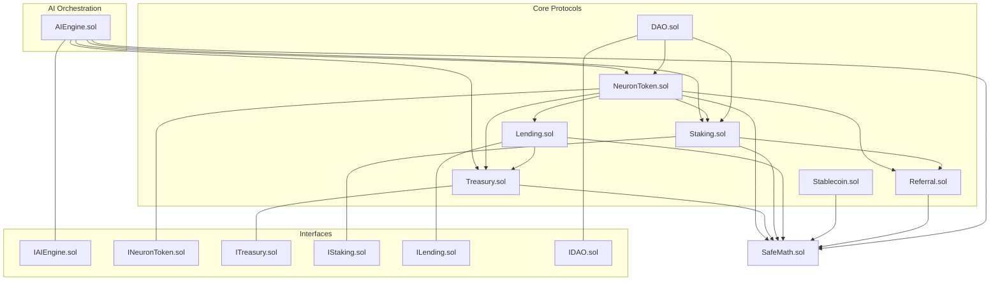

**Diagram sources**
- [NeuronToken.sol:1-253](file://neurafinance/contracts/core/NeuronToken.sol#L1-L253)
- [Treasury.sol:1-196](file://neurafinance/contracts/core/Treasury.sol#L1-L196)
- [Staking.sol:1-261](file://neurafinance/contracts/core/Staking.sol#L1-L261)
- [Lending.sol:1-308](file://neurafinance/contracts/core/Lending.sol#L1-L308)
- [DAO.sol:1-231](file://neurafinance/contracts/core/DAO.sol#L1-L231)
- [AIEngine.sol:1-309](file://neurafinance/contracts/ai-engine/AIEngine.sol#L1-L309)
- [Referral.sol:1-202](file://neurafinance/contracts/core/Referral.sol#L1-L202)
- [Stablecoin.sol:1-177](file://neurafinance/contracts/core/Stablecoin.sol#L1-L177)
- [IAIEngine.sol:1-36](file://neurafinance/contracts/interfaces/IAIEngine.sol#L1-L36)
- [INeuronToken.sol:1-20](file://neurafinance/contracts/interfaces/INeuronToken.sol#L1-L20)
- [ITreasury.sol:1-17](file://neurafinance/contracts/interfaces/ITreasury.sol#L1-L17)
- [IStaking.sol:1-31](file://neurafinance/contracts/interfaces/IStaking.sol#L1-L31)
- [ILending.sol:1-40](file://neurafinance/contracts/interfaces/ILending.sol#L1-L40)
- [IDAO.sol:1-51](file://neurafinance/contracts/interfaces/IDAO.sol#L1-L51)
- [SafeMath.sol:1-33](file://neurafinance/contracts/libraries/SafeMath.sol#L1-L33)

**Section sources**
- [NeuronToken.sol:1-253](file://neurafinance/contracts/core/NeuronToken.sol#L1-L253)
- [Treasury.sol:1-196](file://neurafinance/contracts/core/Treasury.sol#L1-L196)
- [Staking.sol:1-261](file://neurafinance/contracts/core/Staking.sol#L1-L261)
- [Lending.sol:1-308](file://neurafinance/contracts/core/Lending.sol#L1-L308)
- [DAO.sol:1-231](file://neurafinance/contracts/core/DAO.sol#L1-L231)
- [AIEngine.sol:1-309](file://neurafinance/contracts/ai-engine/AIEngine.sol#L1-L309)
- [Referral.sol:1-202](file://neurafinance/contracts/core/Referral.sol#L1-L202)
- [Stablecoin.sol:1-177](file://neurafinance/contracts/core/Stablecoin.sol#L1-L177)
- [IAIEngine.sol:1-36](file://neurafinance/contracts/interfaces/IAIEngine.sol#L1-L36)
- [INeuronToken.sol:1-20](file://neurafinance/contracts/interfaces/INeuronToken.sol#L1-L20)
- [ITreasury.sol:1-17](file://neurafinance/contracts/interfaces/ITreasury.sol#L1-L17)
- [IStaking.sol:1-31](file://neurafinance/contracts/interfaces/IStaking.sol#L1-L31)
- [ILending.sol:1-40](file://neurafinance/contracts/interfaces/ILending.sol#L1-L40)
- [IDAO.sol:1-51](file://neurafinance/contracts/interfaces/IDAO.sol#L1-L51)
- [SafeMath.sol:1-33](file://neurafinance/contracts/libraries/SafeMath.sol#L1-L33)

## Core Components
This section introduces the core contracts and their roles:
- NeuronToken: Utility token with dynamic fees, mint/burn, and AI validation hook.
- Treasury: Reserve manager for NEURON and stablecoins, buybacks, liquidity provision, and health metrics.
- Staking: Yield-bearing staking with flexible and bonded terms, referral integration, and reward mechanics.
- Lending: Collateralized lending with interest accrual, liquidation, and treasury fee collection.
- DAO: On-chain governance with proposal lifecycle and execution.
- AI Engine: Orchestration layer coordinating emissions, liquidity, reinvestment, supply integrity, and predictive adjustments.
- Stablecoin: Pegged stable asset with collateralization backed by Treasury.
- Referral: Distribution system for staking-driven referral rewards.

Ownership and access control:
- Ownable pattern with pending ownership and acceptance.
- Role-based access via authorized mappings (e.g., minters, callers).
- Module-level access for AI Engine modules.

Inter-contract communication:
- Cross-contract calls for mint/burn, transfers, and administrative actions.
- Oracle-free simulations for price and health checks; production-ready integrations are intended.

Public interfaces:
- Standard ERC-20 token interface plus custom extensions.
- Governance, staking, lending, treasury, and AI engine interfaces define public APIs.

**Section sources**
- [NeuronToken.sol:19-62](file://neurafinance/contracts/core/NeuronToken.sol#L19-L62)
- [Treasury.sol:12-56](file://neurafinance/contracts/core/Treasury.sol#L12-L56)
- [Staking.sol:25-59](file://neurafinance/contracts/core/Staking.sol#L25-L59)
- [Lending.sol:30-61](file://neurafinance/contracts/core/Lending.sol#L30-L61)
- [DAO.sol:26-49](file://neurafinance/contracts/core/DAO.sol#L26-L49)
- [AIEngine.sol:31-71](file://neurafinance/contracts/ai-engine/AIEngine.sol#L31-L71)
- [Stablecoin.sol:19-49](file://neurafinance/contracts/core/Stablecoin.sol#L19-L49)
- [Referral.sol:34-50](file://neurafinance/contracts/core/Referral.sol#L34-L50)
- [INeuronToken.sol:6-20](file://neurafinance/contracts/interfaces/INeuronToken.sol#L6-L20)
- [ITreasury.sol:4-17](file://neurafinance/contracts/interfaces/ITreasury.sol#L4-L17)
- [IStaking.sol:4-31](file://neurafinance/contracts/interfaces/IStaking.sol#L4-L31)
- [ILending.sol:4-40](file://neurafinance/contracts/interfaces/ILending.sol#L4-L40)
- [IDAO.sol:4-51](file://neurafinance/contracts/interfaces/IDAO.sol#L4-L51)
- [IAIEngine.sol:4-36](file://neurafinance/contracts/interfaces/IAIEngine.sol#L4-L36)

## Architecture Overview
The system follows a layered architecture:
- Layer 1: Token and reserve (NeuronToken, Treasury, Stablecoin)
- Layer 2: Incentives and credit (Staking, Lending)
- Layer 3: Distribution and governance (Referral, DAO)
- Layer 4: Orchestration (AI Engine)

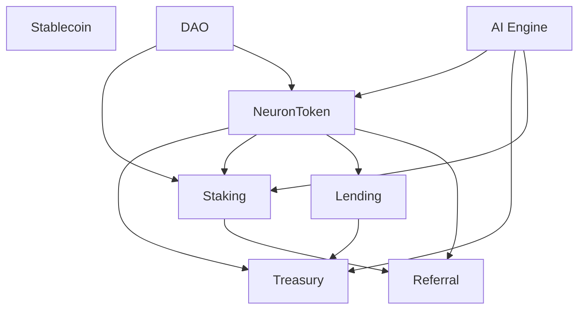

**Diagram sources**
- [AIEngine.sol:18-71](file://neurafinance/contracts/ai-engine/AIEngine.sol#L18-L71)
- [NeuronToken.sol:30-38](file://neurafinance/contracts/core/NeuronToken.sol#L30-L38)
- [Treasury.sol:16-24](file://neurafinance/contracts/core/Treasury.sol#L16-L24)
- [Staking.sol:22-27](file://neurafinance/contracts/core/Staking.sol#L22-L27)
- [Lending.sol:26-31](file://neurafinance/contracts/core/Lending.sol#L26-L31)
- [Referral.sol:27](file://neurafinance/contracts/core/Referral.sol#L27)
- [DAO.sol:23-24](file://neurafinance/contracts/core/DAO.sol#L23-L24)

## Detailed Component Analysis

### NeuronToken
- Purpose: Utility token with dynamic transaction fees, mint/burn, and whitelist controls.
- Key features:
  - Fee engine distributing portions to Treasury, liquidity, and rewards recipients.
  - Whitelisting to exempt addresses from fees and transaction limits.
  - AI Engine validation for mint requests.
  - Ownership and authorization for minters.
- Public interfaces:
  - ERC-20 standard plus mint/burn and configuration setters.
- Gas optimization:
  - Uses SafeMath for arithmetic.
  - Minimal branching in hot paths; fee distribution centralized.

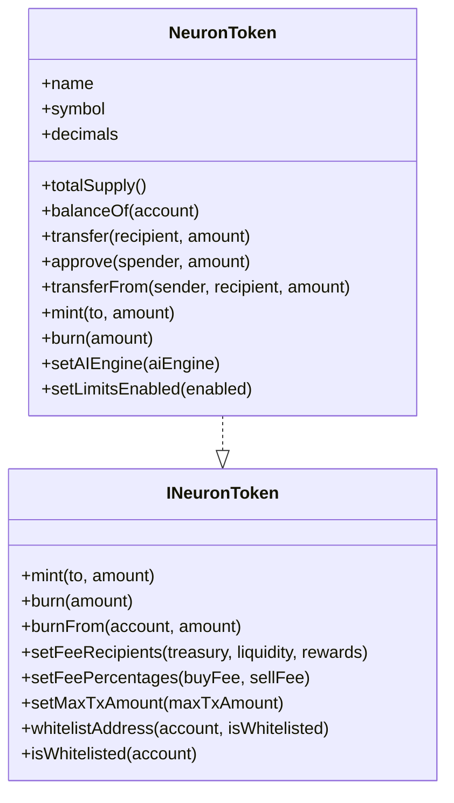

**Diagram sources**
- [INeuronToken.sol:6-20](file://neurafinance/contracts/interfaces/INeuronToken.sol#L6-L20)
- [NeuronToken.sol:8-253](file://neurafinance/contracts/core/NeuronToken.sol#L8-L253)

**Section sources**
- [NeuronToken.sol:11-151](file://neurafinance/contracts/core/NeuronToken.sol#L11-L151)
- [INeuronToken.sol:6-20](file://neurafinance/contracts/interfaces/INeuronToken.sol#L6-L20)

### Treasury
- Purpose: Manage token and stable reserves, execute buybacks, add liquidity, and expose health metrics.
- Key features:
  - Authorized callers for sensitive operations.
  - Buyback thresholds and cooldowns.
  - Liquidity reserve ratios.
  - Simulated price and TVL calculations.
- Public interfaces:
  - Deposit, withdraw, buyback, liquidity provisioning, and getters.
- Gas optimization:
  - Minimal loops; supports multiple stables via mapping.

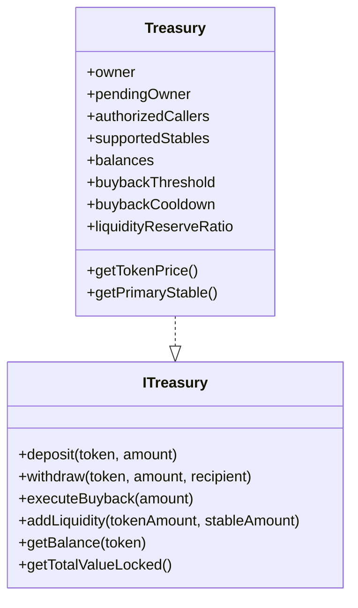

**Diagram sources**
- [ITreasury.sol:4-17](file://neurafinance/contracts/interfaces/ITreasury.sol#L4-L17)
- [Treasury.sol:9-196](file://neurafinance/contracts/core/Treasury.sol#L9-L196)

**Section sources**
- [Treasury.sol:12-195](file://neurafinance/contracts/core/Treasury.sol#L12-L195)
- [ITreasury.sol:4-17](file://neurafinance/contracts/interfaces/ITreasury.sol#L4-L17)

### Staking
- Purpose: Incentivize long-term holding with flexible and bonded staking terms.
- Key features:
  - Reward calculation based on time and rate.
  - Rewards pool or minting fallback.
  - Referral integration for distribution.
  - Pause mechanism for emergencies.
- Public interfaces:
  - Stake/unstake/claim/compound and getters.
- Gas optimization:
  - Arrays resized carefully; minimal nested loops.

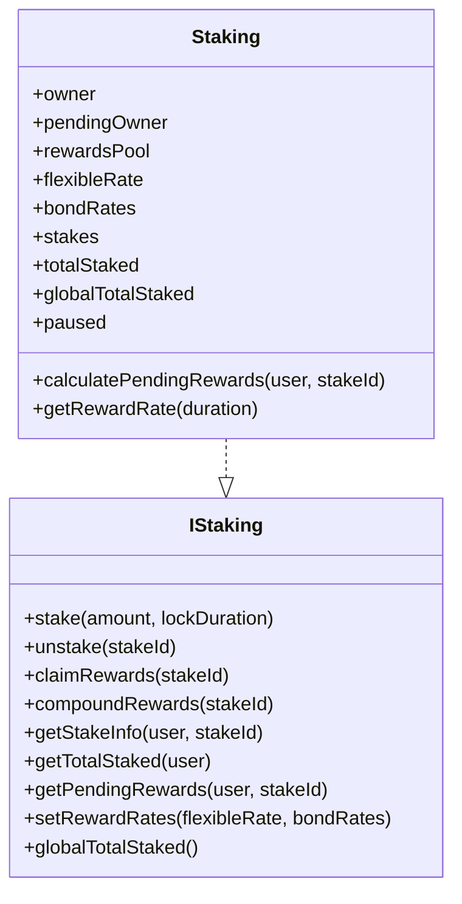

**Diagram sources**
- [IStaking.sol:4-31](file://neurafinance/contracts/interfaces/IStaking.sol#L4-L31)
- [Staking.sol:9-261](file://neurafinance/contracts/core/Staking.sol#L9-L261)

**Section sources**
- [Staking.sol:25-155](file://neurafinance/contracts/core/Staking.sol#L25-L155)
- [IStaking.sol:4-31](file://neurafinance/contracts/interfaces/IStaking.sol#L4-L31)

### Lending
- Purpose: Collateralized borrowing with interest accrual and liquidation.
- Key features:
  - Collateral assets with LTV and thresholds.
  - Interest calculation and repayment split between principal and treasury.
  - Liquidation with bonuses and protocol fees.
- Public interfaces:
  - Deposit collateral, borrow, repay, liquidate, and queries.
- Gas optimization:
  - Structured storage; simplified price oracle usage.

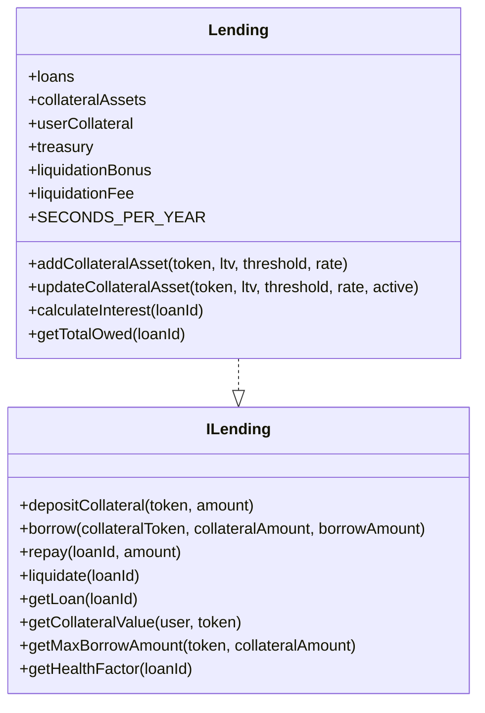

**Diagram sources**
- [ILending.sol:4-40](file://neurafinance/contracts/interfaces/ILending.sol#L4-L40)
- [Lending.sol:10-308](file://neurafinance/contracts/core/Lending.sol#L10-L308)

**Section sources**
- [Lending.sol:30-227](file://neurafinance/contracts/core/Lending.sol#L30-L227)
- [ILending.sol:4-40](file://neurafinance/contracts/interfaces/ILending.sol#L4-L40)

### DAO
- Purpose: On-chain governance for protocol upgrades and parameter changes.
- Key features:
  - Proposal lifecycle with delays, periods, thresholds, and quorum.
  - Voting power derived from staked tokens and balances.
  - Execution via delegatecall to target contracts.
- Public interfaces:
  - Create/cast/execute/cancel proposals and state queries.
- Gas optimization:
  - Minimal state reads per vote; efficient proposal state transitions.

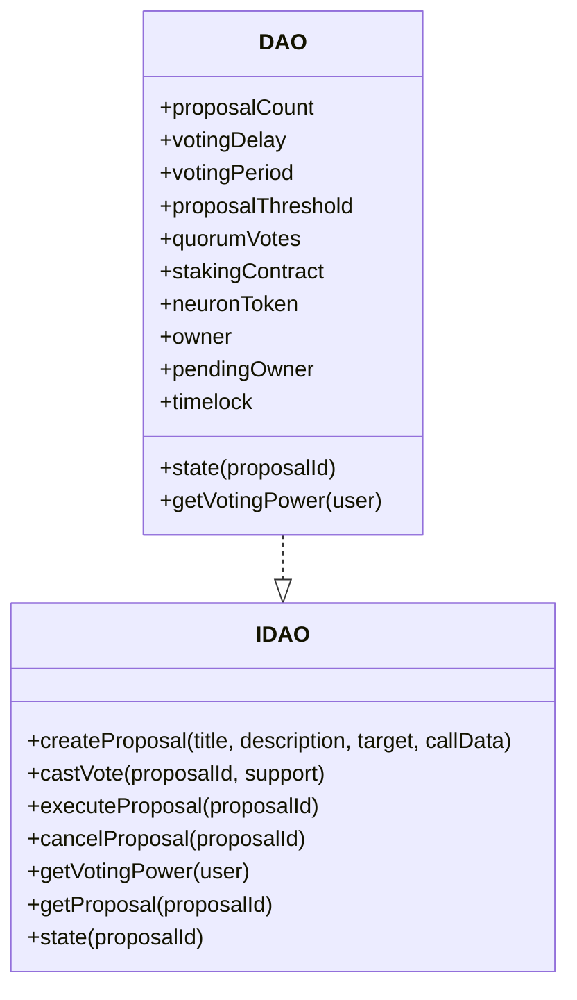

**Diagram sources**
- [IDAO.sol:4-51](file://neurafinance/contracts/interfaces/IDAO.sol#L4-L51)
- [DAO.sol:9-231](file://neurafinance/contracts/core/DAO.sol#L9-L231)

**Section sources**
- [DAO.sol:16-168](file://neurafinance/contracts/core/DAO.sol#L16-L168)
- [IDAO.sol:4-51](file://neurafinance/contracts/interfaces/IDAO.sol#L4-L51)

### AI Engine Orchestration
- Purpose: Autonomous system health monitoring and control across all core contracts.
- Modules:
  - NEE (Neural Emission Engine): Dynamic emission calculation and mint/burn requests.
  - ALS (Adaptive Liquidity Stabilizer): Price stability checks and buyback/sell triggers.
  - ARP (Auto Reinvest Protocol): Fee collection and liquidity reinvestment.
  - SIG (Supply Integrity Guard): Mint validation and supply/backing checks.
  - ALP (Adaptive Logic Predictor): System health scoring and parameter adjustments.
- Interactions:
  - Calls NeuronToken for mint/burn, Treasury for buybacks/liquidity, Staking for reward adjustments.
  - Triggers periodic updates and enforces intervals.
- Public interfaces:
  - IAIEngine defines module APIs and events.

```mermaid
sequenceDiagram
participant AI as "AIEngine"
participant NT as "NeuronToken"
participant TR as "Treasury"
participant ST as "Staking"
AI->>NT : "validateMintRequest(amount)"
NT-->>AI : "valid?"
AI->>NT : "requestMint(amount)"
NT->>TR : "mint to treasury"
AI->>TR : "executeBuyback(amount)"
AI->>TR : "addLiquidity(token, stable)"
AI->>ST : "adjustRewardRates()"
AI->>AI : "getSystemHealth()"
```

**Diagram sources**
- [AIEngine.sol:75-261](file://neurafinance/contracts/ai-engine/AIEngine.sol#L75-L261)
- [IAIEngine.sol:5-36](file://neurafinance/contracts/interfaces/IAIEngine.sol#L5-L36)
- [NeuronToken.sol:160-172](file://neurafinance/contracts/core/NeuronToken.sol#L160-L172)
- [Treasury.sol:80-111](file://neurafinance/contracts/core/Treasury.sol#L80-L111)
- [Staking.sol:242-255](file://neurafinance/contracts/core/Staking.sol#L242-L255)

**Section sources**
- [AIEngine.sol:18-308](file://neurafinance/contracts/ai-engine/AIEngine.sol#L18-L308)
- [IAIEngine.sol:4-36](file://neurafinance/contracts/interfaces/IAIEngine.sol#L4-L36)

### Stablecoin
- Purpose: Pegged stable asset for lending and repayments.
- Key features:
  - Collateralization backed by Treasury value.
  - Mint/burn with authorization and ratio checks.
- Public interfaces:
  - ERC-20 plus mint/burn and configuration setters.
- Gas optimization:
  - Minimal storage reads; ratio checks inline.

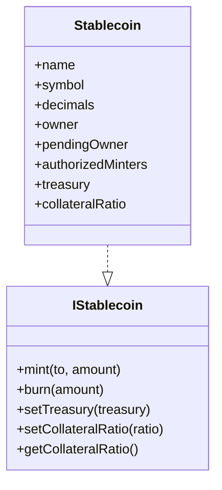

**Diagram sources**
- [IStablecoin.sol](file://neurafinance/contracts/interfaces/IStablecoin.sol)
- [Stablecoin.sol:8-177](file://neurafinance/contracts/core/Stablecoin.sol#L8-L177)

**Section sources**
- [Stablecoin.sol:19-148](file://neurafinance/contracts/core/Stablecoin.sol#L19-L148)

### Referral
- Purpose: Distribute rewards to referrers based on staked amounts and rank tiers.
- Key features:
  - Multi-level upline tracking.
  - Rank tiers with minimum stake/team volume/referrals.
  - Direct rewards and rank-based bonuses.
- Public interfaces:
  - Register referrer, record stakes, process rewards, and queries.
- Gas optimization:
  - Depth-limited recursion; arrays sized carefully.

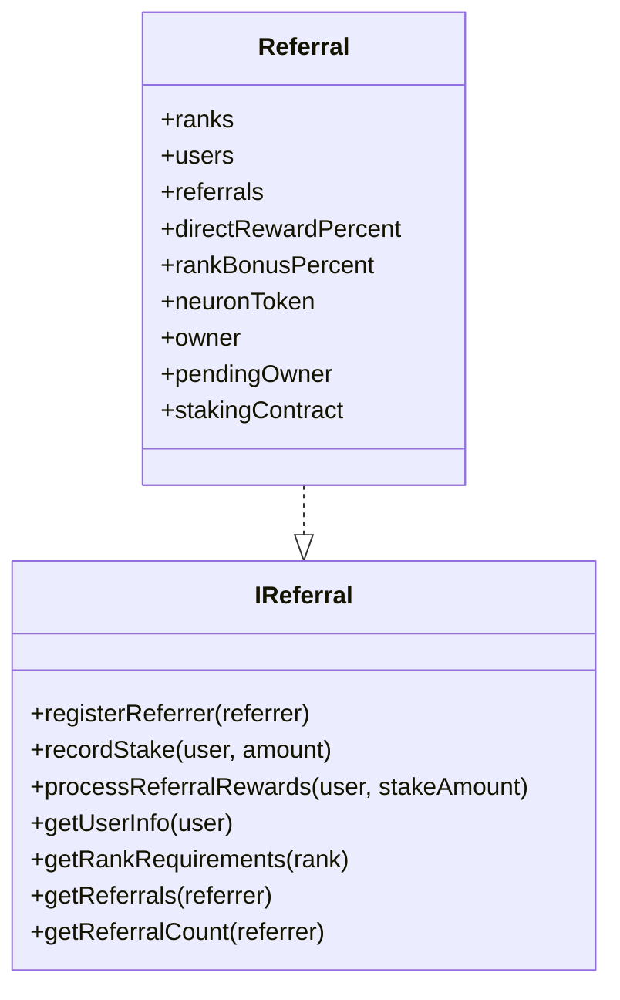

**Diagram sources**
- [IReferral.sol](file://neurafinance/contracts/interfaces/IReferral.sol)
- [Referral.sol:8-202](file://neurafinance/contracts/core/Referral.sol#L8-L202)

**Section sources**
- [Referral.sol:34-119](file://neurafinance/contracts/core/Referral.sol#L34-L119)

## Dependency Analysis
- Coupling:
  - NeuronToken depends on AI Engine for mint validation.
  - Treasury integrates with NeuronToken and Stablecoin.
  - Staking integrates with NeuronToken and Referral.
  - Lending integrates with NeuronToken, Stablecoin, and Treasury.
  - DAO depends on Staking and NeuronToken for voting power.
  - AI Engine orchestrates all core contracts.
- Cohesion:
  - Each contract encapsulates a single responsibility (token, reserve, yield, credit, governance, orchestration).
- Access control:
  - Ownable and role-based modifiers enforce strict permissions.
- External dependencies:
  - Simulated oracles for price and health; production would integrate Chainlink or DEX oracles.

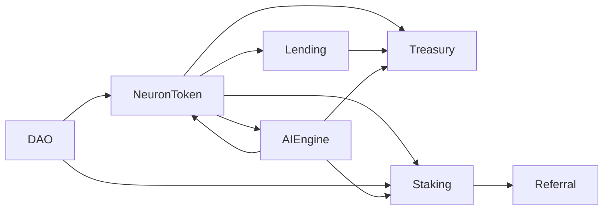

**Diagram sources**
- [NeuronToken.sol:38](file://neurafinance/contracts/core/NeuronToken.sol#L38)
- [AIEngine.sol:19-21](file://neurafinance/contracts/ai-engine/AIEngine.sol#L19-L21)
- [Treasury.sol:16-17](file://neurafinance/contracts/core/Treasury.sol#L16-L17)
- [Staking.sol:22-23](file://neurafinance/contracts/core/Staking.sol#L22-L23)
- [Lending.sol:26-28](file://neurafinance/contracts/core/Lending.sol#L26-L28)
- [Referral.sol:23-27](file://neurafinance/contracts/core/Referral.sol#L23-L27)
- [DAO.sol:23-24](file://neurafinance/contracts/core/DAO.sol#L23-L24)

**Section sources**
- [NeuronToken.sol:38](file://neurafinance/contracts/core/NeuronToken.sol#L38)
- [AIEngine.sol:19-21](file://neurafinance/contracts/ai-engine/AIEngine.sol#L19-L21)
- [Treasury.sol:16-17](file://neurafinance/contracts/core/Treasury.sol#L16-L17)
- [Staking.sol:22-23](file://neurafinance/contracts/core/Staking.sol#L22-L23)
- [Lending.sol:26-28](file://neurafinance/contracts/core/Lending.sol#L26-L28)
- [Referral.sol:23-27](file://neurafinance/contracts/core/Referral.sol#L23-L27)
- [DAO.sol:23-24](file://neurafinance/contracts/core/DAO.sol#L23-L24)

## Performance Considerations
- Arithmetic safety:
  - SafeMath library prevents overflows/underflows.
- Gas efficiency:
  - Minimize branching in hot paths (e.g., fee distribution).
  - Use mappings for O(1) lookups; avoid large dynamic arrays.
  - Batch operations where feasible (e.g., multiple approvals).
- Storage vs. computation:
  - Cache frequently accessed values (e.g., global totals).
  - Use view/pure functions for computations off-chain when possible.
- Orchestration cadence:
  - AI Engine enforces update intervals to limit transaction frequency.

[No sources needed since this section provides general guidance]

## Troubleshooting Guide
Common issues and resolutions:
- Transaction reverts due to access control:
  - Ensure caller has proper authorization or ownership.
  - Verify module addresses are set in AI Engine.
- Mint/burn failures:
  - Check AI Engine mint validation and supply caps.
  - Confirm Treasury backing meets collateralization requirements.
- Staking rewards not claimable:
  - Verify stake is active and pending rewards > 0.
  - Check rewards pool availability or mint fallback.
- Lending liquidation conditions:
  - Confirm health factor thresholds and collateral values.
  - Ensure treasury receives liquidation fees.
- DAO proposal execution:
  - Validate quorum and voting outcomes.
  - Ensure target contract accepts the call data.

**Section sources**
- [NeuronToken.sol:164-166](file://neurafinance/contracts/core/NeuronToken.sol#L164-L166)
- [AIEngine.sol:147-160](file://neurafinance/contracts/ai-engine/AIEngine.sol#L147-L160)
- [Stablecoin.sol:104-108](file://neurafinance/contracts/core/Stablecoin.sol#L104-L108)
- [Staking.sol:119-138](file://neurafinance/contracts/core/Staking.sol#L119-L138)
- [Lending.sol:196-227](file://neurafinance/contracts/core/Lending.sol#L196-L227)
- [DAO.sol:99-110](file://neurafinance/contracts/core/DAO.sol#L99-L110)

## Conclusion
The DeFi protocol employs a robust layered architecture with clear separation of concerns. NeuronToken anchors the ecosystem, Treasury manages reserves and stability, Staking incentivizes participation, Lending enables credit, DAO governs changes, and AI Engine autonomously optimizes system health. Inter-contract communication is explicit and permissioned, with strong access control and safety measures. The AI Engine’s orchestration ensures adaptive responses to market conditions while maintaining system integrity.

[No sources needed since this section summarizes without analyzing specific files]

## Appendices

### Practical Examples and Parameter Adjustments
- Adjusting token fees:
  - Call the setter on NeuronToken to update buy/sell percentages and fee recipients.
- Configuring staking rates:
  - Set flexible and bond reward rates via Staking contract.
- Updating Treasury thresholds:
  - Modify buyback thresholds, cooldowns, and liquidity reserve ratios.
- Managing collateral assets:
  - Add or update collateral assets in Lending with LTV and thresholds.
- DAO governance:
  - Create proposals, vote, and execute changes to system parameters.
- AI Engine tuning:
  - Set module addresses, update intervals, and target supply ratios.

**Section sources**
- [NeuronToken.sol:218-231](file://neurafinance/contracts/core/NeuronToken.sol#L218-L231)
- [Staking.sol:236-240](file://neurafinance/contracts/core/Staking.sol#L236-L240)
- [Treasury.sol:176-189](file://neurafinance/contracts/core/Treasury.sol#L176-L189)
- [Lending.sol:63-100](file://neurafinance/contracts/core/Lending.sol#L63-L100)
- [DAO.sol:51-77](file://neurafinance/contracts/core/DAO.sol#L51-L77)
- [AIEngine.sol:277-307](file://neurafinance/contracts/ai-engine/AIEngine.sol#L277-L307)

### System Health Monitoring
- Monitor AI Engine health score and emission rate adjustments.
- Track Treasury TVL and backing ratios.
- Observe Staking participation and reward distributions.
- Review Lending health factors and liquidation activity.
- Validate DAO proposal outcomes and quorum adherence.

**Section sources**
- [AIEngine.sol:202-225](file://neurafinance/contracts/ai-engine/AIEngine.sol#L202-L225)
- [Treasury.sol:117-129](file://neurafinance/contracts/core/Treasury.sol#L117-L129)
- [Staking.sol:157-166](file://neurafinance/contracts/core/Staking.sol#L157-L166)
- [Lending.sol:261-271](file://neurafinance/contracts/core/Lending.sol#L261-L271)
- [DAO.sol:128-158](file://neurafinance/contracts/core/DAO.sol#L128-L158)