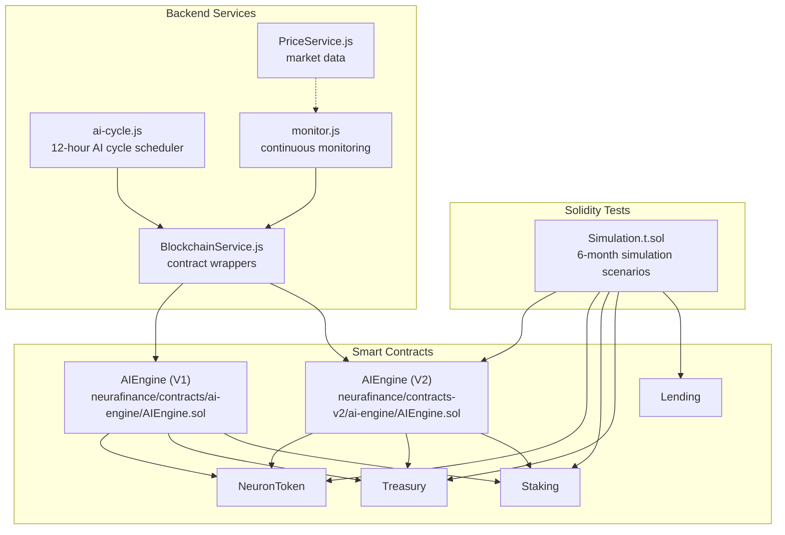
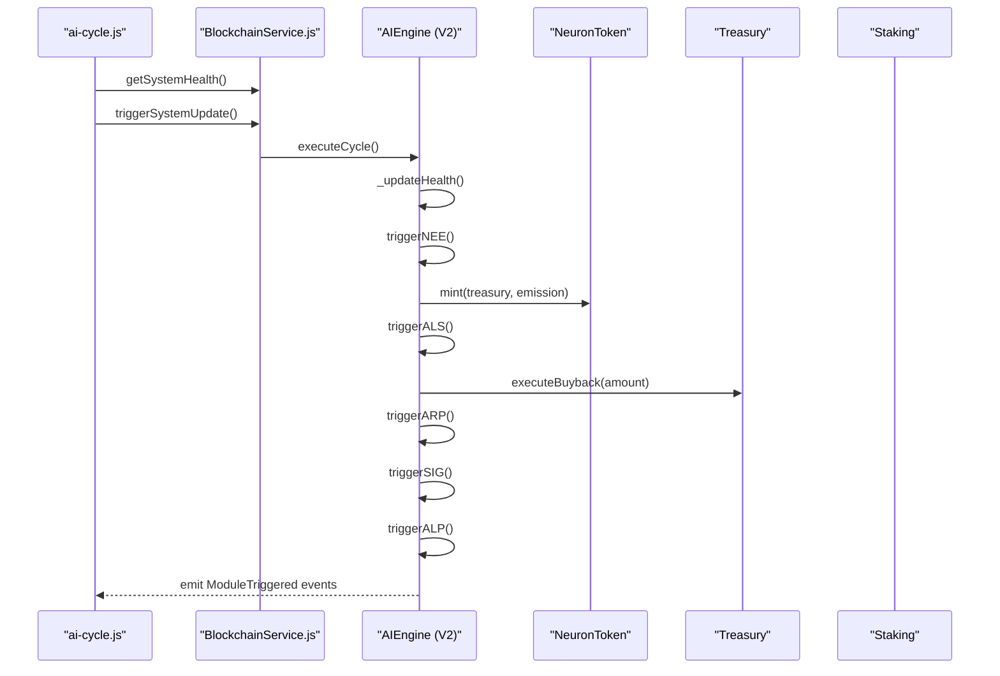
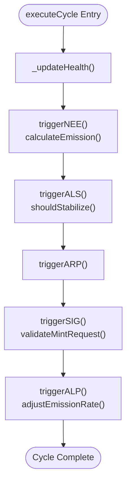
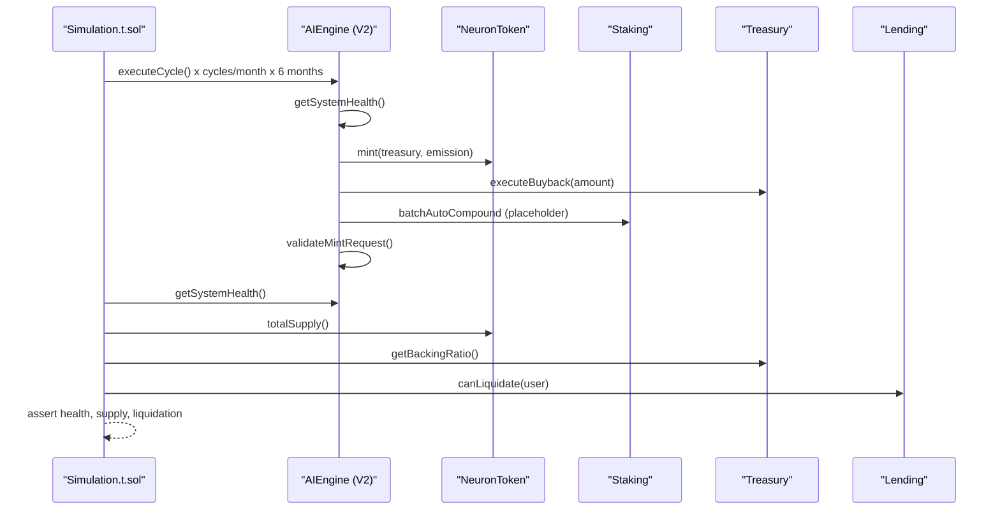
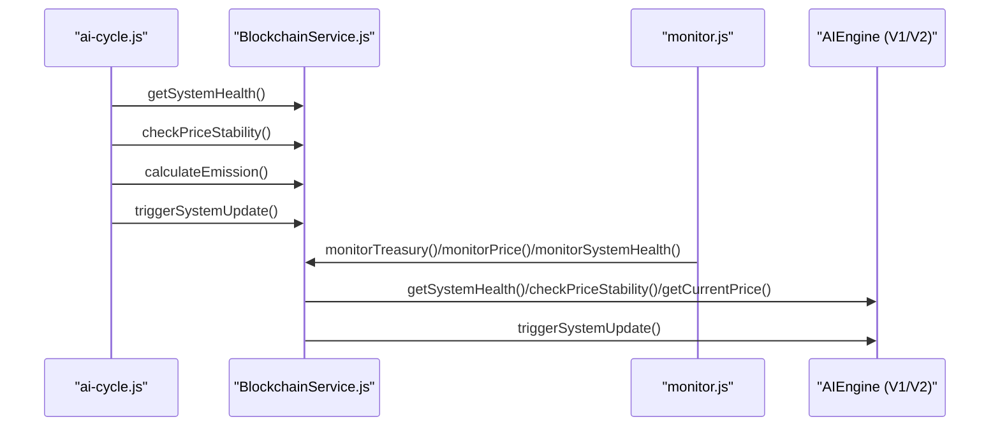
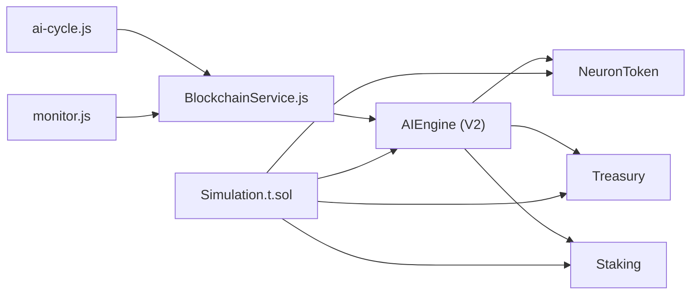

# AI Engine Testing

<cite>
**Referenced Files in This Document**
- [AIEngine.sol](file://neurafinance/contracts/ai-engine/AIEngine.sol)
- [AIEngine.sol](file://neurafinance/contracts-v2/ai-engine/AIEngine.sol)
- [Simulation.t.sol](file://neurafinance/contracts-v2/test/Simulation.t.sol)
- [ai-cycle.js](file://neurafinance/backend/src/jobs/ai-cycle.js)
- [monitor.js](file://neurafinance/backend/src/jobs/monitor.js)
- [BlockchainService.js](file://neurafinance/backend/src/services/BlockchainService.js)
- [PriceService.js](file://neurafinance/backend/src/services/PriceService.js)
- [MATHEMATICAL_MODEL.md](file://neurafinance/contracts-v2/MATHEMATICAL_MODEL.md)
- [SUSTAINABILITY_ANALYSIS.md](file://neurafinance/contracts-v2/SUSTAINABILITY_ANALYSIS.md)
- [NeuronToken.test.js](file://neurafinance/test/NeuronToken.test.js)
- [Staking.test.js](file://neurafinance/test/Staking.test.js)
</cite>

## Table of Contents
1. [Introduction](#introduction)
2. [Project Structure](#project-structure)
3. [Core Components](#core-components)
4. [Architecture Overview](#architecture-overview)
5. [Detailed Component Analysis](#detailed-component-analysis)
6. [Dependency Analysis](#dependency-analysis)
7. [Performance Considerations](#performance-considerations)
8. [Troubleshooting Guide](#troubleshooting-guide)
9. [Conclusion](#conclusion)
10. [Appendices](#appendices)

## Introduction
This document provides a comprehensive testing guide for the AI engine subsystem, focusing on validating the intelligent parameter adjustment system across the AI modules: NEE emission control, ALS liquidity stabilization, ARP fee reinvestment, SIG supply validation, and ALP predictive logic. It explains the methodology for testing AIEngine module coordination, health scoring validation, and parameter adjustment algorithms. It also documents simulation testing using Solidity test files to validate AI behavior under various market conditions, and outlines stress testing scenarios, market volatility simulation, and emergency response validation. Finally, it provides guidelines for creating realistic market simulation environments, measuring AI effectiveness, and validating long-term sustainability under different economic conditions.

## Project Structure
The AI engine testing spans three primary areas:
- Smart contracts implementing the AI engine and its modules (V1 and V2)
- Solidity-based simulation tests for end-to-end system behavior
- Backend orchestration and monitoring services that coordinate AI cycles and health checks

**Diagram sources**
- [AIEngine.sol:15-309](file://neurafinance/contracts/ai-engine/AIEngine.sol#L15-L309)
- [AIEngine.sol:17-386](file://neurafinance/contracts-v2/ai-engine/AIEngine.sol#L17-L386)
- [Simulation.t.sol:16-371](file://neurafinance/contracts-v2/test/Simulation.t.sol#L16-L371)
- [ai-cycle.js:13-177](file://neurafinance/backend/src/jobs/ai-cycle.js#L13-L177)
- [monitor.js:12-141](file://neurafinance/backend/src/jobs/monitor.js#L12-L141)
- [BlockchainService.js:12-216](file://neurafinance/backend/src/services/BlockchainService.js#L12-L216)
- [PriceService.js:4-77](file://neurafinance/backend/src/services/PriceService.js#L4-L77)

**Section sources**
- [AIEngine.sol:15-309](file://neurafinance/contracts/ai-engine/AIEngine.sol#L15-L309)
- [AIEngine.sol:17-386](file://neurafinance/contracts-v2/ai-engine/AIEngine.sol#L17-L386)
- [Simulation.t.sol:16-371](file://neurafinance/contracts-v2/test/Simulation.t.sol#L16-L371)
- [ai-cycle.js:13-177](file://neurafinance/backend/src/jobs/ai-cycle.js#L13-L177)
- [monitor.js:12-141](file://neurafinance/backend/src/jobs/monitor.js#L12-L141)
- [BlockchainService.js:12-216](file://neurafinance/backend/src/services/BlockchainService.js#L12-L216)
- [PriceService.js:4-77](file://neurafinance/backend/src/services/PriceService.js#L4-L77)

## Core Components
This section focuses on the AI engine’s core modules and their testing implications:
- NEE (Neural Emission Engine): Controls emission calculations and mint/burn requests based on health and staking dynamics.
- ALS (Adaptive Liquidity Stabilizer): Monitors price stability and triggers buybacks to maintain peg.
- ARP (Auto Reinvest Protocol): Orchestrates automatic compounding and treasury reinvestment.
- SIG (Supply Integrity Guard): Validates mint requests against supply caps, backing ratios, and daily limits.
- ALP (Adaptive Logic Predictor): Adjusts system parameters based on health trends.

Validation methodology:
- Health scoring: Use getSystemHealth to compute scores and validate thresholds.
- Parameter adjustment: Verify emissions, reward rates, and stabilization actions.
- Coordination: Ensure executeCycle triggers modules in order and respects cooldowns and constraints.

**Section sources**
- [AIEngine.sol:117-229](file://neurafinance/contracts-v2/ai-engine/AIEngine.sol#L117-L229)
- [AIEngine.sol:234-283](file://neurafinance/contracts-v2/ai-engine/AIEngine.sol#L234-L283)
- [AIEngine.sol:288-300](file://neurafinance/contracts-v2/ai-engine/AIEngine.sol#L288-L300)
- [AIEngine.sol:305-323](file://neurafinance/contracts-v2/ai-engine/AIEngine.sol#L305-L323)

## Architecture Overview
The AI engine integrates with core contracts and is orchestrated by backend services. The V2 AI engine centralizes module execution in a 12-hour cycle with health-based adjustments.

**Diagram sources**
- [ai-cycle.js:19-85](file://neurafinance/backend/src/jobs/ai-cycle.js#L19-L85)
- [BlockchainService.js:133-143](file://neurafinance/backend/src/services/BlockchainService.js#L133-L143)
- [AIEngine.sol:87-111](file://neurafinance/contracts-v2/ai-engine/AIEngine.sol#L87-L111)
- [AIEngine.sol:117-128](file://neurafinance/contracts-v2/ai-engine/AIEngine.sol#L117-L128)
- [AIEngine.sol:161-180](file://neurafinance/contracts-v2/ai-engine/AIEngine.sol#L161-L180)
- [AIEngine.sol:196-204](file://neurafinance/contracts-v2/ai-engine/AIEngine.sol#L196-L204)
- [AIEngine.sol:210-229](file://neurafinance/contracts-v2/ai-engine/AIEngine.sol#L210-L229)

## Detailed Component Analysis

### AI Engine V2: Module Coordination and Health Scoring
Testing focus:
- executeCycle ordering and constraints
- Health computation and thresholds
- Emission calculation and minting
- Price stabilization decisions and buyback triggers
- SIG integrity checks and circuit breakers
- ALP parameter adjustments

Validation steps:
- Call executeCycle and assert emitted ModuleTriggered events in order.
- Verify getSystemHealth returns expected scores and components.
- Confirm calculateEmission respects max supply and health multiplier.
- Validate shouldStabilize and calculateBuybackAmount logic.
- Ensure validateMintRequest enforces supply cap, backing ratio, and daily limit.
- Assert ALP adjusts emission rate based on health trends.

**Diagram sources**
- [AIEngine.sol:87-111](file://neurafinance/contracts-v2/ai-engine/AIEngine.sol#L87-L111)
- [AIEngine.sol:117-128](file://neurafinance/contracts-v2/ai-engine/AIEngine.sol#L117-L128)
- [AIEngine.sol:161-180](file://neurafinance/contracts-v2/ai-engine/AIEngine.sol#L161-L180)
- [AIEngine.sol:196-204](file://neurafinance/contracts-v2/ai-engine/AIEngine.sol#L196-L204)
- [AIEngine.sol:210-229](file://neurafinance/contracts-v2/ai-engine/AIEngine.sol#L210-L229)
- [AIEngine.sol:305-323](file://neurafinance/contracts-v2/ai-engine/AIEngine.sol#L305-L323)

**Section sources**
- [AIEngine.sol:87-111](file://neurafinance/contracts-v2/ai-engine/AIEngine.sol#L87-L111)
- [AIEngine.sol:117-128](file://neurafinance/contracts-v2/ai-engine/AIEngine.sol#L117-L128)
- [AIEngine.sol:161-180](file://neurafinance/contracts-v2/ai-engine/AIEngine.sol#L161-L180)
- [AIEngine.sol:196-204](file://neurafinance/contracts-v2/ai-engine/AIEngine.sol#L196-L204)
- [AIEngine.sol:210-229](file://neurafinance/contracts-v2/ai-engine/AIEngine.sol#L210-L229)
- [AIEngine.sol:305-323](file://neurafinance/contracts-v2/ai-engine/AIEngine.sol#L305-L323)

### Simulation Testing with Solidity (6-Month Scenarios)
The simulation test suite validates long-term sustainability across three scenarios:
- Healthy Growth: steady growth and positive momentum.
- No New Users (Stress): withdrawal pressure without inflows.
- Market Crash: severe price drop and panic exits.

Testing methodology:
- Deploy contracts and grant roles.
- Advance time in 12-hour cycles.
- Execute executeCycle and observe health, supply, and treasury metrics.
- Validate assertions for health thresholds and supply caps.
- Include specialized tests for referral sustainability, lending liquidation, and compound interest accuracy.

**Diagram sources**
- [Simulation.t.sol:108-136](file://neurafinance/contracts-v2/test/Simulation.t.sol#L108-L136)
- [Simulation.t.sol:141-167](file://neurafinance/contracts-v2/test/Simulation.t.sol#L141-L167)
- [Simulation.t.sol:172-201](file://neurafinance/contracts-v2/test/Simulation.t.sol#L172-L201)
- [Simulation.t.sol:206-235](file://neurafinance/contracts-v2/test/Simulation.t.sol#L206-L235)
- [Simulation.t.sol:238-265](file://neurafinance/contracts-v2/test/Simulation.t.sol#L238-L265)
- [Simulation.t.sol:268-294](file://neurafinance/contracts-v2/test/Simulation.t.sol#L268-L294)

**Section sources**
- [Simulation.t.sol:16-371](file://neurafinance/contracts-v2/test/Simulation.t.sol#L16-L371)

### Backend Orchestration and Monitoring
Backend services coordinate AI cycles and monitor system health:
- ai-cycle.js: runs every 12 hours, gathers metrics, triggers system update, and checks liquidations.
- monitor.js: continuously monitors treasury, price, system health, and blockchain state.
- BlockchainService.js: wraps contract calls for health, price, emissions, and system updates.
- PriceService.js: provides market data with caching and fallbacks.

**Diagram sources**
- [ai-cycle.js:19-85](file://neurafinance/backend/src/jobs/ai-cycle.js#L19-L85)
- [monitor.js:67-84](file://neurafinance/backend/src/jobs/monitor.js#L67-L84)
- [BlockchainService.js:106-143](file://neurafinance/backend/src/services/BlockchainService.js#L106-L143)

**Section sources**
- [ai-cycle.js:13-177](file://neurafinance/backend/src/jobs/ai-cycle.js#L13-L177)
- [monitor.js:12-141](file://neurafinance/backend/src/jobs/monitor.js#L12-L141)
- [BlockchainService.js:12-216](file://neurafinance/backend/src/services/BlockchainService.js#L12-L216)
- [PriceService.js:4-77](file://neurafinance/backend/src/services/PriceService.js#L4-L77)

### Individual Module Testing Guidelines

#### NEE Emission Control
- Validate calculateEmission under varying backing ratios and supply growth.
- Assert emission caps by max supply and daily limits.
- Confirm minting occurs only when emission > 0 and mint request passes validateMintRequest.

**Section sources**
- [AIEngine.sol:133-155](file://neurafinance/contracts-v2/ai-engine/AIEngine.sol#L133-L155)
- [AIEngine.sol:305-323](file://neurafinance/contracts-v2/ai-engine/AIEngine.sol#L305-L323)
- [AIEngine.sol:75-92](file://neurafinance/contracts/ai-engine/AIEngine.sol#L75-L92)

#### ALS Liquidity Stabilization
- Test shouldStabilize for price bands around target.
- Validate calculateBuybackAmount and treasury availability.
- Ensure cooldown prevents repeated actions.

**Section sources**
- [AIEngine.sol:288-300](file://neurafinance/contracts-v2/ai-engine/AIEngine.sol#L288-L300)
- [AIEngine.sol:348-352](file://neurafinance/contracts-v2/ai-engine/AIEngine.sol#L348-L352)
- [AIEngine.sol:161-180](file://neurafinance/contracts-v2/ai-engine/AIEngine.sol#L161-L180)

#### ARP Fee Reinvestment
- Validate treasury role grants and liquidity addition mechanics.
- Confirm placeholder behavior aligns with batch compounding expectations.

**Section sources**
- [AIEngine.sol:186-190](file://neurafinance/contracts-v2/ai-engine/AIEngine.sol#L186-L190)

#### SIG Supply Validation
- Enforce max supply, backing ratio, and daily emission limits.
- Verify SIG integrity checks prevent unsafe minting.

**Section sources**
- [AIEngine.sol:305-323](file://neurafinance/contracts-v2/ai-engine/AIEngine.sol#L305-L323)
- [AIEngine.sol:196-204](file://neurafinance/contracts-v2/ai-engine/AIEngine.sol#L196-L204)

#### ALP Predictive Logic
- Adjust emission rate based on health trends.
- Validate upper bounds and gradual changes.

**Section sources**
- [AIEngine.sol:210-229](file://neurafinance/contracts-v2/ai-engine/AIEngine.sol#L210-L229)

### Stress Testing Scenarios
- Healthy Growth: sustained growth over six months with minimal volatility.
- No New Users: simulate withdrawal pressure and reduced inflows.
- Market Crash: simulate sharp price drops, panic exits, and recovery phases.

Measurement criteria:
- Health score thresholds (e.g., remain above caution level).
- Supply growth within acceptable bounds.
- Treasury backing ratio and liquidity coverage.
- Lending liquidation eligibility and protocol safety.

**Section sources**
- [Simulation.t.sol:108-136](file://neurafinance/contracts-v2/test/Simulation.t.sol#L108-L136)
- [Simulation.t.sol:141-167](file://neurafinance/contracts-v2/test/Simulation.t.sol#L141-L167)
- [Simulation.t.sol:172-201](file://neurafinance/contracts-v2/test/Simulation.t.sol#L172-L201)
- [SUSTAINABILITY_ANALYSIS.md:182-246](file://neurafinance/contracts-v2/SUSTAINABILITY_ANALYSIS.md#L182-L246)

### Market Volatility Simulation
- Introduce price movements and measure price deviation and stabilization actions.
- Validate buyback activation and treasury impact.
- Assess system resilience during high-volatility periods.

**Section sources**
- [AIEngine.sol:240-248](file://neurafinance/contracts-v2/ai-engine/AIEngine.sol#L240-L248)
- [AIEngine.sol:288-300](file://neurafinance/contracts-v2/ai-engine/AIEngine.sol#L288-L300)
- [Simulation.t.sol:340-347](file://neurafinance/contracts-v2/test/Simulation.t.sol#L340-L347)

### Emergency Response Validation
- Validate critical thresholds in SIG and ALP.
- Ensure emission halts or reduces under critical backing or supply breaches.
- Confirm cooldowns and protective measures activate appropriately.

**Section sources**
- [AIEngine.sol:200-204](file://neurafinance/contracts-v2/ai-engine/AIEngine.sol#L200-L204)
- [AIEngine.sol:220-226](file://neurafinance/contracts-v2/ai-engine/AIEngine.sol#L220-L226)

### AI Cycle Management and System Health Monitoring
- Verify 12-hour cycle enforcement and ordering of module triggers.
- Validate historical health tracking and alerts.
- Ensure backend monitoring captures anomalies and triggers alerts.

**Section sources**
- [AIEngine.sol:87-111](file://neurafinance/contracts-v2/ai-engine/AIEngine.sol#L87-L111)
- [AIEngine.sol:357-361](file://neurafinance/contracts-v2/ai-engine/AIEngine.sol#L357-L361)
- [ai-cycle.js:148-160](file://neurafinance/backend/src/jobs/ai-cycle.js#L148-L160)
- [monitor.js:67-84](file://neurafinance/backend/src/jobs/monitor.js#L67-L84)

### Adaptive Logic Validation
- Validate health-based parameter adjustments.
- Confirm emission schedules and multipliers align with mathematical model.
- Ensure ALP responsiveness to health trends.

**Section sources**
- [AIEngine.sol:234-268](file://neurafinance/contracts-v2/ai-engine/AIEngine.sol#L234-L268)
- [AIEngine.sol:273-283](file://neurafinance/contracts-v2/ai-engine/AIEngine.sol#L273-L283)
- [MATHEMATICAL_MODEL.md:53-109](file://neurafinance/contracts-v2/MATHEMATICAL_MODEL.md#L53-L109)

### Guidelines for Realistic Market Simulation Environments
- Use time warp to advance 12-hour cycles consistently.
- Introduce stochastic price movements while respecting backing ratios.
- Model user behavior with deposits, withdrawals, and compounding.
- Track key metrics: supply, staked, treasury backing, price stability, and health score.

**Section sources**
- [Simulation.t.sol:114-131](file://neurafinance/contracts-v2/test/Simulation.t.sol#L114-L131)
- [Simulation.t.sol:349-356](file://neurafinance/contracts-v2/test/Simulation.t.sol#L349-L356)
- [MATHEMATICAL_MODEL.md:259-311](file://neurafinance/contracts-v2/MATHEMATICAL_MODEL.md#L259-L311)

### Measuring AI Effectiveness and Long-Term Sustainability
- Track health score trends and adherence to targets.
- Validate emission schedules and backing ratio maintenance.
- Assess treasury growth and sustainability under different scenarios.
- Compare projections to model assumptions and adjust parameters accordingly.

**Section sources**
- [SUSTAINABILITY_ANALYSIS.md:1-399](file://neurafinance/contracts-v2/SUSTAINABILITY_ANALYSIS.md#L1-L399)
- [MATHEMATICAL_MODEL.md:230-256](file://neurafinance/contracts-v2/MATHEMATICAL_MODEL.md#L230-L256)

## Dependency Analysis
The AI engine depends on core contracts and is monitored by backend services. Dependencies:
- AIEngine depends on NeuronToken, Treasury, and Staking for minting, backing, and staking data.
- Backend services depend on AIEngine for health and price signals.
- Simulation tests depend on AIEngine and core contracts for end-to-end validation.

**Diagram sources**
- [AIEngine.sol:36-73](file://neurafinance/contracts-v2/ai-engine/AIEngine.sol#L36-L73)
- [BlockchainService.js:18-37](file://neurafinance/backend/src/services/BlockchainService.js#L18-L37)
- [ai-cycle.js:19-35](file://neurafinance/backend/src/jobs/ai-cycle.js#L19-L35)
- [monitor.js:67-84](file://neurafinance/backend/src/jobs/monitor.js#L67-L84)
- [Simulation.t.sol:44-77](file://neurafinance/contracts-v2/test/Simulation.t.sol#L44-L77)

**Section sources**
- [AIEngine.sol:36-73](file://neurafinance/contracts-v2/ai-engine/AIEngine.sol#L36-L73)
- [BlockchainService.js:18-37](file://neurafinance/backend/src/services/BlockchainService.js#L18-L37)
- [ai-cycle.js:19-35](file://neurafinance/backend/src/jobs/ai-cycle.js#L19-L35)
- [monitor.js:67-84](file://neurafinance/backend/src/jobs/monitor.js#L67-L84)
- [Simulation.t.sol:44-77](file://neurafinance/contracts-v2/test/Simulation.t.sol#L44-L77)

## Performance Considerations
- Batch operations and checkpoint patterns reduce gas costs and improve throughput.
- Health updates and cycle execution should be scheduled to minimize contention.
- Backend monitoring should cache price data to avoid redundant API calls.

[No sources needed since this section provides general guidance]

## Troubleshooting Guide
Common issues and resolutions:
- Cycle too soon errors: Ensure 12-hour intervals between executeCycle calls.
- Health score degradation: Investigate backing ratio, staking ratio, and price stability.
- Mint request failures: Verify supply cap, backing ratio, and daily emission limits.
- Price oracle or API unavailability: Use fallback mechanisms and monitor alerts.

**Section sources**
- [AIEngine.sol:87-89](file://neurafinance/contracts-v2/ai-engine/AIEngine.sol#L87-L89)
- [AIEngine.sol:200-201](file://neurafinance/contracts-v2/ai-engine/AIEngine.sol#L200-L201)
- [AIEngine.sol:312-313](file://neurafinance/contracts-v2/ai-engine/AIEngine.sol#L312-L313)
- [PriceService.js:36-53](file://neurafinance/backend/src/services/PriceService.js#L36-L53)
- [ai-cycle.js:79-84](file://neurafinance/backend/src/jobs/ai-cycle.js#L79-L84)

## Conclusion
The AI engine testing framework combines Solidity simulations, backend orchestration, and continuous monitoring to validate intelligent parameter adjustment across NEE, ALS, ARP, SIG, and ALP. By leveraging 6-month simulation scenarios, stress testing, and adaptive logic validation, the system demonstrates sustainability and resilience under varied market conditions. Adhering to the outlined guidelines ensures robust testing and long-term viability.

[No sources needed since this section summarizes without analyzing specific files]

## Appendices

### Mathematical Model References
- Compound interest and emission formulas
- Health score components and thresholds
- Backing ratio and treasury sustainability

**Section sources**
- [MATHEMATICAL_MODEL.md:1-364](file://neurafinance/contracts-v2/MATHEMATICAL_MODEL.md#L1-L364)

### Sustainability Analysis References
- Tokenomics, treasury, staking, and lending sustainability
- Stress test results and attack vector mitigations

**Section sources**
- [SUSTAINABILITY_ANALYSIS.md:1-399](file://neurafinance/contracts-v2/SUSTAINABILITY_ANALYSIS.md#L1-L399)

### Unit Tests for Supporting Modules
- NeuronToken deployment, minting, burning, and fee configuration
- Staking flexible and bonded stakes, reward rates, and unstaking rules

**Section sources**
- [NeuronToken.test.js:4-95](file://neurafinance/test/NeuronToken.test.js#L4-L95)
- [Staking.test.js:4-107](file://neurafinance/test/Staking.test.js#L4-L107)