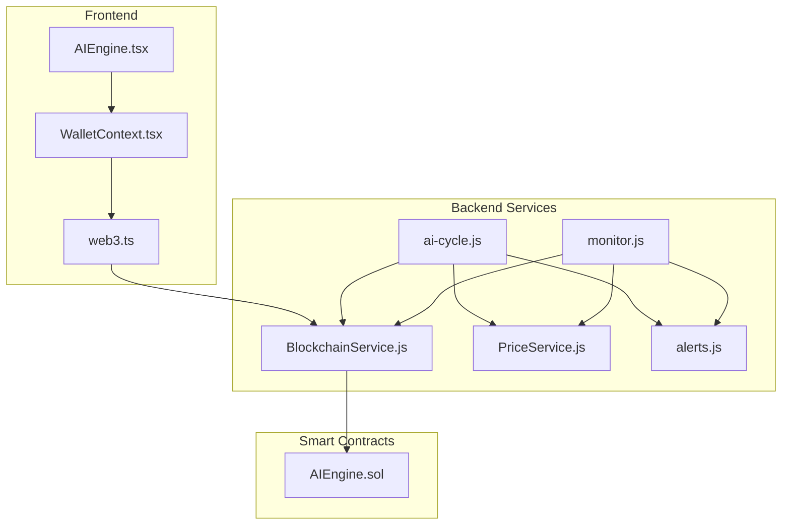
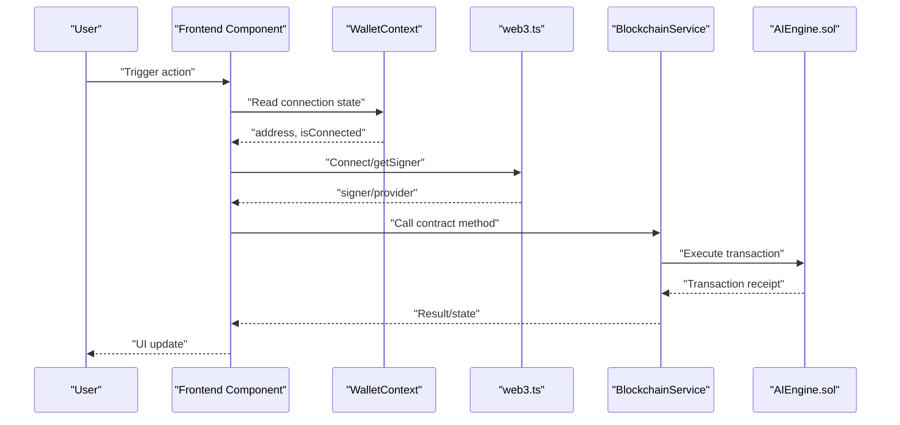
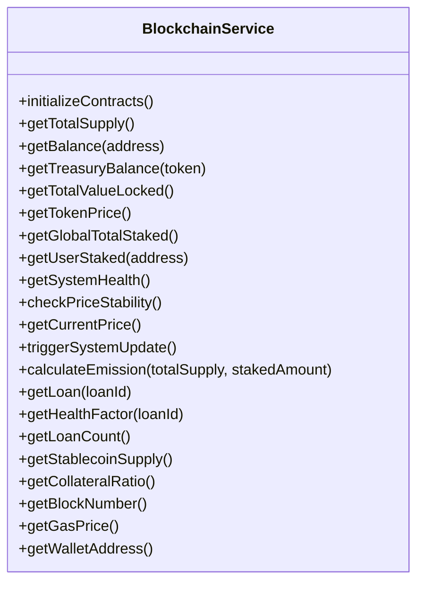
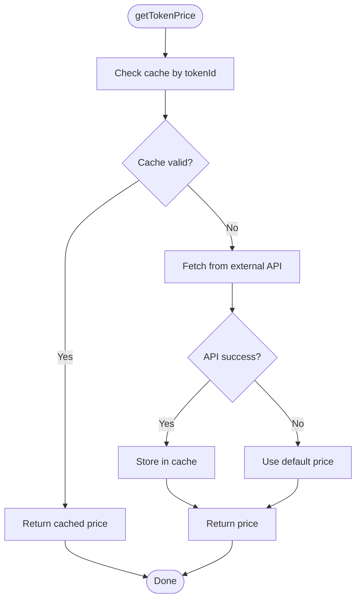
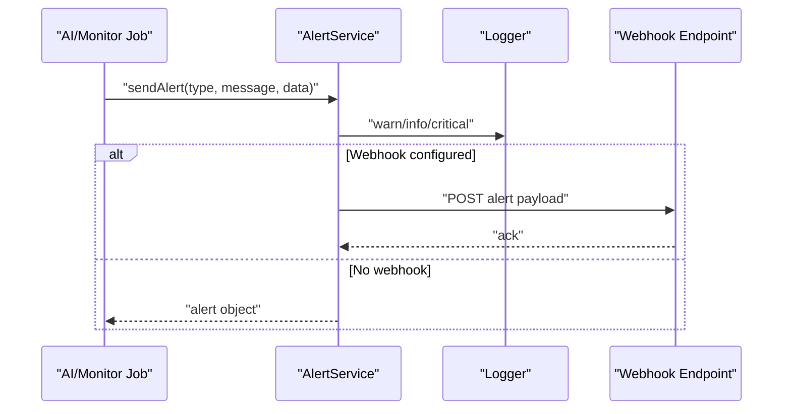
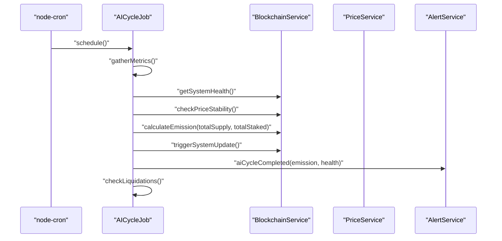
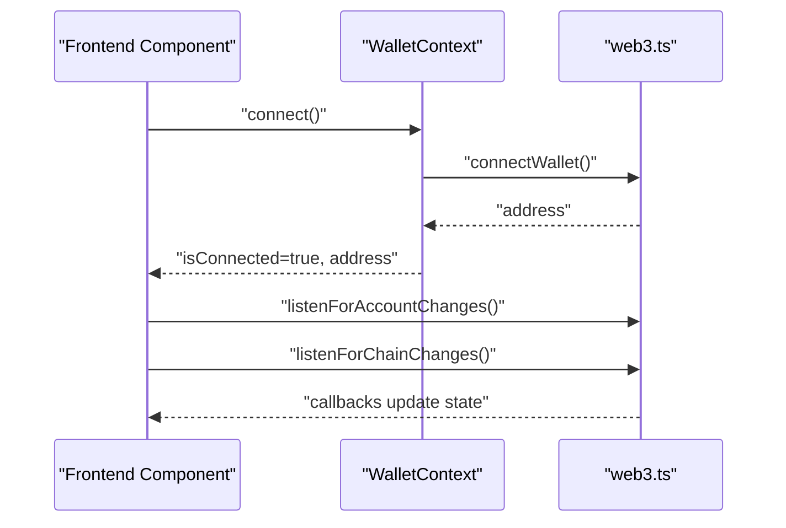
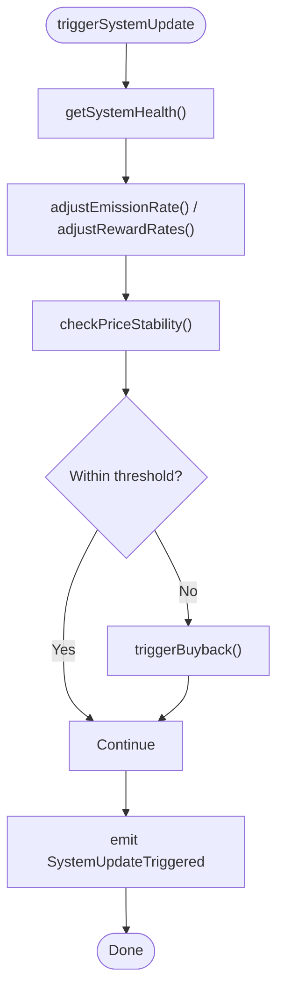
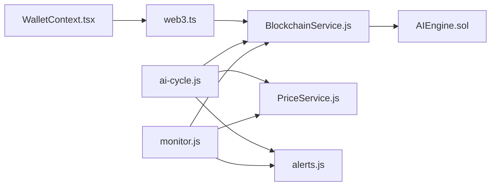

# Integration Testing

<cite>
**Referenced Files in This Document**
- [BlockchainService.js](file://neurafinance/backend/src/services/BlockchainService.js)
- [PriceService.js](file://neurafinance/backend/src/services/PriceService.js)
- [alerts.js](file://neurafinance/backend/src/utils/alerts.js)
- [ai-cycle.js](file://neurafinance/backend/src/jobs/ai-cycle.js)
- [monitor.js](file://neurafinance/backend/src/jobs/monitor.js)
- [WalletContext.tsx](file://neurafinance/frontend/src/contexts/WalletContext.tsx)
- [web3.ts](file://neurafinance/frontend/src/utils/web3.ts)
- [AIEngine.tsx](file://neurafinance/frontend/src/components/AIEngine.tsx)
- [AIEngine.sol](file://neurafinance/contracts/ai-engine/AIEngine.sol)
- [NeuronToken.test.js](file://neurafinance/test/NeuronToken.test.js)
- [Staking.test.js](file://neurafinance/test/Staking.test.js)
- [hardhat.config.js](file://neurafinance/hardhat.config.js)
- [backend/package.json](file://neurafinance/backend/package.json)
- [frontend/package.json](file://neurafinance/frontend/package.json)
</cite>

## Table of Contents
1. [Introduction](#introduction)
2. [Project Structure](#project-structure)
3. [Core Components](#core-components)
4. [Architecture Overview](#architecture-overview)
5. [Detailed Component Analysis](#detailed-component-analysis)
6. [Dependency Analysis](#dependency-analysis)
7. [Performance Considerations](#performance-considerations)
8. [Troubleshooting Guide](#troubleshooting-guide)
9. [Conclusion](#conclusion)
10. [Appendices](#appendices)

## Introduction
This document defines a comprehensive integration testing strategy for validating cross-system interactions across the backend automation, smart contracts, and frontend. It focuses on:
- Backend service integration: BlockchainService contract interaction testing, PriceService data aggregation validation, and alert system functionality.
- Frontend-backend integration: Wallet connection validation and real-time data synchronization testing.
- AI engine module integration: Inter-module communication, parameter propagation, and coordinated system responses.
- End-to-end workflows: From user actions to smart contract execution and frontend updates.
- Multi-contract interaction testing, state consistency validation, and error propagation testing.
- Test environment setup, test data management, and validation of complex system behaviors.

## Project Structure
The integration testing surface spans three layers:
- Smart contracts (Solidity): AI orchestration and core protocol contracts.
- Backend services: Automation jobs, blockchain and price services, and alerting utilities.
- Frontend: Wallet connectivity, provider listeners, and UI components.

**Diagram sources**
- [BlockchainService.js:1-216](file://neurafinance/backend/src/services/BlockchainService.js#L1-L216)
- [PriceService.js:1-77](file://neurafinance/backend/src/services/PriceService.js#L1-L77)
- [ai-cycle.js:1-177](file://neurafinance/backend/src/jobs/ai-cycle.js#L1-L177)
- [monitor.js:1-141](file://neurafinance/backend/src/jobs/monitor.js#L1-L141)
- [alerts.js:1-82](file://neurafinance/backend/src/utils/alerts.js#L1-L82)
- [WalletContext.tsx:1-102](file://neurafinance/frontend/src/contexts/WalletContext.tsx#L1-L102)
- [web3.ts:1-118](file://neurafinance/frontend/src/utils/web3.ts#L1-L118)
- [AIEngine.tsx:1-123](file://neurafinance/frontend/src/components/AIEngine.tsx#L1-L123)
- [AIEngine.sol:1-309](file://neurafinance/contracts/ai-engine/AIEngine.sol#L1-L309)

**Section sources**
- [BlockchainService.js:1-216](file://neurafinance/backend/src/services/BlockchainService.js#L1-L216)
- [PriceService.js:1-77](file://neurafinance/backend/src/services/PriceService.js#L1-L77)
- [ai-cycle.js:1-177](file://neurafinance/backend/src/jobs/ai-cycle.js#L1-L177)
- [monitor.js:1-141](file://neurafinance/backend/src/jobs/monitor.js#L1-L141)
- [alerts.js:1-82](file://neurafinance/backend/src/utils/alerts.js#L1-L82)
- [WalletContext.tsx:1-102](file://neurafinance/frontend/src/contexts/WalletContext.tsx#L1-L102)
- [web3.ts:1-118](file://neurafinance/frontend/src/utils/web3.ts#L1-L118)
- [AIEngine.tsx:1-123](file://neurafinance/frontend/src/components/AIEngine.tsx#L1-L123)
- [AIEngine.sol:1-309](file://neurafinance/contracts/ai-engine/AIEngine.sol#L1-L309)

## Core Components
- BlockchainService: Central facade for interacting with deployed contracts, aggregating state queries, and executing transactions. Provides typed wrappers around AIEngine, Treasury, Staking, Lending, and Stablecoin interfaces.
- PriceService: Market data aggregation with caching and fallback behavior, returning token price and market metadata.
- AlertService: Cross-channel alerting to webhooks and logs with structured severity levels and domain-specific messages.
- AI Cycle Job: Periodic orchestration that gathers metrics, checks system health and price stability, calculates emission, triggers system updates, and schedules alerts.
- Monitor Job: Continuous monitoring of treasury TVL, token price, system health, and blockchain block progress.
- Frontend WalletContext: Manages wallet connection lifecycle, listens for chain/account changes, and exposes connection state to components.
- AI Engine Smart Contract: Orchestrates AI modules (NEE, ALS, ARP, SIG, ALP), validates mint requests, computes health scores, and executes stabilization actions.

**Section sources**
- [BlockchainService.js:12-213](file://neurafinance/backend/src/services/BlockchainService.js#L12-L213)
- [PriceService.js:4-74](file://neurafinance/backend/src/services/PriceService.js#L4-L74)
- [alerts.js:4-81](file://neurafinance/backend/src/utils/alerts.js#L4-L81)
- [ai-cycle.js:13-161](file://neurafinance/backend/src/jobs/ai-cycle.js#L13-L161)
- [monitor.js:12-125](file://neurafinance/backend/src/jobs/monitor.js#L12-L125)
- [WalletContext.tsx:17-93](file://neurafinance/frontend/src/contexts/WalletContext.tsx#L17-L93)
- [AIEngine.sol:15-308](file://neurafinance/contracts/ai-engine/AIEngine.sol#L15-L308)

## Architecture Overview
The integration testing approach validates end-to-end flows across layers:
- Backend automation invokes BlockchainService to query contracts and trigger transactions.
- PriceService provides market data to inform decisions.
- Alerts notify stakeholders of anomalies.
- Frontend connects via WalletContext and web3 utilities, reflecting backend-derived state.

**Diagram sources**
- [WalletContext.tsx:17-93](file://neurafinance/frontend/src/contexts/WalletContext.tsx#L17-L93)
- [web3.ts:27-40](file://neurafinance/frontend/src/utils/web3.ts#L27-L40)
- [BlockchainService.js:133-143](file://neurafinance/backend/src/services/BlockchainService.js#L133-L143)
- [AIEngine.sol:240-261](file://neurafinance/contracts/ai-engine/AIEngine.sol#L240-L261)

## Detailed Component Analysis

### BlockchainService Integration Testing
Approach:
- Validate contract initialization and method routing.
- Verify read methods return expected types and handle errors gracefully.
- Execute write methods and assert transaction outcomes and emitted events.
- Confirm gas estimation and provider/fallback behavior.

Key test scenarios:
- Contract availability: Ensure all configured contract addresses resolve to valid ABI instances.
- Read operations: getTotalSupply, getBalance, getTotalValueLocked, getSystemHealth, checkPriceStability, getCurrentPrice, getGlobalTotalStaked, getLoan, getHealthFactor, getLoanCount, getStablecoinSupply, getCollateralRatio, getBlockNumber, getGasPrice.
- Write operations: triggerSystemUpdate, calculateEmission, requestMint, requestBurn, triggerBuyback, triggerSellPressure, collectFees, reinvestToLiquidity, distributeToTreasury, adjustEmissionRate, adjustRewardRates, validateMintRequest, validateSupplyHealth, getMaxMintable.
- Error handling: Wrap failures in logging and return safe defaults where applicable.

**Diagram sources**
- [BlockchainService.js:12-213](file://neurafinance/backend/src/services/BlockchainService.js#L12-L213)

**Section sources**
- [BlockchainService.js:18-37](file://neurafinance/backend/src/services/BlockchainService.js#L18-L37)
- [BlockchainService.js:40-208](file://neurafinance/backend/src/services/BlockchainService.js#L40-L208)

### PriceService Data Aggregation Validation
Approach:
- Validate cache TTL and cache hit behavior.
- Verify API fallback and default price behavior when external APIs are unavailable.
- Confirm market data composition and timestamp freshness.

Test scenarios:
- Cache correctness: Subsequent calls within TTL return cached values.
- Fallback behavior: On API failure, return default price and log warning.
- Market data completeness: getMarketData returns price, timestamp, and placeholder fields.

**Diagram sources**
- [PriceService.js:11-53](file://neurafinance/backend/src/services/PriceService.js#L11-L53)

**Section sources**
- [PriceService.js:11-74](file://neurafinance/backend/src/services/PriceService.js#L11-L74)

### Alert System Functionality
Approach:
- Validate alert dispatch to webhook and logs.
- Verify structured payload with type, message, timestamp, and data.
- Test severity-specific methods and domain-specific alerts.

Test scenarios:
- Webhook delivery: Send alert and assert successful post or error logging.
- Severity levels: critical, warning, info produce correct alert types.
- Domain alerts: lowTreasuryBalance, priceDeviation, unhealthyLoan, systemHealthLow, aiCycleCompleted.

**Diagram sources**
- [alerts.js:10-30](file://neurafinance/backend/src/utils/alerts.js#L10-L30)

**Section sources**
- [alerts.js:4-81](file://neurafinance/backend/src/utils/alerts.js#L4-L81)

### AI Engine Orchestration Integration
Approach:
- Validate periodic AI cycle execution and metric gathering.
- Confirm health computation, price stability checks, emission calculation, and system update triggers.
- Verify liquidation detection logic and alerting.

Test scenarios:
- Metrics gathering: Parallel fetch of block number, supply, staked amounts, TVL, price, stablecoin supply, collateral ratio.
- Health and stability: getSystemHealth and checkPriceStability return deterministic values under controlled state.
- Emission and update: calculateEmission produces expected emission given supply/staked inputs; triggerSystemUpdate emits expected events.
- Liquidation checks: Iterative health factor checks across recent loans and alert generation for unhealthy positions.

**Diagram sources**
- [ai-cycle.js:19-85](file://neurafinance/backend/src/jobs/ai-cycle.js#L19-L85)
- [BlockchainService.js:34-63](file://neurafinance/backend/src/services/BlockchainService.js#L34-L63)
- [PriceService.js:55-68](file://neurafinance/backend/src/services/PriceService.js#L55-L68)
- [alerts.js:73-78](file://neurafinance/backend/src/utils/alerts.js#L73-L78)

**Section sources**
- [ai-cycle.js:13-161](file://neurafinance/backend/src/jobs/ai-cycle.js#L13-L161)
- [BlockchainService.js:106-152](file://neurafinance/backend/src/services/BlockchainService.js#L106-L152)

### Frontend-Backend Integration Patterns
Approach:
- Wallet connection validation: Connect/disconnect flows, account and chain listeners, and provider availability.
- Real-time synchronization: Reflect backend-derived state in UI components.
- Error handling: Graceful degradation when providers or backend services are unavailable.

Test scenarios:
- Wallet lifecycle: connect resolves to an address; disconnect clears state; listeners update chain/address.
- Provider and signer: getProvider/getSigner return expected instances; getContract creation succeeds.
- UI integration: AIEngine component renders module details and health indicators; state updates after backend calls.

**Diagram sources**
- [WalletContext.tsx:61-77](file://neurafinance/frontend/src/contexts/WalletContext.tsx#L61-L77)
- [web3.ts:70-91](file://neurafinance/frontend/src/utils/web3.ts#L70-L91)

**Section sources**
- [WalletContext.tsx:17-93](file://neurafinance/frontend/src/contexts/WalletContext.tsx#L17-L93)
- [web3.ts:15-25](file://neurafinance/frontend/src/utils/web3.ts#L15-L25)
- [AIEngine.tsx:39-122](file://neurafinance/frontend/src/components/AIEngine.tsx#L39-L122)

### End-to-End Workflow Testing Examples
Example 1: AI Cycle Execution
- Preconditions: Contracts deployed, wallets configured, cron scheduled.
- Steps:
  - AICycleJob.gatherMetrics collects blockchain and token metrics.
  - BlockchainService.getSystemHealth and checkPriceStability evaluate system state.
  - BlockchainService.calculateEmission computes emission based on supply and staked amounts.
  - BlockchainService.triggerSystemUpdate executes AIEngine.update and waits for receipt.
  - AlertService.aiCycleCompleted notifies completion with emission and health metrics.
- Expected outcomes: Non-null metrics, emission value, transaction hash, and alert delivery.

Example 2: Price Monitoring and Alerts
- Preconditions: MonitorJob scheduled, backend running.
- Steps:
  - MonitorJob.monitorPrice compares current price to last known price and triggers priceDeviation alert if change exceeds threshold.
  - AlertService.priceDeviation includes current/target price and deviation percentage.
- Expected outcomes: Alert dispatched and logged; price cache updated.

Example 3: Frontend Wallet Interaction
- Preconditions: MetaMask available, accounts unlocked.
- Steps:
  - WalletContext.connect invokes web3.connectWallet and sets address.
  - web3.listenForAccountChanges and listenForChainChanges keep state synchronized.
  - Frontend components consume WalletContext to enable wallet-dependent actions.
- Expected outcomes: Connected state, updated chainId, and responsive UI.

**Section sources**
- [ai-cycle.js:19-85](file://neurafinance/backend/src/jobs/ai-cycle.js#L19-L85)
- [monitor.js:39-65](file://neurafinance/backend/src/jobs/monitor.js#L39-L65)
- [WalletContext.tsx:23-59](file://neurafinance/frontend/src/contexts/WalletContext.tsx#L23-L59)
- [web3.ts:27-40](file://neurafinance/frontend/src/utils/web3.ts#L27-L40)

### Multi-Contract Interaction Testing
Approach:
- Validate AIEngine orchestrator’s coordination across NEE, ALS, ARP, SIG, ALP modules.
- Assert mint/burn requests, buybacks, and liquidity adjustments respect treasury backing and stability thresholds.
- Ensure parameter propagation (e.g., emission rate, reward rates) influences downstream contracts.

Test scenarios:
- Mint validation: validateMintRequest checks max supply and backing ratio; requestMint emits emission events.
- Price stability: checkPriceStability computes deviation; triggerBuyback reduces deviation.
- System health: getSystemHealth aggregates staking ratio, backing ratio, and stability score.
- Parameter adjustment: adjustEmissionRate and adjustRewardRates update internal parameters.

**Diagram sources**
- [AIEngine.sol:240-261](file://neurafinance/contracts/ai-engine/AIEngine.sol#L240-L261)
- [AIEngine.sol:180-200](file://neurafinance/contracts/ai-engine/AIEngine.sol#L180-L200)
- [AIEngine.sol:101-113](file://neurafinance/contracts/ai-engine/AIEngine.sol#L101-L113)

**Section sources**
- [AIEngine.sol:75-97](file://neurafinance/contracts/ai-engine/AIEngine.sol#L75-L97)
- [AIEngine.sol:101-126](file://neurafinance/contracts/ai-engine/AIEngine.sol#L101-L126)
- [AIEngine.sol:202-225](file://neurafinance/contracts/ai-engine/AIEngine.sol#L202-L225)

### State Consistency and Error Propagation
Approach:
- Validate read-after-write consistency across BlockchainService and frontend.
- Simulate provider/network failures and confirm graceful error handling and fallbacks.
- Ensure alerting captures and propagates errors consistently across channels.

Test scenarios:
- Consistency: After triggerSystemUpdate, subsequent getSystemHealth reflects updated parameters.
- Error propagation: BlockchainService methods log errors and return null/default; jobs continue execution; alerts capture failures.
- Resilience: PriceService fallback to default price when API is down; monitor continues polling.

**Section sources**
- [BlockchainService.js:40-47](file://neurafinance/backend/src/services/BlockchainService.js#L40-L47)
- [PriceService.js:36-53](file://neurafinance/backend/src/services/PriceService.js#L36-L53)
- [ai-cycle.js:79-84](file://neurafinance/backend/src/jobs/ai-cycle.js#L79-L84)

## Dependency Analysis
Backend dependencies:
- BlockchainService depends on provider/wallet and contract ABIs.
- Jobs depend on services and alert utilities.
- PriceService depends on external API and cache.

Frontend dependencies:
- WalletContext depends on web3 utilities for provider/signer and listener management.
- Components depend on WalletContext for connection state.

**Diagram sources**
- [WalletContext.tsx:17-93](file://neurafinance/frontend/src/contexts/WalletContext.tsx#L17-L93)
- [web3.ts:15-25](file://neurafinance/frontend/src/utils/web3.ts#L15-L25)
- [BlockchainService.js:18-37](file://neurafinance/backend/src/services/BlockchainService.js#L18-L37)
- [ai-cycle.js:8-11](file://neurafinance/backend/src/jobs/ai-cycle.js#L8-L11)
- [monitor.js:7-10](file://neurafinance/backend/src/jobs/monitor.js#L7-L10)
- [PriceService.js:1-9](file://neurafinance/backend/src/services/PriceService.js#L1-L9)
- [alerts.js:1-8](file://neurafinance/backend/src/utils/alerts.js#L1-L8)

**Section sources**
- [backend/package.json:12-20](file://neurafinance/backend/package.json#L12-L20)
- [frontend/package.json:11-29](file://neurafinance/frontend/package.json#L11-L29)

## Performance Considerations
- Concurrency: Use Promise.all for parallel metric gathering in jobs to minimize latency.
- Caching: Leverage PriceService cache TTL to reduce external API calls.
- Scheduling: Tune cron intervals for AI cycles and monitoring to balance responsiveness and resource usage.
- Gas management: Retrieve gas estimates before transactions and handle high gas scenarios.

## Troubleshooting Guide
Common issues and validations:
- Wallet not connected: Verify provider availability and MetaMask installation; ensure connectWallet resolves to an address.
- Network mismatch: Use switchNetwork to align frontend with backend expectations; confirm chainId listeners update state.
- Contract calls failing: Check ABI correctness, contract addresses, and signer permissions; review error logs and fallback behavior.
- Alerts not received: Validate webhook URL and credentials; confirm alert severity levels and payload structure.
- Price API failures: Confirm fallback logic and default price behavior; monitor cache timestamps.

**Section sources**
- [web3.ts:54-68](file://neurafinance/frontend/src/utils/web3.ts#L54-L68)
- [web3.ts:70-91](file://neurafinance/frontend/src/utils/web3.ts#L70-L91)
- [BlockchainService.js:40-47](file://neurafinance/backend/src/services/BlockchainService.js#L40-L47)
- [alerts.js:20-27](file://neurafinance/backend/src/utils/alerts.js#L20-L27)

## Conclusion
This integration testing framework ensures robust cross-layer validation:
- Backend services are validated for contract interactions, data aggregation, and alerting.
- Frontend-backend integration is covered by wallet lifecycle and real-time synchronization tests.
- AI engine orchestration is verified through periodic cycles, parameter propagation, and coordinated actions.
- End-to-end workflows are tested from user actions to smart contract execution and frontend updates.
- Multi-contract interactions, state consistency, and error propagation are systematically addressed.

## Appendices

### Test Environment Setup Guidelines
- Hardhat network: Configure local development network and private key for deployment and testing.
- Backend services: Set environment variables for RPC URLs, API endpoints, and alert webhooks; run jobs with appropriate intervals.
- Frontend: Ensure MetaMask is installed and accounts are unlocked; configure chainId and RPC URL matching backend.

**Section sources**
- [hardhat.config.js:15-29](file://neurafinance/hardhat.config.js#L15-L29)
- [backend/package.json:6-11](file://neurafinance/backend/package.json#L6-L11)
- [frontend/package.json:5-9](file://neurafinance/frontend/package.json#L5-L9)

### Managing Test Data
- Use Hardhat fixtures to deploy minimal protocol state for integration tests.
- Seed blockchain state with predefined balances, stakes, and loans to simulate realistic conditions.
- Maintain deterministic randomness for reproducible test runs.

**Section sources**
- [NeuronToken.test.js:7-28](file://neurafinance/test/NeuronToken.test.js#L7-L28)
- [Staking.test.js:8-25](file://neurafinance/test/Staking.test.js#L8-L25)

### Example Solidity Integration Tests
- Token and staking contracts: Deploy, authorize minters, approve stakes, and validate balances and totals.
- Assertions: Total supply equals owner balance after deployment; transfers update balances; staking tracks global totals.

**Section sources**
- [NeuronToken.test.js:14-94](file://neurafinance/test/NeuronToken.test.js#L14-L94)
- [Staking.test.js:27-105](file://neurafinance/test/Staking.test.js#L27-L105)