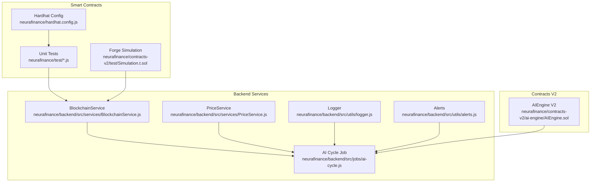
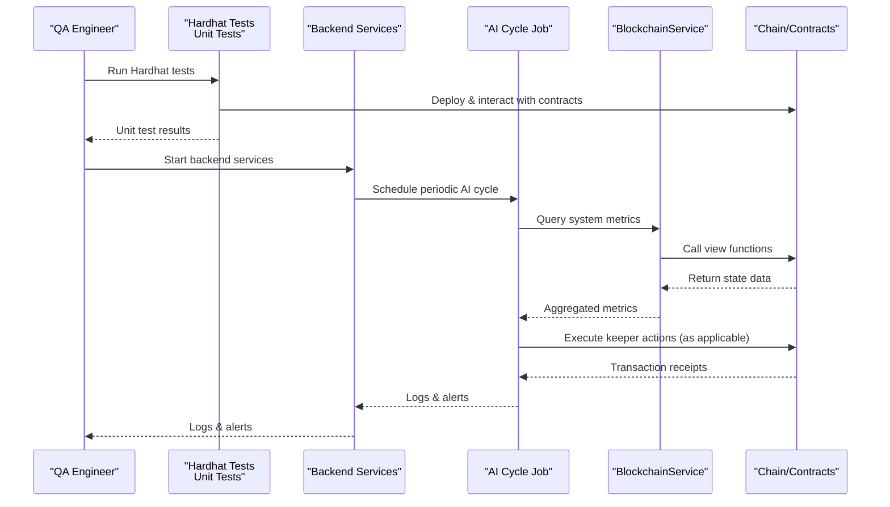
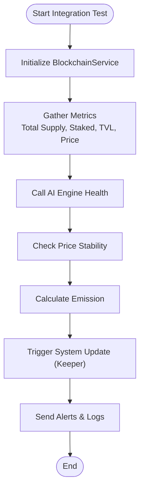
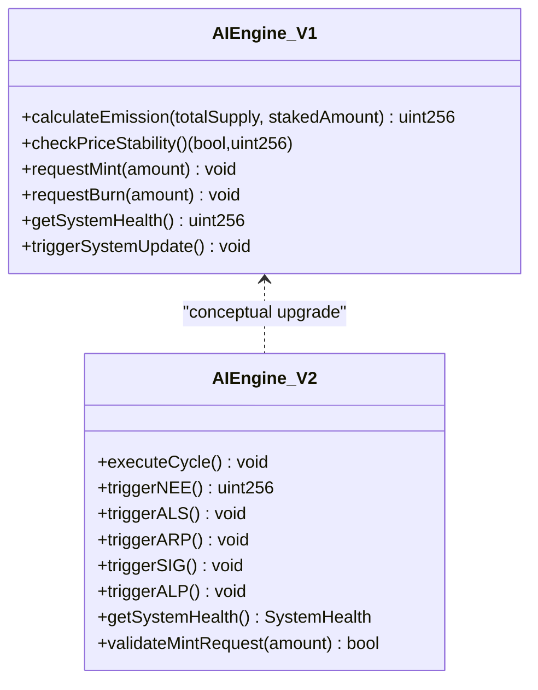
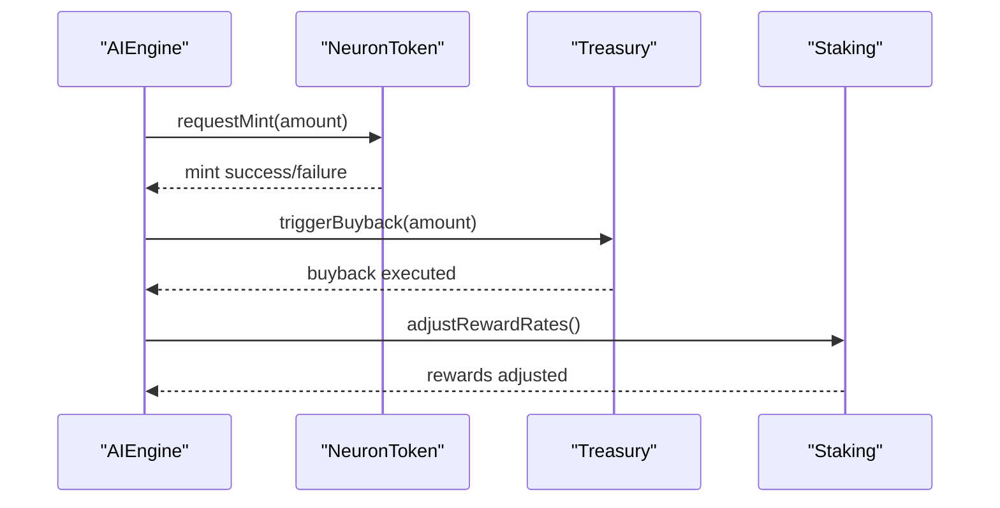
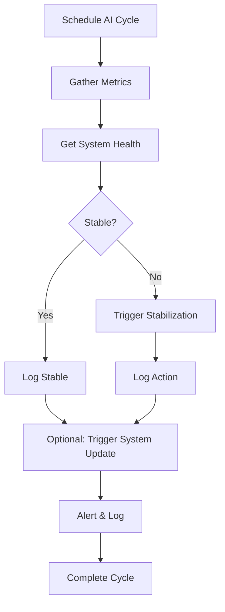
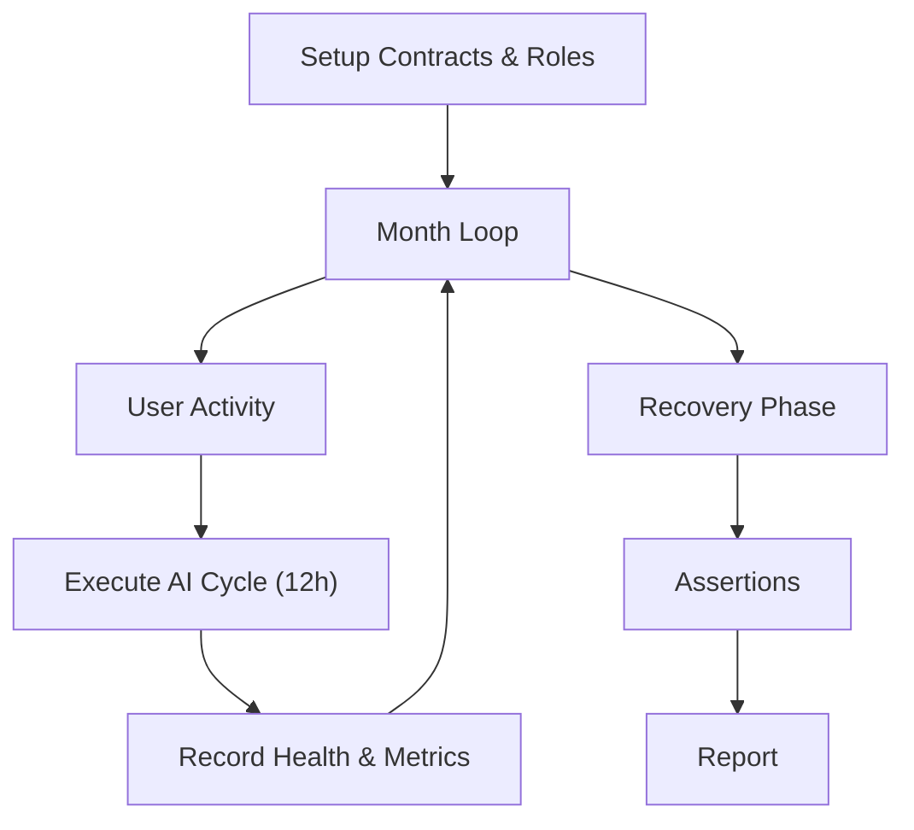
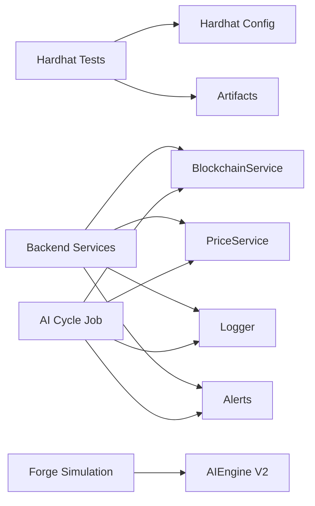

# Testing Strategy

<cite>
**Referenced Files in This Document**
- [neurafinance/hardhat.config.js](file://neurafinance/hardhat.config.js)
- [neurafinance/package.json](file://neurafinance/package.json)
- [neurafinance/test/NeuronToken.test.js](file://neurafinance/test/NeuronToken.test.js)
- [neurafinance/test/Staking.test.js](file://neurafinance/test/Staking.test.js)
- [neurafinance/backend/src/services/BlockchainService.js](file://neurafinance/backend/src/services/BlockchainService.js)
- [neurafinance/backend/src/services/PriceService.js](file://neurafinance/backend/src/services/PriceService.js)
- [neurafinance/backend/src/jobs/ai-cycle.js](file://neurafinance/backend/src/jobs/ai-cycle.js)
- [neurafinance/backend/src/utils/alerts.js](file://neurafinance/backend/src/utils/alerts.js)
- [neurafinance/backend/src/utils/logger.js](file://neurafinance/backend/src/utils/logger.js)
- [neurafinance/backend/package.json](file://neurafinance/backend/package.json)
- [neurafinance/contracts/ai-engine/AIEngine.sol](file://neurafinance/contracts/ai-engine/AIEngine.sol)
- [neurafinance/contracts-v2/ai-engine/AIEngine.sol](file://neurafinance/contracts-v2/ai-engine/AIEngine.sol)
- [neurafinance/contracts-v2/test/Simulation.t.sol](file://neurafinance/contracts-v2/test/Simulation.t.sol)
</cite>

## Table of Contents
1. [Introduction](#introduction)
2. [Project Structure](#project-structure)
3. [Core Components](#core-components)
4. [Architecture Overview](#architecture-overview)
5. [Detailed Component Analysis](#detailed-component-analysis)
6. [Dependency Analysis](#dependency-analysis)
7. [Performance Considerations](#performance-considerations)
8. [Troubleshooting Guide](#troubleshooting-guide)
9. [Conclusion](#conclusion)
10. [Appendices](#appendices)

## Introduction
This document defines the comprehensive quality assurance framework for NeuraFinance. It outlines a multi-layered testing approach covering:
- Hardhat tests for smart contracts (unit tests)
- Integration tests validating backend service interactions with the blockchain
- AI engine module testing and cross-contract interaction validation
- End-to-end workflow testing across frontend, backend, and blockchain layers
- Continuous integration patterns, performance testing methodologies, and bug reporting procedures

The strategy leverages existing test suites and services while establishing clear standards for gas optimization, fuzzing, and security testing.

## Project Structure
NeuraFinance’s testing assets are distributed across three primary areas:
- Smart contracts and Hardhat-based unit tests
- Backend automation jobs and services
- AI engine simulation and cross-contract integration tests

**Diagram sources**
- [neurafinance/hardhat.config.js:1-43](file://neurafinance/hardhat.config.js#L1-L43)
- [neurafinance/test/NeuronToken.test.js:1-96](file://neurafinance/test/NeuronToken.test.js#L1-L96)
- [neurafinance/test/Staking.test.js:1-107](file://neurafinance/test/Staking.test.js#L1-L107)
- [neurafinance/contracts-v2/test/Simulation.t.sol:1-409](file://neurafinance/contracts-v2/test/Simulation.t.sol#L1-L409)
- [neurafinance/backend/src/services/BlockchainService.js:1-216](file://neurafinance/backend/src/services/BlockchainService.js#L1-L216)
- [neurafinance/backend/src/services/PriceService.js:1-77](file://neurafinance/backend/src/services/PriceService.js#L1-L77)
- [neurafinance/backend/src/jobs/ai-cycle.js:1-177](file://neurafinance/backend/src/jobs/ai-cycle.js#L1-L177)
- [neurafinance/backend/src/utils/logger.js:1-28](file://neurafinance/backend/src/utils/logger.js#L1-L28)
- [neurafinance/backend/src/utils/alerts.js:1-82](file://neurafinance/backend/src/utils/alerts.js#L1-L82)
- [neurafinance/contracts-v2/ai-engine/AIEngine.sol:1-386](file://neurafinance/contracts-v2/ai-engine/AIEngine.sol#L1-L386)

**Section sources**
- [neurafinance/hardhat.config.js:1-43](file://neurafinance/hardhat.config.js#L1-L43)
- [neurafinance/package.json:1-22](file://neurafinance/package.json#L1-L22)
- [neurafinance/backend/package.json:1-28](file://neurafinance/backend/package.json#L1-L28)

## Core Components
- Hardhat-based unit tests for smart contracts:
  - Tokenomics and staking mechanics validated via dedicated test suites
  - Gas optimization and revert scenarios covered
- Backend services:
  - BlockchainService aggregates contract calls and exposes typed methods for downstream consumers
  - PriceService provides caching and fallbacks for token price retrieval
  - AI Cycle Job orchestrates periodic system updates and health monitoring
- AI engine testing:
  - AIEngine V1 and V2 contracts expose deterministic functions suitable for unit and simulation tests
  - Forge simulation comprehensively validates long-term system behavior under stress scenarios

**Section sources**
- [neurafinance/test/NeuronToken.test.js:1-96](file://neurafinance/test/NeuronToken.test.js#L1-L96)
- [neurafinance/test/Staking.test.js:1-107](file://neurafinance/test/Staking.test.js#L1-L107)
- [neurafinance/backend/src/services/BlockchainService.js:1-216](file://neurafinance/backend/src/services/BlockchainService.js#L1-L216)
- [neurafinance/backend/src/services/PriceService.js:1-77](file://neurafinance/backend/src/services/PriceService.js#L1-L77)
- [neurafinance/backend/src/jobs/ai-cycle.js:1-177](file://neurafinance/backend/src/jobs/ai-cycle.js#L1-L177)
- [neurafinance/contracts/ai-engine/AIEngine.sol:1-309](file://neurafinance/contracts/ai-engine/AIEngine.sol#L1-L309)
- [neurafinance/contracts-v2/ai-engine/AIEngine.sol:1-386](file://neurafinance/contracts-v2/ai-engine/AIEngine.sol#L1-L386)
- [neurafinance/contracts-v2/test/Simulation.t.sol:1-409](file://neurafinance/contracts-v2/test/Simulation.t.sol#L1-L409)

## Architecture Overview
The testing architecture integrates Hardhat-based unit tests with backend automation and AI engine simulations to validate end-to-end workflows.

**Diagram sources**
- [neurafinance/test/NeuronToken.test.js:1-96](file://neurafinance/test/NeuronToken.test.js#L1-L96)
- [neurafinance/test/Staking.test.js:1-107](file://neurafinance/test/Staking.test.js#L1-L107)
- [neurafinance/backend/src/jobs/ai-cycle.js:1-177](file://neurafinance/backend/src/jobs/ai-cycle.js#L1-L177)
- [neurafinance/backend/src/services/BlockchainService.js:1-216](file://neurafinance/backend/src/services/BlockchainService.js#L1-L216)

## Detailed Component Analysis

### Hardhat Tests (Unit Tests)
- Purpose: Validate individual smart contracts in isolation using Hardhat’s EVM fork and Chai assertions
- Coverage:
  - Token deployment, balances, mint/burn, fee configuration, whitelist
  - Staking lifecycle: flexible and bond stakes, unstaking, reward rates, ownership controls
- Gas optimization: use Hardhat’s built-in gas reporting during local runs
- Security testing: assert reverts for unauthorized access and invalid state transitions

Recommended practices:
- Use beforeEach to deploy fresh instances per suite
- Mock external dependencies via interface-only deployments when feasible
- Add revert scenarios for invalid inputs and unauthorized actors

**Section sources**
- [neurafinance/test/NeuronToken.test.js:1-96](file://neurafinance/test/NeuronToken.test.js#L1-L96)
- [neurafinance/test/Staking.test.js:1-107](file://neurafinance/test/Staking.test.js#L1-L107)
- [neurafinance/hardhat.config.js:1-43](file://neurafinance/hardhat.config.js#L1-L43)
- [neurafinance/package.json:1-22](file://neurafinance/package.json#L1-L22)

### Backend Service Validation (Integration Tests)
- Purpose: Validate backend services’ interactions with blockchain and external APIs
- Coverage:
  - BlockchainService method calls for token, treasury, staking, AI engine, lending, and stablecoin
  - PriceService caching and fallback behavior
  - AI Cycle Job orchestration, metrics gathering, and alerting
- Error handling: robust logging and graceful fallbacks for external failures

**Diagram sources**
- [neurafinance/backend/src/services/BlockchainService.js:1-216](file://neurafinance/backend/src/services/BlockchainService.js#L1-L216)
- [neurafinance/backend/src/jobs/ai-cycle.js:1-177](file://neurafinance/backend/src/jobs/ai-cycle.js#L1-L177)
- [neurafinance/backend/src/utils/alerts.js:1-82](file://neurafinance/backend/src/utils/alerts.js#L1-L82)
- [neurafinance/backend/src/utils/logger.js:1-28](file://neurafinance/backend/src/utils/logger.js#L1-L28)

**Section sources**
- [neurafinance/backend/src/services/BlockchainService.js:1-216](file://neurafinance/backend/src/services/BlockchainService.js#L1-L216)
- [neurafinance/backend/src/services/PriceService.js:1-77](file://neurafinance/backend/src/services/PriceService.js#L1-L77)
- [neurafinance/backend/src/jobs/ai-cycle.js:1-177](file://neurafinance/backend/src/jobs/ai-cycle.js#L1-L177)
- [neurafinance/backend/src/utils/alerts.js:1-82](file://neurafinance/backend/src/utils/alerts.js#L1-L82)
- [neurafinance/backend/src/utils/logger.js:1-28](file://neurafinance/backend/src/utils/logger.js#L1-L28)

### AI Engine Module Testing
- AIEngine V1:
  - Exposes emission calculation, price stability checks, mint/burn requests, and system health metrics
  - Access control ensures only authorized modules can request mint/burn
- AIEngine V2:
  - Implements a 12-hour cycle with keeper role, health-based emission adjustments, and price stabilization logic
  - Provides structured health metrics and parameterized emission schedules

**Diagram sources**
- [neurafinance/contracts/ai-engine/AIEngine.sol:1-309](file://neurafinance/contracts/ai-engine/AIEngine.sol#L1-L309)
- [neurafinance/contracts-v2/ai-engine/AIEngine.sol:1-386](file://neurafinance/contracts-v2/ai-engine/AIEngine.sol#L1-L386)

**Section sources**
- [neurafinance/contracts/ai-engine/AIEngine.sol:1-309](file://neurafinance/contracts/ai-engine/AIEngine.sol#L1-L309)
- [neurafinance/contracts-v2/ai-engine/AIEngine.sol:1-386](file://neurafinance/contracts-v2/ai-engine/AIEngine.sol#L1-L386)

### Cross-Contract Interaction Validation
- Scenario: AI engine triggers mint/burn, treasury executes buybacks, staking manages rewards
- Validation:
  - Ensure only authorized modules can call sensitive functions
  - Verify mint/burn requests pass integrity checks (supply caps, backing ratios)
  - Confirm treasury backing and stability thresholds are enforced

**Diagram sources**
- [neurafinance/contracts/ai-engine/AIEngine.sol:88-143](file://neurafinance/contracts/ai-engine/AIEngine.sol#L88-L143)
- [neurafinance/contracts/ai-engine/AIEngine.sol:240-261](file://neurafinance/contracts/ai-engine/AIEngine.sol#L240-L261)

**Section sources**
- [neurafinance/contracts/ai-engine/AIEngine.sol:1-309](file://neurafinance/contracts/ai-engine/AIEngine.sol#L1-L309)

### End-to-End Workflow Testing
- AI Cycle Job orchestrates:
  - Metrics gathering from BlockchainService
  - Health checks and price stability assessments
  - Emission calculations and optional system updates
  - Liquidation monitoring for lending positions
- Backend logging and alerting capture outcomes for auditability

**Diagram sources**
- [neurafinance/backend/src/jobs/ai-cycle.js:1-177](file://neurafinance/backend/src/jobs/ai-cycle.js#L1-L177)
- [neurafinance/backend/src/services/BlockchainService.js:105-152](file://neurafinance/backend/src/services/BlockchainService.js#L105-L152)
- [neurafinance/backend/src/utils/alerts.js:1-82](file://neurafinance/backend/src/utils/alerts.js#L1-L82)

**Section sources**
- [neurafinance/backend/src/jobs/ai-cycle.js:1-177](file://neurafinance/backend/src/jobs/ai-cycle.js#L1-L177)
- [neurafinance/backend/src/services/BlockchainService.js:1-216](file://neurafinance/backend/src/services/BlockchainService.js#L1-L216)
- [neurafinance/backend/src/utils/alerts.js:1-82](file://neurafinance/backend/src/utils/alerts.js#L1-L82)

### Forge Simulation (Fuzzing and Stress Testing)
- Purpose: Long-running simulation of NeuraFinance V2 over six months under multiple scenarios
- Scenarios:
  - Healthy growth with steady user acquisition
  - No new users (stress test) with withdrawals
  - Market crash followed by recovery
  - Referral sustainability and lending liquidation
  - Compound interest accuracy over time
- Fuzzing approach:
  - Randomized price movements and withdrawal percentages
  - Warp time to accelerate cycle progression
  - Assert health thresholds and emission limits

**Diagram sources**
- [neurafinance/contracts-v2/test/Simulation.t.sol:108-136](file://neurafinance/contracts-v2/test/Simulation.t.sol#L108-L136)
- [neurafinance/contracts-v2/test/Simulation.t.sol:141-167](file://neurafinance/contracts-v2/test/Simulation.t.sol#L141-L167)
- [neurafinance/contracts-v2/test/Simulation.t.sol:172-201](file://neurafinance/contracts-v2/test/Simulation.t.sol#L172-L201)
- [neurafinance/contracts-v2/test/Simulation.t.sol:206-235](file://neurafinance/contracts-v2/test/Simulation.t.sol#L206-L235)
- [neurafinance/contracts-v2/test/Simulation.t.sol:238-265](file://neurafinance/contracts-v2/test/Simulation.t.sol#L238-L265)
- [neurafinance/contracts-v2/test/Simulation.t.sol:268-294](file://neurafinance/contracts-v2/test/Simulation.t.sol#L268-L294)

**Section sources**
- [neurafinance/contracts-v2/test/Simulation.t.sol:1-409](file://neurafinance/contracts-v2/test/Simulation.t.sol#L1-L409)

## Dependency Analysis
- Hardhat tests depend on:
  - Hardhat config for network settings and Solidity compiler options
  - Local development network and contract artifacts
- Backend services depend on:
  - BlockchainService for contract interactions
  - PriceService for market data
  - Logger and Alerts for observability
- AI engine simulations depend on:
  - AIEngine V2 keeper role and health metrics
  - Mock contracts for controlled environments

**Diagram sources**
- [neurafinance/hardhat.config.js:1-43](file://neurafinance/hardhat.config.js#L1-L43)
- [neurafinance/backend/src/services/BlockchainService.js:1-216](file://neurafinance/backend/src/services/BlockchainService.js#L1-L216)
- [neurafinance/backend/src/services/PriceService.js:1-77](file://neurafinance/backend/src/services/PriceService.js#L1-L77)
- [neurafinance/backend/src/jobs/ai-cycle.js:1-177](file://neurafinance/backend/src/jobs/ai-cycle.js#L1-L177)
- [neurafinance/contracts-v2/ai-engine/AIEngine.sol:1-386](file://neurafinance/contracts-v2/ai-engine/AIEngine.sol#L1-L386)

**Section sources**
- [neurafinance/hardhat.config.js:1-43](file://neurafinance/hardhat.config.js#L1-L43)
- [neurafinance/backend/src/services/BlockchainService.js:1-216](file://neurafinance/backend/src/services/BlockchainService.js#L1-L216)
- [neurafinance/backend/src/services/PriceService.js:1-77](file://neurafinance/backend/src/services/PriceService.js#L1-L77)
- [neurafinance/backend/src/jobs/ai-cycle.js:1-177](file://neurafinance/backend/src/jobs/ai-cycle.js#L1-L177)
- [neurafinance/contracts-v2/ai-engine/AIEngine.sol:1-386](file://neurafinance/contracts-v2/ai-engine/AIEngine.sol#L1-L386)

## Performance Considerations
- Gas optimization:
  - Run Hardhat tests with gas reporting to identify expensive operations
  - Prefer batch operations and minimize external calls in tight loops
- Backend throughput:
  - Use asynchronous metrics gathering and parallelize independent calls
  - Cache price data with appropriate TTL to reduce API calls
- Simulation performance:
  - Warp time to accelerate cycles and reduce wall-clock time
  - Use targeted assertions to avoid unnecessary computations

[No sources needed since this section provides general guidance]

## Troubleshooting Guide
Common issues and resolutions:
- Contract revert errors:
  - Validate access control and parameter bounds before invoking transactions
  - Use revert reason assertions in unit tests to capture failure causes
- Backend failures:
  - Inspect logs for error stacks and timestamps
  - Verify external API availability and fallback logic
- AI cycle anomalies:
  - Confirm keeper role permissions and cycle intervals
  - Review health thresholds and stabilization cooldowns

**Section sources**
- [neurafinance/backend/src/utils/logger.js:1-28](file://neurafinance/backend/src/utils/logger.js#L1-L28)
- [neurafinance/backend/src/utils/alerts.js:1-82](file://neurafinance/backend/src/utils/alerts.js#L1-L82)
- [neurafinance/backend/src/jobs/ai-cycle.js:1-177](file://neurafinance/backend/src/jobs/ai-cycle.js#L1-L177)

## Conclusion
NeuraFinance’s testing strategy combines Hardhat unit tests, backend integration validations, and Forge simulations to ensure robustness across smart contracts, backend services, and AI-driven workflows. By emphasizing gas optimization, fuzzing, and security testing, the framework supports reliable upgrades and continuous operation.

[No sources needed since this section summarizes without analyzing specific files]

## Appendices

### Practical Examples

- Creating Hardhat unit tests:
  - Use describe blocks to group related behaviors (deployment, transactions, mint/burn, whitelist)
  - Assert revert conditions with specific reason strings
  - Example paths:
    - [NeuronToken test suite:1-96](file://neurafinance/test/NeuronToken.test.js#L1-L96)
    - [Staking test suite:1-107](file://neurafinance/test/Staking.test.js#L1-L107)

- Gas optimization analysis:
  - Run Hardhat tests with gas reporting enabled
  - Compare gas costs across similar operations and refactor hot paths
  - Example command:
    - [package.json script:5-15](file://neurafinance/package.json#L5-L15)

- Security testing approaches:
  - Add revert scenarios for unauthorized mint/burn requests
  - Validate state transitions and boundary conditions
  - Example paths:
    - [AIEngine V1 access control:47-63](file://neurafinance/contracts/ai-engine/AIEngine.sol#L47-L63)
    - [AIEngine V2 keeper role:17-22](file://neurafinance/contracts-v2/ai-engine/AIEngine.sol#L17-L22)

- Continuous integration patterns:
  - Automate Hardhat tests and backend jobs in CI pipelines
  - Enforce minimum coverage thresholds and linting
  - Example paths:
    - [Backend scripts:6-11](file://neurafinance/backend/package.json#L6-L11)
    - [Hardhat scripts:5-15](file://neurafinance/package.json#L5-L15)

- Performance testing methodologies:
  - Use Forge simulation to model long-term behavior under stress
  - Warp time to accelerate cycles and measure health decay/recovery
  - Example path:
    - [Forge simulation:108-201](file://neurafinance/contracts-v2/test/Simulation.t.sol#L108-L201)

- Bug reporting procedures:
  - Capture logs with timestamps and error stacks
  - Use alerts to notify stakeholders on critical failures
  - Example paths:
    - [Logger configuration:1-28](file://neurafinance/backend/src/utils/logger.js#L1-L28)
    - [Alert service:1-82](file://neurafinance/backend/src/utils/alerts.js#L1-L82)