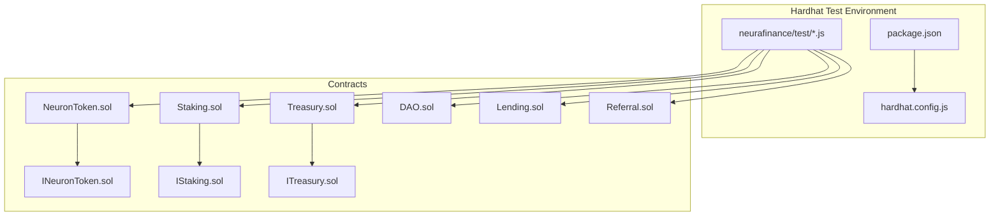
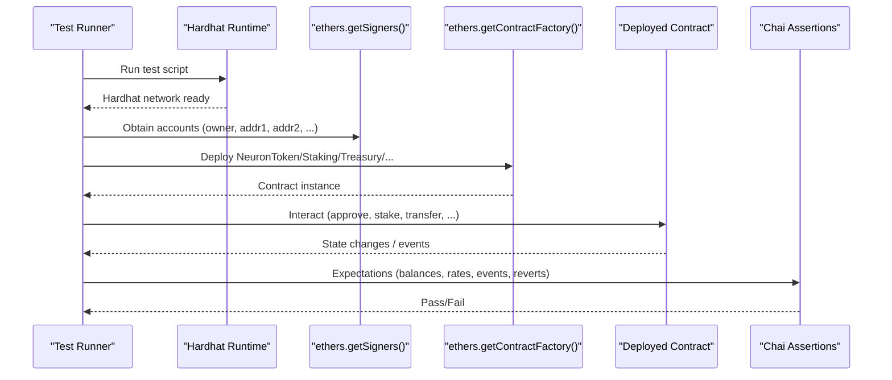
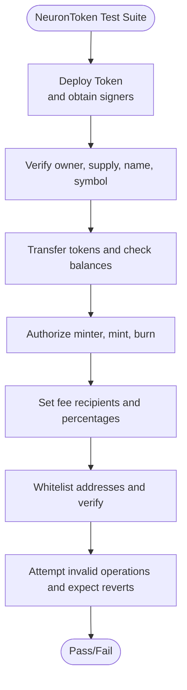
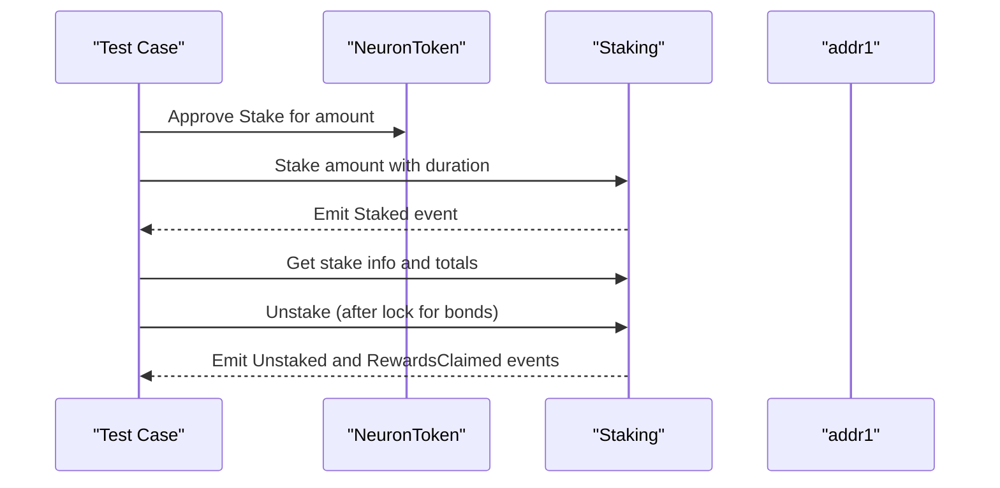
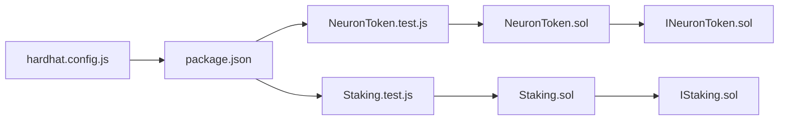

# Unit Testing

<cite>
**Referenced Files in This Document**
- [NeuronToken.test.js](file://neurafinance/test/NeuronToken.test.js)
- [Staking.test.js](file://neurafinance/test/Staking.test.js)
- [hardhat.config.js](file://neurafinance/hardhat.config.js)
- [package.json](file://neurafinance/package.json)
- [NeuronToken.sol](file://neurafinance/contracts/core/NeuronToken.sol)
- [Staking.sol](file://neurafinance/contracts/core/Staking.sol)
- [Treasury.sol](file://neurafinance/contracts/core/Treasury.sol)
- [DAO.sol](file://neurafinance/contracts/core/DAO.sol)
- [Lending.sol](file://neurafinance/contracts/core/Lending.sol)
- [Referral.sol](file://neurafinance/contracts/core/Referral.sol)
- [INeuronToken.sol](file://neurafinance/contracts/interfaces/INeuronToken.sol)
- [IStaking.sol](file://neurafinance/contracts/interfaces/IStaking.sol)
- [ITreasury.sol](file://neurafinance/contracts/interfaces/ITreasury.sol)
</cite>

## Table of Contents
1. [Introduction](#introduction)
2. [Project Structure](#project-structure)
3. [Core Components](#core-components)
4. [Architecture Overview](#architecture-overview)
5. [Detailed Component Analysis](#detailed-component-analysis)
6. [Dependency Analysis](#dependency-analysis)
7. [Performance Considerations](#performance-considerations)
8. [Troubleshooting Guide](#troubleshooting-guide)
9. [Conclusion](#conclusion)

## Introduction
This document provides a comprehensive guide to unit testing for the NeuraFinance ecosystem. It explains the Hardhat-based testing framework, test case structure, assertion patterns, and practical testing approaches for each core contract. It covers emission mechanics, reward calculations, treasury asset management, DAO voting, lending collateral handling, and referral commission structures. It also includes guidance for gas optimization testing, reentrancy protection validation, input sanitization, and maintainable test-writing practices.

## Project Structure
The NeuraFinance repository organizes tests under the Hardhat test directory and Solidity contracts under the contracts directory. Tests use Chai assertions and Hardhat’s ethers provider to deploy contracts, interact with them, and validate state transitions and events.

**Diagram sources**
- [hardhat.config.js:1-43](file://neurafinance/hardhat.config.js#L1-L43)
- [package.json:1-22](file://neurafinance/package.json#L1-L22)
- [NeuronToken.sol:1-253](file://neurafinance/contracts/core/NeuronToken.sol#L1-L253)
- [Staking.sol:1-261](file://neurafinance/contracts/core/Staking.sol#L1-L261)
- [Treasury.sol:1-196](file://neurafinance/contracts/core/Treasury.sol#L1-L196)
- [DAO.sol:1-231](file://neurafinance/contracts/core/DAO.sol#L1-L231)
- [Lending.sol:1-308](file://neurafinance/contracts/core/Lending.sol#L1-L308)
- [Referral.sol:1-202](file://neurafinance/contracts/core/Referral.sol#L1-L202)
- [INeuronToken.sol:1-20](file://neurafinance/contracts/interfaces/INeuronToken.sol#L1-L20)
- [IStaking.sol:1-31](file://neurafinance/contracts/interfaces/IStaking.sol#L1-L31)
- [ITreasury.sol:1-17](file://neurafinance/contracts/interfaces/ITreasury.sol#L1-L17)

**Section sources**
- [hardhat.config.js:1-43](file://neurafinance/hardhat.config.js#L1-L43)
- [package.json:1-22](file://neurafinance/package.json#L1-L22)

## Core Components
This section outlines the testing approach for each core contract and highlights key assertion patterns validated by the existing tests.

- NeuronToken
  - Deployment assertions: owner, total supply, name, symbol.
  - Transaction assertions: transfers, approvals, allowances, balances.
  - Mint/burn: mint authorization, mint/burn flows, balances.
  - Fee configuration: fee recipients, fee percentages, fee distribution events.
  - Whitelist: whitelist/unwhitelist, whitelist checks.
  - Reverts: insufficient balance, unauthorized mint, invalid approvals.

- Staking
  - Flexible and bond staking: stake with flexible and bond durations, stake info retrieval.
  - Unstaking: flexible unstaking, bond unstaking after lock-up, global totals.
  - Rewards: reward rates, pending rewards calculation, claiming and compounding rewards.
  - Owner controls: reward rates, rewards pool, referral contract updates, pausing.

- Treasury
  - Asset management: deposits, withdrawals, balances, authorized callers.
  - Buybacks: thresholds, cooldowns, price checks, reserve validations.
  - Liquidity: adding liquidity with token and stablecoin amounts.
  - Admin: ownership, authorized callers, supported stables, thresholds, ratios.

- DAO
  - Proposal lifecycle: creation, voting, cancellation, execution.
  - Voting power: derived from staked and token balances.
  - State transitions: pending, active, succeeded, defeated, canceled.

- Lending
  - Collateral assets: adding/updating collateral assets with LTV and thresholds.
  - Borrowing: collateral deposits, borrowing up to max borrow, loan creation.
  - Repayment: principal and interest splits, burns and treasury transfers.
  - Liquidation: health factor checks, liquidator rewards, protocol fees, treasury transfers.
  - Admin: liquidation bonuses and fees, treasury updates.

- Referral
  - Registration: registering referrers, preventing self-referrals, uniqueness.
  - Team volume tracking: up to 5 levels, rank upgrades, rank requirements.
  - Rewards: direct rewards, rank bonuses, minting NEURON to referrers.
  - Admin: staking contract updates, reward percentages, rank requirements.

**Section sources**
- [NeuronToken.test.js:1-96](file://neurafinance/test/NeuronToken.test.js#L1-L96)
- [Staking.test.js:1-107](file://neurafinance/test/Staking.test.js#L1-L107)
- [NeuronToken.sol:1-253](file://neurafinance/contracts/core/NeuronToken.sol#L1-L253)
- [Staking.sol:1-261](file://neurafinance/contracts/core/Staking.sol#L1-L261)
- [Treasury.sol:1-196](file://neurafinance/contracts/core/Treasury.sol#L1-L196)
- [DAO.sol:1-231](file://neurafinance/contracts/core/DAO.sol#L1-L231)
- [Lending.sol:1-308](file://neurafinance/contracts/core/Lending.sol#L1-L308)
- [Referral.sol:1-202](file://neurafinance/contracts/core/Referral.sol#L1-L202)

## Architecture Overview
The testing architecture leverages Hardhat’s in-process node, Chai assertions, and ethers.js for contract interactions. Tests deploy fresh instances per suite, use signers to simulate roles, and assert state changes and emitted events.

**Diagram sources**
- [NeuronToken.test.js:7-12](file://neurafinance/test/NeuronToken.test.js#L7-L12)
- [Staking.test.js:8-25](file://neurafinance/test/Staking.test.js#L8-L25)
- [hardhat.config.js:1-43](file://neurafinance/hardhat.config.js#L1-L43)

## Detailed Component Analysis

### NeuronToken Unit Testing
- Setup and deployment
  - Obtain signers and deploy NeuronToken via factory.
  - Verify owner, total supply, name, symbol.
- Transactions
  - Transfer tokens between accounts; validate balances.
  - Attempt unauthorized transfers to trigger revert with specific message.
- Minting and burning
  - Authorize minter, mint to user, validate balances.
  - Non-authorized mint attempts must revert.
  - Burning tokens reduces balances and total supply.
- Fee configuration
  - Set fee recipients and percentages; verify getters.
  - Validate fee distribution events and treasury/liquidity/rewards shares.
- Whitelist
  - Whitelist addresses; verify whitelist status.
  - Remove from whitelist; verify status flips.
- Assertion patterns
  - Use expect().to.equal(...) for state checks.
  - Use expect().to.be.revertedWith(...) for revert validations.
  - Use event emission assertions via contract logs.

**Diagram sources**
- [NeuronToken.test.js:4-95](file://neurafinance/test/NeuronToken.test.js#L4-L95)
- [NeuronToken.sol:57-252](file://neurafinance/contracts/core/NeuronToken.sol#L57-L252)

**Section sources**
- [NeuronToken.test.js:1-96](file://neurafinance/test/NeuronToken.test.js#L1-L96)
- [NeuronToken.sol:1-253](file://neurafinance/contracts/core/NeuronToken.sol#L1-L253)

### Staking Unit Testing
- Setup
  - Deploy NeuronToken and Staking; authorize Staking contract as minter.
  - Transfer tokens to users for staking.
- Staking
  - Flexible stake: approve, stake with 0 duration, verify stake info and totals.
  - Bond stake: approve, stake with fixed duration, verify stake info and totals.
  - Global totals: verify global total staked and user total staked.
- Unstaking
  - Flexible unstake: fund rewards, unstake, verify inactive stake.
  - Bond unstake before lock: expect revert with “bond still locked”.
- Rewards
  - Reward rates: verify flexible and bond rates.
  - Owner updates rates; verify new rates.
  - Pending rewards: calculate pending rewards and claim/compound flows.
- Assertion patterns
  - Use expect().to.equal(...) for numeric checks.
  - Use expect().to.be.revertedWith(...) for invalid unstakes and approvals.
  - Use event emission assertions for Staked, Unstaked, RewardsClaimed, RewardsCompounded.

**Diagram sources**
- [Staking.test.js:27-89](file://neurafinance/test/Staking.test.js#L27-L89)
- [Staking.sol:61-117](file://neurafinance/contracts/core/Staking.sol#L61-L117)

**Section sources**
- [Staking.test.js:1-107](file://neurafinance/test/Staking.test.js#L1-L107)
- [Staking.sol:1-261](file://neurafinance/contracts/core/Staking.sol#L1-L261)

### Treasury Unit Testing
- Setup
  - Deploy Treasury with NEURON and stablecoin addresses.
- Asset management
  - Deposit tokens; verify balances and Deposit events.
  - Withdraw with authorized caller; verify balances and Withdrawal events.
- Buybacks
  - Execute buybacks within cooldown and price thresholds; verify BuybackExecuted events.
  - Insufficient reserves or cooldown violations should revert.
- Liquidity
  - Add liquidity with token and stablecoin amounts; verify liquidity events.
- Admin
  - Update thresholds, cooldowns, authorized callers, supported stables.
- Assertion patterns
  - Use expect().to.equal(...) for balances and getters.
  - Use expect().to.be.revertedWith(...) for invalid operations.
  - Use event emission assertions for Deposit, Withdrawal, BuybackExecuted, LiquidityAdded.

**Section sources**
- [Treasury.sol:60-111](file://neurafinance/contracts/core/Treasury.sol#L60-L111)
- [ITreasury.sol:1-17](file://neurafinance/contracts/interfaces/ITreasury.sol#L1-L17)

### DAO Unit Testing
- Proposal lifecycle
  - Create proposal with target and call data; verify ProposalCreated event and state transitions.
  - Cast votes; verify vote counts and VoteCast events.
  - Cancel proposal under allowed conditions; verify ProposalCanceled.
  - Execute proposal after success; verify ProposalExecuted and target call success.
- Voting power
  - Compute voting power from staked and token balances; verify thresholds and quorum.
- Assertion patterns
  - Use expect().to.equal(...) for proposal state checks.
  - Use expect().to.be.revertedWith(...) for invalid operations.
  - Use event emission assertions for ProposalCreated, VoteCast, ProposalCanceled, ProposalExecuted.

**Section sources**
- [DAO.sol:51-110](file://neurafinance/contracts/core/DAO.sol#L51-L110)

### Lending Unit Testing
- Collateral assets
  - Add/update collateral assets with LTV, thresholds, and interest rates; verify events.
- Borrowing
  - Deposit collateral, borrow up to max borrow; verify loan creation and stablecoin mint.
- Repayment
  - Repay partial/full; verify principal burn and interest transfer to treasury.
- Liquidation
  - Health factor below threshold; verify liquidation, liquidator reward, protocol fee, treasury transfer.
- Admin
  - Update liquidation bonuses and fees; set treasury.
- Assertion patterns
  - Use expect().to.equal(...) for loan states, balances, and health factors.
  - Use expect().to.be.revertedWith(...) for invalid repayments and liquidations.
  - Use event emission assertions for CollateralDeposited, LoanCreated, LoanRepaid, LoanLiquidated.

**Section sources**
- [Lending.sol:63-194](file://neurafinance/contracts/core/Lending.sol#L63-L194)

### Referral Unit Testing
- Registration
  - Register referrers; prevent self-referrals and duplicates.
- Team tracking
  - Record stakes; verify team volume increases and rank upgrades.
- Rewards
  - Process referral rewards; verify direct and rank bonuses, minting NEURON.
- Admin
  - Update staking contract, reward percentages, rank requirements.
- Assertion patterns
  - Use expect().to.equal(...) for user info, referral counts, and ranks.
  - Use expect().to.be.revertedWith(...) for invalid registrations.
  - Use event emission assertions for ReferrerRegistered, ReferralRewardPaid, RankUpgraded.

**Section sources**
- [Referral.sol:70-119](file://neurafinance/contracts/core/Referral.sol#L70-L119)

## Dependency Analysis
Testing relies on Hardhat’s in-process network and Chai assertions. Contracts are composed of interfaces and libraries, enabling modular testing of each component.

**Diagram sources**
- [hardhat.config.js:1-43](file://neurafinance/hardhat.config.js#L1-L43)
- [package.json:1-22](file://neurafinance/package.json#L1-L22)
- [NeuronToken.test.js:1-96](file://neurafinance/test/NeuronToken.test.js#L1-L96)
- [Staking.test.js:1-107](file://neurafinance/test/Staking.test.js#L1-L107)
- [NeuronToken.sol:1-253](file://neurafinance/contracts/core/NeuronToken.sol#L1-L253)
- [Staking.sol:1-261](file://neurafinance/contracts/core/Staking.sol#L1-L261)
- [INeuronToken.sol:1-20](file://neurafinance/contracts/interfaces/INeuronToken.sol#L1-L20)
- [IStaking.sol:1-31](file://neurafinance/contracts/interfaces/IStaking.sol#L1-L31)

**Section sources**
- [hardhat.config.js:1-43](file://neurafinance/hardhat.config.js#L1-L43)
- [package.json:1-22](file://neurafinance/package.json#L1-L22)

## Performance Considerations
- Gas optimization testing
  - Measure gas usage for critical paths (mint, transfer, stake, unstake, claim, liquidate).
  - Compare gas across scenarios: small vs large amounts, multiple stakes, batch operations.
  - Use Hardhat’s gas reporter plugin to capture metrics during test runs.
- Reentrancy protection
  - Validate reentrancy guards in mint, transfer, and reward claiming paths.
  - Simulate malicious callbacks and ensure state remains consistent.
- Input sanitization
  - Validate zero-address checks, overflow/underflow protections, and boundary conditions.
  - Assert revert messages for invalid inputs and edge cases.

[No sources needed since this section provides general guidance]

## Troubleshooting Guide
- Common revert reasons
  - Insufficient balance or allowance: verify balances and approvals before transfers/mints.
  - Unauthorized operations: confirm only authorized accounts can mint or manage contracts.
  - Lock periods: bond unstakes must wait until end time; otherwise revert.
  - Thresholds and cooldowns: buybacks require valid price and cooldown windows.
  - Collateral and loan validity: ensure collateral assets are active and health factors meet thresholds.
- Debugging tips
  - Use console.log in Solidity for quick debugging (temporary).
  - Capture transaction receipts and event logs in tests for inspection.
  - Isolate failing tests and add intermediate assertions to pinpoint failures.
- Continuous integration
  - Run tests on local Hardhat node and CI environments with identical configurations.
  - Pin Hardhat and compiler versions to avoid flaky tests.

**Section sources**
- [NeuronToken.test.js:37-43](file://neurafinance/test/NeuronToken.test.js#L37-L43)
- [Staking.test.js:80-88](file://neurafinance/test/Staking.test.js#L80-L88)
- [Treasury.sol:80-96](file://neurafinance/contracts/core/Treasury.sol#L80-L96)
- [Lending.sol:196-227](file://neurafinance/contracts/core/Lending.sol#L196-L227)

## Conclusion
The NeuraFinance unit testing strategy centers on Hardhat, Chai, and comprehensive state/event assertions across core contracts. By validating emission mechanics, reward calculations, treasury management, DAO governance, lending collateral handling, and referral commissions, teams can ensure correctness, robustness, and maintainability. Adopting the patterns and guidelines outlined here will help sustain high-quality tests as the ecosystem evolves.