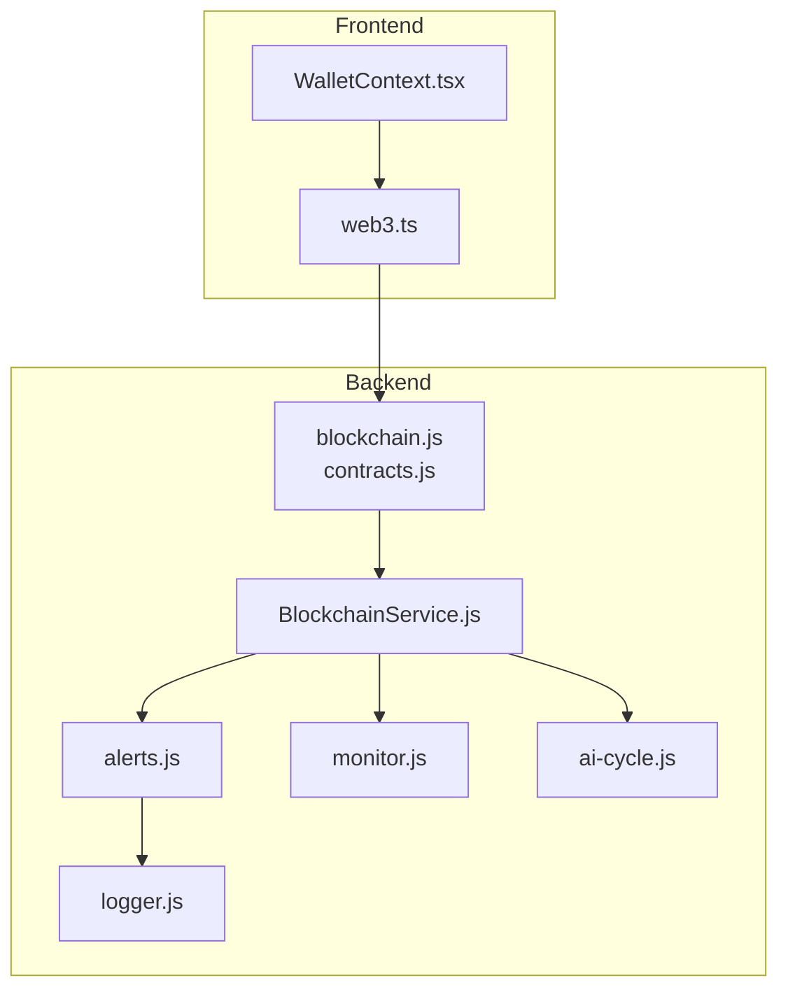
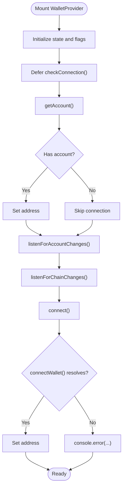
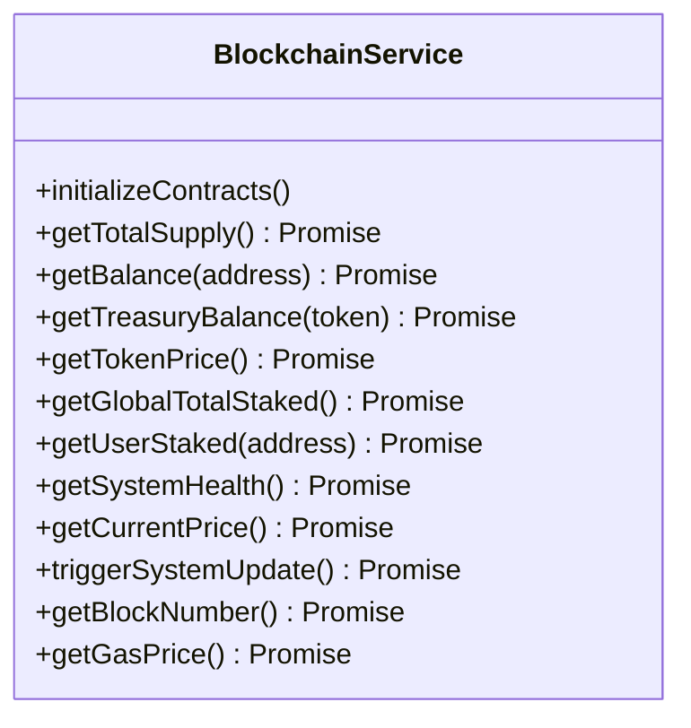
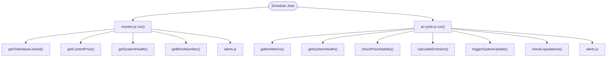
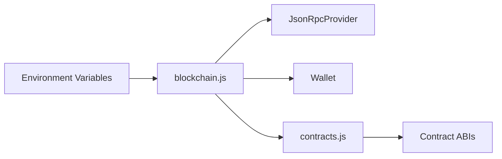
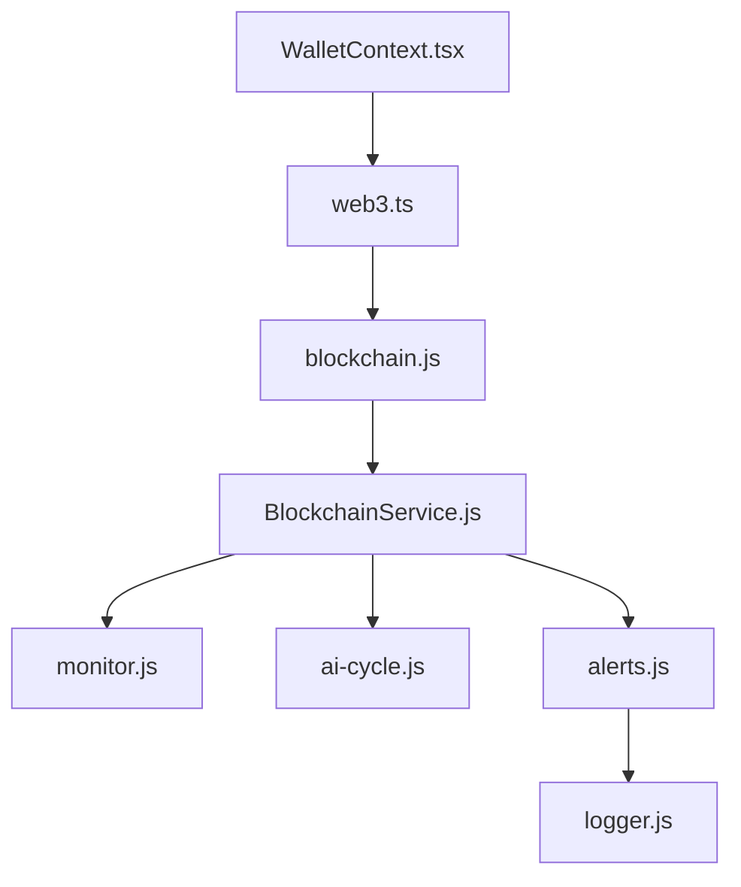

# Troubleshooting and FAQ

<cite>
**Referenced Files in This Document**
- [WalletContext.tsx](file://neurafinance/frontend/src/contexts/WalletContext.tsx)
- [web3.ts](file://neurafinance/frontend/src/utils/web3.ts)
- [BlockchainService.js](file://neurafinance/backend/src/services/BlockchainService.js)
- [alerts.js](file://neurafinance/backend/src/utils/alerts.js)
- [logger.js](file://neurafinance/backend/src/utils/logger.js)
- [monitor.js](file://neurafinance/backend/src/jobs/monitor.js)
- [ai-cycle.js](file://neurafinance/backend/src/jobs/ai-cycle.js)
- [blockchain.js](file://neurafinance/backend/src/config/blockchain.js)
- [contracts.js](file://neurafinance/backend/src/config/contracts.js)
- [FAQ.tsx](file://neurafinance/frontend/src/components/FAQ.tsx)
</cite>

## Table of Contents
1. [Introduction](#introduction)
2. [Project Structure](#project-structure)
3. [Core Components](#core-components)
4. [Architecture Overview](#architecture-overview)
5. [Detailed Component Analysis](#detailed-component-analysis)
6. [Dependency Analysis](#dependency-analysis)
7. [Performance Considerations](#performance-considerations)
8. [Troubleshooting Guide](#troubleshooting-guide)
9. [Conclusion](#conclusion)
10. [Appendices](#appendices)

## Introduction
This Troubleshooting and FAQ section focuses on diagnosing and resolving common issues in the NeuraFinance ecosystem. It covers wallet connection problems, transaction failures, performance optimization, and system monitoring. It also documents the alerting system configuration, error handling patterns, and debugging methodologies. The guide uses terminology consistent with the codebase, including “wallet context,” “alert system,” “error handling,” and “performance optimization.”

## Project Structure
The NeuraFinance ecosystem comprises:
- Frontend wallet context and web3 utilities for MetaMask integration and provider management
- Backend services for blockchain interactions, monitoring, and alerting
- Configuration files for RPC providers, private keys, and contract ABIs
- Monitoring jobs that periodically evaluate system health and emit alerts



**Diagram sources**
- [WalletContext.tsx:17-93](file://neurafinance/frontend/src/contexts/WalletContext.tsx#L17-L93)
- [web3.ts:1-118](file://neurafinance/frontend/src/utils/web3.ts#L1-L118)
- [blockchain.js:1-33](file://neurafinance/backend/src/config/blockchain.js#L1-L33)
- [contracts.js:1-146](file://neurafinance/backend/src/config/contracts.js#L1-L146)
- [BlockchainService.js:1-216](file://neurafinance/backend/src/services/BlockchainService.js#L1-L216)
- [alerts.js:1-82](file://neurafinance/backend/src/utils/alerts.js#L1-L82)
- [logger.js:1-28](file://neurafinance/backend/src/utils/logger.js#L1-L28)
- [monitor.js:1-141](file://neurafinance/backend/src/jobs/monitor.js#L1-L141)
- [ai-cycle.js:1-177](file://neurafinance/backend/src/jobs/ai-cycle.js#L1-L177)

**Section sources**
- [WalletContext.tsx:1-102](file://neurafinance/frontend/src/contexts/WalletContext.tsx#L1-L102)
- [web3.ts:1-118](file://neurafinance/frontend/src/utils/web3.ts#L1-L118)
- [blockchain.js:1-33](file://neurafinance/backend/src/config/blockchain.js#L1-L33)
- [contracts.js:1-146](file://neurafinance/backend/src/config/contracts.js#L1-L146)
- [BlockchainService.js:1-216](file://neurafinance/backend/src/services/BlockchainService.js#L1-L216)
- [alerts.js:1-82](file://neurafinance/backend/src/utils/alerts.js#L1-L82)
- [logger.js:1-28](file://neurafinance/backend/src/utils/logger.js#L1-L28)
- [monitor.js:1-141](file://neurafinance/backend/src/jobs/monitor.js#L1-L141)
- [ai-cycle.js:1-177](file://neurafinance/backend/src/jobs/ai-cycle.js#L1-L177)

## Core Components
- Wallet context and web3 utilities manage MetaMask provider initialization, account and chain listeners, and network switching.
- Blockchain service encapsulates contract interactions, gas estimation, and error logging.
- Alert system and logger centralize alert dispatch and structured logging.
- Monitoring and AI cycle jobs orchestrate periodic checks and system updates.

**Section sources**
- [WalletContext.tsx:17-93](file://neurafinance/frontend/src/contexts/WalletContext.tsx#L17-L93)
- [web3.ts:1-118](file://neurafinance/frontend/src/utils/web3.ts#L1-L118)
- [BlockchainService.js:1-216](file://neurafinance/backend/src/services/BlockchainService.js#L1-L216)
- [alerts.js:1-82](file://neurafinance/backend/src/utils/alerts.js#L1-L82)
- [logger.js:1-28](file://neurafinance/backend/src/utils/logger.js#L1-L28)
- [monitor.js:1-141](file://neurafinance/backend/src/jobs/monitor.js#L1-L141)
- [ai-cycle.js:1-177](file://neurafinance/backend/src/jobs/ai-cycle.js#L1-L177)

## Architecture Overview
The system integrates frontend wallet context with backend services via RPC and smart contracts. Alerts and logs propagate operational insights and errors.

```mermaid
sequenceDiagram
participant UI as "WalletContext.tsx"
participant Web3 as "web3.ts"
participant Cfg as "blockchain.js"
participant Svc as "BlockchainService.js"
participant Mon as "monitor.js"
participant Aic as "ai-cycle.js"
participant Log as "logger.js"
participant Alt as "alerts.js"
UI->>Web3 : "connectWallet()"
Web3-->>UI : "address or null"
UI->>Svc : "invoke contract methods"
Svc->>Cfg : "provider/wallet/contract"
Svc-->>Mon : "metrics"
Svc-->>Aic : "health/price/staking"
Svc-->>Alt : "emit alerts"
Alt->>Log : "structured log"
```

**Diagram sources**
- [WalletContext.tsx:61-77](file://neurafinance/frontend/src/contexts/WalletContext.tsx#L61-L77)
- [web3.ts:27-40](file://neurafinance/frontend/src/utils/web3.ts#L27-L40)
- [blockchain.js:5-8](file://neurafinance/backend/src/config/blockchain.js#L5-L8)
- [BlockchainService.js:18-37](file://neurafinance/backend/src/services/BlockchainService.js#L18-L37)
- [monitor.js:99-110](file://neurafinance/backend/src/jobs/monitor.js#L99-L110)
- [ai-cycle.js:19-84](file://neurafinance/backend/src/jobs/ai-cycle.js#L19-L84)
- [alerts.js:10-30](file://neurafinance/backend/src/utils/alerts.js#L10-L30)
- [logger.js:3-16](file://neurafinance/backend/src/utils/logger.js#L3-L16)

## Detailed Component Analysis

### Wallet Context and Provider Management
- Initialization defers wallet checks to avoid blocking initial render.
- Listeners subscribe to account and chain changes; cleanup removes listeners on unmount.
- Connection attempts handle MetaMask absence and errors.



**Diagram sources**
- [WalletContext.tsx:23-77](file://neurafinance/frontend/src/contexts/WalletContext.tsx#L23-L77)

**Section sources**
- [WalletContext.tsx:17-93](file://neurafinance/frontend/src/contexts/WalletContext.tsx#L17-L93)
- [web3.ts:27-40](file://neurafinance/frontend/src/utils/web3.ts#L27-L40)

### Blockchain Service and Error Handling
- Centralized contract method wrappers with try/catch and structured logging.
- Methods return null or default values on failure to prevent cascading errors.
- Gas and block number queries are exposed for diagnostics.



**Diagram sources**
- [BlockchainService.js:12-216](file://neurafinance/backend/src/services/BlockchainService.js#L12-L216)

**Section sources**
- [BlockchainService.js:1-216](file://neurafinance/backend/src/services/BlockchainService.js#L1-L216)

### Alert System and Logging
- AlertService formats and dispatches alerts to configured webhook/email and logs warnings.
- Specific alert types include low treasury balance, price deviation, unhealthy loan, low system health, and AI cycle completion.
- Logger uses Winston with file and console transports and JSON formatting.

```mermaid
sequenceDiagram
participant Svc as "BlockchainService.js"
participant Alt as "alerts.js"
participant Log as "logger.js"
Svc->>Alt : "lowTreasuryBalance()/priceDeviation()/..."
Alt->>Log : "warn(...)"
alt "ALERT_WEBHOOK_URL configured"
Alt->>Alt : "axios.post(webhookUrl, alert)"
end
```

**Diagram sources**
- [alerts.js:10-42](file://neurafinance/backend/src/utils/alerts.js#L10-L42)
- [logger.js:3-16](file://neurafinance/backend/src/utils/logger.js#L3-L16)

**Section sources**
- [alerts.js:1-82](file://neurafinance/backend/src/utils/alerts.js#L1-L82)
- [logger.js:1-28](file://neurafinance/backend/src/utils/logger.js#L1-L28)

### Monitoring and AI Cycle Jobs
- Monitor job runs at intervals, checking treasury TVL, token price, system health, and block number.
- AI cycle job gathers metrics, validates health and price stability, calculates emission, triggers system update, and checks for liquidations.
- Both jobs use structured logging and emit alerts on thresholds or failures.



**Diagram sources**
- [monitor.js:99-110](file://neurafinance/backend/src/jobs/monitor.js#L99-L110)
- [ai-cycle.js:19-84](file://neurafinance/backend/src/jobs/ai-cycle.js#L19-L84)
- [alerts.js:44-78](file://neurafinance/backend/src/utils/alerts.js#L44-L78)

**Section sources**
- [monitor.js:1-141](file://neurafinance/backend/src/jobs/monitor.js#L1-L141)
- [ai-cycle.js:1-177](file://neurafinance/backend/src/jobs/ai-cycle.js#L1-L177)

### Configuration and Environment
- RPC provider and wallet initialized from environment variables.
- Contract addresses loaded from environment and mapped to ABIs.



**Diagram sources**
- [blockchain.js:5-8](file://neurafinance/backend/src/config/blockchain.js#L5-L8)
- [contracts.js:136-145](file://neurafinance/backend/src/config/contracts.js#L136-L145)

**Section sources**
- [blockchain.js:1-33](file://neurafinance/backend/src/config/blockchain.js#L1-L33)
- [contracts.js:1-146](file://neurafinance/backend/src/config/contracts.js#L1-L146)

## Dependency Analysis
- Frontend depends on web3 utilities for provider and signer management.
- Backend services depend on configuration for provider, wallet, and contract ABIs.
- Monitoring and AI cycle jobs depend on BlockchainService and AlertService.
- AlertService depends on Logger.



**Diagram sources**
- [WalletContext.tsx:17-93](file://neurafinance/frontend/src/contexts/WalletContext.tsx#L17-L93)
- [web3.ts:1-118](file://neurafinance/frontend/src/utils/web3.ts#L1-L118)
- [blockchain.js:1-33](file://neurafinance/backend/src/config/blockchain.js#L1-L33)
- [BlockchainService.js:1-216](file://neurafinance/backend/src/services/BlockchainService.js#L1-L216)
- [monitor.js:1-141](file://neurafinance/backend/src/jobs/monitor.js#L1-L141)
- [ai-cycle.js:1-177](file://neurafinance/backend/src/jobs/ai-cycle.js#L1-L177)
- [alerts.js:1-82](file://neurafinance/backend/src/utils/alerts.js#L1-L82)
- [logger.js:1-28](file://neurafinance/backend/src/utils/logger.js#L1-L28)

**Section sources**
- [WalletContext.tsx:1-102](file://neurafinance/frontend/src/contexts/WalletContext.tsx#L1-L102)
- [web3.ts:1-118](file://neurafinance/frontend/src/utils/web3.ts#L1-L118)
- [blockchain.js:1-33](file://neurafinance/backend/src/config/blockchain.js#L1-L33)
- [BlockchainService.js:1-216](file://neurafinance/backend/src/services/BlockchainService.js#L1-L216)
- [alerts.js:1-82](file://neurafinance/backend/src/utils/alerts.js#L1-L82)
- [logger.js:1-28](file://neurafinance/backend/src/utils/logger.js#L1-L28)
- [monitor.js:1-141](file://neurafinance/backend/src/jobs/monitor.js#L1-L141)
- [ai-cycle.js:1-177](file://neurafinance/backend/src/jobs/ai-cycle.js#L1-L177)

## Performance Considerations
- Use batched reads for metrics to reduce RPC calls.
- Cache frequently accessed values (e.g., gas price, block number) with short TTLs.
- Prefer polling intervals aligned with network throughput and alert thresholds.
- Optimize ABI sizes and avoid unnecessary event parsing.
- Use structured logging to minimize overhead and improve observability.

[No sources needed since this section provides general guidance]

## Troubleshooting Guide

### Wallet Connection Issues
Common symptoms:
- “MetaMask not installed” error during connect
- Account not detected after connecting
- Chain mismatch causing transaction failures

Resolution steps:
1. Verify MetaMask is installed and enabled in the browser.
2. Ensure the correct network is selected; use network switching utilities to auto-switch to Polygon Mainnet or Mumbai Testnet.
3. Confirm the account is unlocked and visible in MetaMask.
4. Check that the wallet context is mounted and listeners are registered.
5. Review console logs for explicit errors from connect or provider initialization.

Preventive measures:
- Defer wallet checks until after initial render to avoid blocking.
- Add fallback UI when provider is unavailable.
- Persist and restore chain preferences across sessions.

**Section sources**
- [web3.ts:27-40](file://neurafinance/frontend/src/utils/web3.ts#L27-L40)
- [web3.ts:54-68](file://neurafinance/frontend/src/utils/web3.ts#L54-L68)
- [WalletContext.tsx:23-77](file://neurafinance/frontend/src/contexts/WalletContext.tsx#L23-L77)

### Transaction Failures
Common symptoms:
- Transactions stuck in pending
- Out-of-gas errors
- Revert errors due to insufficient funds or invalid parameters

Resolution steps:
1. Increase gas price or gas limit via fee data retrieval.
2. Verify sufficient balance and allowance approvals.
3. Confirm contract addresses and method parameters are correct.
4. Inspect transaction receipts and revert reasons via RPC explorer.
5. Retry with adjusted parameters after cooldown.

Preventive measures:
- Fetch and display fee data before signing.
- Validate inputs and balances client-side.
- Use transaction simulation where possible.

**Section sources**
- [BlockchainService.js:206-208](file://neurafinance/backend/src/services/BlockchainService.js#L206-L208)
- [blockchain.js:5-8](file://neurafinance/backend/src/config/blockchain.js#L5-L8)

### System Monitoring and Alerting
Common symptoms:
- Alerts for low treasury balance or price deviation
- System health score degradation
- AI cycle failures or missing completions

Resolution steps:
1. Review alert logs and timestamps to correlate events.
2. Investigate treasury TVL, token price, and system health metrics.
3. Check AI cycle logs for failed validations or reverts.
4. Validate webhook/email configuration for alert delivery.

Preventive measures:
- Tune monitoring intervals and thresholds.
- Implement alert deduplication and escalation policies.
- Back up alert payloads for forensic analysis.

**Section sources**
- [monitor.js:21-84](file://neurafinance/backend/src/jobs/monitor.js#L21-L84)
- [ai-cycle.js:19-84](file://neurafinance/backend/src/jobs/ai-cycle.js#L19-L84)
- [alerts.js:44-78](file://neurafinance/backend/src/utils/alerts.js#L44-L78)
- [logger.js:3-16](file://neurafinance/backend/src/utils/logger.js#L3-L16)

### Error Handling Patterns
Common symptoms:
- Silent failures in contract calls
- Unhandled exceptions in UI or backend

Resolution steps:
1. Wrap contract calls with try/catch and log errors with context.
2. Return null or default values to prevent cascading failures.
3. Surface user-friendly messages while preserving technical details in logs.
4. Use structured logging to capture stack traces and metadata.

Preventive measures:
- Centralize error handling in services and utilities.
- Define consistent error response formats.
- Instrument async flows with proper error propagation.

**Section sources**
- [BlockchainService.js:40-46](file://neurafinance/backend/src/services/BlockchainService.js#L40-L46)
- [BlockchainService.js:115-121](file://neurafinance/backend/src/services/BlockchainService.js#L115-L121)
- [logger.js:3-16](file://neurafinance/backend/src/utils/logger.js#L3-L16)

### Debugging Methodologies
Beginner-friendly:
- Enable browser console and inspect network requests.
- Use MetaMask logs and transaction receipts.
- Check backend logs for alert entries and error stacks.

Advanced:
- Add tracing spans around critical paths.
- Capture and replay failing transactions with identical parameters.
- Use testnets to reproduce and validate fixes before mainnet.

**Section sources**
- [logger.js:3-16](file://neurafinance/backend/src/utils/logger.js#L3-L16)
- [alerts.js:10-30](file://neurafinance/backend/src/utils/alerts.js#L10-L30)

### Frequently Asked Questions
- What is the wallet context?
  - The wallet context manages connection state, account, and chain information for the frontend.

- How do I configure the alert system?
  - Provide environment variables for webhook URL and email; alerts are dispatched automatically on thresholds.

- What causes transaction failures?
  - Common causes include insufficient funds, incorrect parameters, out-of-gas, or chain mismatch.

- How often does the system monitor and update?
  - Monitoring runs at a configurable interval; AI cycles run at a fixed cadence.

**Section sources**
- [FAQ.tsx:1-82](file://neurafinance/frontend/src/components/FAQ.tsx#L1-L82)
- [monitor.js:112-124](file://neurafinance/backend/src/jobs/monitor.js#L112-L124)
- [ai-cycle.js:148-160](file://neurafinance/backend/src/jobs/ai-cycle.js#L148-L160)

## Conclusion
This guide consolidates practical troubleshooting and FAQs for the NeuraFinance ecosystem. By leveraging the wallet context, robust error handling, structured logging, and alerting, teams can diagnose issues quickly and maintain system reliability. Apply the recommended performance optimizations and monitoring adjustments to sustain long-term operation.

[No sources needed since this section summarizes without analyzing specific files]

## Appendices

### Quick Reference: Common Errors and Remedies
- MetaMask not installed: Install and enable MetaMask; ensure provider availability.
- No account returned: Unlock MetaMask and refresh page.
- Chain mismatch: Switch to Polygon Mainnet or Mumbai Testnet using built-in utilities.
- RPC errors: Verify RPC URL and rate limits; retry with exponential backoff.
- Alert flood: Adjust thresholds and deduplication; validate webhook/email endpoints.

**Section sources**
- [web3.ts:54-68](file://neurafinance/frontend/src/utils/web3.ts#L54-L68)
- [blockchain.js:5-8](file://neurafinance/backend/src/config/blockchain.js#L5-L8)
- [alerts.js:10-30](file://neurafinance/backend/src/utils/alerts.js#L10-L30)